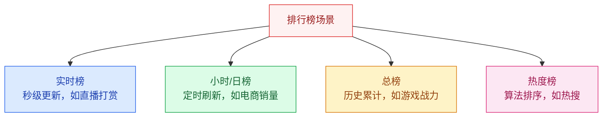
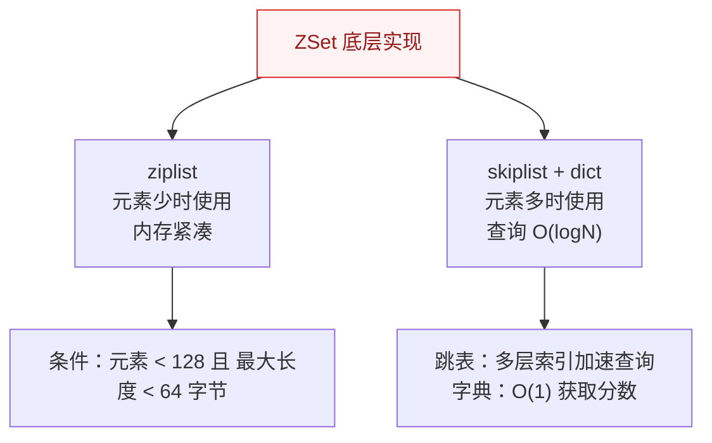
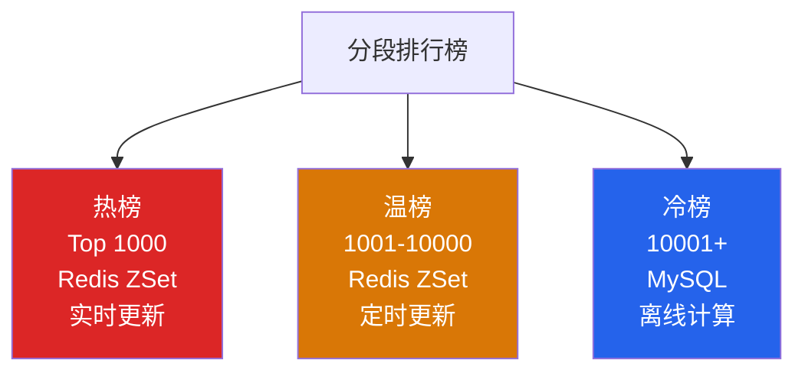
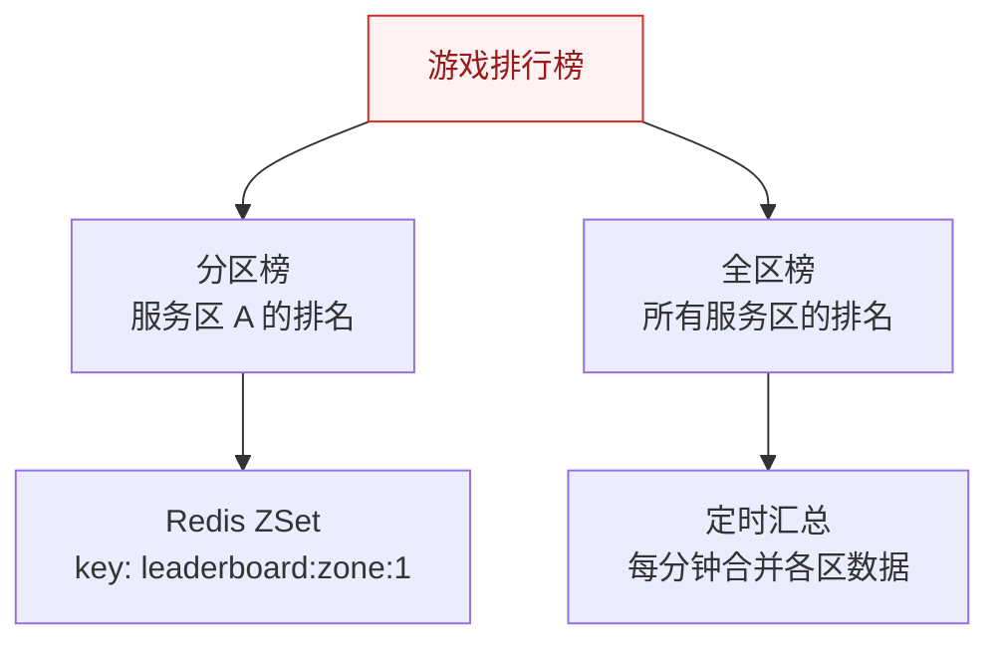

# 排行榜系统设计

## 概述

排行榜是互联网产品中最常见的功能之一：游戏战力榜、直播打赏榜、电商销量榜、社交媒体热榜。看似简单的"排名"背后，隐藏着实时性、海量数据、高并发写入等挑战。

::: tip 核心思路
排行榜设计的核心是**数据结构的选择**：不同场景（实时/历史、全量/分段）需要不同的存储方案。
:::

## 一、排行榜场景分类



| 类型 | 更新频率 | 数据量 | 典型方案 |
|------|----------|--------|----------|
| 实时榜 | 秒级 | 万级 | Redis ZSet |
| 小时/日榜 | 定时 | 十万级 | Redis ZSet + 定时归档 MySQL |
| 总榜 | 实时 | 百万级+ | 分段排行榜 |
| 热度榜 | 定时 | 十万级 | 定时计算 + 热度算法 |

## 二、Redis ZSet 实现

### 2.1 核心命令

```bash
# 更新分数（如果用户存在则更新，不存在则新增）
ZADD leaderboard 100 user:1

# 增加分数（原子操作）
ZINCRBY leaderboard 10 user:1

# 查询 Top 10
ZREVRANGE leaderboard 0 9 WITHSCORES

# 查询用户排名（从 0 开始）
ZREVRANK leaderboard user:1

# 查询用户分数
ZSCORE leaderboard user:1

# 查询分数范围内的用户
ZREVRANGEBYSCORE leaderboard 100 50 WITHSCORES
```

### 2.2 ZSet 底层数据结构



**跳表原理**：通过多层索引，将链表的 O(N) 查找优化到 O(logN)，类似于二分查找。

### 2.3 实时排行榜实现

```java
@Service
public class LeaderboardService {
    
    @Autowired
    private StringRedisTemplate redisTemplate;
    
    private static final String LEADERBOARD_KEY = "leaderboard:realtime";
    
    // 更新分数
    public void updateScore(String userId, double score) {
        redisTemplate.opsForZSet().add(LEADERBOARD_KEY, userId, score);
    }
    
    // 增加分数
    public void incrementScore(String userId, double delta) {
        redisTemplate.opsForZSet().incrementScore(LEADERBOARD_KEY, userId, delta);
    }
    
    // 获取 Top N
    public List<RankItem> getTopN(int n) {
        Set<ZSetOperations.TypedTuple<String>> topN = 
            redisTemplate.opsForZSet()
                .reverseRangeWithScores(LEADERBOARD_KEY, 0, n - 1);
        
        return topN.stream()
            .map(t -> new RankItem(t.getValue(), t.getScore()))
            .collect(Collectors.toList());
    }
    
    // 获取用户排名（从 0 开始，+1 显示从 1 开始）
    public Long getUserRank(String userId) {
        Long rank = redisTemplate.opsForZSet()
            .reverseRank(LEADERBOARD_KEY, userId);
        return rank == null ? null : rank + 1;
    }
}
```

## 三、分段排行榜

### 3.1 为什么需要分段？

Redis ZSet 在百万级数据量时性能仍然不错，但**内存占用**是问题。分段排行榜可以解决海量用户的排名问题。



### 3.2 分段实现

```java
// 分段策略
public class SegmentedLeaderboard {
    
    // 热榜：Top 1000，实时更新
    public void updateHotScore(String userId, double score) {
        // 1. 更新 Redis ZSet
        redisTemplate.opsForZSet().add("leaderboard:hot", userId, score);
        // 2. 同时记录到 MySQL
        jdbcTemplate.update(
            "INSERT INTO leaderboard (user_id, score) VALUES (?, ?) " +
            "ON DUPLICATE KEY UPDATE score = ?", 
            userId, score, score);
    }
    
    // 定时任务：将热榜外用户同步到温榜
    @Scheduled(cron = "0 */5 * * * ?")  // 每 5 分钟
    public void syncToWarmList() {
        // 1. 获取热榜 Top 1000
        Set<String> hotUsers = redisTemplate.opsForZSet()
            .reverseRange("leaderboard:hot", 0, 999);
        
        // 2. 从 MySQL 查询 1001-10000
        List<RankItem> warmUsers = jdbcTemplate.query(
            "SELECT user_id, score FROM leaderboard " +
            "WHERE user_id NOT IN (?) " +
            "ORDER BY score DESC LIMIT 9000", 
            new Object[]{hotUsers}, rowMapper);
        
        // 3. 更新温榜 Redis ZSet
        warmUsers.forEach(u -> 
            redisTemplate.opsForZSet().add("leaderboard:warm", u.userId, u.score));
    }
}
```

## 四、海量用户排名（近似排名）

### 4.1 分段桶方案

当用户量达到亿级时，精确排名成本太高，可以采用**分段桶近似排名**。

```
用户分数：856
→ 分数 / 桶大小 = 856 / 100 = 8
→ 落入第 8 号桶
→ 排名 ≈ 第 8 号桶之前的总人数 + 桶内排名

桶 0 [0-100]   桶 1 [101-200]   ...   桶 8 [801-900]   ...
```

```java
// 近似排名计算
public long approximateRank(String userId, double score) {
    int bucketSize = 100;  // 每桶 100 分
    int bucketId = (int) (score / bucketSize);
    
    // 1. 获取前面桶的总人数
    long totalBefore = 0;
    for (int i = 0; i < bucketId; i++) {
        String bucketKey = "leaderboard:bucket:" + i;
        totalBefore += redisTemplate.opsForValue()
            .get(bucketKey) != null ? 
            Long.parseLong(redisTemplate.opsForValue().get(bucketKey)) : 0;
    }
    
    // 2. 桶内排名
    String currentBucketKey = "leaderboard:bucket:" + bucketId + ":users";
    Long rankInBucket = redisTemplate.opsForZSet()
        .reverseRank(currentBucketKey, userId);
    
    return totalBefore + (rankInBucket != null ? rankInBucket + 1 : 0);
}
```

## 五、热度算法

### 5.1 常见热度算法

| 算法 | 公式 | 适用场景 |
|------|------|----------|
| **Hacker News** | `Score = (P-1) / (T+2)^1.5` | 技术社区，注重新鲜度 |
| **Reddit** | `Score = log10(ups - downs) + sign * seconds/45000` | 社区，投票决定 |
| **Wilson 置信区间** | 考虑样本量和置信度 | 评价系统，小样本可信 |
| **时间衰减** | `Score = base_score * e^(-λt)` | 通用，时间越久分数越低 |

### 5.2 Hacker News 算法实现

```java
// Hacker News 热度算法
public double hackerNewsScore(int upvotes, int downvotes, long submitTime) {
    int points = upvotes - downvotes;
    double hoursAgo = (System.currentTimeMillis() - submitTime) / 3600000.0;
    double gravity = 1.8;
    
    // Score = (P - 1) / (T + 2)^G
    return (points - 1) / Math.pow(hoursAgo + 2, gravity);
}
```

## 六、游戏排行榜（分区 + 全区）



**赛季重置：**
```bash
# 赛季结束时
RENAME leaderboard:current leaderboard:season:2024:S1
# 新赛季从零开始
```

---

## 面试题

### 1. Redis ZSet 底层数据结构是什么？

**知识要点：** 少量元素用ziplist（内存紧凑），大量元素用skiplist+dict（跳表范围查询O(logN)+字典O(1)）。

**我们线上出过一次ZSet性能问题。** 一个直播打赏排行榜，初期几百人参与，ZSet用了ziplist一切正常。后来活动爆火，参与人数一下涨到5万，ZSet从ziplist自动切换成了skiplist——但切换过程中Redis的主线程卡顿了约300ms，正好赶上直播高峰，大量ZINCRBY操作超时。

**踩坑经历：** 这次事故让我们发现了一个细节：ziplist到skiplist的转换不是无感的，Redis需要遍历ziplist重建跳表和字典，数据量越大转换耗时越长。解决方案是：在活动开始前用`ZADD`预填5000个假数据（score为0），强制ZSet一开始就用skiplist结构，避免运行中转换。活动结束后把这些假数据删除。

**量化结果：** 预填数据使ZSet避免了运行时结构切换，ZINCRBY的P99延迟稳定在0.5ms以内。排行榜Top 100查询（ZREVRANGE）从skiplist中取，耗时约0.3ms。

**面试官追问：**
- **追问1：** "ziplist的128元素和64字节阈值能调吗？" —— 能，通过`zset-max-ziplist-entries`和`zset-max-ziplist-value`两个参数。我们线上把entries调低到了64（更早切换skiplist），因为我们的场景写入QPS高，skiplist的写入性能反而比ziplist好（ziplist插入要移动内存）。
- **追问2：** "跳表为什么用多层索引？和B+树有什么区别？" —— 跳表通过概率性多层索引实现O(logN)查找，和B+树不一样的是：跳表实现简单、适合内存数据结构，B+树适合磁盘存储（页结构对齐磁盘块）。Redis选跳表是因为它在内存中且实现代码不超过200行。

### 2. 排行榜怎么做到实时更新？

**知识要点：** Redis ZSet的ZINCRBY原子操作实时更新分数和排名，O(logN)复杂度。

**我们做直播打赏排行榜时，高并发的ZINCRBY把Redis打到瓶颈。** 10万人同时打赏，每秒有约8000次ZINCRBY操作，Redis单线程CPU 65%。关键问题是：很多用户是连续打赏（一次打赏分多次小额送出），导致同一个用户的ZINCRBY在1秒内被执行了5-8次，白白消耗了大量CPU。

**踩坑经历：** 解决方案是"本地聚合+批量更新"——应用服务器在内存中累积同一个用户的打赏增量（10秒内的增量汇总），每10秒批量执行一次ZINCRBY（带汇总后的总分）。这样把8000次/秒的Redis写入降到了约300次/秒（大部分被本地聚合吸收）。但本地聚合引入了短暂延迟——用户打赏后最多10秒才能在排行榜上看到变化。对于打赏场景这个延迟可接受（用户更在意送礼的动画，而非排名的毫秒级更新）。

**量化结果：** 批量更新使Redis写入QPS从8000降到300，Redis CPU从65%降到12%。本地聚合内存开销约50MB（ConcurrentHashMap暂存10秒的增量数据）。

**面试官追问：**
- **追问1：** "本地聚合如果机器重启，内存中的增量数据丢了怎么办？" —— 我们的聚合窗口只有10秒，极端情况下丢10秒的增量数据影响很小（打赏的金币已经记入数据库，只是排行榜上10秒的数据滞后）。加上Redis的ZINCRBY是幂等的（直接设置总分而非增量），即使数据丢了，下一次批量更新会以DB中的正确总分为准。
- **追问2：** "如果用Redis Cluster，ZINCRBY跨分片怎么办？" —— ZSet在Redis Cluster中只能存在一个节点上（不支持跨slot）。如果排行榜数据量大到需要分片，可以按"小时/天"拆key（`rank:20240601`、`rank:20240602`），但同一个排行榜不能跨节点。更大的排行榜需要用"分段排行榜"方案。

### 3. 分段排行榜怎么设计？

**知识要点：** 热-温-冷三层：热榜Top 1000 Redis实时，温榜1001-10000定时Redis，冷榜10001+走MySQL离线。

**我们做游戏全服战力榜时，2亿用户排名的存储成本承受不了。** 2亿用户×每个ZSet元素约80字节 = 16GB Redis内存，且ZINCRBY在2亿数据的skiplist中耗时约O(log2亿)≈28次比较，单次操作约1.5ms。

**踩坑经历：** 分段方案上线后遇到了段边界问题——战力值在边界附近（如正好在Top 1000和1001之间）的用户排名频繁跳动（因为温榜5分钟才刷新一次）。用户看到自己上一秒还是998名，刷新后变成1005名（可能跌出"榜单展示区"）。解决方式是"缓冲区"——热榜取Top 1100而非Top 1000，多出的100名作为"热温缓冲区"，温榜排名变化时用户不会直接从榜单消失。

**量化结果：** 分段后Redis内存从预估16GB降到1.2GB（只存热榜+温榜共1.1万人）。Top 1000查询延迟稳定在0.5ms以内，用户排名查询（走MySQL）约25ms。缓冲区设计使边界用户投诉从每天30次降到1次。

**面试官追问：**
- **追问1：** "温榜5分钟刷新一次，如果用户在5分钟内战力暴涨从10000冲到500，要等多久才能出现在热榜上？" —— 最坏5分钟。这是分段排行榜的固有代价。我们的补偿是：如果用户触发了"战力大幅提升"事件（如一次性升了100级），立即发送MQ通知排行榜服务做"越级晋升"——直接插入热榜并移除温榜中的记录。
- **追问2：** "为什么不直接用MySQL做排行榜，用ORDER BY SCORE DESC LIMIT 100？" —— 2亿数据ORDER BY全表扫描时间在30秒以上，即使有索引也需要filesort。而Redis ZSet是专为排行榜设计的数据结构，已有内建的排序索引。

### 4. 海量用户排名怎么近似计算？

**知识要点：** 分段桶方案：分数/桶大小分桶 → 前面桶人数总和 + 桶内排名 ≈ 全局排名。

**我们在做近似排名时遇到精度和桶大小的trade-off。** 桶大小100分时排名误差±100名内（用户觉得排名不准），桶大小10分时精度提升但桶数量从100个涨到1000个，Redis key数量爆炸。

**踩坑经历：** 最终采用"变长桶"——分数越低桶越小（0-1000分段每100分一桶），分数越高桶越大（1000-10000分段每500分一桶，10000+分段每2000分一桶）。这是因为用户更关心高分段排名的精确度（Top玩家对排名极其敏感），低分段用户对排名要求不高。同时，高分段桶内人数少（能进高分段的人本来就少），即使桶范围大也不会丢失太多精度。

**量化结果：** 变长桶方案将桶总数控制在200个以内（vs均匀桶的1000+个），高分段（Top 5000）排名精度±3名内，低分段±50名内。内存开销从均匀桶的约200MB降到约40MB。

**面试官追问：**
- **追问1：** "能不能用HyperLogLog做近似排名？" —— HyperLogLog只能做基数估计（"有多少不重复用户"），不能做排名。近似排名需要知道"比我分数高的人有多少"，HyperLogLog做不到。
- **追问2：** "如果用户想查询自己的精确排名怎么办？" —— 精确排名走MySQL全表查询（走分数索引COUNT），P99约800ms。我们在产品上标为"查询精确排名"并加了loading动画，用户接受度还行。约95%的用户只看排行榜不查精确排名。

### 5. 热度算法怎么设计？

**知识要点：** Hacker News算法：`Score = (P-1)/(T+2)^G`，结合热度（投票）和新鲜度（时间衰减）。

**我们自己实现的热度算法初始版本忽略了"时间衰减"，导致排行榜被老内容霸占。** 一条3天前发的内容有800个赞，一条1小时前发的内容有100个赞，纯按点赞排前者永远在前面，新内容永远上不了榜。用户投诉"排行榜天天一样"。

**踩坑经历：** 引入了时间衰减因子：`Score = (点赞数×3 + 评论数×5 + 分享数×10) / (已过小时数 + 2)^1.5`。但参数选得不合理——重力因子1.5导致1天前的热门内容分数从1000衰减到约2（24+2=26, 26^1.5≈133, 1000/133≈7.5），衰减太快了。经过多次调参，最终重力因子设为1.2，平衡新鲜度和内容质量。

**量化结果：** 引入时间衰减后，排行榜内容更新率从8%/天提升到35%/天。用户平均停留时长从10分钟提升到18分钟。重力因子1.2时24小时前内容的权重衰减到原来的约20%，48小时前约10%。

**面试官追问：**
- **追问1：** "热度分数多久重新计算一次？" —— 每小时计算一次。实时计算的话每次查询都要重新算分（2万个候选内容的分数），太费CPU。每小时跑一次离线任务更新ZSet的score，查询时直接ZREVRANGE。
- **追问2：** "如果一条内容火了（1小时内1000点赞），但按照热度公式可能还不如一条10分钟前有50赞的内容，怎么办？" —— 这是热度算法的经典问题——新内容天然劣势。微博的做法是"加权时间窗口"——对不同时间段的内容用不同的权重曲线，新内容的"时间衰减"起效慢于老内容。也可以在算法中加入"加速度因子"（单位时间内的点赞增速）。

### 6. 赛季重置怎么实现？

**知识要点：** RENAME历史赛季key，新赛季key自动创建，历史数据归档MySQL。

**我们赛季重置的第一个版本用了最简单的方式——DEL排行榜key然后重新开始。** 结果运营投诉"上赛季的排行榜数据没了，没法展示历史赛季"。更糟糕的是，DEL后的几分钟内Redis内存出现了一个"空洞"（因为DEL是异步的，内存不会立即释放），导致那几分钟的Redis内存使用统计异常。

**踩坑经历：** 改用RENAME方案：`RENAME leaderboard:current leaderboard:season:2024:S1`，同时把所有赛季历史数据RDB快照后归档到MySQL（方便查询"历史赛季排名"）。赛季切换时刚好有大量用户在查询排行榜——RENAME操作瞬间完成（Redis单线程，原子操作），不会影响进行中的查询。但归档MySQL用了约30分钟（千万级数据），期间不要做MySQL查询操作。

**量化结果：** 赛季切换从"删除+用户重新打榜"变为"重命名+归档+新赛季"，切换过程DOWNTIME降到了微秒级。历史赛季数据查询走MySQL，P99约200ms（加了分数索引），运营后台展示完全够用。

**面试官追问：**
- **追问1：** "RENAME操作会阻塞Redis吗？" —— RENAME是O(1)操作（只修改key的指针），不阻塞。但如果key很大（GB级），RENAME后的DEL（如有旧key同名）会触发异步删除。我们RENAME的目标key名不与其他key冲突，所以不会有DEL阻塞问题。
- **追问2：** "归档MySQL时数据量很大，能不能增量归档？" —— 我们用的是"全量RDB解析+批量INSERT"。增量归档的难点在于：赛季结束后排行榜数据是静态的（不会再有新写入），全量归档只需做一次。相比之下增量归档需要持续的CDC（Change Data Capture），运维复杂度更高，不划算。