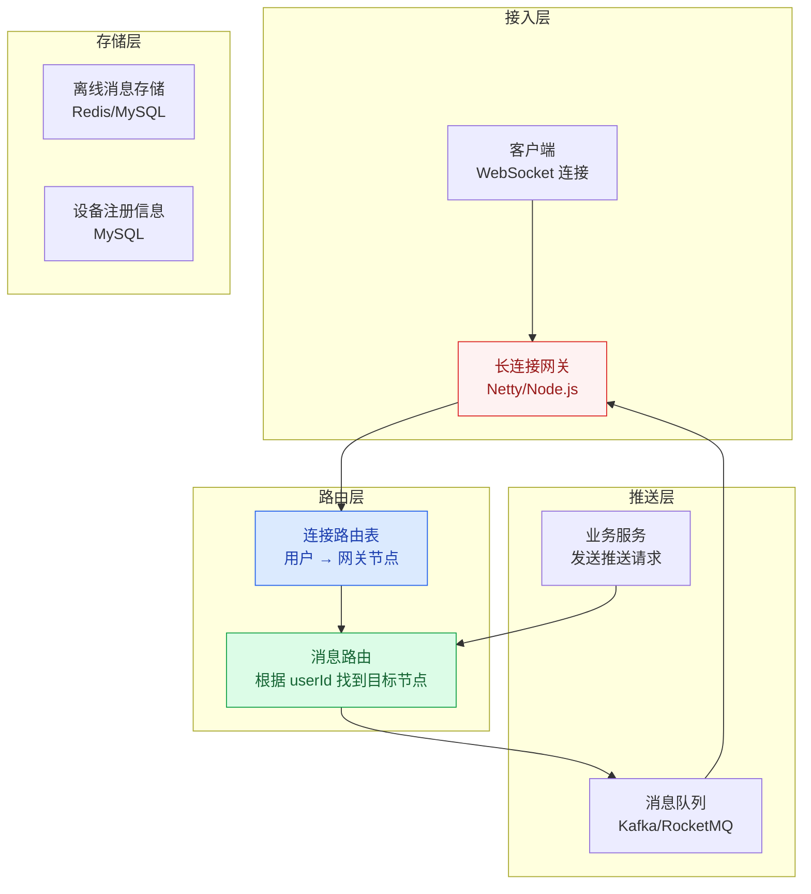
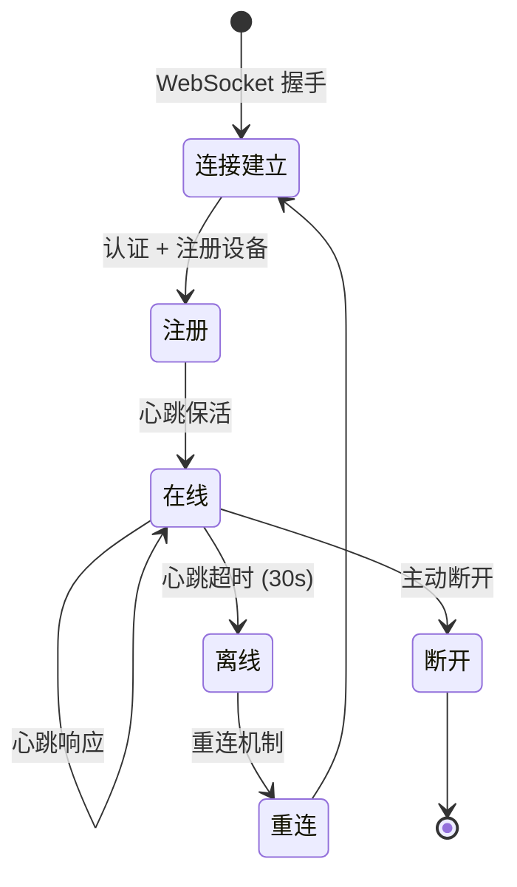
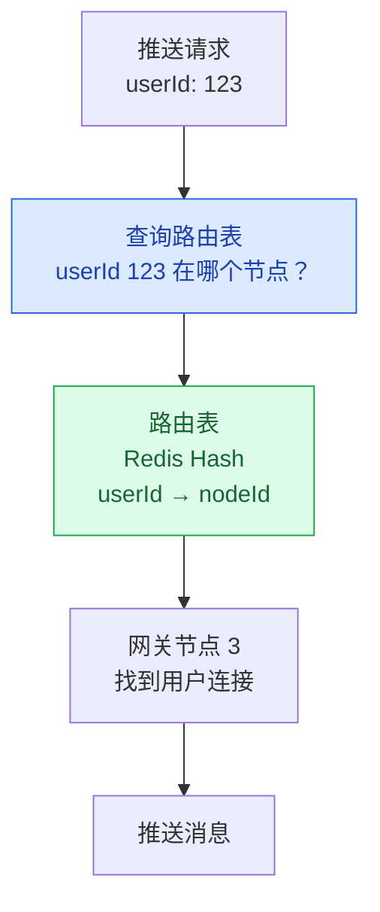
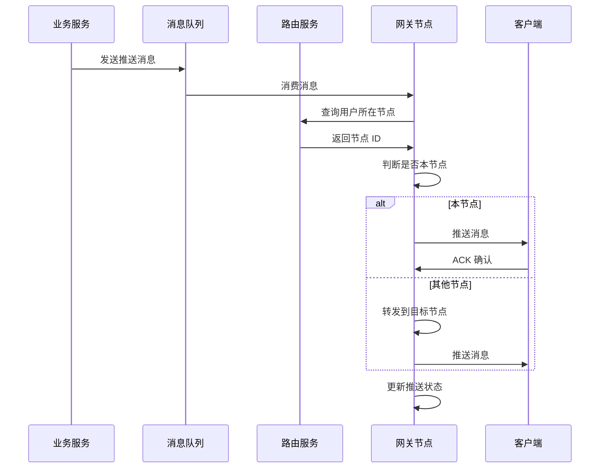

# 消息推送系统设计

## 概述

消息推送系统是高并发架构中的经典场景，从 App 推送通知到 WebSocket 实时消息，再到站内信，都属于推送系统的范畴。核心挑战在于：**如何管理海量长连接、如何保证消息可靠投递、如何应对百万级并发推送**。

::: tip 核心思路
推送系统 = **长连接管理** + **消息路由** + **可靠投递** + **多通道降级**。
:::

## 一、推送系统架构



## 二、WebSocket 长连接管理

### 2.1 连接生命周期



### 2.2 连接管理实现

```java
@Component
public class ConnectionManager {
    
    // userId -> 连接列表（支持多设备）
    private final ConcurrentHashMap<String, List<WebSocketSession>> 
        userConnections = new ConcurrentHashMap<>();
    
    // sessionId -> userId（反向索引）
    private final ConcurrentHashMap<String, String> 
        sessionUserMap = new ConcurrentHashMap<>();
    
    // 连接建立
    public void onConnect(String userId, WebSocketSession session) {
        userConnections.computeIfAbsent(userId, k -> 
            new CopyOnWriteArrayList<>()).add(session);
        sessionUserMap.put(session.getId(), userId);
        
        // 注册到连接路由表
        registerRoute(userId, getLocalNodeId());
    }
    
    // 连接断开
    public void onDisconnect(WebSocketSession session) {
        String userId = sessionUserMap.remove(session.getId());
        if (userId != null) {
            userConnections.get(userId).remove(session);
            if (userConnections.get(userId).isEmpty()) {
                userConnections.remove(userId);
                // 从路由表移除
                unregisterRoute(userId);
            }
        }
    }
    
    // 心跳检测
    @Scheduled(fixedDelay = 15000)  // 每 15 秒
    public void heartbeatCheck() {
        long now = System.currentTimeMillis();
        sessionUserMap.forEach((sessionId, userId) -> {
            WebSocketSession session = getSession(sessionId);
            if (now - session.getLastActiveTime() > 30000) {
                // 30 秒无心跳，断开连接
                session.close();
            }
        });
    }
}
```

## 三、连接路由表

### 3.1 为什么需要路由表？

长连接网关通常是多节点部署的，用户的连接可能在任何一台网关上。当需要向某个用户推送消息时，需要知道他在哪个网关节点上。



### 3.2 路由表设计

```java
// 使用 Redis Hash 存储路由信息
// Key: route:user:{userId}
// Field: deviceId
// Value: nodeId

public void registerRoute(String userId, String nodeId) {
    String deviceId = getDeviceId();
    redisTemplate.opsForHash().put(
        "route:user:" + userId, deviceId, nodeId);
}

public String getNodeId(String userId) {
    Map<Object, Object> routes = redisTemplate.opsForHash()
        .entries("route:user:" + userId);
    // 返回第一个在线设备的节点
    return routes.values().stream()
        .map(Object::toString)
        .findFirst()
        .orElse(null);
}
```

## 四、消息投递流程



## 五、消息可靠性保证

### 5.1 ACK 机制

```java
// 消息推送 + ACK 确认
public void pushMessage(String userId, Message message) {
    // 1. 生成消息 ID
    String msgId = UUID.randomUUID().toString();
    message.setMsgId(msgId);
    
    // 2. 发送消息
    WebSocketSession session = getSession(userId);
    session.sendMessage(message);
    
    // 3. 等待 ACK（超时 5 秒）
    boolean acked = waitForAck(msgId, 5000);
    
    if (!acked) {
        // 4. 未收到 ACK，存入离线消息
        storeOfflineMessage(userId, message);
    }
}
```

### 5.2 离线消息处理

```java
// 离线消息存储（Redis ZSet，按时间排序）
public void storeOfflineMessage(String userId, Message message) {
    String key = "offline:msg:" + userId;
    redisTemplate.opsForZSet().add(
        key, JSON.toJSONString(message), 
        System.currentTimeMillis());
    // 设置过期时间（7 天）
    redisTemplate.expire(key, 7, TimeUnit.DAYS);
}

// 用户重连时拉取离线消息
public List<Message> pullOfflineMessages(String userId) {
    String key = "offline:msg:" + userId;
    Set<String> messages = redisTemplate.opsForZSet()
        .rangeByScore(key, 0, System.currentTimeMillis());
    
    // 拉取后删除
    redisTemplate.delete(key);
    
    return messages.stream()
        .map(m -> JSON.parseObject(m, Message.class))
        .collect(Collectors.toList());
}
```

## 六、百万连接单机优化

### 6.1 C10K/C100K 问题

| 问题 | 原因 | 解决方案 |
|------|------|----------|
| 文件描述符限制 | Linux 默认 1024 | 调整 ulimit -n 到百万级 |
| 线程开销 | 每个连接一个线程 | Netty 的 EventLoop 模型（少量线程管理大量连接） |
| 内存占用 | 每个连接占用内存 | 精简连接上下文，共享数据结构 |
| 带宽瓶颈 | 心跳消息占用带宽 | 心跳间隔调优 + 二进制协议 |

### 6.2 Netty 优化配置

```java
// Netty Boss/Worker 线程配置
EventLoopGroup bossGroup = new NioEventLoopGroup(1);   // 1 个 Boss 线程
EventLoopGroup workerGroup = new NioEventLoopGroup(
    Runtime.getRuntime().availableProcessors() * 2);    // CPU 核数 × 2

ServerBootstrap bootstrap = new ServerBootstrap()
    .group(bossGroup, workerGroup)
    .channel(NioServerSocketChannel.class)
    // 连接队列大小
    .option(ChannelOption.SO_BACKLOG, 1024)
    // 心跳保活
    .childOption(ChannelOption.SO_KEEPALIVE, true)
    // 禁用 Nagle 算法，减少延迟
    .childOption(ChannelOption.TCP_NODELAY, true)
    // 接收缓冲区
    .childOption(ChannelOption.SO_RCVBUF, 8192)
    // 发送缓冲区
    .childOption(ChannelOption.SO_SNDBUF, 8192);
```

## 七、推送通道选择

| 通道 | 适用场景 | 优点 | 缺点 |
|------|----------|------|------|
| **WebSocket** | App 前台 + Web 端 | 实时、双向通信 | 后台可能被系统杀死 |
| **APNs/FCM** | iOS/Android 后台推送 | 系统级通道，省电 | 有频率限制、延迟较高 |
| **短信** | 重要通知（支付/验证码） | 到达率高 | 成本高、有字数限制 |
| **站内信** | 非实时通知 | 无需实时连接 | 用户不主动查看 |

**混合推送策略**：App 前台用 WebSocket，App 后台用 APNs/FCM，重要通知短信兜底。

---

## 面试题

### 1. WebSocket 长连接怎么管理？

**连接管理核心要素：**
1. **连接注册**：用户建立连接后，将 userId 和 session 绑定，注册到路由表
2. **心跳保活**：每 15 秒发送心跳，30 秒无响应断开
3. **断线重连**：客户端检测断线后自动重连，指数退避（1s→2s→4s→8s）
4. **多设备支持**：一个用户可能有多个设备同时在线，推送时向所有设备发送
5. **连接上限**：单节点连接数限制，超限时拒绝新连接并告警

### 2. 百万连接单机怎么优化？

**优化策略：**
1. **调整系统参数**：`ulimit -n` 调到百万级，`tcp_tw_reuse` 启用
2. **Netty EventLoop**：少量线程（CPU 核数×2）管理大量连接，避免每个连接一个线程
3. **精简连接上下文**：每个连接只存储必要信息（userId/sessionId/lastActiveTime）
4. **心跳优化**：适当延长心跳间隔（15~30 秒），减少心跳消息数
5. **零拷贝**：Netty 的 CompositeByteBuf 和 FileRegion 减少内存拷贝

### 3. 连接路由表怎么设计？

**核心需求**：快速找到用户在哪个网关节点上。

**方案：Redis Hash**
- Key：`route:user:{userId}`
- Field：`{deviceId}`
- Value：`{nodeId}`

**查询流程**：收到推送请求 → 查 Redis 获取 nodeId → 转发到目标节点 → 节点内找到用户连接 → 推送

**一致性哈希分配**：用户首次连接时，通过一致性哈希分配到某个网关节点，减少路由表查询。

### 4. 消息推送怎么保证可靠性？

**ACK 机制：**
1. 服务端推送消息后，等待客户端 ACK（超时 5 秒）
2. 收到 ACK → 标记已送达
3. 未收到 ACK → 消息存入离线消息队列
4. 用户重连时拉取离线消息

**消息去重**：每条消息携带唯一 msgId，客户端收到后去重，防止重复推送。

### 5. 离线消息怎么处理？

**存储方案**：Redis ZSet（按时间排序，保留 7 天）

**处理流程：**
1. 推送失败 → 消息存入 `offline:msg:{userId}` ZSet
2. 用户重连 → 从 ZSet 拉取所有离线消息
3. 拉取完成后 → 删除 ZSet
4. 消息数量限制：每个用户最多保留 100 条离线消息，超出删除最旧的

### 6. 推送通道怎么选型？

**分场景选择：**
- **App 前台**：WebSocket（实时、双向）
- **App 后台**：APNs/FCM（系统级通道，省电）
- **重要通知**：短信兜底（支付成功、验证码）
- **非实时通知**：站内信（用户下次打开 App 时查看）

**通道切换策略**：服务端维护用户在线状态，在线时走 WebSocket，离线时走 APNs/FCM，关键消息加短信兜底。