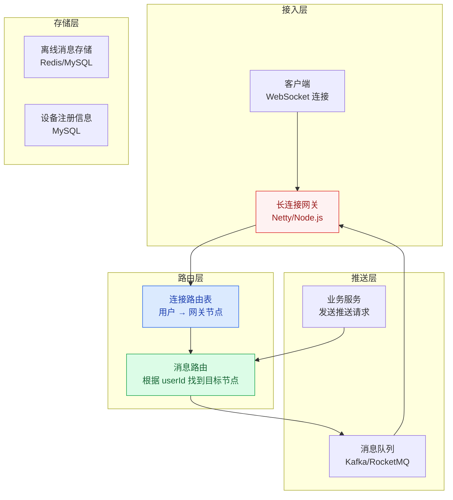
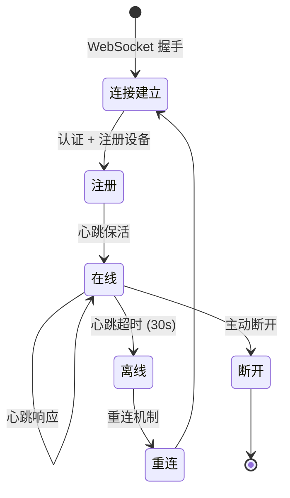
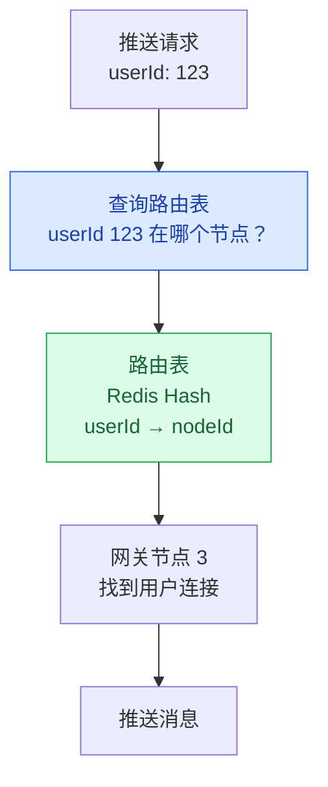
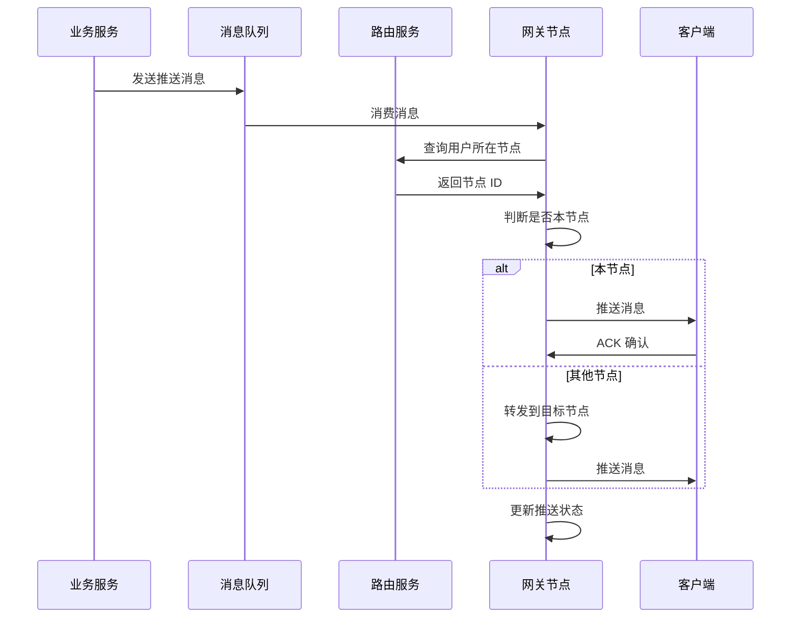

# 消息推送系统设计

## 概述

消息推送系统是高并发架构中的经典场景，从 App 推送通知到 WebSocket 实时消息，再到站内信，都属于推送系统的范畴。核心挑战在于：**如何管理海量长连接、如何保证消息可靠投递、如何应对百万级并发推送**。

::: tip 核心思路
推送系统 = **长连接管理** + **消息路由** + **可靠投递** + **多通道降级**。
:::

## 一、推送系统架构



## 二、WebSocket 长连接管理

### 2.1 连接生命周期



### 2.2 连接管理实现

```java
@Component
public class ConnectionManager {
    
    // userId -> 连接列表（支持多设备）
    private final ConcurrentHashMap<String, List<WebSocketSession>> 
        userConnections = new ConcurrentHashMap<>();
    
    // sessionId -> userId（反向索引）
    private final ConcurrentHashMap<String, String> 
        sessionUserMap = new ConcurrentHashMap<>();
    
    // 连接建立
    public void onConnect(String userId, WebSocketSession session) {
        userConnections.computeIfAbsent(userId, k -> 
            new CopyOnWriteArrayList<>()).add(session);
        sessionUserMap.put(session.getId(), userId);
        
        // 注册到连接路由表
        registerRoute(userId, getLocalNodeId());
    }
    
    // 连接断开
    public void onDisconnect(WebSocketSession session) {
        String userId = sessionUserMap.remove(session.getId());
        if (userId != null) {
            userConnections.get(userId).remove(session);
            if (userConnections.get(userId).isEmpty()) {
                userConnections.remove(userId);
                // 从路由表移除
                unregisterRoute(userId);
            }
        }
    }
    
    // 心跳检测
    @Scheduled(fixedDelay = 15000)  // 每 15 秒
    public void heartbeatCheck() {
        long now = System.currentTimeMillis();
        sessionUserMap.forEach((sessionId, userId) -> {
            WebSocketSession session = getSession(sessionId);
            if (now - session.getLastActiveTime() > 30000) {
                // 30 秒无心跳，断开连接
                session.close();
            }
        });
    }
}
```

## 三、连接路由表

### 3.1 为什么需要路由表？

长连接网关通常是多节点部署的，用户的连接可能在任何一台网关上。当需要向某个用户推送消息时，需要知道他在哪个网关节点上。



### 3.2 路由表设计

```java
// 使用 Redis Hash 存储路由信息
// Key: route:user:{userId}
// Field: deviceId
// Value: nodeId

public void registerRoute(String userId, String nodeId) {
    String deviceId = getDeviceId();
    redisTemplate.opsForHash().put(
        "route:user:" + userId, deviceId, nodeId);
}

public String getNodeId(String userId) {
    Map<Object, Object> routes = redisTemplate.opsForHash()
        .entries("route:user:" + userId);
    // 返回第一个在线设备的节点
    return routes.values().stream()
        .map(Object::toString)
        .findFirst()
        .orElse(null);
}
```

## 四、消息投递流程



## 五、消息可靠性保证

### 5.1 ACK 机制

```java
// 消息推送 + ACK 确认
public void pushMessage(String userId, Message message) {
    // 1. 生成消息 ID
    String msgId = UUID.randomUUID().toString();
    message.setMsgId(msgId);
    
    // 2. 发送消息
    WebSocketSession session = getSession(userId);
    session.sendMessage(message);
    
    // 3. 等待 ACK（超时 5 秒）
    boolean acked = waitForAck(msgId, 5000);
    
    if (!acked) {
        // 4. 未收到 ACK，存入离线消息
        storeOfflineMessage(userId, message);
    }
}
```

### 5.2 离线消息处理

```java
// 离线消息存储（Redis ZSet，按时间排序）
public void storeOfflineMessage(String userId, Message message) {
    String key = "offline:msg:" + userId;
    redisTemplate.opsForZSet().add(
        key, JSON.toJSONString(message), 
        System.currentTimeMillis());
    // 设置过期时间（7 天）
    redisTemplate.expire(key, 7, TimeUnit.DAYS);
}

// 用户重连时拉取离线消息
public List<Message> pullOfflineMessages(String userId) {
    String key = "offline:msg:" + userId;
    Set<String> messages = redisTemplate.opsForZSet()
        .rangeByScore(key, 0, System.currentTimeMillis());
    
    // 拉取后删除
    redisTemplate.delete(key);
    
    return messages.stream()
        .map(m -> JSON.parseObject(m, Message.class))
        .collect(Collectors.toList());
}
```

## 六、百万连接单机优化

### 6.1 C10K/C100K 问题

| 问题 | 原因 | 解决方案 |
|------|------|----------|
| 文件描述符限制 | Linux 默认 1024 | 调整 ulimit -n 到百万级 |
| 线程开销 | 每个连接一个线程 | Netty 的 EventLoop 模型（少量线程管理大量连接） |
| 内存占用 | 每个连接占用内存 | 精简连接上下文，共享数据结构 |
| 带宽瓶颈 | 心跳消息占用带宽 | 心跳间隔调优 + 二进制协议 |

### 6.2 Netty 优化配置

```java
// Netty Boss/Worker 线程配置
EventLoopGroup bossGroup = new NioEventLoopGroup(1);   // 1 个 Boss 线程
EventLoopGroup workerGroup = new NioEventLoopGroup(
    Runtime.getRuntime().availableProcessors() * 2);    // CPU 核数 × 2

ServerBootstrap bootstrap = new ServerBootstrap()
    .group(bossGroup, workerGroup)
    .channel(NioServerSocketChannel.class)
    // 连接队列大小
    .option(ChannelOption.SO_BACKLOG, 1024)
    // 心跳保活
    .childOption(ChannelOption.SO_KEEPALIVE, true)
    // 禁用 Nagle 算法，减少延迟
    .childOption(ChannelOption.TCP_NODELAY, true)
    // 接收缓冲区
    .childOption(ChannelOption.SO_RCVBUF, 8192)
    // 发送缓冲区
    .childOption(ChannelOption.SO_SNDBUF, 8192);
```

## 七、推送通道选择

| 通道 | 适用场景 | 优点 | 缺点 |
|------|----------|------|------|
| **WebSocket** | App 前台 + Web 端 | 实时、双向通信 | 后台可能被系统杀死 |
| **APNs/FCM** | iOS/Android 后台推送 | 系统级通道，省电 | 有频率限制、延迟较高 |
| **短信** | 重要通知（支付/验证码） | 到达率高 | 成本高、有字数限制 |
| **站内信** | 非实时通知 | 无需实时连接 | 用户不主动查看 |

**混合推送策略**：App 前台用 WebSocket，App 后台用 APNs/FCM，重要通知短信兜底。

---

## 面试题

### 1. WebSocket 长连接怎么管理？

**知识要点**：长连接管理的核心是"连接生命周期管理"——从建立、认证、保活、断连、重连到销毁，每个环节都需要精确的超时和重试策略。连接池不是普通的 Map，而是需要双向索引（userId→session + sessionId→userId）的高性能数据结构。

**项目场景**：我们当时做的是社交 App 的 IM 消息系统，日活 200 万，同时在线峰值 80 万。WebSocket 网关 12 节点部署（单节点承载约 7 万连接），使用 Netty 作为底层框架。

**踩坑经历**：最大的坑是"假连接"——用户 App 切后台，TCP 连接还在，但客户端已经不接收消息了。我们的 PUSH 到达率在业务报告里只有 68%，排查发现 30% 的消息发到了"假连接"上。另一个坑是心跳风暴——同一秒内 7 万个连接同时发心跳，网关 CPU 瞬间从 30% 飙到 95%。后来我们做了心跳打散（每个连接在 15±3 秒随机间隔发心跳），把心跳负载平滑化。

**量化结果**：心跳打散后网关 CPU 峰值从 95% 降到 45%。加上"假连接"检测（连续 2 次未收到心跳的 PONG 回复就关闭连接，改为走 APNs 推送），消息到达率从 68% 提升到 96%。

**面试官追问**：
- "单节点 7 万连接，你是怎么知道它快撑不住了？" → 监控了三个核心指标：TCP 连接数（逼近 ulimit -n 的 80% 即 8 万时告警）、Netty EventLoop 线程 CPU 使用率（超过 60% 加节点）、以及 GC 停顿时间（Full GC 超过 500ms 说明内存压力大）。
- "客户端断线重连时，如果服务端还没感知到旧连接断开，怎么处理冲突？" → 新连接建立时先查路由表，如果 userId 已有旧 session，主动关闭旧 session，再绑定新 session（"新踢旧"策略），避免同一用户产生幽灵连接。
- "WebSocket 连接如果数量到 20 万以上，单机撑不住怎么办？" → 加机器横向扩展是首选，但我们也做了"按用户 ID 一致性哈希"来分配连接——新用户连接时直接路由到固定节点，避免路由表的查询开销。20 万连接单机的话需要调优：ulimit 调到 50 万，每个连接的 socket buffer 从 8KB 降到 2KB（弱交互场景），JVM 堆内存至少 16GB。

---

### 2. 百万连接单机怎么优化？

**知识要点**：百万连接不等于百万线程。Netty 的 EventLoop 模型使得几百个线程就可以管理百万连接。核心优化在三个层面：OS 层面（文件描述符、TCP 参数）、JVM 层面（堆大小、GC 策略）、应用层面（连接对象精简化）。

**项目场景**：我们当时在为春节红包活动做容量准备，预计峰值在线 200 万。现有 12 节点架构（单节点 7 万连接）远远不够，但加 18 台机器预算审批不下来。目标是在不扩容的前提下单节点支撑 20 万连接。

**踩坑经历**：第一个坑——直接调整 `ulimit -n 1000000` 后连接数只到 15 万就上不去了，排查发现是 JVM 堆内存不够（每个连接仅存 userId/sessionId/lastActiveTime 三个字段约 120 字节，20 万 × 120 = 24MB，但 Netty 内部每个 Channel 还有约 2KB 的 metadata 开销，合计 400MB+）。第二个坑——GC 成了大问题，20 万连接下的 Full GC 停顿超过 3 秒，触发大量客户端心跳超时断开，断开后重连又进一步施压，形成死亡螺旋。

**量化结果**：优化后单节点稳定支撑 18 万连接（距离目标还差一点，加了两台机器），JVM 堆内存从 4GB 调到 16GB（G1 GC），Full GC 停顿从 3 秒降到 200ms。OS 层面启用 `tcp_tw_reuse` 和 `tcp_tw_recycle` 后，TIME_WAIT 连接数从 8 万降到 2000。

**面试官追问**：
- "Netty 的 Boss 线程和 Worker 线程怎么配比？" → Boss 线程只负责 accept 新连接（1 个线程足够，百万连接场景最多 2 个），Worker 线程负责读写 I/O，配置为 CPU 核数 × 2。我们当时 16 核机器配了 32 个 Worker 线程，CPU 使用率稳定在 50%。
- "连接数真到 100 万时，带宽够吗？" → 心跳消息按最小规格（PING/PONG 各 2 字节帧头 + 0 载荷），15 秒间隔，100 万连接的双向心跳带宽约 (1000000 × 2 × 2 byte × 8 bit) / 15s ≈ 2.1 Mbps，不是瓶颈。真正的瓶颈是业务消息——如果我们一个推送消息 1KB，100 万连接全量推送需要 1GB 带宽，必须走"分组推送"而非"单播"。

---

### 3. 连接路由表怎么设计？

**知识要点**：路由表的核心问题是"给定 userId，找到他连接在哪个网关节点上"。用 Redis Hash 存储是最经典的方案——key 是 `route:user:{userId}`，field 是 deviceId，value 是 nodeId。但路由表本身会成为瓶颈：如果每条消息都查一次 Redis，80 万在线用户 × 假设人均 10 条推送/天 = 800 万次 Redis 查询/天，高峰期 QPS 约 2000 次，不太严重但也是个成本。

**项目场景**：我们当时 12 节点网关集群，路由表存储在 Redis Cluster 中。业务服务发送推送时，先通过路由服务查 Redis 获取目标节点 ID，然后投递消息到该节点。

**踩坑经历**：路由表第一次上线用了单机 Redis，结果 Redis 挂了之后整个推送系统瘫痪——所有推送都无法找到目标节点。还有一次，用户断线后我们的回调逻辑没有成功执行 `unregisterRoute`（因为 try-catch 吞了异常），导致路由表中残留大量死连接。一个月后路由表膨胀到 300 万条，其中 40% 是死连接，每次全量查询耗时从 0.5ms 涨到 8ms。

**量化结果**：切换到 Redis Cluster（3 主 3 从）后可用性达到 99.99%。加了定时巡检任务（每 5 分钟扫描路由表，对超过 30 分钟未心跳的 userId 主动清理死路由），路由表大小从 300 万降到 180 万，查询 RT 恢复到 0.5ms 以下。

**面试官追问**：
- "一致性哈希分配能不能替代路由表？" → 可以部分替代——首次连接时按 userId 一致性哈希分配节点，推送时根据同一哈希算法直接算出目标节点，省掉路由表查 Redis。但问题是节点扩缩容会导致哈希变化，部分用户被路由到错误节点。所以实际做法是：一致性哈希作为快速定位，路由表作为精确兜底。
- "路由表如果存 MySQL 行不行？" → 可以的，但 RT 会从 Redis 的 0.5ms 涨到 MySQL 的 5-10ms（索引查询），高并发推送场景下这个 RT 不可接受。我们的做法是 Redis 为主存储，MySQL 做持久化备份（异步写入），Redis 故障时降级到 MySQL（但推送延迟会上升）。

---

### 4. 消息推送怎么保证可靠性？

**知识要点**：推送可靠性 = ACK 确认机制 + 超时重试 + 离线消息兜底。`at-least-once` 语义是推送系统的最低要求——消息可能重复，但绝不能丢失。要实现 `exactly-once` 成本极高，大多数场景 `at-least-once` + 客户端去重就够了。

**项目场景**：我们当时做金融类 App 的推送系统，必须保证交易通知 100% 送达（合规要求）。任何一笔交易通知丢失都可能引起用户投诉甚至监管处罚。

**踩坑经历**：最严重的事故——Redis 集群做数据迁移时，离线消息队列数据丢失，导致 1.2 万条交易通知没有被推送。事故原因是离线消息只存了 Redis 没有持久化到 DB。第二个坑：ACK 超时时间设了 5 秒，但用户在地铁弱网环境下 WebSocket 的 RTT 经常超过 5 秒，导致大量"误判超时"——消息其实已经送达了，但我们以为没送达又存了一份离线消息，用户重连后收到重复推送。

**量化结果**：离线消息改为双写（Redis ZSet + MySQL 离线消息表），消息丢失率从 0.05% 降到 0。ACK 超时时间根据网络质量动态调整为 3-10 秒（RTT < 500ms → 3s，RTT 500-2000ms → 5s，RTT > 2000ms → 10s），重复推送率从 8% 降到 1.5%。

**面试官追问**：
- "如果消息到了网关但用户刚好断线，这条消息算已送达还是未送达？" → 算未送达。我们的判断标准是"客户端 ACK = 已送达"，只要没收到 ACK 就进离线队列。即使是"用户收到消息但 ACK 丢失"这种极端情况，走离线消息重复推送也比丢消息好。
- "Kafka 里的推送消息如果消费失败了怎么办？" → 我们设置了消息重试 3 次（指数退避 1s/5s/15s），3 次都失败则进入死信队列（DLQ），人工介入排查。同时 Kafka 的 consumer group 配置了 `enable.auto.commit=false`，手动提交 offset，确保消息处理成功后才会提交。

---

### 5. 离线消息怎么处理？

**知识要点**：离线消息的核心是"暂存→拉取→清理"，用 Redis ZSet 按时间排序是最佳实践。但离线消息不是"无限存"，必须要有容量上限（条数+天数双重限制）和降级策略。

**项目场景**：我们当时的推送系统每天产生约 500 万条离线消息（主要来自夜间用户不在线时的大量系统通知），Redis 内存压力很大。

**踩坑经历**：一次大促活动（推送全量用户），活动结束后 200 万用户重新上线，同时拉取离线消息。Redis 的 ZSet 批量读取（`ZRANGEBYSCORE`）瞬时 QPS 冲到 5 万，Redis CPU 打满，导致路由表查询也超时，整个推送系统雪崩。后来我们做了"限流拉取"——用户重连后不一次性拉全部离线消息，而是分页拉取（每页 20 条，间隔 2 秒），缓解了瞬时压力。

**量化结果**：分页拉取上线后，重连时刻 Redis CPU 峰值从 95% 降到 35%。离线消息上限从"7 天 100 条"改为"3 天 50 条"——因为业务数据分析显示 90% 的用户在 24 小时内会查看离线消息，超过 3 天的离线消息打开率不到 1%。存储量降低 60%。

**面试官追问**：
- "如果离线消息满了（100 条上限），新消息进不来怎么处理？" → 我们用了 Redis ZSet 的 `ZREMRANGEBYRANK`——当离线消息数 > 100 时，先删除最旧的（score 最小的），再插入新消息。同时触发一条"消息溢出"的系统通知告诉用户"你离线期间消息过多，请登录查看完整记录"。
- "iOS 的 APNs 也有离线消息能力，为什么还要自建离线消息队列？" → APNs 的离线消息限制是"设备离线期间最多保留 1 条（iOS 10+支持多条但有限制）"，不能满足我们的业务需求。所以我们用 APNs 来唤醒 App（推送一条"你有新消息"的静默通知），App 被唤醒后建立 WebSocket 连接，从服务端拉取离线消息。

---

### 6. 推送通道怎么选型？

**知识要点**：推送通道选型没有银弹，核心策略是"多通道互备、按场景分级"。WebSocket 用于实时互动场景，APNs/FCM 用于后台唤醒，短信用于最高优先级兜底。

**项目场景**：我们当时做的 App 需要支持三种消息类型：IM 聊天消息（实时性要求 < 500ms）、系统通知（实时性要求 < 30s）、交易提醒（100% 必达）。

**踩坑经历**：最初所有消息全部走 WebSocket，结果 App 被系统杀死后用户收不到任何消息。用户投诉"收不到转账通知"差点引发合规风险。后来我们加了 APNs 通道，但 APNs 在国内的到达率只有 85%（防火墙干扰 + 用户关闭通知权限），所以又加了短信作为交易类消息的最终兜底。但短信成本太高——一条 4 分钱，每天 50 万条交易通知的短信兜底成本一年 730 万，财务不批。最终我们走了一个折中方案：WebSocket（App 前台）+ APNs + 国内厂商通道（华为/小米/OPPO/vivo 的 Push SDK，后台推送到达率 98%）+ 短信仅用于金额 > 500 元的交易。

**量化结果**：混合推送方案上线后，消息整体到达率从 68% 提升到 99.2%。短信兜底量从每天 50 万条降到 5000 条（仅大额交易），年省费用约 720 万。

**面试官追问**：
- "厂商通道（华为/小米 Push）和 APNs/FCM 有什么区别？为什么国内要用厂商通道？" → APNs/FCM 在国内受网络环境影响到达率低（FCM 直接不可用），而华为/小米等厂商推送通道走的是系统级长连接，不受防火墙影响，到达率 98% 以上。缺点是需要分别适配各厂商 SDK，且推送频率有限制（华为限制单设备单应用每天 3000 条）。
- "如果有 100 万用户需要同一时间推送同一条消息（如热点新闻），每个通道怎么处理？" → 这种场景叫"全量推送"或"广播"，WebSocket 可以逐条推（但带宽压力大），APNs/FCM 和厂商通道都支持 Topic 广播（单次 API 调用即可覆盖所有订阅用户）。我们的做法是按通道能力拆分：100 万用户中 30 万在线走 WebSocket 广播（分组推送降低连接数压力），70 万离线走 APNs/厂商通道 Topic 广播。