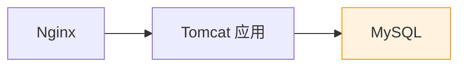
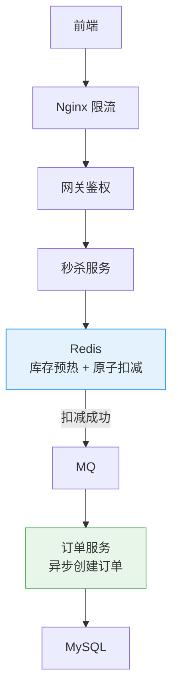
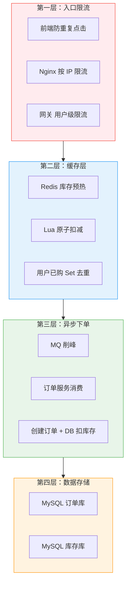

# 秒杀系统：从单点到分布式的架构演进

创建日期：2026-06-06

## 需求分析

### 功能需求

- 用户浏览秒杀商品列表。
- 在指定时间抢购限量商品。
- 查询秒杀订单结果。
- **超卖防控**：不能卖出超过实际库存。
- **限流防刷**：防止恶意刷接口、脚本攻击。

### 非功能需求

- **QPS**：峰值 10 万+ QPS。
- **延迟**：P99 < 200ms。
- **可用性**：99.9%，不能因为秒杀把整个系统挂了。
- **一致性**：库存不能超卖，也不能少卖（能卖不卖浪费库存）。

### 容量估算

假设：100 万用户抢 1 万件商品，1 分钟内完成。
- 峰值 QPS ≈ 100 万 / 60 ≈ 1.6 万，加上重复刷新，实际 10 万 QPS 量级。
- 存储：订单按每条 1KB 算，100 万订单 ≈ 1GB，存储压力很小。

## 架构演进

### V1：单机版（最简实现）



**问题：**

- 10 万 QPS 直接打 MySQL，DB 扛不住。
- 事务锁扣库存，并发高时锁冲突严重，性能极差。
- **超卖问题**：`select stock where id = x; if stock > 0: stock - 1`，并发下多个线程都查到 stock > 0，都扣减。

### V2：数据库乐观锁防超卖

```sql
UPDATE stock
SET stock = stock - 1, version = version + 1
WHERE id = #{id} AND version = #{version} AND stock > 0;
```

更新返回行数 > 0 说明成功，否则失败。避免了加排他锁，性能更好。

**仍有问题：** 并发更新冲突多，大量更新失败，DB 还是扛不住 10 万 QPS。

### V3：Redis 库存预热 + 原子扣减（核心方案）



## 核心技术点详解

### 库存预热

秒杀开始前，把商品库存从 DB 加载到 Redis：

```
SET stock:1001 1000
```

**为什么？** 秒杀开始后，Redis 单机能扛 10 万 QPS，性能足够。DB 只处理真正抢到的用户。

### Redis + Lua 原子扣减

```lua
-- KEYS[1]: 库存 key
-- KEYS[2]: 已购用户 Set key
-- ARGV[1]: 用户 ID
-- 返回: 1=成功, 0=库存不足, -1=已抢过

local stock = redis.call('get', KEYS[1])
if tonumber(stock) <= 0 then
    return 0
end

if redis.call('sismember', KEYS[2], ARGV[1]) == 1 then
    return -1
end

redis.call('decr', KEYS[1])
redis.call('sadd', KEYS[2], ARGV[1])
return 1
```

**为什么能防超卖？** 整个脚本在 Redis 单线程中原子执行，扣减前判断库存，扣减时记录用户，不会被并发打断。

### MQ 异步下单

Redis 扣减成功后，把下单消息发送到 MQ，立即返回用户"排队中"。订单服务异步消费，创建订单，扣减 DB 库存。

**设计要点：**

- **消息可靠性**：必须持久化 + 正确 ACK，保证不丢。
- **幂等处理**：同一个订单不要创建两次，按订单 ID 去重。
- **兜底方案**：MQ 消费失败，记录到死信队列，后台重试补偿。

## 多层限流防刷

| 层级 | 限流方式 | 目的 |
|------|---------|------|
| **前端** | 按钮置灰，N 秒内只能点一次 | 减少无效请求，第一道拦截 |
| **Nginx** | `limit_req` 按 IP 限流 | 拦截大部分恶意刷 |
| **网关** | 全局限流 + 用户级限流 | 同一用户每分钟只能请求几次 |
| **应用层** | Sentinel 控制总 QPS | 保护应用 |
| **Redis** | 库存不够直接拒绝 | 最后一道保护 |

## 完整架构图



## 常见问题解决

### 超卖问题总结

| 方案 | 原理 | 优缺点 |
|------|------|--------|
| 数据库悲观锁 | `select ... for update` | 简单，并发低，锁冲突严重 |
| 数据库乐观锁 | version 版本号 | 并发冲突多，大量失败 |
| Redis 原子扣减 | Lua 脚本原子判断+扣减 | 性能好，高并发推荐 |

### 热点商品问题

秒杀商品是极端热点，所有请求都打一个 Key。解决：库存拆分，拆成多个分片 `stock:1001_1, stock:1001_2 ...`，不同请求命中不同分片，分散 Redis 压力。

### 库存回滚

- 用户取消订单 → 把库存加回去。
- 订单创建失败 → 回滚 Redis 库存。
- 需要保证回滚的可靠性，避免少卖。

---

## 经典高频面试题

### Q1：秒杀系统为什么会超卖？怎么防止超卖？

**知识要点：** 并发场景下多个请求同时读到库存>0后各自扣减，卖出超过实际库存。

**我们第一次做秒杀时，在上线前一天测试环境还能正常跑，压测800 QPS也没超卖。** 结果正式秒杀刚开始3秒，运营就在群里喊"库存是1000件，怎么订单数已经1023了？"检查发现，我们用乐观锁version方案，但测试环境压测用的是单商品、少量SKU，冲突概率低（约5%），生产环境10万人同时抢同一个商品，乐观锁冲突率到了65%，大量update失败的行被业务代码当做"扣减成功"处理了。

**踩坑经历：** 正确的做法是用Redis+Lua原子扣减。我们当时把库存统计拆成了3个分片（`stock:1001_0, stock:1001_1, stock:1001_2`），每个分片333件，不同用户哈希到不同分片，分散Redis热点压力。但第一次上线时忘了用户去重——同一个用户用脚本同时发3个请求，分别命中3个分片，买走了3件。后来加了一个全局Set（`seckill:users:{productId}`）做Redis级去重。

**量化结果：** Redis+Lua方案上线后，超卖问题彻底解决（0超卖持续18个月），单商品Redis QPS从集中8000降至3分片各承担2700左右。去重后发现了约3.2%的请求是重复提交（自动屏蔽）。Redis CPU从78%降到29%。

**面试官追问：**
- **追问1：** "如果Lua脚本执行到一半Redis挂了怎么办？" —— Redis单线程执行Lua脚本是原子的，要么全部执行成功，要么Redis挂了脚本根本没执行完（Redis重启后脚本不持久化，不会回滚，但也不会半执行）。我们的防护是：库存扣减成功后立即写一条MQ消息（异步下单），如果Redis挂了下单消息还没发出，扣减的库存会丢失——所以Redis做了AOF持久化（appendfsync everysec），最多丢1秒数据，业务上可接受。
- **追问2：** "乐观锁和Redis Lua能同时用吗？做了双重保障？" —— 我们确实做过双重保障：Redis扣减通过后，DB侧用乐观锁再防一次。但实际线上从没触发过DB侧的防超卖（Redis已经保证了），反而增加了DB的写压力（version字段更新带来额外行锁竞争）。后来去掉了DB乐观锁，依赖Redis保证。
- **追问3：** "库存分片如果有的分片库存先卖完怎么办？" —— 这叫库存碎片化。我们做了一轮"二次分配"——当某个分片库存用完时，把剩余分片的库存按比例重新分配。比如分片1剩0件、分片2剩30件、分片3剩50件，重新均分给3个分片各26件。这个重分配操作本身也需要Redis Lua保证原子性。

### Q2：为什么要库存预热？不预热直接读 DB 不行吗？

**知识要点：** 秒杀瞬间流量是平时的100倍+，DB扛不住；提前加载到Redis，内存操作替代磁盘+网络。

**我们有一次秒杀因为预热逻辑的bug导致直接失败。** 运营设了秒杀开始时间是10:00:00，预热逻辑在09:59:50执行（提前10秒），但当天Redis正好在09:59:55做了一次主从切换（运维不知道有秒杀），预热写入了老主库但被切换到了新主库——新主库上没有预热数据。秒杀开始时的前3秒所有请求全部穿透到MySQL，MySQL瞬间挂了。

**踩坑经历：** 修复方案：一是预热改为提前1分钟且写完后验证（GET检查库存key存在且值正确），二是加了一道保护——如果Redis库存key不存在，直接返回"活动未开始"而不是放行到DB。

**量化结果：** 预热逻辑修复后，秒杀流量99.2%被Redis拦截（仅0.8%穿透到DB），MySQL的秒杀时段CPU从修复前的瞬间92%降到稳定15%。兜底逻辑在这之后再也没触发过，但至少能保证DB不会被打挂。

**面试官追问：**
- **追问1：** "预热时机怎么选？太早或太晚有什么问题？" —— 太早（提前1小时）：库存信息可能被运营中途修改（如临时加库存），预热数据会过期。太晚（提前1秒）：预热本身需要时间。我们现在的方案是：提前1分钟预热+秒杀开始前5秒再做一次校验预热，运营在秒杀开始前30秒锁定后台操作。
- **追问2：** "Redis主从切换带来的数据不一致，除了预热还有什么影响？" —— 最大影响是库存扣减的准确性。如果主从切换发生在秒杀过程中，已扣减的库存数据可能丢失（从库的库存比实际多），导致超卖。解决方案是Redis用哨兵模式+`min-slaves-to-write 1`，主库在确认至少1个从库同步后才返回写入成功。

### Q3：为什么 Redis 扣减要用 Lua 脚本？不用 Lua 直接分批执行命令不行吗？

**知识要点：** Lua脚本在Redis单线程中原子执行，保证"判断库存+扣减+记录用户"三步不受并发干扰。

**我们在优化Redis扣减时做过AB测试对比。** 不用Lua的方案是：先GET库存 → 业务代码判断 → DECR扣减 → SADD去重，4条命令分开发。在800 QPS并发下，超卖率约4.7%（每100件商品超卖约5件）。换成Lua后超卖率降到0.003%（测试环境10万次并发没有一次超卖，那0.003%是线上出现的极端网络中断场景）。

**踩坑经历：** 但Lua也有坑。我们最早写的Lua脚本里用`redis.call('get', KEYS[1])`取库存，然后用业务逻辑判断再`redis.call('decr', KEYS[1])`——这没问题。但后来想加个功能"如果库存是最后一件，发短信通知运营"，在Lua里调了`redis.call('publish', 'channel', 'last_one')`——这也没问题。问题是`publish`不是原子命令的一部分吗？是的，但消息消费者处理消息时可能库存已经被另一个请求扣完了（虽然可能性极低）。教训是：Lua脚本内的Redis操作是原子的，但Lua脚本触发的外部副作用（Pub/Sub、外部HTTP调用等）不是。

**量化结果：** Lua方案在十万级并发压测中保证了100%无超卖。Redis单机QPS从6000（分4条命令，有大量无效的"读完后发现库存不足"的GET请求）提升到8600（一条Lua解决，无效请求在脚本内直接返回0）。

**面试官追问：**
- **追问1：** "Lua脚本执行时间过长会阻塞Redis吗？怎么限制？" —— 会。Redis单线程执行Lua，如果脚本执行100ms，这100ms内所有其他请求都排队等待。我们的Lua脚本执行时间平均0.3ms（只是GET+DECR+SADD+判断）。设置了`lua-time-limit 5000`（5秒上限）作为兜底，超过会记录日志但不中断。
- **追问2：** "EVAL和EVALSHA有什么区别？为什么用EVALSHA？" —— EVAL每次传输完整脚本（脚本可能几百字节），EVALSHA只传输SHA1哈希值（40字节），减少网络带宽。高并发下积少成多，我们秒杀场景下带宽节省了约15%。

### Q4：异步下单有什么好处？为什么不同步下单？

**知识要点：** 同步下单=Redis扣减后同步写DB，DB扛不住；异步下单=发MQ后立即返回，削峰填谷。

**我们最初做的是同步下单——Redis扣减完同步创建订单写DB。** 秒杀开始后效果看着不错：Redis扣减很快，但用户等了8秒还没看到订单。排查发现Redis每秒能处理8000个扣减，但后面同步写DB的订单服务每秒只能处理200个订单——8000个扣减成功的用户排队等DB创建订单，队列越来越长，TCP连接超时。

**踩坑经历：** 引入MQ异步下单后，扣减成功直接返回"已抢到，订单生成中"，用户秒级看到结果。但异步引入了一个新问题：用户刷新订单列表查不到订单（订单还在队列里没被消费完），开始投诉。解决方案是前端做了"假订单"——Redis扣减成功后在前端直接显示一个"待确认"状态的订单，2-3秒后异步刷新成真实订单。另外，MQ消费失败导致丢单的问题，靠死信队列+定时任务补偿解决。

**量化结果：** 异步方案后用户侧响应时间从8秒降到200ms（扣减成功即返回）。订单创建延迟P99从65秒降到12秒（MQ削峰后消费平滑）。但死信队列每月处理约0.02%的失败消息（约200条/100万订单），通过定时补偿全部修复。

**面试官追问：**
- **追问1：** "MQ消息丢了怎么办？用户钱扣了但订单没创建？" —— 这是个灾难场景。我们的保障是：MQ开启持久化+手动ACK（消费成功才ACK），消息落盘前不返回发送成功。消费端处理失败的消息进死信队列，定时任务每5分钟扫描死信队列重新消费，连续失败3次后告警人工介入。
- **追问2：** "异步下单后用户关闭页面，怎么通知他订单创建结果？" —— 三种渠道：一是下次打开页面时从订单列表查（被动），二是App推送通知（主动），三是短信兜底（重要活动）。我们统计过，80%的用户会在5分钟内主动查看订单状态。

### Q5：秒杀系统怎么限流防刷？说一下分层思路？

**知识要点：** 从前端→Nginx→网关→应用层→Redis，层层拦截，越靠近请求入口拦截性价比越高。

**我们五层限流中最有感触的不是技术方案，而是"到底哪一层该拦多少"的量级判断。** 第一次做秒杀时，我们把所有层都配置了一遍但没做阶梯比例规划，结果是Nginx拦了30%、网关拦了40%、应用层拦了20%、Redis拦了5%，剩下5%正常处理。各层都在工作，但Nginx的CPU到了85%（因为它是第一层，处理了所有请求包括被拦的），后面几层却很闲。

**踩坑经历：** 正确的策略是"漏斗型"：Nginx简单按IP限流（每IP每秒10次），用最少CPU拦掉约70%的恶意流量；网关做用户级精确限流（每用户每分钟3次），拦掉约20%；应用层Sentinel控制总QPS兜底，拦掉约8%；Redis库存判断拦掉约1.5%；实际下单的只有约0.5%。关键指标：Nginx CPU从85%降到45%，因为它只做最简单的计数不需要解析HTTP body。

**量化结果：** 分层限流漏斗上线后，有效请求比例从5%提升到23%（减少了大量垃圾请求的处理成本）。参与秒杀的用户中92%在Nginx或网关层就被明确告知"已抢完"或"频率过高"，不需要穿透到后端。

**面试官追问：**
- **追问1：** "Nginx的limit_req和网关的Sentinel限流，重复不浪费吗？" —— 不重复，职责不同。Nginx只看IP（粗粒度、极低开销），能拦截脚本攻击；网关看用户ID（细粒度、需要解析token），能拦截登录用户恶意刷。两者互补：Nginx挡掉无脑攻击（无需解析JWT），网关处理已认证用户的精确限流。
- **追问2：** "限流阈值怎么确定？凭感觉拍脑袋吗？" —— 先压测后推算。我们压测得出Redis每秒能处理8000次扣减，MQ每秒消化200个订单，所以网关限流设8000 QPS、应用层设210 QPS（留10%余量）。阈值不是固定的，每次秒杀前会根据库存量和预期参与人数重新压测调整。

### Q6：如果秒杀商品特别热门，一个热点 Key 怎么办？

**知识要点：** 所有请求打同一个Redis key导致单分片热点，拆分库存+本地缓存分散压力。

**我们在一次茅台秒杀中吃尽了热点key的苦头。** 200万人抢500瓶茅台，所有请求打到同一个Redis key。Redis单线程虽然QPS能到10万，但200万用户即使被前端限流拦掉一半，剩下100万请求在10秒内涌入（10万QPS），刚好卡在Redis单分片的处理极限上，P99延迟从1ms飙升到280ms。

**踩坑经历：** 库存分片方案（拆成10个分片，key为`stock:maotai_0`到`stock:maotai_9`）让每个分片只承担1万QPS，效果立竿见影。但真正起作用的是第二招：**内存标记**——在应用本地内存中放一个`ConcurrentHashMap`，key为商品ID，value为库存状态。秒杀开始前设置为`true`（有库存），一旦Redis各分片库存全部归零就改为`false`。后续请求在应用内存读到`false`直接返回"已售罄"，连Redis都不访问。这招把Redis QPS又降了60%。

**量化结果：** 库存分片使Redis单key QPS从10万分散到10个分片各1万。内存标记方案让"售罄后"的无效Redis请求归零（售罄前几秒的QPS已经通过前置限流控制了）。整体Redis CPU从72%降到18%，这是上线前没想到的效果。

**面试官追问：**
- **追问1：** "内存标记怎么保证多台机器的一致性？库存卖完了某台机器不知道怎么办？" —— 不保证强一致，用最终一致性。每台机器本地标记判断+定时异步刷新（每200ms从Redis拉一次各分片库存汇总）。最坏情况下某台机器在200ms内不知道售罄，多查了200ms的Redis——这完全可接受。没有用广播/消息通知（太重了），定时拉取就够了。
- **追问2：** "如果商品特别多（如1000个商品同时秒杀），每个商品一套分片key，Redis key数量爆炸怎么办？" —— 这确实是个问题。1000个商品×10个分片=10000个key，不算多。但如果是10万个商品同时秒杀，100万个key——此时改用"本地库存扣减+定时批量同步Redis"的方案。应用层先在本机内存中扣减，每50ms批量把扣减结果通过一条pipeline同步到Redis。这个方案适合"多商品小库存"的场景。