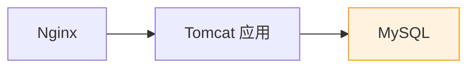
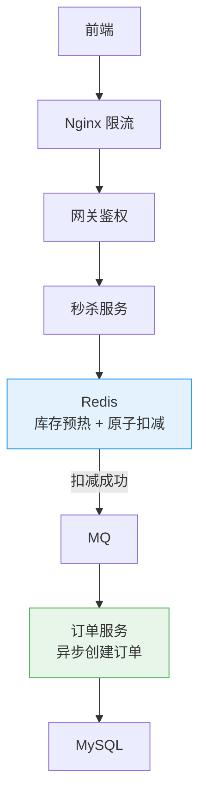
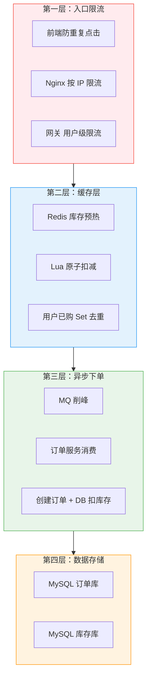

# 秒杀系统：从单点到分布式的架构演进

创建日期：2026-06-06

## 需求分析

### 功能需求

- 用户浏览秒杀商品列表。
- 在指定时间抢购限量商品。
- 查询秒杀订单结果。
- **超卖防控**：不能卖出超过实际库存。
- **限流防刷**：防止恶意刷接口、脚本攻击。

### 非功能需求

- **QPS**：峰值 10 万+ QPS。
- **延迟**：P99 < 200ms。
- **可用性**：99.9%，不能因为秒杀把整个系统挂了。
- **一致性**：库存不能超卖，也不能少卖（能卖不卖浪费库存）。

### 容量估算

假设：100 万用户抢 1 万件商品，1 分钟内完成。
- 峰值 QPS ≈ 100 万 / 60 ≈ 1.6 万，加上重复刷新，实际 10 万 QPS 量级。
- 存储：订单按每条 1KB 算，100 万订单 ≈ 1GB，存储压力很小。

## 架构演进

### V1：单机版（最简实现）



**问题：**

- 10 万 QPS 直接打 MySQL，DB 扛不住。
- 事务锁扣库存，并发高时锁冲突严重，性能极差。
- **超卖问题**：`select stock where id = x; if stock > 0: stock - 1`，并发下多个线程都查到 stock > 0，都扣减。

### V2：数据库乐观锁防超卖

```sql
UPDATE stock
SET stock = stock - 1, version = version + 1
WHERE id = #{id} AND version = #{version} AND stock > 0;
```

更新返回行数 > 0 说明成功，否则失败。避免了加排他锁，性能更好。

**仍有问题：** 并发更新冲突多，大量更新失败，DB 还是扛不住 10 万 QPS。

### V3：Redis 库存预热 + 原子扣减（核心方案）



## 核心技术点详解

### 库存预热

秒杀开始前，把商品库存从 DB 加载到 Redis：

```
SET stock:1001 1000
```

**为什么？** 秒杀开始后，Redis 单机能扛 10 万 QPS，性能足够。DB 只处理真正抢到的用户。

### Redis + Lua 原子扣减

```lua
-- KEYS[1]: 库存 key
-- KEYS[2]: 已购用户 Set key
-- ARGV[1]: 用户 ID
-- 返回: 1=成功, 0=库存不足, -1=已抢过

local stock = redis.call('get', KEYS[1])
if tonumber(stock) <= 0 then
    return 0
end

if redis.call('sismember', KEYS[2], ARGV[1]) == 1 then
    return -1
end

redis.call('decr', KEYS[1])
redis.call('sadd', KEYS[2], ARGV[1])
return 1
```

**为什么能防超卖？** 整个脚本在 Redis 单线程中原子执行，扣减前判断库存，扣减时记录用户，不会被并发打断。

### MQ 异步下单

Redis 扣减成功后，把下单消息发送到 MQ，立即返回用户"排队中"。订单服务异步消费，创建订单，扣减 DB 库存。

**设计要点：**

- **消息可靠性**：必须持久化 + 正确 ACK，保证不丢。
- **幂等处理**：同一个订单不要创建两次，按订单 ID 去重。
- **兜底方案**：MQ 消费失败，记录到死信队列，后台重试补偿。

## 多层限流防刷

| 层级 | 限流方式 | 目的 |
|------|---------|------|
| **前端** | 按钮置灰，N 秒内只能点一次 | 减少无效请求，第一道拦截 |
| **Nginx** | `limit_req` 按 IP 限流 | 拦截大部分恶意刷 |
| **网关** | 全局限流 + 用户级限流 | 同一用户每分钟只能请求几次 |
| **应用层** | Sentinel 控制总 QPS | 保护应用 |
| **Redis** | 库存不够直接拒绝 | 最后一道保护 |

## 完整架构图



## 常见问题解决

### 超卖问题总结

| 方案 | 原理 | 优缺点 |
|------|------|--------|
| 数据库悲观锁 | `select ... for update` | 简单，并发低，锁冲突严重 |
| 数据库乐观锁 | version 版本号 | 并发冲突多，大量失败 |
| Redis 原子扣减 | Lua 脚本原子判断+扣减 | 性能好，高并发推荐 |

### 热点商品问题

秒杀商品是极端热点，所有请求都打一个 Key。解决：库存拆分，拆成多个分片 `stock:1001_1, stock:1001_2 ...`，不同请求命中不同分片，分散 Redis 压力。

### 库存回滚

- 用户取消订单 → 把库存加回去。
- 订单创建失败 → 回滚 Redis 库存。
- 需要保证回滚的可靠性，避免少卖。

---

## 经典高频面试题

### Q1：秒杀系统为什么会超卖？怎么防止超卖？

**参考答案：**

并发下，多个请求同时查询库存都查到还有，都扣减，最终库存变负数，卖出超过实际库存。

防止方案：
1. 数据库乐观锁 version，但并发冲突多，性能差。
2. **Redis Lua 脚本原子判断+扣减**，整个操作原子性，不会超卖，性能最好，高并发推荐。

### Q2：为什么要库存预热？不预热直接读 DB 不行吗？

**参考答案：**

秒杀开始后，瞬间 10 万 QPS，如果都读 DB，DB 扛不住。提前把库存加载到 Redis，秒杀过程中只有 Redis 处理，DB 只处理下单成功的，压力小很多。预热也能提前发现数据问题，提前修复。

### Q3：为什么 Redis 扣减要用 Lua 脚本？不用 Lua 直接分批执行命令不行吗？

**参考答案：**

因为判断库存和扣减是两条命令，如果不用 Lua，两条命令分开执行，并发下不是原子的，可能多个线程同时判断都有库存，都扣减，就超卖了。Lua 脚本把整个逻辑放在 Redis 一次执行，单线程原子性，不会被打断，所以能保证正确。

### Q4：异步下单有什么好处？为什么不同步下单？

**参考答案：**

- **同步下单**：Redis 扣减完，同步创建订单写 DB。10 万 QPS DB 还是扛不住，用户等待久。
- **异步下单**：Redis 扣减完，发消息到 MQ 就返回，用户体验好。MQ 削峰，DB 按能力匀速处理，不会被冲垮。
- 缺点：用户不能马上知道是否下单成功，需要轮询或推送通知。

### Q5：秒杀系统怎么限流防刷？说一下分层思路？

**参考答案：**

从前端到后端层层拦截：
1. **前端**：按钮置灰，禁止重复点击。
2. **Nginx**：按 IP 限流，拦截恶意 IP。
3. **网关**：按用户 ID 限流，同一用户每分钟只能请求几次。
4. **应用层**：Sentinel 控制总 QPS，超过直接拒绝。
5. **Redis**：库存没了直接拒绝，提前过滤。

层层拦截，最终 DB 只处理真正能抢到的请求，压力很小。

### Q6：如果秒杀商品特别热门，一个热点 Key 怎么办？

**参考答案：**

把库存拆分成多个分片，比如 1000 库存拆成 10 个分片，每个 100。不同请求命中不同分片，分散 Redis 压力，避免热点都打一个 Key。也可以在应用本地缓存剩余库存，减少 Redis 访问次数。