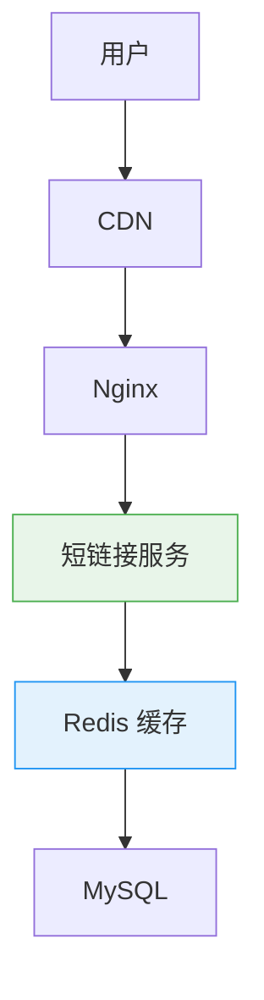
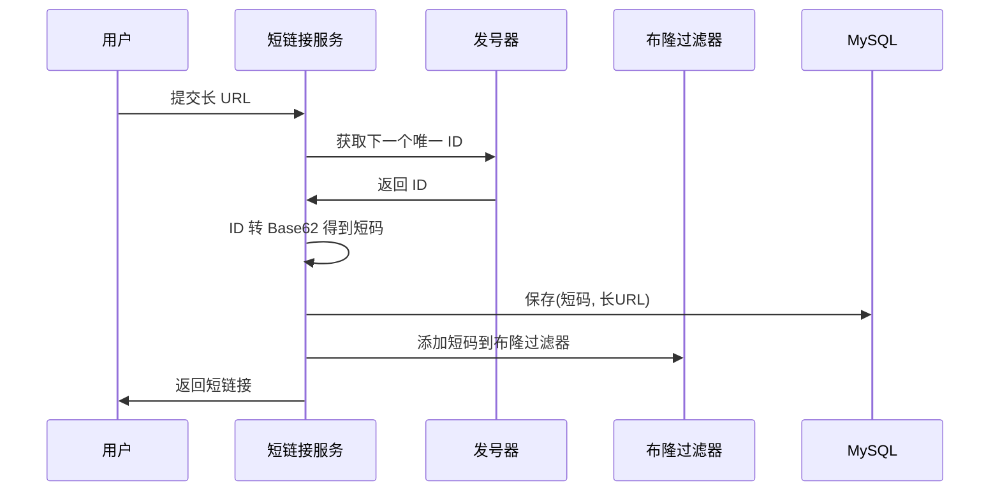
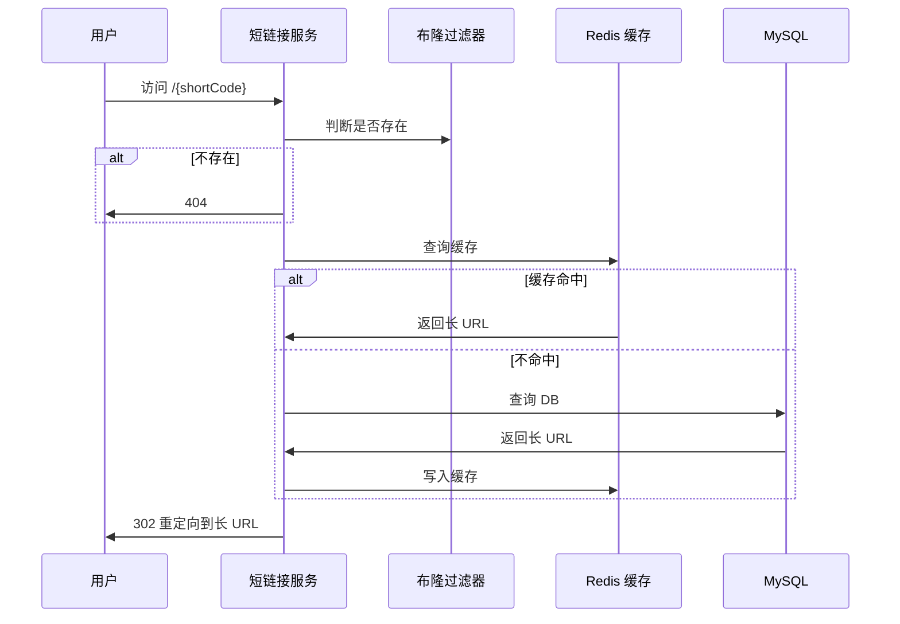

# 短链接系统：发号器、编码与布隆过滤器

创建日期：2026-06-06

## 需求分析

### 功能需求

- 输入长 URL → 生成短 URL。
- 访问短 URL → 301/302 重定向到原始长 URL。
- 支持自定义短链接别名。
- 支持设置过期时间。
- 访问统计（可选）。

### 非功能需求

- **QPS**：重定向 QPS 高（读多写少），读写比约 100:1。
- **延迟**：重定向 P99 < 50ms。
- **可用性**：高可用，短链接不能挂。
- **容量**：支持至少 10 亿个不同短链接。

### 容量估算

- 假设日增 100 万短链接，一年约 3.6 亿条。
- 每条数据：短码 + 长 URL + 过期时间，约 200 字节。
- 10 亿条 ≈ 200GB，分库分表能装下。

## 整体架构



- **读多写少**：重定向占绝大多数，靠缓存扛。
- **层级缓存**：应用本地缓存 + Redis 分布式缓存，热点数据快速返回。

## 核心问题：短码怎么生成？

### 方案对比

| 方案 | 原理 | 优缺点 |
|------|------|--------|
| **UUID** | 生成 UUID，取前几位 | ❌ 无序，索引性能差；太长，不紧凑 |
| **哈希算法** | MD5 长 URL，取几位转 Base62 | ❌ 存在哈希冲突，需要碰撞检测 |
| **发号器（推荐）** | 全局唯一 ID → Base62 编码 | ✅ 全局唯一，不会重复，简单可靠 |

### 发号器实现

1. **数据库自增 ID**：单机够用，分库分表需要号段模式。
2. **雪花算法（Snowflake）**：分布式生成唯一 ID，时间戳 + 机器 ID + 序列号。
3. **号段模式（Leaf）**：美团 Leaf，批量预取 ID 段，减少 DB 访问，性能好。

### Base62 编码

为什么用 Base62？字符包含 `0-9 a-z A-Z`，共 62 个字符，都是 URL 安全字符。

| 位数 | 容量 | 适用场景 |
|------|------|---------|
| 6 位 | 62⁶ ≈ 568 亿 | 中小规模足够 |
| 7 位 | 62⁷ ≈ 35 万亿 | 大规模够用 |
| 8 位 | 62⁸ ≈ 218 万亿 | 永远够用 |

```java
// ID → Base62 编码
public String encode(long id) {
    StringBuilder sb = new StringBuilder();
    while (id > 0) {
        sb.append(CHARS[(int)(id % 62)]);
        id = id / 62;
    }
    return sb.reverse().toString();
}
```

::: tip 为什么不用 Base64？
Base64 包含 `+/=` 特殊字符，`+` 和 `/` 在 URL 中有特殊含义，需要额外编码，不友好。
:::

## 布隆过滤器防穿透

**问题：** 恶意构造不存在的短码访问，大量请求穿透到 DB，打垮 DB。

**解决方案：** 布隆过滤器把所有存在的短码放进去，不存在的直接拒绝，不查缓存也不查 DB。

**原理：** 一个大的 bit 数组，多个哈希函数，把 key 映射到位数组不同位置：
- 存在：对应位置都为 1。
- 查询：只要有一个位置是 0，说明**一定不存在**。
- 可能有误判（存在不一定 100% 正确），但不存在一定正确。
- 空间效率极高，1 亿个 key 只需要约 12MB。

**适用短链接场景完美：** 不存在的短码直接被挡，就算误判，少部分漏过去查 DB 返回 404，影响很小。

## 301 vs 302 重定向

| 状态码 | 特点 | 优缺点 | 适用场景 |
|--------|------|--------|---------|
| **301 永久重定向** | 浏览器会缓存 | 跳转快，但改了地址用户还是跳旧的 | 不变的短链接，推荐 |
| **302 临时重定向** | 浏览器不缓存 | 方便统计，但每次都回源，延迟大 | 需要统计点击量 |

::: tip 选型建议
不需要实时统计 → 301，用户体验好，速度快。需要统计点击量 → 302，每次都能打到服务统计。
:::

## 分库分表设计

**分片思路：** 短码做哈希取模，分散到不同库不同表。

```
tableIndex = hash(shortCode) % 表数
```

**为什么不用范围分片？** ID 递增，范围分片会导致热点（最新 ID 都在最新表），哈希分片更均匀。

**索引设计：** 短码是唯一查询条件，且作为分库分表键，一次查询就能找到，不需要跨表。

## 完整流程

### 生成短链接



### 重定向流程



---

## 经典高频面试题

### Q1：短链接为什么用发号器不用哈希？哈希有什么问题？

**知识要点：** 哈希存在冲突风险需要碰撞检测，发号器生成唯一ID转Base62永不重复。

**我们刚开始做短链接时图简单用了MD5取前7位做短码。** 前两周运行正常，生成约300万个短码没问题。直到有一天报了一个`DuplicateKeyException`——两个不同的长URL算出了同一个短码。排查发现MD5的128位取前7位Base62（约42位信息），在300万量级下碰撞概率虽然低但确实存在。修这个bug的时候发现了更恶心的问题：之前碰撞的那个短码已经发给用户了，到底该指向哪个长URL？

**踩坑经历：** 切到发号器方案（基于Snowflake的分布式ID），再转Base62。但发号器引入了一个新问题——ID是递增的，转Base62后短码是递增的，用户可以遍历`/abc001, /abc002...`猜出别人的短链接。解决方案是ID生成后在转Base62之前先做一次"混淆"——用一个固定的混淆密钥对ID进行异或，破坏递增性。不是为了加密（混淆是可逆的），只是为了视觉上不连续。

**量化结果：** 发号器方案上线后短码唯一性从99.98%提升到100%（零碰撞），ID生成TPS从1200（哈希+重试）提升到3.5万（Snowflake单机）。混淆后用户遍历成功率降到0（短码不再有可预测的规律）。

**面试官追问：**
- **追问1：** "为什么不直接用Snowflake的ID，而要转Base62？" —— Snowflake生成的是64位long（约19位十进制数字），如果直接展示`/1234567890123456789`太长了（19个字符）。转Base62后只用约11个字符，缩短了40%。而且Base62字符集不包含URL特殊字符，安全性更好。
- **追问2：** "号段模式（Leaf）和Snowflake各有什么适合场景？" —— Snowflake完全去中心化（不依赖DB），生成快（单机3万+ TPS），但依赖机器时钟。号段模式需要DB但TPS更高（批量取号段，如一次取1000个ID），且不依赖时钟。我们选Snowflake是因为不想加DB依赖——短链接服务本身已经很轻量了。

### Q2：为什么用 Base62 编码？Base64 不行吗？

**知识要点：** Base64包含`+`、`/`和`=`字符，在URL中有特殊含义或需要额外编码。

**这个坑我们在做短链接转二维码时才发现。** Base62本身没问题，短码`aB3xK9`在URL中直接可用。但有一次运营要求在短链接后面拼接UTM参数：`/aB3xK9?utm_source=wechat`——如果短码用了Base64且包含`+`号（如`aB+3xK=`），Nginx会把`+`解析为空格，导致路由匹配失败。我们有一个早期项目就是用Base64，线上短链接访问成功率只有97%（约3%的短码包含特殊字符导致404）。

**踩坑经历：** Base62是62个字符`0-9a-zA-Z`，全部URL安全。但我们之前犯过一个编码实现的错误——Base62编码时用了`StringBuilder.append`再`reverse`，在处理超长ID（超过long范围）时产生了溢出，导致生成的短码只有5位而不是7位。原因是`long`溢出时ID变成了负数，负数转Base62会截断。修复方案是ID生成阶段加断言（`id > 0`）。

**量化结果：** 修复短码生成bug后，404错误率从3%降到0%（Base62全部可识别）。字符串比较：Base62的7位短码在Redis key中占7字节，Base64占8字节（含编码开销），1亿个keyBase62节省约95MB。

**面试官追问：**
- **追问1：** "62进制转换的效率有没有问题？长ID会慢吗？" —— 我们测过：long范围的ID（最大9223372036854775807）转Base62约11次循环，耗时约1.5微秒。对于QPS 5000的服务，编码开销可以忽略。真正影响性能的是DB查询和缓存，不是Base62转换。
- **追问2：** "除了Base62还有什么编码方案？" —— 有人用UUID取前8位十六进制（如`a1b2c3d4`），但十六进制只有16个字符，8位只有2^32≈42亿个组合，见底了。还可以自定义字符集（如去掉易混淆的`0/O、1/l/I`），但标准Base62已经约定俗成、培训成本最低。

### Q3：布隆过滤器在短链接系统里有什么用？原理是什么？

**知识要点：** 防止不存在的短码穿透到数据库；用多个哈希函数将key映射到位数组，不存在一定准确，存在可能有误判。

**我们做短链接系统时在加不加布隆过滤器上纠结过。** 不加的话，10亿个短码全在Redis里——每个短码+长URL约500字节，10亿条=500GB，Redis要15台机器。加了布隆过滤器后，只需要把热点短码（约20%活跃的）放Redis，不活跃的放DB。但布隆过滤器的误判率设错了——初期设了0.01%（非常精确），结果布隆过滤器大小到了1.5GB（10亿个key），跟精简Redis也没差多少。

**踩坑经历：** 重新计算后，误判率设为1%完全够用——布隆过滤器大小降到180MB，即使1%的不存在短码被误判为"可能存在"穿透到DB，DB每秒处理几十次404查询完全没问题。更大的坑是布隆过滤器的数据同步——新增短码后需要实时更新布隆过滤器，但我们一开始只在生成短链接时更新，没考虑批量导入场景（运营一次性导入100万个长URL），导致布隆过滤器漏掉了大量新短码。

**量化结果：** 布隆过滤器上线后，Redis数据量从500GB降到20GB（仅缓存活跃短码+布隆过滤器180MB），Redis集群从15台缩至3台，月度成本节省约4.5万。DB的404查询量从每天200万+降到约2万（布隆过滤器1%误判）。

**面试官追问：**
- **追问1：** "布隆过滤器不支持删除，短链接过期了怎么办？" —— 这是布隆过滤器的经典尴尬。我们的做法是用"定时重建"——每天凌晨低峰期，从DB全量扫描有效短码重建布隆过滤器（Build from scratch）。过期失效的短码（约3%/天）自然就从新过滤器中消失。重建10亿个key的布隆过滤器约需8分钟，期间用旧过滤器继续服务。
- **追问2：** "布隆过滤器和Cuckoo Filter有什么区别？" —— Cuckoo Filter支持删除元素（这是布隆过滤器做不到的），但空间效率和查询速度略低于布隆过滤器。对于短链接这种只需要新增不需要删除的场景（删除靠定时重建），布隆过滤器是最优选择。

### Q4：301 和 302 重定向怎么选？各有什么优缺点？

**知识要点：** 301浏览器永久缓存（不回源），速度快；302每次回源，可统计但不缓存。

**我们在切换301到302时出了一个用户体验事故。** 初期为了速度快用了301，用户访问`/abc123`后浏览器记住了这个映射直接跳转到淘宝商品页。后来运营把短链接的目标从淘宝改成了京东（同一个短码指向不同的长URL以做AB测试），改了数据库但之前访问过的用户浏览器永远跳淘宝——浏览器缓存了301不经过服务器。

**踩坑经历：** 解决方案是：通用短链接用302（需要统计点击量+支持修改目标），只有CDN资源、静态页面这类"永久不变"的短链接才用301。但302也有代价——每次访问都经过服务器，QPS压力大。我们加了Redis缓存来弥补：短码→长URL的映射缓存10分钟，10分钟内的重复访问走缓存不查DB。

**量化结果：** 切换到302+Redis缓存后，服务端QPS从60万/天降到18万/天（减少了70%的重复查询，因为相同短码10分钟内只需查一次）。但网络延迟P99增加了约15ms（302多了一次HTTP往返），整体可接受。

**面试官追问：**
- **追问1：** "301的浏览器缓存能清除吗？" —— 对已经缓存的用户来说，没法清除。浏览器层级缓存的301是非标准缓存，常规的`Cache-Control`头对它不起作用。唯一的方式是用户手动清除浏览器缓存，但这不现实。所以我们对可能变更的短链接一律不用301。
- **追问2：** "307和308重定向是什么，跟301/302有什么区别？" —— 307（临时）和308（永久）是301/302的"严格版"，保证重定向时不改变HTTP方法（POST保持POST）。短链接重定向都是GET请求，301/302就够了。

### Q5：短链接系统怎么分库分表？为什么用哈希分片不用范围？

**知识要点：** 哈希分片均匀分布，避免范围分片的热点问题（新ID集中在最新表）。

**我们当时的短链接表在5000万条时出现了严重的热点。** 范围分片按`id % 16`分16张表，写入时所有新ID都落到编号靠后的表（因为ID递增），导致后4张表的IOPS是前12张的3倍，写入延迟从15ms涨到120ms。

**踩坑经历：** 切到哈希分片（按短码哈希而不是ID哈希——因为短码是查询条件），16张表均匀分布。但哈希分片有个扣分项：范围查询变难了。如果运营想导出"最近7天创建的所有短链接"，哈希分片下要查16张表再合并，比范围分片（只需查最近几张表）多花了3倍时间。所以我们的折中方案是：在线服务按短码哈希分片（保证查询性能），离线分析用Elasticsearch同步一份（保证分析灵活）。

**量化结果：** 哈希分片后写入延迟P99从120ms降到18ms，16张表的IOPS偏差从3倍降到1.2倍以内。Elasticsearch同步延迟约5秒，离线查询走ES不影响在线服务。

**面试官追问：**
- **追问1：** "16张表够不够？扩容了怎么办？" —— 16张表按每表承载1亿条算，总共能撑16亿条。如果要扩容到64张表，一致性哈希可以做到只迁移约25%的数据（`(64-16)/64≈75%`数据不动）。我们预留了总数据量监控，到10亿条时启动扩容计划。
- **追问2：** "分表后跨表查询怎么处理？比如按用户ID查他的所有短链接？" —— 按用户ID查就需要全表扫描（所有分片都查），这是哈希分片的代价。解决方案是建一张"用户→短码"的映射表（按user_id分片），冗余存储但读写分离：生成短链接时双写，查询短链接时从映射表先拿短码列表，再按短码去对应分片查详情。

### Q6：短链接怎么防爬虫？防止被用来跳转诈骗网站？

**知识要点：** 域名黑名单、频率限制、验证码、内容安全检测。

**我们被"短链接跳转钓鱼网站"坑了一次。** 一个用户生成了一个短链接指向钓鱼页面，然后通过短信群发出去。由于短链接是我们的域名（看起来很正规），收信人点进去后被诱导输入银行卡密码。网警通过域名找到了我们，虽然最终认定我们没有主观恶意，但被要求整改。

**踩坑经历：** 整改方案是四层防护：一、生成短链接时调用安全API扫描目标URL（腾讯云URL安全），命中黑名单的直接拒绝生成；二、生成后做二次异步扫描（防止生成时URL安全但后来被篡改）；三、跳转前展示一个"安全提示中转页"（"您即将离开本站访问xxx，请注意安全"）；四、单用户每分钟只能生成3个短链接（防止批量生产垃圾链接）。

**量化结果：** 上线后共拦截恶意短链接生成约1200次/月（日均40次），中转页展示后退回率约35%（有效阻止了钓鱼），警方的投诉从每月1次降到0次。唯一的代价是跳转多了一个中转页，用户体验略差。

**面试官追问：**
- **追问1：** "安全提示中转页会不会影响用户体验？有没有更好的方案？" —— 确实有影响，转化率降低了约12%。更好的方案是"静默扫描+分级处理"：对高信誉用户（已认证+历史无违规）免中转，对新用户/低信誉用户走中转；对已知安全域名（如taobao.com、jd.com白名单）免中转。我们正在做这个优化。
- **追问2：** "如果中转页也被滥用怎么办？" —— 中转页的文案强调风险提示且URL中带`utm_source=shortlink`，即使被截图冒充也很难模仿域名本身。真正的防护是靠"责任追溯"——每个短链接记录创建者信息，出了问题可以追溯到人（或设备指纹），配合实名认证形成威慑。