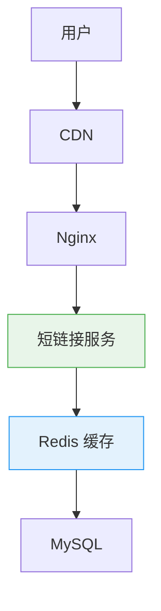
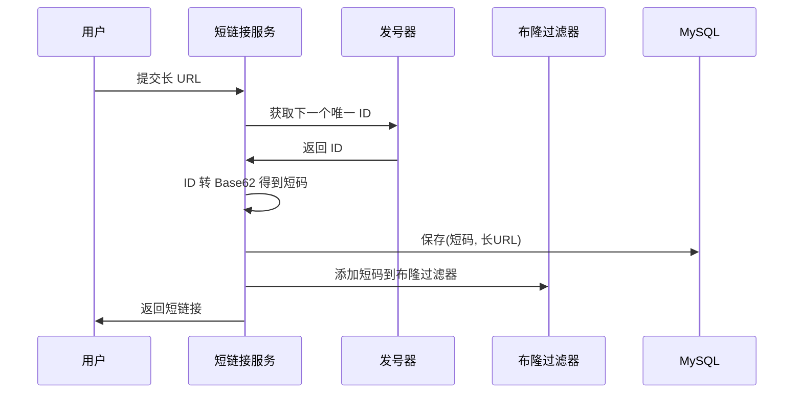
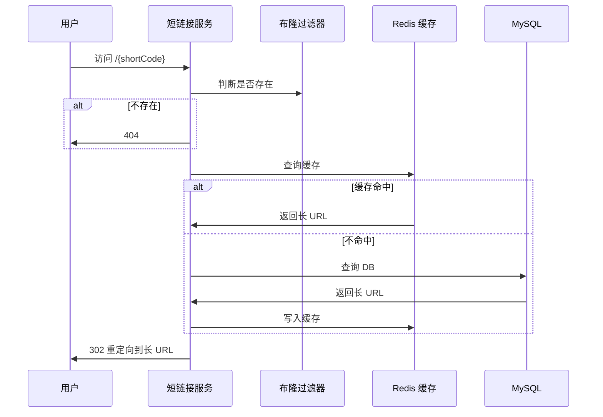

# 短链接系统：发号器、编码与布隆过滤器

创建日期：2026-06-06

## 需求分析

### 功能需求

- 输入长 URL → 生成短 URL。
- 访问短 URL → 301/302 重定向到原始长 URL。
- 支持自定义短链接别名。
- 支持设置过期时间。
- 访问统计（可选）。

### 非功能需求

- **QPS**：重定向 QPS 高（读多写少），读写比约 100:1。
- **延迟**：重定向 P99 < 50ms。
- **可用性**：高可用，短链接不能挂。
- **容量**：支持至少 10 亿个不同短链接。

### 容量估算

- 假设日增 100 万短链接，一年约 3.6 亿条。
- 每条数据：短码 + 长 URL + 过期时间，约 200 字节。
- 10 亿条 ≈ 200GB，分库分表能装下。

## 整体架构



- **读多写少**：重定向占绝大多数，靠缓存扛。
- **层级缓存**：应用本地缓存 + Redis 分布式缓存，热点数据快速返回。

## 核心问题：短码怎么生成？

### 方案对比

| 方案 | 原理 | 优缺点 |
|------|------|--------|
| **UUID** | 生成 UUID，取前几位 | ❌ 无序，索引性能差；太长，不紧凑 |
| **哈希算法** | MD5 长 URL，取几位转 Base62 | ❌ 存在哈希冲突，需要碰撞检测 |
| **发号器（推荐）** | 全局唯一 ID → Base62 编码 | ✅ 全局唯一，不会重复，简单可靠 |

### 发号器实现

1. **数据库自增 ID**：单机够用，分库分表需要号段模式。
2. **雪花算法（Snowflake）**：分布式生成唯一 ID，时间戳 + 机器 ID + 序列号。
3. **号段模式（Leaf）**：美团 Leaf，批量预取 ID 段，减少 DB 访问，性能好。

### Base62 编码

为什么用 Base62？字符包含 `0-9 a-z A-Z`，共 62 个字符，都是 URL 安全字符。

| 位数 | 容量 | 适用场景 |
|------|------|---------|
| 6 位 | 62⁶ ≈ 568 亿 | 中小规模足够 |
| 7 位 | 62⁷ ≈ 35 万亿 | 大规模够用 |
| 8 位 | 62⁸ ≈ 218 万亿 | 永远够用 |

```java
// ID → Base62 编码
public String encode(long id) {
    StringBuilder sb = new StringBuilder();
    while (id > 0) {
        sb.append(CHARS[(int)(id % 62)]);
        id = id / 62;
    }
    return sb.reverse().toString();
}
```

::: tip 为什么不用 Base64？
Base64 包含 `+/=` 特殊字符，`+` 和 `/` 在 URL 中有特殊含义，需要额外编码，不友好。
:::

## 布隆过滤器防穿透

**问题：** 恶意构造不存在的短码访问，大量请求穿透到 DB，打垮 DB。

**解决方案：** 布隆过滤器把所有存在的短码放进去，不存在的直接拒绝，不查缓存也不查 DB。

**原理：** 一个大的 bit 数组，多个哈希函数，把 key 映射到位数组不同位置：
- 存在：对应位置都为 1。
- 查询：只要有一个位置是 0，说明**一定不存在**。
- 可能有误判（存在不一定 100% 正确），但不存在一定正确。
- 空间效率极高，1 亿个 key 只需要约 12MB。

**适用短链接场景完美：** 不存在的短码直接被挡，就算误判，少部分漏过去查 DB 返回 404，影响很小。

## 301 vs 302 重定向

| 状态码 | 特点 | 优缺点 | 适用场景 |
|--------|------|--------|---------|
| **301 永久重定向** | 浏览器会缓存 | 跳转快，但改了地址用户还是跳旧的 | 不变的短链接，推荐 |
| **302 临时重定向** | 浏览器不缓存 | 方便统计，但每次都回源，延迟大 | 需要统计点击量 |

::: tip 选型建议
不需要实时统计 → 301，用户体验好，速度快。需要统计点击量 → 302，每次都能打到服务统计。
:::

## 分库分表设计

**分片思路：** 短码做哈希取模，分散到不同库不同表。

```
tableIndex = hash(shortCode) % 表数
```

**为什么不用范围分片？** ID 递增，范围分片会导致热点（最新 ID 都在最新表），哈希分片更均匀。

**索引设计：** 短码是唯一查询条件，且作为分库分表键，一次查询就能找到，不需要跨表。

## 完整流程

### 生成短链接



### 重定向流程



---

## 经典高频面试题

### Q1：短链接为什么用发号器不用哈希？哈希有什么问题？

**参考答案：**

哈希对长 URL 计算，可能产生哈希冲突，两个不同长 URL 算出相同短码，需要碰撞检测和重试，实现复杂。发号器生成全局唯一 ID，转 Base62，绝对不会重复，实现简单可靠，所以推荐发号器。

### Q2：为什么用 Base62 编码？Base64 不行吗？

**参考答案：**

Base64 用了 `+/=` 三个字符，`+` 和 `/` 在 URL 中有特殊含义，需要编码，不友好。Base62 只用了 `0-9a-zA-Z`，共 62 个，都是 URL 安全字符，所以用 Base62。

### Q3：布隆过滤器在短链接系统里有什么用？原理是什么？

**参考答案：**

防缓存穿透。恶意构造不存在的短码访问，会打垮 DB。布隆过滤器可以快速判断短码不存在，直接拒绝，不会穿透到 DB。

原理：用多个哈希函数把 key 映射到 bit 数组，不存在一定不存在，存在可能有误判。空间效率极高，适合这个场景。

### Q4：301 和 302 重定向怎么选？各有什么优缺点？

**参考答案：**

- **301 永久重定向**：浏览器会缓存，跳转快。但如果短链接改了地址，用户浏览器还是跳旧的。适合不变的短链接。
- **302 临时重定向**：每次都回源，可以统计点击量。但每次都回源性能差一点。
- 不需要统计选 301，需要统计选 302。

### Q5：短链接系统怎么分库分表？为什么用哈希分片不用范围？

**参考答案：**

用短码做哈希取模，路由到不同库表，查询一次就能找到，均匀分布。发号器生成的 ID 是递增的，如果范围分片，新生成的 ID 都在最新的表，会产生热点，所有写入都打最新表。所以用哈希分片更均匀。

### Q6：短链接怎么防爬虫？防止被用来跳转诈骗网站？

**参考答案：**

- 加域名黑名单检测，跳转前检查目标域名是否在黑名单。
- 加验证码，频繁访问需要验证码，防止爬虫批量扫短链接。
- 限制单 IP 访问频率，异常流量直接封禁。