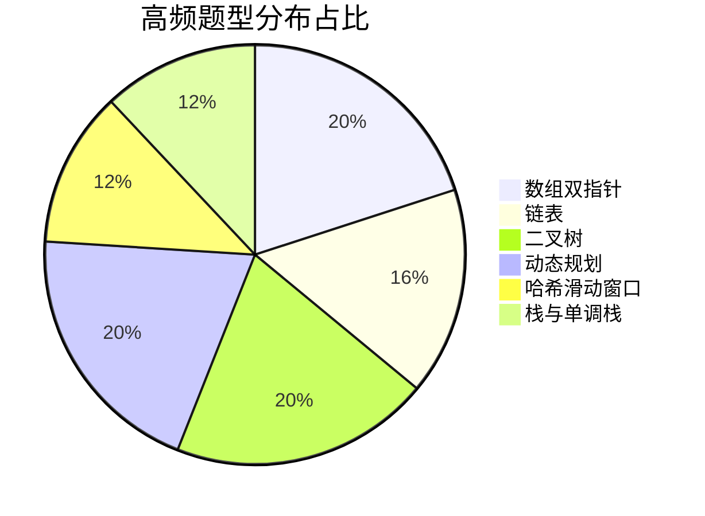
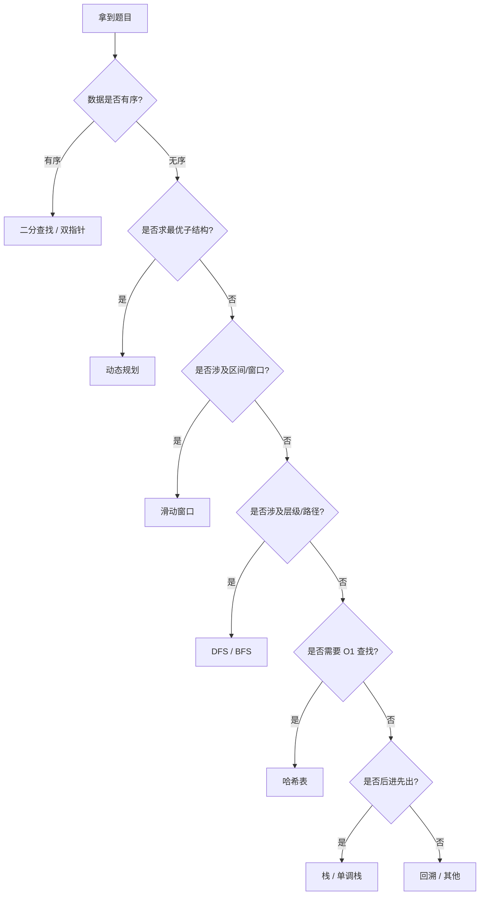
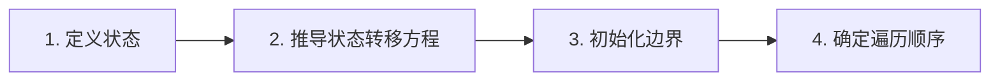

# 高频题汇总

> 创建日期：2026-06-06

## ⭐ 面试重点速览

| 考察点 | 重要程度 | 考察频率 | 掌握目标 |
|--------|----------|----------|----------|
| 数组与双指针 | ⭐⭐⭐ | 高频 | 秒出最优解 |
| 链表操作 | ⭐⭐⭐ | 高频 | 源码级 |
| 二叉树遍历与递归 | ⭐⭐⭐ | 高频 | 手写模板 |
| 动态规划 | ⭐⭐⭐ | 高频 | 四步法推导 |
| 哈希表与滑动窗口 | ⭐⭐ | 中高频 | 边界条件零失误 |
| 栈与单调栈 | ⭐⭐ | 中高频 | 模式识别 |
| 堆与优先队列 | ⭐⭐ | 中频 | Top K 秒杀 |
| 二分查找 | ⭐⭐ | 中频 | 变体全覆盖 |
| 回溯算法 | ⭐⭐ | 中频 | 剪枝优化 |
| 图论基础 | ⭐ | 中低频 | DFS/BFS 模板 |

## 一、问题背景

在高级工程师面试中，算法能力是硬性门槛。国内一线大厂（字节跳动、阿里、腾讯等）以及外企（Google、Meta、Amazon）的面试流程中，通常包含 2~4 轮算法面试，每轮 45~60 分钟，要求候选人在白板或在线编辑器上完成 1~2 道中等至困难难度的算法题。

面试官考察的不仅是"能否做出来"，更关注以下维度：

1. **问题分析能力**：能否快速识别问题类型，选择合适的数据结构与算法。
2. **编码质量**：代码风格、边界条件处理、异常情况考虑是否周全。
3. **复杂度分析**：能否准确分析时间与空间复杂度，并讨论优化方向。
4. **沟通与协作**：能否清晰地表达思路，与面试官有效沟通。

根据近两年面经统计，以下题型占据了 80% 以上的算法面试题：数组双指针、链表、二叉树、动态规划、哈希滑动窗口、栈与单调栈。本文按这六大题型分类，梳理 Top 50 高频题，并给出套路总结。

## 二、核心内容

### 2.1 题型分布全景图



### 2.2 解题流程决策树



### 2.3 难度与时间对照

| 难度 | LeetCode 标识 | 建议用时 | 面试出现频率 | 典型题量 |
|------|--------------|----------|-------------|----------|
| Easy | 简单 | 5~8 min | 热身题 | 约 5 题 |
| Medium | 中等 | 15~20 min | 主力题 | 约 35 题 |
| Hard | 困难 | 25~30 min | 加试题 | 约 10 题 |

### 2.4 核心数据结构复杂度速查

| 数据结构 | 查找 | 插入 | 删除 | 特点 |
|----------|------|------|------|------|
| 数组 | O(1)/O(n) | O(n) | O(n) | 随机访问快，插入删除慢 |
| 链表 | O(n) | O(1) | O(1) | 插入删除快，无随机访问 |
| 哈希表 | O(1) | O(1) | O(1) | 均摊 O(1)，最坏 O(n) |
| 平衡二叉树 | O(log n) | O(log n) | O(log n) | 有序，范围查询快 |
| 堆 | O(1) 取最值 | O(log n) | O(log n) | 动态维护最值 |
| 跳表 | O(log n) | O(log n) | O(log n) | Redis 有序集合底层 |

### 2.5 Top 50 高频题分类总表

#### 数组双指针 (10 题)

| # | 题目 | 难度 | 核心考察点 | 关键思路 | 时间复杂度 |
|---|------|------|-----------|----------|-----------|
| 1 | 两数之和 (Two Sum) | Easy | 哈希表 | 一次遍历，查补数 | O(n) |
| 2 | 三数之和 (3Sum) | Medium | 排序 + 双指针 | 固定一个，双指针找另外两个 | O(n^2) |
| 3 | 盛最多水的容器 | Medium | 双指针贪心 | 左右指针向内收缩，谁矮移谁 | O(n) |
| 4 | 移动零 (Move Zeroes) | Easy | 双指针 | 快慢指针，非零元素前移 | O(n) |
| 5 | 接雨水 (Trapping Rain Water) | Hard | 双指针/单调栈/DP | 左右双指针维护最大高度 | O(n) |
| 6 | 无重复字符的最长子串 | Medium | 滑动窗口 | 哈希表记录字符上次出现位置 | O(n) |
| 7 | 找到字符串中所有字母异位词 | Medium | 滑动窗口 | 固定窗口 + 计数比较 | O(n) |
| 8 | 合并两个有序数组 | Easy | 逆向双指针 | 从后往前填充，避免覆盖 | O(m+n) |
| 9 | 最长连续序列 | Medium | 哈希表 | 只从序列起点开始计数 | O(n) |
| 10 | 旋转数组的最小数字 | Medium | 二分查找 | 与右端点比较，缩小范围 | O(log n) |

#### 链表 (8 题)

| # | 题目 | 难度 | 核心考察点 | 关键思路 | 时间复杂度 |
|---|------|------|-----------|----------|-----------|
| 1 | 反转链表 (Reverse Linked List) | Easy | 迭代/递归 | pre/cur/nxt 三指针 | O(n) |
| 2 | 环形链表 (Linked List Cycle) | Easy | 快慢指针 | fast 走两步，slow 走一步 | O(n) |
| 3 | 环形链表 II | Medium | 快慢指针 + 数学 | 相遇后从头再走，相遇即入口 | O(n) |
| 4 | K 个一组翻转链表 | Hard | 分组 + 反转 | 每 k 个一组断开、反转、重连 | O(n) |
| 5 | 合并 K 个升序链表 | Hard | 分治 / 堆 | 分治法两两合并 或 最小堆 | O(n log k) |
| 6 | 相交链表 | Easy | 双指针 | A+B 路径等长，相遇即交点 | O(m+n) |
| 7 | 删除链表的倒数第 N 个节点 | Medium | 快慢指针 | fast 先走 n 步再同步 | O(n) |
| 8 | LRU 缓存 | Medium | 哈希表 + 双向链表 | 哈希表 O(1) 查找，双向链表 O(1) 移队 | O(1) |

#### 二叉树 (10 题)

| # | 题目 | 难度 | 核心考察点 | 关键思路 | 时间复杂度 |
|---|------|------|-----------|----------|-----------|
| 1 | 二叉树的中序遍历 | Easy | 递归/迭代 | 左根右 递归 或 栈模拟 | O(n) |
| 2 | 二叉树的最大深度 | Easy | DFS/BFS | 递归 max(left, right) + 1 | O(n) |
| 3 | 翻转二叉树 | Easy | 递归 | 交换左右子树再递归 | O(n) |
| 4 | 对称二叉树 | Easy | 递归/迭代 | 双指针递归比较镜像位置 | O(n) |
| 5 | 二叉树的层序遍历 | Medium | BFS | 队列，按层收集 | O(n) |
| 6 | 二叉树的直径 | Easy | DFS | 后序遍历，同时更新最大直径 | O(n) |
| 7 | 验证二叉搜索树 | Medium | 中序遍历 | 中序严格递增即合法 | O(n) |
| 8 | 二叉搜索树中第 K 小的元素 | Medium | 中序遍历 + 计数 | 中序到第 k 个停止 | O(H+k) |
| 9 | 从前序与中序遍历序列构造二叉树 | Medium | 递归分治 | 前序找根，中序分左右 | O(n) |
| 10 | 二叉树的最近公共祖先 | Medium | 后序遍历 | 自底向上，遇到 p/q 或同时有左右则返回 | O(n) |

#### 动态规划 (10 题)

| # | 题目 | 难度 | 核心考察点 | 关键思路 | 时间复杂度 |
|---|------|------|-----------|----------|-----------|
| 1 | 爬楼梯 (Climbing Stairs) | Easy | 斐波那契 DP | dp[i] = dp[i-1] + dp[i-2] | O(n) |
| 2 | 最大子数组和 | Medium | Kadane 算法 | dp[i] = max(nums[i], dp[i-1] + nums[i]) | O(n) |
| 3 | 买卖股票的最佳时机 | Easy | 一次遍历 | 记录历史最低价，算最大利润 | O(n) |
| 4 | 打家劫舍 (House Robber) | Medium | 状态 DP | dp[i] = max(dp[i-1], dp[i-2] + nums[i]) | O(n) |
| 5 | 最长递增子序列 (LIS) | Medium | DP + 二分 | dp 数组 + 二分查找优化到 O(n log n) | O(n log n) |
| 6 | 最长回文子串 | Medium | 中心扩展/DP | 以每个位置为中心向两边扩展 | O(n^2) |
| 7 | 编辑距离 (Edit Distance) | Hard | 二维 DP | dp[i][j] = min(插, 删, 换) | O(mn) |
| 8 | 零钱兑换 (Coin Change) | Medium | 完全背包 | dp[amount] = min(dp[amount-coin] + 1) | O(amount*n) |
| 9 | 不同路径 (Unique Paths) | Medium | 网格 DP | dp[i][j] = dp[i-1][j] + dp[i][j-1] | O(mn) |
| 10 | 单词拆分 (Word Break) | Medium | DP + 哈希 | dp[i] 表示前 i 个字符能否拆分 | O(n^2) |

#### 哈希滑动窗口 (6 题)

| # | 题目 | 难度 | 核心考察点 | 关键思路 | 时间复杂度 |
|---|------|------|-----------|----------|-----------|
| 1 | 无重复字符的最长子串 | Medium | 滑动窗口 + 哈希 | 窗口内无重复，遇重收缩左边界 | O(n) |
| 2 | 最小覆盖子串 | Hard | 滑动窗口 | need 与 window 计数，满足条件时收缩 | O(n) |
| 3 | 字母异位词分组 | Medium | 哈希编码 | 排序后字符串作 key | O(nk log k) |
| 4 | 和为 K 的子数组 | Medium | 前缀和 + 哈希 | preSum[j] - preSum[i] = k | O(n) |
| 5 | 找到字符串中所有字母异位词 | Medium | 固定窗口 | 维护等长窗口，计数比较 | O(n) |
| 6 | 字符串解码 | Medium | 栈/递归 | 遇 `]` 弹出解码再压回 | O(n) |

#### 栈与单调栈 (6 题)

| # | 题目 | 难度 | 核心考察点 | 关键思路 | 时间复杂度 |
|---|------|------|-----------|----------|-----------|
| 1 | 有效的括号 (Valid Parentheses) | Easy | 栈匹配 | 左括号入栈，右括号检查栈顶 | O(n) |
| 2 | 每日温度 (Daily Temperatures) | Medium | 单调递减栈 | 栈存索引，遇更高温度则出栈结算 | O(n) |
| 3 | 柱状图中最大的矩形 | Hard | 单调递增栈 | 以每个高度为中心，找左右边界 | O(n) |
| 4 | 下一个更大元素 II | Medium | 单调栈 + 循环 | 遍历两遍数组 | O(n) |
| 5 | 最小栈 (Min Stack) | Medium | 辅助栈 | 同步维护最小元素栈 | O(1) |
| 6 | 字符串解码 | Medium | 栈 | 遇数字和字母入栈，`]` 出栈计算 | O(n) |

## 三、代码示例 / 实战案例

### 3.1 数组双指针 —— 三数之和（3Sum）

```java
// 核心思路：排序后固定一个数，剩余两个数用双指针
public List<List<Integer>> threeSum(int[] nums) {
    List<List<Integer>> res = new ArrayList<>();
    Arrays.sort(nums); // 排序是前提
    int n = nums.length;
    for (int i = 0; i < n - 2; i++) {
        if (nums[i] > 0) break; // 剪枝：最小的数 > 0，不可能和为 0
        if (i > 0 && nums[i] == nums[i - 1]) continue; // 去重
        int left = i + 1, right = n - 1;
        while (left < right) {
            int sum = nums[i] + nums[left] + nums[right];
            if (sum == 0) {
                res.add(Arrays.asList(nums[i], nums[left], nums[right]));
                // 跳过重复元素
                while (left < right && nums[left] == nums[left + 1]) left++;
                while (left < right && nums[right] == nums[right - 1]) right--;
                left++; right--;
            } else if (sum < 0) {
                left++;
            } else {
                right--;
            }
        }
    }
    return res;
}
```

::: tip 关键要点
排序 + 双指针是处理"n 数之和"类问题的通用范式。时间复杂度 O(n^2)，空间复杂度 O(1)。
:::

### 3.2 链表 —— K 个一组翻转链表

```java
// 核心思路：每 k 个节点为一组断开，反转后重新连接
public ListNode reverseKGroup(ListNode head, int k) {
    ListNode dummy = new ListNode(0, head);
    ListNode prev = dummy;
    while (head != null) {
        ListNode tail = prev;
        // 检查剩余节点是否够 k 个
        for (int i = 0; i < k; i++) {
            tail = tail.next;
            if (tail == null) return dummy.next;
        }
        ListNode nextGroup = tail.next;
        // 断开当前组，反转
        tail.next = null;
        ListNode newHead = reverse(head); // head 变成尾，tail 变成头
        // 重新连接
        prev.next = newHead;
        head.next = nextGroup;
        // 移动到下一组
        prev = head;
        head = nextGroup;
    }
    return dummy.next;
}

private ListNode reverse(ListNode head) {
    ListNode prev = null, cur = head;
    while (cur != null) {
        ListNode nxt = cur.next;
        cur.next = prev;
        prev = cur;
        cur = nxt;
    }
    return prev;
}
```

::: warning 易错点
反转后原 head 变成了 tail，连接下一组时要用 `head.next = nextGroup` 而非 `newHead.next`。
:::

### 3.3 动态规划 —— 编辑距离

```java
// dp[i][j] 表示 word1 前 i 个字符转换为 word2 前 j 个字符的最小操作数
public int minDistance(String word1, String word2) {
    int m = word1.length(), n = word2.length();
    int[][] dp = new int[m + 1][n + 1];
    // 初始化：空串到另一个串需要逐个插入/删除
    for (int i = 0; i <= m; i++) dp[i][0] = i;
    for (int j = 0; j <= n; j++) dp[0][j] = j;
    
    for (int i = 1; i <= m; i++) {
        for (int j = 1; j <= n; j++) {
            if (word1.charAt(i - 1) == word2.charAt(j - 1)) {
                dp[i][j] = dp[i - 1][j - 1]; // 相同，无需操作
            } else {
                dp[i][j] = 1 + Math.min(
                    Math.min(dp[i - 1][j],     // 删除 word1[i-1]
                             dp[i][j - 1]),    // 插入 word2[j-1]
                    dp[i - 1][j - 1]           // 替换
                );
            }
        }
    }
    return dp[m][n];
}
```

::: info 状态压缩技巧
dp[i][j] 只依赖 dp[i-1][j]、dp[i][j-1]、dp[i-1][j-1]，可优化空间为 O(min(m,n)) 的一维数组。
:::

### 3.4 题型套路总结

#### 动态规划四步法



1. **定义状态**：明确 dp[i] 或 dp[i][j] 代表什么含义，通常是最优子结构的解。
2. **推导转移方程**：找到当前状态与之前状态的关系，这是 DP 的核心难点。
3. **初始化边界**：dp[0]、dp 首行/首列等基础情况的处理。
4. **确定遍历顺序**：根据状态依赖关系确定是正序还是逆序遍历，进而考虑是否可做空间优化。

#### 二叉树遍历模板

```java
// 前序遍历（递归）
void preorder(TreeNode root) {
    if (root == null) return;
    // 处理 root
    preorder(root.left);
    preorder(root.right);
}

// 中序遍历（迭代）—— 面试高频手写
void inorder(TreeNode root) {
    Deque<TreeNode> stack = new ArrayDeque<>();
    TreeNode cur = root;
    while (cur != null || !stack.isEmpty()) {
        while (cur != null) { // 一路向左
            stack.push(cur);
            cur = cur.left;
        }
        cur = stack.pop();
        // 处理 cur
        cur = cur.right; // 转向右子树
    }
}

// 层序遍历（BFS）
void levelOrder(TreeNode root) {
    if (root == null) return;
    Queue<TreeNode> queue = new LinkedList<>();
    queue.offer(root);
    while (!queue.isEmpty()) {
        int size = queue.size(); // 当前层节点数
        for (int i = 0; i < size; i++) {
            TreeNode node = queue.poll();
            // 处理 node
            if (node.left != null) queue.offer(node.left);
            if (node.right != null) queue.offer(node.right);
        }
    }
}
```

::: tip 面试建议
迭代版中序遍历必须能默写，几乎所有 BST 问题都基于中序遍历的变体。
:::

## 四、常见误区与坑点

| 误区 | 说明 | 正确做法 |
|------|------|----------|
| 二分查找 mid 计算溢出 | `(left + right) / 2` 在 left 和 right 很大时溢出 | 使用 `left + (right - left) / 2` |
| 链表操作忽略哑节点 | 处理头节点变更时逻辑复杂 | 统一使用 `dummy` 节点简化边界处理 |
| DP 数组下标混乱 | `dp[0]` 含义不明确，导致初始化错误 | 明确定义 dp[i] 含义，画表辅助分析 |
| 滑动窗口条件遗漏 | 只移动右边界，忽略收缩左边界 | 双重 while：外层扩展右边界，内层收缩左边界 |
| 递归未考虑栈溢出 | 链表/树特别深时递归会溢出 | 适时改用迭代，或用尾递归优化（Java 不支持） |
| 双指针去重遗漏 | 三数之和、四数之和中忽略重复元素跳过 | 排序后，相邻相等元素需要 skip |
| 位运算优先级错误 | `(n & 1) == 0` 漏掉括号 | 位运算优先级低于 `==`，必须加括号 |
| 边界值测试遗漏 | 只测试正常用例 | 测试空输入、单元素、极大值、负值等 |

::: danger 致命错误
在面试中写出错误代码而不自知。写完代码后，务必用 2~3 个测试用例（含边界情况）手动走一遍逻辑。
:::

::: warning 常见陷阱
- **long 转 int**：Java 中 `(int)(a + b)` 当 a+b 超过 int 范围时结果错误，应先转 long 再转回。
- **浮点比较**：`float` 和 `double` 的 `==` 比较因精度问题可能意外失败。
- **数组越界**：凡是涉及 `i+1`、`i-1`、`mid+1`、`mid-1` 的地方，都要确认边界条件。
:::

## 五、面试高频问题汇总

### Q1：请描述 LRU 缓存的实现思路和时间复杂度

**参考答案：**

LRU（Least Recently Used）缓存需要支持 O(1) 的 get 和 put 操作。核心数据结构是**哈希表 + 双向链表**：

- **哈希表**：存储 key 到双向链表节点的映射，实现 O(1) 查找。
- **双向链表**：维护访问顺序。最近访问的节点放在链表头部，最久未使用的在尾部。

**具体操作**：
- `get(key)`：哈希表 O(1) 查找，找到后将对应节点移到链表头部（表示最近访问），返回 value。未找到返回 -1。
- `put(key, value)`：若 key 已存在则更新 value 并移到头部；若不存在，新建节点插入头部。检查容量：若超出 capacity，删除链表尾部节点（最久未使用）并从哈希表中移除。

**时间复杂度**：get 和 put 均为 O(1)。
**空间复杂度**：O(capacity)。

**关键细节**：使用伪头部（dummy head）和伪尾部（dummy tail）简化边界处理，避免空指针判断。

### Q2：最长回文子串的最优解是什么？请说明核心思路

**参考答案：**

最长回文子串的最优解是**中心扩展法**，时间复杂度 O(n^2)，空间复杂度 O(1)。

**核心思路**：
回文串有两种形式——奇数长度（中心是一个字符）和偶数长度（中心是两个字符）。遍历字符串的每个位置，以该位置（或该位置与下一个位置之间）为中心向两侧扩展，记录最长回文子串的起止位置。

**算法步骤**：
1. 遍历 i 从 0 到 n-1。
2. 以 i 为中心（奇数长度）扩展，记录回文长度。
3. 以 i 和 i+1 之间为中心（偶数长度）扩展，记录回文长度。
4. 更新全局最长回文子串。

**对比**：动态规划解法时间复杂度也是 O(n^2)，但空间复杂度为 O(n^2)，不如中心扩展法高效。Manacher 算法可做到 O(n)，但实现复杂，面试中中心扩展法已足够展示能力。

### Q3：接雨水问题有哪些解法？各有什么优劣？

**参考答案：**

接雨水（Trapping Rain Water）有三种主流解法：

**解法一：双指针（推荐）**
- 思路：左右各一个指针，同时维护 leftMax 和 rightMax。哪边的最大高度小，就处理哪边的指针。
- 若 `height[left] < height[right]`，则 left 处的雨水量 = max(0, leftMax - height[left])，然后 left++。
- 反之处理 right。
- 时间 O(n)，空间 O(1)。

**解法二：动态规划**
- 预处理 leftMax[i]（位置 i 左边的最大高度）和 rightMax[i]（位置 i 右边的最大高度）。
- 每个位置的雨水量 = max(0, min(leftMax[i], rightMax[i]) - height[i])。
- 时间 O(n)，空间 O(n)。

**解法三：单调栈**
- 维护一个递减栈。遇到比栈顶高的柱子时，说明形成了凹槽，弹出栈顶计算水量。
- 时间 O(n)，空间 O(n)。

**面试建议**：优先掌握双指针解法（最优空间），能讲清楚单调栈思路也很加分。

### Q4：K 个一组翻转链表的解题思路和关键边界处理

**参考答案：**

**解题思路**：
1. 创建哑节点 `dummy`，使其 next 指向 head，方便处理头节点变更。
2. 用 `prev` 指向当前要翻转的组的前一个节点。
3. 每次循环：
   - 检查剩余节点是否够 k 个（通过 tail 指针走 k 步判断）。
   - 如果不够 k 个，直接返回。
   - 记录下一组的起始节点 `nextGroup = tail.next`。
   - 断开当前组（`tail.next = null`），反转当前组的 k 个节点。
   - 反转后原来的 head 变成尾节点，原来的 tail 变成头节点。
   - 重新连接：`prev.next = newHead`；`head.next = nextGroup`。
   - 更新 prev 和 head 指针到下一组。

**关键边界处理**：
- 不足 k 个节点时不做翻转，直接返回。
- 翻转后，原来的 `head` 变成了组内最后一个节点，要用它来连接下一组（`head.next = nextGroup`），而非用翻转后的新头节点。
- 各组之间的连接由 `prev.next` 负责维护。

**时间复杂度**：O(n)，每个节点被访问常数次。
**空间复杂度**：O(1)，仅使用有限个指针变量。

### Q5：合并 K 个升序链表的最优解法

**参考答案：**

合并 K 个升序链表有两种主流解法：

**解法一：分治法（归并思想）—— 推荐**
- 思路：两两合并链表，类似于归并排序。每次将 K 个链表对半分，递归合并。
- 合并函数 `mergeTwoLists` 复用"合并两个有序链表"的逻辑。
- 时间 O(n log k)，其中 n 是所有链表的节点总数，log k 是递归深度。
- 空间 O(log k)，递归栈深度。

**解法二：最小堆（优先队列）**
- 思路：将 K 个链表的头节点放入最小堆。每次弹出堆顶（最小值），将其加入结果链表，并将该节点的 next 节点（如存在）重新入堆。
- 时间 O(n log k)，每次堆操作 O(log k)。
- 空间 O(k)，堆中最多同时有 k 个节点。

**对比选择**：
| 维度 | 分治法 | 最小堆 |
|------|--------|--------|
| 时间复杂度 | O(n log k) | O(n log k) |
| 空间复杂度 | O(log k) | O(k) |
| 实现难度 | 稍复杂（递归） | 较简单 |
| 代码长度 | 较长 | 较短 |

面试中优先推荐分治法，体现了归并思想，且空间占用更优。

### Q6：如何判断一道题该用 DP 还是贪心？请举例说明

**参考答案：**

**判断标准**：
- **贪心（Greedy）**：每步都选当前看起来最优的决策，全局最优由局部最优叠加而成。要求问题具有"贪心选择性质"（局部最优选择能导出全局最优）。
- **动态规划（DP）**：当前决策依赖于之前所有决策，问题的最优解包含子问题的最优解（最优子结构），且子问题之间有重叠。

**典型对比**：

| 问题 | 贪心适用？ | DP适用？ | 说明 |
|------|-----------|----------|------|
| 跳跃游戏 II | 是（每次选能跳最远的） | 是 | 贪心更优 O(n)，DP 是 O(n^2) |
| 打家劫舍 | 否 | 是 | 相邻制约，贪心会出错 |
| 零钱兑换 | 是（硬币面额特殊时） | 是 | 一般情况必须 DP |
| 背包问题 | 否（0-1背包） | 是 | 部分背包才可用贪心 |
| 最大子数组和 | 是（Kadane） | 是 | 贪心 O(n) 最优 |

**面试技巧**：如果不确定能否贪心，先用 DP 推导，然后观察是否可以做状态压缩或贪心优化。

### Q7：二叉树的几种遍历方式分别在什么场景下使用？

**参考答案：**

| 遍历方式 | 典型应用场景 | 特点 |
|----------|-------------|------|
| **前序遍历** | 序列化二叉树、复制树结构 | 先处理根，再递归子树 |
| **中序遍历** | BST 的升序输出、验证 BST、找第 K 小元素 | BST 中序严格递增 |
| **后序遍历** | 计算子树和/高度、删除树（先删子树）、最近公共祖先 | 先处理子树再处理根 |
| **层序遍历** | 按层收集节点、求树的宽度、最短路径（无权图 BFS） | 队列实现 |

**进阶理解**：
- 几乎所有树的问题都可以归类为某种遍历的变体。例如"二叉树的直径"本质是后序遍历中同时计算深度和更新直径。
- 前序 + 中序 或 中序 + 后序 可以唯一确定一棵二叉树（前序+后序则不能，需满足一定条件）。

---

> **总结**：算法面试的核心不是背诵题解，而是建立题型 -> 模式 -> 解法 的条件反射。熟练掌握本文梳理的六大题型 Top 50 题，能够覆盖绝大多数一线大厂的算法面试。建议按分类逐类攻克，每道题做到：能说出思路 -> 能写出代码 -> 能分析复杂度 -> 能讲清优化方向。

::: tip 📚 深入理解算法原理
刷题之余，建议配合 [算法专题](/algorithm-topics/) 深入理解每种算法背后的**设计思想、应用场景和底层原理**。从冒泡排序到 Transformer，从趣味解说到面试高频题，完整覆盖经典算法到 AI 算法。
:::