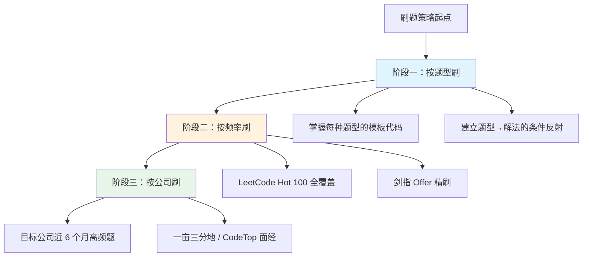

# 算法刷题指南

> 创建日期：2026-06-06

## ⭐ 面试重点速览

| 考察点 | 重要程度 | 考察频率 | 掌握目标 |
|--------|----------|----------|----------|
| 数组与双指针 | ⭐⭐⭐ | 高频 | 秒杀级 |
| 链表操作 | ⭐⭐⭐ | 高频 | 源码级 |
| 二叉树遍历与变体 | ⭐⭐⭐ | 高频 | 秒杀级 |
| 动态规划 | ⭐⭐⭐ | 高频 | 中等难度 AC |
| 回溯算法 | ⭐⭐⭐ | 中高频 | 模板化输出 |
| 哈希表应用 | ⭐⭐ | 高频 | 熟练运用 |
| 栈与队列 | ⭐⭐ | 中频 | 熟练运用 |
| 贪心算法 | ⭐⭐ | 中频 | 能推理证明 |
| 图论（BFS/DFS） | ⭐⭐ | 中低频 | 理解核心模板 |
| 位运算 | ⭐ | 低频 | 了解常见技巧 |

## 一、问题背景

对于高级工程师面试而言，算法考察是绕不开的一环，但它通常不是考察的核心。一个普遍认可的事实是：**算法在面试中的权重约为 10%**，大厂面试官更看重的是系统设计能力、工程思维、项目深度和软技能。

然而，"只占 10%" 并不等于"可以不做准备"。在实际面试中，一道算法题直接写不出来，可能让面试官对你整个面试表现产生负面联想，甚至一票否决。因此，算法准备的目标不是"刷满 500 题"，而是**用最小的代价拿到这 10% 的分数**。

当前主流面试算法题来源高度集中：**LeetCode 的 Hot 100 和剑指 Offer 系列覆盖了约 80% 的考察范围**。掌握科学的刷题策略，远比盲目堆砌题量更有效率。

::: tip 关键认知
算法面试的本质不是考察你"会不会做这道题"，而是看你面对未知问题时的**分析过程、沟通能力和代码习惯**。面试时边想边说，比闷头写出最优解更重要。
:::

## 二、核心内容

### 2.1 刷题策略三维模型

刷题不能随机乱刷，推荐采用**三维渐进策略**：



**阶段一：按题型刷（打基础，约 40% 时间）**

每种题型挑选 5~8 道经典题，目标是**形成肌肉记忆**。比如链表反转，练到不看提示也能默写递归和迭代两种写法。这个阶段不求数量，求覆盖和熟练度。

| 题型 | 推荐题量 | 核心模板 |
|------|----------|----------|
| 数组 / 双指针 | 8 题 | 左右指针、快慢指针、滑动窗口 |
| 链表 | 6 题 | 反转、合并、找环、删除节点 |
| 二叉树 | 8 题 | 前中后序遍历（递归+迭代）、层序遍历 |
| 动态规划 | 10 题 | 背包、最长子序列、打家劫舍系列 |
| 回溯 | 6 题 | 子集、排列、组合、N 皇后 |
| 栈 / 队列 | 5 题 | 单调栈、括号匹配、Top K |
| 哈希表 | 5 题 | 两数之和变体、字符统计 |

**阶段二：按频率刷（刷高频，约 40% 时间）**

以 LeetCode Hot 100 为核心题库，按照出现频率从高到低逐题攻克。Hot 100 之所以经典，是因为它们覆盖了最核心的解题范式，一道题往往能带出一类题的解法。

**阶段三：按公司刷（冲刺，约 20% 时间）**

面试前 2 周，针对目标公司刷近 6 个月的高频题。推荐使用 [CodeTop](https://codetop.cc) 等面经平台查看公司题库。这个阶段的目的是**熟悉目标公司的出题偏好和难度分布**。

::: warning 注意
阶段三不要过早开始——公司题库随时在变，提前 1-2 周看才有参考价值。过早依赖公司题库反而会限制知识面的广度。
:::

### 2.2 LeetCode Hot 100 使用指南

Hot 100 是刷题的核心教材，但正确的使用方式不是"从头到尾刷一遍"：

1. **第一遍：筛选分类** —— 先把 100 道题按题型归入 2.1 节的分类表中，标记你已经掌握的题，筛出薄弱题型。
2. **第二遍：按类攻克** —— 针对薄弱题型集中突破，同一题型的题连续做，强化模式识别。
3. **第三遍：限时训练** —— 每道题限时 25 分钟，模拟真实面试的思考节奏，超过时间就看题解并复盘。

::: info Hot 100 数据参考
根据社区统计，大厂算法面试题中约 60% 直接来自 Hot 100，另有 20% 是其变体题。把这 100 题做到"看题 5 秒内有思路"，基本可以应对绝大多数算法面。
:::

### 2.3 每日刷题计划模板

以下是一个可在工作日执行的计划模板，每天投入 60~90 分钟：

| 时间段 | 内容 | 时长 |
|--------|------|------|
| 早上通勤 | 复习前一天的错题笔记 | 15 分钟 |
| 午休 | 刷 1 道新题（限时 25 分钟） | 30 分钟 |
| 晚间 | 看题解、写笔记、总结模板 | 30 分钟 |
| 周末 | 本周错题集中复盘 + 模拟面试 | 90 分钟 |

**关键原则**：每天新题不超过 2 道，但要保证每道题都能**闭卷写出 AC 代码**。质量远重要于数量。

### 2.4 刷题工具推荐

| 工具 | 用途 | 推荐理由 |
|------|------|----------|
| VS Code + LeetCode 插件 | 本地刷题 | 支持登录 LeetCode 账号、本地编码调试、快捷键提交 |
| IntelliJ IDEA + leetcode-editor 插件 | Java 刷题 | 自定义代码模板、直接在 IDE 中运行测试用例 |
| Python + pytest | 本地测试框架 | 将每道题写成函数 + 单测，可反复回归验证 |
| LeetCode 官方题解 | 参考答案 | 官方题解是最权威的，评论区也有精简版本 |
| 代码随想录 | 系统学习 | 按照题型分类的系统教程，适合阶段一使用 |
| Anki / 闪卡 | 错题记忆 | 将易忘的解题模板做成闪卡，利用碎片时间复习 |

::: tip 本地调试环境配置建议
推荐使用 VS Code + Python/TypeScript 搭建刷题环境。每道题一个文件，配上 doctest 或 pytest 用例。这样当你需要复习某道题时，只需跑一次测试就能验证记忆是否准确。
:::

## 三、代码示例 / 实战案例

以下以**两数之和（Two Sum）**为例，展示从暴力到最优解的思考过程——这也是面试中面试官希望看到的。

### 3.1 暴力解法（O(n²)）

```python
# 暴力枚举：遍历所有两两组合
def two_sum_brute(nums: list[int], target: int) -> list[int]:
    n = len(nums)
    for i in range(n):
        for j in range(i + 1, n):
            if nums[i] + nums[j] == target:
                return [i, j]
    return []
```

这是直接反应，但不是最终答案。面试中可以先说出来，体现思考过程，然后主动优化。

### 3.2 哈希表优化（O(n)）

```python
# 哈希表：空间换时间，边遍历边查表
def two_sum(nums: list[int], target: int) -> list[int]:
    seen: dict[int, int] = {}          # 值 → 索引
    for i, num in enumerate(nums):
        complement = target - num
        if complement in seen:         # O(1) 查找
            return [seen[complement], i]
        seen[num] = i                  # 记录当前值的位置
    return []
```

### 3.3 面试话术示范

面试时，你应该这样呈现上述过程：

> "我先想到暴力枚举，时间复杂度 O(n²)。但我们可以用哈希表优化到 O(n)：遍历数组时，对于每个元素 num，我们检查 target - num 是否已经在哈希表中。如果在，直接返回两个索引；如果不在，把当前元素存入哈希表。这是经典的空间换时间策略。"

::: danger 常见错误
很多人一上来就写出最优解，却跳过了思考过程的展示。面试官更看重你的**分析推导过程**，而不是最终答案本身。如果直接写最优解，面试官会怀疑你背过题。
:::

## 四、常见误区与坑点

### 4.1 刷题数量焦虑

**误区**：以为刷够 300 题就能过面试。

**真相**：50 道题刷 3 遍的效果远大于 150 道题刷 1 遍。算法的核心思想就几十个，刷题的目的是**识别模式**，而不是穷举题目。很多拿到 offer 的候选人，实际刷题量在 80~120 题之间，但每道题都做到了闭卷 AC。

### 4.2 只看不写

**误区**：看题解觉得"会了"，就不动手写代码。

**真相**：看懂和写出之间有巨大的鸿沟。尤其是边界条件处理——链表头节点为空、数组越界、整数溢出等——必须亲自写代码才能发现。建议每道题至少**完整写出一次 AC 代码**。

### 4.3 追求"一遍过"

**误区**：第一次做不出来就焦虑，看题解后又后悔。

**真相**：除了少数天赋型选手，大多数人第一次遇到新题型都做不出来，这是正常的。正确的做法是：思考 20 分钟无果后看题解理解思路，然后**关掉题解自己实现**，第二天再闭卷重写一遍。

### 4.4 忽视时间管理

**误区**：算法准备占用了太多时间，挤压了系统设计和项目梳理的准备。

**真相**：算法只占面试评分的约 10%，但很多候选人把 50% 以上的准备时间花在刷题上。记住，**系统设计和项目深挖才是高级工程师面试的主战场**。算法做到"中等题不卡壳"即可，不必追求 Hard 题。

### 4.5 用不熟悉的语言刷题

**误区**：为了学习新语言，用不熟悉的语言来刷题。

**真相**：面试时语言的熟练度直接影响编码速度和准确率。一定要使用你最熟悉的语言刷题，把认知资源集中在解题思路上，而不是纠结语法。

## 五、面试高频问题汇总

### Q1：我的准备时间只剩 2 周了，算法应该优先刷什么？

**参考答案：**

两周时间建议采用"窄而深"策略：

1. **第 1-3 天**：精刷 LeetCode Hot 100 的前 30 题（按频率排序），每天 10 道，每道题闭卷写出 AC 代码。这 30 题覆盖了数组、链表、树、动态规划的最高频题型。
2. **第 4-7 天**：按题型查漏补缺，发现自己薄弱的题型后，集中刷该类题型 5-8 道。重点保证**链表反转、二叉树遍历、滑动窗口、二分查找**这四类"送分题"不丢分。
3. **第 8-14 天**：上 CodeTop 查看目标公司近 3 个月的高频题，做针对性练习。同时每天安排 1 次模拟面试（找个朋友出题，限时 25 分钟）。

如果时间压缩到不足一周，优先保证：**数组双指针 5 题 + 链表经典 4 题 + 二叉树遍历 4 题 + 动态规划基础 3 题**，这 16 道题的模板能应对约 70% 的面试场景。

### Q2：做题卡住了怎么办？思考多久应该看题解？

**参考答案：**

这是一个需要刻意训练的决策：

- **0~5 分钟**：读题、举例、确认边界条件。很多卡住的原因是**题目没读懂**或**漏了关键约束**（如"有序数组""只包含小写字母"）。重新读题并用小示例模拟一遍。
- **5~15 分钟**：尝试暴力解法，即使 O(n²) 也要先想出一个能 work 的方案。面试中写出暴力解远好于写不出任何代码。
- **15~20 分钟**：如果暴力解有了但仍想不出优化方向，尝试思考数据结构替换——可以用哈希表加速查找吗？可以用双指针避免嵌套循环吗？可以用栈来记录历史状态吗？
- **超过 20 分钟**：果断看题解。看题解的正确姿势是：先看思路描述部分（不要看代码），理解后关掉题解，自己实现。如果实现失败，再看代码，关掉后重新写。

::: warning 关键原则
面试中卡住时，最重要的是**保持沟通**。向面试官说出你目前的想法和卡点，面试官通常会给出提示。沉默思考超过 2 分钟不说话，是最糟糕的表现。
:::

### Q3：如何验证自己的算法答案是否正确？

**参考答案：**

分三个层次验证：

**第一层：示例用例验证（基本）**
手动跑一遍题目给定的示例输入，确认输出匹配。这是最低要求。

**第二层：边界与极端用例（进阶）**
主动构造以下测试场景：
- 空输入（空数组、空字符串、空树）
- 单元素输入（长度为 1 的数组、只有一个节点的树）
- 最大规模输入（数组长度 10^5、树深度 10^4）
- 特殊值（全相同元素、全负数、INT_MAX/INT_MIN）
- 重复元素场景

**第三层：逻辑正确性论证（高阶）**
对于贪心算法，确认你能否用反证法或数学归纳法论证贪心选择的正确性。对于动态规划，确认状态转移方程是否覆盖了所有情况。这一层是区分"背题"和"真懂"的关键。

**实用技巧**：搭建本地测试框架，将每道题写成函数 + pytest 单测。这样每次复习时只需跑一遍测试，就能验证自己是否还记得正确解法。示例：

```python
# test_two_sum.py
import pytest
from solution import two_sum

@pytest.mark.parametrize("nums,target,expected", [
    ([2, 7, 11, 15], 9, [0, 1]),
    ([3, 2, 4], 6, [1, 2]),
    ([3, 3], 6, [0, 1]),
    ([1], 2, []),          # 无解场景
])
def test_two_sum(nums, target, expected):
    assert two_sum(nums, target) == expected
```

### Q4：刷题和背题的区别是什么？面试官能看出来吗？

**参考答案：**

**本质区别**：

| 维度 | 刷题（推荐） | 背题（不推荐） |
|------|-------------|---------------|
| 目标 | 掌握解题范式，迁移运用 | 记住具体题目的代码 |
| 方法 | 理解状态转移方程、复杂度分析 | 机械记忆变量名和代码行 |
| 表现 | 能解释为什么用这个方法 | 写完代码解释不了思路 |
| 面对变体题 | 能识别模型，调整解法 | 不会做，说"没刷过" |

**面试官如何识别背题者**：
1. 写完代码后问"时间复杂度是多少？为什么？"，背题者通常答不上来或支支吾吾。
2. 对原题做一个微小的条件变化（如"数组改成循环数组""二叉树改成 N 叉树"），背题者的代码往往改不动。
3. 问"有没有其他解法？为什么选这个？"，背题者只能复述一种解法。
4. 写代码速度异常快但中间没有思考停顿，写得如印刷般流畅——这反而会引起怀疑。

::: danger 重要提醒
大厂面试官每年面试上百人，对背题者的识别率非常高。如果你被判定为背题，即使代码正确，算法这一轮的评分也会很低。**理解原理、能讲清楚思路，比写出代码更重要。**
:::

### Q5：每天都刷题但感觉进步很慢，如何提高刷题效率？

**参考答案：**

进步慢通常是因为缺了"复盘"这个环节。高效刷题 = 做题 40% + 复盘 40% + 复习 20%。

**具体改进措施**：

1. **建立错题本**（不是收藏夹，而是自己写的笔记）。每道卡住的题，用自己的话总结三个内容：
   - 我卡在哪里了（具体到哪个条件没考虑到）
   - 解法核心思路（一句话总结，不是复制代码）
   - 同类题型有哪些（主动关联 2~3 道类似题）

2. **按模式而非题目编号组织知识**。比如不要记"做了第 15 题"，而是记"掌握了滑动窗口处理子串问题的模板"。当你遇到新题时，先不要急着写代码，而是问自己：这道题属于哪种模式？

3. **限时训练 + 录音复盘**。给自己 25 分钟限时，同时录音（模拟面试中的"边说边写"）。做完后回听录音，检查自己哪些地方表达不清晰、哪些地方思考停顿太久。这比闷头刷 5 道题的效果更好。

4. **交叉训练**。不要连续刷同一题型超过 5 题。交替刷不同题型（如一道数组 + 一道树 + 一道 DP），能更好地训练模式识别能力，也更接近真实面试的节奏。

5. **坚持"一题三遍"原则**：
   - 第一遍：自己思考，最多 25 分钟，然后看题解补全。
   - 第二遍：第二天闭卷重写，要求一次 AC。
   - 第三遍：一周后随机抽查，仍能一次 AC。
   
   满足这个原则的题才算真正"刷过"。

---

> **总结**：算法刷题的核心不是题海战术，而是**建立模式识别能力 + 刻意练习 + 持续复盘**。把 100 道核心题做到"肌肉记忆"级别，配合科学的刷题策略和本地测试工具，你就能用最小的精力拿到算法面试中那关键的 10%。