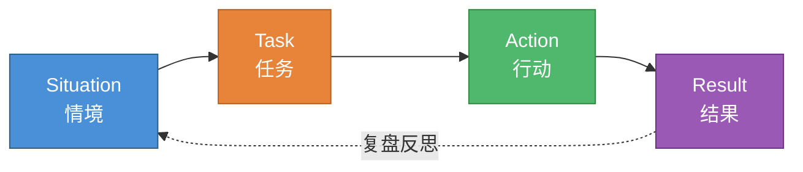

# 行为面试 STAR 法则

> 创建日期：2026-06-06

## ⭐ 面试重点速览

| 考察点 | 重要程度 | 考察频率 | 掌握目标 |
|--------|----------|----------|----------|
| STAR 四要素定义 | ⭐⭐⭐ | 高频 | 源码级 |
| 项目经历结构化表达 | ⭐⭐⭐ | 高频 | 源码级 |
| 自我介绍模板应用 | ⭐⭐⭐ | 必考 | 源码级 |
| 行为问题应答框架 | ⭐⭐ | 高频 | 熟练级 |
| 反问与薪资谈判 | ⭐⭐ | 中频 | 熟练级 |
| HR 面注意事项 | ⭐⭐ | 中频 | 理解级 |

---

## 一、问题背景

高级工程师面试中，技术能力只是入场券，而**行为面试**才是决定面试成败的关键环节。面试官通过行为问题，重点评估候选人的沟通能力、团队协作、问题解决思维、领导力以及与公司文化的匹配度。

统计数据显示，超过 60% 的技术面试者在通过技术面后，因行为面试表现不佳而被淘汰。问题的核心在于：**技术人员习惯用"做了什么"来描述经历，而面试官想听的是"怎么做的、为什么这么做、结果如何"**。

STAR 法则正是解决这一问题的结构化表达框架。它起源于亚马逊的面试体系，后被 Google、Meta、Microsoft 等科技巨头广泛采用，是目前业界最成熟、最通用的行为面试方法论。

::: info 为什么 STAR 法则对高级工程师格外重要
高级工程师面试不仅考察你能不能写代码，更考察你能不能带项目、推动决策、处理冲突。STAR 法则让你的回答有逻辑、有数据、有说服力。
:::

---

## 二、核心内容

### 2.1 STAR 四要素详解

STAR 是四个英文单词的首字母缩写，分别对应回答行为问题的四个关键步骤：



#### S - Situation（情境）

**定义**：描述事件发生的背景，回答"在什么情况下"。

**关键要素**：时间、地点、项目规模、团队角色、业务场景。

**好的情境描述**：
> "2024 年 Q3，我所在电商平台核心交易链路日均 QPS 从 5000 暴涨至 30000，现有 MySQL 单库出现严重性能瓶颈，订单创建接口 P99 延迟从 200ms 恶化至 3s，直接影响大促期间用户体验。我作为后端技术负责人，需要对交易链路进行全面的性能优化。"

**避免的错误**：
- 背景信息过于笼统，缺乏具体数据
- 情境描述过长，超过回答总时长的 20%

#### T - Task（任务）

**定义**：明确你在该情境下需要达成的目标，回答"要做什么"。

**关键要素**：目标量化指标、时间约束、资源限制、优先级排序。

**好的任务描述**：
> "目标是在 4 周内将订单创建接口 P99 延迟降低至 500ms 以内，同时保障数据一致性和系统可用性不低于 99.99%。团队共 3 人，无法申请额外人力。"

::: tip 区分"团队任务"和"你的任务"
面试官关心的是**你**承担了什么，而不是团队做了什么。一定要用"我负责……""我的目标是……"来明确个人角色。
:::

#### A - Action（行动）

**定义**：详细描述你采取的具体行动，回答"怎么做的"。

**这是 STAR 中最核心的环节，应占回答 50% 以上的篇幅。**

**行动描述的三层结构**：

| 层次 | 内容 | 示例关键词 |
|------|------|-----------|
| 分析层 | 你是如何诊断问题的 | 压测定位、火焰图分析、SQL 慢查询审计 |
| 决策层 | 你做了哪些技术选型和权衡 | 方案对比、trade-off 分析、风险评估 |
| 执行层 | 你具体做了什么 | 读写分离、缓存预热、异步化改造 |

**好的行动描述**：
> "首先，我通过 JProfiler 火焰图定位到瓶颈在热点商品库存扣减的数据库行锁竞争。然后，我调研了三种方案：分库分表、Redis 库存缓存 + 异步持久化、以及合并库存更新批量操作。考虑到业务对一致性的要求，我最终选择了方案三作为主力方案，方案二作为大促期间的降级兜底。具体实施上，我编写了库存变更日志的批量合并算法，将单次下单的 5 次 DB 写操作合并为 1 次，同时引入本地缓存 + Redis 两级缓存应对读流量。"

#### R - Result（结果）

**定义**：量化你的行动带来的成果，回答"取得了什么效果"。

**关键要素**：可量化的数据指标、业务影响、个人成长。

**好的结果描述**：
> "优化上线后，订单创建接口 P99 延迟从 3s 降至 380ms，超出预期目标。DB CPU 使用率从 85% 降至 35%，支撑了双十一期间 45000 的峰值 QPS，零故障。该方案后续被推广至支付、物流等其他核心链路。我个人也因此晋升为高级工程师。"

::: warning 结果要有数据
避免说"性能大幅提升""显著改善了用户体验"。面试官需要的是具体数字。没有数据的结果等于没有结果。
:::

### 2.2 STAR 各环节时间分配建议

| 环节 | 建议时长占比 | 30 秒回答 | 2 分钟回答 |
|------|-------------|----------|-----------|
| Situation | 15% | ~5 秒 | ~18 秒 |
| Task | 10% | ~3 秒 | ~12 秒 |
| Action | 55% | ~16 秒 | ~66 秒 |
| Result | 20% | ~6 秒 | ~24 秒 |

---

## 三、实战案例

### 3.1 核心项目经历模板

#### 模板一：最有挑战的项目

> **面试官**："请介绍一个你最有挑战的项目。"

**STAR 回答示例：**

```markdown
【S - 情境】
2024 年，我所在支付平台面临一个棘手问题：跨境结算链路中，
由于涉及多个外部银行接口，一笔跨境转账的平均耗时高达 47 秒，
且失败率达 8.3%。商户投诉量在三个月内增长了 3 倍。

【T - 任务】
我的任务是在 6 周内将跨境转账耗时降低至 15 秒以内，
失败率控制在 1% 以下，同时保证资金安全零差错。

【A - 行动】
1. 分析：我对全链路进行了分布式追踪，发现主要瓶颈在外汇
   牌价查询接口（平均耗时 22 秒）和重复的合规校验（每次
   请求都实时调用第三方风控）。
2. 决策：我设计了异步预取 + 缓存策略，将外汇牌价提前 5
   分钟批量拉取并缓存在 Redis 中；将合规校验拆分为"实时
   必要校验 + 异步深度校验"两阶段，减少实时链路的阻塞。
3. 执行：我主导完成了核心结算引擎的重构，引入 Saga 模式
   处理跨服务的事务补偿，编写了 87 个集成测试用例覆盖所
   有异常路径。

【R - 结果】
上线后平均耗时降至 11 秒（超过预期），失败率降至 0.6%，
商户投诉量下降 78%。该架构成为公司支付域的标准参考实现。
```

#### 模板二：最大技术难点

> **面试官**："你遇到过最大的技术难点是什么？"

```markdown
【S】公司自研的实时数据同步组件在生产环境出现偶发性数据丢失，
   影响了下游 12 个业务线的报表准确性，但问题无法稳定复现。

【T】我需要在 2 周内定位根因并彻底修复，恢复数据完整性。

【A】我采用"假设驱动"的排查策略：
   - 假设1：网络抖动导致 ACK 丢失 → 通过抓包排除
   - 假设2：Kafka 消费者 rebalance 期间 offset 提交异常
     → 分析 GC 日志发现 Full GC 时长超过 session.timeout，
       确认根因
   - 修复：优化 JVM 参数 + 实现优雅关闭的 shutdown hook
     + 增加 offset 提交的重试机制
   
【R】问题彻底解决，连续运行 6 个月零数据丢失。我还输出了
   《Kafka 消费者最佳实践》文档，在公司内部分享。
```

#### 模板三：项目架构演进

> **面试官**："请描述一次你主导的架构演进。"

```markdown
【S】公司初创期的单体应用在用户量突破 100 万后，频繁出现
   全站雪崩，每次宕机造成约 8 万元的直接损失。

【T】我作为架构组核心成员，负责将单体应用拆分为微服务架构，
   保障系统可用性达到 99.95%。

【A】1. 制定演进路线：先垂直拆分（按业务域拆库），再水平
      拆分（核心服务独立部署）。
   2. 设计过渡方案：通过数据库视图 + 同步双写保证拆分期
      间的兼容性，避免大爆炸式迁移。
   3. 基础设施：引入服务发现（Consul）、配置中心（Apollo）、
      全链路监控（SkyWalking），建立完善的可观测体系。
   4. 灰度验证：选择低峰时段、低风险业务先行迁移，每迁移
      一个服务观察 3 天稳定性。

【R】拆分完成后系统全年可用性达 99.97%，单次故障影响范围
   从全站缩小到单个业务域。部署频率从每月 1 次提升到每周
   3 次，团队开发效率提升显著。
```

### 3.2 自我介绍模板

#### 1 分钟版本（适用于开场破冰）

> "面试官你好，我叫张XX，目前在一家金融科技公司担任高级后端工程师，有 6 年 Java 开发经验。
>
> 我的核心竞争力在**高并发系统设计**和**分布式架构**两个方向。过去两年，我主导了公司核心交易系统的架构升级，将系统吞吐量提升了 5 倍，支撑了日订单量从 10 万到 50 万的业务增长。
>
> 技术栈方面，我精通 Spring Cloud 微服务体系，对 MySQL 性能优化和 Redis 高可用方案有深入实践。目前也在深入学习 Go 语言和云原生技术栈。
>
> 我关注贵司的岗位是因为贵司在实时数据平台方向的技术挑战与我过往经验高度匹配，我也希望在一个更大的平台继续打磨架构能力。"

#### 3 分钟版本（适用于深入交流）

> "面试官你好，我是张XX，目前在 XX 金融科技担任高级后端工程师，有 6 年后端开发经验，主要在支付和交易领域。
>
> **第一阶段（1-3 年）**：我在 XX 互金公司从初级工程师做起，负责贷后管理系统的开发和维护，这个阶段我打下了扎实的 Java 基础和业务理解能力。最有收获的一件事是独立排查了一个偶发性的资金计算精度问题，最后定位到是 BigDecimal 使用不当导致的，这件事让我建立了对金融系统的敬畏心。
>
> **第二阶段（3-5 年）**：我加入现在的公司，开始接触高并发场景。最大的项目是支付核心链路的性能优化，我从压测方案设计开始，到代码层面的优化、再到架构层面的读写分离改造，最终将系统并发能力提升了 5 倍。这个项目让我从"写业务代码"进化到"做技术决策"的层次。
>
> **第三阶段（5 年至今）**：我晋升为高级工程师，开始带一个小型技术小组（3 人），同时承担跨团队的技术方案评审。这个阶段我更多思考的是技术如何服务业务目标，以及如何通过技术手段降低团队的协作成本。
>
> 对于下一份工作，我希望能在实时计算或数据平台方向深入发展，贵司的技术栈和业务场景正是我期待的方向。"

---

## 四、常见误区与坑点

::: danger 误区一：只讲行动，不讲结果
很多候选人会把 STAR 说成 STA，详细描述了背景和行动，但忽略了量化结果。

**错误示范**："我优化了数据库查询，加了很多索引。"
**正确示范**："我通过慢查询分析和索引优化，将首页加载耗时从 2.4s 降至 0.8s，用户跳出率下降 15%。"
:::

::: danger 误区二：用"我们"代替"我"
面试官要评估的是**你个人的能力**，不是团队的能力。大量使用"我们做了……"会让面试官无法判断你的真实贡献。

**错误示范**："我们团队完成了整个系统的重构。"
**正确示范**："我负责消息中间件模块的重构，设计了基于 RocketMQ 的异步解耦方案，并主导了上下游 5 个服务的联调测试。"
:::

::: danger 误区三：STAR 回答过于冗长
行为面试通常有 3-5 个问题，每个问题回答不宜超过 3 分钟。过长的回答会让面试官走神，也挤占后续问题的时间。

**控制技巧**：每个 STAR 回答控制在 2-3 分钟，如果面试官追问细节再展开。
:::

::: warning 误区四：缺乏复盘反思
高级工程师的 STAR 回答应该包含"如果重来一次，我会怎么做"的复盘维度。这体现了候选人的成长型思维和自我认知能力。
:::

::: warning 误区五：项目选择不当
选择的项目应该是"有足够复杂度、能体现你核心能力"的，而不是"听起来最厉害"的。如果一个项目你只是参与者而非主导者，面试官追问细节时很容易露馅。
:::

---

## 五、常见行为问题清单及回答框架

### 5.1 为什么离开上一家公司

**核心原则**：向前看，不要向后抱怨。

| 错误说法 | 正确说法 |
|----------|----------|
| "上家公司管理混乱，领导不行。" | "我在上一家公司学到了很多，但目前公司业务重心调整，我负责的技术方向不再有足够的成长空间，我希望在一个更匹配的技术环境中继续成长。" |
| "工资太低，加班太多。" | "我对自己的职业发展有了更清晰的规划，希望找到一个技术挑战更大、与个人发展方向更一致的平台。" |
| "和同事关系不好。" | "我希望加入一个技术氛围更浓厚的团队，在交流和碰撞中持续提升。" |

### 5.2 你的职业规划是什么

**回答框架**：短期（1-2 年）+ 中期（3-5 年）+ 与岗位关联。

> "短期来看，我希望在加入团队后的 6 个月内熟悉业务和技术栈，1 年内能在核心模块独立承担技术设计和开发工作。中期来看，我希望在 3-5 年内成长为某一领域的技术专家，能够带领小组攻克关键技术难题，同时将技术经验沉淀为团队的最佳实践。我注意到贵司在实时数据处理方向有深厚积累，这正是我希望深入发展的领域。"

### 5.3 你的优缺点

**原则**：优点要与岗位相关、有实例支撑；缺点要真实但可控、且正在改进。

**优点示例**："我比较擅长复杂问题的拆解和系统化思考。比如在上一个架构演进项目中，我把一个看似无法完成的单体拆分任务，分解为 6 个阶段、23 个子任务，每个子任务都有明确的验证标准和回滚方案，最终顺利完成。这种结构化思维让我在面对不确定性时能保持清晰的判断。"

**缺点示例**："我有时会过度关注技术细节而忽略了沟通节奏。之前有一次，我在排查一个性能问题时沉浸了两天，没有及时向团队同步进展，导致 PM 不知道风险状况。意识到这个问题后，我现在会设置每日状态同步的提醒，哪怕进展不大也会告知团队当前情况。"

### 5.4 如何处理团队冲突

**STAR 简要框架**：

> **S**：在跨团队合作的需求评审中，产品经理想做一个技术复杂度很高的实时推送功能，排期只有 2 周。
>
> **T**：我的任务是既要满足业务诉求，又要确保技术方案的可行性。
>
> **A**：我没有直接拒绝，而是花半天时间调研了一个折中方案——用"准实时轮询 + WebSocket 推送"的混合方案，将核心功能拆成两期交付，第一期 2 周上线基础功能，第二期 3 周完成高级功能。我用数据对比了三个方案的成本和收益，在评审会上用一页文档清晰呈现。
>
> **R**：PM 接受了分期方案，第一期按时上线，业务方反馈良好。PM 后来主动在周会上肯定了我们团队的专业性。

### 5.5 你经历过的一次失败

**原则**：选一个真实的、有反思价值的失败，重点是"你从中学到了什么"。

> **S**：我负责的一个数据迁移项目，因为低估了历史数据的脏数据量，上线后出现了少量用户账户余额不一致的问题。
>
> **T**：紧急修复数据一致性问题，同时保障线上服务不中断。
>
> **A**：我第一时间启动了数据修复脚本，同时建立了实时数据校验监控，对比迁移前后的核心字段。问题定位到是历史系统中有部分手工调账记录没有被迁移脚本覆盖。我紧急补充了调账记录的处理逻辑，并在灰度阶段增加了数据采样校验环节。
>
> **R**：48 小时内完成全量修复，零用户投诉。这件事让我建立了"数据迁移三重校验"的准则：迁移前采样校验、迁移后全量对账、灰度期间实时监控。我后来主导建立了团队的数据迁移 checklist 规范。

---

## 六、反问技巧

**反问是面试中的重要环节**，好的反问能展现你的思考深度，也能帮你判断这个岗位是否适合你。

### 按面试轮次推荐的反问

| 面试轮次 | 适合的反问 | 目的 |
|----------|-----------|------|
| 一面（技术面） | "团队目前的技术栈是怎样的？""团队在技术选型上的决策流程是什么？" | 了解日常工作环境和技术氛围 |
| 二面（主管面） | "这个岗位短期内最需要解决的技术挑战是什么？""团队未来半年的技术规划是什么？" | 了解业务目标和你的价值点 |
| 三面/交叉面 | "您认为目前团队在技术上最大的短板是什么？""跨团队协作的模式是怎样的？" | 了解组织层面的真实情况 |
| HR 面 | "公司的晋升机制和考核周期是怎样的？""对新人的融入和培养有什么安排？" | 了解职业发展空间 |

### 有深度的反问清单

**技术方向**：
- "团队目前使用的技术栈是什么？是否有技术债务需要偿还？"
- "团队在 code review 和工程质量保障方面有什么实践？"
- "对于新技术引入，团队的评估流程是怎样的？"

**团队方向**：
- "团队的规模和人员结构是怎样的？（资深/高级/初级的比例）"
- "团队成员之间的协作模式是什么？是项目制还是功能制？"
- "团队目前面临的最大技术挑战是什么？"

**业务方向**：
- "这个业务的核心指标是什么？目前处于什么发展阶段？"
- "过去一年业务增长了多少？对技术团队提出了什么新要求？"

**成长方向**：
- "公司对工程师的成长路径是怎样设计的？"
- "有没有内部技术分享或外部培训的机会？"

---

## 七、HR 面注意事项

### 7.1 薪资期望怎么说

::: tip 薪资谈判核心原则
不要第一个说出数字，尽量让 HR 先给出范围。如果必须回答，给一个基于市场调研的合理区间。
:::

**参考话术**：
> "我目前的年收入大约在 XX 万左右（可适当上浮 10%-20%）。对于这个岗位，我了解到市场上同级别的薪资范围大概在 XX-XX 万之间。我比较看重整体的成长空间和发展机会，薪资方面可以根据具体工作内容和团队情况进行协商。"

**注意事项**：
- 提前调研岗位薪资范围（脉脉、Boss 直聘、Glassdoor）
- 说年薪而非月薪（年薪包含年终奖、股票等）
- 给出区间而非固定数字，给自己留谈判空间
- 不要透露其他 offer 的具体薪资，只说"有其他机会在流程中"

### 7.2 离职原因怎么说

::: warning 离职原因的三个"不说"
- 不说前公司/前领导的坏话（显得格局小、难相处）
- 不说单纯因为钱（显得不稳定、容易被更高薪资挖走）
- 不说人际关系问题（显得沟通能力有问题）
:::

**安全且加分的说法模板**：
> "我在上一家公司已经工作了 X 年，这个阶段我的成长曲线开始趋于平缓。我希望寻找一个技术挑战更大、能让我继续突破舒适区的平台。我研究了贵司的业务方向和技术栈，觉得与我的职业规划非常契合。"

---

## 八、面试高频问题汇总

### Q1：请介绍一个你最有挑战的项目

**参考答案：**

回答此题需要完整的 STAR 结构，建议提前准备 2-3 个项目，每个项目按 STAR 写 300-500 字的逐字稿。

"我来介绍我在 XX 公司负责的支付核心链路性能优化项目。"

**S（情境）**：
"2024 年公司业务快速增长，支付核心链路日均请求量从 100 万增长到 500 万，系统频繁出现超时和降级，大促期间甚至出现过 3 分钟的支付服务不可用。我作为支付域的后端负责人，需要解决这个系统性的性能问题。"

**T（任务）**：
"我的核心目标有三个：第一，支付接口 P99 延迟从当时的 2.5 秒降低到 500ms 以内；第二，系统可用性从 99.9% 提升到 99.99%；第三，在大促期间能够支撑 3 倍于日常峰值的流量。时间窗口是 8 周，团队共 4 人。"

**A（行动）**：
"我采取了四层优化策略：

第一层是**代码层**：通过 Arthas 全链路追踪，定位到风控校验接口和库存扣减是两个核心瓶颈。我将同步风控调用改为异步 + 本地缓存兜底，将库存扣减从多次单条 UPDATE 合并为批量操作。

第二层是**数据库层**：实施了读写分离，对核心表做了垂直拆分，对历史账单表做了按月分表。

第三层是**缓存层**：建立了多级缓存体系，将热点商户信息缓存在本地 Caffeine 中，常用数据缓存在 Redis 集群中，并设计了缓存击穿的布隆过滤器防护。

第四层是**架构层**：将支付链路的关键节点全面异步化，引入本地消息表 + RocketMQ 保证最终一致性，避免同步调用链路过长。

这个过程中最大的挑战是如何在不影响线上业务的前提下完成改造。我的做法是每完成一层优化就上线灰度验证，确认效果后再进入下一层。"

**R（结果）**：
"四层优化全部上线后，支付接口 P99 延迟降至 380ms，系统可用性达到 99.995%，双十一期间平稳支撑了日均 1200 万笔支付请求。这套优化方法论后来被推广到了订单、结算等五个核心链路，我被授予了年度技术突破奖，并于次年晋升为高级工程师。"

**复盘**：
"如果重来一次，我会在项目初期就建立更完善的监控看板，因为在优化过程中有几次因为监控不足导致无法快速判断优化效果，耽误了一些时间。"

---

### Q2：你的职业规划是什么

**参考答案：**

"这个问题我思考得比较多，分三个阶段来说。

**短期（1-2 年）**：我希望在加入团队后，快速融入并补齐业务知识，6 个月内成为核心模块的主力开发。1 年内能够在技术方案设计上独当一面，成为团队中值得信赖的技术骨干。如果有机会，我也希望能承担一些初级工程师的 mentor 角色，输出自己的经验。

**中期（3-5 年）**：我希望在分布式系统或高并发架构方向建立自己的技术深度，能够主导复杂技术项目的设计和落地，同时具备跨团队的协作和推动能力。从纯技术贡献走向"技术+影响力"的复合型角色。

**长期（5 年以上）**：我希望成为一名技术专家或架构师，能够从业务全局视角做技术判断，不仅解决当下的技术问题，更能预见未来的技术方向。如果个人能力和公司机会匹配，我也愿意承担技术管理的职责。

我觉得贵司目前的技术方向和业务规模，正好能给我的职业发展提供足够大的舞台。这也是我特别关注这个岗位的原因之一。"

::: tip 话术要点
职业规划要体现三个关键信息：你有清晰的自我认知、你的规划与公司方向匹配、你是一个长期主义者而非频繁跳槽的人。
:::

---

### Q3：为什么离开上一家公司

**参考答案：**

"这是一个好问题。其实我在上一家公司已经工作了将近 4 年，整体体验是不错的，领导很信任我，团队氛围也很好。

但最近一年，公司的业务重心做了比较大的调整，我负责的核心业务线被降级为维护状态，新的重点项目转向了我不太熟悉的领域（比如 AI 应用），团队的技术成长空间明显收窄。我发现自己重复在做一些舒适区内的事情，技术成长开始放缓。

我是一个比较看重持续成长的人，尤其是现在这个阶段（工作 6 年左右），正处于从高级工程师向更高阶角色跃迁的关键时期，如果技术深度和广度停滞，对长期发展影响会比较大。

所以我开始关注外部机会。贵司的技术栈、业务规模、以及目前正在做的实时数据处理方向，恰好是我非常感兴趣且有一定积累的领域。我相信在这里我能继续快速成长，同时也能为团队带来实际的价值。"

---

### Q4：你的期望薪资是多少

**参考答案：**

"在回答这个问题之前，我想先确认一下，咱们讨论的薪资口径是包含年终奖和股票的年总包，还是月 base 薪资？"

（等待 HR 回应后）

"好的，那我基于年总包来回答。我目前的总包大约在 XX 万左右。在面试前我也做了一些调研，了解到像贵司这个级别的公司，对于我这样 6 年经验的候选人，市场上的参考范围大概在 XX-XX 万之间。

考虑到岗位的技术要求和业务复杂度，以及我在高并发和分布式系统方面的经验积累与岗位非常匹配，我的期望范围在 XX-XX 万之间。

当然，薪资不是我唯一考量的因素。我也非常看重平台的发展空间、团队的技术氛围以及工作内容本身。如果这些方面足够好，薪资上我是愿意保持弹性的。"

::: warning 谈判技巧
- 不要接受第一个 offer，表达感谢后请求 1-2 天考虑
- 如果薪资低于预期，可以尝试谈签字费、期权、培训预算等其他补偿
- 永远保持专业和礼貌，谈判是为了共赢，不是零和博弈
:::

---

### Q5：你有什么想问我们的

**参考答案：**

"谢谢，我确实有几个问题想了解。"

**（一面/技术面）**：
- "团队目前主要的技术栈是什么？在微服务治理和可观测性方面有哪些实践？"
- "日常的技术决策流程是怎样的？工程师在方案选型上有多大的自主权？"
- "团队目前有没有在偿还的技术债务？或者说有没有大家公认需要优化但目前还没排上期的技术问题？"

**（二面/主管面）**：
- "如果我加入，前三个月的重点工作会是什么？您对这个岗位最大的期待是什么？"
- "团队未来半年的技术规划是什么？有没有重大的架构升级或技术转型计划？"
- "您觉得目前团队在技术或者协作上最大的挑战是什么？"

**（HR 面）**：
- "公司的绩效考核周期和晋升机制是怎样的？"
- "新员工的入职培训和支持体系是怎样的？"

**（如果还有时间）**：
- "根据我们今天的交流，您觉得我和这个岗位的匹配度如何？有没有什么您觉得我可以改进的地方？"

::: tip 反问策略
- 每次面试至少准备 3 个问题，避免问完一个就冷场
- 反问要体现你对技术、业务和成长的关注，而非只关心福利待遇
- 最后一问可以用"匹配度反馈"来争取补充信息的机会
- 不要在技术面问假期、餐补等琐碎问题，这些留给 HR 面
:::

---

> **结语**：行为面试的本质是一场有准备的对话。STAR 法则是框架，真正打动面试官的是你真实的经历、深度的思考和真诚的表达。建议提前写好 5-10 个核心项目的 STAR 逐字稿并反复练习，做到心中有框架、口中有故事。