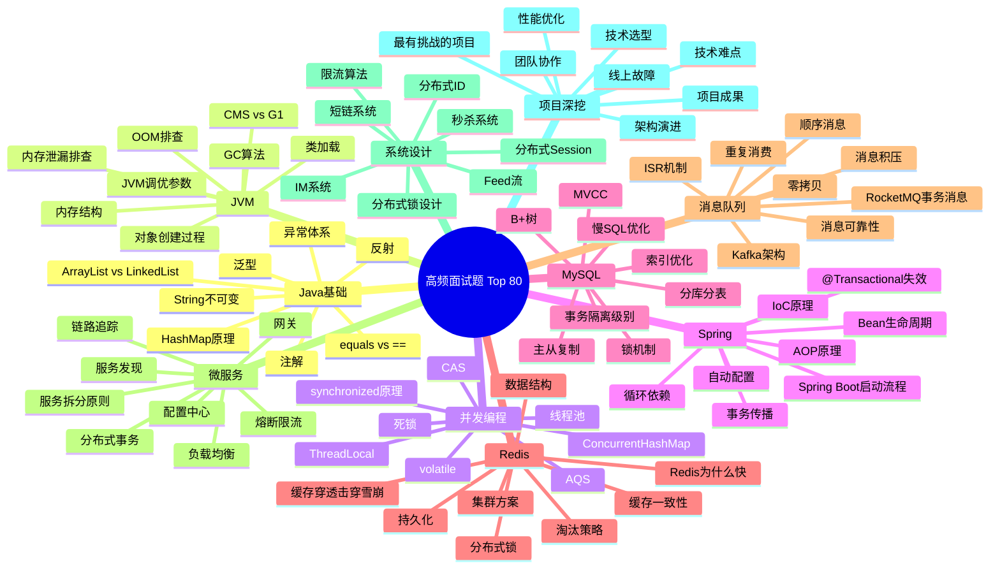

# 高频真题速查

## 面试重点速览表

以下是面向高级工程师面试的十大核心模块 Top 80 高频真题速查。每个题目按三层深度递进展开，帮你从"能答出来"到"能讲透"。



::: tip 使用指南
面试不是考试，是展示深度的对话。每个题目至少准备三层回答：
- **概念层**：用一两句话说清楚它是什么，解决什么问题
- **原理层**：讲清楚内部机制、关键设计决策、为什么这么设计
- **源码/实战层**：引用关键源码片段或实际线上案例，展示真实经验
:::

::: warning 面试官视角
面试官真正关心的是：**你能多深地聊一个话题？** 一个问题的三层都能深入回答，远胜过十个问题只答表面。如果在某个问题上能一直聊到源码级别，面试官会认为你的技术深度足够。
:::

## 问题背景

高级工程师面试与初中级面试的核心区别在于：面试官不再满足于"知不知道"，而是考察"理解有多深"和"有没有实战经验"。以下高频真题均源自近几年一线互联网公司（阿里、腾讯、字节、美团等）的实际面试题，覆盖了从基础到架构的完整技术栈。

::: info 选题依据
题目筛选遵循三个原则：
1. **高频出现**：在至少 3 家以上一线公司的面经中反复出现
2. **区分度强**：能有效区分初中级和高级工程师
3. **可深挖**：每题都有从概念到源码的递进空间
:::

## 核心内容

### 一、Java 基础（8 题）

#### 1. HashMap 底层原理

| 层级 | 核心要点 |
|------|----------|
| **概念层** | 基于哈希表的 Map 实现，JDK 1.8 采用数组+链表+红黑树结构，默认负载因子 0.75，容量为 2 的幂次 |
| **原理层** | 通过 `(n-1) & hash` 计算桶下标；链表长度 >= 8 且数组长度 >= 64 时树化；扩容时 rehash 采用高低位链拆分，避免 JDK 1.7 的死循环问题 |
| **源码/实战层** | `resize()` 方法中 `e.hash & oldCap` 判断节点留在原位置还是迁移到 `index + oldCap`；`treeifyBin()` 触发树化；`HashMap` 线程不安全，并发场景用 `ConcurrentHashMap` |

> 详见：[Java 进阶 - 集合框架](../java-advanced/index.md)

#### 2. String 为什么不可变

| 层级 | 核心要点 |
|------|----------|
| **概念层** | String 类被 `final` 修饰，底层用 `final char[]`（JDK 9+ 为 `byte[]`）存储，任何修改操作都返回新对象 |
| **原理层** | 不可变性保障了字符串常量池的效率、HashMap 中 key 的稳定性、多线程安全；`substring()` 旧版本共享 `char[]` 可能导致内存泄漏，JDK 7 修复 |
| **源码/实战层** | `String` 类 `final` 修饰防止继承破坏；`equals()` 和 `hashCode()` 基于不可变的字符序列计算，缓存 hashCode 提高性能 |

#### 3. equals 与 == 的区别

| 层级 | 核心要点 |
|------|----------|
| **概念层** | `==` 比较栈中存储的值（基本类型比值，引用类型比地址）；`equals()` 默认等价于 `==`，需要子类重写来实现内容比较 |
| **原理层** | `Object.equals()` 内部就是 `this == obj`；`String`、`Integer` 等重写了 `equals()` 比较内容；重写 `equals()` 必须同时重写 `hashCode()`，否则在 HashMap 等容器中会出现逻辑错误 |
| **源码/实战层** | 整数缓存池 `IntegerCache` 导致 `-128~127` 范围内 `==` 返回 true；Lombok `@EqualsAndHashCode` 自动生成，但需注意父类字段问题 |

#### 4. ArrayList 与 LinkedList 对比

| 层级 | 核心要点 |
|------|----------|
| **概念层** | `ArrayList` 底层为 `Object[]` 数组，支持随机访问 O(1)；`LinkedList` 底层为双向链表，插入删除 O(1)（已知节点位置），不支持随机访问 |
| **原理层** | `ArrayList` 扩容 `grow()` 方法，默认 1.5 倍扩容（`oldCapacity >> 1`），`Arrays.copyOf()` 拷贝数据；`LinkedList` 实现 `Deque` 接口，可作双端队列 |
| **源码/实战层** | 内存层面：`ArrayList` 尾部插入整体优于 `LinkedList`（少了节点对象创建开销）；`LinkedList` 插入需要先遍历定位，总体 O(n)；实际选型优先 `ArrayList` |

#### 5. Java 异常体系

| 层级 | 核心要点 |
|------|----------|
| **概念层** | `Throwable` 分为 `Error`（不可恢复）和 `Exception`；`Exception` 分为 `RuntimeException`（非受检）和受检异常 |
| **原理层** | `try-catch-finally` 执行流程：finally 始终执行（除 `System.exit()`），return 在 finally 之前暂存返回值；`try-with-resources`（JDK 7）自动关闭 `AutoCloseable` 资源 |
| **源码/实战层** | 异常链 `initCause()` 保留根因；全局异常处理 `@ControllerAdvice` + `@ExceptionHandler`；禁止吞异常或仅 `e.printStackTrace()` |

#### 6. 泛型机制

| 层级 | 核心要点 |
|------|----------|
| **概念层** | 编译期类型检查，运行时类型擦除；泛型类、泛型方法、泛型接口三种形式；通配符 `? extends T`（上界）和 `? super T`（下界） |
| **原理层** | 类型擦除后泛型参数被替换为边界类型（无边界则为 `Object`）；桥接方法解决多态冲突；`ClassCastException` 在强制转换时抛出 |
| **源码/实战层** | PECS 原则（Producer Extends, Consumer Super）；`List<String>` 和 `List<Integer>` 的 Class 对象相同；Gson 反序列化泛型用 `TypeToken` 绕过擦除 |

#### 7. 反射机制

| 层级 | 核心要点 |
|------|----------|
| **概念层** | 运行时动态获取类的信息和操作对象，通过 `Class` 对象获取 `Field`、`Method`、`Constructor` |
| **原理层** | `Class.forName()` 触发类加载；`getDeclaredMethods()` 获取本类所有方法（不含继承）；`setAccessible(true)` 绕过访问检查，性能开销较大 |
| **源码/实战层** | 反射调用有性能损耗（约 10-50 倍），JDK 提供了 `MethodHandle`（indy）优化；Spring IoC、MyBatis Mapper 代理、动态代理均依赖反射 |

#### 8. 注解原理

| 层级 | 核心要点 |
|------|----------|
| **概念层** | JDK 5 引入的元数据标记，分为编译时注解（`@Override`）和运行时注解（`@Autowired`）；元注解：`@Target`、`@Retention`、`@Documented`、`@Inherited` |
| **原理层** | 运行时注解通过反射读取；编译时注解通过 `AbstractProcessor` 在 `javac` 编译阶段处理，生成辅助代码 |
| **源码/实战层** | Spring `@ComponentScan` 扫描注解生成 BeanDefinition；Lombok 通过编译时注解生成 getter/setter；`@AliasFor` 注解属性别名机制 |

---

### 二、JVM（8 题）

#### 1. JVM 内存结构

| 层级 | 核心要点 |
|------|----------|
| **概念层** | 线程共享：堆（Heap）、方法区（元空间）；线程私有：程序计数器、虚拟机栈、本地方法栈 |
| **原理层** | 堆分新生代（Eden + S0 + S1，默认 1:1:8）和老年代；元空间（Metaspace）使用本地内存，替代永久代（PermGen），默认无上限但可通过 `MaxMetaspaceSize` 限制 |
| **源码/实战层** | 栈帧包含局部变量表、操作数栈、动态链接、返回地址；`StackOverflowError`（栈深度超限）vs `OutOfMemoryError`（堆/元空间不够） |

> 详见：[Java 进阶 - JVM 内存结构](../java-advanced/index.md)

#### 2. GC 算法

| 层级 | 核心要点 |
|------|----------|
| **概念层** | 标记-清除（碎片化）、标记-复制（浪费一半空间，适合新生代）、标记-整理（需移动对象，适合老年代） |
| **原理层** | 分代收集：新生代用复制算法（Eden 存活对象 -> Survivor 区），老年代用标记-清除/整理；跨代引用通过 Card Table 记录，避免全堆扫描 |
| **源码/实战层** | Minor GC 触发条件：Eden 区满；Full GC 触发：老年代满、元空间满、`System.gc()`（不保证执行）、空间分配担保失败 |

#### 3. CMS vs G1

| 层级 | 核心要点 |
|------|----------|
| **概念层** | CMS：以最短停顿时间为目标的并发收集器；G1：面向大内存（4G+）、可预测停顿时间的收集器，将堆划分为大小相等的 Region |
| **原理层** | CMS 四阶段：初始标记（STW）→ 并发标记 → 重新标记（STW）→ 并发清除；G1 通过 Remembered Set 解决跨 Region 引用，Young GC + Mixed GC |
| **源码/实战层** | CMS 的碎片化问题（`UseCMSCompactAtFullCollection`）、浮动垃圾（并发失败退化为 Serial Old）；G1 的 Humongous 对象（超过 Region 50% 视为大对象） |

#### 4. 类加载机制

| 层级 | 核心要点 |
|------|----------|
| **概念层** | 加载 → 验证 → 准备 → 解析 → 初始化 → 使用 → 卸载；双亲委派模型：先委托父加载器加载 |
| **原理层** | `loadClass()` 先查缓存，再委派父加载器（Bootstrap → Extension/Platform → Application），最后 `findClass()`；打破场景：SPI（`ThreadContextClassLoader`）、Tomcat WebappClassLoader、OSGi |
| **源码/实战层** | `ClassLoader.loadClass()` 源码中的 `synchronized` 加锁防止并发加载；`Class.forName()` 默认执行初始化（`<clinit>`），`ClassLoader.loadClass()` 不执行 |

#### 5. OOM 排查

| 层级 | 核心要点 |
|------|----------|
| **概念层** | 常见 OOM 类型：`Java heap space`、`GC overhead limit exceeded`、`Metaspace`、`Direct buffer memory`、`unable to create new native thread` |
| **原理层** | 排查工具链：`jps` 定位进程 → `jstat -gc` 查看 GC 情况 → `jmap -dump` 导出堆转储 → MAT/JProfiler 分析 |
| **源码/实战层** | 实战步骤：`-XX:+HeapDumpOnOutOfMemoryError` 自动转储；MAT 中看 Dominator Tree 找大对象、Histogram 看类分布；`jstack` 分析死锁、线程阻塞 |

#### 6. JVM 调优参数

| 层级 | 核心要点 |
|------|----------|
| **概念层** | 堆大小：`-Xms` / `-Xmx`（建议设为相同值防抖动）；GC 日志：`-Xlog:gc*`（JDK 9+）；GC 选择：`-XX:+UseG1GC` |
| **原理层** | `-XX:NewRatio`（老/新比例）、`-XX:SurvivorRatio`（Eden/Survivor 比例）、`-XX:MaxTenuringThreshold`（晋升老年代年龄阈值）；`-XX:MetaspaceSize` 触发元空间首次 Full GC |
| **源码/实战层** | 典型调优场景：4C8G 机器 Web 服务推荐 G1 + `-Xms4g -Xmx4g`；高吞吐批处理推荐 Parallel GC；核心看 GC 频率和单次停顿时间（ZGC 目标 < 1ms） |

#### 7. 对象创建过程

| 层级 | 核心要点 |
|------|----------|
| **概念层** | `new` → 类加载检查 → 分配内存 → 初始化零值 → 设置对象头 → 执行 `<init>` 构造方法 |
| **原理层** | TLAB（Thread Local Allocation Buffer）优先分配，减少 CAS 竞争；指针碰撞（Bump the Pointer）用于 Serial/ParNew，空闲列表（Free List）用于 CMS |
| **源码/实战层** | 对象头包含 Mark Word（hash、GC 年龄、锁状态）和 Klass Pointer（指向类元数据）；压缩指针 `-XX:+UseCompressedOops` 在堆 < 32G 时默认开启 |

#### 8. 内存泄漏排查

| 层级 | 核心要点 |
|------|----------|
| **概念层** | 内存泄漏：不再使用的对象仍被引用，GC 无法回收；常见原因：ThreadLocal 未清理、静态集合持续增长、未关闭的流/连接 |
| **原理层** | 弱引用、软引用、虚引用在 GC 时的不同行为；`ReferenceQueue` 配合清理；Netty 的 `ByteBuf` 引用计数泄漏排查 |
| **源码/实战层** | `ThreadLocal` 使用后务必 `remove()`，否则在线程池场景下 Value 永远不会被回收；MAT 的 "Leak Suspects" 报告自动找出最大嫌疑对象 |

---

### 三、并发编程（8 题）

#### 1. synchronized 原理

| 层级 | 核心要点 |
|------|----------|
| **概念层** | Java 内置的互斥同步机制，保证同一时刻只有一个线程执行同步块；可修饰方法、代码块 |
| **原理层** | 对象头 Mark Word 中记录锁状态：无锁 → 偏向锁 → 轻量级锁（CAS + 自旋）→ 重量级锁（`monitorenter`/`monitorexit`，操作系统 mutex） |
| **源码/实战层** | 偏向锁延迟开启（JVM 启动后 4s）；`-XX:-UseBiasedLocking` 可关闭；`Lock Record` 在线程栈中存储 displaced mark word；锁消除和锁粗化是 JIT 编译优化 |

> 详见：[Java 进阶 - 并发编程](../java-advanced/index.md)

#### 2. AQS 原理

| 层级 | 核心要点 |
|------|----------|
| **概念层** | `AbstractQueuedSynchronizer`，构建锁和同步器的框架，基于 FIFO 等待队列 + `volatile int state` |
| **原理层** | CLH 变种队列（双向链表），节点自旋判断前驱是否为 head；独占模式（`tryAcquire`/`tryRelease`）和共享模式（`tryAcquireShared`/`tryReleaseShared`）；`ConditionObject` 实现条件等待 |
| **源码/实战层** | `ReentrantLock` 中公平锁直接入队，非公平锁先 CAS 抢一次；`CountDownLatch` 使用共享模式，`countDown()` 逐个释放；`Semaphore` 的 state 表示许可数 |

#### 3. 线程池

| 层级 | 核心要点 |
|------|----------|
| **概念层** | 核心参数：corePoolSize、maximumPoolSize、keepAliveTime、workQueue（有界/无界）、RejectedExecutionHandler |
| **原理层** | 执行流程：< corePoolSize 新建线程 → >= corePoolSize 入队 → 队满 < maxPoolSize 新建 → >= maxPoolSize 拒绝；Worker 线程循环取任务，`getTask()` 阻塞或超时退出 |
| **源码/实战层** | 禁止 `Executors.newCachedThreadPool()`（无界线程）和 `newFixedThreadPool()`（无界队列）造成 OOM；自定义命名工厂 `ThreadFactory`；`beforeExecute()`/`afterExecute()` 可做监控埋点 |

#### 4. volatile 原理

| 层级 | 核心要点 |
|------|----------|
| **概念层** | 保证变量的可见性和禁止指令重排序，不保证原子性 |
| **原理层** | JMM（Java 内存模型）层面：写入 volatile 变量时 JVM 发 Lock 前缀指令，强制刷主存并使其他 CPU 缓存行失效（MESI 协议）；插入内存屏障（StoreStore/StoreLoad/LoadLoad/LoadStore） |
| **源码/实战层** | DCL（Double-Checked Locking）单例中 `volatile` 防止指令重排序导致返回未初始化对象；`ConcurrentHashMap` 中 `Node.val` 用 `volatile` 保证可见性 |

#### 5. CAS 原理

| 层级 | 核心要点 |
|------|----------|
| **概念层** | Compare And Swap，比较并交换，无锁算法的核心；CPU 指令级原子操作 `cmpxchg` |
| **原理层** | 三个操作数：内存位置 V、预期值 A、新值 B；仅当 V == A 时将 V 更新为 B；ABA 问题：值从 A→B→A，CAS 无法感知变化 |
| **源码/实战层** | `AtomicInteger` 的 `compareAndSet()` 底层调用 `Unsafe.compareAndSwapInt()`（native）；`AtomicStampedReference` 用版本号解决 ABA；JDK 8 的 `LongAdder` 用分段累加降低 CAS 竞争 |

#### 6. ThreadLocal

| 层级 | 核心要点 |
|------|----------|
| **概念层** | 提供线程局部变量，每个线程独立拥有一份副本，线程间隔离 |
| **原理层** | 每个 `Thread` 对象内有一个 `ThreadLocalMap`（内部是 Entry[]，Entry 继承 `WeakReference<ThreadLocal<?>>`）；`set()` 时 Entry 的 key 是弱引用，value 是强引用 |
| **源码/实战层** | key 为 null 的 Entry 在 `get()`/`set()`/`remove()` 时惰性清理（`expungeStaleEntry()`）；线程池场景必须 `remove()`，否则 value 永不回收；InheritableThreadLocal 父子线程传递上下文 |

#### 7. ConcurrentHashMap

| 层级 | 核心要点 |
|------|----------|
| **概念层** | 线程安全的 HashMap，JDK 7 分段锁（Segment），JDK 8 CAS + synchronized 细化到桶级别 |
| **原理层** | JDK 8：`putVal()` 中桶为空时 CAS 设置，桶非空 synchronized 锁头节点；`sizeCtl` 控制初始化/扩容；多线程并发扩容（`transfer()`），每个线程处理一个 stride 长度 |
| **源码/实战层** | `ForwardingNode` 标识正在迁移的桶，查找时转发到新表；`TreeBin` 包装红黑树，加读写锁；`ReservationNode` 占位用于 `computeIfAbsent()`；size 统计用 `CounterCell[]` 分段计数 |

#### 8. 死锁

| 层级 | 核心要点 |
|------|----------|
| **概念层** | 两个或以上线程互相持有对方需要的锁而无限等待；四大必要条件：互斥、持有并等待、不可剥夺、循环等待 |
| **原理层** | 预防：破坏持有并等待（一次性申请所有锁）、破坏不可剥夺（`tryLock` 超时）、破坏循环等待（按序加锁）；银行家算法检测 |
| **源码/实战层** | `jstack -l <pid>` 直接打印死锁信息；`ThreadMXBean.findDeadlockedThreads()` 编程式检测；MyBatis 缓存 `ReentrantReadWriteLock` 潜在死锁案例 |

---

### 四、Spring（8 题）

#### 1. IoC 原理

| 层级 | 核心要点 |
|------|----------|
| **概念层** | 控制反转，对象的创建和依赖关系由容器管理，通过 DI（依赖注入）实现 |
| **原理层** | `BeanDefinition` 存储 Bean 元信息（scope、lazy、dependsOn）；`BeanFactory` 作为顶层接口，`DefaultListableBeanFactory` 是核心实现；`ApplicationContext` 在其之上增加国际化、事件发布等 |
| **源码/实战层** | `refresh()` 方法中包含 13 个步骤：`obtainFreshBeanFactory()` → `invokeBeanFactoryPostProcessors()` → `registerBeanPostProcessors()` → `finishBeanFactoryInitialization()` 等 |

> 详见：[Spring 生态 - IoC 原理](../spring-ecosystem/index.md)

#### 2. AOP 原理

| 层级 | 核心要点 |
|------|----------|
| **概念层** | 面向切面编程，将横切关注点（日志、事务、权限）与业务逻辑分离 |
| **原理层** | JDK 动态代理（接口代理，`$Proxy` + `InvocationHandler`）vs CGLIB（子类代理，`Enhancer` + `MethodInterceptor`）；`Advisor` = Pointcut + Advice，`AspectJExpressionPointcut` 解析表达式 |
| **源码/实战层** | `@EnableAspectJAutoProxy` 注册 `AnnotationAwareAspectJAutoProxyCreator`（BeanPostProcessor）；拦截器链调用 `ReflectiveMethodInvocation.proceed()` 递归执行；`exposeProxy=true` 解决内部调用不代理的问题 |

#### 3. Bean 生命周期

| 层级 | 核心要点 |
|------|----------|
| **概念层** | 实例化 → 属性赋值 → 初始化 → 使用 → 销毁 |
| **原理层** | `createBean()` 中 `doCreateBean()` 是关键：`createBeanInstance()`（实例化）→ `populateBean()`（填充属性）→ `initializeBean()`（执行 Aware → BeanPostProcessor 前置 → init-method → BeanPostProcessor 后置）；`@PostConstruct`/`@PreDestroy`（CommonAnnotationBeanPostProcessor 处理） |
| **源码/实战层** | BeanPostProcessor 应用场景：`AutowiredAnnotationBeanPostProcessor` 处理 `@Autowired`，`AsyncAnnotationBeanPostProcessor` 处理 `@Async` |

#### 4. 循环依赖

| 层级 | 核心要点 |
|------|----------|
| **概念层** | A 依赖 B，B 依赖 A，形成闭环；Spring 通过三级缓存解决单例 Bean 的 Setter 注入循环依赖 |
| **原理层** | 三级缓存：`singletonObjects`（一级，成品）、`earlySingletonObjects`（二级，早期引用）、`singletonFactories`（三级，`ObjectFactory`）；A 实例化后暴露三级缓存 → 填充 B 时触发 B 创建 → B 填充 A 时从三级缓存获取 A 的早期引用 |
| **源码/实战层** | 构造器注入无法解决循环依赖（因为需要构造器参数才能实例化）；prototype 作用域的循环依赖也无法解决，会抛 `BeanCurrentlyInCreationException`；`@Lazy` 也可以用延迟代理解决 |

#### 5. 事务传播

| 层级 | 核心要点 |
|------|----------|
| **概念层** | 7 种传播行为：REQUIRED（默认，有则加入无则创建）、REQUIRES_NEW（挂起当前，新建）、NESTED（嵌套保存点）、SUPPORTS、NOT_SUPPORTED、MANDATORY、NEVER |
| **原理层** | `TransactionSynchronizationManager` 用 `ThreadLocal` 绑定当前事务连接；`AbstractPlatformTransactionManager.handleExistingTransaction()` 处理传播逻辑；`REQUIRES_NEW` 挂起原事务用 `suspend()` 解绑资源 |
| **源码/实战层** | `REQUIRES_NEW` 外层事务回滚不影响内层已提交的事务；`NESTED` 依赖 JDBC Savepoint，仅对单物理连接有效；传播行为陷阱：同一个 Service 内方法互相调用不会经过代理 |

#### 6. 自动配置原理

| 层级 | 核心要点 |
|------|----------|
| **概念层** | Spring Boot 的核心特性，根据 classpath 中的依赖自动配置 Bean，无需手动编写大量 XML/注解 |
| **原理层** | `@SpringBootApplication` 包含 `@EnableAutoConfiguration` → `@Import(AutoConfigurationImportSelector.class)`；通过 `SpringFactoriesLoader` 读取 `META-INF/spring/org.springframework.boot.autoconfigure.AutoConfiguration.imports`（Spring Boot 3.x）；`@ConditionalOnClass`/`@ConditionalOnMissingBean` 等条件注解按需装配 |
| **源码/实战层** | 排除特定自动配置：`@SpringBootApplication(exclude = DataSourceAutoConfiguration.class)`；自定义 Starter 三步：自动配置类 → `AutoConfiguration.imports` 文件 → 条件注解控制 |

#### 7. Spring Boot 启动流程

| 层级 | 核心要点 |
|------|----------|
| **概念层** | `SpringApplication.run()` 启动，依次完成环境准备、上下文创建、refresh、事件发布 |
| **原理层** | 核心步骤：创建 `SpringApplication`（推断 Web 类型）→ 获取 `ApplicationContextInitializer` → `prepareEnvironment()` → `createApplicationContext()` → `prepareContext()` → `refreshContext()` → `afterRefresh()` |
| **源码/实战层** | `SpringApplicationRunListener` 监听各阶段事件；`ApplicationRunner` 和 `CommandLineRunner` 在 refresh 后执行；Banner 打印用 `SpringApplicationBannerPrinter` |

#### 8. @Transactional 失效场景

| 层级 | 核心要点 |
|------|----------|
| **概念层** | `@Transactional` 基于 AOP 代理实现，自调用（this调用）不经过代理，事务不会生效 |
| **原理层** | 失效场景清单：非 public 方法（AOP 不代理）、同类内部调用（this.xxx()）、异常被 catch 吞掉（`rollbackFor` 不匹配）、数据库引擎不支持事务（MyISAM）、多线程调用 |
| **源码/实战层** | 解决自调用：注入自身代理（`@Autowired self`）或 `AopContext.currentProxy()` 调用；`TransactionAspectSupport.currentTransactionStatus().setRollbackOnly()` 手动回滚；传播行为设置不当也导致失效 |

---

### 五、MySQL（8 题）

#### 1. B+树索引

| 层级 | 核心要点 |
|------|----------|
| **概念层** | B+树是 B 树的变体，所有数据只存储在叶子节点，非叶子节点只存键值；叶子节点通过双向链表连接，支持范围查询 |
| **原理层** | InnoDB 中主键索引（聚簇索引）叶子节点存完整行数据；二级索引叶子节点存主键值，回表查询；页（Page，默认 16KB）是 InnoDB 最小存储单元 |
| **源码/实战层** | 为什么不用 B 树：范围查询需中序遍历不友好；不用红黑树：树太高，磁盘 IO 多；不用 Hash：不支持范围查询和排序；三层 B+树约可存 2000 万行数据 |

> 详见：[数据库 - MySQL 索引](../database/index.md)

#### 2. 索引优化

| 层级 | 核心要点 |
|------|----------|
| **概念层** | 索引优化的核心是让查询尽可能走索引，减少回表和全表扫描 |
| **原理层** | 最左前缀原则：联合索引 (a, b, c) 等价于 a 索引 + (a,b) 索引 + (a,b,c) 索引；覆盖索引：查询列都在索引中，不用回表；索引下推（ICP）：在索引层过滤不符合条件的记录 |
| **源码/实战层** | `EXPLAIN` 关注 type（const > eq_ref > ref > range > index > ALL）、key（使用的索引）、Extra（Using index 覆盖索引、Using filesort 需要额外排序）；`JOIN` 优化用 `STRAIGHT_JOIN` 指定驱动表 |

#### 3. MVCC 多版本并发控制

| 层级 | 核心要点 |
|------|----------|
| **概念层** | Multi-Version Concurrency Control，通过 undo log + ReadView 实现非锁定的一致性读，写不阻塞读 |
| **原理层** | 每行隐藏列：`DB_TRX_ID`（最近修改事务ID）、`DB_ROLL_PTR`（undo log 回滚指针）、`DB_ROW_ID`；ReadView 含活跃事务列表，RC 级别每次快照读生成新 ReadView，RR 级别第一次快照读生成后复用 |
| **源码/实战层** | `trx_id < min_trx_id` 可见；`trx_id > max_trx_id` 不可见；`min_trx_id <= trx_id <= max_trx_id` 判断是否在活跃列表中；undo log 版本链通过 `DB_ROLL_PTR` 串联 |

#### 4. 事务隔离级别

| 层级 | 核心要点 |
|------|----------|
| **概念层** | READ UNCOMMITTED（脏读）→ READ COMMITTED（不可重复读）→ REPEATABLE READ（幻读，InnoDB 用 Next-Key Lock 解决）→ SERIALIZABLE |
| **原理层** | InnoDB 默认 RR：快照读用 MVCC，当前读（`SELECT ... FOR UPDATE`）用 Next-Key Lock（Record Lock + Gap Lock）；RC 下没有 Gap Lock，会引发幻读 |

#### 5. 慢 SQL 优化

| 层级 | 核心要点 |
|------|----------|
| **概念层** | `slow_query_log` 开启慢查询日志，`long_query_time` 设置阈值，`pt-query-digest` 或 `mysqldumpslow` 分析 |
| **原理层** | 常见慢查询模式：`SELECT *` 导致大量回表、隐式类型转换导致索引失效（`WHERE varchar_col = 123`）、`OR` 条件拆分、`LIKE '%xxx'` 前导模糊、函数操作索引列（`WHERE DATE(create_time) = '2024-01-01'`） |
| **源码/实战层** | 优化流程：抓慢 SQL → EXPLAIN 分析 → 优化索引/改写 SQL → 验证；`force index` 强制走索引（慎用）；`optimizer_trace` 查看优化器选择过程 |

#### 6. 分库分表

| 层级 | 核心要点 |
|------|----------|
| **概念层** | 垂直拆分（按业务模块）和水平拆分（按数据行），核心解决单库单表数据量过大问题 |
| **原理层** | 分片键选择三原则：查询频率高、分布均匀、避免跨分片查询；分片算法：取模（扩容难）、哈希一致性（扩容影响小）、范围分片（热点问题）；ShardingSphere 的 `inline`、`standard`、`complex` 分片策略 |
| **源码/实战层** | 分布式主键方案：Snowflake（时钟回拨问题）、美团 Leaf（号段+双 buffer）；跨分片查询：绑定表（广播表）、跨库 JOIN 推给应用层；数据迁移平滑方案：双写 + 灰度切流 |

#### 7. 主从复制

| 层级 | 核心要点 |
|------|----------|
| **概念层** | 主库写 binlog → 从库 IO 线程拉取 binlog 写 relay log → 从库 SQL 线程执行 relay log 中的事件 |
| **原理层** | 复制模式：异步复制（默认）、半同步复制（After Commit/After Sync）、组复制（MGR，Paxos）；GTID（全局事务标识符）简化主从切换；并行复制基于 group commit 的 last_committed |
| **源码/实战层** | 主从延迟排查：`Seconds_Behind_Master`（不一定准确）、`pt-heartbeat` 监控；延迟原因：从库单线程执行（MySQL 5.6-）、大事务、从库配置低；`sync_binlog` 和 `innodb_flush_log_at_trx_commit` 双重 1 保障不丢数据 |

#### 8. 锁机制

| 层级 | 核心要点 |
|------|----------|
| **概念层** | 全局锁（`FLUSH TABLES WITH READ LOCK`）→ 表锁（`LOCK TABLES`、MDL 元数据锁）→ 行锁（Record Lock、Gap Lock、Next-Key Lock） |
| **原理层** | InnoDB 行锁本质是索引锁（不通过索引加锁会升级为表锁）；`SELECT ... FOR UPDATE` 加 Next-Key Lock（RR 级别）；意向锁（IS/IX）表级，表示事务将在行上加锁；MDL 锁在 DDL 期间阻塞 DML，线上变更用 `pt-online-schema-change` |
| **源码/实战层** | 死锁检测：`SHOW ENGINE INNODB STATUS` 查看 `LATEST DETECTED DEADLOCK`；`innodb_lock_wait_timeout` 超时（默认 50s）；`SELECT ... LOCK IN SHARE MODE`（MySQL 8.0+ 用 `FOR SHARE`）加共享锁 |

---

### 六、Redis（8 题）

#### 1. 数据结构与底层编码

| 层级 | 核心要点 |
|------|----------|
| **概念层** | 5 种基本类型：String、Hash、List、Set、ZSet；3 种扩展：HyperLogLog、Geo、Bitmap、Stream（5.0） |
| **原理层** | String：int/embstr/raw 三级编码；Hash：ziplist（紧凑连续内存）→ hashtable（field > 512 或 value > 64）；ZSet：ziplist → skiplist + dict；List：quicklist（ziplist 组成的双向链表，3.2+） |
| **源码/实战层** | `OBJECT ENCODING key` 查看内部编码；`MEMORY USAGE key` 查看内存占用；BigKey 问题：单个 key value 过大导致主线程阻塞，用 `--bigkeys` 扫描 |

> 详见：[中间件 - Redis](../middleware/index.md)

#### 2. 缓存穿透、击穿、雪崩

| 层级 | 核心要点 |
|------|----------|
| **概念层** | 穿透：查不存在的数据，请求穿透缓存直达 DB；击穿：热点 key 过期瞬间大量请求打 DB；雪崩：大量 key 同时过期或 Redis 宕机 |
| **原理层** | 穿透方案：布隆过滤器（Bloom Filter，有误判率但空间小）、缓存空值（设置短过期时间）；击穿方案：互斥锁（`SETNX` 抢锁重建）、逻辑过期（不设过期时间，后台异步刷新）；雪崩方案：过期时间加随机值（`expire + random(0,300)`）、多级缓存、限流降级 |
| **源码/实战层** | Redisson 布隆过滤器：`RBloomFilter.tryInit()` + `contains()` + `add()`；Redis 集群下用 RedLock 算法加互斥锁 |

#### 3. 分布式锁

| 层级 | 核心要点 |
|------|----------|
| **概念层** | 核心功能：互斥、可重入、自动续期、可重试。`SET key value NX PX timeout` |
| **原理层** | Redisson 看门狗机制（Watchdog）：默认 30s 锁租约，每 10s 续期到 30s，避免业务未执行完锁就过期；RedLock（红锁，已不推荐）：在 N 个独立 Redis 实例上获取锁，获取 N/2+1 个才算成功 |
| **源码/实战层** | 锁的错误用法：`SETNX` + `EXPIRE` 分两步不原子（用 `SET NX PX` 原子命令）；`DEL` 误删他人锁（用 Lua 脚本 `if redis.call("get",KEYS[1]) == ARGV[1] then return redis.call("del",KEYS[1])`） |

#### 4. 持久化

| 层级 | 核心要点 |
|------|----------|
| **概念层** | RDB（快照，全量二进制）和 AOF（追加日志，命令文本）；RDB 恢复快但可能丢数据，AOF 数据安全但文件大 |
| **原理层** | RDB：`bgsave` fork 子进程，Copy-On-Write 写时复制；AOF：`appendfsync always/everysec/no`，AOF 重写（`bgrewriteaof`）压缩日志；混合持久化（4.0+）：AOF 文件前半部分为 RDB 格式，后半部分为增量 AOF |
| **源码/实战层** | Redis 7.0 的 AOF 改为多文件（base + incr 格式），manifest 文件管理；RDB 中 `save 900 1` 配置的触发条件；主从全量同步也依赖 RDB |

#### 5. 集群方案

| 层级 | 核心要点 |
|------|----------|
| **概念层** | 主从（读写分离）→ 哨兵（Sentinel，自动故障转移）→ 集群（Cluster，数据分片+高可用） |
| **原理层** | Cluster：16384 个哈希槽，`CRC16(key) % 16384` 定位槽；Gossip 协议节点间通信（PING/PONG/MEET/FAIL）；主节点故障时从节点选举（RAFT 简化版），需要 N/2+1 主节点投票 |
| **源码/实战层** | 槽迁移：`CLUSTER SETSLOT <slot> MIGRATING/IMPORTING` + `MIGRATE` 命令；ASK 重定向 vs MOVED 重定向（ASK 表示槽正在迁移中的临时状态）；`cluster-require-full-coverage` 控制是否允许部分槽不可用 |

#### 6. 淘汰策略

| 层级 | 核心要点 |
|------|----------|
| **概念层** | `maxmemory-policy`：noeviction（默认，写拒绝）→ volatile-lru（过期键中 LRU）→ allkeys-lru（全部键 LRU）→ volatile-lfu → allkeys-lfu → volatile-ttl → volatile-random → allkeys-random |
| **原理层** | LRU 近似实现：采样 N 个 key（`maxmemory-samples`），淘汰其中最久未访问的，非精确 LRU；LFU（4.0+）：基于访问频率，用 Morris Counter 近似计数 + 衰减 |
| **源码/实战层** | 对象头中 `lru` 字段复用：LRU 模式下记录最近访问时间戳（秒），LFU 模式下高 16 位存分钟级时间戳 + 低 8 位存频率计数；推荐 `allkeys-lru` 或 `allkeys-lfu` |

#### 7. 缓存一致性

| 层级 | 核心要点 |
|------|----------|
| **概念层** | 缓存和数据库数据不一致的根本原因：两者是两套独立的存储系统，任何非原子的双写都可能导致短暂不一致 |
| **原理层** | 四种主流方案：Cache Aside（先更新 DB 再删缓存，读时重建）、Read/Write Through（缓存作为代理层）、Write Behind（异步批量写回）；延迟双删：先删缓存 → 更新 DB → 延迟一段时间再删缓存 |
| **源码/实战层** | 最终一致性方案：Canal 监听 binlog → 异步更新缓存；`@CachePut` + `@CacheEvict` 结合使用；先删缓存再改 DB 的风险：并发读可能把旧数据写回缓存 |

#### 8. Redis 为什么快

| 层级 | 核心要点 |
|------|----------|
| **概念层** | 纯内存操作、单线程无锁竞争、IO 多路复用（epoll）、高效的数据结构设计 |
| **原理层** | 单线程：6.0 之前命令处理单线程，避免上下文切换和锁开销；IO 多路复用：`aeMain()` 事件循环，`aeProcessEvents()` 处理文件事件和时间事件；数据结构：sds（简单动态字符串）、ziplist、skiplist 均针对内存效率优化 |
| **源码/实战层** | Redis 6.0+ 引入 IO 多线程处理网络读写，但命令执行仍单线程；RESP 协议简单高效（`*3\r\n$3\r\nSET\r\n...`）；管道（Pipeline）批量发送命令减少 RTT；慢查询日志 `SLOWLOG GET` 定位耗时命令 |

---

### 七、消息队列（8 题）

#### 1. Kafka 架构

| 层级 | 核心要点 |
|------|----------|
| **概念层** | Producer → Broker（Topic → Partition）→ Consumer（Group）；ZooKeeper/KRaft 管理元数据 |
| **原理层** | Partition 是顺序追加的日志文件（`.log`），通过 Offset 定位消息；Consumer Group 中每个 Partition 只能被一个 Consumer 消费；Controller 负责分区 Leader 选举、副本管理 |
| **源码/实战层** | `acks=all`（`-1`）最高可靠性，需 ISR 中所有副本确认；`min.insync.replicas` 最小同步副本数保障；`enable.idempotence=true` 生产者幂等（PID + Sequence Number 去重） |

> 详见：[中间件 - 消息队列](../middleware/index.md)

#### 2. 消息可靠性

| 层级 | 核心要点 |
|------|----------|
| **概念层** | 三个阶段保证：生产可靠发送 → Broker 可靠存储 → 消费可靠处理。任一环节失守都丢消息 |
| **原理层** | 生产端：同步发送 + 重试（`retries`）+ 幂等（`enable.idempotence`）+ 事务消息；Broker 端：多副本（`replication.factor`）+ `unclean.leader.election.enable=false`；消费端：手动提交 offset（消费成功后再 commit） |
| **源码/实战层** | RocketMQ 同步刷盘（`flushDiskType=SYNC_FLUSH`）+ 同步复制（`ASYNC_MASTER` vs `SYNC_MASTER`）；Kafka `offsets.topic.replication.factor=3` 保证 offset 不丢 |

#### 3. 重复消费（幂等性）

| 层级 | 核心要点 |
|------|----------|
| **概念层** | MQ 在 at-least-once 语义下必然可能出现重复消费，消费端必须做幂等处理 |
| **原理层** | 幂等方案：唯一索引（`INSERT ... ON DUPLICATE KEY UPDATE`）、Redis 去重（`SETNX`）、版本号（乐观锁 `UPDATE ... SET version = version + 1 WHERE version = ?`）、状态机约束 |
| **源码/实战层** | 业务幂等 Key 设计：`业务类型 + 业务ID + 消息ID`；RocketMQ `MessageConst.PROPERTY_UNIQ_CLIENT_MESSAGE_ID_KEYIDX` 全局唯一消息 ID |

#### 4. 消息积压

| 层级 | 核心要点 |
|------|----------|
| **概念层** | 生产速度 >> 消费速度导致消息大量堆积，可能引发磁盘满、消费延迟增加 |
| **原理层** | 紧急处理：临时扩容 Consumer 实例（增加 Partition 后扩 Consumer）、降级非核心消费逻辑、将积压消息转存到另一个 Topic 再慢慢消费 |
| **源码/实战层** | 监控：Kafka `consumer-lag`（`bin/kafka-consumer-groups.sh --describe`）；RocketMQ `comsumerOffset - maxOffset` 得到积压量；预防：提前做容量规划，消费端保持 `consumer_num == partition_num` |

#### 5. RocketMQ 事务消息

| 层级 | 核心要点 |
|------|----------|
| **概念层** | 两阶段提交 + 事务回查，解决分布式事务中"本地事务执行 + 消息发送"的原子性问题 |
| **原理层** | 半消息（Prepare）：发送 half 消息到 `RMQ_SYS_TRANS_HALF_TOPIC`，对消费者不可见；执行本地事务 → 根据结果 commit 或 rollback；Broker 定期回查 `TransactionListener.checkLocalTransaction()` 确认状态 |
| **源码/实战层** | `TransactionMQProducer.sendMessageInTransaction()`；`TransactionListener` 需实现 `executeLocalTransaction()` 和 `checkLocalTransaction()`；事务消息不适合耗时过长的业务（回查有反查次数和间隔限制） |

#### 6. 顺序消息

| 层级 | 核心要点 |
|------|----------|
| **概念层** | 保证同一业务 ID 的消息严格按照发送顺序被消费；全局顺序（代价高）vs 局部顺序（常用） |
| **原理层** | RocketMQ：同一 `MessageQueue` 内天然有序，生产端通过 `MessageQueueSelector` 将同一业务的发到同一 Queue，消费端 `MessageListenerOrderly` 单线程消费 |
| **源码/实战层** | Kafka：同一 Partition 内有序，Key 相同的消息发到同一 Partition；消费端每个 Partition 只能被一个 Consumer 线程消费；慎用全局顺序（牺牲并行度） |

#### 7. 零拷贝

| 层级 | 核心要点 |
|------|----------|
| **概念层** | 数据从磁盘到网卡不经过用户态内存，减少 CPU 拷贝次数和上下文切换 |
| **原理层** | 传统 IO：磁盘 → 内核缓冲区 → 用户缓冲区 → Socket 缓冲区 → 网卡（4 次拷贝，4 次上下文切换）；`sendfile`（Linux 2.1）：磁盘 → 内核缓冲区 → Socket 缓冲区 → 网卡（3 次拷贝，2 次切换）；`sendfile + SG-DMA`（Linux 2.4）：磁盘 → 内核缓冲区 → 网卡（2 次 DMA 拷贝，2 次切换） |
| **源码/实战层** | Kafka 用 `FileChannel.transferTo()` 底层调用 `sendfile64`；RocketMQ 用 `MappedByteBuffer` 内存映射（mmap），减少一次拷贝 |

#### 8. ISR 机制

| 层级 | 核心要点 |
|------|----------|
| **概念层** | ISR（In-Sync Replicas），与 Leader 保持同步的副本集合；只有 ISR 中的副本才有资格被选举为新 Leader |
| **原理层** | `replica.lag.time.max.ms`（默认 30s）决定副本是否在 ISR 中；`unclean.leader.election.enable=false`（建议）禁止非 ISR 副本竞选 Leader，避免数据丢失 |
| **源码/实战层** | ISR 收缩/扩展：副本延迟超过阈值从 ISR 移除，追上来后重新加入；`min.insync.replicas` 配合 `acks=all` 控制最少确认副本数；AR = ISR + OSR（Assigned Replicas 全量副本） |

---

### 八、微服务（8 题）

#### 1. 服务发现

| 层级 | 核心要点 |
|------|----------|
| **概念层** | 服务提供者注册 → 注册中心存储 → 服务消费者订阅拉取；核心能力：注册、发现、健康检查、变更通知 |
| **原理层** | CAP 视角：Nacos（AP + CP 可切换，Raft/Distro 协议）、Eureka（AP，Peer to Peer 复制，自我保护模式）、Consul（CP，Raft + Gossip）、ZooKeeper（CP，ZAB 协议） |
| **源码/实战层** | Nacos 1.x AP 模式 Distro 协议临时实例（心跳维持），CP 模式 Raft 持久实例；Nacos 2.x gRPC 长连接替代 HTTP 心跳，性能提升显著 |

> 详见：[微服务](../devops/index.md)

#### 2. 负载均衡

| 层级 | 核心要点 |
|------|----------|
| **概念层** | 将请求分发到多个服务实例上，提升系统吞吐和可用性 |
| **原理层** | 客户端负载均衡（Ribbon/LoadBalancer）：`@LoadBalanced` + `RestTemplate`，在客户端侧从注册中心获取实例列表后选择；服务端负载均衡：Nginx 反向代理，四层（stream）/七层（http） |
| **源码/实战层** | 算法对比：轮询（RoundRobin）、随机（Random）、加权响应时间（WeightedResponseTime）、一致性哈希（ConsistentHash，状态路由）；Spring Cloud LoadBalancer 替代 Ribbon，响应式支持 |

#### 3. 熔断限流

| 层级 | 核心要点 |
|------|----------|
| **概念层** | 熔断（Circuit Breaker）：下游不可用时快速失败，防止级联故障；限流（Rate Limiting）：控制单位时间请求量 |
| **原理层** | Sentinel 核心：资源（Resource）→ 规则（FlowRule/DegradeRule）→ 统计（滑动窗口）；熔断三种策略：慢调用比例（`slowRatioThreshold`）、异常比例、异常数；限流：QPS 限流（`FlowRule`）、并发线程数限流 |
| **源码/实战层** | Sentinel 滑动窗口：`LeapArray` 环形数组 + 窗口长度（`sampleCount`）；集群限流通过 Token Server 统一分配令牌；`@SentinelResource` 注解定义资源和 fallback；Gateway 集成 Sentinel 网关限流 |

#### 4. 网关

| 层级 | 核心要点 |
|------|----------|
| **概念层** | API 网关是所有微服务请求的统一入口，提供路由转发、鉴权、限流、日志、协议转换 |
| **原理层** | Spring Cloud Gateway 基于 WebFlux + Netty，非阻塞 IO；核心组件：Route（路由）、Predicate（断言，匹配请求）、Filter（过滤器，修改请求/响应）；`RouteDefinitionRouteLocator` 加载路由定义 |
| **源码/实战层** | 自定义全局过滤器实现 `GlobalFilter`；`RequestRateLimiter` 用 Redis Lua 脚本实现令牌桶；`RetryGatewayFilter` 处理重试；网关层跨域配置 `CorsConfiguration` |

#### 5. 分布式事务

| 层级 | 核心要点 |
|------|----------|
| **概念层** | 跨多个服务/数据库的事务一致性保证；CAP 定理约束下只能 CP 或 AP 取舍 |
| **原理层** | 方案对比：Seata AT 模式（二阶段，自动生成回滚 SQL，有性能开销但无侵入）、TCC（Try-Confirm-Cancel，业务侵入强但性能好）、Saga（长事务，正向补偿，适合老系统）、可靠消息最终一致（本地消息表 + MQ） |
| **源码/实战层** | Seata AT：`@GlobalTransactional` 注解，TM（事务管理器）、RM（资源管理器）、TC（事务协调器）三角色；undo_log 表记录回滚数据，全局锁防脏写 |

#### 6. 配置中心

| 层级 | 核心要点 |
|------|----------|
| **概念层** | 将配置从代码中分离，集中管理、动态刷新、版本回滚 |
| **原理层** | Nacos 配置中心：Client 长轮询（Long Polling）监听配置变更 → Server 比对 MD5 → 变更推送；`@RefreshScope`（Spring Cloud）动态刷新 @Value 注入的 Bean |
| **源码/实战层** | `@NacosValue`（Nacos 原生注解）支持自动刷新；配置优先级：命令行参数 > 环境变量 > 配置文件 > 默认值；`bootstrap.yml` 中 `spring.cloud.nacos.config.shared-configs` 共享配置 |

#### 7. 链路追踪

| 层级 | 核心要点 |
|------|----------|
| **概念层** | Trace（完整链路）→ Span（基本工作单元）→ SpanContext（上下文传递）；通过全局 TraceId 串联一次请求经过的所有服务 |
| **原理层** | SkyWalking：Java Agent 字节码增强无侵入埋点；Jaeger/Zipkin：SDK 集成；`TraceContext.traceId()` 在 `MDC` 中注入便于日志关联 |
| **源码/实战层** | 跨线程传递 TraceId：用 `TransmittableThreadLocal`（阿里 TTL）替代 `ThreadLocal`；Feign 拦截器 `RequestInterceptor` 自动传递 Header；`brave.Tracing` 构建追踪实例 |

#### 8. 服务拆分原则

| 层级 | 核心要点 |
|------|----------|
| **概念层** | 单一职责（SRP）、高内聚低耦合、按业务边界（DDD 限界上下文）拆分，避免拆得过细 |
| **原理层** | 拆分维度：业务能力、领域模型（DDD 聚合根）、数据边界（每个服务独立数据库）、团队组织（康威定律）；拆分粒度判断：数据一致性要求强的不拆、高耦合的暂不拆 |
| **源码/实战层** | 微服务拆分反模式：按技术层拆分（Controller/Service/DAO 各自一个服务）、过度拆分（每个接口一个服务）、拆分后事务和查询问题没解决 |

---

### 九、系统设计（8 题）

#### 1. 秒杀系统

| 层级 | 核心要点 |
|------|----------|
| **概念层** | 高并发下（通常 10 万 QPS+）的瞬时流量冲击，核心挑战是库存扣减不超卖、系统不被打垮 |
| **原理层** | 架构分层：CDN → Nginx（静态化）→ 网关（限流）→ 业务层（Redis 预减库存）→ MQ（异步下单）→ DB（最终扣减）；Nginx 层：`limit_conn`/`limit_req` 限制连接和 QPS |
| **源码/实战层** | Redis Lua 脚本原子扣库存：`if redis.call("get", KEYS[1]) > 0 then return redis.call("decr", KEYS[1]) else return -1 end`；前端防抖（按钮置灰）、验证码削峰；数据一致性：MQ 异步 + 对账补偿 |

> 详见：[系统设计](../high-concurrency/index.md)

#### 2. 短链系统

| 层级 | 核心要点 |
|------|----------|
| **概念层** | 将长 URL 映射为短字符串（6-8 位），访问时 301/302 重定向到原 URL，核心是唯一映射和低碰撞 |
| **原理层** | 短链生成：发号器（Snowflake → Base62 编码）/ MurmurHash（需处理哈希冲突）/ 预生成短码池；数据库设计：`short_code`（主键）、`original_url`、`expire_time`；302 临时重定向保留统计能力 |
| **源码/实战层** | 为何不用 UUID：太长（36 位）；Base62 编码 7 位可表示约 3.5 万亿个短链；布隆过滤器预判短码是否存在，减少 DB 查询 |

#### 3. IM 系统（即时通讯）

| 层级 | 核心要点 |
|------|----------|
| **概念层** | 核心功能：单聊、群聊、消息推送、在线状态；技术栈：WebSocket + MQ + Redis + MySQL（分库分表） |
| **原理层** | 消息流转：Sender → 接入层（WebSocket/长连接）→ MQ → 接收方接入层 → Receiver；消息可靠性：ACK 确认机制（客户端 ACK + 服务端超时重推）；离线消息：Redis zset 按时间戳排序存储，上线后拉取 |
| **源码/实战层** | 群聊扩散写：发一条消息写 N 个收件箱（写扩散）vs 读扩散；消息 ID 全局唯一单调递增（可用于排序）；`sync_seq` 全量同步 vs `diff_seq` 增量同步；Netty 自定义协议（魔数 + 版本 + 序列化方式 + 指令 + 数据长度 + 数据） |

#### 4. Feed 流

| 层级 | 核心要点 |
|------|----------|
| **概念层** | Feed 流系统，用户关注的人发布的内容按时间线展示（类似微博、朋友圈） |
| **原理层** | 推模式（写扩散）：发布时推送到所有粉丝的收件箱（Timeline），读时直接取自己的收件箱；拉模式（读扩散）：发布时只写自己的发件箱，读时聚合所有关注人的发件箱；推拉结合：大 V 用拉，普通用户用推 |
| **源码/实战层** | 存储：Redis zset 存 Timline（score 为时间戳，member 为 Feed ID）；分页：`ZREVRANGEBYSCORE` 根据时间戳范围查询；Feed 内容：MySQL 分库分表存全量，Redis 缓存热点 |

#### 5. 分布式 ID

| 层级 | 核心要点 |
|------|----------|
| **概念层** | 满足全局唯一、趋势递增、高性能（QPS > 100 万）、高可用的 ID 生成方案 |
| **原理层** | 方案对比：UUID（唯一但不递增，字符串性能差）→ 数据库自增（性能瓶颈，单点）→ Snowflake（41 位毫秒 + 10 位机器 + 12 位序列，依赖时钟，有时钟回拨问题）→ 美团 Leaf（号段模式/雪花模式双兼）→ 百度 UidGenerator |
| **源码/实战层** | Snowflake 时钟回拨处理：等待（Leaf-snowflake）、扩展位（借用未来时间）、抛异常；Leaf 号段模式：双 Buffer 平滑过渡，提前加载下一号段；Redis 自增（`INCR`，性能尚可但有持久化问题） |

#### 6. 限流算法

| 层级 | 核心要点 |
|------|----------|
| **概念层** | 四种核心算法：固定窗口、滑动窗口、漏桶、令牌桶；分别解决不同场景的流量控制问题 |
| **原理层** | 固定窗口：`[0, 1s)` 计数，简单但有临界突刺问题；滑动窗口：分成多个小格子（Sentinel 默认 2 个），精确控制；令牌桶：固定速率放令牌（`rate`），突发流量可取走桶内所有令牌（`burst`）；漏桶：恒定速率流出，强制流量平滑 |
| **源码/实战层** | Guava `RateLimiter`：`SmoothBursty`（令牌桶，支持突发）和 `SmoothWarmingUp`（带预热）；Sentinel 滑动窗口（`LeapArray`）实现统计；Nginx `limit_req_zone` 基于漏桶 |

#### 7. 分布式锁设计（深度）

| 层级 | 核心要点 |
|------|----------|
| **概念层** | 选型对比：Redis（AP，高性能）、ZooKeeper（CP，临时顺序节点 + Watch）、etcd（CP，Lease + Revision） |
| **原理层** | ZK 分布式锁：`create -e -s /lock/request-` 创建临时顺序节点，序号最小的获取锁，前一个节点 Watch 等待；天然解决惊群效应和锁释放通知 |
| **源码/实战层** | Curator `InterProcessMutex`：基于 ZK 的可重入锁，内部用 `LockInternals` 管理；对比 Redisson 看门狗机制；ZK 锁在并发量不高但要求强一致的场景更合适 |

#### 8. 分布式 Session

| 层级 | 核心要点 |
|------|----------|
| **概念层** | 多实例部署时，用户登录状态需要在所有实例间共享，避免 Cookie 跨域等问题 |
| **原理层** | 方案对比：Session 复制（集群内多播，性能差）→ 客户端 Cookie（不安全、大小限制）→ 集中存储 Redis（主流，`spring-session-data-redis`）→ JWT（无状态，自包含令牌） |
| **源码/实战层** | Spring Session：`SessionRepositoryFilter` 拦截请求，`RedisIndexedSessionRepository` 存储 Session；JWT 结构：Header.Payload.Signature，`RefreshToken` 轮换策略（RTR）增强安全性 |

---

### 十、项目深挖（8 题）

#### 1. 最有挑战的项目

| 层级 | 核心要点 |
|------|----------|
| **概念层** | 选择 1-2 个最能体现技术深度和解决问题能力的项目，用 STAR 法则组织（情境-任务-行动-结果） |
| **原理层** | 回答框架：项目背景（业务规模/技术栈）→ 核心挑战（为什么难）→ 方案设计（为什么这么设计）→ 落地效果（量化数据）→ 复盘思考（如果再做的优化点） |
| **面试话术** | "这个项目的难点在于 QPS 从 1k 突增到 10w+，原有单体架构扛不住。我主导了微服务拆分和三级缓存架构的落地，最终 P99 从 800ms 降到 100ms。"

> 详见：[面试策略 - 项目讲述](../interview/strategy.md)

#### 2. 遇到的最大技术难点

| 层级 | 核心要点 |
|------|----------|
| **概念层** | 不只是描述问题，更要展示分析思路、排查过程和根本解决方案 |
| **原理层** | 典型可讲的点：JVM Full GC 频繁导致 STW、线程池参数不当导致 OOM、分布式事务不一致排查、消息积压导致延迟飙升 |
| **面试话术** | "线上突然出现 P99 从 50ms 飙升到 2s，通过 Arthas trace 发现是 MySQL 慢查询；EXPLAIN 分析发现索引选择错误，原因是 `ANALYZE TABLE` 更新了错误的索引统计信息..."

#### 3. 项目架构演进

| 层级 | 核心要点 |
|------|----------|
| **概念层** | 讲清楚架构从单体 → 微服务的演进历程，每个阶段的业务驱动因素和技术决策 |
| **原理层** | 演进路线：单体（< 5000 日活）→ 读写分离 + 缓存（< 5 万日活）→ 垂直拆分 + MQ（< 50 万日活）→ 微服务 + 容器化（百万+日活） |
| **面试话术** | "架构演进不是炫技，而是业务驱动的必然。每次架构升级都伴随着明确的技术瓶颈（DB QPS 超 3000、接口响应超过 200ms、发布影响面太大），解决的是真实问题。"

#### 4. 技术选型决策

| 层级 | 核心要点 |
|------|----------|
| **概念层** | 展示在多个候选方案中的权衡能力：选 A 不选 B 的具体理由 |
| **原理层** | 典型选型案例：注册中心选 Nacos 还是 Eureka（CP/AP 取舍、功能完整性）→ 消息队列选 RocketMQ 还是 Kafka（事务消息 vs 流处理）→ RPC 框架选 Dubbo 还是 gRPC（生态 vs 跨语言） |
| **面试话术** | "选择 RocketMQ 而非 Kafka，核心原因是业务需要事务消息保证订单和库存的一致性，而 Kafka 本身不提供事务消息功能..."

#### 5. 线上故障处理

| 层级 | 核心要点 |
|------|----------|
| **概念层** | 完整还原一次线上故障：发现 → 止损 → 定位 → 修复 → 复盘 |
| **原理层** | 回答框架：监控告警触发 → 第一时间回滚/降级/限流止损 → 保留现场（堆 dump、GC 日志、线程栈）→ 根因分析 → 修复上线 → 改进预案和监控 |
| **面试话术** | "凌晨 2 点收到 P0 告警，用户无法下单。第一时间查看监控发现 Redis 连接数打满，通过扩 Redis 集群止损。根因是代码中忘记关闭 Jedis 连接..."

#### 6. 性能优化案例

| 层级 | 核心要点 |
|------|----------|
| **概念层** | 展示完整的性能优化方法论：压测 → 定位瓶颈 → 优化方案 → 验证 |
| **原理层** | 常见优化方向：接口 RT 优化（并行调用 `CompletableFuture`、批量查询替代循环）、SQL 优化（索引、减少回表、拆分大事务）、缓存优化（多级缓存、缓存预热）、JVM 优化（GC 调优） |
| **面试话术** | "接口耗时从 3s 降到 200ms：第一步，将 5 个串行的 RPC 调用改为 `CompletableFuture.allOf()` 并行；第二步，`N+1` 查询改为批量查询；第三步，热点数据加 Caffeine 本地缓存..."

#### 7. 团队协作

| 层级 | 核心要点 |
|------|----------|
| **概念层** | 跨团队协作、技术方案评审、Code Review、知识分享、新人指导 |
| **原理层** | 展示的不是"我管了多少人"而是"我推动了什么事"：主导技术方案评审解决了什么风险、Code Review 中发现了什么典型问题、技术分享帮助团队提升了什么能力 |
| **面试话术** | "推动跨部门的数据中台对接，涉及 3 个团队 5 个系统。我主导制定了接口契约和数据格式标准，通过 Mock 并行开发，最终提前 1 周上线..."

#### 8. 项目成果量化

| 层级 | 核心要点 |
|------|----------|
| **概念层** | 用数据说话：性能提升百分比、成本节约金额、故障恢复时间缩短、开发效率提升 |
| **原理层** | 量化维度：性能（QPS/TPS/P99 RT）、稳定性（可用性从 99.9% 到 99.99%）、成本（服务器/数据库从 X 台降到 Y 台）、效率（发布时间从 30 分钟到 5 分钟） |
| **面试话术** | "重构后系统 QPS 从 3000 提升到 12000，P99 从 800ms 降到 80ms，服务器成本降低 40%（从 20 台降到 12 台），同时 CI/CD 发布耗时从 30 分钟降到 5 分钟。" |

---

### 十一、AI 应用与幻觉检测

#### 9. 在实际项目中，如何识别和应对 AI 产生幻觉？请给出具体方案

| 层级 | 核心要点 |
|------|----------|
| **概念层** | AI 幻觉（Hallucination）：模型生成看似合理但实际错误或无依据的内容；常见类型包括事实性幻觉（编造不存在的事实）和忠实性幻觉（与输入/上下文不一致） |
| **原理层** | RAG 场景：检索结果与生成内容的交叉验证、引用溯源（Citation）、置信度评分；人工识别：A/B 测试对比、专家标注、用户反馈闭环；AI 自我识别：Self-check、多模型交叉验证（Ensemble）、事实核查 API；技术实现：LangChain RetrievalQA 带引用、自定义 HallucinationDetector、向量相似度阈值过滤 |
| **面试话术** | "在我们的 RAG 客服系统中，幻觉是最核心的质量风险。我设计了三层防御：第一层是检索阶段用向量相似度阈值过滤低相关文档，只让高置信度内容进入上下文；第二层是生成阶段要求模型必须标注引用来源，并通过 Self-check 循环验证每个事实；第三层是人工审核闭环，将用户标记的错误回答自动回流到训练集。上线后幻觉率从 12% 降到 2% 以下。" |

**详细参考答案：**

##### 一、概念层：什么是 AI 幻觉

**AI 幻觉（Hallucination）** 指大语言模型（LLM）生成的内容在语法和逻辑上看似合理，但实际上包含错误事实、无依据推断或与输入上下文不一致的信息。

**两大类型：**

| 类型 | 定义 | 典型表现 | 危害程度 |
|------|------|---------|---------|
| **事实性幻觉** | 模型编造不存在的事实 | 虚构人物、捏造数据、引用不存在的论文 | 高 |
| **忠实性幻觉** | 模型输出与输入/上下文不一致 | 摘要偏离原文、问答答非所问、翻译漏译/错译 | 中高 |

**产生根源：**

1. **训练数据缺陷**：预训练语料中包含错误信息、过时内容、偏见数据
2. **概率生成本质**：LLM 基于 token 概率预测生成下一个词，而非基于事实推理
3. **上下文窗口限制**：长文档处理时丢失关键信息，导致回答偏离
4. **指令理解偏差**：复杂指令下模型误解用户意图，生成不相关内容

##### 二、原理层：识别与应对方案

**2.1 RAG 场景下的幻觉防控**

RAG（Retrieval-Augmented Generation）是最常见的降低幻觉的手段，但 RAG 本身并不能完全消除幻觉——如果检索到的文档质量低，或模型在生成时"自由发挥"，幻觉依然会出现。

```
RAG 幻觉防控四步法：

Step 1: 检索质量提升
├── 向量相似度阈值过滤（如 cosine < 0.7 的文档丢弃）
├── 多路召回（向量检索 + 关键词检索 + 知识图谱）
├── 重排序（Reranker，如 bge-reranker）
└── 检索结果去重与截断（Top-K 控制在 3-5 篇）

Step 2: 上下文优化
├── 检索结果标注来源（Document ID、URL、段落号）
├── 构建结构化 Prompt："请仅基于以下文档回答问题，如果文档中没有相关信息，请明确说明'我不知道'"
└── 上下文长度控制：避免过多无关文档稀释注意力

Step 3: 生成约束
├── 强制引用（Citation）：要求模型每句话都标注来源文档
├── 置信度评分：让模型对答案的确定程度打分
└── 拒绝回答机制：当检索结果不足以支撑答案时，模型应拒绝回答

Step 4: 后验验证
├── 检索结果与生成内容的 NLI（自然语言推断）验证
├── 关键事实抽取 → 知识库比对
└── 多模型交叉验证
```

**2.2 人工识别方案**

| 方案 | 实现方式 | 适用场景 | 成本 |
|------|---------|---------|------|
| **A/B 测试对比** | 同一问题同时问两个模型版本，对比答案一致性 | 模型迭代验收 | 低 |
| **专家标注** | 领域专家对模型输出进行正确/幻觉/不确定标注 | 垂直领域（医疗、法律） | 高 |
| **用户反馈闭环** | 前端提供"点赞/点踩"按钮，差评回答进入审核队列 | C 端产品 | 中 |
| **埋点分析** | 统计用户是否在短时间内重新提问（暗示对答案不满意） | 客服/问答场景 | 低 |

**2.3 AI 自我识别方案**

```python
# Self-check 自检方案（Python 伪代码）
def self_check_answer(question: str, answer: str, context: list) -> dict:
    """
    让模型自己检查自己的回答是否存在幻觉
    核心思想：如果模型对同一个问题两次回答不一致，至少有一次是幻觉
    """
    # 第一轮：提取答案中的关键事实
    facts = extract_facts(answer)

    # 第二轮：对每个事实，让模型基于原文验证真伪
    verification_results = []
    for fact in facts:
        prompt = f"""
        基于以下文档，判断该事实是否正确。如果文档中没有相关信息，回答"无法验证"。

        文档：{context}
        事实：{fact}

        判断结果（正确/错误/无法验证）：
        """
        result = llm.generate(prompt)
        verification_results.append({
            "fact": fact,
            "result": result
        })

    # 第三轮：综合判定
    hallucination_score = sum(1 for r in verification_results if r["result"] == "错误") / len(facts)
    return {
        "hallucination_score": hallucination_score,
        "verification_details": verification_results,
        "is_hallucination": hallucination_score > 0.3
    }
```

| 方案 | 原理 | 优点 | 局限 |
|------|------|------|------|
| **Self-check** | 模型自检，同一模型多次验证 | 无需额外资源 | 模型可能"坚持错误" |
| **多模型交叉验证** | 用不同模型（如 GPT-4 + Claude + 文心）分别回答同一问题，对比一致性 | 可靠性高 | 成本高、延迟大 |
| **事实核查 API** | 调用 Google Fact Check、Wikipedia API 验证关键事实 | 权威性强 | 仅覆盖公开事实 |
| **NLI 验证** | 用自然语言推断模型判断生成内容是否被检索文档蕴含 | 自动化程度高 | 对复杂推理无能为力 |

**2.4 技术实现方案**

```python
# LangChain RetrievalQA 带引用实现
from langchain.chains import RetrievalQA
from langchain.prompts import PromptTemplate

# 自定义 Prompt，强制要求引用来源
CUSTOM_PROMPT = """
你是一个严谨的问答助手。请仅基于以下提供的文档回答问题。
对于每个事实陈述，你必须在括号中标注来源文档的编号，如 [1]、[2]。
如果文档中没有足够信息回答问题，请明确说"根据现有资料，我无法确定答案"。

文档：
{context}

问题：{question}

要求：
1. 每个关键事实必须标注引用来源
2. 不要编造文档中没有的信息
3. 如果不确定，请明确说明

答案：
"""

prompt = PromptTemplate(
    template=CUSTOM_PROMPT,
    input_variables=["context", "question"]
)

qa_chain = RetrievalQA.from_chain_type(
    llm=llm,
    chain_type="stuff",
    retriever=vectorstore.as_retriever(search_kwargs={"k": 5}),
    return_source_documents=True,  # 返回来源文档
    chain_type_kwargs={"prompt": prompt}
)

# 调用时会返回 answer 和 source_documents，可用于后验验证
result = qa_chain({"query": question})
```

```python
# 自定义 HallucinationDetector
class HallucinationDetector:
    def __init__(self, llm, embedding_model, threshold=0.7):
        self.llm = llm
        self.embedding_model = embedding_model
        self.threshold = threshold

    def detect(self, question: str, answer: str, source_docs: list) -> dict:
        """
        检测答案是否存在幻觉
        返回：{"is_hallucination": bool, "score": float, "unverified_claims": list}
        """
        # 1. 提取答案中的事实声明
        claims = self._extract_claims(answer)

        # 2. 对每个声明，计算与 source_docs 的最大相似度
        unverified = []
        for claim in claims:
            claim_embedding = self.embedding_model.embed(claim)
            max_similarity = max(
                cosine_similarity(claim_embedding, doc.embedding)
                for doc in source_docs
            )
            if max_similarity < self.threshold:
                unverified.append({
                    "claim": claim,
                    "max_similarity": max_similarity
                })

        # 3. 综合判定
        hallucination_score = len(unverified) / len(claims) if claims else 0
        return {
            "is_hallucination": hallucination_score > 0.3,
            "score": hallucination_score,
            "unverified_claims": unverified
        }

    def _extract_claims(self, answer: str) -> list:
        """从答案中提取事实声明（简化版：按句子切分）"""
        # 生产环境可用 NER + 依存句法分析提取实体关系
        return [s.strip() for s in answer.split("。") if len(s.strip()) > 10]
```

##### 三、面试话术模板

**完整回答模板（建议 3-5 分钟）：**

> "AI 幻觉是我们落地大模型应用时遇到的最核心挑战之一。我把它分为**识别**和**应对**两个层面来系统解决。
>
> **首先是识别层面**，我采用了三层检测机制：
> 1. **检索层过滤**：在 RAG 架构中，设置向量相似度阈值（如 cosine > 0.7），低相关文档不进入上下文，从源头减少幻觉素材。
> 2. **生成层约束**：通过 Prompt Engineering 强制模型标注引用来源，并设置拒绝回答机制——当检索结果不足以支撑答案时，模型必须说"我不知道"而不是编造。
> 3. **后验验证层**：用 NLI 模型验证生成内容是否被检索文档蕴含，对关键事实调用外部知识库 API（如 Wikipedia）交叉确认。
>
> **其次是应对层面**，我建立了闭环机制：
> 1. **用户反馈闭环**：前端提供"答案是否有帮助"的反馈入口，差评回答自动进入审核队列，确认是幻觉后回流到负样本训练集。
> 2. **专家标注体系**：在医疗/法律等高风险领域，引入领域专家对模型输出进行标注，标注结果用于微调模型。
> 3. **A/B 测试验证**：模型版本迭代时，用同一批测试集对比新旧版本的幻觉率，确保新版本不引入回归问题。
>
> **量化效果**：通过这套方案，我们将客服场景的幻觉率从 12% 降到了 2% 以下，用户满意度从 78% 提升到 91%。同时，我们保留了约 8% 的'拒绝回答'率——宁可不答，也不乱答。"

**面试官可能的追问及应对：**

| 追问 | 应对要点 |
|------|---------|
| "Self-check 会不会模型坚持错误？" | 会，所以 Self-check 只做初筛，关键事实必须走多模型交叉验证或外部 API 确认 |
| "向量相似度阈值怎么定？" | 根据业务容忍度动态调整，先设 0.7，观察拒绝率和幻觉率的关系，找到最优平衡点 |
| "拒绝回答太多会不会影响体验？" | 会，所以拒绝回答本身也要优化——给出"我可能不知道，但您可以尝试问..."的引导 |
| "除了 RAG，还有其他降幻觉手段吗？" | 模型微调（用高质量数据 SFT）、RLHF（人类反馈强化学习）、知识图谱增强 |

::: tip 面试加分点
1. **强调"宁可不答，不乱答"的产品哲学**：展示对 AI 安全性的认知
2. **量化指标**：不要只说"降低了幻觉"，要给出具体数字
3. **提及闭环机制**：展示你对系统持续优化的理解，而非一次性方案
4. **关联业务场景**：不同业务对幻觉的容忍度不同（客服 vs 医疗 vs 创意写作）
:::

---

## 常见误区与坑点

::: danger HashMap 使用误区
**误区**：HashMap 线程安全。HashMap 在并发 put 时可能触发扩容，JDK 1.7 中形成环形链表导致 `CPU 100%`，JDK 1.8 中虽不会死循环但会丢数据。
**正确做法**：并发场景使用 ConcurrentHashMap 或 `Collections.synchronizedMap()`。
:::

::: danger synchronized 锁对象误区
**误区**：synchronized 锁的是代码块。实际上 synchronized 锁的是对象，两个线程用不同对象调用同一个同步方法，不会互斥。
**正确做法**：确认锁的是同一个实例对象。类锁用 `synchronized (Xxx.class)` 或静态同步方法。
:::

::: warning @Transactional 失效误区
**误区**：在 Service 方法上加 `@Transactional` 就万事大吉。
**实际情况**：同类自调用（`this.methodB()`）、非 public 方法、异常被 catch 吞掉、数据库引擎不支持事务（MyISAM）都会导致事务失效。务必验证事务是否真的生效。
:::

::: warning 缓存一致性误区
**误区**："先删缓存后更新数据库"就能保证一致性。但并发场景下，A 线程删缓存后 B 线程读 DB 把旧数据写入缓存，A 线程再更新 DB，造成 DB 里是新数据、缓存里是旧数据。
**正确做法**：采用"先更新 DB 再删缓存"的 Cache Aside 模式，配合 Canal + binlog 异步更新做保底。
:::

::: danger 线程池使用误区
**误区**：使用 `Executors.newCachedThreadPool()` 或 `Executors.newFixedThreadPool()` 创建线程池。
**实际情况**：前者允许创建无限线程（max 为 `Integer.MAX_VALUE`），后者队列无限长（`LinkedBlockingQueue` 容量为 `Integer.MAX_VALUE`），都可能 OOM。
**正确做法**：使用 `new ThreadPoolExecutor(...)` 显式指定有界队列和拒绝策略。
:::

::: info 面试策略误区
**常见误区**：面经刷得越多越好，每个问题只准备概念层面的回答。面试官真正在乎的是深度而非广度 —— 一个能聊到源码级别的回答远胜于十个泛泛而谈的回答。
**建议**：每个模块精选 3-5 个核心知识点，准备 3 层深度回答（概念 → 原理 → 源码/实战），并在回答中主动引导面试官追问你擅长的方向。
:::

::: warning 系统设计误区
**误区**：上来就画架构图，不分析需求就开始设计方案。
**正确做法**：先明确功能需求（用户侧）和非功能需求（QPS、可用性、延迟 SLA），再估算容量（DAU、存储量、带宽），最后设计架构并讨论权衡取舍。面试官要的是你的思维过程，不是背诵的标准答案。
:::

::: tip 面试心态误区
不要因为一个问题答得不好就心态崩溃。面试是双向选择，面试官也在评估是否与你共事愉快。遇到不会的问题坦诚承认，同时展示相关领域的知识储备，比不懂装懂要好得多。
:::

---

<style module>
.hot-qa-table {
  width: 100%;
  border-collapse: collapse;
}
.hot-qa-table th {
  background: var(--vp-c-bg-soft);
  text-align: left;
  padding: 8px 12px;
  font-weight: 600;
}
.hot-qa-table td {
  padding: 8px 12px;
  border-top: 1px solid var(--vp-c-divider);
  vertical-align: top;
}
</style>