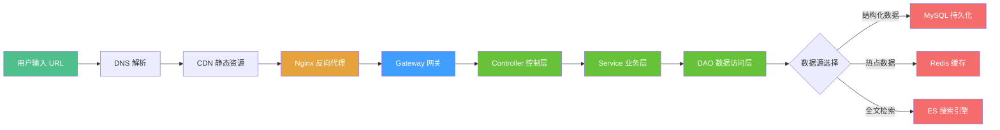
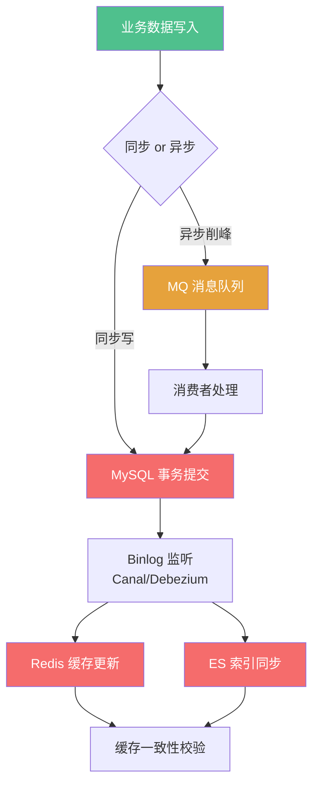
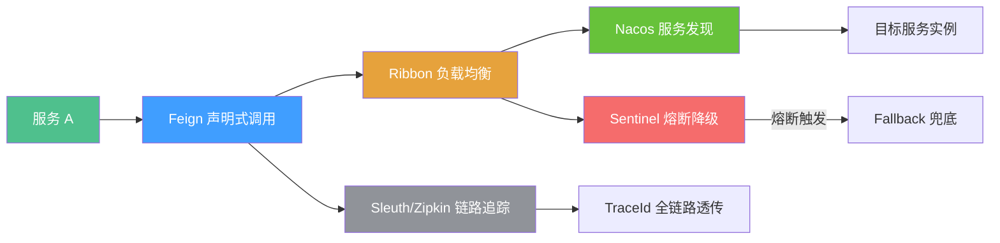
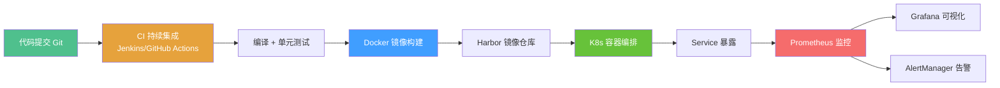

# 知识体系串联

> 面向高级工程师面试，解决"知识割裂"问题——将分散的技术模块串联成有机整体，在面试中展示系统化思维能力。

## 面试重点速览表

| 维度 | 核心问题 | 对应模块 |
|------|----------|----------|
| 请求链路 | 一次 HTTP 请求如何穿透全栈技术栈？ | [Java 高级](/java-advanced/) / [Spring 生态](/spring-ecosystem/) / [中间件](/middleware/) |
| 数据存储 | 数据从产生到持久化经历了哪些技术环节？ | [数据库](/database/) / [中间件](/middleware/) / [高并发](/high-concurrency/) |
| 分布式调用 | 微服务间一次 RPC 调用涉及哪些组件？ | [Spring 生态](/spring-ecosystem/) / [中间件](/middleware/) / [高并发](/high-concurrency/) |
| 部署运维 | 代码提交后如何到达生产环境并被监控？ | [DevOps](/devops/) / [高并发](/high-concurrency/) |
| 知识交叉 | 如何用一个知识点串联多个技术模块？ | 全部模块 |
| 深度递进 | 如何展示从基础到架构的知识深度？ | [Java 高级](/java-advanced/) / [中间件](/middleware/) / [高并发](/high-concurrency/) |

## 问题背景

高级工程师面试中，一道题往往横跨多个技术领域。面试官问"Redis 怎么用的"，初级回答是"做缓存"，高级回答是"缓存穿透用布隆过滤器、缓存一致性用延迟双删 + MQ 异步通知、分布式锁用 Redisson 看门狗机制"。两者的差距在于**知识串联能力**。

::: info 面试官视角
面试官真正想考察的不是你"背了多少八股文"，而是你能否**把零散的知识点串联成一个逻辑自洽的体系**。当一个候选人能清晰地说出"某个设计决策如何影响上下游环节"，基本可以判定为高级水平。
:::

::: warning 常见陷阱
许多候选人在准备面试时陷入"知识孤岛"——每个模块单独复习，但面试时被问到跨模块问题时无法快速建立联系。比如被问到"如何处理缓存与数据库不一致"，只答了 Redis 层面的策略，却没有关联 MySQL 事务隔离级别和 MQ 消息可靠性。
:::

## 核心内容

### 一、四大串联链路

#### 1.1 请求链路：从 URL 到响应

面试中最高频的"全链路"问题，考察从网络层到应用层的完整理解。



**链路中各环节关联的知识点：**

| 环节 | 关联模块 | 核心知识点 |
|------|----------|------------|
| DNS 解析 | [高并发](/high-concurrency/) | DNS 负载均衡、CDN 调度、HTTPDNS 移动端优化 |
| CDN | [高并发](/high-concurrency/) | 静态资源缓存策略、回源机制、缓存击穿 |
| Nginx | [中间件](/middleware/) | 反向代理、负载均衡算法、限流配置、TLS 终止 |
| Gateway | [Spring 生态](/spring-ecosystem/spring-cloud/gateway) | 路由断言、过滤器链、限流（令牌桶）、跨域处理 |
| Controller | [Spring 生态](/spring-ecosystem/spring-framework/aop) | AOP 日志、参数校验、统一异常处理、响应封装 |
| Service | [Spring 生态](/spring-ecosystem/spring-framework/transaction) | 事务传播、缓存注解、业务编排 |
| DAO | [数据库](/database/mysql/) | 连接池（HikariCP）、SQL 优化、索引命中 |
| Redis | [数据库](/database/redis/cache-strategy) | 缓存穿透/击穿/雪崩、缓存一致性、分布式锁 |
| ES | [数据库](/database/elasticsearch/) | 倒排索引、分词器、近实时搜索 |

::: tip 面试策略
回答"从输入 URL 到页面展示"时，不要像背流水账。建议采用**分层递进**策略：先讲网络层（DNS/CDN/Nginx），再讲应用层（Spring 全家桶），最后讲数据层（MySQL/Redis/ES），每层点出 1-2 个关键技术决策。
:::

#### 1.2 数据存储链路：从写入到检索



**数据存储链路交叉索引：**

| 问题场景 | 涉及模块 | 交叉知识点 |
|----------|----------|------------|
| 缓存一致性 | [数据库 - MySQL 事务](/database/mysql/transaction-locking) + [数据库 - Redis 缓存策略](/database/redis/cache-strategy) + [中间件 - MQ](/middleware/message-queue/) | MySQL 事务隔离 + 延迟双删 + MQ 异步通知 |
| 消息可靠性 | [中间件 - MQ](/middleware/message-queue/reliability) + [数据库 - MySQL](/database/mysql/) + [高并发 - 分布式事务](/high-concurrency/distributed-theory/distributed-transaction) | 生产者确认 + 消费者 ACK + 本地消息表 + 幂等 |
| 数据同步延迟 | [中间件 - MQ](/middleware/message-queue/) + [数据库 - Redis](/database/redis/) + [数据库 - ES](/database/elasticsearch/) | Canal 实时同步 + 最终一致性 + 版本号乐观锁 |
| 分库分表 | [数据库 - MySQL 分库分表](/database/mysql/sharding) + [中间件 - 分布式 ID](/middleware/distributed-system/id-generator) | ShardingSphere 路由 + 雪花算法 + 全局唯一 ID |

::: danger 关键提醒
数据存储链路中最容易出问题的是**缓存一致性**。面试中切忌只说"用 Redis 做缓存"，必须追问：写操作时先更新数据库还是先删缓存？如果删缓存失败怎么办？MQ 消息丢失怎么办？这三个问题能直接区分 3 年和 5 年经验的候选人。
:::

#### 1.3 分布式调用链路：微服务间的 RPC 调用



**分布式调用链中各环节风险点：**

| 环节 | 风险 | 应对方案 |
|------|------|----------|
| Feign 调用 | 超时、序列化失败 | 合理配置超时时间、统一异常处理、重试机制 |
| Ribbon 负载均衡 | 负载不均、某个实例故障 | 自定义负载均衡策略、结合 Nacos 权重 |
| Nacos 服务发现 | 注册中心不可用、服务下线延迟 | 客户端缓存、健康检查、保护阈值 |
| Sentinel 熔断 | 误熔断、降级逻辑不合理 | 慢调用比例熔断、异常比例熔断、热点参数限流 |
| Sleuth 链路追踪 | TraceId 丢失、采样率过高 | 线程池传递 TraceId、合理设置采样率 |

::: tip 如何展示技术广度
回答分布式调用链问题时，按"调用 → 路由 → 容错 → 追踪"四层递进展开。例如："Feign 发起调用后，Ribbon 根据 Nacos 的实例列表做负载均衡，如果目标实例响应超时，Sentinel 会根据配置的熔断策略触发降级，同时 Sleuth 会生成 TraceId 贯穿整个调用链，方便排查问题。"这样的回答展示了对整个微服务治理体系的系统性理解。
:::

#### 1.4 部署运维链路：从代码提交到生产监控



**部署运维链路交叉知识：**

| 阶段 | 关联模块 | 面试切入点 |
|------|----------|------------|
| CI 阶段 | [DevOps - CI/CD](/devops/cicd/) | 流水线设计、代码质量门禁、自动化测试 |
| 镜像构建 | [DevOps - Dockerfile](/devops/docker/dockerfile) | 多阶段构建、镜像瘦身、层缓存优化 |
| 镜像存储 | [DevOps](/devops/) | Harbor 权限管理、镜像安全扫描、漏洞修复 |
| 容器编排 | [K8s](/devops/) | 滚动更新、健康检查、资源限制、HPA 弹性伸缩 |
| 监控告警 | [高并发 - 监控](/high-concurrency/monitoring-alerting/) | 四类黄金指标（延迟/流量/错误/饱和度）、告警降噪 |

### 二、模块知识交叉索引表

以下表格给出了常见的跨模块知识组合，面试中遇到关键词时快速关联：

| 触发关键词 | 关联模块 1 | 关联模块 2 | 关联模块 3 | 完整回答视角 |
|------------|------------|------------|------------|--------------|
| 缓存一致性 | [MySQL 事务](/database/mysql/transaction-locking) | [Redis 缓存策略](/database/redis/cache-strategy) | [MQ 异步](/middleware/message-queue/) | 事务隔离级别 → 延迟双删 → Canal + MQ 异步同步 |
| 分布式锁 | [Java 锁机制](/java-advanced/concurrency/locks) | [Redis 分布式锁](/database/redis/distributed-lock) | [ZooKeeper](/middleware/distributed-system/zookeeper) | JUC AQS 原理 → Redisson 看门狗 → ZK 临时顺序节点 |
| 消息幂等 | [MQ 可靠性](/middleware/message-queue/reliability) | [MySQL 唯一索引](/database/mysql/index-optimization) | [Redis SetNX](/database/redis/data-structure) | 消费端去重表 + 唯一约束 + Redis 去重 |
| 服务降级 | [Sentinel 熔断](/spring-ecosystem/spring-cloud/sentinel) | [Hystrix 线程池隔离](/high-concurrency/design-patterns/circuit-breaker) | [限流算法](/high-concurrency/design-patterns/rate-limiter) | 熔断策略 → 线程池/信号量隔离 → 令牌桶/漏桶 |
| 分库分表 | [ShardingSphere](/database/mysql/sharding) | [分布式 ID](/middleware/distributed-system/id-generator) | [分布式事务](/high-concurrency/distributed-theory/distributed-transaction) | 分片策略 → 雪花算法 → Seata AT/TCC |
| 性能优化 | [JVM 调优](/java-advanced/jvm/tuning) | [SQL 优化](/database/mysql/sql-optimization) | [连接池](/high-concurrency/architecture-scaling/connection-pool-optimization) | GC 优化 → 索引优化 → HikariCP 配置 |
| 限流方案 | [Gateway 限流](/spring-ecosystem/spring-cloud/gateway) | [Sentinel 限流](/spring-ecosystem/spring-cloud/sentinel) | [Nginx 限流](/middleware/) | 网关层限流 → 服务层限流 → 反向代理层限流 |

::: tip 面试技巧
当面试官问到一个具体知识点时，主动延伸 1-2 个关联模块。例如被问到"Redis 分布式锁怎么实现"，回答完 Redisson 后可以补充："在分布式锁的实现中，底层复用了 Java AQS 的设计思想，如果对一致性要求更高，可以考虑 ZK 的临时顺序节点方案。"这种主动延伸展示了你对知识体系的整体把控。
:::

### 三、知识深度递进：从一个知识点到整个体系

面试中最加分的回答模式是**纵深递进**——从一个基础知识点层层深入，展示从源码到架构的理解深度。下面以"锁"为例：

```
synchronized (Java 关键字)
    └── 锁升级：偏向锁 → 轻量级锁（CAS）→ 重量级锁（monitor）
        └── AQS（AbstractQueuedSynchronizer）
            └── ReentrantLock（公平锁/非公平锁、Condition）
                └── JUC 并发工具（CountDownLatch、Semaphore、CyclicBarrier）
                    └── 分布式锁（MySQL 悲观锁 / Redis SETNX / ZK 临时节点）
                        └── Redisson（看门狗续期、可重入、红锁 RedLock）
```

**逐层说明：**

| 层级 | 知识点 | 面试回答要点 |
|------|--------|--------------|
| 第 1 层 | synchronized | 底层 monitorenter/monitorexit 指令、Mark Word 锁标记、锁升级不可逆 |
| 第 2 层 | AQS | CLH 队列变种、state 状态变量、park/unpark 线程阻塞、模板方法模式 |
| 第 3 层 | ReentrantLock | 基于 AQS 实现、公平锁先检查队列、Condition 的等待队列 |
| 第 4 层 | JUC 工具 | CountDownLatch 共享锁模式、Semaphore 共享式获取、CyclicBarrier 可重用 |
| 第 5 层 | 分布式锁 | 三个条件：互斥性、防死锁、可重入；MySQL 性能差、Redis 主从脑裂风险、ZK CP 强一致 |
| 第 6 层 | Redisson | 看门狗自动续期（默认 30s 每 10s 续期）、可重入用 Hash 结构存重入次数、红锁多节点投票 |

::: danger 深度递进关键
面试中展示知识深度时，不要一次性倒出所有内容，而是**引导面试官追问**。先给出简短的核心答案，如果面试官追问"为什么"或"底层怎么实现的"，再逐层展开。这样既展示了深度，也体现了沟通能力。
:::

### 四、页面交叉引用索引

本知识库各模块之间通过交叉引用形成知识网络，以下为关键引用路径：

**从当前页面可跳转的核心模块：**

| 目标模块 | 路径 | 与知识串联的关联 |
|----------|------|------------------|
| Java 高级 | [并发编程](/java-advanced/concurrency/) | 锁机制串联到分布式锁 |
| Java 高级 | [JVM 调优](/java-advanced/jvm/tuning) | 性能优化串联到全链路 |
| Spring 生态 | [Spring Cloud 网关](/spring-ecosystem/spring-cloud/gateway) | 请求链路网关层 |
| Spring 生态 | [Sentinel 熔断](/spring-ecosystem/spring-cloud/sentinel) | 分布式调用容错 |
| Spring 生态 | [事务管理](/spring-ecosystem/spring-framework/transaction) | 数据一致性 |
| 数据库 | [MySQL 事务](/database/mysql/transaction-locking) | 缓存一致性串联 |
| 数据库 | [Redis 缓存策略](/database/redis/cache-strategy) | 缓存一致性串联 |
| 数据库 | [ES 核心架构](/database/elasticsearch/) | 数据检索链路 |
| 中间件 | [MQ 消息可靠性](/middleware/message-queue/reliability) | 异步链路可靠性 |
| 中间件 | [分布式事务](/middleware/distributed-system/transaction) | 跨服务一致性 |
| 高并发 | [限流算法](/high-concurrency/design-patterns/rate-limiter) | 全链路保护 |
| 高并发 | [系统设计 - 秒杀](/high-concurrency/system-design/seckill) | 全链路实战 |
| 高并发 | [监控告警](/high-concurrency/monitoring-alerting/) | 运维链路 |
| DevOps | [CI/CD](/devops/cicd/) | 部署链路 |
| AI 应用 | [RAG 原理](/ai-application/rag/) | 知识检索与 AI 结合 |

## 常见误区

### 误区一：知识串联 = 把知识点全背出来

::: warning 错误示范
面试官："讲一下 Redis 在你们项目中的使用。"

候选人（背诵模式）："Redis 有五种数据类型 String、Hash、List、Set、ZSet，持久化有 RDB 和 AOF，集群模式有主从、哨兵、Cluster，缓存穿透用布隆过滤器，缓存击穿用互斥锁，缓存雪崩用随机过期时间……"

面试官内心："这人在背八股文，没有实际思考。"
:::

::: tip 正确做法
先讲业务场景，再讲技术选型的原因，最后讲遇到的问题和解决方案。例如："我们项目中用户画像数据需要毫秒级响应，用 Redis Hash 存储。遇到过缓存与 DB 不一致的问题，通过监听 Binlog + MQ 异步更新缓存解决。"
:::

### 误区二：只关注深度，忽略广度

有些候选人深耕某个模块（如 JVM），但被问到微服务调用链时无法串联。面试官会认为你"偏科严重"。

### 误区三：过度串联，主线不清晰

虽然知识串联很重要，但回答时仍应有清晰主线。不要在回答分布式锁时突然跳到 JVM GC，除非面试官引导。

### 误区四：忽视 AI 模块的串联

2025-2026 年面试中，越来越多的面试官会考察 AI 与传统技术的结合能力。例如："如何用 LLM 优化你们的客服系统？"这个问题需要串联 [AI 应用 - RAG](/ai-application/rag/) + [数据库 - ES](/database/elasticsearch/) + [中间件 - MQ](/middleware/message-queue/)。

## 面试高频问题汇总

### 问题 1：从输入 URL 到页面展示，经历了什么？

**考察点**：全链路系统思维、各层技术细节的掌握程度。

**参考答案**：

这道题是经典的"区分初中高级"的面试题。建议按以下层次回答：

**第一层 - 网络层**：
- 浏览器解析 URL，检查 HSTS 列表决定走 HTTP 还是 HTTPS
- DNS 解析：浏览器缓存 → 操作系统 hosts → 本地 DNS → 根域 → 顶级域 → 权威 DNS（可展开 CDN 调度、HTTPDNS 移动端优化）
- 建立 TCP 连接（三次握手）+ TLS 握手（HTTPS 场景），可展开 TCP 拥塞控制、TLS 1.3 的 1-RTT 优化

**第二层 - 网关层**：
- 请求到达 Nginx/OpenResty，进行反向代理、负载均衡、限流检查
- 经过 Gateway 网关，进行路由匹配、Token 校验、请求日志记录

**第三层 - 应用层**：
- Controller 接收请求，进行参数校验（JSR-303）、AOP 日志切面记录
- Service 层执行业务逻辑，涉及事务管理（@Transactional 传播行为）、缓存操作（@Cacheable）
- DAO 层通过 MyBatis/MyBatis-Plus 执行 SQL，HikariCP 连接池管理

**第四层 - 数据层**：
- MySQL 执行 SQL：查询缓存（8.0 已移除）→ 解析器 → 优化器 → 执行器 → 存储引擎（InnoDB Buffer Pool）
- Redis 缓存读取：key 路由到对应 slot → 根据数据类型编码读取
- 如需搜索：ES 倒排索引查询，相关性打分后返回

**第五层 - 响应返回**：
- 结果层层返回，浏览器收到 HTML 后解析 DOM、CSSOM，执行 JS，渲染页面

::: tip 加分项
提到 HTTP/2 多路复用、QUIC/HTTP3 的 0-RTT 握手、Service Worker 离线缓存等前沿技术，展示技术视野。
:::

---

### 问题 2：如何用一个知识点展示你的技术广度？

**考察点**：知识串联能力、技术广度、结构化表达能力。

**参考答案**：

以"缓存"这个知识点为例，可以从以下维度展开：

| 维度 | 知识点 | 关联模块 |
|------|--------|----------|
| 客户端缓存 | HTTP Cache-Control、ETag、Service Worker | [前端](/frontend/) / [高并发](/high-concurrency/) |
| CDN 缓存 | 边缘节点缓存、回源策略、缓存刷新 | [高并发](/high-concurrency/) |
| 反向代理缓存 | Nginx proxy_cache、缓存命中率优化 | [中间件](/middleware/) |
| 本地缓存 | Caffeine、Guava Cache、JVM 堆内/堆外 | [Java 高级](/java-advanced/) |
| 分布式缓存 | Redis 数据结构、集群方案、缓存策略 | [数据库](/database/redis/) |
| 缓存一致性 | 延迟双删、Canal + MQ 异步、最终一致性 | [数据库](/database/) + [中间件](/middleware/) |
| 缓存穿透 | 布隆过滤器、空值缓存、接口层校验 | [数据库](/database/redis/) |
| 多级缓存 | L1 本地缓存 + L2 Redis + L3 DB | [高并发](/high-concurrency/) |
| AI 缓存 | 语义缓存、LangChain Cache、Embedding 缓存 | [AI 应用](/ai-application/) |

回答策略："以缓存为例，从客户端到服务端，从单机到分布式，从传统缓存到 AI 语义缓存，我可以从 9 个维度展开……"这种结构化的回答能让面试官清晰看到你的技术广度。

---

### 问题 3：分布式系统调用链中哪些环节可能出问题？

**考察点**：分布式系统故障排查能力、容错设计思维。

**参考答案**：

分布式调用链的每个环节都可能成为故障点，按调用顺序梳理：

**1. 服务发现环节（Nacos/Eureka）**
- 问题：注册中心不可用导致新实例无法注册、旧实例未及时剔除
- 解决：客户端缓存服务列表、健康检查 + 保护阈值、注册中心集群部署

**2. 负载均衡环节（Ribbon/LoadBalancer）**
- 问题：负载不均导致某些实例压力过大、某实例故障未被及时摘除
- 解决：最小活跃数策略、加权轮询、结合 Nacos 权重动态调整

**3. 远程调用环节（Feign/Dubbo）**
- 问题：超时、序列化异常、网络抖动、雪崩效应
- 解决：合理设置超时时间（connect + read）、统一异常处理、重试机制（需注意幂等）

**4. 熔断降级环节（Sentinel/Hystrix）**
- 问题：误熔断（正常实例被熔断）、降级逻辑本身抛异常
- 解决：慢调用比例熔断更精准、降级逻辑保持简单、熔断后探活机制

**5. 链路追踪环节（Sleuth/SkyWalking）**
- 问题：TraceId 在跨线程池时丢失、采样率过高导致性能损耗
- 解决：使用 HystrixConcurrencyStrategy 传递 TraceId、合理设置采样率（如 10%）

**6. 事务一致性环节（Seata/MQ）**
- 问题：分布式事务超时、补偿失败、空回滚/悬挂
- 解决：TCC 模式 + 幂等设计、Saga 模式 + 补偿、本地消息表 + 定时任务兜底

::: danger 核心原则
分布式系统的故障排查遵循"**隔离 → 定位 → 恢复 → 复盘**"四步法。面试中展示你设计容错方案的思路，比单纯罗列故障点更有价值。
:::

---

### 问题 4：如何回答"你最擅长什么"来展示全栈能力？

**考察点**：自我认知、技术深度与广度平衡、项目经验总结能力。

**参考答案**：

这道题的关键是**用一个领域串联全栈**。推荐的回答结构：

**第一步：选择一个"锚点领域"**（展示深度）

例如："我最擅长的是高并发场景下的系统设计，尤其是秒杀/抢购类业务。"

**第二步：横向展开关联技术**（展示广度）

"围绕这个领域，我在以下方面有深入实践：
- **后端**：基于 Spring Cloud 微服务架构，使用 Sentinel 做流量控制，Seata 做分布式事务
- **缓存**：多级缓存策略（Caffeine + Redis），通过 Canal + RocketMQ 保证缓存一致性
- **数据库**：MySQL 分库分表 + 读写分离，针对秒杀场景优化索引和 SQL
- **中间件**：RocketMQ 异步下单削峰，Kafka 做埋点日志采集
- **运维**：K8s 弹性伸缩应对流量洪峰，Prometheus + Grafana 全链路监控"

**第三步：点出 AI 融合**（展示前瞻性）

"最近在探索 AI 在高并发场景的应用，比如用 LLM 做智能限流策略调整、基于 RAG 的智能客服降级等。"

**第四步：用数据收尾**

"在上一家公司，我主导的秒杀系统支撑了 QPS 10w+，P99 延迟控制在 200ms 以内，零资损。"

::: tip 面试策略
"最擅长什么"不是让你选一个技术栈，而是让你用一个**业务场景**把全栈技术串起来。面试官想看到的不是一个"Redis 专家"，而是一个能用各种技术解决实际问题的"系统设计师"。
:::

---

### 问题 5：为什么要做知识串联而不是单独背诵？

**考察点**：学习方法论、元认知能力、对高级工程师职责的理解。

**参考答案**：

**1. 面试的考察逻辑变了**

初级工程师面试考察"你知道什么"（知识点记忆），高级工程师面试考察"你怎么用知识解决问题"（知识运用）。知识串联是展示运用能力的基础。

**2. 实际问题天然跨模块**

线上一个慢查询问题，可能涉及：SQL 执行计划（数据库）→ 连接池配置（Java）→ 网络延迟（网络层）→ GC 停顿（JVM）→ 限流降级（微服务）。任何一个环节单独看都可能导致误判。

**3. 知识串联 = 系统设计能力**

高级工程师的核心能力是系统设计，而系统设计本质上是把分散的技术点整合成一个有机方案。如果你连知识点之间的关系都理不清，如何设计系统？

**4. 串联后的知识更不容易遗忘**

脑科学研究表明，孤立的事实记忆遗忘率极高，而建立关联的知识网络会形成"记忆锚点"。当你把 synchronized 和 AQS 和分布式锁串起来，任意一个被提及都会激活整个网络。

**5. 知识串联是 AI 时代的核心竞争力**

在 AI 可以秒级生成八股文答案的时代，单纯的"知识记忆"已经贬值。但你能否将一个技术决策的上下游影响说清楚、能否在系统设计中做出合理的 trade-off——这些是 AI 无法替代的。

::: info 总结
**单独背诵让你通过一面，知识串联让你通过终面。** 初级工程师拼的是"我知道多少"，高级工程师拼的是"我能把多少知识串成解决方案"。
:::

---

## 延伸阅读

- [面试冲刺总览](/interview/) —— 面试策略与准备节奏
- [简历优化指南](/interview/resume) —— STAR 法则书写项目经验
- [算法刷题指南](/interview/algorithm/) —— 高频题分类精讲
- [系统设计面试技巧](/interview/system-design/) —— 白板设计方法论
- [行为面试 - STAR 法则](/interview/behavioral/) —— 软技能与沟通技巧
- [模拟面试](/interview/mock-interview) —— 自测与复盘方法