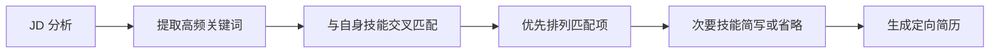
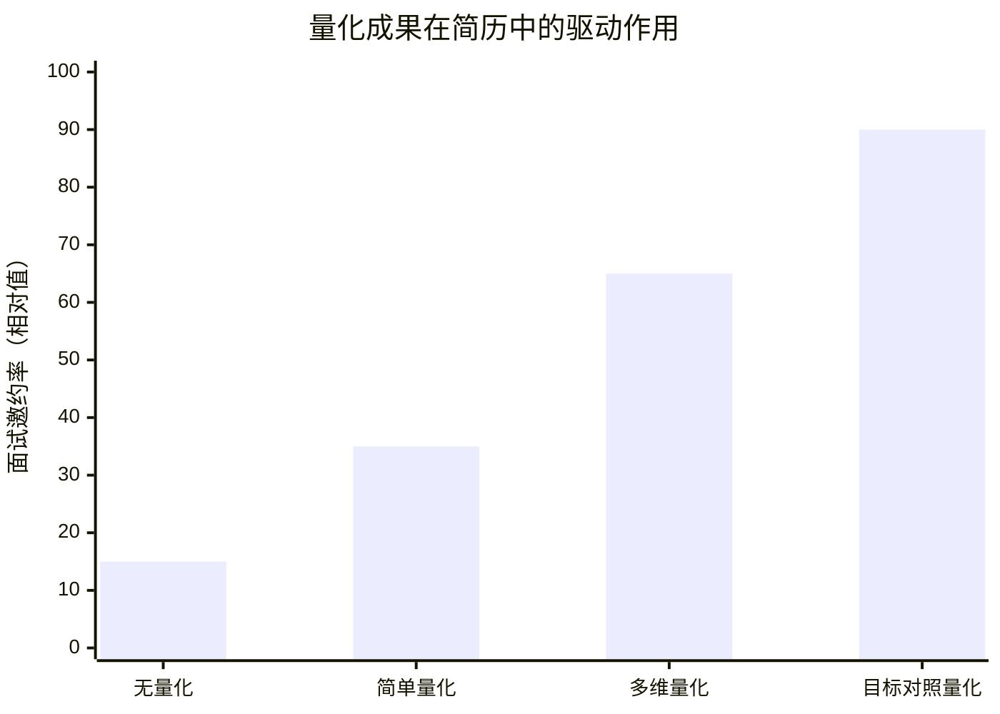
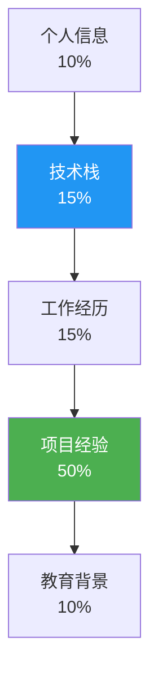

# 简历优化指南

> 面向高级工程师面试的简历撰写方法论，帮助你从简历筛选到面试邀约，每一步都有的放矢。

---

## 面试重点速览表

| 模块 | 核心要点 | 面试官关注度 |
|------|----------|:----------:|
| STAR 法则写项目经验 | 情境→任务→行动→结果，用数据闭环收尾 | :star::star::star::star::star: |
| 技术栈精准匹配 JD | 提取关键词对齐，无关技术不堆砌 | :star::star::star::star::star: |
| 量化成果方法论 | QPS / P99 延迟 / 可用性 / 人力节省，四维量化 | :star::star::star::star::star: |
| 简历结构模板 | 个人信息→技术栈→工作经历→项目经验→教育背景 | :star::star::star::star: |
| 常见雷区纠正 | 造假、关键词堆砌、流水账、信息过载 | :star::star::star::star::star: |
| AI 项目经验包装 | RAG / Agent 项目从 Demo 到深度经验提炼 | :star::star::star::star: |

---

## 问题背景

一份高级工程师的简历，平均被 HR 初筛阅读的时间不超过 **15 秒**，进入技术面后，面试官通常只会重点看 **2~3 个核心项目**。如果你的简历在这两个环节没有抓住眼球，连展示技术深度的机会都没有。

大多数高级工程师的简历存在一个通病：**把简历写成了工作日志，而非能力说明书**。堆砌技术名词、罗列日常任务、缺乏量化成果——这些问题让你的简历在茫茫人海中毫无辨识度。

本指南将系统性地拆解高级工程师简历的每一个关键环节，帮助你从"会写代码"包装为"能独立解决复杂问题、有业务影响力"的高级工程师形象。

---

## 核心内容

### 一、STAR 法则写项目经验

STAR 法则（Situation / Task / Action / Result）是面试官最熟悉的项目陈述框架。在简历中运用这一法则，能让你的项目经验立刻变得有逻辑、有深度。

#### 反面案例 vs 正面案例对比

**反面案例（流水账风格）：**

> 负责用户中心模块开发，使用 Spring Boot + MySQL + Redis，实现了用户注册、登录、权限管理等功能。参与代码评审和日常需求迭代。

**正面案例（STAR 风格）：**

> **S（情境）**：公司日活从 50 万增长到 300 万，原有用户中心 QPS 峰值仅 800，登录超时率 3.2%。
> **T（任务）**：主导用户中心架构升级，目标支撑 QPS ≥ 5000，登录 P99 延迟 < 100ms，可用性从 99.5% 提升到 99.95%。
> **A（行动）**：将会话状态从 MySQL 迁移至 Redis Cluster（6 节点），引入本地缓存 + 布隆过滤器减少无效穿透，基于 Sentinel 实现接口级限流熔断，将认证逻辑拆分为独立微服务。
> **R（结果）**：QPS 峰值达 6200，P99 延迟降至 48ms，登录超时率降至 0.1% 以下，全年可用性 99.97%。

| 维度 | 反面案例（流水账） | 正面案例（STAR） |
|------|------------------|-----------------|
| **背景交代** | 无，直接罗列技术栈 | 交代了业务增长的具体数据 |
| **目标量化** | "开发功能"，无法衡量 | QPS ≥ 5000 / P99 < 100ms / 可用性 99.95% |
| **行动细节** | "使用 Redis" 一带而过 | 6 节点集群、布隆过滤器、Sentinel 限流、微服务拆分 |
| **结果验证** | 无 | 四个维度数据对照目标验证 |
| **面试引导性** | 面试官不知道问什么 | 每个技术决策都可深入追问 |

::: tip STAR 法则黄金比例
建议每个项目描述的篇幅分配：**S+T 占 20%**（快速建立场景感）、**A 占 50%**（核心，展现技术决策能力）、**R 占 30%**（用数据闭环收尾，制造记忆点）。
:::

### 二、技术栈精准匹配 JD 技巧

许多高级工程师习惯在简历上列出自己掌握的所有技术，动辄十几个框架和工具。但面试官只关心一个问题：**你的技术栈和目标岗位匹配吗？**

#### 提取关键词对齐法

**具体操作步骤：**

1. **提取 JD 高频词**：将目标岗位的 JD 粘贴到文本工具，统计出现频率最高的技术关键词（通常 5~8 个）。
2. **交叉匹配**：从你自己的技能池中找出与这些关键词重合的部分，作为简历技术栈的**第一梯队**。
3. **分层展示**：技术栈区域按"精通 / 熟练 / 了解"分层，匹配项放"精通"和"熟练"，不相关的技术放"了解"或者干脆不写。

::: warning 不要堆砌无关技术
你精通 C++ 但目标岗位是 Java 后端——C++ 可以一笔带过，但不要放在"精通"层级，否则面试官会质疑你的技术方向。如果你的简历上列满了 Go、Rust、Python、Node.js，面试官只会觉得你"样样稀松"。
:::

::: info 动态简历策略
建议维护一份"母版简历"（包含所有经历），然后针对每个目标岗位生成一份"定向简历"——只保留匹配度最高的 3~4 个项目和技术栈，删除无关内容。
:::

### 三、量化成果方法论

高级工程师和普通工程师简历最大的分水岭，就是**量化成果**。面试官通过数据判断你解决的是"小学生问题"还是"工业级问题"。

#### 四维量化体系

| 量化维度 | 指标示例 | 适用场景 | 可参考的量化方式 |
|----------|---------|---------|----------------|
| **性能指标** | QPS 提升 X%、P99 降低 Yms | 高并发、服务优化 | 压测报告、监控大盘截图、上线前后对比 |
| **可用性指标** | 可用性从 99.5% → 99.95% | 稳定性建设、容灾 | SLI/SLO 报表、告警次数下降、故障时长 |
| **效率指标** | 发布效率提升 X%、人力节省 Y 人月 | 效能工具、自动化 | CI/CD 耗时对比、人工操作次数统计 |
| **业务指标** | 转化率提升 X%、用户留存提升 Y% | 业务型项目 | BI 报表、A/B 实验结论 |

::: danger 量化数据的边界
量化成果必须真实可查。面试官在二面、三面中极有可能追问你数据的来源和计算方式。如果你写"QPS 提升了 500%"，面试官问"原始 QPS 是多少？用了什么压测工具？"你答不上来——这是一个非常严重的诚信问题，大概率直接淘汰。
:::

**如果你没有现成的量化数据，可以这样补救：**

- 查看上线前后的监控系统截图（Grafana、Prometheus、Datadog 等）
- 查阅当时的 Code Review 记录或技术方案文档，里面通常有预估数据
- 找项目经理或产品经理要业务数据报表
- 如果确实没有任何量化的可能，退一步用"解决了什么问题"而不是"提升了多少"来描述——例如"消除了每日凌晨的消息积压瓶颈"，这仍然比流水账强得多

### 四、简历结构模板

一份优秀的高级工程师简历应严格遵循以下五段式结构。每部分都有明确的撰写原则。

| 章节 | 应该放什么 | 不应该放什么 |
|------|----------|------------|
| **个人信息** | 姓名、手机、邮箱、GitHub/博客链接、工作年限、求职意向 | 身份证号、籍贯、星座、婚姻状况、政治面貌（除国企外） |
| **技术栈** | 按"精通/熟练/了解"三级分层的核心技术，每层 3~5 项 | 10+ 个框架全塞在一起、过时的技术（jQuery/SVN）、"了解"级技术占据过多篇幅 |
| **工作经历** | 公司名称、职位、起止时间、一句话概括职责范围 | 长篇大论写日常工作内容、把经历写成流水账 |
| **项目经验** | 3~4 个最有深度的项目，每个用 STAR 法则展开（5~8 行） | 8+ 个项目全部罗列、按时间倒序不分主次、项目描述不超过 2 行 |
| **教育背景** | 学校、专业、学历、毕业年份；如有突出学术成果可简写 | 超过 3 行的教育细节、中小学经历、与编程无关的校内活动 |

::: tip 项目经验是简历的"心脏"
面试官 80% 的时间花在项目经验上，这部分应占简历篇幅的 50% 左右。选 3~4 个最能体现技术深度和业务影响力的项目，其他项目一行带过即可。
:::

### 五、常见简历雷区及纠正方案

#### 雷区一：造假（包括"注水"）

**典型表现**：把参与写成主导、把 CRUD 包装成高并发、编造不存在的数据。

**纠正方案**：
- 角色如实写：代码贡献者就是贡献者，不要硬写成"负责人"
- 如果确实参与了大型项目但只负责子模块，写清楚"负责 XX 模块设计开发，项目整体 QPS 达 XX"
- 面试官问两轮就能识别造假，一旦判定不诚信，直接进入黑名单

#### 雷区二：堆砌关键词

**典型表现**：技术栈列了 20+ 个框架，项目描述中把用过一次的工具全写上去。

**纠正方案**：
- 按 JD 匹配度排序，高匹配在前
- "了解"级别的技术只保留当前 JD 最相关的 2~3 个
- 项目中只写核心技术栈，删掉无关工具（如"使用 Git 进行版本管理"——这种人人都会的事不值得写）

#### 雷区三：缺乏量化

**典型表现**：全文无一个数字，"优化了系统性能""提升了用户体验"。

**纠正方案**：
- 每个项目至少给出 1 个量化结果
- 优先用百分比而非绝对值（"QPS 提升 200%"比"QPS 从 200 涨到 600"更有冲击力）
- 实在没有数据，用业务描述代替，如"解决了增长团队每天人工处理 200+ 条数据的痛点，改为全自动流程"

#### 雷区四：项目描述流水账

**典型表现**："使用 Spring Boot 开发用户模块，编写 CRUD 接口，编写单元测试，参与需求评审。"

**纠正方案**：
- 用 STAR 法则重写每一个项目
- 突出"我做了什么技术决策"而不是"我用了什么技术"
- 删除所有"参与""协助""配合"等弱动词，改用"主导""设计""落地""推动"

#### 雷区五：一页放太多内容

**典型表现**：10 年经验硬塞一页，字号 9pt，行间距极小，密密麻麻。

**纠正方案**：
- 5 年以下经验：严格一页
- 5~10 年经验：一页半到两页（第一页放最核心内容）
- 10 年以上经验：两页，第二页放早期经历和教育背景
- 排版优先级：项目经验 > 技术栈 > 工作经历 > 个人信息 > 教育背景

---

## 常见误区

### 误区一：技术栈越多越好

**真相**：面试官会认为你"广度有余、深度不足"。高级工程师的核心竞争力是**深度**。列出 3 个精通 + 5 个熟练的技术，比列出 15 个"了解"的技术更有说服力。

### 误区二：项目越多越好

**真相**：8 个项目并排 = 8 个都是浅尝辄止。精选 3~4 个最能体现能力的项目，每个用 STAR 法则深入展开。面试官会在深度追问中判断你的真实水平。

### 误区三：把日常职责当项目经验

**真相**：日常维护、Bug 修复、Code Review 这些是"本职工作"，不是"项目经验"。简历上的项目应该是**有明确目标、有起止时间、有可衡量成果**的专项工作。

### 误区四：简历模板决定一切

**真相**：排版整洁（LaTeX 或 Markdown 渲染）是加分项，但内容质量占据 90% 的权重。不要花 3 天时间调排版却只用 30 分钟写内容。

### 误区五：AI 项目写不进传统简历

**真相**：RAG、Agent、Prompt Engineering 这些能力已经进入主流招聘需求。关键不是"有没有用 AI"，而是"用 AI 解决了什么传统方法解决不了的问题"——这恰恰需要你用 STAR 法则把所有 AI 项目重新梳理一遍。

---

## 面试高频问题汇总

### 问题一：项目经验怎么写才能吸引面试官？

**参考答案**：

面试官看项目经验有一条隐性公式——**技术深度 × 业务影响力**。技术深度体现在你做的技术决策是否有"取舍"（trade-off），业务影响力体现在数据是否够大（用户量、QPS、节省成本）。

具体做法：
1. 每个项目用 **STAR 法则**展开，S 和 T 交代业务背景和量化目标，A 突出技术决策和 trade-off，R 用数据闭环验证。
2. 在 A（行动）部分埋"钩子"——写一个让人想追问的技术细节。例如"通过自研布隆过滤器将缓存穿透率从 12% 降至 0.3%"，面试官大概率会追问布隆过滤器的实现细节。
3. 删除所有"参与""协助"等弱语义动词，统一用"主导""设计""落地""推动"。

下面这段聊天就是典型的反面教材——当你被追问项目细节时，如果答不上来，面试官会直接判定"虚假包装"：

> 面试官："简历上写你主导了用户中心的架构升级，当时为什么选择 Redis Cluster 而不是 Codis？"
>
> 候选人："呃……因为 Redis Cluster 比较成熟。"
>
> 面试官："那你当时评估过多少个节点能支撑 5000 QPS？扩容方案是什么？"
>
> 候选人："这个……是运维同事评估的，我不太清楚。"

::: danger 核心原则
写进简历的每一项技术，你都必须能回答三个问题：为什么选它？有没有评估过替代方案？遇到了什么坑以及如何解决的？如果这三个问题你答不上来，请把这项技术从简历上删掉。
:::

---

### 问题二：没有高并发经验怎么包装？

**参考答案**：

"没有高并发经验"不等于"没有优化经验"。你可以从以下角度切入：

1. **单机性能优化**：即使 QPS 只有 100，你也可以优化单次请求的响应时间。数据库慢查询优化、索引设计、缓存策略、JVM 调优——这些都是性能优化经验。
2. **系统稳定性**：你处理过线上故障吗？有没有做过降级、熔断、限流的预案？稳定性经验在高级工程师面试中权重不低于高并发。
3. **数据一致性**：分布式事务、最终一致性方案、幂等设计——即使并发量不高，复杂度同样存在。
4. **从设计层面证明能力**：如果确实没有生产环境的高并发经验，可以在简历上写"阅读并分析了 XX 开源项目的并发模型"，展示你的学习能力。这种方式在面试中是**可以被接受的**，但务必诚实标注是学习型项目。

---

### 问题三：技术栈太多要不要全写？

**参考答案**：

**不要全写。** 技术栈是做减法，不是做加法。

推荐策略：
- 针对每个岗位，只保留 **3 个精通 + 5 个熟练 + 2 个了解** 的技术栈。
- 精通级别：你能在 30 分钟内白板画出核心原理、读过源码、处理过线上事故的技术。
- 熟练级别：工作中频繁使用，能独立排查和解决问题的技术。
- 了解级别：仅做实验性项目或用过一两次的技术。如果与 JD 不相关，直接删掉。

::: warning 面试官心理
面试官看到 15+ 的技术栈第一反应是："这个人是不是每样都会一点但都不深？"然后会在自己最擅长的领域挑一个深挖——如果你答不上来，全盘崩溃。
:::

---

### 问题四：AI 项目经验怎么写进简历？

**参考答案**：

2024~2026 年，AI 项目经验已经成为高级工程师简历的热门加分项。但大多数人的 AI 项目写得像 Demo 说明书——"基于 LangChain 搭建了一个 RAG 问答系统"。

**把 Demo 写成深度项目的方法：**

1. **从"用了什么框架"升级为"解决了什么问题"**：不要写"使用 LangChain + Pinecone 搭建 RAG"，而写"广告投放团队每天需要从 500+ 份运营文档中检索信息，搭建 RAG 系统后检索耗时从 15 分钟降至 30 秒以内"。
2. **突出工程化挑战**：Demo 和工业级系统的差距在于——向量数据库选型（Milvus vs Pinecone vs Qdrant）、文档切分策略（固定长度 vs 语义切分 vs 递归切分）、检索准确率优化（HyDE、Re-ranking）、大模型幻觉控制。如果你做过这些调优，一定要写出来。
3. **量化用户价值**：RAG 系统响应耗时、准确率、覆盖文档量、日均调用次数——找到你能拿到的任何数字。
4. **Agent 项目包装**：如果你做过 Agent 项目，重点写"多步推理的可靠性保障"——Agent 容易在第三步推理错误导致全链路失败，你做了什么兜底策略？

**反面案例：**
> 使用 LangChain 框架搭建了基于 RAG 的智能问答系统，支持文档上传和检索。

**正面案例：**
> **S**：运营团队每天需手动检索 500+ 份合同文档，平均每条查询耗时 15 分钟，关键条款遗漏率达 12%。
> **T**：主导构建合同智能检索系统，目标查询耗时 < 30s，关键条款召回率 ≥ 95%。
> **A**：选型 Milvus 作为向量数据库（对比 Pinecone 成本降低 60%），设计递归语义切分策略（解决合同条款跨段落问题），引入 BM25 + Dense Retrieval 混合检索 + BGE-Reranker 重排序，针对条款遗漏问题定制少样本 Prompt 模板。
> **R**：查询耗时降至 22s，关键条款召回率达 96.3%，日均调用 1200+ 次，被推广至法务团队使用。

---

### 问题五：简历一页还是两页？

**参考答案**：

这是一个高频纠结问题，答案取决于你的工龄和经历密度：

| 工作年限 | 推荐页数 | 说明 |
|---------|:------:|------|
| 3 年以下 | **一页** | 经历不够两页，硬凑两页反而暴露"凑数"嫌疑 |
| 3~5 年 | **一页（优先）** | 精选 3 个最有深度的项目，精简早期经历 |
| 5~8 年 | **一页半~两页** | 项目经历可以展开到 4~5 个，但第一页必须让人读完就有"想要面试他"的冲动 |
| 8~10 年 | **两页** | 第二页放早期经历和补充项目，不重要的几年合并简述 |
| 10 年以上 | **两页（上限）** | 在第二页末尾加一句"早期经历备索"，不必展开所有历史 |

::: info 页数决定的黄金法则
**页数不是选择题，而是信息密度的函数。** 如果你一页纸就能让面试官产生强烈好奇——"这个人在 XX 项目里到底是怎么做的？"——那这就是一个满分的一页简历。如果你删减到一页后发现核心项目的技术深度完全丢失，那请果断扩展到两页。
:::

---

### 附：AI 项目经验包装速查

针对 RAG / Agent 项目经验的亮点提炼清单：

| 项目类型 | 常见 Demo 写法 | 深度包装方向 | 可量化的指标 |
|---------|--------------|------------|------------|
| RAG 问答 | "使用 LangChain 搭建问答系统" | 向量数据库选型、切分策略调优、混合检索方案 | 检索耗时、召回率、幻觉率 |
| Agent 工具调用 | "基于 Agent 实现自动任务" | 多步推理容错、工具链编排、failover 机制 | 任务成功率、平均执行步数 |
| Fine-tuning | "微调了 LLaMA 模型" | 数据清洗 pipeline、评估体系搭建、cost 优化 | 推理耗时下降、准确率提升、GPU 成本节省 |
| Prompt 工程 | "设计了 Prompt 模板" | 少样本模板体系、A/B 测试框架、多轮对话状态管理 | 意图识别准确率、用户满意度 |

::: tip 量化没有标准答案
AI 项目很多处在"先上线再优化"阶段，不一定有完美的线上数据。如果你拿不到线上数据，可以用离线评测数据：在你自己构建的测试集上准确率从 XX% 提升到 YY%。只要标注评测方式，面试官是可以接受的。
:::

---

> **最后提醒**：简历的目标不是"展示你做过什么"，而是"让面试官觉得值得花一小时和你聊聊"。永远站在阅读者的角度审视自己的简历——如果连你自己都不想细读，别人更不会。