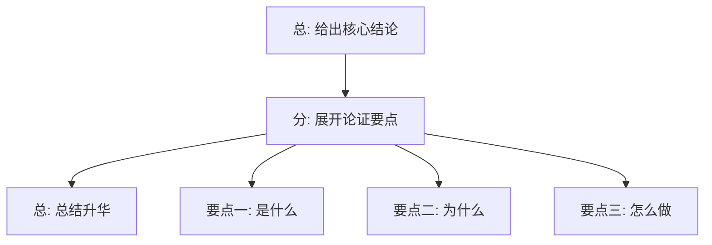
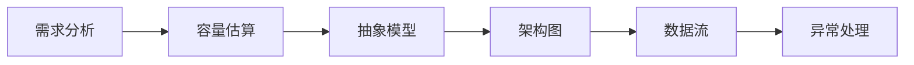

# 软技能与沟通

面试不只是技术能力的较量，更是沟通能力的展示。对于高级工程师而言，能否在有限的面试时间内让面试官理解你的思考深度、技术广度和解决问题的能力，往往是决定成败的关键。本文将系统梳理面试中软技能的核心技巧，帮助你从"会做不会说"进化到"既会做又会讲"。

---

## 面试重点速览表

| 核心能力 | 关键技巧 | 面试收益 |
|---------|---------|---------|
| 结构化表达 | 总-分-总 / 金字塔原理 | 让回答层次分明，易于理解 |
| 白板设计 | 六步法：需求→容量→模型→架构→数据流→异常 | 展现系统性设计能力 |
| 技术问题回答 | 三段式：结论→原理→举例 | 回答有深度，体现工程思维 |
| 应对未知问题 | 坦诚 + 关联 + 展示学习力 | 转劣势为展示潜力的机会 |
| 压力面试 | 冷静拆解 + 反向提问 | 展现抗压能力和理性思维 |
| 情绪管理 | 呼吸调节 + 预备方案 + 注意力转移 | 全程保持最佳状态 |

---

## 问题背景

在高级工程师面试中，面试官关注的远不止"你能不能写出正确的代码"。他们更关心的是：你的思考过程是否有条理？在压力下能否保持冷静？面对不熟悉的领域时是否具备快速学习的能力？你是否能清晰地向团队传达复杂的技术决策？

一个典型场景：两位候选人技术水平相近，但一位能够用结构化方式清晰阐述自己的设计思路，另一位回答散乱、想到哪说到哪。最终拿到 offer 的，无一例外是前者。**沟通能力不是软技能的"加分项"，而是高级工程师的"准入门槛"。**

---

## 核心内容

### 一、结构化表达方法

#### 1.1 总-分-总表达法

总-分-总是最基础也最通用的结构化表达框架，适用于回答绝大多数面试问题。

**结构说明：**

**示例：回答"你是如何做技术选型的？"**

::: tip 总-分-总示例
**总（结论先行）：**
"我做技术选型时遵循'场景驱动、数据支撑、团队适配'三个原则。"

**分（逐点展开）：**
- 场景驱动：先明确业务场景的核心诉求。比如高并发场景下，我会优先考察框架的异步能力和连接池设计，而不是单纯看 Star 数。
- 数据支撑：对候选方案做基准测试，用数据说话。我会搭建最小可行原型，压测关键路径，对比吞吐量和延迟分布。
- 团队适配：评估团队的学习曲线和维护成本。一个再优秀的方案，如果团队无法驾驭，最终也会变成技术债。

**总（总结升华）：**
"所以技术选型不是选'最好'的技术，而是选'最适合当前场景和团队'的技术。这个过程需要权衡取舍，关键是把决策依据讲清楚。"
:::

#### 1.2 金字塔原理

金字塔原理的核心是**结论先行，以上统下，归类分组，逻辑递进**。

**核心规则：**
- 任一层次的思想必须是对下一层次思想的概括
- 每组中的思想必须属于同一逻辑范畴
- 每组中的思想必须按逻辑顺序组织（时间顺序、结构顺序、程度顺序）

::: info 金字塔原理在面试中的应用
当你被问到开放式问题时（如"请介绍一下你做过的最有挑战的项目"），不要按时间线从头讲到尾，而是先抛出最有价值的结论（这个项目的核心挑战是什么，你如何解决的），再展开具体细节。
:::

---

### 二、白板设计技巧

白板设计（系统设计面试）是高级工程师面试中最具区分度的环节。以下是经过验证的六步法操作指南：

#### 步骤一：需求分析（3~5 分钟）

**具体操作：**
1. 听到题目后，先复述一遍确认理解："我理解你希望我设计一个类似 Twitter 的社交平台，对吗？"
2. 主动提问明确边界：
   - "用户规模是多少？DAU 的预期？"
   - "需要支持哪些核心功能？发推文、关注、时间线？"
   - "读多写少还是读写均衡？"
   - "一致性要求高还是可用性优先？"
3. 在白板左上角列出功能需求清单和非功能需求清单

::: warning 常见错误
很多候选人在没搞清楚需求的情况下就开始画架构图，导致方向偏了还得返工。**花 5 分钟理清需求，比花 30 分钟重画架构图划算得多。**
:::

#### 步骤二：容量估算（2~3 分钟）

**具体操作：**
1. 估算数据量级：每天有多少条新数据？存储一年需要多少容量？
2. 估算 QPS：峰值 QPS 大概是平均 QPS 的多少倍？
3. 估算带宽：每次请求的数据量是多少？

**示例话术：**"假设我们有 1 亿 DAU，平均每个用户每天发 1 条推文，那么每天新增 1 亿条推文。每条推文平均 500 字节，每天新增约 50GB 数据，一年约 18TB。读取方面，假设每个用户每天刷 10 次时间线，每次加载 20 条推文，那读 QPS 约为 23 万。"

#### 步骤三：抽象模型（3~5 分钟）

**具体操作：**
1. 定义核心实体及其关系
2. 理清实体间的一对多、多对多关系
3. 在白板上画出简单的 ER 图或实体关系清单

#### 步骤四：架构图（5~8 分钟）

**具体操作：**
1. 从高层架构开始画（Client → LB → App Server → Cache → DB）
2. 逐步细化每个层的技术选型
3. 标注关键组件（消息队列、缓存层、CDN、对象存储等）
4. **边画边讲**，这是最重要的原则

::: tip 画图技巧
- 先画外围（客户端、CDN、DNS），再画内层（服务、存储）
- 用不同颜色区分不同层次
- 关键路径用粗线标注
- 异步流程用虚线表示
:::

#### 步骤五：数据流（3~5 分钟）

选择一个核心场景（如"用户发一条推文"），从头到尾走一遍完整数据流：
1. 请求从哪里进入（客户端 → API Gateway）
2. 经过哪些服务处理
3. 数据写到哪里，缓存如何更新
4. 响应如何返回

#### 步骤六：异常处理（2~3 分钟）

::: danger 关键步骤
很多候选人只讲正常流程，忽略了异常处理，这在面试中是严重扣分项。
:::

主动讨论以下场景：
- 某个服务挂了怎么办？（降级、熔断、重试）
- 数据不一致怎么处理？（最终一致性、补偿机制）
- 热点数据怎么应对？（分片、本地缓存、限流）
- 如何监控和告警？

---

### 三、技术问题回答三段式

技术问题的回答可以使用"三段式"框架，让你的回答既有深度又有层次：

**第一步：先给结论（10 秒）**
用一句话概括核心答案，让面试官立刻知道你的答案方向。

**第二步：再讲原理（2~3 分钟）**
解释底层原理，展示你的深度理解。这一层是区分"会用"和"真懂"的关键。

**第三步：最后举例（1~2 分钟）**
用具体场景或代码片段将抽象原理落地，展示你的实践经验。

---

**完整示例：回答"请讲一下 HashMap 的底层原理"**

::: tip 三段式完整演示

**第一步：结论先行**

"HashMap 的底层是数组 + 链表 + 红黑树的结构，通过哈希函数将 key 映射到数组索引，发生冲突时用链表法解决，链表过长时转换为红黑树以保证 O(log n) 的查询效率。"

**第二步：展开原理**

"具体来说，HashMap 的核心是哈希表。当我们调用 put(key, value) 时：

1. 首先对 key 计算 hashCode，然后通过 `(n-1) & hash` 计算桶索引，这里用位运算替代取模是为了性能优化。
2. 定位到数组对应位置后，如果该位置为空，直接放入；如果不为空，说明发生了哈希冲突。
3. JDK 1.8 之前用纯链表解决冲突，最坏情况下查询复杂度 O(n)。JDK 1.8 引入了红黑树，当链表长度超过 8 且数组长度超过 64 时，链表会树化，将查询复杂度降到 O(log n)。
4. 扩容机制：当元素数量超过容量 × 负载因子（默认 0.75）时，HashMap 会扩容为原来的 2 倍，并对所有元素重新哈希。这里有一个巧妙的设计：因为容量始终是 2 的幂，重新计算索引时只需判断 hash 值在新容量对应的高位 bit 是 0 还是 1，避免了重新计算 hash，大幅提升了扩容性能。

线程安全方面，HashMap 不是线程安全的。在并发场景下，JDK 1.7 中扩容时的头插法可能导致环形链表和死循环，JDK 1.8 改为尾插法解决了死循环问题，但仍然存在数据覆盖问题。并发场景应使用 ConcurrentHashMap。"

**第三步：举例说明**

"我曾经在一个对账系统中发现了一个 bug：定时任务偶尔会漏掉一些数据。排查后发现，开发同事在定时任务的线程中使用了 HashMap 作为本地缓存，而另一个线程在同时遍历这个 Map。这在并发场景下抛出了 ConcurrentModificationException，导致部分数据没有被处理。解决方案是将 HashMap 替换为 ConcurrentHashMap，并且对遍历操作加上了快照读机制。这个案例让我深刻理解了为什么要关注容器的线程安全性。"

:::

---

### 四、遇到不会的问题如何应对

面试中遇到完全不会的问题并不可怕，可怕的是要么硬编、要么直接放弃。正确做法是**坦诚承认 + 关联已知知识点 + 展示学习能力**。

#### 核心原则

1. **绝对不要硬编**：面试官通常是该领域的专家，编造的答案一眼就能看穿，这会直接摧毁你的可信度
2. **不要直接说"我不会"就停下来**：空白比"我不会"更糟糕
3. **把"不会"转化为展示思维过程的契机**

#### 三种场景话术模板

::: info 场景一：完全没接触过的技术
**话术模板：**
"这个领域我确实没有深入研究过，但我了解一些相关的基础知识。比如你提到的 X，让我联想到我熟悉的 Y，它们在 Z 方面有相似之处。如果让我推测的话，X 可能在这个方向上会……不过这只是我的推测，面试结束后我会认真去学习一下。您看能不能给我一点提示，我想尝试推导一下？"

**要点分析：**
- 坦诚但不失底气
- 用已知关联未知，展示知识迁移能力
- 主动索取提示，展示学习意愿
:::

::: warning 场景二：知道概念但不清楚细节
**话术模板：**
"我了解 X 的核心概念是用在 Y 场景解决 Z 问题的，它的基本思路是 A。但具体的实现细节（比如 B 和 C 的区别）我暂时想不起来，我过去主要用的替代方案是 D。如果要我现在分析的话，X 可能比 D 更适合 E 场景——这是我的思考过程。"

**要点分析：**
- 先说你知道的部分，展示知识广度
- 诚实说明不知道的部分
- 基于已知信息做推理，展示分析能力
:::

::: tip 场景三：算法题卡住了
**话术模板：**
"我先说一下目前的分析：这个问题看起来像是 X 类问题，我初步想到的思路是 Y，时间复杂度大概是 O(n^2)。但我在优化方向上卡住了。我之前做过类似的 Z 问题，当时用的是双指针把复杂度降到了 O(n)。我在想这里是否可以借鉴类似的思想——您能否给我一点方向性的提示？"

**要点分析：**
- 先把已有的分析说出来（面试官能看到你的思考过程）
- 类比过往经验
- 主动请求提示而不是等面试官来救
:::

---

### 五、压力面试应对策略

压力面试是面试官故意制造紧张氛围（频繁打断、质疑、沉默注视），考察候选人的抗压能力。

::: danger 核心认知
压力面试测试的不是你的技术，而是你的**情绪稳定性**和**解决问题的韧性**。面试官的"刁难"是角色扮演，不是对你个人的否定。
:::

**应对策略：**

1. **识别压力面试信号**
   - 面试官频繁打断你
   - 刻意长时间沉默
   - 反复质疑你的答案："你确定吗？""还有更好的方案吗？"
   - 在你回答时面无表情或故意皱眉

2. **不被情绪带走**
   - 当被质疑时，先深呼吸停顿 2 秒再回答
   - 回答前默念："这是面试的一部分，他在测试我的反应"
   - 保持平稳语速，不要因为压力而加快

3. **化被动为主动**
   - 被质疑时："我理解你的顾虑，让我从另一个角度重新分析一下这个问题……"
   - 被沉默时："我刚才的表述可能不够清晰，我换一种方式来解释……"
   - 被频繁打断时：等对方说完后："我把你刚才提的点和我之前说的整合一下……"

4. **终极心法：把面试当作技术讨论**
   - 把面试官当作你在跟同事做技术评审
   - 质疑不是在否定你，而是在跟你一起探索最优解
   - 如果你能让面试官从"审问者"变成"讨论者"，压力面试就成功了

---

### 六、紧张情绪调节技巧

面试紧张是正常的生理反应，但我们可以通过具体可操作的方法将其控制在合理范围内。

**面试前 30 分钟：**

1. **4-7-8 呼吸法**
   - 用鼻子吸气 4 秒 → 屏住呼吸 7 秒 → 用嘴巴缓慢呼气 8 秒
   - 重复 3~5 轮，能显著降低心率和皮质醇水平

2. **"力量姿势"训练**
   - 找一个安静角落，双手叉腰、双脚分开与肩同宽，挺胸抬头，保持 2 分钟
   - 研究表明这种高能量姿势能在 2 分钟内提升睾酮水平、降低压力激素

3. **预演开场**
   - 把自我介绍练习 3 遍，确保开头流畅
   - 一个好的开场能极大增强后续的自信

**面试中感到紧张时：**

1. **手指按压法**：在桌下用拇指按压另一只手的掌心，每次 5 秒，交替进行，这个微小的动作不会被察觉但能帮你转移注意力
2. **握水杯策略**：紧张时喝一小口水，利用这 2~3 秒的停顿重新组织思路
3. **语速控制**：紧张时人会不自觉地加快语速，刻意把语速降到平时的 80%，会让你听起来更自信，也给你更多思考时间

::: tip 关键认知
适度的紧张其实是好事——它说明你重视这次机会，能帮你保持警觉。真正的目标是"带着紧张感正常发挥"，而不是追求"完全不紧张"。
:::

---

## 常见误区

| 误区 | 正确做法 |
|------|---------|
| 回答问题时从细节讲起，最后才给结论 | 结论先行，用金字塔原理组织回答 |
| 白板设计时一声不吭闷头画图 | 边画边讲，把思考过程说出来 |
| 遇到不会的问题硬编答案 | 坦诚承认，关联已知知识，展示推理过程 |
| 追求回答的"全面"，每个点都浅尝辄止 | 选 2~3 个点深入展开，展示深度 |
| 被质疑时立刻改口或防御 | 先理解对方的视角，再有逻辑地回应 |
| 把面试当作考试，一问一答 | 把面试当作技术讨论，主动提问和互动 |
| 面试失败后只归结为"技术不够" | 复盘沟通环节，软技能同样需要刻意练习 |

---

## 面试高频问题汇总

### 问题一：面试中遇到不会的题，你怎么办？

**参考答案：**

面试中遇到不会的题，我的处理策略分为三步：

第一步，**确认边界**。先确认我真的理解了这个问题的所有要求，有时紧张会导致误判——看起来不会的题，稍微分解一下其实能找到切入点。我会复述问题确认理解："你希望我实现一个 LRU 缓存，要求 get 和 put 都是 O(1)，对吗？"

第二步，**分解问题**。把大问题拆成小问题。比如 LRU 缓存，我会拆成：用什么数据结构存数据（HashMap 保证 O(1) 查找）、如何维护访问顺序（双向链表）、如何处理容量满的情况（淘汰表头节点）。即使我不知道完整解法，但拆解的过程本身就在展示我的分析能力。

第三步，**如果确实卡住了**，我不会硬编或沉默。我会说："这个问题我目前掌握的程度是 X，我知道相关的 Y 和 Z，基于这些知识我推测可能的方向是 A。您能否给我一点提示？"这展示了我坦诚、有知识迁移能力和学习意愿。

**核心原则**：面试官在意的不是你知不知道答案，而是你面对未知问题时的思维方式和态度。

---

### 问题二：面试官在你回答到一半时打断你，你怎么办？

**参考答案：**

面试官打断通常有三种可能，对应不同的应对方式：

**情况一：面试官在帮你纠偏。** 你可能理解偏了或者方向不对，面试官打断是为了帮你节省时间。这时应该："好的，谢谢纠正，我重新理解一下问题……"然后调整方向继续。

**情况二：面试官想深挖某个点。** 这说明你提到了他感兴趣的内容。此时应该顺着他的提问深入展开，把这个点讲透："这个问题问得很好，让我展开说一下……"

**情况三：压力测试。** 面试官故意打断看你反应。这时最重要的是保持冷静，不要表现出烦躁或慌乱。等对方说完后，可以优雅地整合："我把你提到的这个点和刚才在讲的内容整合一下……"

**通用技巧**：被中断后，先停顿 2 秒再回应，这个短暂的停顿能帮你整理思路并展现沉稳。

---

### 问题三：如何让自己的回答更有深度？

**参考答案：**

让回答有深度，关键在于**不止于 what，要触及 why 和 how**。

**三层次递进法：**

第一层（合格）：能说清楚"是什么"。比如回答"什么是微服务"，能说出定义和基本概念。

第二层（良好）：能解释"为什么"。为什么需要微服务？它解决了单体的什么问题？引入了哪些新的挑战？这是工程判断力的体现。

第三层（优秀）：能讲出"怎么权衡"。微服务和单体不是非黑即白，什么场景适合微服务？什么场景单体更好？过渡阶段怎么处理？做过的项目中踩过什么坑？

**实战技巧：**
- 在回答中加入"但在某些场景下……"来展示辩证思维
- 用你做过的真实案例来佐证观点，而不是泛泛而谈
- 主动提及 trade-off（权衡），这是高级工程师区别于中级工程师的核心标志
- 问题本身可能是封闭的，但你可以把回答引向更深的维度

**举例**：当被问"Redis 的持久化方式有哪些"，不要只回答 RDB 和 AOF 的定义。可以深入到：RDB 适合灾备恢复但对数据完整性要求高的场景不适用，AOF 更安全但文件体积大恢复慢，线上通常混合使用。我们线上就遇到过 AOF 重写期间内存飙升的问题，最后是通过设置 `auto-aof-rewrite-percentage` 配合监控告警解决的。

---

### 问题四：白板设计时应该先画什么？

**参考答案：**

白板设计的第一步不是画图，而是**需求澄清**。很多候选人一上来就画 Client-Server-Database，这是本末倒置。

**正确的顺序是：**

**第一步：写下功能需求和非功能需求（左上角）**
先列出这个系统要支持什么功能，以及性能、可用性、一致性方面的要求。这是后续所有设计决策的依据。

**第二步：估算容量（右上角）**
写下 DAU、QPS、存储容量的估算结果。这些数字会直接影响你的架构选型：10 万 QPS 和 100 QPS 的系统设计完全不同。

**第三步：画核心实体关系（中间靠左）**
先不画服务，先画数据。理清楚有哪些核心实体，它们之间是什么关系。数据模型是架构的基石。

**第四步：画高层架构图（中间）**
从外到内画：Client → CDN → LB → API Gateway → Microservices → Cache → DB → Message Queue → Object Storage

**第五步：画核心数据流（用箭头标注）**
选一个最核心的场景，画完整的请求链路和数据流向。

**第六步：标注异常处理（用虚线或不同颜色）**
在关键节点标注：这里如果挂了怎么处理？

::: warning 关键提醒
在整个过程中，**嘴里永远不要停**。白板设计不是在考你的画图能力，而是在考你在画图过程中展现的思考逻辑。每一笔都应该有讲解。
:::

---

### 问题五：面试中紧张怎么调节？

**参考答案：**

紧张本质上是身体的应激反应，我们需要从生理和心理两个层面来调节。

**面试前——预防性调节：**

1. **4-7-8 呼吸法**（面试前 10 分钟做 3 轮）：这是最有效的即时镇静方法，通过激活副交感神经来降低心率。
2. **充分预演开场白**：紧张的峰值通常出现在开头 1~2 分钟。把一个流畅的自我介绍练到肌肉记忆的程度，搞定开场就搞定了 50% 的紧张。
3. **认知重构**：不要把面试定义为"被审判"，而是重新定义为"两个工程师在讨论技术问题"。心态从"我要证明自己"切换为"我来聊一聊我做过的东西"。

**面试中——即时调节：**

1. **语速减半法**：紧张时人会不自觉加快语速，语速快又加剧紧张感，形成恶性循环。刻意把语速降到平时的 80%，你会发现自己逐渐平静下来。
2. **桌面触觉锚定**：在桌下用拇指按压另一只手掌心，给身体一个物理上的"锚点"，帮助锚定注意力。
3. **战略性停顿**：感到脑子空白时，不要硬撑着说，而是说"让我想一下"或喝一口水。2~3 秒的停顿在听众看来是思考的表现，不会显得尴尬。
4. **接纳紧张**：对自己说"我确实有点紧张，这很正常，说明我在乎这次机会"。试图消灭紧张反而会制造更多紧张，接纳它才能让它自然消退。

**长期建设：**
紧张的根本原因是"不确定感"。多做模拟面试，把未知变成已知。每次面试后复盘：记录哪些环节你感到紧张、是什么触发了紧张感、下次可以怎么改进。把面试本身当作一个可以迭代优化的技能。

---

> **总结**：软技能不是天赋，而是一套可以通过刻意练习获得的方法论。结构化表达、白板设计六步法、三段式回答、应对未知问题的三层策略——这些都是可复用的"技术工具"。像练习 LeetCode 一样练习这些技巧，你的面试表现会有质的飞跃。