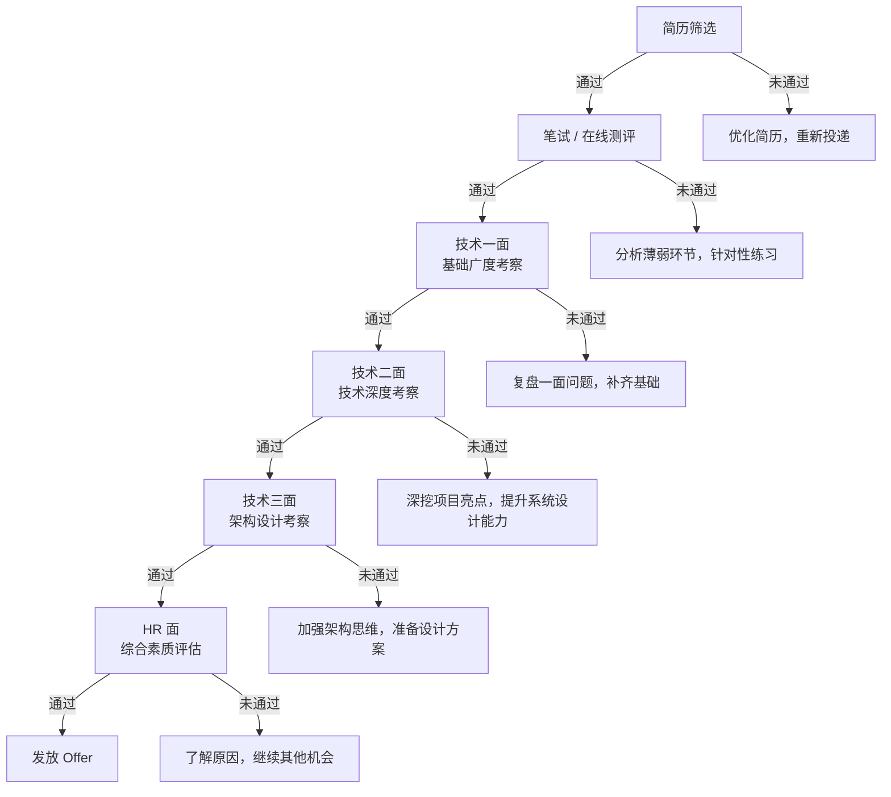

# 面试策略与准备

## 面试重点速览表

| 维度 | 关键要点 | 优先级 |
|------|---------|--------|
| 面试流程 | 简历筛选 → 笔试 → 技术一面 → 技术二面 → 技术三面 → HR 面 | -- |
| 一面侧重点 | 计算机基础广度（数据结构、网络、操作系统、语言基础） | 高 |
| 二面侧重点 | 技术深度（项目经验、源码理解、性能优化、疑难排障） | 高 |
| 三面侧重点 | 架构设计能力、技术视野、业务理解、团队协作 | 中高 |
| HR 面侧重点 | 综合素质、职业规划、薪资期望、文化匹配度 | 中 |
| 在职准备 | 每天 2-3 小时，周期 3-6 个月 | 视基础而定 |
| 全职准备 | 每天 6-8 小时，周期 1-3 个月 | 视基础而定 |
| 投递策略 | 小厂练手 → 中厂过渡 → 目标公司冲刺 | 高 |

## 问题背景

高级工程师面试与初中级面试存在本质区别。初中级面试侧重"会不会做"，而高级面试考察的是"为什么这么做"以及"还能怎么做更好"。面试官期望你不仅能写出正确的代码，还能从架构层面审视问题，从业务角度权衡取舍。

对于大多数在职工程师而言，面试准备是一场持久战。工作压力、家庭责任与面试准备三者之间的平衡，是最大的挑战。本文将系统性地拆解面试全流程，提供可落地的准备策略，帮助你有条不紊地推进面试计划。

::: tip
面试准备的核心不是"刷完所有题"，而是"让面试官觉得你能胜任这个级别的岗位"。一切准备活动都应该围绕这个目标展开。
:::

## 核心内容

### 一、面试全流程全景图

一次完整的面试通常包含以下环节，各公司的顺序和轮次会有微调，但整体框架一致：

::: info
不同公司对轮次的定义可能不同。例如字节跳动通常将"技术一面"称为"交叉面"，腾讯的三面往往是 GM/总监面，侧重业务理解和潜力评估。投递前建议了解目标公司的面试风格。
:::

### 二、各轮面试侧重点详解

| 轮次 | 核心考察点 | 典型问题形式 | 通过标准 |
|------|-----------|-------------|---------|
| 技术一面 | 计算机基础：数据结构与算法、计算机网络、操作系统、编程语言基础 | 手写算法题、基础知识问答、简单的场景分析 | 基础扎实，能独立完成中等难度算法题 |
| 技术二面 | 技术深度：项目经验深挖、源码级理解、性能优化、线上排障 | 项目难点追问、框架原理、场景设计题 | 对做过的项目有深度思考，能讲清 why 和 how |
| 技术三面 | 架构设计：系统设计、技术选型、业务理解、技术视野 | 设计一个秒杀系统 / 设计一个短链服务 | 有系统思维，能权衡利弊，方案有理有据 |
| HR 面 | 综合素质：沟通能力、职业规划、稳定性、文化匹配、薪资期望 | 行为面试题（STAR 法则）、价值观问题 | 态度积极，认知清晰，期望匹配 |

::: warning
二面是面试的分水岭。一面考的是"知识"，二面考的是"能力"。很多候选人能通过一面，但在二面中被追问项目细节时暴露出缺乏深度思考的问题。建议在准备阶段就把自己做过的项目做一次彻底的"灵魂拷问"。
:::

### 三、准备节奏规划

面试准备不是线性的，而是一个螺旋上升的过程。建议将准备周期划分为四个阶段：

| 阶段 | 名称 | 时长（在职） | 时长（全职） | 核心任务 |
|------|------|------------|------------|---------|
| 第一阶段 | 基础巩固 | 4-8 周 | 2-3 周 | 系统复习数据结构与算法，按模块刷题（数组、链表、树、图、DP），同步复习网络、OS、数据库基础 |
| 第二阶段 | 专项突破 | 4-6 周 | 2-3 周 | 针对目标公司高频题进行专项练习；深入准备 2-3 个核心项目（能用 STAR 法则讲清楚）；系统学习系统设计方法论 |
| 第三阶段 | 模拟冲刺 | 2-4 周 | 1-2 周 | 进行 5-10 次模拟面试（找朋友或付费平台）；限时刷题训练；整理"项目故事集"和"常见问题话术" |
| 第四阶段 | 面试实战 | 2-4 周 | 1-2 周 | 按投递策略逐级面试；每场面试后当天复盘并记录；动态调整准备重点 |

::: tip
不要在第一阶段停留太久。很多人在"基础巩固"阶段反复徘徊，总觉得"还没准备好"。实际上，面试本身就是最好的学习方式——通过真实面试的压力和反馈，你会获得远超独自刷题的学习效率。
:::

### 四、时间规划对比

不同基础和状态的候选人，准备周期差异很大。以下是一个参考框架：

| 基础水平 | 在职准备（2-3h/天） | 全职准备（6-8h/天） | 建议 |
|---------|-------------------|-------------------|------|
| 基础扎实（能独立完成中等算法题） | 2-3 个月 | 1-1.5 个月 | 重点放在系统设计和项目深度 |
| 基础一般（需复习才能做题） | 3-4 个月 | 1.5-2 个月 | 按四阶段严格执行，不跳步 |
| 基础薄弱（算法入门阶段） | 5-6 个月 | 2-3 个月 | 建议先在职打好基础再考虑全职 |

### 五、每日复习节奏模板

高效的时间利用比长时间的低效耗材重要得多。以下是根据不同场景设计的每日复习模板：

**通勤场景（30-60 分钟）**
- 用手机刷 1-2 道"每日一题"（推荐 LeetCode Hot 100）
- 听技术播客或系统设计案例分析（得到、极客时间等平台）
- 回顾前一天的错题笔记和面试复盘

**晚间场景（2-3 小时，在职主力时间段）**
- 前 30 分钟：复习当天通勤刷过的题，尝试不看答案重新实现
- 中间 60-90 分钟：按模块集中刷题（同一类型做 3-5 道，总结套路）
- 最后 30 分钟：基础知识回顾（网络、OS、数据库轮流来，每天一个主题）

**周末场景（4-6 小时/天）**
- 上午（2-3 小时）：模拟真实面试环境，限时完成 2-3 道中等难度题目
- 下午（2-3 小时）：系统设计专项学习 + 项目深度整理
- 晚上可选：观看技术分享视频，拓展技术视野

::: danger
常见误区：晚上熬夜刷题到凌晨，第二天工作状态极差。这不仅影响工作表现（可能导致绩效问题），还会让你陷入"越累越学不进去，越学不进去越焦虑"的恶性循环。保证充足睡眠是面试准备的基础保障。
:::

### 六、投递策略

很多候选人一上来就投递心仪公司，结果因为准备不足被拒，还留下了面试记录。正确的做法是逐级递进：

| 投递顺序 | 目标 | 目的 | 建议数量 | 预期通过率 |
|---------|------|------|---------|-----------|
| 第一梯队：练手 | 小型创业公司、外包公司 | 熟悉面试流程，克服紧张心理，暴露知识盲区 | 3-5 家 | 不关心结果 |
| 第二梯队：过渡 | 中型互联网公司（B 轮-C 轮） | 验证准备效果，积累面试经验，打磨项目表达 | 3-5 家 | 争取拿到 Offer |
| 第三梯队：冲刺 | 目标大厂（BAT、TMD、字节等） | 以最佳状态迎战，争取拿到心仪 Offer | 5-8 家 | 全力以赴 |

::: info
选择练手公司时，优先选择面试流程规范、反馈较快的小公司。不建议选择那些面试流程过于随意（一轮就发 Offer）的公司，这类面试对能力的提升价值有限。
:::

准备过程中需要关注的核心指标：
- **算法题量**：累计刷题 200+ 道，其中中等难度占比 60% 以上
- **系统设计**：能独立完成 5 类常见系统设计题（短链、秒杀、IM、Feed 流、分布式 ID 生成器）
- **项目表达**：3 个核心项目，每个都能用 STAR 法则在 5 分钟内讲清楚
- **模拟面试**：至少完成 5 次完整模拟面试，并针对反馈进行了改进

## 常见误区

### 误区一：只看不练，眼高手低

很多人刷题时"看题-看答案-以为自己会了"，这是一种危险的自欺欺人。真正检验的方法是：隔一天不看答案重新实现，如果写不出来，说明你只是"见过"而非"掌握"。

### 误区二：忽视软技能准备

高级工程师面试中，技术能力只占 60%-70%，剩余的 30%-40% 在于沟通表达、逻辑思考、团队协作等软技能。很多技术不错的候选人败在了"说不清楚"上。

### 误区三：投递节奏混乱

同时投递 20 家公司，结果一周内收到大量面试邀请，疲于应付，每场面试都无法充分准备。正确的做法是分批次投递，每周不超过 3-4 场面试，确保每场都有充足的复盘时间。

### 误区四：把薪资谈判放在技术面提及

在技术面阶段主动询问薪资或福利，会给面试官留下"更关心待遇而非技术"的印象。薪资谈判的最佳时机是拿到 Offer 后、HR 沟通入职事宜时。

::: warning
面试记录会在公司系统内保留 6-12 个月不等。如果第一次面试表现很差，短期内再次投递通过的概率极低——面试官会看到你上次的面试评语。所以务必准备充分后再投递目标公司。
:::

## 面试高频问题汇总

### Q1：在职准备如何安排时间？

**参考答案：**

在职准备最大的挑战是时间碎片化和精力管理。建议采取以下策略：

1. **固定节奏，养成习惯**：每天固定一个时间段（例如 20:00-22:30）为"面试准备时间"，雷打不动。习惯的力量远大于意志力。

2. **利用碎片时间**：通勤时间用来看题或听技术内容，午休时间花 15 分钟回顾一道错题。碎片时间的累积效应非常可观。

3. **周末集中攻坚**：周末的大块时间用于系统设计学习和模拟面试，这两件事对专注度要求高，不适合碎片化处理。

4. **降低社交消耗**：提前告知朋友和家人，接下来 N 个月会减少社交活动。获得家人的理解和支持至关重要。

5. **以考代练**：每月安排 1-2 次真实面试（练手公司），用面试压力倒逼学习效率。

### Q2：一面、二面、三面分别考察什么？如何针对性准备？

**参考答案：**

一面考察**基础广度**，核心是算法题能否做出来、基础知识能否答上来。准备策略：按模块系统刷题 + 构建知识体系脑图。不要把时间花在冷门知识点上，优先保证高频考点（链表、树、动态规划、TCP/IP、进程线程、锁机制）没有死角。

二面考察**技术深度**，核心是你的项目经得起追问吗？准备策略：挑选 2-3 个最有代表性的项目，准备以下问题的答案——项目解决了什么业务痛点？你做了哪些技术决策？踩过哪些坑？如果重新做会如何改进？项目的技术指标如何量化？

三面考察**架构视野**，核心是你有没有"系统思维"。准备策略：系统学习分布式系统设计方法论（CAP 理论、一致性模型、容量规划、高可用设计），准备 3-5 个经典系统设计题的方案，学会画架构图并解释设计取舍。

### Q3：面试前一周应该做什么？

**参考答案：**

面试前一周的关键词是"聚焦"和"调状态"，而不是"补漏洞"。

1. **前两天**：做 2-3 次限时模拟面试，检验准备成果，找出最后需要修补的薄弱点。
2. **中间三天**：重点复习目标公司的高频题和面经，针对性地准备 1-2 个可能会被问到的项目故事。
3. **最后两天**：调整作息，保证充足睡眠；不再做新题，只复习错题和笔记；准备面试当天的时间安排（提前测试设备、确认面试链接或地址）。
4. **面试前一天**：准备好自我介绍（1 分钟精简版和 3 分钟详细版），做一次轻松的复习回顾，晚上早点休息。

::: tip
面试前一天不建议做难题，如果做不出来会打击信心。此时信心的价值远大于知识增量。
:::

### Q4：技术面没过，要不要继续投同一家公司？

**参考答案：**

这取决于被拒的轮次和时间间隔：

- **一面被拒**：通常是因为基础不扎实或算法题做不出来。建议至少间隔 3-6 个月再投，期间重点补齐基础短板。
- **二面被拒**：通常是因为项目深度不够或回答缺乏结构性。建议间隔 3-6 个月，用这段时间在项目中做出更有深度的成果，以便下次面试时有新的亮点可讲。
- **三面被拒**：可能是综合能力未达预期或 HC 已满。如果感觉面试体验不错（面试官给了积极反馈），可以询问 HR 是否有补录机会或是否可以转推其他部门。
- **HR 面被拒**：通常是因为薪资期望不匹配或背景调查问题，与技术能力无关。可以坦诚沟通，了解具体原因。

::: warning
大多数大厂有 6 个月到 1 年的"冷冻期"，即被拒后在此期间内不能再投同一岗位。但不同部门之间的冷冻期可能独立计算，可以向 HR 确认政策细节。
:::

### Q5：如何判断自己准备是否充分？

**参考答案：**

准备是否充分，不能凭"感觉"，要用客观标准衡量：

1. **算法能力自检**：随机抽取 LeetCode Hot 100 中的 10 道中等难度题，能否在 30 分钟内独立完成 8 道以上？如果能，算法层面基本达标。

2. **项目表达能力自检**：找一个非技术朋友，用他能听懂的语言讲述你的核心项目（5 分钟内）。如果他能理解你做了什么、为什么做、效果如何，说明你的表达能力达标。

3. **系统设计能力自检**：能否在 30-40 分钟内，在白板上画出"设计一个短链系统"或"设计一个秒杀系统"的完整架构图，并讲清楚关键的技术选型理由和容量估算过程？

4. **模拟面试自检**：至少完成 3-5 次严格的模拟面试（最好是付费平台的真实面试官模拟），并获得"达到目标级别"的反馈。

5. **心态自检**：你对面试的态度，应该是"去验证准备成果"而非"去碰运气"。如果你觉得"还差一点就准备好了"，那就真的差不多了——因为永远不会有"完全准备好"的那一刻，适度的不舒适感是正常的。

::: tip
面试准备的"80/20 法则"：用 80% 的时间解决 20% 的关键问题（算法能力、核心项目深度、系统设计方法论），剩下的 20% 时间覆盖 80% 的广度知识（冷门知识点、边缘场景）。不要在追求完美中无限延迟面试计划。
:::