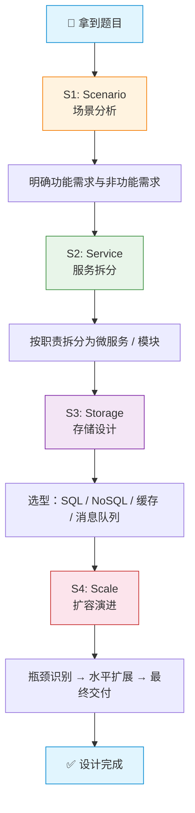

# 系统设计面试技巧

> 创建日期：2026-06-06

## ⭐ 面试重点速览

| 考察点 | 重要程度 | 考察频率 | 掌握目标 |
|--------|----------|----------|----------|
| 4S 框架（Scenario → Service → Storage → Scale） | ⭐⭐⭐ | 高频 | 源码级 |
| QPS / DAU 估算与需求澄清 | ⭐⭐⭐ | 高频 | 熟练运用 |
| 架构图绘制规范 | ⭐⭐⭐ | 高频 | 即兴手绘 |
| 瓶颈识别与扩容方案 | ⭐⭐⭐ | 高频 | 融会贯通 |
| 数据一致性方案 | ⭐⭐☆ | 中频 | 原理清晰 |
| 答题时间分配与节奏控制 | ⭐⭐☆ | 中频 | 内化于心 |

## 一、问题背景

系统设计面试是高级工程师面试中权重最高的环节之一，通常在 30~45 分钟内要求候选人从零到一完成一个分布式系统的架构设计。常见的题目包括"设计一个短链接服务""设计 Twitter 信息流""设计一个实时聊天系统""设计秒杀系统"等。

::: info 面试官的真实意图
系统设计面试不是为了找到一个"标准答案"，而是考察候选人的**结构化思维**、**技术广度与深度**、**沟通协作能力**以及**在模糊需求下的决策力**。
:::

对于高级工程师而言，仅仅画出一个功能够用的架构是不够的。面试官期望的是：能用清晰的语言描述需求、能识别系统瓶颈、能给出量化的扩容方案、能对 trade-off 做出有理有据的判断。下面将从框架方法论、需求澄清话术、架构图规范、瓶颈识别和答题节奏五个维度，系统性地拆解这套"组合拳"。

## 二、核心内容

### 2.1 4S 框架：系统设计的主心骨

4S 框架是系统设计面试中最为经典且通用的方法论，它将设计过程拆分为四个递进阶段：



**四个阶段的含义与要点：**

| 阶段 | 核心问题 | 输出物 | 时间建议 |
|------|----------|--------|----------|
| S1 - Scenario | 系统给谁用？QPS 多少？读多还是写多？ | 核心功能列表 + 量化指标 | 5 min |
| S2 - Service | 如何拆分子系统？服务间如何通信？ | 服务拓扑图 | 8~10 min |
| S3 - Storage | 数据怎么存？用什么数据库？ | 表设计 + 存储选型理由 | 8~10 min |
| S4 - Scale | 怎么扛住 10x 流量？瓶颈在哪？ | 扩容方案 + 容灾设计 | 5~8 min |

::: tip 面试节奏提示
4S 框架不是线性执行的死板流程。在实际面试中，你需要在 **S1-S2-S3-S4 之间来回跳转**，随着面试官的深挖不断补充细节。框架的作用是**保证你不会遗漏关键维度**，而不是让你僵硬地背诵步骤。
:::

### 2.2 需求澄清话术：把模糊题目变成可量化的目标

许多候选人拿到题目后急于画架构，这是最大的陷阱。**需求澄清是拉开差距的第一步**。

#### QPS / DAU 估算公式

假设题目是"设计一个短链接服务"，你应该立即抛出以下估算：

```
DAU（日活跃用户）          = 1 亿
每人每天创建短链接数       = 0.1 条（低频操作）
日写入量                  = 1 亿 × 0.1 = 1000 万条
平均 QPS（写入）           = 1000 万 / 86400 ≈ 116 QPS
峰值 QPS（写入，取 5 倍）  ≈ 580 QPS

每次点击都会触发读操作：
每人每天点击短链接数       = 2 次
日读取量                  = 1 亿 × 2 = 2 亿次
平均 QPS（读取）           = 2 亿 / 86400 ≈ 2314 QPS
峰值 QPS（读取，取 5 倍）  ≈ 11570 QPS
```

::: warning 不要漏掉读写比
大多数互联网业务都是**读多写少**，如果你没有主动区分读写 QPS，面试官会认为你缺乏实际经验。典型读写比（如微博信息流）可以达到 **100:1 甚至 1000:1**。
:::

#### 标准话术模板

| 澄清维度 | 追问话术 | 示例答案 |
|----------|----------|----------|
| 用户规模 | "请问目标 DAU 是多少？需要考虑全球部署吗？" | DAU 1 亿，国内为主 |
| 数据量级 | "每条数据大概多大？需要保留多久？" | 短链接映射 < 1KB，永久保留 |
| 一致性要求 | "对数据一致性的容忍度如何？允许最终一致吗？" | 写入后可容忍 1s 延迟 |
| 可用性目标 | "SLA 目标是多少个 9？" | 99.99%（四个9） |
| 延迟约束 | "核心接口的 P99 延迟要求？" | P99 < 50ms |

### 2.3 架构图绘制规范

架构图是面试过程的"视觉锚点"，一张好的架构图可以让面试官在 10 秒内理解你的整体设计思路。

#### 组件规范

| 图元 | 含义 | 使用场景 |
|------|------|----------|
| 矩形框 | 服务/模块 | 表示一个独立部署单元 |
| 圆柱体 | 数据库 | 表示持久化存储 |
| 虚线框 | 逻辑分组 | 将多个服务圈为"业务域" |
| 实线箭头 | 同步调用（RPC/HTTP） | 请求-响应模式 |
| 虚线箭头 | 异步消息（MQ） | 事件驱动/解耦 |
| 双向箭头 | 双向数据流 | WebSocket / gRPC Stream |

#### 绘制顺序

```
客户端 → DNS/CDN → 网关/负载均衡 → 业务服务层 → 数据层
                                                    ├── 关系型数据库（MySQL）
                                                    ├── 缓存层（Redis）
                                                    ├── 消息队列（Kafka）
                                                    └── 对象存储（S3/OSS）
```

::: danger 架构图常见硬伤
1. **缺少反向箭头**：只画了请求流，没有考虑响应/回调/失败重试的数据流方向
2. **没有标注协议**：箭头旁应注明 HTTP/gRPC/Kafka 等协议，体现技术选型意识
3. **把 CDN 和 DNS 画在服务器端**：CDN 应画在客户端与服务器之间
4. **所有服务用同一种线型**：同步/异步调用画法不同，这是区分候选人水平的重要细节
:::

### 2.4 常见瓶颈识别与应对

系统设计面试的"深度"主要体现在瓶颈识别环节。以下是四类最常见瓶颈：

#### 瓶颈分类表

| 瓶颈类型 | 表现形式 | 识别信号 | 应对方案 | 关联模块 |
|----------|----------|----------|----------|----------|
| 单点故障 | 某个节点挂掉导致全链路不可用 | 没有副本、没有主从切换 | 多副本部署 + 健康检查 + 自动切换 | [高可用架构](/high-concurrency/high-availability) |
| 热点数据 | 少数 key 承受了绝大数请求 | Redis 单分片 CPU 打满 | 本地缓存 + 多级缓存 + 读写分离 | [缓存策略](/high-concurrency/cache-strategy) |
| 数据一致性 | 缓存与 DB 数据不一致 | 更新后短暂读到旧数据 | Cache Aside / Write Behind / CDC | [数据一致性](/high-concurrency/data-consistency) |
| 流量倾斜 | 单个服务节点负载远超其他 | 负载不均、哈希倾斜 | 一致性哈希 + 虚拟节点 | [负载均衡](/high-concurrency/load-balancing) |

::: info 深度展示技巧
当面试官问"你这个方案有什么问题"时，**主动**指出你设计中可能存在的瓶颈，并给出应对方案，而不是等面试官追问。例如："我这里用了一致性哈希来做分片，但如果某个节点宕机，数据迁移会有一段时间不可用，所以我增加了一致性哈希 + 虚拟节点 + 主从备份的组合方案来缓解这个问题。"
:::

### 2.5 答题时间分配

30 分钟的系统设计面试，建议如下分配：

| 阶段 | 时长 | 核心动作 | 产出 |
|------|------|----------|------|
| 需求澄清 | 5 min | 主动提问、量化估算 QPS/存储量 | 明确的功能边界与数字指标 |
| 架构设计 | 10 min | 画架构图 + 服务拆分 + 数据流 | 一张完整的架构图 + 存储选型 |
| 深挖讨论 | 10 min | 瓶颈识别、容灾设计、扩容方案 | 对 2~3 个深挖点的详细回答 |
| 总结收尾 | 5 min | 自评不足、强调 trade-off、可改进方向 | 展现复盘能力和全局视野 |

::: tip 深挖阶段的主动权
不要被动等待面试官提问。在架构图画完后，主动说："这个设计有三个地方我特别想展开聊聊——第一是缓存穿透的防护，第二是消息队列的幂等性保证，第三是数据库分库分表后的跨分片查询方案。您想先听哪一个？"这种表达方式展现了你对系统的深度理解和节奏掌控力。
:::

## 三、代码示例 / 实战案例

### 3.1 案例：短链接服务的 QPS 估算器（Python 伪代码）

```python
# -*- coding: utf-8 -*-
"""
短链接系统 QPS 估算工具类
面试中可快速在白板上推导出关键数字
"""

class QPSEstimator:
    """系统容量估算器 —— 面试开场 5 分钟内必须完成的核心计算"""

    def __init__(self, dau: int, peak_factor: float = 5.0):
        """
        :param dau: 日活跃用户数
        :param peak_factor: 峰值系数，一般取 3~10，业界常用 5
        """
        self.dau = dau
        self.peak_factor = peak_factor
        self.seconds_per_day = 86400  # 一天的秒数

    def estimate_write_qps(self, writes_per_user_per_day: float) -> dict:
        """估算写入 QPS"""
        total_writes = self.dau * writes_per_user_per_day
        avg_qps = total_writes / self.seconds_per_day
        peak_qps = avg_qps * self.peak_factor
        return {
            "日均写入量": total_writes,
            "平均写入 QPS": round(avg_qps, 2),
            "峰值写入 QPS": round(peak_qps, 2),
        }

    def estimate_read_qps(self, reads_per_user_per_day: float) -> dict:
        """估算读取 QPS"""
        total_reads = self.dau * reads_per_user_per_day
        avg_qps = total_reads / self.seconds_per_day
        peak_qps = avg_qps * self.peak_factor
        return {
            "日均读取量": total_reads,
            "平均读取 QPS": round(avg_qps, 2),
            "峰值读取 QPS": round(peak_qps, 2),
        }

    def estimate_storage(self, record_size_kb: float,
                         retention_years: int) -> dict:
        """估算存储容量需求"""
        # 假设每天写入量来自写入估算
        daily_records = self.dau * 0.1  # 短链接场景：每人 0.1 条
        total_records = daily_records * 365 * retention_years
        total_size_tb = (total_records * record_size_kb) / (1024 ** 3)
        return {
            "总记录数": int(total_records),
            "总存储量(TB)": round(total_size_tb, 2),
        }


# ---- 面试时的使用示例 ----
estimator = QPSEstimator(dau=100_000_000, peak_factor=5.0)

write_result = estimator.estimate_write_qps(
    writes_per_user_per_day=0.1
)
read_result = estimator.estimate_read_qps(
    reads_per_user_per_day=2.0
)
storage_result = estimator.estimate_storage(
    record_size_kb=1.0, retention_years=5
)

# 面试时直接报出以下结果：
# 峰值写入 QPS: 578.7
# 峰值读取 QPS: 11574.07
# 5 年总存储量: ~1.67 TB
```

### 3.2 案例：短链接服务的架构图（文字描述版）

在实际面试的白板或在线画板中，架构图应分层绘制：

```
┌─────────────────────────────────────────────────┐
│                    客户端                        │
│         (Web / App / 第三方 API)                 │
└──────────────┬──────────────────────────────────┘
               │ HTTPS
               ▼
┌─────────────────────────────────────────────────┐
│               CDN + DNS 解析                     │
│         (CloudFront / 阿里云 CDN)                │
└──────────────┬──────────────────────────────────┘
               │
               ▼
┌─────────────────────────────────────────────────┐
│           负载均衡 (Nginx / ALB)                  │
│         限流: 令牌桶，单 IP 100 QPS              │
└──────┬───────────────────────┬──────────────────┘
       │                       │
       ▼ (同步)                ▼ (异步)
┌──────────────┐      ┌──────────────────┐
│  短链接 API   │      │  异步统计服务     │
│  (生成/跳转)  │─────▶│  (点击量聚合)     │
└──────┬───────┘      └────────┬─────────┘
       │                       │
       ▼                       ▼
┌──────────────┐      ┌──────────────────┐
│  Redis 缓存   │      │  Kafka 消息队列   │
│  (热点 URL)   │      │  (点击事件)       │
└──────┬───────┘      └────────┬─────────┘
       │                       │
       ▼                       ▼
┌──────────────────────────────────────────────┐
│              MySQL (分库分表)                  │
│  short_url → long_url 映射表                  │
│  分片键：short_url 哈希取模 (64 分片)          │
└──────────────────────────────────────────────┘
```

## 四、常见误区与坑点

### 4.1 六大典型误区

| 误区 | 表现 | 后果 | 正确做法 |
|------|------|------|----------|
| **过早优化** | 一上来就谈 CQRS、事件溯源 | 架构过度复杂，时间耗尽 | 先做最简单的可行方案，再按需优化 |
| **忽略边界条件** | 只设计了正常流程 | 面试官追问失败场景时卡壳 | 每个环节问自己"如果这里挂了会怎样" |
| **数字凭空捏造** | QPS 估算没有推导过程 | 面试官质疑时无法自圆其说 | 每一步估算都说出假设和公式 |
| **只画图不解释** | 埋头画了 10 分钟不说话 | 面试官不知道你的思考过程 | 边画边讲，把思维过程"出声化" |
| **拒绝承认短板** | 被问到不熟悉的领域时硬撑 | 越描越黑，暴露更深的问题 | 诚实说"这方面经验不足，但我可以推测……" |
| **没有 trade-off 意识** | 方案只有优点没有缺点 | 显得思考不全面 | 每个决策都要说明"选了 A 放弃了 B 因为……" |

### 4.2 面试官说"就这样吗"——如何应对

::: danger 危险信号识别
当面试官说出"就这样吗？"通常有两种含义：一是你的设计有**明显遗漏**（如没考虑容灾、没提缓存策略、没估算存储成本）；二是他在给你一个**展示深度的机会**，希望你主动进入深挖阶段。
:::

**应对策略三步走：**

1. **快速自检**（3 秒）：在脑海中过一遍 4S 框架，是否四个维度都覆盖了？
2. **主动补充**：用"让我再补充一点……"开头，选择你最擅长的方向深入，如"我刚才讲了正常流程，接下来我想补充一下降级和容灾方案——如果 Redis 全部宕机，短链接服务如何通过本地缓存 + 数据库直读保证核心链路可用。"
3. **反问确认**：补充完后反问面试官"您觉得这个方向够深入吗？还是您更关注其他方面？"——这既展现了沟通能力，也帮你校准接下来的方向。

## 五、面试高频问题汇总

### Q1：拿到系统设计题目后，第一步应该做什么？

**参考答案：**

第一步永远是**澄清需求**，而不是画架构图。具体动作包括：

1. **功能需求确认**：列出核心功能（如短链接服务：创建短链、跳转长链、过期失效）。区分 P0（必须做）和 P1（锦上添花），这能为后续服务拆分提供依据。
2. **非功能需求量化**：主动估算 DAU、QPS、存储量、延迟要求。例如"假设 DAU 为 5000 万，每人每天创建 0.1 条短链接，则日写入 500 万条，对应写入 QPS 约 58，读 QPS 约 1160……"这组数字是后续所有技术选型的"锚点"。
3. **约束条件确认**：是否需要考虑全球部署？数据是否涉及合规问题？团队规模多大（影响微服务粒度）？

**面试中常见的错误是**：面试官说完题目后候选人沉默 10 秒然后直接开始画图。正确的打开方式是立即用提问推动对话，例如"在开始设计之前，我想先确认几个关键参数——这个系统预期的 DAU 量级大概是多少？对可用性有 99.99% 的要求吗？"

---

### Q2：如何估算一个陌生系统的 QPS？

**参考答案：**

QPS 估算遵循**分步推导、层层递进**的原则，核心公式如下：

```
峰值 QPS = (DAU × 每人日均操作次数) / 86400 × 峰值系数
```

具体步骤：

1. **确定 DAU**：如果没有给具体数字，按业界常见量级假设（小厂 100 万、中厂 1000 万、大厂 1 亿）。
2. **估算人均操作频率**：区分读与写。电商浏览 10 次 / 人 / 天，下单 0.05 次 / 人 / 天。
3. **带入公式计算平均 QPS**：`avg_qps = total_ops / 86400`。
4. **乘以峰值系数**：互联网流量有明显的波峰波谷，通常取 3~10 倍，保守估计取 5 倍。
5. **区分读写**：大多数业务读写比悬殊，要分别估算。

以设计微博信息流为例：

```
DAU = 5000 万
每人每天刷信息流 20 次 → 日读取 = 10 亿次
平均读 QPS = 10 亿 / 86400 ≈ 115,740 → 峰值 ≈ 578,700 QPS
每人每天发微博 0.02 条 → 日写入 = 100 万条
平均写 QPS = 100 万 / 86400 ≈ 11.6 → 峰值 ≈ 58 QPS
```

从数字可以看出：微博信息流是典型的**读多写少**场景，所以架构的核心在于**如何高效支撑近 60 万的读 QPS**——显然需要多级缓存（CDN + Redis + 本地缓存）和 feed 预计算（推拉结合模式）。

---

### Q3：架构图需要画到什么程度？

**参考答案：**

架构图不是越详细越好，不同的面试阶段有不同的粒度要求：

| 阶段 | 粒度 | 包含内容 |
|------|------|----------|
| 初始草图（前 10 分钟） | 粗粒度 | 客户端 → 网关 → 服务层 → 数据层，每层 1~3 个核心组件 |
| 深挖阶段（中 10 分钟） | 中粒度 | 在某个重点环节展开细节（如缓存层的多级结构） |
| 面试官要求 | 按需细化 | 聚焦面试官感兴趣的方向，不要全图细化 |

**必须画的要素：**

1. **所有对外接口**：客户端到系统的入口（HTTP API、WebSocket、gRPC 等）
2. **数据流向**：用实线箭头表示同步调用，虚线箭头表示异步消息
3. **存储层**：每个数据存储旁边标注技术选型（MySQL / Redis / Kafka / ES）
4. **关键数字**：在箭头旁标注 QPS 量级、在存储旁标注容量，例如在 Redis 旁边写"热点缓存，命中率 > 95%"

**可以延迟画的部分：** 监控告警、CI/CD 流水线、日志采集、配置中心——这些是运维层面的内容，除非面试官主动提问，否则不要占用宝贵的设计时间。

---

### Q4：面试官说"就这样吗？"时如何应对？

**参考答案：**

首先理解面试官这句话的含义——它不是否定，而是一个**信号**，通常意味着以下三种情况之一：

**情况一：有明显遗漏（概率 40%）**
最常见的情况是你漏掉了某个关键维度。此时快速按 4S 框架做一遍自检：
- Scenario：非功能需求有没有量化？SLA 有没有提？
- Service：服务间通信协议有没有标注？失败重试机制考虑了没有？
- Storage：缓存策略是什么？数据一致性如何保证？
- Scale：扩容方案？监控和降级策略？数据迁移方案？

**情况二：期待更深度的讨论（概率 40%）**
你的设计框架没问题，但面试官想看到你对某个方向的理解深度。此时应该主动选择 2~3 个你最擅长的深挖方向展开，例如：

"我刚才讲的是基础架构，接下来我想补充三个容易被忽略但非常关键的点——第一是缓存穿透的布隆过滤器方案，第二是分布式 ID 生成的雪花算法与号段模式的对比，第三是消息队列的消费幂等性如何保证。您想先听哪一个？"

**情况三：纯粹的压力测试（概率 20%）**
面试官说"就这样吗"然后沉默，观察你在压力下的反应。此时保持镇定，微笑着说"这是我现阶段能想到的核心设计，当然肯定有可以深化的地方……"然后引用一个你确实不熟悉但愿意学习的方向作为收尾。

::: tip 黄金应对模板
"这个设计在[XX 方向]上我还可以进一步优化，比如[具体方案]。不过我认为当前方案的[核心 trade-off]是合理的，因为[理由]。您看这部分的深度够吗？还是您更关注其他方面？"
:::

---

### Q5：设计题没有标准答案，如何展示深度？

**参考答案：**

系统设计面试的魅力就在于**没有唯一正确答案**——同样是设计短链接服务，用 Redis + MySQL 是一种方案，用分布式 KV 存储是另一种方案，两者可能都合理。展示深度的关键在于以下三个维度：

**1. Trade-off 分析（最重要）**

每个技术决策都要能说出"为什么选 A 而不是 B"。示例话术：

> "我选择 MySQL 分库分表而非 MongoDB，原因是短链接的查询模式是精确 key 查询而非范围查询或文本搜索，MySQL 的分片路由性能可以满足需求，且团队对 MySQL 运维经验更丰富。但如果未来需要多维度搜索能力（如按创建时间、创建人搜索短链接），我会引入 ElasticSearch 做辅助索引。"

**2. 量化思维**

口头说的所有优化都要落到数字上。不是"加缓存能快很多"而是"加 Redis 缓存后，命中率预计 95%，P99 延迟从 200ms 降到 5ms，QPS 承载能力提升 20 倍"。

**3. 演进路径**

没有系统是一步到位的。展示你对系统演进的理解：

> "第一期我们做最小可行产品——单库单表 + Redis 缓存 + 简单限流，支撑 1000 QPS。第二期在 QPS 达到 5000 后引入分库分表 + 读写分离。第三期当 QPS 突破 5 万时，引入多级缓存（本地 Caffeine + Redis 集群）+ 异地多活。"

这三个层次——**trade-off 分析、量化思维、演进路径**——是高工面试中拉开差距的核心武器。

---

### Q6：系统设计面试中常见的"坑"有哪些？如何避开？

**参考答案：**

除了第四节提到的六大误区外，还有以下三个容易被忽视的陷阱：

**陷阱一：沉迷于细节而忽略全局**

表现：花了 15 分钟讨论数据库索引优化，却没有画完整体架构图。应对：先完成主干（端到端数据流），再在深挖阶段聚焦细节。可以用一句话把面试官拉回来——"关于索引优化我可以稍后详细展开，我们先确保核心链路跑通，您看可以吗？"

**陷阱二：使用自己不熟悉的术语**

表现：为了显得"高大上"而提到一些自己并不精通的方案（如 Raft 共识算法、CQRS 模式），结果被面试官深挖时露馅。应对：只提你真正理解的技术。如果面试官提到了你不熟悉的领域，诚实地表达"这部分我了解得不够深入，我的理解是……"比假装知道要好得多。

**陷阱三：忽略非功能性需求的量化**

表现：讲了很多功能设计，但被问到"你这个系统能扛多大 QPS"时无法回答。应对：在需求澄清阶段就完成数字推导，并把核心数字标注在架构图的对应位置上，如负载均衡器旁标注"峰值 QPS 10000"，Redis 旁标注"命中率 95%+，P99 < 1ms"。

::: warning 面试红线
不要在系统设计面试中说"这个很简单，直接加机器就行了"。水平扩展是手段不是目的，你需要说明**怎么加、加在哪里、加了之后数据一致性怎么保证、有没有上限**。
:::

## 六、延伸阅读与联动

系统设计面试与以下模块高度相关，建议在准备时交叉学习：

- [高并发架构](/high-concurrency/) —— 核心模块，涵盖限流、降级、熔断等应对大流量的策略
- [缓存策略](/high-concurrency/cache-strategy) —— 缓存穿透、缓存雪崩、多级缓存的完整方案
- [数据一致性](/high-concurrency/data-consistency) —— CAP 理论在实战中的落地方案
- [负载均衡](/high-concurrency/load-balancing) —— 一致性哈希、加权轮询、最少连接数等策略对比
- [高可用架构](/high-concurrency/high-availability) —— 多活、主从切换、故障自动恢复
- [分布式 ID 生成](/high-concurrency/distributed-id) —— 雪花算法、号段模式、Leaf 方案对比
- [消息队列](/high-concurrency/message-queue) —— Kafka / RocketMQ 在异步解耦中的实战应用