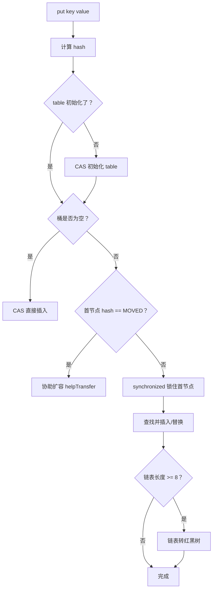

# ConcurrentHashMap

## ⭐ 面试重点速览

| 知识模块 | 重点内容 | 面试频率 |
|----------|----------|----------|
| JDK 1.7 分段锁 | Segment + HashEntry 原理 | 极高 |
| JDK 1.8 改进 | synchronized + CAS + Node | 极高 |
| size 计算 | 1.7 分段累加 vs 1.8 baseCount+CounterCells | 高 |
| put 流程 | CAS 插入 + synchronized 加锁 | 极高 |
| 与 Hashtable 对比 | 锁粒度、性能差异 | 高 |

---

## ⭐ 一、JDK 1.7 分段锁

### 1.1 结构

```java
// JDK 1.7 ConcurrentHashMap 核心结构
final Segment<K,V>[] segments;  // 分段数组

static final class Segment<K,V> extends ReentrantLock {
    transient volatile HashEntry<K,V>[] table;  // 每个 Segment 内部是一个 HashMap
}

static final class HashEntry<K,V> {
    final int hash;
    final K key;
    volatile V value;
    volatile HashEntry<K,V> next;
}
```

```
ConcurrentHashMap 结构（1.7）：
  segments[0] → Segment → HashEntry[] → HashEntry → HashEntry → ...
  segments[1] → Segment → HashEntry[] → HashEntry → ...
  ...
  segments[15] → Segment → HashEntry[] → HashEntry → HashEntry → ...
```

### 1.2 分段锁原理

- 默认 16 个 Segment（可通过参数指定，初始化后不可变）
- 每个 Segment 继承 `ReentrantLock`，独立的锁
- put 操作时只锁住对应的 Segment，其他 Segment 不受影响
- 并发度 = Segment 数量（默认支持 16 个线程同时写）

### 1.3 缺点

| 缺点 | 说明 |
|------|------|
| 锁粒度相对较粗 | 每个 Segment 内的锁是互斥的，并发度受 Segment 数量限制 |
| 遍历成本高 | size() 需要锁住所有 Segment 然后累加 |
| 初始化后不可扩容 | Segment 数量在构造函数中确定，不能动态调整 |

---

## ⭐ 二、JDK 1.8 改进

### 2.1 结构

```java
// JDK 1.8 ConcurrentHashMap 核心结构（简化）
transient volatile Node<K,V>[] table;  // 直接用 Node 数组，和 HashMap 类似

static class Node<K,V> {
    final int hash;
    final K key;
    volatile V val;
    volatile Node<K,V> next;
}
```

JDK 1.8 完全**放弃了 Segment 结构**，改为与 HashMap 类似的 **Node 数组 + 链表 + 红黑树**。

### 2.2 线程安全方式：synchronized + CAS

| 之前（1.7） | 之后（1.8） |
|------------|------------|
| Segment + ReentrantLock 分段锁 | **CAS + synchronized** |
| 锁 Segment | 锁链表头节点（锁粒度更细） |
| 16 个 Segment 固定 | 每个桶独立，锁粒度随扩容变细 |

```java
/** ⭐ JDK 1.8 put() 核心逻辑（简化） */
final V putVal(K key, V value, boolean onlyIfAbsent) {
    // 1. 计算 hash
    int hash = spread(key.hashCode());
    int binCount = 0;

    for (Node<K,V>[] tab = table;;) {
        // 2. 如果桶为空：CAS 直接插入（无锁，高效！）
        if (tab == null || (n = tab.length) == 0)
            tab = initTable();
        else if ((f = tabAt(tab, i = (n - 1) & hash)) == null) {
            if (casTabAt(tab, i, null, new Node<K,V>(hash, key, value, null)))
                break;  // ⭐ CAS 成功，不加锁完成插入
        }
        // 3. 如果正在扩容，协助扩容
        else if ((fh = f.hash) == MOVED)
            tab = helpTransfer(tab, f);
        else {
            // 4. 桶不为空：synchronized 锁住桶首节点
            synchronized (f) {
                if (tabAt(tab, i) == f) {
                    // 遍历链表或红黑树，查找并插入/替换
                }
            }
        }
    }
}
```

::: tip 为什么 1.8 用 synchronized 而不是 ReentrantLock？
这是因为 JDK 6 对 `synchronized` 做了大量优化（偏向锁、轻量级锁、自旋锁），在低到中度竞争场景下，`synchronized` 的性能已经接近甚至超过 `ReentrantLock`。而且 `synchronized` 是 JVM 内置的，维护成本更低。
:::

---

## ⭐ 三、size 计算

### 3.1 JDK 1.7 方式

```java
// 1.7：需要加锁遍历所有 Segment 累加计数
// 先尝试不加锁统计两次，如果两次结果一致就返回
// 不一致时加锁统计（代价大）
```

### 3.2 ⭐ JDK 1.8 方式：分段计数

```java
// 1.8：使用 baseCount + CounterCells 分段计数
private transient volatile long baseCount;
private transient volatile CounterCell[] counterCells;  // 计数器数组

// CounterCell 内部有一个 volatile long value
static final class CounterCell {
    volatile long value;
}
```

**原理**：当多线程并发修改 size 时：
- 先尝试 CAS 更新 `baseCount`
- CAS 失败 → 线程分配到自己的 `CounterCell` 中更新（用 `@sun.misc.Contended` 防止伪共享）
- `size()` = `baseCount` + 所有 `CounterCell.value` 之和

::: tip 这样做的优势
- 避免了重量级锁
- 多个线程可以并发更新 size（每个线程操作自己的 CounterCell）
- 类似 `LongAdder` 的分段计数思想
:::

---

## 四、put 流程详解



---

## 五、ConcurrentHashMap vs HashMap vs Hashtable

| 维度 | HashMap | Hashtable | ConcurrentHashMap |
|------|---------|-----------|-------------------|
| 线程安全 | ❌ 不安全 | ✅ 安全（synchronized 方法） | ✅ 安全（CAS + synchronized） |
| 锁粒度 | N/A | 锁整个表（this） | 1.7 分段锁 / 1.8 锁桶首节点 |
| Null 键/值 | ✅ 允许 null | ❌ 不允许 null | ❌ 不允许 null |
| 性能 | 最高（无线程安全开销） | 最低（全表锁） | 高（细粒度锁） |
| JDK 版本 | 1.2+ | 1.0（已淘汰） | 1.5+ |
| 迭代器 | fail-fast | fail-fast | fail-safe |

### 为什么 ConcurrentHashMap 不允许 null？

并发环境下无法区分 key 不存在和 value 为 null，会产生歧义：

```java
// 如果允许 null：
// get("key") 返回 null — 是 key 不存在，还是 value 就是 null？
// 单线程可以用 containsKey 区分，多线程下 containsKey 和 get 之间可能被修改
```

---

## ⭐ 面试高频问题

### Q1：ConcurrentHashMap 在 JDK 1.7 和 1.8 的区别？

| 维度 | JDK 1.7 | JDK 1.8 |
|------|---------|---------|
| 数据结构 | Segment 数组 + HashEntry 链表 | Node 数组 + 链表/红黑树 |
| 线程安全 | Segment + ReentrantLock | CAS + synchronized |
| 锁粒度 | 每个 Segment 一把锁 | 每个桶首节点一把锁 |
| size 计算 | 三次尝试 + 加锁统计 | baseCount + CounterCells 分段 |
| 并发度 | Segment 数量（默认 16） | table 长度（扩容后更细） |

### Q2：ConcurrentHashMap 的 put 流程是怎样的？

1. 检查 key、value 是否为 null（不允许 null）
2. 计算 hash，定位桶位置
3. 桶为空 → CAS 直接插入
4. 正在扩容 → 协助扩容
5. 桶不为空 → synchronized 锁首节点，遍历查找或插入
6. 链表长度 >= 8 → 转红黑树

### Q3：ConcurrentHashMap 的 get 操作为什么不需要加锁？

因为 `Node.val` 和 `Node.next` 都是 `volatile` 修饰的，保证了可见性。get 操作只需要读，不需要写，volatile 已经保证了读到最新值。

### Q4：ConcurrentHashMap 的 size 是怎么计算的？

使用 `baseCount + CounterCells` 分段计数。多线程并发修改时，线程先 CAS 更新 baseCount，失败则分配到 CounterCell 中维护自己的计数。size() 将所有 CounterCell 的值累加。

### Q5：ConcurrentHashMap 扩容时，其他线程可以读写吗？扩容是怎么并发执行的？

**读操作**：扩容期间可以正常读，因为 `Node.val` 和 `Node.next` 都是 volatile 的，读操作看到的是准确的旧数组或新数组数据。

**写操作**：也可以并发进行。JDK 1.8 的并发扩容机制非常精妙：

1. **多线程协助扩容**：扩容任务被拆分成多个步长（stride），分配给多个线程同时搬运数据。这就是 `helpTransfer()` 方法的作用
2. **ForwardingNode 标记**：扩容时，将已搬运完的桶位置放置 `ForwardingNode`，读操作遇到它会自动到新数组查找，写操作遇到它会协助扩容
3. **高低位拆分**：和 HashMap 一样，扩容时链表按 `hash & oldCap` 分为低位链和高位链

```java
// ForwardingNode 的作用
// 桶首节点 == ForwardingNode → 说明该桶已迁移完成
// 读操作：去新数组查找
// 写操作：协助扩容，扩容完成后再写入
```

**总结**：ConcurrentHashMap 的扩容是非阻塞的，支持多线程并发协助，读操作不受影响，写操作被引导到正确的数组位置。这也是它高性能的关键设计之一。

---

## 面试追问环节

**Q：ConcurrentHashMap 为什么用 CAS + synchronized 而不用 Lock？**

1. JDK 6+ synchronized 性能已经不错
2. 代码简洁，不需要手动 unlock（synchronized 自动释放）
3. JVM 对 synchronized 有更多内置优化（锁升级、锁消除）

**Q：为什么 ConcurrentHashMap 在 JDK 1.8 中放弃了分段锁？**

1. 分段锁的 Segment 数量固定，并发度受限
2. 每个桶独立加锁粒度更细，并发度更高
3. synchronized 性能优化后，不再需要 Segment 做分段了

**Q：ConcurrentHashMap 是完全线程安全的吗？复合操作需要外部同步吗？**

单个操作（get、put）是线程安全的，**复合操作不保证原子性**：

```java
// ⚠️ 复合操作不是原子的！
if (!map.containsKey(key)) {
    // 在判断和 put 之间，其他线程可能也插入了
    map.put(key, value);
}

// ✅ 正确用法：使用 putIfAbsent
map.putIfAbsent(key, value);

// ✅ 或用 computeIfAbsent
map.computeIfAbsent(key, k -> value);
```

**Q：ConcurrentHashMap 的迭代器是弱一致性的，怎么理解？**

迭代器不会抛 `ConcurrentModificationException`，但也不保证遍历到迭代器创建后新增或删除的元素。换句话说，迭代器看到的是迭代器创建时的一个"快照"（不精确的）。