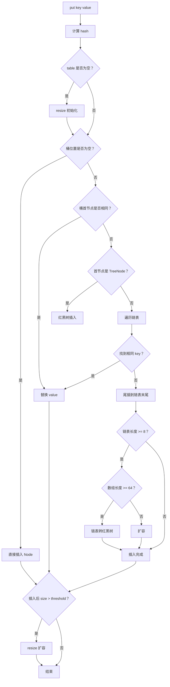

# HashMap 源码分析

## ⭐ 面试重点速览

| 知识模块 | 重点内容 | 面试频率 |
|----------|----------|----------|
| 底层结构 | 数组+链表+红黑树，为何组合 | 极高 |
| 哈希函数 | hash 扰动函数、为什么容量是 2 的幂 | 极高 |
| JDK 1.7 vs 1.8 | 头插→尾插、链表→红黑树 | 极高 |
| 扩容机制 | resize()、扩容因子 0.75、高低位拆分 | 极高 |
| 1.7 死循环 | 头插法导致链表成环 | 极高 |
| 红黑树转换 | 阈值为 8 和 6 的原因 | 极高 |

---

## 一、底层数据结构

HashMap 底层结构 = **数组 + 链表 + 红黑树**（JDK 1.8+）：

```java
// JDK 1.8 HashMap 的核心字段
static class Node<K,V> {
    final int hash;
    final K key;
    V value;
    Node<K,V> next;   // 链表指针
}

// 数组：每个位置是一个"桶"
transient Node<K,V>[] table;

// 默认初始容量 = 16（一定是 2 的幂）
static final int DEFAULT_INITIAL_CAPACITY = 1 << 4;

// 最大容量 = 2^30
static final int MAXIMUM_CAPACITY = 1 << 30;

// 默认负载因子 = 0.75
static final float DEFAULT_LOAD_FACTOR = 0.75f;

// 链表 → 红黑树阈值 = 8
static final int TREEIFY_THRESHOLD = 8;

// 红黑树 → 链表阈值 = 6
static final int UNTREEIFY_THRESHOLD = 6;
```

```
HashMap 结构示意：
  table[0] → Node → Node → ... (链表 或 红黑树)
  table[1] → (空)
  table[2] → Node
  ...
  table[15] → Node → Node (红黑树)
```

---

## ⭐ 二、哈希函数与索引定位

### 2.1 hash 扰动函数

```java
// ⭐ HashMap 的 hash 方法
static final int hash(Object key) {
    int h;
    // key.hashCode() 的高 16 位和低 16 位做异或扰动
    return (key == null) ? 0 : (h = key.hashCode()) ^ (h >>> 16);
}
```

**为什么需要扰动？**

直接取 `key.hashCode()` 的低几位作为数组索引时，如果 hashCode 分布不均匀（高位变化大，低位变化小），会造成严重碰撞。通过高 16 位和低 16 位异或，让高位也参与索引计算，减少哈希碰撞。

### 2.2 为什么容量必须是 2 的幂？

```java
// 索引定位：hash & (capacity - 1)
// 当 capacity = 16 (10000) 时，capacity - 1 = 15 (01111)
// 任何 hash 与 01111 做 & 运算，结果都在 0~15 之间

// ✅ capacity = 16 (2 的幂)：hash & (16 - 1) = hash & 01111 → 均匀分布到 0~15
// ❌ capacity = 10 (非 2 的幂)：hash & (10 - 1) = hash & 01001 → 有的位永远为 0，分布不均匀
```

| 好处 | 说明 |
|------|------|
| **位运算代替取模** | `hash & (length-1)` 等价于 `hash % length`，但效率更高 |
| **均匀分布** | 保证索引分布均匀，减少哈希碰撞 |
| **扩容免重算** | 扩容时只需判断 hash 新增位是 0 还是 1 |

### 2.3 负载因子为什么是 0.75？

**空间与时间的权衡**：
- 如果为 1.0：空间利用率高，但碰撞概率大增，查找效率下降
- 如果为 0.5：碰撞概率低，但空间浪费严重，频繁扩容
- **0.75** 是通过泊松分布计算出的最佳平衡点

::: tip 泊松分布解释
当负载因子为 0.75 时，链表长度超过 8 的概率约为 0.00000006（几乎不可能），这就是为什么选择 8 作为链表转红黑树的阈值。
:::

---

## ⭐ 三、JDK 1.7 vs JDK 1.8

| 维度 | JDK 1.7 | JDK 1.8 |
|------|---------|---------|
| 数据结构 | 数组 + 链表 | 数组 + 链表 + 红黑树 |
| 插入方式 | **头插法**（新节点插在链表头部） | **尾插法**（新节点插在链表尾部） |
| 哈希算法 | 较复杂（多次移位 + 异或） | 较简单（高 16 位 ^ 低 16 位） |
| 扩容条件 | `size > threshold && table[i] != null` | `size > threshold` |
| 扩容时重新计算索引 | 每个元素 rehash | 只需判断 hash 新增位（0 还是 1） |

**为什么从 1.7 的头插法改为 1.8 的尾插法？**

头插法在并发扩容时会导致**链表成环**（死循环）。尾插法扩容后保持原顺序，不会成环。

---

## ⭐ 四、扩容机制

### 4.1 扩容触发条件

```java
// threshold = capacity * loadFactor
if (++size > threshold)
    resize();

// 默认：capacity = 16, loadFactor = 0.75
// threshold = 12，即当元素数量超过 12 时扩容
```

### 4.2 resize() 过程

```java
// 扩容流程（简化版）
final Node<K,V>[] resize() {
    Node<K,V>[] oldTab = table;
    int oldCap = oldTab.length;
    // 1. 新容量 = 旧容量 * 2，新阈值 = 旧阈值 * 2
    int newCap = oldCap << 1;
    Node<K,V>[] newTab = new Node[newCap];

    // 2. 遍历旧数组中的每个桶
    for (int j = 0; j < oldCap; ++j) {
        Node<K,V> e = oldTab[j];
        if (e == null) continue;

        // 3. ⭐ 单节点直接重新定位
        if (e.next == null) {
            newTab[e.hash & (newCap - 1)] = e;
        }
        // 4. 红黑树节点拆分
        else if (e instanceof TreeNode) {
            // 拆分红黑树...
        }
        // 5. ⭐ 链表节点拆分（高低位分组）
        else {
            // 扩容后，hash 新增的那一位是 0 还是 1？
            // 0 → 留在原位（低位链表）
            // 1 → 移到原位 + oldCap（高位链表）
            Node<K,V> loHead = null, loTail = null;  // 低位链表
            Node<K,V> hiHead = null, hiTail = null;  // 高位链表

            Node<K,V> next;
            do {
                next = e.next;
                if ((e.hash & oldCap) == 0) {    // 低位
                    if (loTail == null) loHead = e;
                    else loTail.next = e;
                    loTail = e;
                } else {                          // 高位
                    if (hiTail == null) hiHead = e;
                    else hiTail.next = e;
                    hiTail = e;
                }
            } while ((e = next) != null);

            // 低位链表放在原位置
            newTab[j] = loHead;
            // 高位链表放在原位置 + oldCap
            newTab[j + oldCap] = hiHead;
        }
    }
    return newTab;
}
```

::: tip 高低位拆分原理
扩容后容量变为原来的 2 倍，索引 = `hash & (newCap - 1)`。

假设旧容量为 16 (10000)，新容量为 32 (100000)：
- 旧索引 = `hash & 01111`（看低 4 位）
- 新索引 = `hash & 011111`（看低 5 位）

新索引要么等于旧索引（第 5 位是 0），要么等于旧索引+16（第 5 位是 1）。

只需要判断 `hash & oldCap`（即第 5 位）是 0 还是 1，不需要重新计算 hash！
:::

---

## ⭐ 五、红黑树转换

### 5.1 什么时候转红黑树？

两个条件必须同时满足：
1. **链表长度 >= 8**（TREEIFY_THRESHOLD）
2. **数组长度 >= 64**（否则优先扩容而不是树化）

```java
// HashMap.treeifyBin() 简化逻辑
if (tab == null || (n = tab.length) < MIN_TREEIFY_CAPACITY) {
    resize();  // 数组太小时优先扩容，降低碰撞概率
} else {
    // 链表转红黑树
}
```

### 5.2 为什么阈值是 8？

根据泊松分布，当负载因子为 0.75 时，链表长度达到 8 的概率接近于 0（0.00000006）。所以当链表长度达到 8 时，很可能是因为 hashCode 分布有问题，需要用红黑树来保证 O(log n) 的查找效率。

### 5.3 什么时候退化为链表？

扩容后红黑树节点数 <= **6**（UNTREEIFY_THRESHOLD）时退化为链表。为什么不是 7？减少红黑树和链表反复切换的开销。

---

## ⭐ 六、JDK 1.7 并发扩容死循环分析

### 6.1 问题根源：头插法

JDK 1.7 使用头插法，扩容时从旧链表头开始遍历，插入到新链表头部。多线程并发扩容时会导致**链表成环**。

```
两个线程同时扩容：

线程 A：处理链表 A→B→C
  1. 拿到 e=A，e.next=B
  2. 线程 A 挂起...

线程 B：处理链表 A→B→C
  1. B 完成扩容，新链表顺序：C→B→A

线程 A：恢复执行，此时 A.next → B
  2. 但 B 的 next 在线程 B 中已被改为 A
  3. 链表变成 A→B→A→B... 成环！
```

### 6.2 后果

`get()` 操作在环形链表上遍历时，永远找不到要查找的 key，造成 CPU 100%（死循环）。

### 6.3 JDK 1.8 如何解决？

尾插法：新元素始终插入链表尾部，保持扩容后的顺序不变，不会成环。

::: danger 注意
JDK 1.8 的 HashMap 只是避免了死循环，但并发放数据仍然会丢失，**仍然线程不安全**。并发场景必须使用 `ConcurrentHashMap`！
:::

---

## 七、put 方法完整流程



---

## ⭐ 面试高频问题

### Q1：HashMap 的底层数据结构？

JDK 1.8 使用**数组 + 链表 + 红黑树**。数组是主干，每个位置是一个桶。桶内元素用链表存储；链表长度超过 8 且数组长度 >= 64 时，链表转化为红黑树。

### Q2：为什么容量必须是 2 的幂？

1. `hash & (length - 1)` 等价于 `hash % length`，位运算效率高
2. length - 1 的二进制全是 1，保证索引均匀分布
3. 扩容时只需判断 hash 新增位是 0 还是 1，不需要 rehash

### Q3：JDK 1.7 和 1.8 的 HashMap 有什么区别？

| 区别 | 1.7 | 1.8 |
|------|-----|-----|
| 结构 | 数组+链表 | 数组+链表+红黑树 |
| 插入 | 头插法 | 尾插法 |
| 死循环 | 可能死循环 | 修复死循环 |
| 扩容重算 | 每个元素 rehash | 高低位分组 |

### Q4：1.7 扩容死循环怎么产生的？

头插法扩容时，两个线程同时 resize，导致链表成环。后续 get() 在有环链表上会死循环，CPU 100%。

### Q5：HashMap 的 get 方法流程是什么？时间复杂度是多少？

**get 方法流程**：

```
1. 计算 key 的 hash 值：hash = (key == null) ? 0 : (h = key.hashCode()) ^ (h >>> 16)
2. 定位桶位置：index = hash & (table.length - 1)
3. 取出桶首节点
4. 判断首节点的 key 是否匹配（hash 相等 + equals 相等）
5. 匹配 → 返回 value
6. 不匹配 → 判断首节点是 TreeNode 还是普通 Node
   - TreeNode → 红黑树查找 O(log n)
   - 普通 Node → 遍历链表查找 O(n)
7. 找到返回 value，没找到返回 null
```

**时间复杂度**：
| 场景 | 复杂度 |
|------|--------|
| 没有碰撞（数组命中） | **O(1)** |
| 链表查找 | O(n)，平均 n/2 |
| 红黑树查找 | **O(log n)** |

在良好的 hashCode 分布下，get 操作接近 O(1)。

---

## 面试追问环节

**Q：为什么重写 equals 方法必须重写 hashCode 方法？**

HashMap 先判断 hashCode 是否相等，再判断 equals。如果两个对象 equals 相等但 hashCode 不同，在 HashMap 中存放在不同桶，`get()` 会找不到。违反了 HashMap 的约定。

**Q：JDK 1.7 HashMap put 时为什么头插法更快？**

头插法认为新插入的元素更可能被访问（LRU 思想），放在头部可以减少查找时间。但并发问题比性能更重要，所以 1.8 改为尾插法。

**Q：为什么链表长度为 8 时转红黑树，而不是更早？**

- 链表短时遍历很快（平均只要遍历一半长度，即 3-4 次比较）
- 红黑树有维护成本（旋转、变色）
- 根据泊松分布，链表长度 8 的概率极低（0.00000006），一般不会发生

**Q：HashMap 的 key 一般用什么类型？为什么？**

推荐使用 `String`、`Integer` 等**不可变对象**。因为：
- 不可变对象的 hashCode 不会变化，不会出现存进去后找不出来的情况
- String 的 hashCode 已被缓存，计算快