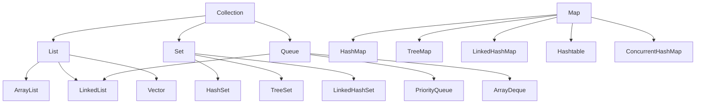

# 集合框架

## ⭐ 面试重点速览

| 知识模块 | 重点内容 | 面试频率 |
|----------|----------|----------|
| HashMap | 源码原理、1.7 vs 1.8、扩容死循环 | 极高 |
| ConcurrentHashMap | 分段锁演进、CAS+synchronized | 极高 |
| ArrayList vs LinkedList | 底层差异、扩容机制 | 极高 |
| 集合选型 | 各实现对比、使用场景 | 高 |
| fail-fast | 原理、如何避免 | 高 |

---

## 一、Java 集合框架整体架构



---

## 二、Collection vs Collections

| 名称 | 类型 | 说明 |
|------|------|------|
| **Collection** | 接口 | Java 集合框架的根接口，List/Set/Queue 都继承它 |
| **Collections** | 工具类 | 提供静态方法操作集合（排序、查找、线程安全包装等） |

```java
// Collection 是接口
Collection<String> collection = new ArrayList<>();

// Collections 是工具类
Collections.sort(list);
Collections.synchronizedList(new ArrayList<>());
Collections.unmodifiableList(list);
```

---

## 三、fail-fast vs fail-safe

### 3.1 fail-fast（快速失败）

遍历集合时，如果集合结构被修改（增、删），立刻抛出 `ConcurrentModificationException`。

::: tip 原理
集合内部有一个 `modCount` 字段，每次修改时 +1。迭代器在创建时记录 `expectedModCount = modCount`，每次 `next()` 时检查两者是否相等。
:::

```java
// fail-fast 示例
List<String> list = new ArrayList<>();
list.add("A");
list.add("B");

for (String s : list) {
    // ⚠️ 遍历时修改 → ConcurrentModificationException
    list.remove(s);
}

// ✅ 正确方式：使用迭代器的 remove()
Iterator<String> it = list.iterator();
while (it.hasNext()) {
    String s = it.next();
    if (s.equals("A")) {
        it.remove();  // 通过迭代器移除
    }
}
```

### 3.2 fail-safe（安全失败）

遍历时操作的是**集合的副本**，原集合被修改不会抛异常。`java.util.concurrent` 包下的并发集合大多属于 fail-safe。

| 对比维度 | fail-fast | fail-safe |
|----------|-----------|-----------|
| 触发条件 | 遍历时修改原集合 | N/A（不会触发） |
| 实现原理 | modCount 检查 | 操作集合副本 |
| 典型类 | `ArrayList`、`HashMap` | `CopyOnWriteArrayList`、`ConcurrentHashMap` |
| 性能 | 高（直接操作） | 较低（复制开销） |
| 是否抛异常 | 抛 ConcurrentModificationException | 不抛 |

---

## 四、集合选型对比表

### List 选型

| 实现 | 底层 | 随机访问 | 插入/删除 | 线程安全 |
|------|------|----------|-----------|----------|
| **ArrayList** | 动态数组 | O(1) | O(n)（尾部 O(1)） | ❌ |
| **LinkedList** | 双向链表 | O(n) | O(1)（需先定位） | ❌ |
| **Vector** | 动态数组 + synchronized | O(1) | O(n) | ✅（已淘汰） |
| **CopyOnWriteArrayList** | 写时复制数组 | O(1) | O(n)（写时复制） | ✅ |

### Map 选型

| 实现 | 底层 | 排序 | Null 键/值 | 线程安全 |
|------|------|------|-----------|----------|
| **HashMap** | 数组+链表+红黑树 | 无序 | ✅/✅ | ❌ |
| **LinkedHashMap** | HashMap + 双向链表 | 插入/访问顺序 | ✅/✅ | ❌ |
| **TreeMap** | 红黑树 | 自然排序 | ❌/✅ | ❌ |
| **Hashtable** | 数组+链表 | 无序 | ❌/❌ | ✅（已淘汰） |
| **ConcurrentHashMap** | 数组+链表+红黑树+CAS | 无序 | ❌/❌ | ✅ |

### Set 选型

| 实现 | 底层 | 排序 | 适用场景 |
|------|------|------|----------|
| **HashSet** | HashMap（值为常量） | 无序 | 去重，不需要排序 |
| **LinkedHashSet** | LinkedHashMap | 插入顺序 | 去重，需要保持插入顺序 |
| **TreeSet** | TreeMap | 自然排序 | 去重，需要排序 |
| **CopyOnWriteArraySet** | CopyOnWriteArrayList | 无序 | 读多写少的并发场景 |

---

## ⭐ 面试高频问题

### Q1：Collection 和 Collections 区别？

Collection 是集合框架的根接口，List、Set、Queue 都继承它。Collections 是操作集合的工具类，提供 `sort()`、`synchronizedList()` 等静态方法。

### Q2：什么是 fail-fast？ConcurrentHashMap 为什么不会抛 ConcurrentModificationException？

fail-fast 是集合的快速失败机制，遍历时发现 `modCount != expectedModCount` 时抛异常。

ConcurrentHashMap 的迭代器是 **fail-safe** 的，遍历时不检查 modCount，不会抛异常。但代价是不保证遍历到最新数据（弱一致性）。

### Q3：Hashtable 和 ConcurrentHashMap 的区别？

| 维度 | Hashtable | ConcurrentHashMap |
|------|-----------|-------------------|
| 锁粒度 | 锁整个表（synchronized 方法） | 1.7 分段锁 / 1.8 CAS + synchronized |
| 性能 | 低（全表锁，串行化） | 高（细粒度锁，高并发） |
| Null | 不允许 null key/value | 不允许 null key/value |
| JDK 状态 | 已淘汰 | 推荐使用 |

### Q4：为什么 HashMap 的 key 推荐用不可变对象（String/Integer）？

1. **hashCode 稳定**：不可变对象的 hashCode 不会变化，存进去后能找出来。如果 key 被修改导致 hashCode 变化，`get()` 会找不到
2. **线程安全**：不可变对象天然线程安全，不会有多线程修改问题
3. **String 的优化**：String 的 hashCode 被缓存，计算速度快

### Q5：如何在多线程环境下使用集合？有哪些线程安全方案？

| 方案 | 示例 | 适用场景 |
|------|------|----------|
| **JUC 并发集合** | `ConcurrentHashMap`、`CopyOnWriteArrayList` | 高并发，推荐 |
| **Collections 包装** | `Collections.synchronizedList(list)` | 低并发，简单场景 |
| **不可变集合** | `Collections.unmodifiableList(list)` | 只读场景 |
| **手动同步** | `synchronized (map) { ... }` | 复合操作需要外部同步 |

推荐优先使用 JUC 并发集合（如 `ConcurrentHashMap`），性能最好。`Collections.synchronizedXXX` 返回的是用 synchronized 包装的集合，锁粒度大，性能较差。