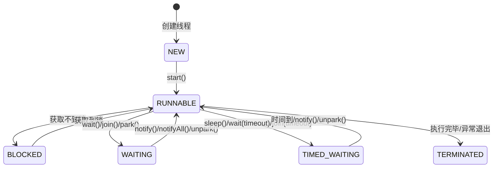

# Java 并发基础

## ⭐ 面试重点速览

| 知识模块 | 重点内容 | 面试频率 |
|----------|----------|----------|
| 线程生命周期 | 6 种状态及转换条件 | 极高 |
| 线程创建方式 | Thread / Runnable / Callable / 线程池 | 极高 |
| 线程安全 | 原子性、可见性、有序性 | 极高 |
| volatile | 可见性保证、禁止指令重排 | 极高 |
| synchronized | 锁升级：偏向锁→轻量锁→重量锁 | 极高 |
| 线程协作 | wait/notify、join、yield | 高 |

---

## 一、并发与并行的区别

::: tip 概念辨析
- **并发（Concurrency）**：多个任务在同一时间段内交替执行（单核 CPU 快速切换）。
- **并行（Parallelism）**：多个任务在同一时刻真正同时执行（多核 CPU 同时运行）。
- **比喻**：并发是一台咖啡机同时给两个队列做咖啡（快速切换）；并行是两台咖啡机分别给两个队列做咖啡（同时做）。
:::

---

## ⭐ 二、线程的生命周期

### 2.1 六种状态



### 2.2 各状态说明

| 状态 | 说明 | 进入方式 |
|------|------|----------|
| **NEW** | 线程已创建，但尚未调用 `start()` | `new Thread()` |
| ⭐ **RUNNABLE** | 可运行状态（包含操作系统的 Running 和 Ready） | `start()` 调用后 |
| **BLOCKED** | 阻塞状态，等待获取锁 | `synchronized` 获取不到锁 |
| **WAITING** | 无限等待状态，等待其他线程唤醒 | `wait()`、`join()`、`LockSupport.park()` |
| **TIMED_WAITING** | 限时等待状态，超时自动返回 | `sleep(ms)`、`wait(ms)`、`join(ms)` |
| **TERMINATED** | 线程执行完毕 | run 方法执行结束 |

### 2.3 状态转换代码验证

```java
/**
 * 演示线程六种状态的转换
 */
public class ThreadStateDemo {
    public static void main(String[] args) throws InterruptedException {
        // 1. NEW 状态
        Thread t = new Thread(() -> {
            // 3. RUNNABLE 状态 —— 线程正在运行
            System.out.println("线程运行中...");

            // 4. TIMED_WAITING 状态
            try {
                Thread.sleep(2000);
            } catch (InterruptedException e) {
                e.printStackTrace();
            }

            // 5. WAITING 状态 —— 等待获取锁（在 main 线程中验证）
            synchronized (ThreadStateDemo.class) {
                System.out.println("获取到锁");
            }
        });

        System.out.println("1. NEW: " + t.getState()); // NEW
        t.start();

        Thread.sleep(100);
        System.out.println("2. RUNNABLE: " + t.getState()); // RUNNABLE 或 TIMED_WAITING

        Thread.sleep(3000);
        System.out.println("3. TERMINATED: " + t.getState()); // TERMINATED
    }
}
```

---

## ⭐ 三、线程创建方式

### 3.1 四种创建方式

#### 方式一：继承 Thread 类

```java
// 继承 Thread，重写 run 方法
public class ThreadWay1 extends Thread {
    @Override
    public void run() {
        System.out.println(Thread.currentThread().getName() + " 运行中");
    }

    public static void main(String[] args) {
        new ThreadWay1().start();
    }

    // ⚠️ 缺点：Java 单继承，无法再继承其他类；任务与线程耦合
}
```

#### ⭐ 方式二：实现 Runnable 接口（推荐基础方式）

```java
// 实现 Runnable，任务与线程分离，更灵活
public class ThreadWay2 implements Runnable {
    @Override
    public void run() {
        System.out.println(Thread.currentThread().getName() + " 运行中");
    }

    public static void main(String[] args) {
        // 将 Runnable 实例传给 Thread，启动线程
        new Thread(new ThreadWay2()).start();

        // Lambda 简化写法（Runnable 是函数式接口）
        new Thread(() -> System.out.println("Lambda 方式")).start();
    }

    // ✅ 优点：可以继承其他类；任务与线程分离；适合多个线程共享同一任务
    // ⚠️ 缺点：run 方法无返回值，不能抛受检异常
}
```

#### ⭐ 方式三：实现 Callable + FutureTask（有返回值）

```java
import java.util.concurrent.Callable;
import java.util.concurrent.ExecutionException;
import java.util.concurrent.FutureTask;

/**
 * Callable —— 有返回值的异步任务
 */
public class ThreadWay3 implements Callable<String> {
    @Override
    public String call() throws Exception {
        Thread.sleep(1000); // 模拟耗时操作
        return "Callable 执行结果";
    }

    public static void main(String[] args) throws ExecutionException, InterruptedException {
        // FutureTask 同时实现了 Runnable 和 Future 接口
        FutureTask<String> futureTask = new FutureTask<>(new ThreadWay3());

        // FutureTask 可以作为 Runnable 传给 Thread
        new Thread(futureTask).start();

        System.out.println("主线程继续执行其他任务...");

        // ⭐ get() 会阻塞直到任务完成，返回结果
        String result = futureTask.get();
        System.out.println("获取到结果：" + result);

        // ✅ 优点：有返回值；可以抛出受检异常
        // ⚠️ 缺点：get() 方法会阻塞调用线程
    }
}
```

#### ⭐ 方式四：线程池（生产环境标准做法）

```java
import java.util.concurrent.*;

/**
 * 线程池 —— 生产环境唯一推荐的线程创建方式
 */
public class ThreadWay4 {
    public static void main(String[] args) throws ExecutionException, InterruptedException {
        // 1. ⭐ 通过 Executors 工具类创建（不推荐，有 OOM 风险）
        ExecutorService pool1 = Executors.newFixedThreadPool(5);

        // 2. ⭐ 通过 ThreadPoolExecutor 手动创建（推荐，参数完全可控）
        ThreadPoolExecutor pool = new ThreadPoolExecutor(
                2,                         // corePoolSize  核心线程数
                5,                         // maximumPoolSize 最大线程数
                60L,                       // keepAliveTime  空闲线程存活时间
                TimeUnit.SECONDS,          // 时间单位
                new LinkedBlockingQueue<>(100), // ⚠️ 无界队列可能导致 OOM
                new ThreadPoolExecutor.CallerRunsPolicy() // 拒绝策略
        );

        // 提交 Runnable 任务（无返回值）
        pool.execute(() -> System.out.println("Runnable 任务"));

        // 提交 Callable 任务（有返回值）
        Future<String> future = pool.submit(() -> {
            Thread.sleep(500);
            return "Callable 结果";
        });

        System.out.println("结果：" + future.get());

        // ⭐ 务必关闭线程池
        pool.shutdown();
    }
}
```

::: danger 为什么不推荐用 Executors 创建线程池？
- `Executors.newFixedThreadPool(n)` / `Executors.newSingleThreadExecutor()`：使用**无界**的 `LinkedBlockingQueue`，任务堆积会导致 OOM。
- `Executors.newCachedThreadPool()`：允许创建的线程数为 `Integer.MAX_VALUE`，线程过多导致 OOM。
- `Executors.newScheduledThreadPool(n)`：线程数上限为 `Integer.MAX_VALUE`。

**阿开发手册强制要求：必须通过 `ThreadPoolExecutor` 手动创建线程池。**
:::

---

## ⭐ 四、线程安全

### 4.1 什么是线程安全？

> 当多个线程同时访问一个类时，无论运行时环境采用何种调度方式或这些线程如何交替执行，该类始终表现出正确的行为，则称该类是线程安全的。

### 4.2 线程安全的三个核心问题

```
线程安全的三要素：

     原子性 (Atomicity)
          │
    ┌─────┼─────┐
    │     │     │
可见性    │   有序性
(Visibility) │ (Ordering)
    │     │     │
    └─────┼─────┘
          │
    三者共同保障
    线程安全
```

| 要素 | 说明 | 问题表现 | 解决方案 |
|------|------|----------|----------|
| ⭐ 原子性 | 一个或多个操作要么全部执行且不被中断，要么全部不执行 | `count++` 被拆分为读-改-写三步 | `synchronized`、`Lock`、`AtomicInteger` |
| ⭐ 可见性 | 一个线程对共享变量的修改，其他线程能立即看到 | 一个线程改了值，另一个线程看不到 | `volatile`、`synchronized`、`Lock` |
| ⭐ 有序性 | 程序按代码顺序执行（编译器/CPU 可能重排序） | 指令重排导致意料之外的结果 | `volatile`、`synchronized`、`Lock`、`final` |

### 4.3 不安全的代码示例

```java
/**
 * 线程不安全的典型场景：i++
 */
public class ThreadUnsafeDemo {
    private static int count = 0;

    public static void main(String[] args) throws InterruptedException {
        Thread t1 = new Thread(() -> {
            for (int i = 0; i < 10000; i++) {
                count++;  // ⚠️ 不是原子操作：读→改→写
            }
        });

        Thread t2 = new Thread(() -> {
            for (int i = 0; i < 10000; i++) {
                count++;
            }
        });

        t1.start();
        t2.start();
        t1.join();
        t2.join();

        // 期望值：20000，实际值：通常小于 20000（结果不确定）
        System.out.println("count = " + count);
    }
}
```

### 4.4 保证线程安全的常用手段

| 手段 | 适用场景 | 示例 |
|------|----------|------|
| ⭐ `synchronized` | 代码块/方法加锁 | `synchronized(lock) { count++; }` |
| ⭐ `volatile` | 一写多读的可见性场景 | `volatile boolean flag;` |
| `AtomicInteger` | 简单计数/累加 | `AtomicInteger count; count.incrementAndGet();` |
| `ReentrantLock` | 需要更灵活的锁控制 | `lock.lock(); try{...} finally{lock.unlock();}` |
| `ThreadLocal` | 线程隔离变量 | `ThreadLocal<SimpleDateFormat>` |
| 不可变对象 | 对象创建后状态不可变 | `String`、`final` 修饰的字段 |

---

## ⭐ 五、volatile 原理

### 5.1 核心保证

::: tip volatile 的两大作用
1. **保证可见性**：对一个 volatile 变量的写，会立即刷新到主内存；对一个 volatile 变量的读，总是从主内存读取。
2. **禁止指令重排序**：通过内存屏障（Memory Barrier）防止 JVM 和 CPU 对 volatile 变量相关指令的重排序。
:::

::: danger volatile 不能保证原子性
**`volatile` 不保证原子性！** 对 volatile 变量的复合操作（如 `i++`）仍然不是线程安全的。

`i++` 等价于三个操作：读 → 加 1 → 写。volatile 只保证了每次读/写的数据是最新的，但不能阻止多个线程同时执行这三步。
:::

### 5.2 使用场景：双重检查锁定（DCL）

```java
/**
 * ⭐ 双重检查锁定（Double-Checked Locking）实现单例
 * 演示 volatile 禁止指令重排的关键作用
 */
public class Singleton {
    // ⭐ volatile 必须存在！否则可能拿到半初始化的对象
    private static volatile Singleton instance;

    private Singleton() {
        // 私有构造器
    }

    public static Singleton getInstance() {
        if (instance == null) {                          // 第一次检查（无锁）
            synchronized (Singleton.class) {             // 加锁
                if (instance == null) {                  // 第二次检查（有锁）
                    instance = new Singleton();          // ⚠️ 这里可能重排序
                }
            }
        }
        return instance;
    }
}

/*
 * 为什么必须加 volatile？
 *
 * instance = new Singleton() 实际上分为三步：
 *   1. memory = allocate()        // 分配内存
 *   2. ctorInstance(memory)       // 初始化对象
 *   3. instance = memory          // 将引用指向内存地址
 *
 * JIT 可能将步骤 2 和 3 重排序（先赋值引用后初始化）：
 *   1. memory = allocate()
 *   3. instance = memory          // 此时 instance 非 null，但对象未初始化！
 *   2. ctorInstance(memory)
 *
 * 如果线程 A 执行到步骤 3 后被挂起，线程 B 执行第一次检查，
 * 发现 instance != null，直接返回未初始化的对象，导致问题！
 *
 * volatile 通过内存屏障禁止这种重排序。
 */
```

### 5.3 使用场景：状态标志位

```java
/**
 * volatile 最适合的场景：一写多读的状态标志
 */
public class VolatileFlagDemo {
    // ⭐ 使用 volatile 保证可见性
    private static volatile boolean running = true;

    public static void main(String[] args) throws InterruptedException {
        // 工作线程
        Thread worker = new Thread(() -> {
            int count = 0;
            while (running) {   // 如果不加 volatile，可能永远不会退出
                count++;
            }
            System.out.println("工作线程退出，循环了 " + count + " 次");
        });

        worker.start();
        Thread.sleep(1000);
        running = false;          // 主线程修改标志
        System.out.println("已设置 running = false");
    }
}
```

### 5.4 内存屏障（Memory Barrier）

```java
/*
 * volatile 通过内存屏障实现可见性和有序性：
 *
 *   普通读 ────────────────┐
 *                          ▼
 *              ┌─────────────────────┐
 *              │  LoadStore 屏障      │  禁止下面的普通读与上面的 volatile 读重排序
 *              └─────────────────────┘
 *   volatile 读 ──────────────────────
 *              ┌─────────────────────┐
 *              │  LoadLoad 屏障       │  禁止下面的普通读与上面的 volatile 读重排序
 *              └─────────────────────┘
 *   普通读 ──────────────────────────
 *
 *   普通写 ──────────────────────────
 *              ┌─────────────────────┐
 *              │  StoreStore 屏障     │  禁止上面的普通写与下面的 volatile 写重排序
 *              └─────────────────────┘
 *   volatile 写 ──────────────────────
 *              ┌─────────────────────┐
 *              │  StoreLoad 屏障      │  禁止上面的 volatile 写与下面的 volatile 读/写重排序
 *              └─────────────────────┘
 *   volatile 读/写 ───────────────────
 *
 * JMM 内存屏障类型：
 *   - LoadLoad：Load1; LoadLoad; Load2  → 确保 Load1 在 Load2 之前完成
 *   - StoreStore：Store1; StoreStore; Store2 → 确保 Store1 的结果对 Store2 可见
 *   - LoadStore：Load1; LoadStore; Store2 → 确保 Load1 在 Store2 之前完成
 *   - StoreLoad：Store1; StoreLoad; Load2 → 确保 Store1 的结果对 Load2 可见（最重）
 */
```

---

## ⭐ 六、synchronized 锁升级

### 6.1 锁的四种状态

JDK 6 对 `synchronized` 做了大量优化，引入了**锁升级**机制：

```
无锁 ──▶ 偏向锁 ──▶ 轻量级锁 ──▶ 重量级锁
  │         │           │
  │    只有一个线程      │
  │    反复获取锁        │
  │                     │
  │             多个线程交替获取锁
  │             没有实际竞争
  │                     │
  │              多线程激烈竞争
  │                     │
  └─────────────────────┘
     锁降级（GC 期间可能发生，从重量级锁降为无锁）
```

### 6.2 各锁状态详解

#### 偏向锁（Biased Locking）

::: tip 设计思路
大多数情况下，锁总是被同一个线程多次获取。偏向锁通过在对象头中记录线程 ID，让这个线程下次获取锁时不需要 CAS 操作，直接获取。
:::

```
Mark Word 结构（64 位，偏向锁状态）：

| thread ID (54 bits) | epoch (2 bits) | age (4 bits) | biased_lock (1 bit) | lock_bits (2 bits = 01) |
```

```java
/**
 * 偏向锁演示
 * VM 参数：-XX:+UseBiasedLocking -XX:BiasedLockingStartupDelay=0
 * （JDK 15 起偏向锁已废弃）
 */
public class BiasedLockDemo {
    public static void main(String[] args) throws InterruptedException {
        Object lock = new Object();

        // 线程第一次获取锁 —— 升级为偏向锁
        synchronized (lock) {
            System.out.println("偏向锁：线程 " + Thread.currentThread().getName());
        }

        // 同一线程再次获取 —— 直接拿锁，无需 CAS
        synchronized (lock) {
            System.out.println("偏向锁重入：无需竞争");
        }
    }
}
```

#### 轻量级锁（Lightweight Locking）

::: tip 触发条件
当**另一个线程尝试获取已被偏向的锁**时，偏向锁升级为轻量级锁。轻量级锁通过 **CAS + 自旋**的方式尝试获取锁。
:::

```
轻量级锁的获取过程：
  1. 在线程栈帧中创建 Lock Record（锁记录）
  2. CAS 将对象头的 Mark Word 替换为指向 Lock Record 的指针
  3. CAS 成功 → 获取轻量级锁
  4. CAS 失败 → 自旋等待（自适应自旋）
```

#### 重量级锁（Heavyweight Locking）

::: danger 触发条件
当**自旋等待超过一定次数**（默认 10 次，或自旋线程数超过 CPU 核数一半），轻量级锁膨胀为重量级锁。重量级锁依赖操作系统的 `mutex`，会导致线程阻塞/唤醒（用户态和内核态切换，开销大）。
:::

### 6.3 synchronized 锁升级代码演示

```java
/**
 * ⭐ 演示 synchronized 锁升级过程
 * 使用 JOL（Java Object Layout）库可以查看对象头
 *
 * 依赖：org.openjdk.jol:jol-core:0.17
 */
public class LockUpgradeDemo {
    public static void main(String[] args) throws InterruptedException {
        Object lock = new Object();

        // 1. 初始状态 —— 无锁
        // 可打印对象头查看：System.out.println(ClassLayout.parseInstance(lock).toPrintable());

        // 2. 第一次 synchronized —— 偏向锁
        synchronized (lock) {
            // 偏向锁状态
        }

        // 3. 第二个线程尝试获取 —— 升级为轻量级锁
        new Thread(() -> {
            synchronized (lock) {
                // 轻量级锁状态（自旋）
            }
        }).start();

        Thread.sleep(100);

        // 4. 多线程竞争 —— 升级为重量级锁
        for (int i = 0; i < 3; i++) {
            new Thread(() -> {
                synchronized (lock) {
                    try {
                        Thread.sleep(100);
                    } catch (InterruptedException e) {
                        e.printStackTrace();
                    }
                }
            }).start();
        }
    }
}
```

### 6.4 synchronized 使用规则

```java
public class SynchronizedUsage {

    // ⭐ 1. 修饰静态方法 —— 锁是 Class 对象
    public static synchronized void staticMethod() {
        // 等价于 synchronized(SynchronizedUsage.class) { }
    }

    // ⭐ 2. 修饰实例方法 —— 锁是 this 对象
    public synchronized void instanceMethod() {
        // 等价于 synchronized(this) { }
    }

    // ⭐ 3. 修饰代码块 —— 锁是指定的对象
    private final Object lock = new Object();

    public void blockMethod() {
        synchronized (lock) {
            // 使用私有 final 对象作为锁，避免外部获取锁导致死锁
        }
    }

    // 注意：静态 synchronized 和实例 synchronized 锁的不是同一个对象，互不影响
}
```

---

## ⭐ 面试高频问题

### Q1：synchronized 和 ReentrantLock 的区别？

| 维度 | synchronized | ReentrantLock |
|------|-------------|---------------|
| 实现 | JVM 层面（关键字） | JDK 层面（API） |
| 锁释放 | 自动释放（代码块结束/异常） | 必须手动 unlock（finally 中） |
| 可中断 | 不可中断 | 可中断（`lockInterruptibly()`） |
| 公平锁 | 非公平 | 可选公平/非公平 |
| 条件变量 | 单一 wait/notify | 多个 Condition |
| 性能 | JDK 6 优化后差距不大 | 略高（更灵活） |
| 锁状态 | 不可查询 | 可通过 API 查询 |

```java
// ReentrantLock 使用示例
ReentrantLock lock = new ReentrantLock(true); // 公平锁
lock.lock();
try {
    // 临界区代码
} finally {
    lock.unlock(); // ⚠️ 必须手动释放
}
```

### Q2：为什么说 volatile 不能替代 synchronized？

```java
/**
 * 对比：volatile vs synchronized
 */
public class VolatileVsSync {
    private volatile int volatileCount = 0;
    private int syncCount = 0;

    // ⚠️ volatile 不保证原子性 —— 结果可能不是 20000
    public void volatileIncrement() {
        volatileCount++;  // 读-改-写 三步，非原子
    }

    // ✅ synchronized 保证原子性 + 可见性 —— 结果一定是 20000
    public synchronized void syncIncrement() {
        syncCount++;
    }

    // volatile 适用场景：一写多读
    private volatile boolean flag = false;
    // 多个读线程可以看到最新的 flag，无需加锁
}
```

### Q3：wait() 和 sleep() 的区别？

| 维度 | wait() | sleep() |
|------|--------|---------|
| 所属类 | `Object` 的方法 | `Thread` 的静态方法 |
| 锁释放 | **释放锁** | **不释放锁** |
| 使用条件 | 必须在 `synchronized` 块中 | 任意地方 |
| 唤醒方式 | `notify()` / `notifyAll()` | 时间到自动唤醒 |

```java
// wait/notify 经典模板
synchronized (lock) {
    while (conditionNotMet) {     // ⭐ 必须用 while 而非 if（防止虚假唤醒）
        lock.wait();
    }
    // 条件满足，执行业务逻辑
}

synchronized (lock) {
    lock.notifyAll();             // ⭐ 一般用 notifyAll 而非 notify（避免信号丢失）
}
```

---

## 面试追问环节

### Q4：为什么 Java 中 wait/notify 要在 synchronized 块中调用？

1. **保证条件检查的原子性**：`while (condition) { wait(); }` 检查条件和执行 wait 之间不能有间隙，否则可能永久丢失 notify 信号。
2. **防止竞态条件**：如果不在 synchronized 中，线程 A 调用 wait 前线程 B 已经 notify 了，线程 A 会永久等待。

### Q5：什么是虚假唤醒（Spurious Wakeup）？

线程在没有被其他线程调用 `notify()/notifyAll()` 的情况下，也可能从 `wait()` 中醒来（操作系统层面的原因）。因此必须用 **while 循环**而不是 if 来判断条件：

```java
// ❌ 错误 —— 虚假唤醒会导致错误行为
if (conditionNotMet) {
    lock.wait();
}

// ✅ 正确 —— while 循环防止虚假唤醒
while (conditionNotMet) {
    lock.wait();
}
```

### Q6：偏向锁在 JDK 15 中为什么被废弃？

1. **维护成本高**：偏向锁的实现增加了 JVM（尤其是安全点/Safepoint）的复杂度。
2. **收益递减**：现代应用大多使用线程池，线程复用的场景下偏向锁的撤销开销往往大于收益。
3. **替代方案**：`java.util.concurrent` 包提供了更高效的同步工具，应用代码越来越少直接使用 `synchronized` 的重复获取模式。

JDK 15 起默认禁用偏向锁（`-XX:-UseBiasedLocking`），JDK 21 中偏向锁实现已被完全移除。