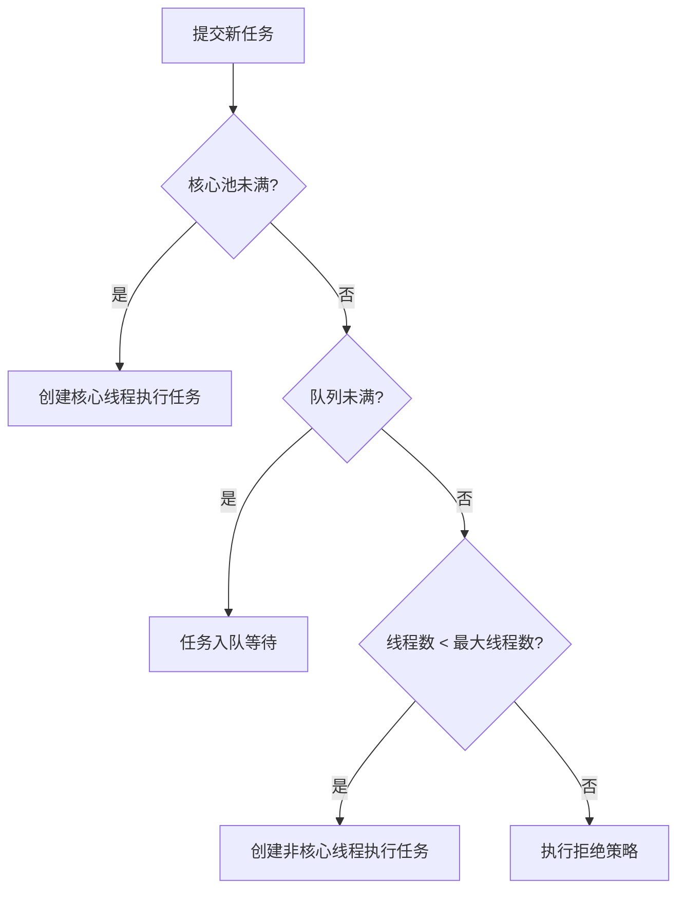

# 线程池

## ⭐ 面试重点速览

| 知识模块 | 重点内容 | 面试频率 |
|----------|----------|----------|
| ThreadPoolExecutor 七大参数 | 每个参数含义、工作流程 | 极高 |
| 拒绝策略 | 四种拒绝策略对比 | 极高 |
| 为什么不推荐 Executors | 无界队列 OOM 风险 | 极高 |
| 线程池大小配置 | CPU 密集 vs IO 密集 | 极高 |
| ForkJoinPool | 工作窃取、分治思想 | 中高 |
| CompletableFuture | 异步编程、链式调用 | 中高 |

---

## 一、为什么要用线程池？

线程池是管理线程的一种池化技术，核心优势：

| 优势 | 说明 |
|------|------|
| **降低资源消耗** | 重复利用已创建的线程，避免频繁创建销毁线程的开销 |
| **提高响应速度** | 任务来了直接用现有线程，省去创建线程的等待时间 |
| **便于管理控制** | 统一分配调优，控制最大并发数，避免线程过多耗尽 CPU 和内存 |

::: danger 为什么不自己 new Thread？
- 每个任务都创建一个线程，销毁开销大，性能差
- 缺乏统一管理，并发不受控，容易导致 OOM
- 不能复用线程，不适合大量并发任务
:::

---

## ⭐ 二、ThreadPoolExecutor 七大参数

```java
public ThreadPoolExecutor(int corePoolSize,
                          int maximumPoolSize,
                          long keepAliveTime,
                          TimeUnit unit,
                          BlockingQueue<Runnable> workQueue,
                          ThreadFactory threadFactory,
                          RejectedExecutionHandler handler) {
    // ...
}
```

| 参数 | 含义 | 说明 |
|------|------|------|
| **corePoolSize** | 核心线程数 | 核心线程会一直存活，不会被回收（除非 `allowCoreThreadTimeOut=true`） |
| **maximumPoolSize** | 最大线程数 | 线程池能创建的最大线程数 |
| **keepAliveTime** | 空闲线程存活时间 | 非核心线程空闲超过这个时间会被回收 |
| **unit** | 时间单位 | 枚举：`TimeUnit.SECONDS/`MILLISECONDS 等 |
| **workQueue** | 工作队列 | 存放等待执行任务的阻塞队列 |
| **threadFactory** | 线程工厂 | 创建线程，可自定义线程名称方便排查问题 |
| **handler** | 拒绝策略 | 队列和线程都满了，新任务怎么办 |

### 2.1 ⭐ 线程池工作流程



::: tip 执行流程总结
1. 核心池未满 → 创建核心线程执行
2. 核心池已满 → 任务入队列等待
3. 队列也满了 → 如果当前线程数小于最大线程数，创建新线程执行
4. 线程数已达最大 → 执行拒绝策略
:::

```java
// ThreadPoolExecutor 执行逻辑（简化版源码）
public void execute(Runnable command) {
    if (command == null) throw new NullPointerException();

    int c = ctl.get();
    // 1. 工作线程数 < 核心线程数，创建核心线程执行
    if (workerCountOf(c) < corePoolSize) {
        if (addWorker(command, true))
            return;
    }
    // 2. 核心池已满，尝试入队
    if (isRunning(c) && workQueue.offer(command)) {
        // 入队成功，二次检查（防止刚入队线程池 shutdown）
        int recheck = ctl.get();
        if (! isRunning(recheck) && remove(command))
            reject(command);
        else if (workerCountOf(recheck) == 0)
            addWorker(null, false);
    }
    // 3. 队列满了，尝试创建非核心线程
    else if (!addWorker(command, false))
        // 4. 创建失败，执行拒绝策略
        reject(command);
}
```

---

## 三、四种拒绝策略

当工作队列已满且线程数达到 `maximumPoolSize` 时，新任务会触发拒绝策略。

| 拒绝策略 | 行为 | 适用场景 |
|----------|------|----------|
| **AbortPolicy** | 直接抛出 `RejectedExecutionException` | 需要知道任务被拒绝，默认策略 |
| **CallerRunsPolicy** | 由提交任务的线程直接执行 | 不允许丢弃任务，降低提交速度 |
| **DiscardPolicy** | 直接丢弃这个任务 | 允许丢弃不重要任务 |
| **DiscardOldestPolicy** | 丢弃队列最老的任务，重试提交 | 队列头任务可能过时了 |

::: warning 生产环境推荐
生产环境一般使用 `CallerRunsPolicy`，它不会丢弃任务，而是让调用线程自己执行，起到缓冲限流的作用。
:::

---

## ⭐ 四、为什么不推荐用 Executors 创建？

### 4.1 五种默认线程池

| 创建方式 | 特点 | 问题 |
|----------|------|------|
| `newFixedThreadPool(n)` | 核心线程数 = 最大线程数 | 用了 `LinkedBlockingQueue` **无界队列**，任务堆积会导致 OOM |
| `newSingleThreadExecutor()` | 单个线程 | 同样用了**无界队列**，OOM 风险 |
| `newCachedThreadPool()` | 核心线程数 0，最大线程数 `Integer.MAX_VALUE` | 可创建无限多线程，线程过多导致 OOM |
| `newScheduledThreadPool()` | 定时任务 | 用了 `DelayedWorkQueue`，可能 OOM |
| `newWorkStealingPool()` | ForkJoinPool | 适合计算密集型任务 |

::: danger 阿里开发手册强制要求
**强制**：线程池不允许使用 `Executors` 去创建，而是通过 `ThreadPoolExecutor` 方式，这样可以明确线程池运行规则，规避资源耗尽风险。

原因：
- `FixedThreadPool` / `SingleThreadExecutor`：主要问题是堆积的请求存储在无界队列 `LinkedBlockingQueue` 中，队列会无限增长，导致 OOM
- `CachedThreadPool` / `newScheduledThreadPool`：主要问题是允许创建的线程数是 `Integer.MAX_VALUE`，可能创建非常多的线程，导致 OOM
:::

### 4.2 推荐写法

```java
/**
 * ⭐ 推荐写法：手动 new ThreadPoolExecutor
 */
ThreadPoolExecutor pool = new ThreadPoolExecutor(
        2,                         // corePoolSize
        10,                        // maximumPoolSize
        60L,                       // keepAliveTime
        TimeUnit.SECONDS,
        new LinkedBlockingQueue<>(100),  // 有界队列，容量控制
        new NamedThreadFactory("my-pool"), // 自定义线程工厂，方便日志排查
        new ThreadPoolExecutor.CallerRunsPolicy() // CallerRuns 拒绝策略
);
```

---

## ⭐ 五、线程池大小配置准则

### 5.1 CPU 密集型 vs IO 密集型

| 场景 | 说明 | 推荐线程数 |
|------|------|------------|
| **CPU 密集型** | 大部分时间在做计算，很少阻塞 | `核心数 + 1` |
| **IO 密集型** | 大量时间在等待 IO（DB、网络），CPU 利用率不高 | `核心数 * 2` 或 `核心数 / (1 - 阻塞系数)` |

::: tip 公式推导
```
最佳线程数 = CPU 核心数 * (1 + 平均等待时间 / 平均计算时间)
```
- 等待时间占比越高 → 需要越多线程
- 计算时间占比越高 → 需要越少线程
:::

### 5.2 经验法则

```java
// 公式：Ncpu = Runtime.getRuntime().availableProcessors()
int cpu = Runtime.getRuntime().availableProcessors();

// 1. CPU 密集型
int corePoolSize = cpu + 1;

// 2. IO 密集型（阻塞系数 0.8-0.9）
int corePoolSize = (int) (cpu / (1 - 0.8));  // 4核 → 20线程
```

### 5.3 需要考虑的因素

- 任务平均响应时间要求 → 响应越快，线程越多
- 机器可用内存 → 每个线程栈默认 1MB，太多线程栈会占大量内存
- 依赖的资源（如数据库连接池）→ 不要超过连接池大小，否则排队

---

## 六、ForkJoinPool

### 6.1 核心思想

**分治 + 工作窃取**：把大任务拆分成多个小任务，多线程并行处理。

::: tip 工作窃取算法
- 每个线程有自己的双端队列
- 空闲线程会从**忙碌线程的队列尾部**偷取任务执行
- 减少线程之间的竞争，提高 CPU 利用率
:::

### 6.2 使用示例

```java
/**
 * ⭐ 斐波那契数列 —— 分治示例
 */
public class Fibonacci extends RecursiveTask<Integer> {
    final int n;
    Fibonacci(int n) { this.n = n; }

    @Override
    protected Integer compute() {
        if (n <= 1)
            return n;
        Fibonacci f1 = new Fibonacci(n - 1);
        f1.fork();  // 异步拆分
        Fibonacci f2 = new Fibonacci(n - 2);
        return f2.compute() + f1.join();
    }

    public static void main(String[] args) {
        ForkJoinPool pool = new ForkJoinPool();
        System.out.println(pool.invoke(new Fibonacci(10)));
    }
}
```

::: tip 适用场景
- 计算密集型任务
- 大任务可以拆分成多个小任务
- 比如：大数据排序、并行搜索、矩阵运算
:::

---

## 七、CompletableFuture

### 7.1 为什么需要它？

`Future` 的 `get()` 方法会阻塞，不能很好地做异步链式编程。`CompletableFuture` 支持**回调 + 链式调用**，异步编程更灵活。

### 7.2 常用方法

```java
/**
 * ⭐ CompletableFuture 常用方法示例
 */
public class CompletableFutureDemo {
    public static void main(String[] args) throws Exception {
        // 1. supplyAsync: 异步执行，有返回值
        CompletableFuture<String> future = CompletableFuture.supplyAsync(() -> {
            // 模拟耗时操作
            try { Thread.sleep(1000); } catch (InterruptedException e) {}
            return "result";
        });

        // 2. thenApply: 链式转换结果
        CompletableFuture<Integer> intFuture = future.thenApply(s -> s.length());

        // 3. thenAccept: 消费结果，无返回值
        future.thenAccept(result -> System.out.println("结果: " + result));

        // 4. thenCombine: 两个任务都完成后合并
        CompletableFuture<Integer> a = CompletableFuture.supplyAsync(() -> 10);
        CompletableFuture<Integer> b = CompletableFuture.supplyAsync(() -> 20);
        CompletableFuture<Integer> sum = a.thenCombine(b, (x, y) -> x + y);
        System.out.println(sum.get());  // 30

        // 5. allOf: 等待所有任务完成
        CompletableFuture<Void> all = CompletableFuture.allOf(a, b);
        all.join();  // 阻塞直到所有完成

        // 6. exceptionally: 异常处理
        future.exceptionally(ex -> {
            System.err.println("异常: " + ex.getMessage());
            return "default";
        });
    }
}
```

### 7.3 常见问题

**Q：默认线程池是什么？**

```
CompletableFuture.supplyAsync() 默认使用 ForkJoinPool.commonPool()
```

**Q：什么时候自定义线程池？**

如果任务比较重，IO 密集，建议传入自定义线程池，避免共享线程池被卡住。

---

## ⭐ 面试高频问题

### Q1：线程池的工作流程是什么？说一下七个参数？

回答要点：
1. 七个参数：corePoolSize、maximumPoolSize、keepAliveTime、unit、workQueue、threadFactory、handler
2. 工作流程：核心池未满 → 创建线程；核心池满 → 入队；队列满 → 新建非核心线程；达到最大 → 拒绝
3. 图解流程（记住流程图）

### Q2：为什么 corePoolSize 不会被回收？什么时候会回收？

- 核心线程默认不会回收，因为频繁创建销毁核心线程会带来不必要开销
- 如果设置 `allowCoreThreadTimeOut=true`，核心线程空闲后也会被回收

### Q3：为什么用有界队列而不是无界队列？

- 无界队列可以无限堆积任务，当任务处理速度跟不上提交速度时，队列会不断增长，最终导致 OOM
- 有界队列容量可控，满了会触发拒绝策略，提前发现问题保护系统

### Q4：线程池大小怎么设置？

- CPU 密集型：`核心数 + 1`
- IO 密集型：`核心数 * 2` 或 `核心数 / (1 - 阻塞系数)`
- 实际生产中需要根据压测结果微调

### Q5：线程池中的线程是怎么复用的？核心线程和非核心线程有什么区别？

**线程复用机制**：ThreadPoolExecutor 中，每个 Worker 线程启动后会循环调用 `getTask()` 从 `workQueue` 中获取任务：

```java
// Worker 线程的 run() 方法（简化）
final void runWorker(Worker w) {
    Runnable task = w.firstTask;
    while (task != null || (task = getTask()) != null) {
        // 执行任务
        task.run();
    }
    // 循环结束，线程退出
}
```

**核心线程 vs 非核心线程的区别**：
| 维度 | 核心线程 | 非核心线程 |
|------|----------|------------|
| 创建时机 | 预创建（prestartAllCoreThreads）或提交任务时创建 | 核心池满且队列满时才创建 |
| 回收 | 默认不回收（除非 `allowCoreThreadTimeOut=true`） | 空闲超过 `keepAliveTime` 后回收 |
| 数量 | 固定为 `corePoolSize` | 最多 `maximumPoolSize - corePoolSize` |

`getTask()` 方法中，核心线程使用 `workQueue.take()`（阻塞等待），非核心线程使用 `workQueue.poll(keepAliveTime, unit)`（超时返回 null，线程退出）。这就是核心线程不被回收、非核心线程超时回收的底层机制。

---

## 面试追问环节

**Q：阻塞队列选哪种比较好？**

常见阻塞队列：

| 队列 | 特点 | 适用场景 |
|------|------|----------|
| `ArrayBlockingQueue` | 基于数组，有界，先进先出，锁实现 | 需要容量控制的固定大小线程池 |
| `LinkedBlockingQueue` | 基于链表，默认无界，可指定容量 | 固定线程池常用，吞吐量高于 Array |
| `SynchronousQueue` | 不存储元素，每个 put 必须等待 take | CachedThreadPool 使用，适合短任务高并发 |
| `PriorityBlockingQueue` | 支持优先级排序 | 需要任务按优先级执行 |
| `DelayQueue` | 延迟队列 | 定时任务、缓存过期清理 |

**Q：核心线程数为什么推荐是 CPU 核心数 + 1？**

- CPU 密集型任务，每个核心一个线程就可以跑满
- +1 是为了应对可能的异常情况（比如线程发生阻塞、内存页错误），多出一个线程可以保证 CPU 不空闲

**Q：线程池中的线程是怎么复用的？**

ThreadPoolExecutor 中，每个 Worker 线程会循环从 workQueue 中 `getTask()` 获取任务：
- 如果拿到任务就执行
- 如果拿不到（超时或线程池 shutdown）就退出循环，线程结束
- 核心线程默认一直阻塞等待，不会超时退出 → 复用

**Q：CompletableFuture 的 complete 和 completeExceptionally 有什么用？**

手动完成异步任务：
```java
CompletableFuture<String> future = new CompletableFuture<>();
// 在另一个线程完成后
future.complete("result");  // 正常完成
future.completeExceptionally(new RuntimeException("error"));  // 异常完成
```
常用于把回调式异步代码转为 CompletableFuture 风格。

**Q：线程池为什么要使用 ThreadFactory？自定义 ThreadFactory 有什么好处？**

- ThreadFactory 负责创建线程，默认是 `DefaultThreadFactory`
- 自定义 ThreadFactory 可以给线程设置有意义的名称，方便排查问题（日志中能看到是哪个线程池的线程）
- 可以设置线程优先级、是否守护线程等