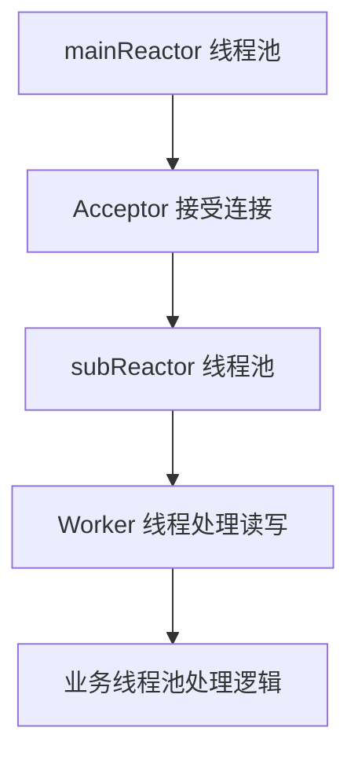

# Netty 入门

## ⭐ 面试重点速览

| 知识模块 | 重点内容 | 面试频率 |
|----------|----------|----------|
| Reactor 模式 | 单线程/多线程/主从 Reactor | 极高 |
| Netty 架构 | Bootstrap、EventLoopGroup、Pipeline | 极高 |
| Pipeline 处理器 | 责任链模式、入站/出站处理 | 高 |
| 粘包拆包 | 原因、解决方案 | 极高 |
| Netty 零拷贝 | 堆外内存、CompositeByteBuf、sendFile | 中 |

---

## ⭐ 一、Reactor 模式

Reactor 模式是**事件驱动**的 IO 多路复用设计模式，也是 Netty 的核心设计思想。

### 1.1 单线程 Reactor

```
Acceptor + Handler 都在一个线程中
  ┌─────────────────────────┐
  │     Reactor 线程        │
  │  accept + read + write  │
  └─────────────────────────┘
           ↑ ↓
    ┌──────┴──────┐
    │  Selector   │
    └──────┬──────┘
    ┌──────┴──────┐
    │  多个 Client │
    └─────────────┘
```

::: danger 缺点
一个线程处理所有连接，如果某个 Handler 处理慢，会阻塞所有连接。
:::

### 1.2 多线程 Reactor

```
Acceptor 在 Reactor 线程，Handler 在线程池中
  ┌──────────────┐    ┌──────────────────┐
  │Reactor 线程  │───→│  Worker 线程池    │
  │  accept      │    │  read + process  │
  └──────────────┘    └──────────────────┘
```

### 1.3 ⭐ 主从 Reactor（Netty 默认模式）



```
主从 Reactor（Netty 默认）：
  BossGroup（mainReactor）
    └── 负责 accept 连接，注册到 WorkerGroup
  WorkerGroup（subReactor）
    └── 负责已建立连接的 IO 读写
```

::: tip 优势
- Boss 线程只负责接受连接，不处理 IO → 能接受大量连接
- Worker 线程负载均衡，每个连接绑定到固定 Worker → 无锁化处理
- 业务处理可以放到独立的业务线程池 → 不阻塞 IO 线程
:::

---

## 二、Netty 架构

### 2.1 核心组件

```
Netty 服务端架构：

  ServerBootstrap
       │
       ├── BossGroup（EventLoopGroup）
       │     └── EventLoop 1..N
       │
       ├── WorkerGroup（EventLoopGroup）
       │     └── EventLoop 1..N
       │
       └── ChannelPipeline
             ├── Handler 1（入站）
             ├── Handler 2（入站/出站）
             └── Handler 3（出站）
```

| 组件 | 说明 |
|------|------|
| **Bootstrap** | 启动引导类，配置 Netty 客户端/服务端 |
| **EventLoopGroup** | 事件循环组，管理一组 EventLoop |
| **EventLoop** | 事件循环线程，负责处理 Channel 的 IO 事件 |
| **ChannelPipeline** | 处理器链，类似责任链模式 |
| **ChannelHandler** | 具体处理器，处理入站/出站事件 |

### 2.2 基础代码示例

```java
/**
 * ⭐ Netty 服务端最小示例
 */
public class NettyServer {
    public static void main(String[] args) throws Exception {
        // 1. BossGroup：接受连接
        EventLoopGroup bossGroup = new NioEventLoopGroup(1);
        // 2. WorkerGroup：处理读写
        EventLoopGroup workerGroup = new NioEventLoopGroup();

        try {
            ServerBootstrap bootstrap = new ServerBootstrap();
            bootstrap.group(bossGroup, workerGroup)
                     .channel(NioServerSocketChannel.class)
                     .childHandler(new ChannelInitializer<SocketChannel>() {
                         @Override
                         protected void initChannel(SocketChannel ch) {
                             ch.pipeline().addLast(new MyHandler());
                         }
                     });

            // 3. 绑定端口，启动服务
            ChannelFuture future = bootstrap.bind(8080).sync();
            future.channel().closeFuture().sync();
        } finally {
            bossGroup.shutdownGracefully();
            workerGroup.shutdownGracefully();
        }
    }
}
```

---

## ⭐ 三、Pipeline 与 ChannelHandler

### 3.1 责任链模式

Pipeline 是一个**双向链表**结构，每个节点是一个 ChannelHandler。

```
Pipeline 处理流程：

  [入站] Head → Handler1 → Handler2 → Handler3 → Tail
  [出站] Tail → Handler3 → Handler2 → Handler1 → Head
```

### 3.2 入站 vs 出站处理器

| 类型 | 接口 | 方向 | 典型场景 |
|------|------|------|----------|
| 入站处理器 | `ChannelInboundHandler` | 从网络读取数据 | 解码、业务处理 |
| 出站处理器 | `ChannelOutboundHandler` | 向网络写入数据 | 编码、协议转换 |

```java
/**
 * ⭐ 自定义 ChannelHandler
 */
public class MyHandler extends ChannelInboundHandlerAdapter {

    // 通道就绪时触发
    @Override
    public void channelActive(ChannelHandlerContext ctx) {
        System.out.println("客户端连接：" + ctx.channel().remoteAddress());
    }

    // 读取数据时触发
    @Override
    public void channelRead(ChannelHandlerContext ctx, Object msg) {
        // msg 是解码后的消息
        ByteBuf buf = (ByteBuf) msg;
        byte[] data = new byte[buf.readableBytes()];
        buf.readBytes(data);
        System.out.println("收到消息：" + new String(data));

        // 写回响应
        ctx.writeAndFlush(Unpooled.copiedBuffer("Hello!", CharsetUtil.UTF_8));
    }

    // 读取完成时触发
    @Override
    public void channelReadComplete(ChannelHandlerContext ctx) {
        ctx.flush();
    }

    // 发生异常时触发
    @Override
    public void exceptionCaught(ChannelHandlerContext ctx, Throwable cause) {
        cause.printStackTrace();
        ctx.close();
    }
}
```

### 3.3 事件传播

```java
// ⭐ 入站事件传播：ctx.fireChannelRead(msg) 传递给下一个 Handler
// ⭐ 出站事件传播：ctx.write(msg) 从当前位置向前传播

// 手动触发下一个入站 Handler
@Override
public void channelRead(ChannelHandlerContext ctx, Object msg) {
    // 处理数据...
    ctx.fireChannelRead(msg);  // 传递给下一个入站 Handler
}
```

---

## ⭐ 四、粘包拆包

### 4.1 为什么会发生？

TCP 是**流式协议**，没有消息边界。应用层发送的数据可能被 TCP 拆分成多个包发送，也可能多个小包被合并成一个包发送。

```
发送端：发送 3 个消息："ABC" "DEF" "GHI"
接收端可能收到：
  - 粘包："ABCDEFGHI"（3 个消息粘在一起）
  - 拆包："AB" "CDEF" "GHI"（消息被拆分）
  - 正常："ABC" "DEF" "GHI"（理想情况）
```

### 4.2 ⭐ 解决方案

| 方案 | 实现 | Netty 提供 |
|------|------|-----------|
| **定长消息** | 每个消息固定长度，不够补空格 | `FixedLengthFrameDecoder` |
| **分隔符** | 消息间用特殊字符分隔（如 `\n`） | `DelimiterBasedFrameDecoder` |
| **长度字段** | 消息头包含消息体长度 | `LengthFieldBasedFrameDecoder` |

```java
// ⭐ 最推荐：基于长度字段的编解码（自定义协议）
// 协议格式：4 字节长度 + 消息体
ch.pipeline().addLast(
    new LengthFieldBasedFrameDecoder(65535, 0, 4, 0, 4),
    new LengthFieldPrepender(4),  // 编码时自动添加长度字段
    new MyBusinessHandler()
);

// 分隔符方案（适合文本协议）
ch.pipeline().addLast(
    new DelimiterBasedFrameDecoder(8192, Delimiters.lineDelimiter()),
    new StringDecoder(),
    new StringEncoder(),
    new MyBusinessHandler()
);
```

---

## 五、Netty 零拷贝

| 零拷贝方式 | 说明 | 实现 |
|------------|------|------|
| **堆外内存** | 使用 DirectBuffer，避免堆内存到直接内存的拷贝 | `Unpooled.directBuffer()` |
| **CompositeByteBuf** | 将多个 ByteBuf 合并为一个逻辑 ByteBuf，不实际拷贝 | `Unpooled.wrappedBuffer(buf1, buf2)` |
| **文件传输** | 使用 `FileRegion` 包装 `transferTo`，实现文件零拷贝 | `ctx.writeAndFlush(new DefaultFileRegion(...))` |

---

## ⭐ 面试高频问题

### Q1：Netty 的 Reactor 线程模型是怎样的？

Netty 使用**主从 Reactor 模型**：
- **BossGroup**：负责 accept 连接，注册到 WorkerGroup
- **WorkerGroup**：负责已建立连接的 IO 读写
- 每个 Channel 绑定到固定的 EventLoop 线程，无锁化处理

### Q2：Netty 的 Pipeline 是怎么工作的？

Pipeline 是一个**双向链表**，入站事件从 Head 向 Tail 传播，出站事件从 Tail 向 Head 传播。每个 Handler 处理完后通过 `ctx.fireXxx()` 传递给下一个 Handler。

### Q3：怎么解决粘包拆包问题？

- 定长消息：`FixedLengthFrameDecoder`
- 分隔符：`DelimiterBasedFrameDecoder`
- 长度字段：`LengthFieldBasedFrameDecoder`（最推荐）

### Q4：Netty 的零拷贝体现在哪些方面？

1. 堆外内存（DirectBuffer）：IO 操作不经过堆内存
2. CompositeByteBuf：合并多个 ByteBuf 不实际拷贝
3. FileRegion：文件传输使用 sendFile 零拷贝

### Q5：Netty 的 ByteBuf 和 NIO 的 ByteBuffer 有什么区别？为什么 Netty 要自定义 ByteBuf？

| 维度 | NIO ByteBuffer | Netty ByteBuf |
|------|---------------|---------------|
| **读写模式** | 单一指针，需要 flip() 切换读写 | 双指针（readerIndex/writerIndex），读写分离，无需 flip() |
| **容量扩展** | 固定容量，不可动态扩展 | 支持自动扩容（`maxCapacity` 限制） |
| **引用计数** | 无 | 有（ReferenceCounted），便于池化和资源自动释放 |
| **池化** | 无 | 有（PooledByteBufAllocator），复用内存减少 GC |
| **零拷贝** | 不支持 | 支持 CompositeByteBuf（逻辑合并）、slice() 切片共享内存 |
| **字节序** | 默认大端序（Big Endian） | 默认小端序，可配置 |

**Netty 为什么要自定义 ByteBuf**：
1. **解决 flip() 痛点**：NIO ByteBuffer 读写切换需要 flip()，容易出错；ByteBuf 双指针天然支持读写
2. **自动扩容**：ByteBuffer 满了就不能再写；ByteBuf 自动扩容，编程更友好
3. **内存池与引用计数**：减少 GC 压力，提升性能
4. **零拷贝支持**：CompositeByteBuf 和 slice 避免不必要的数据拷贝

---

## 面试追问环节

**Q：Netty 为什么高性能？**

1. **Reactor 线程模型**：无锁化串行处理，避免锁竞争
2. **零拷贝**：堆外内存、CompositeByteBuf、文件传输
3. **内存池**：`PooledByteBufAllocator` 复用 ByteBuf，减少 GC 压力
4. **批量处理**：一次性处理多个就绪事件，减少系统调用

**Q：EventLoop 和 Channel 的关系？**

每个 EventLoop 绑定一个线程，一个 EventLoop 可以管理多个 Channel。但一个 Channel 的所有 IO 事件只由一个 EventLoop 处理，保证线程安全。

**Q：Netty 的心跳机制怎么实现？**

```java
ch.pipeline().addLast(new IdleStateHandler(5, 0, 0, TimeUnit.SECONDS));
// 读超时 5 秒 → 触发 IdleStateEvent → 在 userEventTriggered 中处理
```