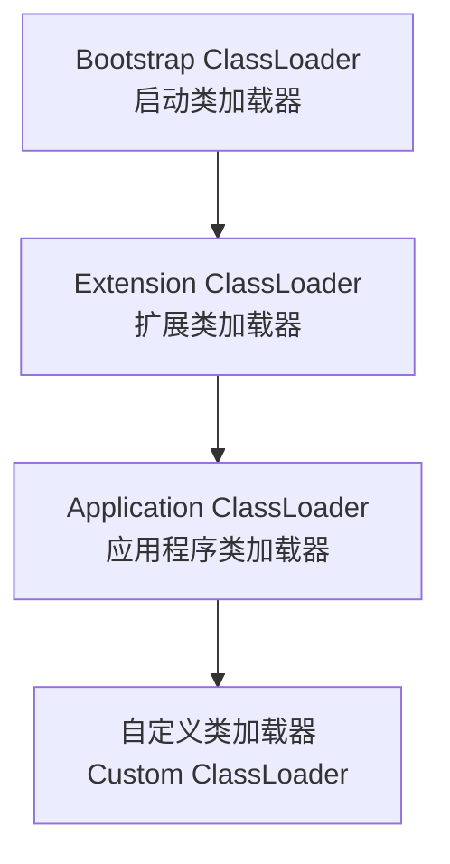
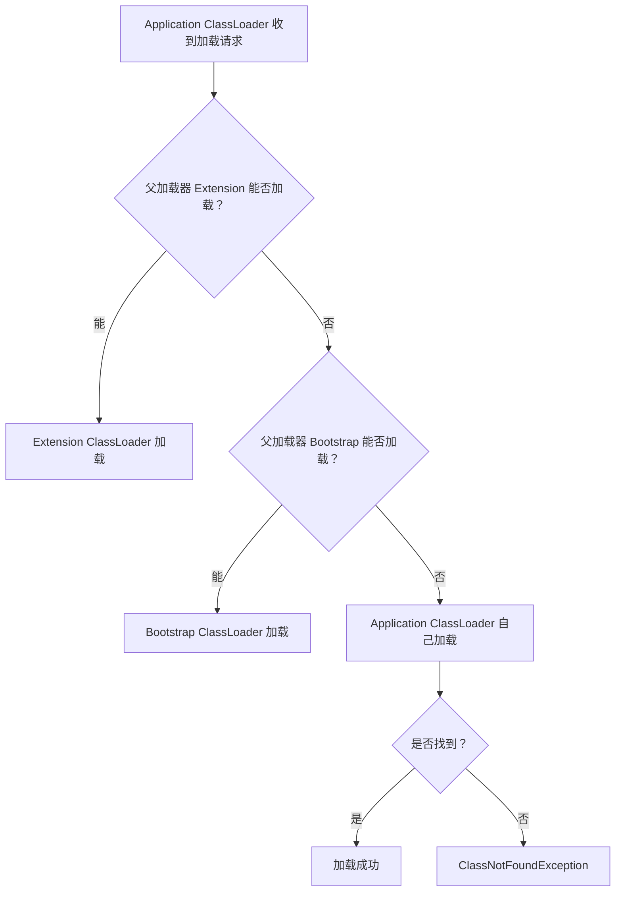
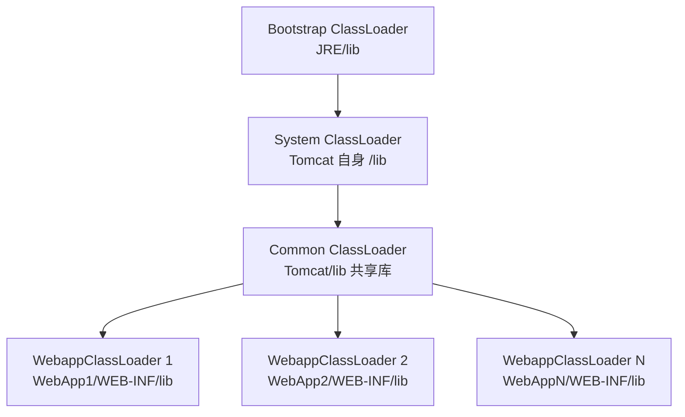

# JVM 类加载机制

## ⭐ 面试重点速览

| 知识模块 | 重点内容 | 面试频率 |
|----------|----------|----------|
| 类加载生命周期 | 加载→验证→准备→解析→初始化 | 高 |
| 双亲委派模型 | 原理、优势、破坏场景 | 极高 |
| 类加载器分类 | Bootstrap / Extension / Application / 自定义 | 高 |
| SPI 机制 | 线程上下文类加载器、JDBC 案例 | 极高 |
| Tomcat 类加载 | WebappClassLoader 隔离机制 | 中高 |
| 自定义类加载器 | 热加载、加密解密 | 中 |

---

## 一、类加载的生命周期

一个类从被加载到 JVM 内存开始，到卸载出内存为止，整个生命周期包括七个阶段：

```
加载 ──▶ 验证 ──▶ 准备 ──▶ 解析 ──▶ 初始化 ──▶ 使用 ──▶ 卸载
  │        │        │        │        │
  │        │        │        │        │
  └────────┴────────┴────────┴────────┘
              连接（Linking）
```

### 1.1 加载（Loading）

**做什么**：通过类的全限定名获取二进制字节流，将字节流转化为方法区的运行时数据结构，在堆中生成 `java.lang.Class` 对象。

::: tip 加载阶段完成的三件事
1. 通过全限定名获取定义此类的二进制字节流
2. 将这个字节流所代表的静态存储结构转化为方法区的运行时数据结构
3. 在堆中生成一个代表这个类的 `java.lang.Class` 对象，作为方法区这个类的访问入口
:::

### 1.2 验证（Verification）

**做什么**：确保 Class 文件的字节流中包含的信息符合 JVM 规范，不会危害 JVM 安全。

| 验证步骤 | 内容 |
|----------|------|
| 文件格式验证 | 是否以魔数 `0xCAFEBABE` 开头、主次版本号是否在 JVM 接受范围内 |
| 元数据验证 | 是否有父类、父类是否允许继承、是否实现了接口要求的方法 |
| 字节码验证 | 类型转换是否有效、跳转指令是否合法 |
| 符号引用验证 | 通过全限定名是否能找到对应类、访问权限是否合法 |

### 1.3 准备（Preparation）

**做什么**：为类的**静态变量**分配内存并设置**默认零值**（不是代码中指定的值）。

```java
// 准备阶段：value = 0（int 的默认零值）
// 初始化阶段：value = 123（代码中指定的值）
public static int value = 123;

// 准备阶段：str = null（引用类型的默认零值）
public static String str = "hello";
```

::: warning 注意
对于 `static final` 修饰的常量（基本类型或字符串），准备阶段会直接赋值为代码中指定的值（编译期常量）。
:::

```java
// 准备阶段直接赋值为 123（ConstantValue 属性）
public static final int CONSTANT = 123;
```

### 1.4 解析（Resolution）

**做什么**：将常量池中的**符号引用**替换为**直接引用**。

| 符号引用 | 直接引用 |
|----------|----------|
| 一组符号描述所引用的目标 | 直接指向目标的指针、偏移量或句柄 |
| 与 JVM 内存布局无关 | 与 JVM 内存布局直接相关 |

解析动作主要针对类或接口、字段、类方法、接口方法、方法类型等。

### 1.5 ⭐ 初始化（Initialization）

**做什么**：执行类构造器 `<clinit>()` 方法，为静态变量赋代码中指定的值。

::: tip 初始化时机（主动引用）
以下情况会触发类的初始化：
1. 遇到 `new`、`getstatic`、`putstatic`、`invokestatic` 四条字节码指令
2. 使用 `java.lang.reflect` 包的方法对类进行反射调用
3. 初始化一个类时，发现其父类尚未初始化（先初始化父类）
4. JVM 启动时，包含 `main()` 方法的类会被初始化
5. JDK 7 的 `MethodHandle` 相关
6. 接口中定义了 `default` 方法，实现类初始化时接口会先初始化
:::

```java
/**
 * 演示类加载时机
 */
public class ClassInitDemo {
    static {
        System.out.println("主类初始化");  // 3. 最后执行
    }

    public static void main(String[] args) {
        System.out.println(Child.VALUE);  // 1. 触发 Child 初始化
        // 输出：父类初始化 → 子类初始化 → 2 → 主类初始化
    }
}

class Parent {
    static { System.out.println("父类初始化"); }  // 先于子类初始化
}

class Child extends Parent {
    static final int VALUE = 2;  // 编译期常量，不触发初始化
    static { System.out.println("子类初始化"); }
}
```

::: danger 注意
- `<clinit>()` 方法不是必需的，没有静态变量和静态代码块的类不会有 `<clinit>()`
- 接口的 `<clinit>()` 不需要先执行父接口的 `<clinit>()`
- 多线程环境下，`<clinit>()` 方法会被 JVM 加锁保证只执行一次
:::

---

## ⭐ 二、类加载器分类

JVM 自带的类加载器分为三层：



### 2.1 各类加载器职责

| 类加载器 | 加载路径 | 实现语言 |
|----------|----------|----------|
| **Bootstrap ClassLoader** | `<JAVA_HOME>/lib` 或 `-Xbootclasspath` 指定路径 | C/C++（JVM 一部分） |
| **Extension ClassLoader** | `<JAVA_HOME>/lib/ext` 或 `java.ext.dirs` 指定路径 | Java（`sun.misc.Launcher$ExtClassLoader`） |
| **Application ClassLoader** | 用户类路径 `classpath` | Java（`sun.misc.Launcher$AppClassLoader`） |
| **自定义类加载器** | 自定义路径 | Java（继承 `ClassLoader`） |

```java
/**
 * 查看各类加载器及其加载路径
 */
public class ClassLoaderDemo {
    public static void main(String[] args) {
        // 1. Bootstrap ClassLoader（C++ 实现，Java 中返回 null）
        System.out.println("String 的类加载器：" + String.class.getClassLoader());
        // 输出：null（Bootstrap ClassLoader 是 C++ 实现的）

        // 2. Extension ClassLoader（JDK 8 及之前）
        System.out.println("Extension ClassLoader：" + ClassLoader.getSystemClassLoader().getParent());

        // 3. Application ClassLoader
        System.out.println("Application ClassLoader：" + ClassLoader.getSystemClassLoader());

        // 4. 当前类的类加载器
        System.out.println("Demo 的类加载器：" + ClassLoaderDemo.class.getClassLoader());
    }
}
```

::: warning JDK 9+ 变化
JDK 9 引入模块化系统（JPMS），扩展类加载器被**平台类加载器（Platform ClassLoader）**取代，原有的三层结构变成了更灵活的模块化结构。
:::

---

## ⭐ 三、双亲委派模型

### 3.1 工作原理

::: tip 核心规则
一个类加载器收到类加载请求时，**不会自己先尝试加载**，而是将请求委派给父加载器。只有当父加载器无法完成加载时，子加载器才会尝试自己加载。
:::



```java
/**
 * ⭐ ClassLoader.loadClass() 源码逻辑（简化版）
 */
public abstract class ClassLoader {
    // 双亲委派模型的核心方法
    protected Class<?> loadClass(String name, boolean resolve) throws ClassNotFoundException {
        synchronized (getClassLoadingLock(name)) {
            // 1. 检查是否已加载
            Class<?> c = findLoadedClass(name);
            if (c == null) {
                try {
                    // 2. 委派父加载器加载
                    if (parent != null) {
                        c = parent.loadClass(name, false);
                    } else {
                        // 3. 父加载器为 null，调用 Bootstrap ClassLoader
                        c = findBootstrapClassOrNull(name);
                    }
                } catch (ClassNotFoundException e) {
                    // 父加载器无法加载，忽略异常
                }

                if (c == null) {
                    // 4. 父加载器无法加载，自己尝试加载
                    c = findClass(name);
                }
            }
            if (resolve) {
                resolveClass(c);
            }
            return c;
        }
    }
}
```

### 3.2 双亲委派的优势

| 优势 | 说明 |
|------|------|
| **避免重复加载** | 父加载器加载过的类，子加载器不需要再次加载，确保同一个类在 JVM 中唯一 |
| **保护核心 API** | 核心类库（如 `java.lang.String`）由 Bootstrap 加载，即使自定义同名类也不会被加载，防止篡改 |

```java
/**
 * 尝试自定义 java.lang.String —— 会失败！
 */
// package java.lang;  // 即使放在 java.lang 包下

// public class String {
//     public static void main(String[] args) {
//         // 错误：在类 java.lang.String 中找不到 main 方法
//         // 因为加载的是真正的 java.lang.String（由 Bootstrap 加载）
//     }
// }
```

### 3.3 ⭐ 类加载器之间的关系

::: danger 面试高频
类加载器之间不是继承关系，而是**组合关系**。每个类加载器内部持有一个 `parent` 引用指向父加载器。
:::

```
不是：AppClassLoader extends ExtClassLoader extends BootstrapClassLoader
而是：AppClassLoader 的 parent 字段 = ExtClassLoader 实例
      ExtClassLoader 的 parent 字段 = null（表示 Bootstrap ClassLoader）
```

---

## ⭐ 四、破坏双亲委派模型

### 4.1 为什么要破坏？

双亲委派模型保证了核心 API 不被篡改，但某些场景下，**基础类需要回调用户代码**，此时双亲委派模型反而成为障碍。

### 4.2 ⭐ SPI 机制与线程上下文类加载器

**问题场景**：JDBC 的核心接口（如 `java.sql.Driver`）由 Bootstrap ClassLoader 加载，但具体的数据库驱动实现类（如 `com.mysql.cj.jdbc.Driver`）在 classpath 中，由 Application ClassLoader 加载。

按照双亲委派，Bootstrap 加载的类无法访问 Application 加载的类！

```
JDBC 加载困境：
  java.sql.DriverManager（Bootstrap 加载）
       ↓ 需要加载
  com.mysql.cj.jdbc.Driver（Application 加载）
       ↓ 但 Bootstrap 无法向下委派！
```

**解决方案**：线程上下文类加载器（Thread Context ClassLoader）

```java
/**
 * ⭐ SPI 机制如何打破双亲委派
 * DriverManager 使用线程上下文类加载器加载驱动实现
 */
public class DriverManager {
    static {
        loadInitialDrivers();
    }

    private static void loadInitialDrivers() {
        // 使用 ServiceLoader 加载所有 META-INF/services/java.sql.Driver 文件
        // ServiceLoader 内部使用线程上下文类加载器
        ServiceLoader<Driver> loadedDrivers = ServiceLoader.load(Driver.class);

        // ⭐ 线程上下文类加载器默认是 Application ClassLoader
        // 这样 Bootstrap 加载的 DriverManager 就能访问到应用类路径下的驱动实现
        for (Driver driver : loadedDrivers) {
            registerDriver(driver);
        }
    }
}
```

```java
// 获取和设置线程上下文类加载器
ClassLoader contextClassLoader = Thread.currentThread().getContextClassLoader();
Thread.currentThread().setContextClassLoader(customClassLoader);
```

::: tip SPI（Service Provider Interface）机制总结
- JDK 提供接口 → 第三方实现 → `META-INF/services/` 文件声明
- `ServiceLoader` 使用线程上下文类加载器打破双亲委派
- 典型案例：JDBC、SLF4J、JAXP
:::

### 4.3 ⭐ Tomcat 类加载架构

Tomcat 需要解决的问题：
1. 多个 Web 应用可能依赖不同版本的同一个库（如 Spring 4 vs Spring 5）
2. 多个 Web 应用之间的类应当隔离
3. 公共库（如 Tomcat 自身的 lib）应当共享



::: tip Tomcat 类加载机制特点
- **WebappClassLoader 重写 `loadClass`**：优先自己加载，找不到再委派父加载器（**打破了双亲委派**）
- **每个 Web 应用独立的 WebappClassLoader**：实现应用隔离
- **Common ClassLoader 共享**：Tomcat 公共库所有应用共享
- **JasperLoader**：每个 JSP 文件一个独立的类加载器，支持热加载
:::

### 4.4 OSGi 模块化热加载

OSGi 采用**网状类加载架构**，每个模块（Bundle）有自己的类加载器，模块之间通过 `Import-Package` / `Export-Package` 声明依赖和导出，实现完全动态的模块化加载和热替换。

---

## 五、自定义类加载器

### 5.1 实现步骤

```java
import java.io.*;

/**
 * ⭐ 自定义类加载器 —— 从指定目录加载加密过的 .class 文件
 */
public class MyClassLoader extends ClassLoader {

    private String classPath;  // 自定义加载路径

    public MyClassLoader(String classPath) {
        this.classPath = classPath;
    }

    /**
     * 只需要重写 findClass 方法，不需要重写 loadClass（保持双亲委派）
     */
    @Override
    protected Class<?> findClass(String name) throws ClassNotFoundException {
        // 1. 将全限定名转换为文件路径
        String fileName = classPath + name.replace('.', File.separatorChar) + ".class";
        byte[] classData = null;

        try {
            // 2. 读取 .class 文件的字节码
            classData = loadClassData(fileName);
            // 3. 如果需要解密，在这里解密
            // classData = decrypt(classData);
        } catch (IOException e) {
            throw new ClassNotFoundException("无法加载类: " + name, e);
        }

        // 4. 调用 defineClass 将字节流转换为 Class 对象
        return defineClass(name, classData, 0, classData.length);
    }

    private byte[] loadClassData(String fileName) throws IOException {
        try (InputStream is = new FileInputStream(fileName);
             ByteArrayOutputStream bos = new ByteArrayOutputStream()) {
            byte[] buffer = new byte[4096];
            int bytesRead;
            while ((bytesRead = is.read(buffer)) != -1) {
                bos.write(buffer, 0, bytesRead);
            }
            return bos.toByteArray();
        }
    }
}
```

### 5.2 热加载实现

```java
/**
 * 热加载 —— 同一个类用不同的类加载器加载，实现热替换
 */
public class HotSwapDemo {
    public static void main(String[] args) throws Exception {
        String classPath = "D:\\dynamic-classes\\";

        while (true) {
            // 每次循环创建新的类加载器实例
            MyClassLoader loader = new MyClassLoader(classPath);
            Class<?> clazz = loader.loadClass("com.example.DynamicClass");

            // 反射调用业务方法
            Object instance = clazz.getDeclaredConstructor().newInstance();
            clazz.getMethod("execute").invoke(instance);

            Thread.sleep(3000);  // 每 3 秒重新加载一次
        }
    }
}
```

::: tip 热加载原理
同一个类，如果由**不同的类加载器实例**加载，JVM 认为它们是不同的类。因此每次创建新的类加载器实例，就能实现类的热替换。
:::

---

## ⭐ 面试高频问题

### Q1：类加载过程是怎样的？

类加载分为七个阶段：加载 → 验证 → 准备 → 解析 → 初始化 → 使用 → 卸载。

- **加载**：获取字节流，生成 Class 对象
- **验证**：确保字节码符合 JVM 规范
- **准备**：为静态变量分配内存，设置默认零值
- **解析**：符号引用替换为直接引用
- **初始化**：执行 `<clinit>()`，为静态变量赋代码中指定的值

### Q2：双亲委派模型是什么？为什么要破坏它？

双亲委派模型：类加载器优先将加载请求委派给父加载器，父加载器无法加载时自己才尝试加载。目的是避免重复加载和保护核心 API。

破坏场景：
- **SPI 机制**（JDBC 等）：Bootstrap 加载的类需要访问 Application 加载的类，通过线程上下文类加载器解决
- **Tomcat**：每个 Web 应用需要独立的类加载器实现隔离，WebappClassLoader 优先自己加载
- **OSGi**：模块化框架，采用网状类加载架构

### Q3：Tomcat 的类加载机制是怎样的？

Tomcat 使用多层类加载器：
- **Common ClassLoader**：加载 Tomcat 公共库，所有应用共享
- **WebappClassLoader**：每个 Web 应用独立，优先自己加载（打破双亲委派），找不到才委派父加载器
- **JasperLoader**：每个 JSP 单独一个类加载器，支持 JSP 热更新

### Q4：类加载器之间的关系是继承还是组合？

**组合关系**。每个类加载器内部持有一个 `parent` 字段指向父加载器，不是继承关系。

### Q5：如何判断两个类是否相等？为什么说类加载器是判断类唯一性的关键？

两个类相等的条件：
1. **全限定名相同**
2. **由同一个类加载器加载**

JVM 通过「全限定名 + 类加载器」来唯一标识一个类。即使两个类来自同一个 `.class` 文件，如果由不同的类加载器加载，JVM 也认为它们是不同的类。

```java
// 不同类加载器加载的同一个类，在 JVM 中是不同的类
ClassLoader loader1 = new MyClassLoader("path1");
ClassLoader loader2 = new MyClassLoader("path2");
Class<?> c1 = loader1.loadClass("com.example.MyClass");
Class<?> c2 = loader2.loadClass("com.example.MyClass");
System.out.println(c1 == c2);           // false！不同类加载器
System.out.println(c1.equals(c2));      // false
```

这也是热加载的原理：每次创建新的类加载器加载同一个类，JVM 认为这是新类，实现热替换。

---

## 面试追问环节

**Q：`Class.forName()` 和 `ClassLoader.loadClass()` 有什么区别？**

| 方法 | 是否初始化 | 类加载器 |
|------|-----------|----------|
| `Class.forName("xxx")` | **会初始化**（执行静态代码块） | 调用者的类加载器 |
| `Class.forName("xxx", false, loader)` | 不初始化 | 指定的类加载器 |
| `ClassLoader.loadClass("xxx")` | **不会初始化** | 调用者的类加载器 |

```java
// 典型应用：JDBC 驱动加载
// Class.forName 会执行驱动的静态代码块，注册驱动到 DriverManager
Class.forName("com.mysql.cj.jdbc.Driver");

// Spring 的 Bean 加载通常使用 ClassLoader.loadClass，延迟初始化
```

**Q：如何判断两个类是否相等？**

两个类相等的条件：
1. 全限定名相同
2. **由同一个类加载器加载**

```java
// 不同类加载器加载的同一个类，在 JVM 中是不同的类
ClassLoader loader1 = new MyClassLoader("path1");
ClassLoader loader2 = new MyClassLoader("path2");
Class<?> c1 = loader1.loadClass("com.example.MyClass");
Class<?> c2 = loader2.loadClass("com.example.MyClass");
System.out.println(c1 == c2);  // false！不同类加载器
```

**Q：`<clinit>()` 和 `<init>()` 有什么区别？**

- `<clinit>()`：**类构造器**，由编译器自动收集静态变量赋值和静态代码块生成，在类初始化时执行
- `<init>()`：**实例构造器**，由编译器收集实例变量赋值、实例代码块和构造方法生成，在创建对象时执行

**Q：什么情况下 JVM 会卸载一个类？**

类卸载的条件（三个都要满足）：
1. 该类的所有实例已被 GC 回收
2. 加载该类的 `ClassLoader` 已被 GC 回收
3. 该类的 `java.lang.Class` 对象没有被任何地方引用

由 Bootstrap / Extension / Application ClassLoader 加载的类不会被卸载（因为类加载器永远不会被回收）。只有自定义类加载器加载的类才可能被卸载。