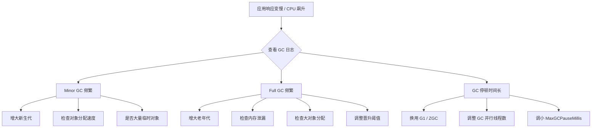

# JVM 垃圾回收（GC）

## ⭐ 面试重点速览

| 知识模块 | 重点内容 | 面试频率 |
|----------|----------|----------|
| GC 算法 | 标记-清除/复制/标记-整理 | 极高 |
| 分代收集 | 新生代 Minor GC vs 老年代 Full GC | 极高 |
| GC 收集器 | CMS/G1/ZGC 对比 | 极高 |
| GC 日志 | 日志格式解读与调优 | 高 |
| GC 参数 | 收集器选择与调优参数 | 高 |
| 实战案例 | OOM 排查、Full GC 频繁优化 | 中高 |

---

## 一、垃圾识别：如何判断对象已死？

### 1.1 引用计数法（Reference Counting）

给每个对象添加一个引用计数器，被引用时 +1，引用失效时 -1，计数为 0 表示可回收。

::: danger 引用计数法的问题
- **循环引用**无法解决：A 引用 B，B 引用 A，即使两者都不再被使用，引用计数也不为 0。
- Android 的智能指针（`sp`/`wp`）使用引用计数，但通过弱引用来解决循环引用问题。
:::

### 1.2 ⭐ 可达性分析算法（Reachability Analysis）

以一组 **GC Roots** 为起点，从这些节点开始向下搜索，搜索所走过的路径称为引用链（Reference Chain）。当一个对象到 GC Roots 之间没有任何引用链时，证明此对象不可用。

```
GC Roots
   │
   ├──▶ 对象A ──▶ 对象B ──▶ 对象C（可达，存活）
   │
   └──▶ 对象D（可达，存活）

对象E 对象F（无 GC Roots 引用链，判定可回收）
```

::: tip GC Roots 包含哪些？
1. 虚拟机栈（栈帧中的局部变量表）中引用的对象
2. 方法区中静态属性引用的对象
3. 方法区中常量引用的对象
4. 本地方法栈中 JNI（Native 方法）引用的对象
5. Java 虚拟机内部的引用（基本数据类型对应的 Class 对象、常驻异常对象等）
6. 所有被同步锁（synchronized）持有的对象
7. JMXBean、JVMTI 中注册的回调等
:::

---

## ⭐ 二、垃圾回收算法

### 2.1 标记-清除算法（Mark-Sweep）

**原理**：先标记所有需要回收的对象，再统一清除。

```
标记阶段：从 GC Roots 出发，标记所有存活对象
清除阶段：遍历整个堆，回收未标记的对象

清除前：[A][ ][B][ ][ ][C]  （A、B、C 是存活对象，[ ] 是垃圾）
清除后：[A][ ][B][ ][ ][C]  （内存碎片化）
```

::: danger 缺点
- **效率问题**：标记和清除两个阶段效率都不高
- **空间问题**：产生大量不连续的内存碎片，可能触发提前 Full GC
:::

### 2.2 ⭐ 标记-复制算法（Mark-Copy）

**原理**：将可用内存分为两块，每次只用一块。GC 时将存活对象复制到另一块，然后一次性清空使用过的那块。

```
复制前：
  使用区：[A][ ][B][C][ ][ ]  （A、B、C 存活）
  空闲区：[ ][ ][ ][ ][ ][ ]

复制后：
  使用区：[ ][ ][ ][ ][ ][ ]  （全部清空）
  空闲区：[A][B][C][ ][ ][ ]  （存活对象紧凑排列）
```

::: tip 为什么适合新生代？
新生代中 98% 的对象都是"朝生夕死"的，每次 GC 只有少量对象存活。因此复制的开销很小。

HotSpot 的实现：Eden 和 Survivor 的比例是 8:1:1，浪费的空间只有 10%。如果存活对象超过 10%，则通过**分配担保机制**将多余对象直接放入老年代。
:::

```java
/**
 * 模拟新生代 Minor GC 中的标记-复制过程（伪代码）
 */
public class CopyAlgorithmSimulation {
    // youngGen[0] = Eden, youngGen[1] = S0(From), youngGen[2] = S1(To)
    private Object[][] youngGen = new Object[3][];

    public void minorGC() {
        // 1. 标记：从 GC Roots 找出 Eden + From 中的所有存活对象
        List<Object> aliveObjects = markAlive(youngGen[0], youngGen[1]);

        // 2. 复制：把存活对象复制到 To 区（紧凑排列）
        for (Object obj : aliveObjects) {
            copyToSurvivor(obj, youngGen[2]);
            // 对象年龄 +1，达到阈值则晋升老年代
        }

        // 3. 清空 Eden 和 From 区
        clear(youngGen[0]);
        clear(youngGen[1]);

        // 4. ⭐ From 和 To 角色互换
        Object[] temp = youngGen[1];
        youngGen[1] = youngGen[2];
        youngGen[2] = temp;
    }

    // 省略辅助方法...
    private List<Object> markAlive(Object[] eden, Object[] from) { return null; }
    private void copyToSurvivor(Object obj, Object[] to) {}
    private void clear(Object[] region) {}
}
```

### 2.3 ⭐ 标记-整理算法（Mark-Compact）

**原理**：标记所有存活对象，然后将存活对象向一端移动，最后清理边界外的内存。

```
整理前：[A][ ][B][ ][ ][C][ ][ ]
              │ 标记存活 A、B、C
              ▼
整理中：[A][B][C][ ][ ][ ][ ][ ]
              │ 清理边界外内存
              ▼
整理后：[A][B][C][ ][ ][ ][ ][ ]
```

::: tip 为什么适合老年代？
老年代中对象存活率高，使用复制算法需要大量复制操作（效率低），且没有额外空间做担保。标记-整理算法避免了内存碎片，但移动对象需要 STW（Stop The World）并更新所有引用，耗时较长。
:::

### 2.4 三色标记法（增量更新 & 原始快照）

现代 GC（CMS、G1、ZGC）普遍使用**三色标记法**进行并发标记：

| 颜色 | 含义 |
|------|------|
| **白色** | 未被标记，GC 结束后会被回收 |
| **灰色** | 已被标记，但其引用的子对象尚未全部标记 |
| **黑色** | 已被标记，且其所有引用的子对象也都标记完成 |

::: danger 并发标记中的漏标问题（Missing Marking）
并发标记时需要同时满足两个条件才会漏标：
1. 赋值器插入了一条或多条从黑色对象到白色对象的新引用
2. 赋值器删除了全部从灰色对象到该白色对象的直接或间接引用

**解决方案**：
- **增量更新（Incremental Update）**：CMS 采用，记录新增引用，重新标记。
- **原始快照（SATB, Snapshot At The Beginning）**：G1 采用，记录删除引用，重新标记。
:::

---

## ⭐ 三、经典垃圾收集器对比

### 3.1 收集器全景图

```
新生代收集器                       老年代收集器
    Serial      ────配对────▶      Serial Old
    ParNew      ────配对────▶      CMS
    Parallel Scavenge ──配对──▶    Parallel Old
    G1（混合收集，同时覆盖新生代和老年代）
    ZGC / Shenandoah（全区域并发收集）
```

### 3.2 各收集器对比

| 收集器 | 代系 | 算法 | 线程 | STW | 适用场景 |
|--------|------|------|------|-----|----------|
| Serial | 新生代 | 标记-复制 | 单线程 | 长 | 客户端应用 |
| ParNew | 新生代 | 标记-复制 | 多线程 | 长 | 配合 CMS 使用 |
| ⭐ Parallel Scavenge | 新生代 | 标记-复制 | 多线程 | 长 | 吞吐量优先 |
| Serial Old | 老年代 | 标记-整理 | 单线程 | 长 | 客户端应用 |
| ⭐ CMS | 老年代 | 标记-清除 | 多线程并发 | 较短 | 低延迟应用 |
| Parallel Old | 老年代 | 标记-整理 | 多线程 | 长 | 配合 Parallel Scavenge |
| ⭐ G1 | 全区域 | 标记-整理+复制 | 多线程并发 | 可控 | 大堆低延迟 |
| ⭐ ZGC | 全区域 | 标记-整理（染色指针） | 多线程并发 | <1ms | 超低延迟 |
| Shenandoah | 全区域 | 标记-整理（Brooks 指针） | 多线程并发 | 极短 | 超低延迟 |

### 3.3 ⭐ CMS 收集器（Concurrent Mark Sweep）

**工作流程**：

```
1. 初始标记（Initial Mark）     STW，标记 GC Roots 直接关联对象
        │
2. 并发标记（Concurrent Mark）  与用户线程并发，从 GC Roots 开始遍历对象图
        │
3. 重新标记（Remark）           STW，修正并发标记期间的变动（增量更新）
        │
4. 并发清除（Concurrent Sweep） 与用户线程并发，清除垃圾对象
```

::: danger CMS 的三大问题
1. **对 CPU 资源敏感**：并发阶段会占用 CPU 资源，降低吞吐量。
2. **浮动垃圾（Floating Garbage）**：并发清除期间用户线程产生的新垃圾只能在下次 GC 回收，可能导致 Concurrent Mode Failure。
3. **内存碎片**：标记-清除算法导致的内存碎片，可能触发 Full GC（使用 Serial Old 做后备）。
:::

### 3.4 ⭐ G1 收集器（Garbage First）

**核心设计**：将堆划分为多个大小相等的 **Region**，每个 Region 可以根据需要扮演 Eden、Survivor 或 Old 角色。

```
+---+---+---+---+---+---+---+---+
| E | S | O | E | O | H | E | S |    Region 类型：
+---+---+---+---+---+---+---+---+    E = Eden
| E | O | E | S | O | E | O | E |    S = Survivor
+---+---+---+---+---+---+---+---+    O = Old
| O | E | O | E | O | S | E | O |    H = Humongous（大对象专用）
+---+---+---+---+---+---+---+---+
```

**工作流程**：

```
1. 初始标记（Initial Mark）       STW，伴随 Young GC 完成
2. 并发标记（Concurrent Mark）    与用户线程并发
3. 最终标记（Final Mark）         STW，SATB 处理
4. 筛选回收（Live Data Counting & Evacuation） STW，复制存活对象到空闲 Region
```

::: tip G1 的核心优势
- **可预测的停顿**：通过 `-XX:MaxGCPauseMillis` 设定目标停顿时间（默认 200ms）
- **Region 化内存**：避免全堆扫描，只回收收益最高的 Region（Garbage First）
- **无内存碎片**：基于标记-复制算法，回收时移动对象到新的 Region
- **Humongous Region**：专门处理超过 Region 一半大小的大对象
:::

### 3.5 ⭐ ZGC 收集器（JDK 11 实验性，JDK 15 正式）

**核心设计**：基于 Region 的并发压缩收集器 + **染色指针（Colored Pointers）**技术。

```
ZGC 的染色指针（64 位指针中的 4 位用于 GC 状态标记）

| 未使用 | Finalizable | Remapped | Marked1 | Marked0 | 对象地址 |
| 18bits |    1bit    |   1bit   |  1bit   |  1bit   |  44bits  |
```

::: tip ZGC 的核心优势
- **超低延迟**：目标停顿时间 < 1ms（JDK 16 实现），< 0.1ms（JDK 21 的 Generational ZGC）
- **支持 TB 级堆**：理论上支持 16TB 堆
- **并发处理**：标记、整理、重定位全部并发
- **染色指针**：直接在指针中存储 GC 状态，不需要额外的对象头开销
- **NUMA 感知**：支持 NUMA 架构的内存分配优化
:::

### 3.6 JDK 版本 GC 演进

| JDK 版本 | 默认 GC |
|----------|---------|
| JDK 8 | Parallel Scavenge + Parallel Old |
| JDK 9 | G1 |
| JDK 11 | G1（ZGC 实验性引入） |
| JDK 15 | G1（ZGC 正式发布） |
| JDK 17（LTS） | G1（推荐生产使用，ZGC 也已成熟） |
| JDK 21（LTS） | G1（Generational ZGC 引入，ZGC 也有分代支持） |

---

## ⭐ 四、GC 日志分析

### 4.1 开启 GC 日志

```bash
# JDK 8 及之前
-XX:+PrintGCDetails
-XX:+PrintGCDateStamps
-Xloggc:/path/to/gc.log

# ⭐ JDK 9+ 统一日志系统
-Xlog:gc*=info:file=/path/to/gc.log:time,level,tags
# gc* 表示所有 GC 相关日志
# info 表示日志级别
```

### 4.2 GC 日志解读示例

```
# JDK 8 CMS 日志示例
2024-01-15T10:30:00.123+0800: [GC (Allocation Failure)
  2024-01-15T10:30:00.123+0800: [ParNew: 279616K->27968K(306688K), 0.0412 secs]
  695162K->483514K(1014528K), 0.0415 secs]
  [Times: user=0.15 sys=0.01, real=0.04 secs]
```

字段解读：

| 字段 | 含义 |
|------|------|
| `GC (Allocation Failure)` | GC 原因：分配失败（Minor GC） |
| `ParNew` | 使用的收集器：ParNew |
| `279616K->27968K` | 新生代 GC 前 → GC 后 使用量 |
| `(306688K)` | 新生代总容量 |
| `695162K->483514K` | 整个堆 GC 前 → GC 后 使用量 |
| `(1014528K)` | 堆总容量 |
| `real=0.04 secs` | 实际停顿时间（STW 时间） |

```
# ⭐ Full GC 日志（需要重点关注）
2024-01-15T10:35:00.456+0800: [Full GC (System.gc())
  2024-01-15T10:35:00.456+0800: [CMS: 512300K->450000K(707840K), 1.2345 secs]
  800000K->450000K(1014528K), [Metaspace: 82000K->82000K(112640K)], 1.2348 secs]
  [Times: user=1.20 sys=0.02, real=1.23 secs]
```

### 4.3 GC 日志分析要点

| 关注指标 | 正常范围 | 异常信号 |
|----------|----------|----------|
| Minor GC 频率 | 几秒到几十秒一次 | 每秒多次 |
| Minor GC 耗时 | < 50ms | > 100ms |
| Full GC 频率 | 几小时/几天一次 | 几分钟一次 |
| Full GC 耗时 | < 1s | > 3s |
| GC 后堆回收量 | 回收了大量空间 | 回收很少（内存泄漏信号） |

---

## 五、常用 GC 参数速查

### 5.1 收集器选择

```bash
# ⭐ 选择 GC 收集器（JDK 8）
-XX:+UseSerialGC                    # Serial + Serial Old
-XX:+UseParNewGC                    # ParNew + Serial Old
-XX:+UseParallelGC                  # Parallel Scavenge + Serial Old
-XX:+UseParallelOldGC               # Parallel Scavenge + Parallel Old
-XX:+UseConcMarkSweepGC             # ParNew + CMS
-XX:+UseG1GC                        # G1

# JDK 11+
-XX:+UseZGC                         # ZGC
-XX:+UseShenandoahGC                # Shenandoah
```

### 5.2 CMS 参数

```bash
-XX:CMSInitiatingOccupancyFraction=75   # 老年代使用 75% 时触发 CMS GC
-XX:+UseCMSInitiatingOccupancyOnly      # 只用设定的阈值触发，不自动调整
-XX:+CMSScavengeBeforeRemark            # Remark 前先做一次 Young GC
-XX:+CMSClassUnloadingEnabled           # CMS 同时回收元空间
-XX:+ExplicitGCInvokesConcurrent        # System.gc() 触发 CMS GC 而非 Full GC
```

### 5.3 G1 参数

```bash
# ⭐ G1 核心参数
-XX:MaxGCPauseMillis=200               # 目标最大停顿时间（毫秒）
-XX:G1HeapRegionSize=4m                # Region 大小（1MB~32MB，应为2的幂）
-XX:InitiatingHeapOccupancyPercent=45  # 堆使用率达到 45% 触发并发标记
-XX:G1NewSizePercent=5                 # 新生代最小占比
-XX:G1MaxNewSizePercent=60             # 新生代最大占比
-XX:G1MixedGCCountTarget=8             # 混合 GC 次数目标
```

### 5.4 ZGC 参数

```bash
-XX:+UseZGC                            # 启用 ZGC
-Xms -Xmx                              # ZGC 建议堆大小一致（避免动态调整）
-XX:ConcGCThreads=4                    # 并发 GC 线程数
-XX:ZCollectionInterval=0              # 最小 GC 间隔（秒），0 为不限制
```

---

## 六、实战：GC 问题排查思路



---

## ⭐ 面试高频问题

### Q1：什么时候触发 Full GC？

| 触发条件 | 说明 |
|----------|------|
| `System.gc()` 调用 | 建议 JVM 执行 Full GC（可通过 `-XX:+DisableExplicitGC` 禁用） |
| 老年代空间不足 | 晋升时老年代空间不足 |
| 方法区空间不足（JDK 7 及之前） | 永久代满了 |
| CMS GC 时 Concurrent Mode Failure | CMS 并发收集时老年代被填满 |
| 空间分配担保失败 | Minor GC 时 Survivor 放不下，老年代也放不下 |

### Q2：CMS 和 G1 的核心区别是什么？

| 维度 | CMS | G1 |
|------|-----|-----|
| 内存布局 | 连续分代 | Region 化内存 |
| 回收算法 | 标记-清除 | 标记-整理+复制 |
| 内存碎片 | 有碎片问题 | 无碎片 |
| 停顿预测 | 不可预测 | 可配置目标停顿时间 |
| 大对象 | 直接进老年代 | 专用 Humongous Region |
| 适用场景 | 4GB 以下堆 | 4GB 以上大堆 |
| JDK 状态 | JDK 14 移除 | JDK 9 起默认 |

### Q3：G1 和 ZGC 如何选择？

| 场景 | 推荐 | 说明 |
|------|------|------|
| 堆 < 4GB | 传统分代 GC | G1/ZGC 优势不明显 |
| 堆 4GB~32GB | G1 | 成熟稳定，JDK 默认 |
| 堆 > 32GB | ZGC | 染色指针技术，超低延迟 |
| 延迟 < 10ms | ZGC / Shenandoah | 亚毫秒级停顿 |
| 延迟 < 100ms | G1 | 大部分场景足够 |
| 极致吞吐量 | Parallel GC | 几乎无并发开销 |

---

## 面试追问环节

**Q：说一个你实际遇到过的 GC 问题和解决方案？**

典型场景：线上服务突然出现不定期的长时间停顿（STW）。

排查过程：
1. 查看监控，发现 Full GC 频繁，每次耗时超过 5 秒
2. 导出 GC 日志分析：`jstat -gcutil <pid> 1000`
3. 发现老年代持续增长，Minor GC 后回收量很少
4. `jmap -dump:live,format=b,file=heap.hprof <pid>` 导出 dump
5. MAT 分析发现：某个缓存 Map 无界增长，导致大量对象无法回收
6. 修复：使用 Guava Cache 或 Caffeine 替代，设置大小限制和过期策略

**Q：什么情况下你会选择禁用 CMS 的后备 Full GC？**

JDK 8 中 CMS 发生 Concurrent Mode Failure 时会退化为 Serial Old 的 Full GC，停顿极长。策略：
- 调低 `CMSInitiatingOccupancyFraction`（如从 92% 调到 75%），让 CMS 更早触发
- 增加 CMS 并发线程数：`-XX:ConcGCThreads`
- 增加老年代空间
- 考虑迁移到 G1（JDK 9+ 默认）

**Q：ZGC 的染色指针为什么能实现超低延迟？**

染色指针将 GC 状态信息直接编码在 64 位指针的几位中，使得：
1. **读屏障极轻量**：指令级检查指针颜色，开销极小
2. **自愈能力**：读屏障发现对象被移动后，直接更新指针，后续访问无需再次修正
3. **并发重定位**：不需要 STW 来移动对象，用户线程访问旧地址时通过读屏障自动重定向