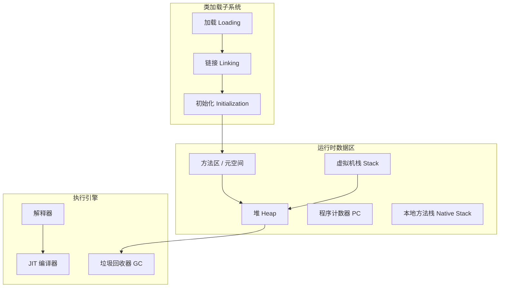

# JVM 概览

## ⭐ 面试重点速览

| 知识模块 | 重点内容 | 面试频率 |
|----------|----------|----------|
| JVM架构 | 类加载、运行时数据区、执行引擎 | 高 |
| 内存模型 | 堆/栈/方法区/元空间 | 极高 |
| 垃圾回收 | GC算法、CMS/G1/ZGC对比 | 极高 |
| 类加载 | 双亲委派、破坏场景 | 高 |
| JVM调优 | 参数、工具、实战案例 | 中高 |

---

## JVM 整体架构

JVM（Java Virtual Machine）是 Java 跨平台的核心保障，其架构分为三个主要子系统：



也可以使用 ASCII 方式理解：

```
+---------------------------------------------------+
|                    Java 源文件 (.java)              |
+-------------------------|--------------------------+
                          | javac 编译
                          v
+---------------------------------------------------+
|                   字节码文件 (.class)               |
+-------------------------|--------------------------+
                          |
                          v
+===================================================+
|              Java 虚拟机 (JVM)                      |
|                                                   |
|  +------------------+   +---------------------+   |
|  |  类加载子系统      |   |   运行时数据区       |   |
|  |  - 加载           |   |   - 方法区/元空间    |   |
|  |  - 链接           |   |   - 堆 (Heap)       |   |
|  |  - 初始化         |   |   - 虚拟机栈         |   |
|  +------------------+   |   - 程序计数器       |   |
|                          |   - 本地方法栈       |   |
|  +------------------+   +---------------------+   |
|  |  执行引擎         |                            |
|  |  - 解释器         |   +---------------------+   |
|  |  - JIT 编译器     |   |  本地方法接口 (JNI)  |   |
|  |  - GC             |   +---------------------+   |
|  +------------------+                            |
+===================================================+
```

---

## 各组件职责

### 1. 类加载子系统（Class Loader SubSystem）

负责将 `.class` 字节码文件加载到 JVM 内存中。

::: tip 类加载三阶段
- **加载（Loading）**：通过类的全限定名获取二进制字节流，将其转化为方法区的运行时数据结构，在堆中生成 `java.lang.Class` 对象。
- **链接（Linking）**：包含验证（字节码合法性）、准备（为静态变量分配内存并赋默认零值）、解析（符号引用转为直接引用）。
- **初始化（Initialization）**：执行类构造器 `<clinit>()` 方法，初始化静态变量为代码中指定的值。
:::

::: danger 面试追问：双亲委派模型
**Q：什么是双亲委派模型？为什么需要它？**

双亲委派模型要求：一个类加载器收到加载请求时，先将请求委派给父加载器，只有父加载器无法完成时才自己尝试加载。

**为什么需要？**
- 避免类的重复加载，确保同一个类在 JVM 中是唯一的
- 保护核心 API 不被篡改（例如不能自定义 `java.lang.String` 替换 JDK 的 String）

**Q：有哪些破坏双亲委派的场景？**
- JDBC 的 `DriverManager`：使用线程上下文类加载器（Thread Context ClassLoader）
- Tomcat 的 WebappClassLoader：每个 Web 应用使用独立的类加载器实现隔离
- OSGi 模块化框架

**Q：自定义类加载器的步骤？**
```java
// 自定义类加载器 —— 继承 ClassLoader，重写 findClass 方法
public class MyClassLoader extends ClassLoader {
    @Override
    protected Class<?> findClass(String name) throws ClassNotFoundException {
        // 1. 读取 .class 文件的字节码
        byte[] classData = loadClassData(name);
        // 2. 调用 defineClass 将字节码转换为 Class 对象
        return defineClass(name, classData, 0, classData.length);
    }

    private byte[] loadClassData(String className) {
        // 从自定义路径读取 class 文件的字节码
        // ... 实现省略
        return new byte[0];
    }
}
```
:::

### 2. 运行时数据区（Runtime Data Area）

JVM 内存管理的核心，各区域职责如下：

| 区域 | 线程共享 | 存储内容 | OOM 场景 |
|------|----------|----------|----------|
| ⭐ 堆（Heap） | 是 | 对象实例、数组 | `java.lang.OutOfMemoryError: Java heap space` |
| 方法区/元空间 | 是 | 类信息、常量、静态变量 | `java.lang.OutOfMemoryError: Metaspace` |
| 虚拟机栈 | 否 | 栈帧（局部变量表、操作数栈等） | `StackOverflowError` |
| 程序计数器 | 否 | 当前线程执行的字节码行号 | 不会 OOM（唯一不会 OOM 的区域） |
| 本地方法栈 | 否 | Native 方法调用 | `StackOverflowError` |

::: warning 面试追问：JDK 8 为什么用元空间替代永久代？
- **永久代问题**：永久代大小固定（`-XX:MaxPermSize`），容易 OOM；且永久代属于堆，GC 复杂。
- **元空间优势**：使用本地内存（Native Memory），默认不设上限（受系统内存限制）；类的元数据分配更灵活，避免了永久代 OOM。
- **迁移影响**：`-XX:PermSize` 和 `-XX:MaxPermSize` 被 `-XX:MetaspaceSize` 和 `-XX:MaxMetaspaceSize` 替代；字符串常量池从永久代移到堆。
:::

### 3. 执行引擎（Execution Engine）

| 组件 | 职责 |
|------|------|
| 解释器（Interpreter） | 逐条解释字节码执行，启动快但运行慢 |
| JIT 编译器（Just-In-Time） | 将热点代码编译为本地机器码，提高执行效率 |
| ⭐ 垃圾回收器（GC） | 自动管理堆内存，回收不再使用的对象 |

::: tip JIT 编译优化
- **C1 编译器（Client Compiler）**：启动快、编译快，优化程度较低。
- **C2 编译器（Server Compiler）**：编译慢，但生成的代码优化程度高，运行效率高。
- **分层编译（Tiered Compilation）**：JDK 7 引入，结合 C1 和 C2 的优点，先用 C1 快速编译，再用 C2 深度优化。
:::

---

## ⭐ 面试高频问题汇总

### Q1：JVM 如何确定一个对象是否可被回收？

引用计数法（不用于主流 JVM）和 **可达性分析算法**（GC Roots）。

GC Roots 包括：
- 虚拟机栈中引用的对象
- 方法区中静态属性引用的对象
- 方法区中常量引用的对象
- 本地方法栈中 JNI 引用的对象
- 所有被同步锁持有的对象

### Q2：强引用、软引用、弱引用、虚引用有什么区别？

```java
// 强引用 —— 最常见的引用，只要强引用存在，GC 永远不会回收
Object strongRef = new Object();

// ⭐ 软引用 —— 内存不足时会被回收，适合做缓存
SoftReference<Object> softRef = new SoftReference<>(new Object());

// ⭐ 弱引用 —— 下一次 GC 时必定被回收，适合 WeakHashMap
WeakReference<Object> weakRef = new WeakReference<>(new Object());

// 虚引用 —— 无法通过虚引用获取对象，唯一用途是在对象被回收时收到通知
ReferenceQueue<Object> queue = new ReferenceQueue<>();
PhantomReference<Object> phantomRef = new PhantomReference<>(new Object(), queue);
```

### Q3：如何排查 JVM 内存问题？

| 工具 | 用途 |
|------|------|
| `jps` | 查看 Java 进程 PID |
| `jstat` | 监控 GC 和类加载统计 |
| `jmap` | 生成堆 dump 文件 |
| `jstack` | 查看线程堆栈，排查死锁 |
| `jconsole` / `jvisualvm` | 可视化监控 |
| `MAT` / `JProfiler` | 堆 dump 分析 |
| `Arthas`（阿里开源） | 在线诊断 |

---

## 面试追问环节

**Q：说下你对 Java "一次编写、到处运行" 的理解？**

JVM 充当了中间层：Java 源码编译为平台无关的字节码（`.class`），不同操作系统上的 JVM 将字节码解释/编译为本地机器码执行。关键不在于 Java 本身跨平台，而在于**不同平台都有各自的 JVM 实现**。

**Q：JVM 是栈式虚拟机还是寄存器式虚拟机？有什么影响？**

JVM 是基于栈的指令集架构（零地址指令），而 Dalvik（Android）是基于寄存器的。

基于栈：
- 指令紧凑，但指令数量多
- 不需要考虑寄存器分配，实现简单
- 可移植性好

基于寄存器：
- 指令数量少，执行速度快
- 受限于物理寄存器数量

**Q：如果在不应出现 OOM 的地方出现了 OOM，你如何排查？**

1. `jps -l` 获取进程 PID
2. `jstat -gcutil <pid> 1000` 观察 GC 频率和各区域使用率
3. `jmap -dump:live,format=b,file=heap.hprof <pid>` 导出堆 dump
4. 使用 MAT 分析大对象和 GC Roots 路径
5. 检查代码中是否存在内存泄漏（如静态集合、未关闭的资源等）
6. 根据分析结果调整堆大小或修复代码