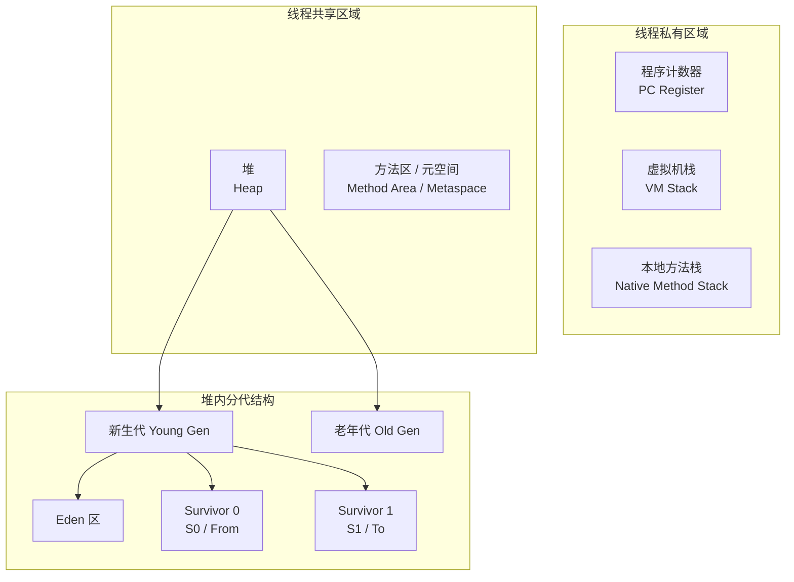

# JVM 内存模型

## ⭐ 面试重点速览

| 知识模块 | 重点内容 | 面试频率 |
|----------|----------|----------|
| 堆（Heap） | 分代结构、对象分配、TLAB | 极高 |
| 虚拟机栈 | 栈帧结构、StackOverflowError | 高 |
| 方法区/元空间 | 存储内容、MetaSpace OOM | 中高 |
| 程序计数器 | 线程私有、不会OOM | 低 |
| 本地方法栈 | Native方法调用 | 低 |
| 直接内存 | NIO、零拷贝 | 中 |

---

## JVM 内存区域全景



---

## ⭐ 一、堆（Heap）

### 1.1 原理

堆是 JVM 管理的最大一块内存，**所有线程共享**，在虚拟机启动时创建。几乎所有的对象实例和数组都在堆上分配。

::: tip 堆的分代结构（分代收集理论）
堆内存分为**新生代（Young Generation）**和**老年代（Old Generation）**：

- **新生代（默认占堆的 1/3）**：
  - **Eden 区**（默认占新生代的 8/10）：大多数新对象在此分配
  - **Survivor 0 / From 区**（默认占 1/10）
  - **Survivor 1 / To 区**（默认占 1/10）
- **老年代（默认占堆的 2/3）**：存放长期存活的对象和大对象
:::

### 1.2 对象分配与晋升流程

```
新对象创建
    │
    ▼
┌──────────────┐
│ 是否大对象？  │──是──▶ 直接进入老年代（-XX:PretenureSizeThreshold）
└──────┬───────┘
       │否
       ▼
┌──────────────┐
│ TLAB 分配？  │──是──▶ 在 TLAB 中分配
└──────┬───────┘
       │否
       ▼
┌──────────────────┐
│ 在 Eden 区分配   │
└────────┬─────────┘
         │ Eden 满了触发 Minor GC
         ▼
┌──────────────────────────┐
│ 存活对象进入 Survivor 区 │──▶ 每熬过一次 GC，年龄 +1
└──────────┬───────────────┘
           │ 年龄达到阈值（默认15）
           ▼
       进入老年代
```

::: tip TLAB（Thread Local Allocation Buffer）
TLAB 是线程私有的分配缓冲区，位于 Eden 区。它的存在是为了**避免多线程分配对象时的锁竞争**。每个线程在 Eden 区独占一小块区域（TLAB），在 TLAB 中分配对象不需要加锁。

- 参数：`-XX:+UseTLAB`（默认开启）
- TLAB 大小：`-XX:TLABSize`
:::

### 1.3 代码示例

```java
/**
 * 演示堆内存分配和 OOM
 * VM 参数：-Xms20m -Xmx20m -XX:+HeapDumpOnOutOfMemoryError
 */
public class HeapOOMDemo {
    public static void main(String[] args) {
        // 不断创建大对象，最终触发 OOM
        // 注意：-Xms20m -Xmx20m 将堆固定为 20MB
        java.util.List<byte[]> list = new java.util.ArrayList<>();
        while (true) {
            // 每次分配 1MB
            list.add(new byte[1024 * 1024]);
        }
        // 输出：java.lang.OutOfMemoryError: Java heap space
    }
}
```

### 1.4 OOM 场景

| 场景 | 错误信息 | 原因 | 解决方向 |
|------|----------|------|----------|
| 堆空间不足 | `Java heap space` | 创建了过多对象或大对象 | 增大堆内存或排查内存泄漏 |
| GC Overhead | `GC overhead limit exceeded` | GC 时间超过总时间的 98%，但回收了不到 2% 的堆 | 增大堆或优化代码 |
| 数组分配 | `Requested array size exceeds VM limit` | 尝试创建超大数据（接近 Integer.MAX_VALUE） | 检查业务逻辑 |

### 1.5 调优参数

```bash
# ⭐ 核心堆参数
-Xms<size>              # 初始堆大小（如 -Xms2g）
-Xmx<size>              # 最大堆大小（如 -Xmx4g）
-Xmn<size>              # 新生代大小（一般不直接设置）

# 新生代比例
-XX:NewRatio=2          # 老年代:新生代 = 2:1（即新生代占 1/3）
-XX:SurvivorRatio=8     # Eden:S0:S1 = 8:1:1

# ⭐ 直接进入老年代的阈值
-XX:PretenureSizeThreshold=3145728  # 大对象超过 3MB 直接进老年代
-XX:MaxTenuringThreshold=15         # 晋升老年代的年龄阈值（CMS 默认为 6）

# ⭐ OOM 时自动 dump
-XX:+HeapDumpOnOutOfMemoryError
-XX:HeapDumpPath=/path/to/dump
```

---

## ⭐ 二、虚拟机栈（VM Stack）

### 2.1 原理

每个线程都有自己的虚拟机栈，栈中存储的是**栈帧（Stack Frame）**。每调用一个方法就创建一个栈帧并入栈，方法返回则出栈。

### 2.2 栈帧结构

| 组成部分 | 说明 |
|----------|------|
| ⭐ 局部变量表（Local Variable Table） | 存储方法参数和方法内定义的局部变量（基本类型、对象引用、returnAddress） |
| 操作数栈（Operand Stack） | 字节码指令执行时的操作区域 |
| 动态链接（Dynamic Linking） | 指向运行时常量池中该栈帧所属方法的引用 |
| 方法返回地址（Return Address） | 方法正常退出或异常退出的返回地址 |

### 2.3 局部变量表的槽位复用

```java
/**
 * 演示局部变量表的槽位复用
 * 编译后用 javap -v 查看字节码可以验证
 */
public class SlotReuseDemo {
    public void test() {
        // 槽位 0：this（非静态方法默认）
        // 槽位 1：a
        int a = 10;
        {
            // 槽位 2：b
            int b = 20;
            // b 的作用域结束，槽位 2 可以被复用
        }
        // 槽位 2：c（复用了 b 的槽位）
        int c = 30;
    }
}
```

### 2.4 StackOverflowError 示例

```java
/**
 * 演示递归调用导致的 StackOverflowError
 * VM 参数：-Xss256k（将栈大小设置为 256KB 以加速触发）
 */
public class StackOverflowDemo {
    private int depth = 0;

    public void recurse() {
        depth++;
        recurse();
    }

    public static void main(String[] args) {
        StackOverflowDemo demo = new StackOverflowDemo();
        try {
            demo.recurse();
        } catch (StackOverflowError e) {
            System.out.println("递归深度：" + demo.depth);
            // 输出类似：递归深度：1866（取决于 -Xss 设置）
        }
    }
}
```

---

## 三、方法区 / 元空间（Method Area / Metaspace）

### 3.1 原理

方法区存储**类信息、运行时常量池、静态变量、JIT 编译后的代码缓存**等。JDK 8 之前叫"永久代（PermGen）"，JDK 8 之后改为元空间（Metaspace）。

::: warning JDK 版本差异
| 版本 | 实现 | 内存位置 | 参数 |
|------|------|----------|------|
| JDK 7 及以前 | 永久代（PermGen） | 堆内存中 | `-XX:PermSize` / `-XX:MaxPermSize` |
| JDK 8+ | 元空间（Metaspace） | 本地内存（Native Memory） | `-XX:MetaspaceSize` / `-XX:MaxMetaspaceSize` |
:::

### 3.2 运行时常量池

运行时常量池是方法区的一部分，存放编译期生成的各种**字面量**和**符号引用**。

```java
/**
 * 演示字符串常量池（JDK 7+ 已移到堆中）
 */
public class StringPoolDemo {
    public static void main(String[] args) {
        String s1 = "hello";           // 放入字符串常量池
        String s2 = "hello";           // 从常量池中直接获取，与 s1 为同一对象
        String s3 = new String("hello"); // 在堆中创建新对象，不会放入常量池
        String s4 = s3.intern();       // 手动将 s3 的值放入常量池

        System.out.println(s1 == s2);  // true  —— 都是常量池的引用
        System.out.println(s1 == s3);  // false —— s3 是堆上的新对象
        System.out.println(s1 == s4);  // true  —— s4 通过 intern() 获取常量池引用
    }
}
```

### 3.3 Metaspace OOM 示例

```java
/**
 * 演示元空间 OOM
 * VM 参数：-XX:MaxMetaspaceSize=10m -XX:MetaspaceSize=10m
 * 使用 CGLIB 动态生成类来填满元空间
 */
public class MetaspaceOOMDemo {
    public static void main(String[] args) {
        // 注意：此示例需要 CGLIB 依赖
        // 也可用 JDK 动态代理触发，效果类似
        int i = 0;
        try {
            while (true) {
                // 动态生成类，不断填满元空间
                // 这里省略具体实现，思路是通过 Enhancer/Proxy 动态创建类
                i++;
            }
        } catch (OutOfMemoryError e) {
            System.out.println("创建了 " + i + " 个类后 OOM");
            // java.lang.OutOfMemoryError: Metaspace
        }
    }
}
```

---

## 四、程序计数器（PC Register）

### 4.1 原理

程序计数器是一块很小的内存空间，**线程私有**，记录当前线程正在执行的字节码指令地址。

::: tip 为什么程序计数器是唯一不会 OOM 的区域？
- 程序计数器只存储一个整数（字节码行号指针）
- 大小在编译期就确定，不会随着运行动态增长
- JVM 规范中没有规定任何 OOM 情况
:::

---

## 五、本地方法栈（Native Method Stack）

### 5.1 原理

为 JVM 调用 **Native 方法**服务（即非 Java 实现的方法，通常用 C/C++ 实现）。HotSpot VM 中直接把本地方法栈和虚拟机栈合二为一。

```java
// Native 方法声明示例
public class NativeDemo {
    // 声明 native 方法，由 C/C++ 实现
    public native void nativeMethod();

    static {
        // 加载 native 库
        System.loadLibrary("nativeLib");
    }
}
```

---

## 六、直接内存（Direct Memory）

### 6.1 原理

直接内存不是 JVM 运行时数据区的一部分，但在 NIO 中被频繁使用。通过 `ByteBuffer.allocateDirect()` 分配，它绕过了 JVM 堆，直接在操作系统层面分配内存。

::: danger 直接内存 OOM
直接内存不受 `-Xmx` 限制，但受操作系统物理内存限制。如果直接内存使用过多，即使堆还有空闲，也可能 OOM：

```
java.lang.OutOfMemoryError: Direct buffer memory
```

调优参数：`-XX:MaxDirectMemorySize=<size>`
:::

```java
import java.nio.ByteBuffer;

public class DirectMemoryDemo {
    public static void main(String[] args) {
        // 分配 128MB 直接内存（非堆内存）
        ByteBuffer directBuffer = ByteBuffer.allocateDirect(128 * 1024 * 1024);

        // 读写直接内存
        directBuffer.putInt(42);
        directBuffer.flip();
        System.out.println(directBuffer.getInt());  // 42
    }
}
```

---

## ⭐ 面试高频问题汇总

### Q1：对象在堆中的内存布局是怎样的？

一个 Java 对象在堆中分为三部分：

| 部分 | 说明 | 大小 |
|------|------|------|
| 对象头（Header） | Mark Word（哈希码、GC 分代年龄、锁状态）+ 类型指针 | 32位 JVM：8字节；64位 JVM：16字节（开启压缩指针12字节） |
| 实例数据（Instance Data） | 各字段的值 | 取决于字段类型 |
| 对齐填充（Padding） | 保证对象大小是8字节的整数倍 | 不定 |

### Q2：逃逸分析是什么？有什么用？

**逃逸分析**是 JIT 编译器的一种优化技术，分析对象的作用域：

```java
public class EscapeAnalysisDemo {
    // 对象发生逃逸 —— 返回给了外部
    public Object escape() {
        return new Object();
    }

    // ⭐ 对象未逃逸 —— 仅在方法内使用
    public void noEscape() {
        Object obj = new Object();
        // obj 仅在方法内使用
    }
}
```

未逃逸对象的优化：
- **栈上分配**：对象在栈帧中分配，方法结束自动销毁，无需 GC
- **标量替换**：将对象的字段拆解为基本类型，进一步优化
- **同步消除**：如果对象未逃逸，其上的同步操作可以去掉

### Q3：如何排查内存泄漏？

```java
/**
 * 演示一个典型的内存泄漏场景
 */
public class MemoryLeakDemo {
    // ⚠️ 静态集合持有对象引用，导致无法被 GC
    private static java.util.List<Object> leakList = new java.util.ArrayList<>();

    public void addData() {
        Object data = new byte[10 * 1024 * 1024]; // 10MB
        leakList.add(data); // 对象被静态集合引用，永远不会被回收
    }
}
```

排查步骤：
1. `jps -l` 获取进程 PID
2. `jstat -gcutil <pid> 1000 10` 观察老年代持续增长
3. `jmap -dump:live,format=b,file=heap.hprof <pid>` 导出堆 dump
4. 使用 MAT 分析，查看 **Leak Suspects** 报告
5. 追踪 GC Root 引用链，定位泄漏源头

---

## 调优参数速查表

| 参数 | 说明 | 示例 |
|------|------|------|
| `-Xms` | 初始堆大小 | `-Xms2g` |
| `-Xmx` | 最大堆大小 | `-Xmx4g` |
| `-Xss` | 线程栈大小 | `-Xss256k` |
| `-XX:MetaspaceSize` | 元空间初始大小 | `-XX:MetaspaceSize=128m` |
| `-XX:MaxMetaspaceSize` | 元空间最大大小 | `-XX:MaxMetaspaceSize=256m` |
| `-XX:MaxDirectMemorySize` | 最大直接内存 | `-XX:MaxDirectMemorySize=512m` |
| `-XX:+HeapDumpOnOutOfMemoryError` | OOM 时自动 dump | — |
| `-XX:HeapDumpPath` | dump 文件路径 | `-XX:HeapDumpPath=/tmp/dump` |

---

## 面试追问环节

**Q：String 的 intern() 方法在 JDK 6 和 JDK 7/8 中的行为有什么区别？**

- **JDK 6**：`intern()` 会将字符串复制到永久代的字符串常量池中。
- **JDK 7/8**：字符串常量池移到堆中，`intern()` 只在常量池记录首次出现的引用，不再复制。

```java
String s1 = new StringBuilder("ja").append("va").toString();
System.out.println(s1.intern() == s1); // JDK 6: false  JDK 7/8: false
// 因为 "java" 早就被 JVM 加载时放入常量池了

String s2 = new StringBuilder("hello").append("world").toString();
System.out.println(s2.intern() == s2); // JDK 6: false  JDK 7/8: true
// 因为 "helloworld" 首次出现在堆上，intern 记录的就是这个堆对象的引用
```

**Q：方法区/元空间和堆的关系是什么？它们有交集吗？**

- 它们是 JVM 规范中逻辑上独立的两块区域，没有交集。
- 但在 HotSpot 的实现中，字符串常量池（属于方法区逻辑概念）在 JDK 7+ 后实际存放在堆中。
- 类的静态变量也存储在堆中（Class 对象在堆中）。

**Q：为什么 Survivor 区要有两个（From 和 To）？**

两个 Survivor 区是为了配合**标记-复制算法**：
- 每次 Minor GC 时，Eden 和 From 中的存活对象被复制到 To 区
- 复制完成后，From 和 To 的角色互换
- 这样始终保持一个 Survivor 区是空的，避免了内存碎片