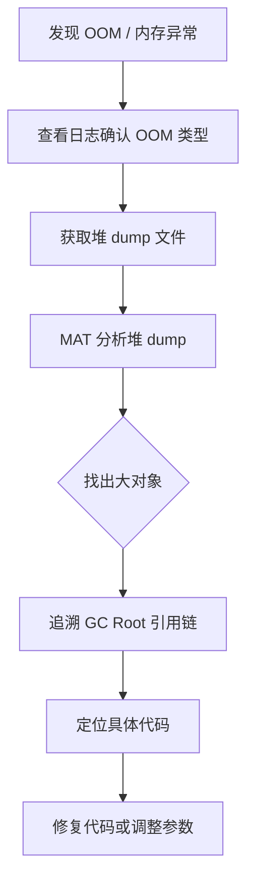
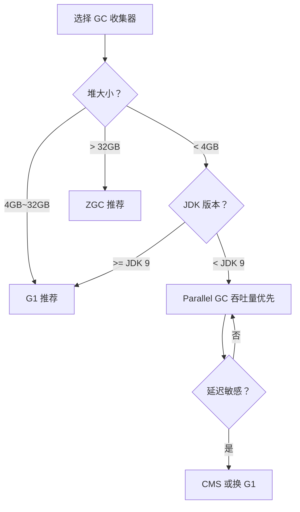

# JVM 性能调优

## ⭐ 面试重点速览

| 知识模块 | 重点内容 | 面试频率 |
|----------|----------|----------|
| JVM 参数 | 堆/栈/元空间/GC 参数配置 | 高 |
| GC 日志 | 日志格式解读、关键指标分析 | 极高 |
| 监控工具 | jps/jstat/jmap/jstack/MAT/Arthas | 极高 |
| OOM 排查 | 堆溢出/Metaspace溢出/StackOverflow 诊断 | 极高 |
| 调优实战 | 收集器选择、参数调优、案例分析 | 中高 |

---

## 一、JVM 参数分类

### 1.1 参数类型

| 参数类型 | 格式 | 示例 |
|----------|------|------|
| 标准参数 | `-` 开头 | `-version`、`-server`、`-Xms` |
| 非标准参数 | `-X` 开头 | `-Xms2g`、`-Xmx4g`、`-Xss256k` |
| 不稳定参数 | `-XX:` 开头 | `-XX:+UseG1GC`、`-XX:MaxGCPauseMillis=200` |

### 1.2 ⭐ 核心参数速查表

#### 堆内存参数

```bash
# ⭐ 核心堆参数
-Xms<size>              # 初始堆大小，如 -Xms2g
-Xmx<size>              # 最大堆大小，如 -Xmx4g
-Xmn<size>              # 新生代大小（一般不建议直接设置，用比例控制）

# 新生代比例
-XX:NewRatio=2          # 老年代:新生代 = 2:1（新生代占堆的 1/3）
-XX:SurvivorRatio=8     # Eden:S0:S1 = 8:1:1

# 大对象与晋升
-XX:PretenureSizeThreshold=3145728  # 超过 3MB 的对象直接进老年代
-XX:MaxTenuringThreshold=15         # 晋升老年代的最大年龄阈值
```

#### 栈与元空间参数

```bash
# 栈
-Xss256k                # 每个线程的栈大小

# 元空间（JDK 8+）
-XX:MetaspaceSize=128m          # 初始元空间大小
-XX:MaxMetaspaceSize=256m       # 最大元空间大小
-XX:MaxDirectMemorySize=512m    # 最大直接内存
```

#### GC 相关参数

```bash
# ⭐ GC 选择
-XX:+UseSerialGC                    # Serial + Serial Old
-XX:+UseParallelGC                  # Parallel Scavenge + Parallel Old（JDK 8 默认）
-XX:+UseConcMarkSweepGC             # ParNew + CMS
-XX:+UseG1GC                        # G1（JDK 9+ 默认）
-XX:+UseZGC                         # ZGC（JDK 11+）

# ⭐ G1 核心参数
-XX:MaxGCPauseMillis=200            # 目标最大停顿时间（毫秒）
-XX:G1HeapRegionSize=4m             # Region 大小（1MB~32MB，应为 2 的幂）
-XX:InitiatingHeapOccupancyPercent=45  # 堆使用率触发并发标记的阈值

# CMS 核心参数
-XX:CMSInitiatingOccupancyFraction=75  # 老年代使用率触发 CMS GC 的阈值
-XX:+UseCMSInitiatingOccupancyOnly      # 只用设定的阈值触发
-XX:+CMSScavengeBeforeRemark            # Remark 前先做一次 Young GC

# 通用 GC 参数
-XX:ParallelGCThreads=4             # 并行 GC 线程数
-XX:ConcGCThreads=2                 # 并发 GC 线程数
```

#### 诊断与调试参数

```bash
# ⭐ OOM 自动 dump
-XX:+HeapDumpOnOutOfMemoryError
-XX:HeapDumpPath=/path/to/dump

# ⭐ GC 日志（JDK 8）
-XX:+PrintGCDetails
-XX:+PrintGCDateStamps
-Xloggc:/path/to/gc.log

# ⭐ GC 日志（JDK 9+ 统一日志）
-Xlog:gc*=info:file=/path/to/gc.log:time,level,tags

# 打印 JVM 默认参数
-XX:+PrintFlagsFinal
-XX:+PrintCommandLineFlags
```

---

## ⭐ 二、GC 日志解读

### 2.1 GC 日志格式

```
# Young GC 日志示例（JDK 8 + ParNew）
2024-01-15T10:30:00.123+0800: 125.456: [GC (Allocation Failure)
  2024-01-15T10:30:00.123+0800: 125.456: [ParNew: 279616K->27968K(306688K), 0.0412 secs]
  695162K->483514K(1014528K), 0.0415 secs]
  [Times: user=0.15 sys=0.01, real=0.04 secs]
```

::: tip 字段解读
| 字段 | 含义 |
|------|------|
| `2024-01-15T10:30:00.123+0800` | GC 发生时间 |
| `125.456` | JVM 启动后经过的秒数 |
| `GC (Allocation Failure)` | GC 类型和原因：分配失败触发的 Young GC |
| `ParNew` | 使用的收集器 |
| `279616K->27968K` | 新生代 GC 前 → GC 后 使用量 |
| `(306688K)` | 新生代总容量 |
| `695162K->483514K` | 整个堆 GC 前 → GC 后 使用量 |
| `(1014528K)` | 堆总容量 |
| `real=0.04 secs` | 实际停顿时间（STW 时间） |
:::

```
# Full GC 日志示例（需要重点关注）
2024-01-15T10:35:00.456+0800: 425.789: [Full GC (System.gc())
  2024-01-15T10:35:00.456+0800: 425.789: [CMS: 512300K->450000K(707840K), 1.2345 secs]
  800000K->450000K(1014528K), [Metaspace: 82000K->82000K(112640K)], 1.2348 secs]
  [Times: user=1.20 sys=0.02, real=1.23 secs]
```

### 2.2 GC 日志分析要点

| 关注指标 | 正常范围 | 异常信号 |
|----------|----------|----------|
| Minor GC 频率 | 几秒到几十秒一次 | 每秒多次 |
| Minor GC 耗时 | < 50ms | > 100ms |
| Full GC 频率 | 几小时/几天一次 | 几分钟一次 |
| Full GC 耗时 | < 1s | > 3s |
| GC 后堆回收量 | 大量回收 | 回收很少（内存泄漏信号） |
| 老年代持续增长 | 缓慢增长 | 持续增长不回落（泄漏） |

### 2.3 G1 GC 日志示例

```
# G1 Young GC
[GC pause (G1 Evacuation Pause) (young), 0.0234567 secs]
   [Parallel Time: 22.3 ms, GC Workers: 4]
   [GC Worker Start: ...]
   [Eden: 512.0M(512.0M)->0.0B(512.0M) Survivors: 64.0M->64.0M Heap: 2048.0M(4096.0M)->1536.0M(4096.0M)]

# G1 Mixed GC
[GC pause (G1 Evacuation Pause) (mixed), 0.0456789 secs]
   [Eden: 512.0M(512.0M)->0.0B(512.0M) Survivors: 64.0M->48.0M Heap: 3584.0M(4096.0M)->2048.0M(4096.0M)]
```

---

## ⭐ 三、监控工具

### 3.1 JDK 自带命令行工具

| 工具 | 用途 | 常用命令 |
|------|------|----------|
| `jps` | 查看 Java 进程 PID | `jps -l` |
| `jstat` | 监控 GC 和类加载统计 | `jstat -gcutil <pid> 1000 10` |
| `jmap` | 生成堆 dump 文件 | `jmap -dump:live,format=b,file=heap.hprof <pid>` |
| `jstack` | 查看线程堆栈，排查死锁 | `jstack <pid>` |
| `jinfo` | 查看 JVM 运行参数 | `jinfo -flags <pid>` |
| `jcmd` | 综合诊断命令 | `jcmd <pid> GC.heap_dump heap.hprof` |

#### jstat 使用详解

```bash
# ⭐ 最常用的命令：每秒打印一次 GC 统计，共 10 次
jstat -gcutil <pid> 1000 10

# 输出示例：
#  S0     S1     E      O      M     CCS    YGC     YGCT    FGC    FGCT     GCT
#  0.00  99.80  56.72  45.33  92.15  88.20   1234   12.345    5     2.345   14.690
```

| 列名 | 含义 |
|------|------|
| S0/S1 | Survivor 0/1 区使用百分比 |
| E | Eden 区使用百分比 |
| O | 老年代使用百分比 |
| M | 元空间使用百分比 |
| YGC | Young GC 次数 |
| YGCT | Young GC 总耗时 |
| FGC | Full GC 次数 |
| FGCT | Full GC 总耗时 |
| GCT | 所有 GC 总耗时 |

#### jstack 排查死锁

```bash
# 打印线程堆栈
jstack <pid>

# 死锁检测：jstack 会自动检测死锁并输出
# Found one Java-level deadlock:
# =============================
# "Thread-1":
#   waiting to lock monitor 0x00007f8e3c00a4d8 (Object@0x...)
#   which is held by "Thread-0"
# "Thread-0":
#   waiting to lock monitor 0x00007f8e3c00a5f8 (Object@0x...)
#   which is held by "Thread-1"
```

### 3.2 ⭐ MAT（Memory Analyzer Tool）

MAT 是 Eclipse 开源的堆 dump 分析工具，用于定位内存泄漏。

```bash
# 1. 导出堆 dump
jmap -dump:live,format=b,file=heap.hprof <pid>

# 2. 用 MAT 打开 heap.hprof 分析
```

**MAT 分析要点**：
- **Leak Suspects Report**：自动检测可能的内存泄漏点
- **Histogram**：按类统计对象数量和内存占用
- **Dominator Tree**：查看哪些对象持有最多内存
- **GC Roots 路径**：追踪引用链，定位为什么对象没有被回收

```java
/**
 * 典型内存泄漏场景 —— 静态集合持有对象引用
 */
public class MemoryLeakDemo {
    // ⚠️ 静态集合导致对象永远无法被 GC
    private static List<byte[]> leakList = new ArrayList<>();

    public void addData() {
        // 每次添加 10MB，永远不会释放
        leakList.add(new byte[10 * 1024 * 1024]);
    }
}
// MAT 分析结果：ArrayList 中的 byte[] 占据大量内存，追溯 GC Root 到静态字段
```

### 3.3 ⭐ Arthas（阿里开源诊断工具）

```bash
# 启动 Arthas
curl -O https://arthas.aliyun.com/arthas-boot.jar
java -jar arthas-boot.jar

# ⭐ 常用命令
dashboard           # 实时面板：线程、内存、GC、运行时信息
thread              # 查看线程堆栈，thread -b 查找死锁
thread -n 3         # 查看 CPU 占用最高的 3 个线程
jad com.example.X   # 反编译指定类
watch com.example.X method '{params, returnObj}'  # 观察方法调用
heapdump /tmp/dump.hprof  # 导出堆 dump
vmtool --action getInstances --className com.example.User --limit 10  # 查看对象实例
```

::: tip Arthas 典型使用场景
- **CPU 飙升排查**：`dashboard` 查看 CPU 占用 → `thread -n 3` 找到热点线程 → `jad` 反编译确认
- **死锁排查**：`thread -b` 一键检测死锁
- **方法耗时分析**：`trace com.example.Service method` 追踪方法调用链耗时
- **热更新代码**：`redefine /tmp/NewClass.class` 不重启替换类
:::

---

## ⭐ 四、OOM 排查实战

### 4.1 常见 OOM 类型

| OOM 类型 | 错误信息 | 常见原因 |
|----------|----------|----------|
| Java heap space | `OutOfMemoryError: Java heap space` | 堆内存不足，对象创建过多或内存泄漏 |
| GC overhead limit | `OutOfMemoryError: GC overhead limit exceeded` | GC 时间超过 98%，但回收不到 2% 堆 |
| Metaspace | `OutOfMemoryError: Metaspace` | 加载了过多类（动态代理/CGLIB 过多） |
| Direct buffer | `OutOfMemoryError: Direct buffer memory` | 直接内存分配过多 |
| Unable to create thread | `OutOfMemoryError: unable to create native thread` | 线程数超限（每个线程占用栈内存） |

### 4.2 ⭐ OOM 排查流程



### 4.3 实战案例

**场景一：堆内存溢出**

```java
/**
 * 模拟堆内存溢出
 * VM 参数：-Xms20m -Xmx20m -XX:+HeapDumpOnOutOfMemoryError
 */
public class HeapOOMCase {
    public static void main(String[] args) {
        List<byte[]> list = new ArrayList<>();
        while (true) {
            list.add(new byte[1024 * 1024]);  // 每次分配 1MB
        }
        // OutOfMemoryError: Java heap space
    }
}
```

排查步骤：
1. `jps -l` 获取进程 PID
2. `jstat -gcutil <pid> 1000` 观察老年代持续增长不复回落
3. 自动 dump 或 `jmap -dump:live,format=b,file=heap.hprof <pid>`
4. MAT 分析 → Leak Suspects 报告 → 定位到 `ArrayList` 持有大量 `byte[]`
5. 修复：使用缓存替代无限增长的集合

**场景二：元空间溢出**

```java
/**
 * 模拟元空间溢出（CGLIB 动态生成类）
 * VM 参数：-XX:MaxMetaspaceSize=10m
 */
public class MetaspaceOOMCase {
    public static void main(String[] args) {
        int i = 0;
        try {
            while (true) {
                // 使用 CGLIB 或 JDK 动态代理不断生成类
                Enhancer enhancer = new Enhancer();
                enhancer.setSuperclass(OOMObject.class);
                enhancer.setUseCache(false);
                enhancer.setCallback((MethodInterceptor) (obj, method, args1, proxy) -> proxy.invokeSuper(obj, args1));
                enhancer.create();
                i++;
            }
        } catch (OutOfMemoryError e) {
            System.out.println("创建了 " + i + " 个类后 OOM");
            // OutOfMemoryError: Metaspace
        }
    }

    static class OOMObject {}
}
```

排查步骤：
1. `jstat -gcutil <pid>` 发现 M（Metaspace）列持续增长接近 100%
2. 检查代码中是否有大量动态代理或 CGLIB 生成
3. 解决方案：设置 `-XX:MaxMetaspaceSize`、复用代理对象、启用 CGLIB 缓存

**场景三：StackOverflowError**

```java
/**
 * 模拟栈溢出
 * VM 参数：-Xss256k
 */
public class StackOverflowCase {
    private int depth = 0;

    public void recurse() {
        depth++;
        recurse();  // 无限递归
    }

    public static void main(String[] args) {
        StackOverflowCase demo = new StackOverflowCase();
        try {
            demo.recurse();
        } catch (StackOverflowError e) {
            System.out.println("递归深度：" + demo.depth);
        }
    }
}
```

排查步骤：
1. `jstack <pid>` 查看线程栈，发现大量重复的递归调用
2. 检查代码中的递归逻辑是否有终止条件
3. 解决方案：修复递归终止条件或增大 `-Xss`

---

## 五、调优实战

### 5.1 调优目标

| 调优目标 | 说明 | 适用场景 |
|----------|------|----------|
| **吞吐量优先** | 最大化 CPU 用于业务处理的时间 | 后台计算任务、批处理 |
| **低延迟优先** | 最小化每次请求的响应时间 | Web 服务、实时交易 |
| **内存占用优先** | 最小化内存使用 | 受限环境、容器化部署 |

### 5.2 收集器选择策略



### 5.3 调优参数模板

#### 互联网服务通用配置（4GB 堆为例）

```bash
# 通用 Web 服务 JVM 参数
-Xms4g
-Xmx4g                          # 堆大小固定，避免动态调整
-Xss256k                        # 栈大小
-XX:MetaspaceSize=256m
-XX:MaxMetaspaceSize=256m

# G1 收集器
-XX:+UseG1GC
-XX:MaxGCPauseMillis=200        # 目标停顿 200ms
-XX:G1HeapRegionSize=4m
-XX:InitiatingHeapOccupancyPercent=45
-XX:ParallelGCThreads=4
-XX:ConcGCThreads=2

# 诊断
-XX:+HeapDumpOnOutOfMemoryError
-XX:HeapDumpPath=/logs/heap.hprof
-Xlog:gc*=info:file=/logs/gc.log:time,level,tags
```

#### 低延迟服务配置（ZGC 示例）

```bash
# ZGC 低延迟配置
-Xms8g
-Xmx8g                          # ZGC 建议堆大小一致
-XX:+UseZGC
-XX:ConcGCThreads=4
-XX:ZCollectionInterval=0       # 不限制 GC 间隔
-XX:+ZGenerational              # JDK 21+ 分代 ZGC

# 诊断
-XX:+HeapDumpOnOutOfMemoryError
-Xlog:gc*=info:file=/logs/gc.log:time,level,tags
```

### 5.4 调优流程

```
1. 确定目标
   ├── 吞吐量？延迟？内存占用？
   │
2. 基线测量
   ├── 记录当前 GC 频率、停顿时间、吞吐量
   │
3. 选择收集器
   ├── 根据堆大小和延迟要求选择
   │
4. 调整参数
   ├── 调整堆大小、新生代比例、GC 阈值
   │
5. 验证效果
   ├── 压测验证，观察 GC 日志变化
   │
6. 迭代优化
   └── 根据结果微调，直到满足目标
```

---

## ⭐ 面试高频问题

### Q1：生产环境 CPU 100% 如何排查？

1. **`top` 找到 CPU 最高的 Java 进程 PID**
2. **`top -H -p <pid>`** 找到 CPU 最高的线程 TID
3. **`printf "%x\n" <tid>`** 将 TID 转为十六进制
4. **`jstack <pid> | grep <hex_tid> -A 30`** 查看线程堆栈
5. 定位到具体代码行，分析原因（死循环、频繁 GC、大量计算）

或使用 Arthas：`thread -n 3` 直接找到 CPU 最高的线程。

### Q2：频繁 Full GC 如何排查优化？

1. **`jstat -gcutil <pid> 1000`** 观察 FGC 增长速度和 FGCT 耗时
2. **`jmap -dump:live,format=b,file=heap.hprof <pid>`** 导出堆 dump
3. **MAT 分析**：查看老年代中被哪些大对象占据
4. 常见原因：
   - 内存泄漏（静态集合、未关闭资源）→ 修复代码
   - 大对象直接进老年代 → 调整 `PretenureSizeThreshold`
   - 晋升阈值太低 → 调整 `MaxTenuringThreshold`
   - 老年代太小 → 增大堆或调整新生代比例

### Q3：jstat 各列怎么看？重点关注哪些？

```bash
jstat -gcutil <pid> 1000
```

| 列 | 含义 | 正常 | 异常 |
|----|------|------|------|
| **E** | Eden 使用率 | 波动 | 持续 100% |
| **O** | 老年代使用率 | 缓慢增长 | 持续增长不回落 |
| **M** | 元空间使用率 | 稳定 | 持续增长 |
| **YGC** | Young GC 次数 | 缓慢增长 | 每秒多次 |
| **FGC** | Full GC 次数 | 很少 | 频繁增长 |
| **YGCT/FGCT** | GC 耗时 | 毫秒级 | 秒级 |

### Q4：Arthas 常用命令有哪些？

| 命令 | 用途 |
|------|------|
| `dashboard` | 实时监控面板 |
| `thread -n 3` | CPU 最高的 3 个线程 |
| `thread -b` | 检测死锁 |
| `jad 类名` | 反编译类 |
| `watch 类名 方法名 '{params,returnObj}'` | 观察方法入参出参 |
| `trace 类名 方法名` | 追踪方法调用链耗时 |
| `heapdump` | 导出堆 dump |
| `redefine` | 热更新类 |

### Q5：什么时候会触发 Full GC？如何减少 Full GC 频率？

**触发 Full GC 的场景**：
1. **System.gc()** 显式调用（建议使用 `-XX:+DisableExplicitGC` 禁用）
2. **老年代空间不足**：大对象直接进入老年代或晋升对象过多
3. **元空间不足**：加载了过多类（动态代理/CGLIB 滥用）
4. **CMS GC 的 Concurrent Mode Failure**：并发回收时老年代被填满
5. **统计信息**：Minor GC 晋升到老年代的平均大小 > 老年代剩余空间

**减少 Full GC 频率的方法**：
| 方法 | 说明 |
|------|------|
| 调大堆内存 | 增加 `-Xmx`，给老年代更多空间 |
| 调大新生代 | 增加 `-Xmn` 或减小 `-XX:NewRatio`，让更多对象在 Minor GC 中被回收 |
| 提高晋升阈值 | `-XX:MaxTenuringThreshold=15`，延迟对象进入老年代 |
| 选择合适 GC | 大堆用 G1/ZGC，避免 CMS 的 Concurrent Mode Failure |
| 避免大对象 | 减少大对象频繁创建，或调整 `-XX:PretenureSizeThreshold` |
| 修复内存泄漏 | 排查静态集合、长生命周期对象持有短生命周期引用 |

---

## 面试追问环节

**Q：说一个你实际遇到的 JVM 问题及排查过程？**

典型场景：线上服务 GC 停顿导致接口超时。

排查过程：
1. 监控告警：接口响应时间突然飙升至 5s+
2. `jstat -gcutil <pid> 1000` 发现 Full GC 频繁，每次耗时 2-3s
3. `jmap -dump` 导出堆 dump，MAT 分析发现：一个缓存 Map 无界增长，存了大量用户 Session 对象
4. 临时方案：重启服务，设置缓存过期时间
5. 长期方案：改用 Caffeine 缓存，设置最大容量和 TTL 过期策略

**Q：什么时候选择 G1，什么时候选择 ZGC？**

- **G1**：堆 4GB-32GB，延迟要求 100ms 以内，大多数互联网服务
- **ZGC**：堆 > 32GB 或延迟要求 < 10ms，如金融交易、游戏服务器
- **Parallel GC**：对吞吐量要求极高、延迟不敏感的后台批处理

**Q：为什么 `-Xms` 和 `-Xmx` 通常设置为相同大小？**

- 避免堆动态扩容时的性能开销（扩容需要 STW 的 Full GC）
- 堆大小稳定有利于 GC 策略的稳定性
- 生产环境内存规划更可控