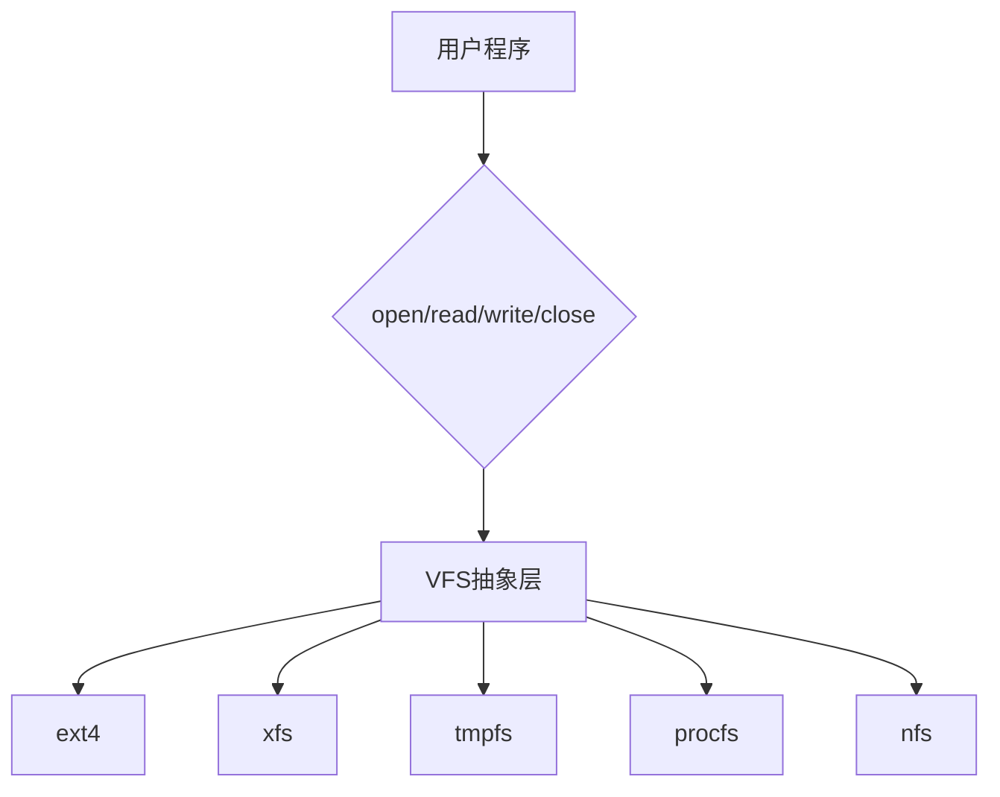

# 文件系统

## ⭐ 面试重点速览

| 考点 | 频率 | 难度 | 考察方式 |
|------|------|------|----------|
| inode 原理 | ⭐⭐⭐⭐⭐ | ⭐⭐⭐ | inode存什么、不存什么，为什么 |
| 硬链接 vs 软链接 | ⭐⭐⭐⭐⭐ | ⭐⭐⭐ | 区别、删除原文件影响 |
| VFS 作用 | ⭐⭐⭐ | ⭐⭐⭐ | 抽象接口，统一不同文件系统 |
| 页缓存 vs 目录项缓存 | ⭐⭐⭐ | ⭐⭐ | 缓存什么，什么时候失效 |
| 零拷贝 vs 直接IO | ⭐⭐⭐ | ⭐⭐⭐⭐ | 结合IO模型考，与缓存对比 |

---

## 一、inode 原理

### inode 是什么？

inode（索引节点）是**描述文件元数据的数据结构**，每个文件对应一个inode。

### inode 里存了什么？

| 内容 | 具体信息 |
|------|----------|
| 文件类型 | 普通文件/目录/符号链接/字符设备/块设备... |
| 文件大小 | 字节数 |
| 权限 | rwx 权限位 |
| 所有者 | uid/gid |
| 时间戳 | 创建/修改/访问时间 |
| 块指针 | 指向实际数据块的位置（磁盘上） |
| 硬链接计数 | 多少个文件名指向这个inode |

```
12个直接指针 + 1个一级间接指针 + 1个二级间接指针 + 1个三级间接指针
```

::: tip 不直接存文件名！
inode **不存文件名**！文件名存在目录项中。

一个目录是"文件名 → inode编号"的映射表。
:::

### ext4 文件系统布局

```
+----------------+----------------+----------------+----------------+
|  超级块(Super) | inode 位图    | 块位图        | inode 表      |
+----------------+----------------+----------------+----------------+
|                                               数据块          |
+---------------------------------------------------------------+
```

### 查找文件的流程

```mermaid
graph TD
    A[/home/xxx/a.txt] --> B[根目录 inode 2]
    B --> C[根目录数据块]
    C --> D[home inode号]
    D --> E[home目录数据块]
    E --> F[xxx inode号]
    F --> G[xxx目录数据块]
    G --> H[a.txt inode号]
    H --> I[a.txt inode]
    I --> J[读数据块]
```

### inode 耗尽问题

```
df -h 显示空间还有，但说"No space left on device"
```

原因：磁盘还有空间，但**inode号用完了**。常见于创建了大量非常小的文件。

解决：重新格式化或调整分区。

---

## 二、硬链接 vs 软链接

### 硬链接（Hard Link）

硬链接就是**多个文件名指向同一个inode**。

```bash
ln source.txt link.txt
```

```
inode 1234 → source.txt
inode 1234 → link.txt
```

**特点：**
- 多个文件共享同一个inode
- 硬链接计数 +1
- 删除原文件：只计数-1，文件内容还在，其他硬链接依然可读
- 只有所有硬链接都删除了，磁盘空间才真正释放
- 不能跨文件系统（inode只在本文件系统有效）
- 不能链接目录（防止循环）

### 软链接（符号链接，Symbolic Link）

软链接是**一个独立的文件，内容就是原文件路径**。

```bash
ln -s source.txt link.txt
```

```
inode A → source.txt (存数据)
inode B → link.txt (存字符串 "/path/source.txt")
```

**特点：**
- 软链接有自己独立的inode
- 文件内容是原文件的路径
- 删除原文件：软链接失效（但文件还在，打开会报"No such file"）
- 可以跨文件系统
- 可以链接目录

### 对比总览

| 对比维度 | 硬链接 | 软链接 |
|----------|--------|--------|
| 是否共享inode | 共享同一个 | 独立inode |
| 是否占用磁盘空间 | 几乎不占（只占目录项） | 占，存路径字符串 |
| 删除原文件 | 计数减一，仍然可用 | 链接失效，无法打开 |
| 是否跨文件系统 | 不可以 | 可以 |
| 是否可以链接目录 | 不可以 | 可以 |
| 访问速度 | 更快（直接访问inode） | 慢（需要解析路径） |

---

## 三、VFS（虚拟文件系统）

### 什么是 VFS？

VFS（Virtual File System）是内核中的一个抽象层，**对上层提供统一的文件系统接口**，屏蔽不同具体文件系统（ext4、xfs、btrfs、tmpfs）的差异。



### VFS 提供什么接口？

VFS 定义了四种核心对象：

| 对象 | 作用 |
|------|------|
| super_block | 描述整个文件系统（挂载点、大小、inode总数） |
| inode | 描述一个文件的元数据 |
| dentry | 目录项（文件名 → inode 映射） |
| file | 打开文件描述符（当前偏移、打开模式） |

::: tip 为什么叫"虚拟"？
VFS本身不存储数据，所有数据都由具体的文件系统实现。VFS只负责定义接口，把调用转发给具体实现。

这样，用户程序用 `open` 不管打开 ext4 文件还是 tmpfs 文件还是 procfs，调用方式都一样。
:::

### dentry 缓存（dcache）

内核会缓存常用的目录项（dentry），加速路径查找。

```
缓存：路径字符串 → dentry → inode
```

- 下次再访问同一个路径，不需要逐层解析磁盘上的目录了
- 加快路径查找速度
- 缓存失效：当文件被删除/重命名时，内核会失效缓存

### page cache（页缓存）

页缓存把磁盘上的数据缓存到内存中：
- 读文件：先看页缓存有没有命中，命中直接返回，不读磁盘
- 写文件：一般先写到页缓存，延迟回写磁盘
- 脏页：缓存内容比磁盘新，需要回写

---

## 四、面试高频题

### Q1: inode 是什么？inode 里存了什么，不存什么？

**标准答案：**

inode 是索引节点，是**描述文件元信息的数据结构**，每个文件对应一个inode。

**inode 存的内容：**
- 文件类型（普通/目录/设备）
- 文件大小、权限、uid/gid
- 创建/修改/访问时间
- 磁盘块指针（指向实际数据在磁盘上的位置）
- 硬链接计数

**inode 不存的内容：**
- **不存文件名**！文件名存在目录项（dentry）中，一个目录就是文件名到inode的映射表

**为什么不存文件名？**
- 一个inode可以对应多个文件名（硬链接）
- 文件名长度可变，存在inode里会浪费空间或不灵活

---

### Q2: df 还有空间，但提示 No space left on device，为什么？

**标准答案：**

两种可能：

1. **inode 耗尽**：创建了大量小文件，inode号全部用完了，但总数据块还有剩余。df看 `df -i` 能看到 inodes 使用率 100%。

2. **磁盘满了**：如果df显示使用率100%，那就是真满了。

第一种情况原因：文件系统创建分区时会预分配固定数量的inode，一般够不够用。如果有大量小文件（比如大量空文件），会把inode用完，但块还有剩余。

---

### Q3: 硬链接和软链接的区别？删除原文件会发生什么？

**标准答案：**

| 对比 | 硬链接 | 软链接 |
|------|--------|--------|
| inode | 共享同一个inode | 独立inode |
| 内容 | 不存内容，只是目录项 | 存原文件路径字符串 |
| 删除原文件 | 硬链接计数减一，其他硬链接仍然可以正常访问，数据不丢 | 原文件被删除后，软链接打开失败（显示 No such file or directory） |
| 跨文件系统 | 不能 | 可以 |
| 链接目录 | 不能 | 可以 |
| 访问速度 | 更快，直接到inode | 慢，需要路径解析 |

**删除原文件：**
- 硬链接：原文件只是计数减一，数据块还在，其他硬链接仍然能读
- 软链接：软链接文件本身还在，但打开时找不到原文件

---

### Q4: VFS 是什么？为什么需要它？

**标准答案：**

VFS（Virtual File System）是 Linux 内核中的**虚拟文件系统抽象层**，对用户空间提供统一的文件操作接口（open/read/write/close），让不同的具体文件系统（ext4、xfs、tmpfs、nfs等）都能以相同方式被访问。

**为什么需要：**
- Linux 支持几十种不同的文件系统，每种实现方式不同
- 如果没有VFS，每个用户程序都需要知道每种文件系统的调用方式，太麻烦
- VFS 抽象出统一接口，用户程序只要用 `open/read/write` 就能访问任何文件系统
- 新文件系统只要实现了VFS定义的接口，就能无缝接入内核

**核心贡献：** 提供了一致性，让"一切皆文件"的设计成为可能（普通文件、目录、设备、socket都可以用统一的文件描述符操作）。

---

### Q5: 为什么删除大文件后，df 显示的可用空间没变化？

**标准答案：**

常见原因：**进程还持有被删除文件的文件描述符**。

当你删除一个打开的文件：
1. 目录项和inode被删除了，链接计数变成0
2. 但进程还拿着这个文件的fd，数据块并没有真正释放
3. 只有当进程关闭fd或者进程退出后，内核才会真正释放数据块
4. 这时候 df 才会显示空间增加

**如何解决：**
```bash
lsof | grep deleted
# 找到持有句柄的进程，要么重启进程，要么kill进程（谨慎）
```

---

### Q6: 软链接占用磁盘空间吗？为什么？

**标准答案：**

软链接占用磁盘空间。因为软链接有自己独立的inode，需要存储路径字符串。

如果路径比较短（比如几个字节），有些文件系统会把路径存在inode的块指针区域（不需要额外分配数据块），但仍然占用inode本身的空间。

硬链接几乎不占额外空间，只在目录里占一个目录项的位置，不占新inode也不占新数据块。

---

### Q7: 为什么ext4不推荐，现在都用xfs？

**标准答案：**

**ext4 的局限性：**
- 最大文件系统 1EB，最大文件 16TB
- 延迟分配，大文件容易出现碎片
- 元数据日志容易损坏，fsck慢
- 不支持热在线扩容

**xfs 的优势：**
- 更大的最大尺寸（文件系统 8EB，文件 9EB）
- 更高的性能，更大吞吐量
- 延迟分配更好，减少碎片
- 支持热在线扩容
- 更好的元数据并发，多核性能更好
- 支持 extent 分配，更少碎片，更快查找

**xfs 的缺点：** 缩小（收缩）比较麻烦，不支持在线收缩；需要离线。

**实际生产：** 现在主流 Linux 发行版默认都用 xfs，尤其是云服务器。