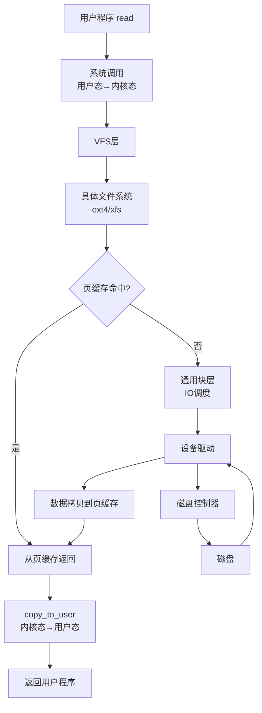
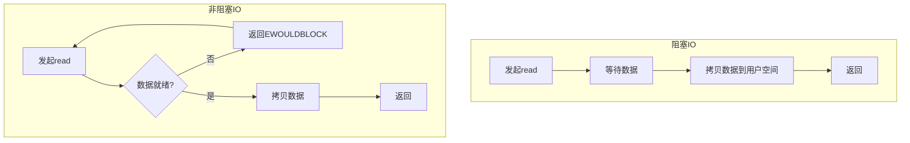
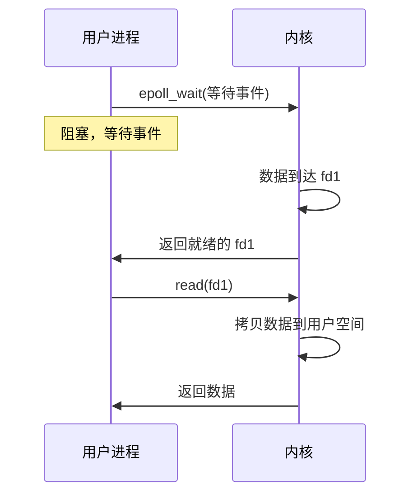
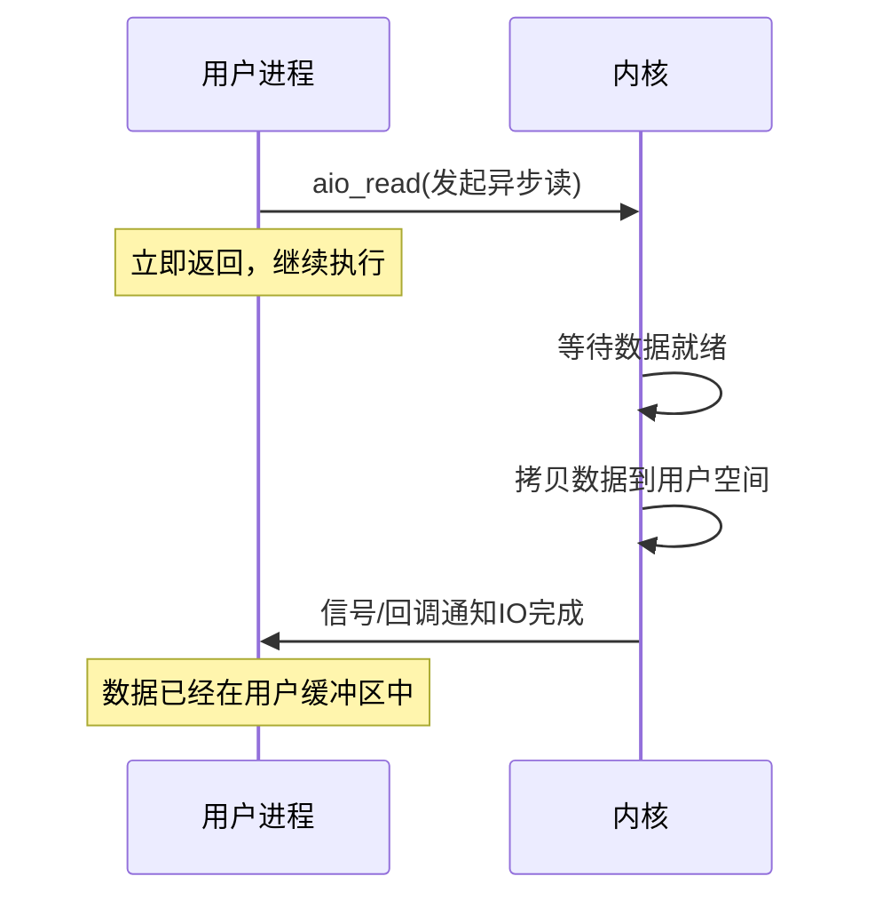
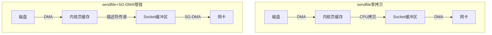

# IO模型

## ⭐ 面试重点速览

| 考点 | 频率 | 难度 | 考察方式 |
|------|------|------|----------|
| 阻塞 vs 非阻塞 vs IO多路复用 | ⭐⭐⭐⭐⭐ | ⭐⭐⭐⭐ | 区别、优劣、适用场景 |
| select/poll/epoll 区别 | ⭐⭐⭐⭐⭐ | ⭐⭐⭐⭐⭐ | 底层实现、性能差异、为什么快 |
| 零拷贝原理 | ⭐⭐⭐⭐ | ⭐⭐⭐⭐ | sendfile vs mmap、数据拷贝次数 |
| 直接IO vs 缓存IO | ⭐⭐⭐ | ⭐⭐⭐ | 区别、优缺点、数据库场景 |
| 同步/异步 IO | ⭐⭐⭐⭐ | ⭐⭐⭐ | 同步/异步不等同于阻塞/非阻塞 |

> **说明：** 本页侧重操作系统内核层面的IO机制。网络编程层面的IO模型（如 Java NIO、Netty、Reactor模式）请参见[计算机网络 - IO模型](../../computer-network/programming/io-models.md)。

---

## 一、OS 内核 IO 处理流程

### 从用户程序到磁盘的完整路径



### 关键概念区分

| 概念 | 发生位置 | 含义 |
|------|----------|------|
| 缓存IO | 页缓存 | 数据经过内核页缓存，读/写都先到页缓存 |
| 直接IO | 绕过页缓存 | 数据直接从磁盘到用户空间，不经过页缓存 |
| 同步IO | 系统调用层面 | 请求发出后，等待IO完成才返回 |
| 异步IO | 系统调用层面 | 请求发出后立即返回，IO完成后通知 |
| 阻塞 | IO操作层面 | 数据未就绪时，线程睡眠等待 |
| 非阻塞 | IO操作层面 | 数据未就绪，立即返回错误 |

---

## 二、五种 IO 模型（OS 内核视角）



### 2.1 阻塞 IO（Blocking IO）

**特点：** 进程发起 read 系统调用后，整个进程阻塞，等数据从内核空间拷贝到用户空间后才返回。

```
用户进程: read() ──────────────────── 阻塞等待 ────────────────────→ 返回
内核:               等待数据 ────→ 数据就绪 → 拷贝数据到用户空间
```

**优点：** 实现简单，编程模型直观
**缺点：** 一个线程只能处理一个 IO，并发能力差（需要大量线程）

### 2.2 非阻塞 IO（Non-blocking IO）

**特点：** 进程发起 read，如果数据未就绪，内核立即返回 EWOULDBLOCK 错误。进程需要不断轮询。

```
用户进程: read() → 返回错误 → read() → 返回错误 → read() → 返回成功
内核:        数据未就绪         数据未就绪         数据就绪 → 拷贝
```

**优点：** 一个线程可以处理多个 IO
**缺点：** 轮询浪费 CPU，IO 延迟高

### 2.3 IO 多路复用（IO Multiplexing）

**核心思想：** 用一个系统调用（select/poll/epoll）同时监听多个文件描述符，哪个就绪了通知进程。



**select/poll/epoll 对比：**

| 特性 | select | poll | epoll |
|------|--------|------|-------|
| 数据结构 | 位图（fd_set） | 链表 | 红黑树 + 就绪链表 |
| FD 数量限制 | 1024（默认） | 无限制 | 无限制 |
| 遍历方式 | 线性扫描全部 FD | 线性扫描全部 FD | 只返回就绪 FD |
| 拷贝开销 | 每次调用拷贝全部 FD | 每次调用拷贝全部 FD | 只须注册一次 |
| 时间复杂度 | O(n) | O(n) | O(1)（就绪事件） |
| 触发模式 | 水平触发 | 水平触发 | 水平触发 + 边缘触发 |

::: tip 为什么 epoll 比 select 快？

1. **事件驱动**：epoll 使用回调机制，FD 就绪时直接加入就绪链表，不需要遍历
2. **减少拷贝**：epoll 只需注册一次 FD，select 每次调用都需要传入整套 FD 集合
3. **就绪列表**：epoll_wait 直接返回就绪的 FD，select 需要用户遍历找到底哪些 FD 就绪了
:::

### 2.4 信号驱动 IO（Signal-driven IO）

进程发起 IO 请求后立即返回，内核数据就绪时发送 SIGIO 信号通知进程。进程在信号处理函数中调用 read。

实际使用较少，复杂度高，性能不如 epoll。

### 2.5 异步 IO（AIO）

进程发起 IO 请求后立即返回，内核**完成数据拷贝后**通知进程。与信号驱动 IO 的区别是：信号驱动 IO 在数据就绪时通知，而异步 IO 在数据拷贝完成后通知。



---

## 三、零拷贝（Zero Copy）

### 为什么需要零拷贝？

传统 IO 的数据流（以文件传输为例）：

```
1. 磁盘 → 内核页缓存（DMA 拷贝）
2. 内核页缓存 → 用户缓冲区（CPU 拷贝）
3. 用户缓冲区 → 内核 Socket 缓冲区（CPU 拷贝）
4. 内核 Socket 缓冲区 → 网卡（DMA 拷贝）
```

**4 次拷贝，2 次 CPU 拷贝，2 次上下文切换**。CPU 拷贝浪费 CPU 资源，影响性能。

### sendfile 零拷贝



**sendfile 系统调用：** 数据直接从内核页缓存复制到 Socket 缓冲区，不再经过用户空间。

**sendfile + SG-DMA：** 只传递描述符和数据长度，网卡直接从内核页缓存读取数据。**CPU 拷贝 0 次！**

```
sendfile 零拷贝：
1. 磁盘 → 内核页缓存（DMA 拷贝）
2. 内核页缓存 → Socket 缓冲区（CPU 拷贝，或 SG-DMA 跳过）
3. Socket 缓冲区 → 网卡（DMA 拷贝）

只需要 2-3 次拷贝，0 次 CPU 拷贝（SG-DMA），0 次用户空间拷贝
```

### mmap + write 零拷贝

```
mmap 将文件映射到用户空间，实际是映射到内核页缓存。
用户直接读写 mmap 映射的内存，减少一次拷贝。
```

**sendfile vs mmap：**

| 对比 | sendfile | mmap + write |
|------|----------|-------------|
| 上下文切换 | 2 次 | 4 次 |
| CPU 拷贝 | 1 次（SG-DMA 0 次） | 1 次 |
| 使用场景 | 文件到网络 | 文件读写 |
| 对用户可见 | 不可见 | 用户可修改数据 |

::: tip 相关阅读
Java NIO 中的零拷贝实现：`FileChannel.transferTo()` 底层调用 sendfile；`MappedByteBuffer` 底层调用 mmap。参见 [Java NIO](../../java-advanced/io-nio/nio.md)。
:::

---

## 四、直接 IO vs 缓存 IO

### 缓存 IO（Buffered IO）

默认的 IO 方式，数据经过内核页缓存。

```
写入: 用户空间 → 页缓存 → (延迟) 磁盘
读取: 磁盘 → 页缓存 → 用户空间
```

**优点：** 利用页缓存加速重复读写，合并小 IO
**缺点：** 多一次内存拷贝，占用内存，缓存失效时需要回写

### 直接 IO（Direct IO）

数据绕过内核页缓存，直接在用户空间和磁盘之间传输。

```
写入: 用户空间 → 磁盘
读取: 磁盘 → 用户空间
```

**优点：** 减少内存拷贝，避免缓存污染
**缺点：** 需要应用层自己管理缓存，需要对齐，不适用于小 IO

### 对比

| 对比 | 缓存 IO | 直接 IO |
|------|---------|---------|
| 数据路径 | 用户 → 页缓存 → 磁盘 | 用户 → 磁盘 |
| 拷贝次数 | 多一次 | 少一次 |
| 缓存管理 | 内核管理 | 应用层管理 |
| 适用场景 | 通用场景 | 数据库、大文件 |
| 对齐要求 | 无 | 需要扇区对齐 |

::: danger 数据库为什么用直接 IO？
数据库（如 MySQL InnoDB）自己实现了 Buffer Pool（缓冲池），不需要内核的页缓存。如果走缓存 IO，数据会被缓存两次（内核页缓存一次，Buffer Pool 一次），浪费内存。所以数据库通常用直接 IO 绕开内核页缓存，由 Buffer Pool 统一管理缓存。
:::

---

## 五、面试高频题

### Q1: 阻塞 IO、非阻塞 IO、IO 多路复用的区别？

**标准答案：**

| 模型 | 行为 | 线程模型 | 适用场景 |
|------|------|----------|----------|
| 阻塞 IO | 进程等待数据就绪并拷贝完成 | 一个线程处理一个连接 | 简单、连接少的场景 |
| 非阻塞 IO | 轮询检查数据是否就绪 | 一个线程轮询多个连接 | 很少使用，浪费 CPU |
| IO 多路复用 | 一个线程同时监听多个 FD，哪个就绪处理哪个 | 一个线程处理成千上万个连接 | 高并发服务器 |

**核心区别：** 阻塞 IO 是一个线程阻塞在一个 IO 上；IO 多路复用是一个线程阻塞在多个 IO 上。

---

### Q2: select、poll、epoll 的区别？为什么 epoll 更快？

**标准答案：**

| 对比 | select | poll | epoll |
|------|--------|------|-------|
| 数据结构 | 位图（fd_set） | 链表 | 红黑树+就绪链表 |
| FD 上限 | 1024 | 无限制 | 无限制 |
| 遍历 | 每次全量扫描 | 每次全量扫描 | 只处理就绪FD |
| 触发方式 | 水平触发 | 水平触发 | 水平+边缘触发 |
| 拷贝 | 每次调用拷贝全量FD | 每次调用拷贝全量FD | FD注册一次即可 |

**epoll 更快的三个原因：**

1. **回调机制**：FD 就绪时，内核通过回调将其加入就绪链表，不需要遍历。select 每次都要遍历整个 FD 集合。
2. **减少拷贝**：FD 只注册一次，不需要每次调用都拷贝。select 每次需要把 FD 集合从用户态拷贝到内核态。
3. **就绪列表**：epoll_wait 直接返回就绪的 FD，不用遍历。select 返回后，用户还需要遍历找到底哪些 FD 就绪了。

---

### Q3: 什么是零拷贝？sendfile 和 mmap 有什么区别？

**标准答案：**

零拷贝是指减少 CPU 在用户空间和内核空间之间拷贝数据的次数，让 CPU 专注于数据处理而非数据搬运。

**传统 IO 的数据拷贝（4次）：**
```
磁盘 → 内核页缓存 → 用户空间 → 内核Socket缓冲区 → 网卡
```

**sendfile（2-3次，0次CPU拷贝）：**
- 数据从内核页缓存直接到 Socket 缓冲区，不经过用户空间
- 配合 SG-DMA（Scatter-Gather DMA），只传递文件描述符和数据长度
- 网卡直接从内核页缓存读取数据，CPU 拷贝 0 次

**mmap + write（3次拷贝，1次CPU拷贝）：**
- mmap 将文件映射到内核页缓存，用户空间直接访问
- 用户修改后，write 写回，减少一次内核→用户空间的拷贝

**区别：**
- sendfile 适合文件 → 网络（如静态文件服务器、Nginx）
- mmap 适合文件读写，用户可以修改数据
- sendfile 对用户空间不可见，无法修改数据

---

### Q4: 直接 IO 和缓存 IO 有什么区别？数据库为什么用直接 IO？

**标准答案：**

**缓存 IO：** 数据经过内核页缓存，读/写都先到页缓存，内核负责缓存管理。

**直接 IO：** 数据绕过内核页缓存，直接在用户空间和磁盘之间传输。

**数据库为什么用直接 IO：**
- 数据库（如 MySQL InnoDB）有自己的 Buffer Pool（缓冲池）
- 如果走缓存 IO，同一份数据会被缓存两次（内核页缓存 + Buffer Pool）
- 浪费内存，且两个缓存需要保持一致
- 用直接 IO 绕开内核页缓存，Buffer Pool 统一管理缓存
- 数据库自己知道哪些数据热、哪些冷，可以做出比内核更好的缓存决策

**例外：** 数据库的日志写入仍用缓存 IO（需要顺序写、批量刷盘）。

---

### Q5: 同步 IO 和异步 IO 的区别？阻塞 IO 和同步 IO 是什么关系？

**标准答案：**

**同步 IO：** 进程发起 IO 操作后，必须等待 IO 操作完成（数据从内核空间拷贝到用户空间）才返回。阻塞 IO、非阻塞 IO、IO 多路复用都是同步 IO。

**异步 IO：** 进程发起 IO 操作后立即返回，内核完成所有操作（包括数据拷贝）后通知进程。真正的异步 IO（如 Linux AIO、Windows IOCP）。

**阻塞/非阻塞 vs 同步/异步：**
- 阻塞/非阻塞：描述的是**等待数据就绪**阶段的行为
- 同步/异步：描述的是**整个 IO 操作**（从发起到数据拷贝完成）的行为

**关键区分：**
- IO 多路复用（epoll）是同步 IO，因为数据拷贝阶段仍然阻塞
- 真正的异步 IO 是：发起 read 后 → 直接返回 → 内核完成所有操作 → 通知你数据已经在用户缓冲区了

---

### Q6: 什么是"零拷贝"在 Kafka 和 Netty 中的应用？

**标准答案：**

**Kafka 零拷贝：**
- Kafka 使用 `FileChannel.transferTo()` → 底层调用 `sendfile`
- 消费者拉取消息时，数据从磁盘直接到网卡，不经过 Kafka 进程的用户空间
- 减少 CPU 拷贝，提高吞吐量

**Netty 零拷贝：**
- 复合缓冲区（CompositeByteBuf）：多个 ByteBuf 合并，零拷贝
- 文件传输：`FileRegion` → `transferTo` → `sendfile`
- 堆外内存：DirectByteBuf，减少 GC，减少一次拷贝

**核心思想：** 减少数据在用户空间和内核空间之间的拷贝，让 CPU 专注于业务逻辑。参见 [Netty 框架](../../java-advanced/io-nio/netty.md)。