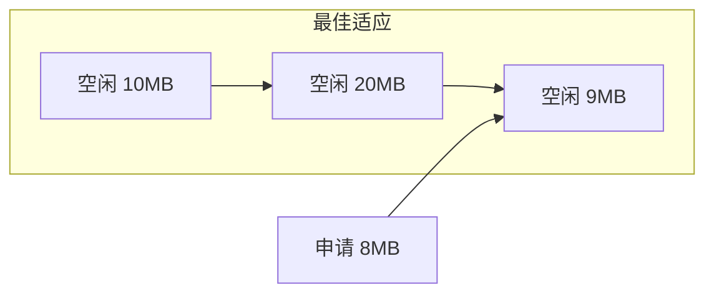
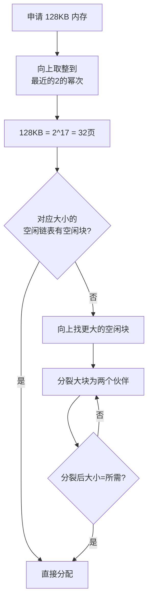
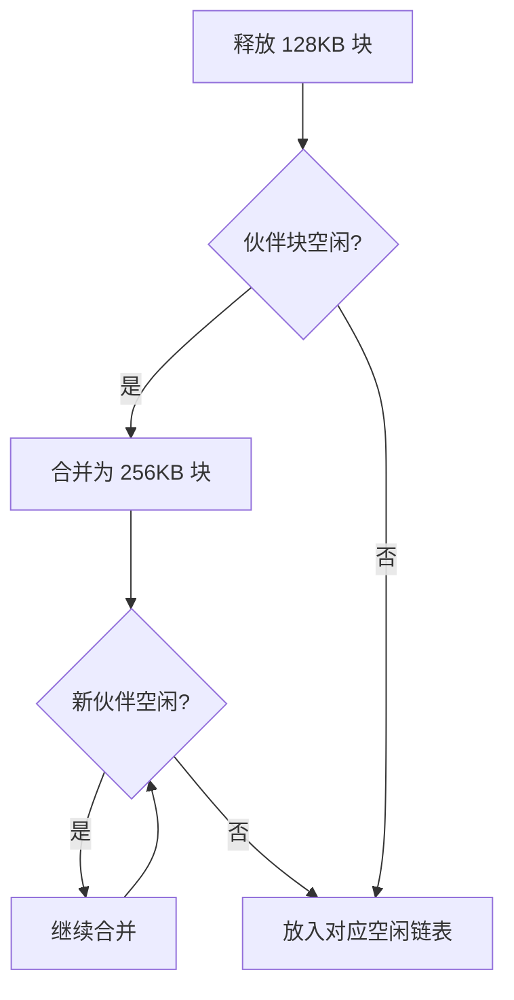
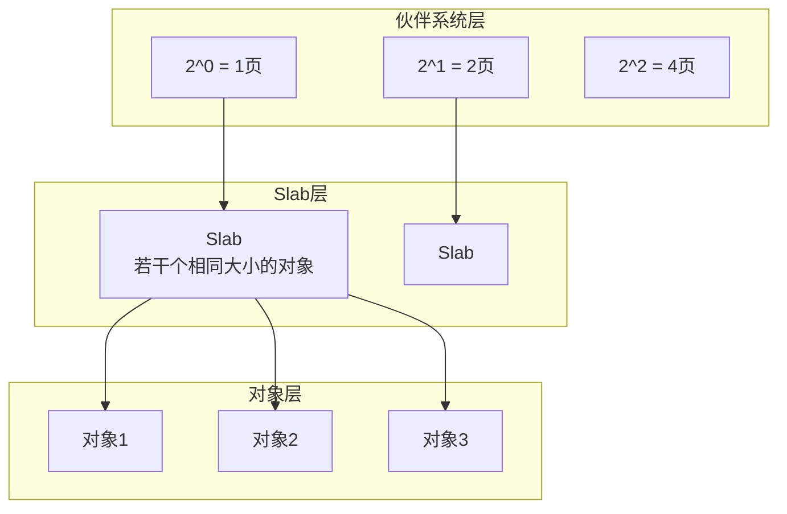

# 内存分配

## ⭐ 面试重点速览

| 考点 | 频率 | 难度 | 考察方式 |
|------|------|------|----------|
| 首次适应 vs 最佳适应 | ⭐⭐⭐ | ⭐⭐ | 区别、优缺点、碎片问题 |
| 伙伴系统原理 | ⭐⭐⭐⭐ | ⭐⭐⭐⭐ | 分配和释放流程、内部碎片 |
| slab 分配器 | ⭐⭐⭐⭐ | ⭐⭐⭐⭐⭐ | slab设计思想、小对象缓存 |
| 内存碎片问题 | ⭐⭐⭐ | ⭐⭐⭐ | 内部碎片 vs 外部碎片 |
| malloc 实现原理 | ⭐⭐⭐⭐ | ⭐⭐⭐⭐ | glibc ptmalloc 多线程设计 |

---

## 一、连续内存分配算法

### 1.1 首次适应（First Fit）

从空闲分区链的**头部**开始查找，找到第一个满足大小的空闲分区就分配。


**特点：**
- 查找速度快（找到第一个就停）
- 低地址部分容易产生**小碎片**
- 大块空闲分区保留在高地址

### 1.2 最佳适应（Best Fit）

遍历所有空闲分区，找到**大小最接近**的空闲分区来分配。



**特点：**
- 尽量留下大的空闲分区
- 但每次分配后剩下的**碎片更小更碎**，更难以利用
- 需要遍历所有空闲分区，效率低

### 1.3 最差适应（Worst Fit）

遍历所有空闲分区，找到**最大的空闲分区**来分配。

**特点：**
- 剩下的空闲分区仍然较大，可以继续使用
- 但会快速耗尽大块空闲分区
- 实际使用较少

### 三种算法对比

| 算法 | 查找速度 | 碎片情况 | 适用场景 |
|------|----------|----------|----------|
| 首次适应 | 快（找到就停） | 低地址产生小碎片 | 通用场景 |
| 最佳适应 | 慢（全遍历） | 产生大量极小的碎片 | 需要精确匹配 |
| 最差适应 | 慢（全遍历） | 大碎片少 | 较少使用 |

**实际应用：** Linux 内核早期使用首次适应，现在主要使用伙伴系统。

---

## 二、伙伴系统（Buddy System）

### 核心思想

伙伴系统是 Linux 内核分配物理内存的核心算法，用于管理物理页框。

**基本原理：**
- 将内存分成大小为 2^n 个页的块
- 每个大小有一个空闲链表
- 分配时向上取整到最近的 2^n 大小
- 释放时尝试与相邻的"伙伴"合并

### 分配流程



### 释放与合并



### 伙伴的定义

两个块是"伙伴"的条件：
1. 大小相同（都是 2^n）
2. 物理地址连续
3. 合并后的块地址按 2^(n+1) 对齐

**例子：**
- 地址 0 的 4KB 块与地址 4KB 的 4KB 块是伙伴（合并后 8KB，地址 0，对齐 8KB）
- 地址 4KB 的 4KB 块与地址 8KB 的 4KB 块**不是**伙伴（合并后地址 4KB，不对齐 8KB）

### 伙伴系统的优缺点

| 优点 | 缺点 |
|------|------|
| 分配和释放速度快（O(log N)） | **内部碎片**：申请 33KB 会分配 64KB，浪费 31KB |
| 自动合并，减少外部碎片 | 对小内存分配不友好（最小单位是1页=4KB） |
| 实现简单 | 内存利用率不高（约 75%） |

---

## 三、Slab 分配器

### 为什么需要 Slab？

伙伴系统的最小分配单位是**1页（4KB）**。但内核中大量使用小对象（几十到几百字节），如果每个小对象都分配一个4KB页，内存浪费巨大。

**Slab 分配器解决的就是"小对象"的内存分配问题。**

### Slab 的设计思想



**Slab 向伙伴系统申请整页，然后把整页切分成多个大小相同的小对象，分配给内核使用。**

### Slab 的三种状态

| 状态 | 描述 |
|------|------|
| Full | Slab 中所有对象都已分配 |
| Partial | Slab 中部分对象已分配，部分空闲 |
| Empty | Slab 中所有对象都空闲，可以还给伙伴系统 |

### 对象缓存（kmem_cache）

每种类型的对象都有一个**专用的缓存**：

```c
// 为 inode 创建对象缓存
struct kmem_cache *inode_cache;

// 创建缓存时指定对象大小
inode_cache = kmem_cache_create("inode_cache",
                                 sizeof(struct inode),
                                 0, 0, NULL);

// 从缓存中分配一个 inode 对象
struct inode *inode = kmem_cache_alloc(inode_cache, GFP_KERNEL);

// 释放 inode 对象（不还给伙伴系统，留作下次使用）
kmem_cache_free(inode_cache, inode);
```

### Slab 着色（Slab Coloring）

**问题：** 多个 Slab 中相同偏移的对象可能映射到同一个硬件缓存行，导致缓存冲突。

**解决：** 每个 Slab 的起始地址有一个小偏移（颜色），让相同偏移的对象映射到不同的缓存行，提高缓存利用率。

### Slab 分配器的演进

| 版本 | 说明 |
|------|------|
| SLAB | 经典实现，管理复杂 |
| SLUB | 简化版，当前 Linux 默认，减少元数据开销 |
| SLOB | 嵌入式系统用，极致简单 |

::: tip 相关阅读
JVM 的 TLAB（Thread Local Allocation Buffer）和 Slab 分配器思想类似：每个线程预先分配一块内存，小对象在 TLAB 中分配，减少锁竞争。参见：[JVM 内存模型](../../java-advanced/jvm/memory-model.md)
:::

---

## 四、内存碎片

### 外部碎片 vs 内部碎片

| 类型 | 定义 | 举例 |
|------|------|------|
| 外部碎片 | 空闲内存总量足够，但都是**不连续的小块**，无法满足大块请求 | 总空闲100MB，但每块都<50MB，无法分配50MB |
| 内部碎片 | 分配的内存**大于**实际需要，多余部分浪费 | 申请33KB，分配64KB，浪费31KB |

### 各算法与碎片

| 算法 | 外部碎片 | 内部碎片 |
|------|----------|----------|
| 首次适应 | 有（低地址端） | 无 |
| 伙伴系统 | 几乎没有 | 有（2^n 对齐） |
| Slab | 无 | 几乎没有（对象精确匹配） |

---

## 五、面试高频题

### Q1: 首次适应和最佳适应有什么区别？各有什么优缺点？

**标准答案：**

**首次适应：** 从空闲链表头部开始，找到第一个满足要求的空闲分区就分配。

**最佳适应：** 遍历所有空闲分区，找到大小最接近的空闲分区。

**对比：**

| 维度 | 首次适应 | 最佳适应 |
|------|----------|----------|
| 速度 | 快（找到就停） | 慢（需要遍历全部） |
| 碎片 | 低地址端容易产生碎片 | 产生大量极小的碎片，更难利用 |
| 大块保留 | 高地址端保留大块 | 尽量保留大块 |

**实际使用：** 首次适应更常用，因为速度快且碎片不会太严重。

---

### Q2: 伙伴系统的工作原理？为什么叫"伙伴"？

**标准答案：**

**工作原理：**
1. 内存按 2^n 个页大小组织成多个空闲链表
2. 分配时，向上取整到最近的 2^n，如果对应链表没有空闲块，从更大的块分裂
3. 释放时，检查相邻的"伙伴"是否空闲，如果空闲就合并成更大的块

**"伙伴"的定义：** 两个块是伙伴当且仅当：
- 大小相同（都是 2^n）
- 物理地址连续
- 合并后的地址按 2^(n+1) 对齐

**为什么这样定义？** 因为只有这样的两个块才能合并成一个更大的块，并且合并后的块仍然满足 2^(n+1) 对齐。

**优点：** 分配释放快速（O(log N)），自动合并减少外部碎片。
**缺点：** 内部碎片（申请33KB分配64KB）。

---

### Q3: Slab 分配器解决了什么问题？和伙伴系统的关系？

**标准答案：**

**解决的问题：** 伙伴系统最小分配单位是1页（4KB），而内核中大量对象只有几十到几百字节（如 inode、dentry、task_struct）。用伙伴系统直接分配会浪费大量内存。

**工作原理：**
1. Slab 向伙伴系统申请整页内存
2. 把整页切分成多个相同大小的小对象
3. 维护三个链表：Full（全分配）、Partial（部分分配）、Empty（全空闲）
4. 分配时优先从 Partial 取，释放时优先回到 Partial

**好处：**
- 减少内部碎片
- 对象重用：释放的对象不清零，留作下次使用（热缓存）
- 减少伙伴系统调用次数

**关系：** Slab 是建在伙伴系统之上的**第二层**分配器，伙伴系统管理页级内存，Slab 管理对象级内存。

---

### Q4: 外部碎片和内部碎片有什么区别？

**标准答案：**

**外部碎片：** 所有空闲内存加起来够用，但因为不连续，无法满足大块内存请求。

**内部碎片：** 分配的内存块比实际需要的要大，多余的部分浪费了。

**例子：**
- 外部碎片：系统有 100MB 空闲内存，但分散在 10 个 10MB 的块中，无法分配 50MB 的连续内存
- 内部碎片：申请 33KB，伙伴系统分配 64KB，浪费 31KB

**解决方法：**
- 外部碎片：伙伴系统（自动合并）、紧凑（compaction）
- 内部碎片：Slab 分配器（精确匹配对象大小）

---

### Q5: glibc 的 malloc 是怎么实现的？和内核的伙伴系统有什么关系？

**标准答案：**

**glibc 的 ptmalloc 实现：**

1. **小内存（< 128KB）**：使用 brk() 系统调用扩展堆，内部用类似 Slab 的机制管理
2. **大内存（>= 128KB）**：使用 mmap() 匿名映射，直接向内核申请

**多线程设计：**
- 每个线程有独立的分配区（arena），减少锁竞争
- 当线程数超过 arena 数量时，会共享 arena

**和内核伙伴系统的关系：**
- malloc 是**用户态**的内存分配器，管理的是虚拟内存
- 内核伙伴系统管理的是**物理内存**
- malloc 调用 brk/mmap 后，内核在物理内存分配是**惰性**的（写时分配）
- 只有当进程真正访问这块内存时，才触发缺页中断，内核才分配物理页

**这意味着：** malloc 返回成功不代表物理内存真的分配了，如果系统内存不足，可能在访问时 OOM。

---

### Q6: 什么是内存碎片整理（Compaction）？何时触发？

**标准答案：**

内存碎片整理（Compaction）是 Linux 内核**移动已分配的页面**，将分散的空闲页框合并成大块连续内存的过程。

**触发条件：**
- 当需要分配高阶（连续多页）内存，但找不到足够大的连续块时
- 内核通过 `/proc/sys/vm/compaction_proactiveness` 控制主动压缩的频率

**工作原理：**
1. 扫描内存，找到可移动的页面
2. 把这些页面迁移到新的位置
3. 释放原来的位置，形成连续空闲块

**不可移动的页面**（如内核数据结构）无法被迁移，可能导致碎片整理失败。

**JVM 中的应用：** G1 和 ZGC 使用类似的"移动-整理"策略来消除堆内存碎片。