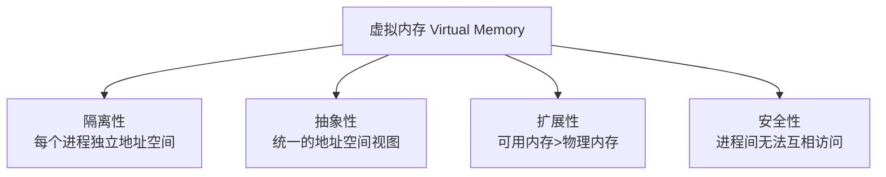
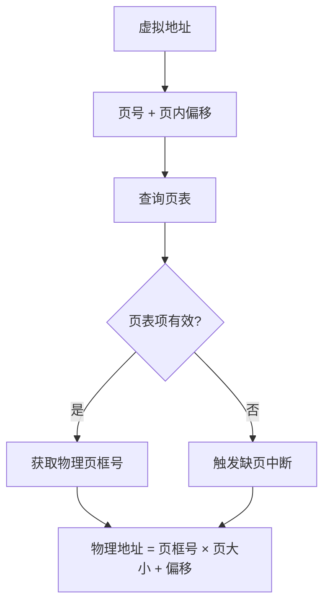
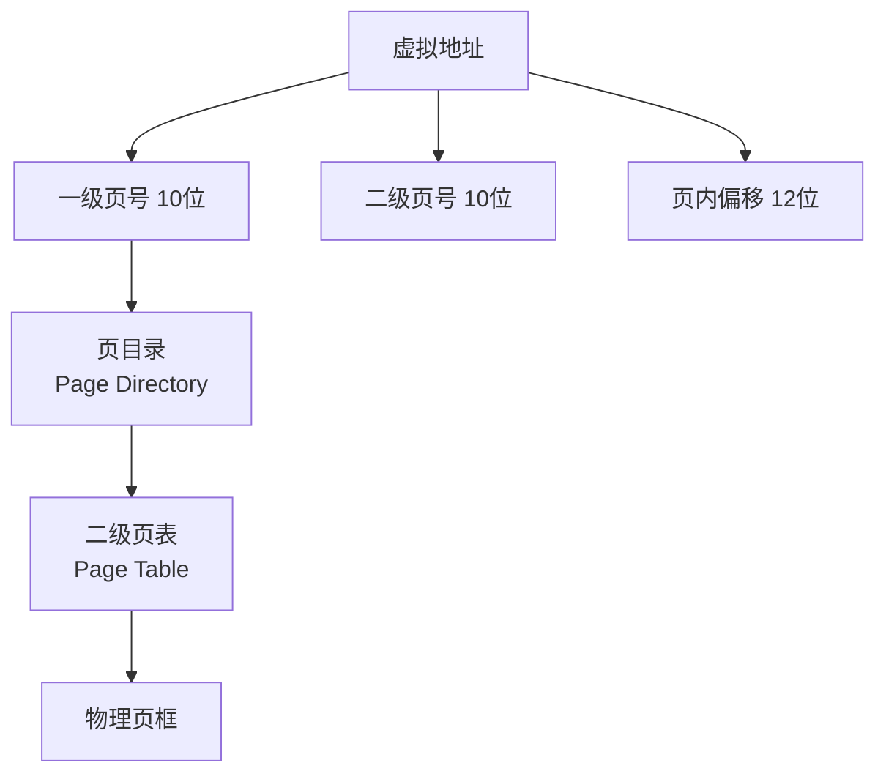
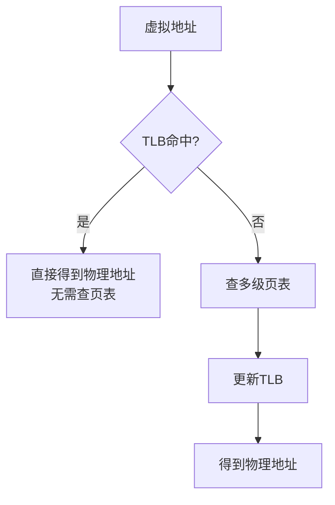
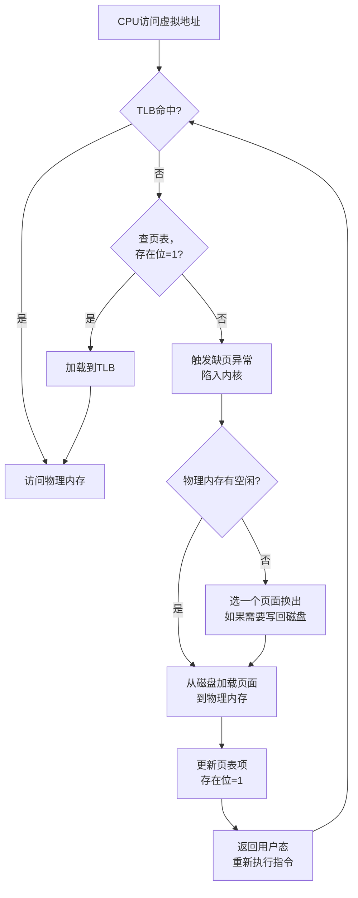
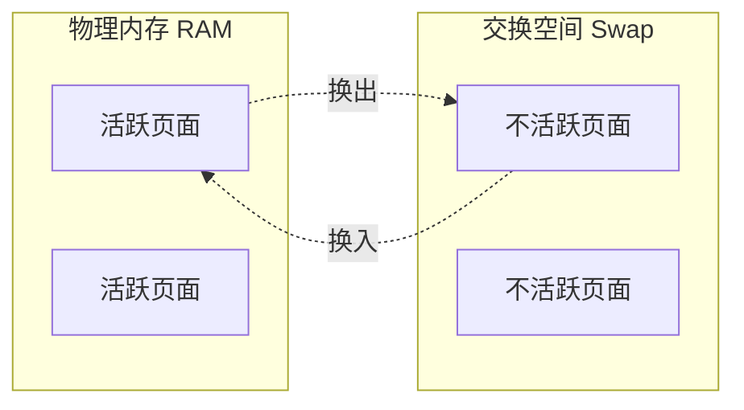

# 虚拟内存

## ⭐ 面试重点速览

| 考点 | 频率 | 难度 | 考察方式 |
|------|------|------|----------|
| 虚拟内存的作用 | ⭐⭐⭐⭐⭐ | ⭐⭐⭐ | 问为什么需要虚拟内存，解决了什么问题 |
| 分页机制原理 | ⭐⭐⭐⭐⭐ | ⭐⭐⭐⭐ | 多级页表、页表项结构、地址转换过程 |
| TLB 的作用 | ⭐⭐⭐⭐ | ⭐⭐⭐ | TLB是什么、命中率、TLB flush |
| 缺页中断流程 | ⭐⭐⭐⭐⭐ | ⭐⭐⭐⭐ | 完整流程，从触发到恢复执行 |
| 交换空间 | ⭐⭐⭐ | ⭐⭐ | swap分区、页面置换算法 |

---

## 一、为什么需要虚拟内存？

### 没有虚拟内存的世界

在早期的计算机中，程序直接操作物理内存：

```
问题1：程序A可能破坏程序B的内存（没有隔离）
问题2：程序跨平台移植困难（不同机器内存布局不同）
问题3：内存碎片导致即使总内存足够，大程序无法运行
问题4：程序必须全部加载到内存才能运行，内存利用率低
```

### 虚拟内存解决了什么？



**核心思想：** 把物理内存和用户程序隔离开，给每个进程一个"假象"——它独占整个内存空间。

---

## 二、分页机制（Paging）

### 基本概念

将虚拟地址空间和物理地址空间都划分为**固定大小**的块：

| 概念 | 虚拟内存 | 物理内存 |
|------|----------|----------|
| 块名称 | 页（Page） | 页框/帧（Frame） |
| 典型大小 | 4KB | 4KB |
| 大小是否固定 | 固定 | 固定 |

### 地址转换过程



**32位虚拟地址拆解（4KB页）：**

```
|     页号 (20位)     | 页内偏移 (12位) |
| 0 .. 19             | 20 .. 31        |
```

由于 2^12 = 4096 = 4KB，所以页内偏移需要 12 位，剩余 20 位用于页号标识。

### 页表项（PTE）结构

```
| 物理页框号 | 标志位 |
```

**关键标志位：**

| 标志位 | 含义 |
|--------|------|
| 存在位（Present） | 该页是否在物理内存中（1=在，0=不在，触发缺页） |
| 脏位（Dirty） | 该页是否被修改过（决定换出时是否需要写回磁盘） |
| 访问位（Accessed） | 该页是否被访问过（用于页面置换算法） |
| 读写位（R/W） | 该页是否可写（实现写保护） |
| 用户/内核位（U/S） | 该页是否可被用户态访问 |

---

## 三、多级页表

### 为什么需要多级页表？

单级页表的问题：**太大了，浪费内存**。

32位系统，4KB页，页表项 4字节：
- 页表项数量：2^20 = 1,048,576 个
- 页表大小：1,048,576 × 4B = 4MB
- 每个进程都需要一个 4MB 的页表，100个进程就是 400MB
- 而且大部分页表项其实用不到（进程实际使用的内存远小于 4GB）

### 二级页表



**二级页表怎么省内存？**
- 如果一级页表项对应的二级页表**全部未使用**，那一级页表项可以标记为"不存在"
- 这块二级页表就可以**不分配内存**
- 典型进程实际使用几百MB内存，只需要几百KB的页表

### 64位系统的多级页表

64位地址空间太大（2^48），需要更多级页表：

| 架构 | 级数 | 页大小 |
|------|------|--------|
| x86-64 (4KB页) | 4级 | 4KB |
| x86-64 (2MB大页) | 3级 | 2MB |
| x86-64 (1GB巨页) | 2级 | 1GB |

::: tip 相关阅读
JVM 也使用虚拟内存，并且支持大页（Huge Page），参见：[JVM 内存模型](../../java-advanced/jvm/memory-model.md)
:::

---

## 四、TLB（Translation Lookaside Buffer）

### 为什么需要 TLB？

每次访问内存都要查页表，而页表也在内存中，这意味着：
- 访问一次内存 → 需要先查页表（一次内存访问）→ 再访问实际数据（又一次内存访问）
- 每次内存访问变成了**两次**内存访问，性能减半！

TLB 是 **CPU 内部的高速缓存**，缓存最近使用的页表项，把两次访问变成一次。



### TLB 的关键特性

| 特性 | 说明 |
|------|------|
| 位置 | CPU 内部（MMU中），非常快 |
| 容量 | 很小，通常几十到几百个条目 |
| 命中率 | 通常 > 99%（时间局部性 + 空间局部性） |
| 刷新时机 | 进程切换时（如果切换了地址空间） |

::: warning TLB Flush 的代价
进程切换需要刷新TLB（因为地址空间变了，缓存的页表项不再有效），这是进程切换开销的主要来源。同进程的线程切换不需要刷新TLB，因为共享同一个地址空间。

这也是为什么说"线程切换比进程切换快很多"的原因之一。
:::

---

## 五、缺页中断（Page Fault）

### 什么是缺页中断？

当程序访问的虚拟页不在物理内存中时（页表项的存在位=0），CPU触发缺页异常，陷入内核处理。

### 完整流程



### 三种缺页类型

| 类型 | 描述 | 处理方式 |
|------|------|----------|
| 次缺页 | 页面在内存中但未映射到当前进程 | 直接映射，很快 |
| 主缺页 | 页面在磁盘上 | 需要从磁盘读取，较慢 |
| 非法访问 | 访问了无效地址 | 发送 SIGSEGV 信号 |

---

## 六、交换空间（Swap）

交换空间是磁盘上的一块区域，作为物理内存的扩展。



### 页面置换算法

当物理内存满时，需要选一个页面换出到磁盘：

| 算法 | 策略 | 优点 | 缺点 |
|------|------|------|------|
| FIFO | 先进先出 | 简单 | 可能换出频繁访问的页 |
| LRU | 最近最少使用 | 效果好 | 实现开销大 |
| Clock（NRU） | 近似LRU，用访问位 | 实现简单，效果好 | 近似而非最优 |
| OPT | 理论最优 | 最优 | 需要预知未来，不可实现 |

**Linux 实际使用的是改进版的 Clock 算法（双时钟算法）**，同时考虑访问位和脏位。

---

## 七、面试高频题

### Q1: 什么是虚拟内存？解决了什么问题？

**标准答案：**

虚拟内存是操作系统的一个核心抽象，让每个进程认为它独占整个内存空间。虚拟地址通过 MMU（内存管理单元）和页表转换为物理地址。

**解决的四个问题：**
1. **隔离性**：每个进程有独立的地址空间，互不干扰
2. **抽象性**：程序员不需要关心物理内存布局，操作系统提供统一的地址空间
3. **扩展性**：程序可以比物理内存大（部分页面在磁盘上），内存利用率更高
4. **安全性**：一个进程不能访问另一个进程的内存

---

### Q2: 详细描述虚拟地址到物理地址的转换过程？

**标准答案：**

以32位系统、4KB页、二级页表为例：

1. CPU 发出虚拟地址，MMU 先查 TLB
2. 如果 TLB 命中，直接得到物理地址
3. 如果 TLB 未命中：
   - 取虚拟地址的**高10位**作为页目录索引，查页目录表
   - 页目录项指向一个二级页表的物理地址
   - 取虚拟地址的**中间10位**作为二级页表索引，查二级页表
   - 二级页表项包含物理页框号
   - 检查页表项的存在位，如果为0，触发缺页中断
   - 如果存在位为1，**物理地址 = 物理页框号 × 4KB + 页内偏移（低12位）**
4. 把页表项加载到 TLB 中

---

### Q3: TLB是什么？为什么需要它？

**标准答案：**

TLB（Translation Lookaside Buffer）是 CPU 内部的一个**高速缓存**，缓存最近使用的虚拟地址到物理地址的映射关系。

**为什么需要：**
- 如果不使用 TLB，每次访问内存都需要先查页表，而页表本身也在内存中
- 这意味着一次内存访问变成了两次：先查页表（读内存），再访问数据（读内存）
- TLB 把常用的映射关系缓存起来，大多数情况下只需一次内存访问

**TLB miss 的代价：**
- 4KB 页：需要查多级页表（4次内存访问），开销很大
- 大页（2MB/1GB）可以覆盖更多地址空间，减少 TLB miss

---

### Q4: 缺页中断的完整流程？

**标准答案：**

1. CPU 访问虚拟地址，TLB 未命中，查页表发现存在位=0
2. CPU 触发**缺页异常**（Page Fault Exception），陷入内核
3. 内核检查地址是否合法（是否在进程可访问的地址范围内）
4. 如果地址非法，向进程发送 SIGSEGV 信号（段错误）
5. 如果地址合法：
   - 在物理内存中找一个空闲页框
   - 如果没有空闲页框，用页面置换算法选一个页面换出（如果脏了需要写回磁盘）
   - 从磁盘将所需页面加载到物理内存页框中
   - 更新页表项（设置物理页框号，存在位=1）
6. 返回用户态，重新执行引发缺页的指令
7. 这次TLB仍然会miss，但页表项存在位=1，加载到TLB，继续执行

---

### Q5: 多级页表为什么能省内存？4级页表比2级更省吗？

**标准答案：**

**省内存原理：**
- 单级页表必须为整个地址空间的每个页都分配页表项，不管用不用
- 多级页表：如果一级页表项指向的二级页表所有条目都未使用，这个二级页表就**不需要分配物理内存**
- 进程实际使用的内存通常只占地址空间的一小部分，所以大量页表可以省略

**4级页表不一定更省内存：**
- 每个级别的页表都要占用内存
- 4级页表比2级页表多出两级，如果进程使用内存很密集，4级可能吃更多内存
- 但64位地址空间太大，2级不够用，必须用4级
- 大页（Huge Page）可以减少页表级数：2MB页只需3级，1GB页只需2级

---

### Q6: 什么是交换空间？什么时候需要 swap？

**标准答案：**

交换空间是磁盘上的一块区域，当物理内存不足时，将不活跃的页面换出到 swap 分区，把物理内存释放给活跃的进程。

**需要 swap 的场景：**
1. 物理内存不足，进程需要更多内存
2. 系统休眠时，将内存内容保存到 swap
3. 启动时加载了很多不常用的守护进程

**swap 的代价：**
- 磁盘 IO 比内存访问慢几个数量级（毫秒 vs 纳秒）
- 如果系统频繁 swap（称为"颠簸"），性能会急剧下降

**建议：**
- 数据库服务器建议关闭 swap 或设置很小的 swappiness
- 桌面/开发环境建议保留 swap
- JVM 应用不建议 swap，因为 GC 会遍历所有页面，swap 会导致 GC 卡死