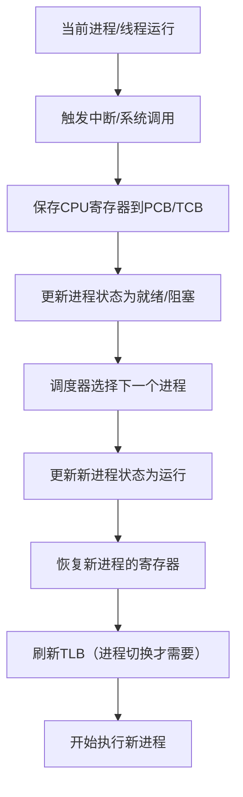
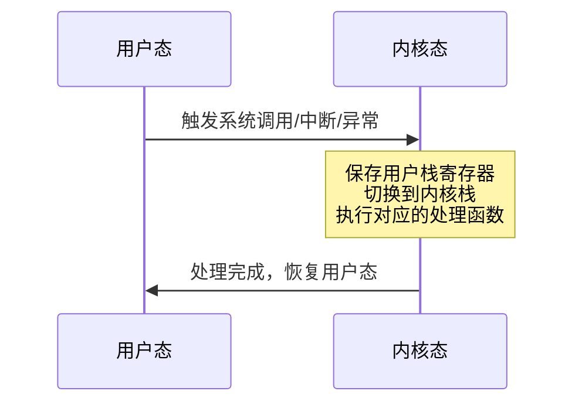
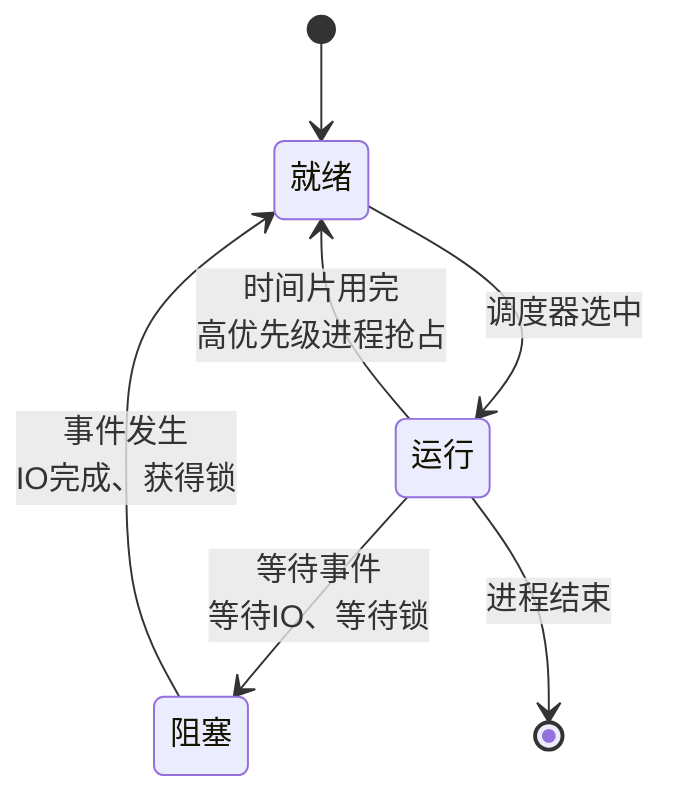

# 进程与线程

## ⭐ 面试重点速览

| 考点 | 频率 | 难度 | 考察方式 |
|------|------|------|----------|
| 进程 vs 线程区别 | ⭐⭐⭐⭐⭐ | ⭐⭐ | 直接问区别，需要从多个维度回答 |
| 上下文切换开销 | ⭐⭐⭐⭐ | ⭐⭐⭐ | 问具体包含哪些操作，开销在哪里 |
| 用户态 vs 内核态 | ⭐⭐⭐⭐⭐ | ⭐⭐⭐ | 为什么需要两种状态，切换时机 |
| 并发 vs 并行 | ⭐⭐⭐⭐ | ⭐ | 概念区分，结合实际场景 |
| 多进程 vs 多线程选型 | ⭐⭐⭐ | ⭐⭐⭐⭐ | 架构设计题，看工程理解 |

---

## 一、基本概念

### 什么是进程？

进程（Process）是**操作系统进行资源分配和调度的基本单位**，是程序在计算机上的一次执行活动。

每个进程拥有独立的：
- **地址空间**：独立的虚拟内存空间
- **文件描述符表**：打开的文件句柄
- **信号处理**：独立的信号处理函数
- **进程控制块（PCB）**：保存进程状态信息
- **资源所有权**：内存、文件、IO等资源

### 什么是线程？

线程（Thread）是**CPU调度的基本单位**，也称为轻量级进程（LWP）。

线程共享进程的资源：
- 同一个地址空间
- 同一个文件描述符表
- 相同的信号处理
- 共享堆内存

每个线程拥有独立的：
- **程序计数器（PC）**：记录下一条指令地址
- **栈空间**：保存局部变量和返回地址
- **寄存器集合**：保存CPU寄存器状态
- **线程控制块（TCB）**：保存线程状态

### 进程 vs 线程 对比

| 对比维度 | 进程 | 线程 |
|----------|------|------|
| 资源分配 | 资源分配单位，拥有独立地址空间 | CPU调度单位，共享进程地址空间 |
| 切换开销 | 大（需要切换页表、刷新TLB） | 小（只需要切换寄存器和栈） |
| 通信方式 | 需要IPC（进程间通信） | 直接读写共享内存 |
| 并发性 | 多进程可以真正并行 | 多线程也可以并行 |
| 安全性 | 一个进程崩溃不影响其他进程 | 一个线程崩溃会导致整个进程崩溃 |
| 系统调用 | 更多页表操作，TLB失效 | 更少，共享页表 |

::: tip 相关阅读
Java中的线程实现参见：[Java 并发编程](../../java-advanced/concurrency/index.md)
JVM中的线程模型参见：[JVM 内存模型](../../java-advanced/jvm/memory-model.md)
:::

---

## 二、上下文切换

### 什么是上下文切换？

上下文切换（Context Switch）是指CPU从一个进程/线程切换到另一个进程/线程时，保存当前状态并加载新状态的过程。

### 上下文切换的完整流程



### 切换的具体开销

| 切换类型 | 保存内容 | 刷新操作 | 开销 |
|----------|----------|----------|------|
| 进程切换 | PCB + 页表基址 | 需要刷新TLB | ~1000-1500 时钟周期 |
| 线程切换（同进程） | TCB + 寄存器 | 不需要刷新TLB | ~100-300 时钟周期 |
| 线程切换（跨进程） | 同进程切换 | 需要刷新TLB | 同进程切换开销 |

### 哪些操作会触发上下文切换？

1. **中断处理**：硬件中断，定时器到了
2. **系统调用**：用户程序陷入内核
3. **进程调度**：当前进程时间片用完
4. **进程阻塞**：等待IO、等待锁
5. **唤醒抢占**：高优先级进程抢占CPU

::: warning TLB 刷新开销
进程切换时，因为地址空间不同，TLB中缓存的页表项会失效，需要全部刷新。这是进程切换最大的开销来源。线程切换共享同一个地址空间，TLB不需要刷新，所以快很多。
:::

---

## 三、用户态 vs 内核态

### 为什么需要两种特权级？

为了**隔离**和**保护**：
- 内核掌握系统资源，需要保护不被用户程序随意修改
- 用户程序出错时，不会影响内核和其他进程
- 防止用户程序直接操作硬件，保证系统安全

### 特权级分级（x86）

x86 CPU 有 4 个特权级（Ring 0 ~ Ring 3）：
- **Ring 0**：内核态，可以执行所有指令，访问所有地址
- **Ring 1 ~ Ring 2**：未使用，保留
- **Ring 3**：用户态，只能访问受限资源，不能直接访问硬件

### 用户态到内核态的切换时机

三种方式会触发切换：

1. **系统调用（System Call）**
   - 用户程序主动请求内核服务
   - 例如：read()、write()、malloc() 扩展堆

2. **中断（Interrupt）**
   - IO设备完成操作，通知CPU
   - 例如：磁盘读完成、键盘输入

3. **异常（Exception）**
   - CPU执行过程中遇到错误
   - 例如：缺页异常、除零错误



### 系统调用 vs 中断的区别

| 对比 | 系统调用 | 中断 |
|------|----------|------|
| 触发时机 | **同步**，用户程序主动请求 | **异步**，硬件异步通知 |
| 上下文 | 同一个进程上下文 | 通常切入当前进程上下文 |
| 返回方式 | 回到调用者下一条指令 | 回到被中断的地方继续执行 |

::: tip 相关阅读
Java NIO中涉及大量系统调用，参见：[Java NIO](../../java-advanced/io-nio/nio.md)
:::

---

## 四、并发 vs 并行

### 基本概念

- **并发（Concurrency）**：多个任务在**同一时间段内**交替执行，宏观上同时进行，微观上串行。
- **并行（Parallelism）**：多个任务在**同一时刻**同时执行，需要多个CPU核心。

### 图解对比

```mermaid
graph LR
    subgraph 并发 Concurrent
    direction LR
    T1[Task 1] --- T2[Task 2] --- T1 --- T2 --- T1
    end
    subgraph 并行 Parallel
    direction LR
    Core1: T1 T1 T1 T1
    Core2: T2 T2 T2 T2
    end
```

### 实际场景举例

| 场景 | 并发 | 并行 |
|------|------|------|
| 单CPU核心跑多个线程 | ✓ | ✗ |
| 多CPU核心跑多个线程 | ✓ | ✓ |
| Node.js单线程处理多个请求 | ✓ (事件驱动) | ✗ |
| Tomcat线程池处理请求 | ✓ | ✓ (多核心) |

### 并发解决什么问题？

1. **IO密集型**：大部分时间等IO，CPU闲着想干活
   - 比如：Web服务器处理请求，大部分时间等数据库
   - 并发可以让CPU在等IO的时候处理其他请求
   - 提高CPU利用率

2. **提升响应性**：后台任务不阻塞用户交互
   - 比如：UI线程响应用户点击，后台线程处理计算

### 并行解决什么问题？

1. **CPU密集型**：利用多核心加速计算
   - 比如：视频编码、大数据处理
   - 分而治之，MapReduce

---

## 五、进程的三种基本状态



- **就绪状态**：进程已获得除CPU外的一切资源，等待分配CPU
- **运行状态**：进程正在CPU上执行
- **阻塞状态**：进程等待某事件发生，暂时无法运行（即使CPU空闲也不能运行）

---

## 六、面试高频题

### Q1: 进程和线程的区别？为什么要有线程？

**标准答案：**

**区别：**
1. 进程是资源分配的基本单位，线程是CPU调度的基本单位
2. 进程有独立的地址空间，线程共享进程的地址空间
3. 进程切换开销大，需要刷新TLB；线程切换开销小，不需要刷新TLB
4. 进程间通信需要特殊机制（IPC），线程可以直接读写共享内存
5. 一个进程崩溃不影响其他进程，一个线程崩溃会导致整个进程崩溃

**为什么需要线程：**
1. **并发更高效**：创建一个线程比创建进程快得多
2. **切换开销小**：线程切换比进程切换开销小一个数量级
3. **通信更方便**：共享内存，不需要内核介入
4. **更好利用多核**：多线程可以并行在多个核心上

**背景：** 在多线程出现之前，一个进程同一时刻只能做一件事。如果需要同时做多件事（边下载边显示边保存），就必须多进程，开销太大。线程让一个进程内部也能并发执行多个任务。

---

### Q2: 上下文切换具体做了哪些事情？开销在哪里？

**标准答案：**

**具体步骤：**
1. 暂停当前进程/线程，把CPU寄存器的值保存到PCB/TCB中
2. 更新进程状态（从运行变为就绪/阻塞）
3. 调度器根据算法选择下一个要运行的进程
4. 恢复新进程的寄存器上下文
5. **如果是进程切换**：需要加载新的页表基址（CR3寄存器），刷新TLB
6. 开始执行新进程

**主要开销：**
1. **直接开销**：保存和恢复寄存器、PCB/TCB操作，大约几百个时钟周期
2. **间接开销**：进程切换导致TLB刷新，重新建立TLB缓存，这是最大开销
3. **缓存影响**：新进程会冲刷原进程的CPU缓存命中率

**线程切换比进程切换快在哪里？** 同进程内的线程切换共享同一个地址空间，不需要修改页表，不需要刷新TLB，所以快5~10倍。

---

### Q3: 什么时候从用户态切换到内核态？

**标准答案：**

三种情况：

1. **系统调用**：用户程序主动请求内核服务，比如读写文件、分配内存、创建线程。这是**同步**的，用户主动发起。

2. **中断**：IO设备完成操作后，发中断信号给CPU，CPU暂停当前程序去处理中断。比如磁盘读完成、网络包到达、键盘输入。这是**异步**的，硬件主动发起。

3. **异常**：CPU执行过程中遇到错误，比如缺页异常（page fault）、除零错误、非法指令。CPU会陷入内核处理错误。

系统调用本质上也是通过中断实现的（x86上是 `int 0x80` 指令），但它是用户主动请求，和异步硬件中断不同。

---

### Q4: 并发和并行的区别？举个实际例子。

**标准答案：**

**并发**是多个任务**在同一时间段内**交替执行，宏观上同时进行，微观上还是串行。比如单CPU核心通过时间片轮转跑多个线程，就是并发。

**并行**是多个任务**在同一时刻**同时执行，必须要有多个CPU核心才能实现。比如两个线程分别跑在两个核心上，就是并行。

**例子：**
- 你吃饭吃到一半，电话来了，你停下来去接电话，接完继续吃饭，这是**并发**（处理多件事，交替进行）
- 你吃饭吃到一半，电话来了，你一边吃饭一边接电话，这是**并行**（同时处理多件事）

**工程应用：**
- Web服务器处理请求，用多线程/事件驱动，本质是并发，提高CPU利用率（利用等IO的间隙处理其他请求）
- 视频编码，用多线程分块编码，利用多核心，这是并行，加快整体速度

---

### Q5: 多进程和多线程该怎么选？

**标准答案：**

**选择多进程的场景：**
1. **稳定性要求高**：一个进程挂了不影响其他进程，比如Nginx的worker进程模型、Chrome的多进程架构
2. **隔离性要求**：不同服务需要隔离地址空间，防止互相干扰
3. **利用多核+稳定优先**：比如后端服务，一个进程处理一个端口，挂了其他进程还能工作
4. **用不上共享内存**：任务之间不需要大量共享数据，通信少

**选择多线程的场景：**
1. **需要共享数据**：任务之间需要频繁共享大量数据，用线程共享内存比IPC方便
2. **追求性能**：创建和切换开销小，高并发场景更适合，比如Tomcat的线程池模型
3. **IO密集型任务**：需要大量并发等待IO，线程更轻量
4. Java生态默认就是多线程，JVM本身就是多线程模型

**现代趋势：** 协程（用户态线程）正在变得越来越流行，比线程更轻量，切换开销更小，适合超高并发场景。Go语言原生支持协程。

---

### Q6: 什么是重入？线程安全和可重入的区别？

**标准答案：**

**可重入函数**：指一个函数可以被多个线程安全地重复调用，即使在调用过程中被打断，再次进入也不会出错。可重入要求：
- 不使用静态/全局的非const变量
- 不返回静态/全局变量的地址
- 只使用调用者提供的数据
- 不调用不可重入函数

**区别：**
- 可重入：一定线程安全，因为靠调用者提供的数据，没有共享状态
- 线程安全：不一定可重入，线程安全可能用了锁保护全局状态，如果锁已经被当前线程持有了，重入可能会死锁
- 比如：用了互斥锁保护的函数，不一定是可重入的

