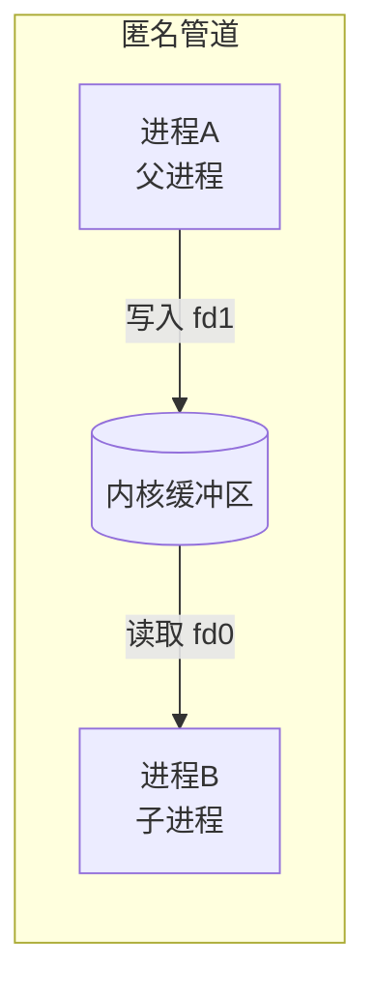
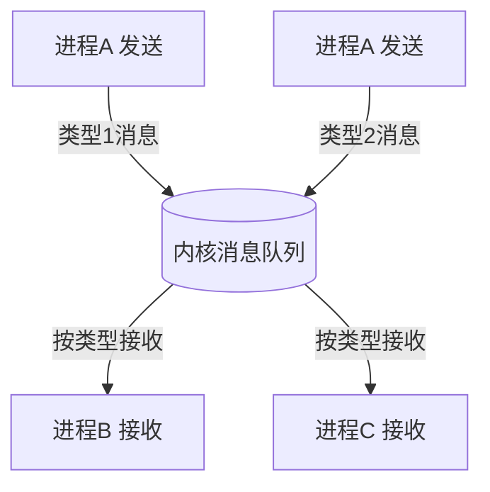
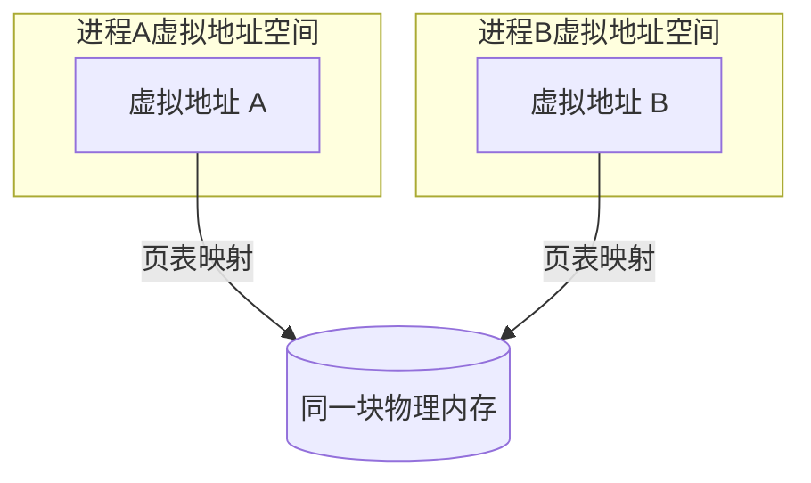
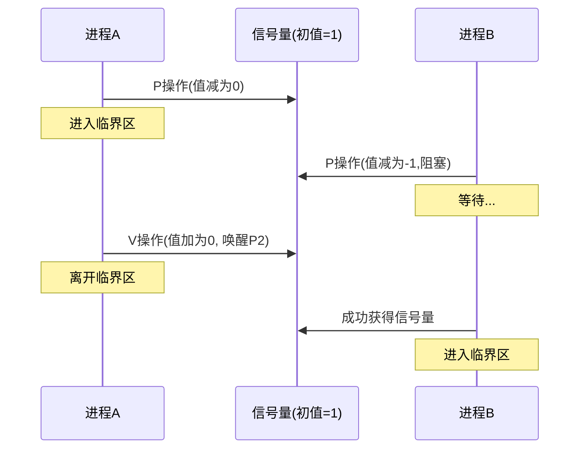
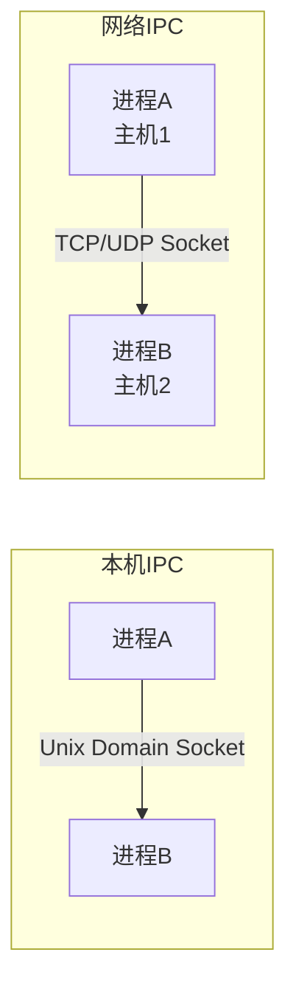
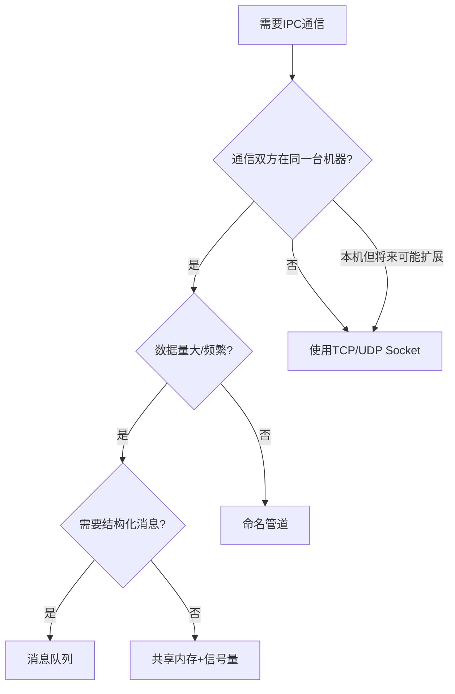

# 进程间通信（IPC）

## ⭐ 面试重点速览

| 考点 | 频率 | 难度 | 考察方式 |
|------|------|------|----------|
| 各类IPC方式及区别 | ⭐⭐⭐⭐⭐ | ⭐⭐⭐ | 列举并对比，说出适用场景 |
| 管道 vs 消息队列 | ⭐⭐⭐ | ⭐⭐ | 区别是什么，分别怎么用 |
| 共享内存为什么最快 | ⭐⭐⭐⭐ | ⭐⭐ | 原理和零拷贝对比 |
| Socket 通信原理 | ⭐⭐⭐⭐ | ⭐⭐⭐ | Unix Domain Socket vs TCP Socket |
| IPC选型设计 | ⭐⭐⭐ | ⭐⭐⭐⭐ | 设计题：不同场景该用什么 |

---

## 一、IPC 概述

进程间通信（Inter-Process Communication，IPC）是指在不同进程之间传递数据或信号的机制。

为什么需要 IPC？
- 不同进程的地址空间是**隔离**的，一个进程无法直接访问另一个进程的内存
- 这是操作系统出于安全性和稳定性考虑的设计
- IPC 本质是在两个隔离的地址空间之间**建立一条通道**

---

## 二、六种 IPC 方式详解

### 2.1 管道（Pipe）

管道是最古老的 IPC 方式，本质上是一个**内核中的环形缓冲区**。



**类型：**

| 类型 | 特点 | 使用场景 |
|------|------|----------|
| 匿名管道 | 单向传输，只能在父子进程间使用 | Shell 管道 `ls \| grep txt` |
| 命名管道（FIFO） | 有文件名，任意进程可读写 | 无亲缘关系进程通信 |

::: tip 匿名管道实现原理
匿名管道创建时会生成两个文件描述符：`fd[0]`（读端）和 `fd[1]`（写端）。父进程 fork 后，子进程会继承这两个 fd，从而与父进程共享同一个管道。
:::

**特点：**
- **半双工**：数据只能单向流动
- **面向字节流**：数据无边界
- **阻塞式**：读空管道会阻塞，写满管道也会阻塞
- **容量有限**：典型 Linux 管道缓冲区 64KB

---

### 2.2 消息队列（Message Queue）

消息队列是保存在内核中的**消息链表**，有边界的结构化消息。



**特点：**
- **面向消息**：每一条消息有明确的边界
- **支持按类型读取**：一个队列可以有多种消息类型
- **异步通信**：发送方和接收方解耦
- **生命周期**：随内核存在，不依赖进程生命周期

**管道 vs 消息队列对比：**

| 对比维度 | 管道 | 消息队列 |
|----------|------|----------|
| 数据格式 | 字节流，无边界 | 结构化消息，有边界 |
| 读取方式 | 顺序读 | 可按类型读 |
| 容量限制 | 64KB（管道缓冲区） | 受系统限制，通常更大 |
| 时效性 | 数据读完就消失 | 消息可在队列中持久保存 |

---

### 2.3 共享内存（Shared Memory）

共享内存是**最快的 IPC 方式**。两个进程将同一块物理内存映射到各自的虚拟地址空间中，直接读写，**无需内核中转**。



**为什么共享内存最快？**

1. **零拷贝**：不需要把数据从用户态拷到内核态再拷回来
2. **最少系统调用**：建立映射后，后续读写就像操作本地内存
3. **管道/消息队列都需要**：用户态 → 内核态 → 用户态 两次拷贝

```
管道通信的数据流：
进程A用户缓冲区 → 内核管道缓冲区 → 进程B用户缓冲区  （2次拷贝）

共享内存的数据流：
进程A写 → 共享内存 ← 进程B读  （0次内核拷贝）
```

::: danger 共享内存的同步问题
共享内存本身不提供同步机制。多个进程同时写同一块内存，会导致数据竞争。必须配合信号量、互斥锁等机制来保证一致性。

参考：[同步与互斥](./sync.md)
:::

---

### 2.4 信号量（Semaphore）

信号量是一个**计数器**，主要用于进程间的**同步和互斥**。

信号量有两个原子操作：
- **P 操作（wait / down）**：信号量值减 1，如果值 < 0，进程阻塞等待
- **V 操作（signal / up）**：信号量值加 1，如果值 ≤ 0，唤醒一个等待进程



**信号量 vs 互斥锁：**

| 对比 | 信号量 | 互斥锁（Mutex） |
|------|--------|-----------------|
| 用法 | 允许多个进程同时访问 | 只允许一个进程访问 |
| 值范围 | 0～N（任意非负整数） | 0 或 1（二进制） |
| 释放者 | 可以不是持有者 | 必须由持有者释放 |

---

### 2.5 Socket

Socket 是最通用的 IPC 方式，不仅可以用于本机进程通信，也可以用于网络中不同主机之间的通信。



**两种 Socket 类型：**

| 类型 | 地址格式 | 速度 | 使用场景 |
|------|----------|------|----------|
| Unix Domain Socket | 文件路径（`/tmp/xxx.sock`） | 极快（不走网络栈） | 本机进程间通信 |
| TCP/UDP Socket | IP + 端口 | 较慢 | 网络通信 |

::: tip Unix Domain Socket
Unix Domain Socket 通信完全在**内核内存**中完成，走的是文件系统路径，不需要经过协议栈，速度比 TCP Socket 快很多。MySQL、Redis、Docker 都在用。
:::

---

## 三、六种 IPC 方式总对比

| IPC方式 | 复杂度 | 速度 | 是否需要同步 | 通信范围 | 典型应用 |
|---------|--------|------|-------------|----------|----------|
| 匿名管道 | 简单 | 中 | 不需要 | 父子进程 | Shell管道 |
| 命名管道 | 简单 | 中 | 不需要 | 任意进程 | 简单进程通信 |
| 消息队列 | 中等 | 中 | 不需要 | 任意进程 | 异步任务分发 |
| 共享内存 | 复杂 | **最快** | **需要**同步机制 | 任意进程 | 高频数据交换 |
| 信号量 | 中等 | - | 本身就是同步 | 任意进程 | 资源计数、同步 |
| Socket | 复杂 | 中-慢 | 不需要 | 任意主机 | 网络服务 |

---

## 四、IPC 方式选型指南



::: warning 共享内存选型注意
共享内存虽然最快，但需要自己实现同步。很多系统选择消息队列 + 共享内存的组合：
- 小控制消息走消息队列
- 大块数据走共享内存（传指针）
:::

---

## 五、与 Java 的关联

| IPC方式 | Java对应技术 |
|---------|-------------|
| 共享内存 | `MappedByteBuffer`（FileChannel.map） |
| Socket | Java NIO、Netty |
| 消息队列 | RocketMQ、Kafka（分布式消息队列） |
| 管道 | `PipedInputStream/PipedOutputStream` |

::: tip 相关阅读
- [Java NIO](../../java-advanced/io-nio/nio.md)
- [Netty框架](../../java-advanced/io-nio/netty.md)
- [消息队列 - Kafka](../../middleware/message-queue/kafka.md)
- [消息队列 - RocketMQ](../../middleware/message-queue/rocketmq.md)
:::

---

## 六、面试高频题

### Q1: Linux下有哪些IPC方式？各有什么特点？

**标准答案：**

六种：

1. **管道**：半双工、字节流、仅父子进程（匿名）或任意进程（命名管道）。简单但受限。
2. **消息队列**：结构化消息、支持按类型读取、生命周期随内核。适合消息驱动的通信。
3. **共享内存**：最快的IPC，直接映射同一块物理内存，零拷贝。但需要自己实现同步。
4. **信号量**：计数器，主要用于同步而非数据传递。PV原子操作。
5. **Socket**：最通用，支持跨网络。Unix Domain Socket 用于本机进程间通信，速度很快。
6. **信号**：轻量级通知机制（如 SIGKILL、SIGINT），只能传信号号，不能传数据。

---

### Q2: 为什么共享内存是最快的IPC方式？

**标准答案：**

核心原因：**零拷贝，无需内核中转**。

管道、消息队列的通信路径：
```
进程A → copy_to_user → 内核缓冲区 → copy_to_user → 进程B
```
每次通信需要至少两次内存拷贝（用户态↔内核态）。

共享内存的通信路径：
```
进程A → 写共享内存 ← 进程B 直接读
```
建立映射后（mmap），后续所有读写都像操作本地内存一样，直接操作物理内存，不需要任何系统调用，不需要数据拷贝。所以最快。

代价是：必须自己处理同步问题（多进程同时写会数据竞争）。

---

### Q3: 匿名管道和命名管道有什么区别？

**标准答案：**

| 区别维度 | 匿名管道 | 命名管道（FIFO） |
|----------|----------|------------------|
| 创建方式 | `pipe()` 系统调用 | `mkfifo()` 创建文件节点 |
| 文件名 | 无文件名 | 有文件名，存在于文件系统 |
| 使用范围 | 只能父子/兄弟进程间使用 | 任意有权限的进程可使用 |
| 生命周期 | 随创建它的进程消亡 | 像文件一样持久存在 |
| 通信方向 | 单向（半双工） | 单向（半双工），需两个管道实现双向 |

**使用场景：**
- 匿名管道：Shell 中的 `|` 操作符、父子进程间的简单数据传递
- 命名管道：两个独立进程间的命令式通信

---

### Q4: Unix Domain Socket和TCP Socket有什么区别？

**标准答案：**

| 对比维度 | Unix Domain Socket | TCP Socket |
|----------|-------------------|-------------|
| 通信范围 | 仅本机 | 本机 + 网络 |
| 地址格式 | 文件路径 | IP + 端口 |
| 协议栈 | 不走TCP/IP协议栈 | 走完整TCP/IP协议栈 |
| 速度 | **更快**（内核内存直接传递） | 较慢（经过网络层） |
| 数据校验 | 不需要校验和 | 需要校验和 |

**为什么 Unix Domain Socket 更快？**

因为它不需要：
- 网络层的封装和拆封
- 路由查找
- 校验和计算
- 拥塞控制和流量控制
- 三次握手（本机通信直接建立）

它只是在内核中把数据从一个socket缓冲区复制到另一个socket缓冲区。

---

### Q5: 消息队列和管道的区别是什么？什么场景用消息队列？

**标准答案：**

**区别：**

1. **数据边界**：管道是字节流，无边界；消息队列是结构化消息，有明确边界
2. **读取方式**：管道只能顺序读；消息队列可以按消息类型读取
3. **生命周期**：管道随进程消亡；消息队列随内核存在
4. **容量大小**：管道缓冲区一般64KB；消息队列受系统限制更大

**消息队列适用场景：**

1. 需要结构化消息（每条消息有类型、有边界）
2. 发送方和接收方完全解耦（不需要同时在线）
3. 一个发送方，多个接收方按消息类型分别处理
4. 需要消息持久化（即使接收方崩溃，消息也不丢）

实际例子：Linux的 `msgget/msgsnd/msgrcv` 系统调用；分布式的 RocketMQ、Kafka 也是消息队列思想的扩展。

---

### Q6: 共享内存如何使用？需要注意什么问题？

**标准答案：**

**使用步骤（POSIX标准）：**

1. `shm_open()`：创建或打开一个共享内存对象
2. `ftruncate()`：设置共享内存大小
3. `mmap()`：将共享内存映射到当前进程的虚拟地址空间
4. 直接读写映射后的内存地址
5. `munmap()`：解除映射
6. `shm_unlink()`：删除共享内存对象

**需要注意的问题：**

1. **同步问题**：共享内存本身不提供同步，需要配合信号量或互斥锁，否则多进程同时写会导致数据错乱
2. **内存布局**：不同进程的共享内存虚拟地址可能不同，不要使用指针来传递数据（指针在不同进程中无效），应该用偏移量
3. **大小固定**：创建时确定大小，不能动态扩容
4. **生命周期**：即使所有进程都解除映射，共享内存仍然存在直到显式删除或系统重启
5. **安全风险**：任何有权限的进程都可以读写共享内存