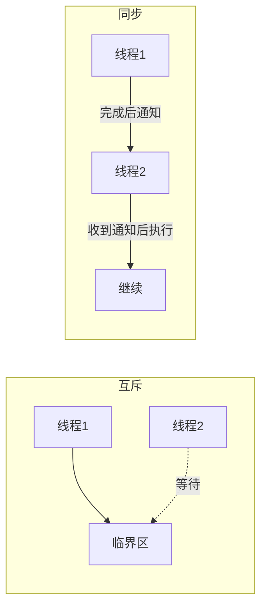
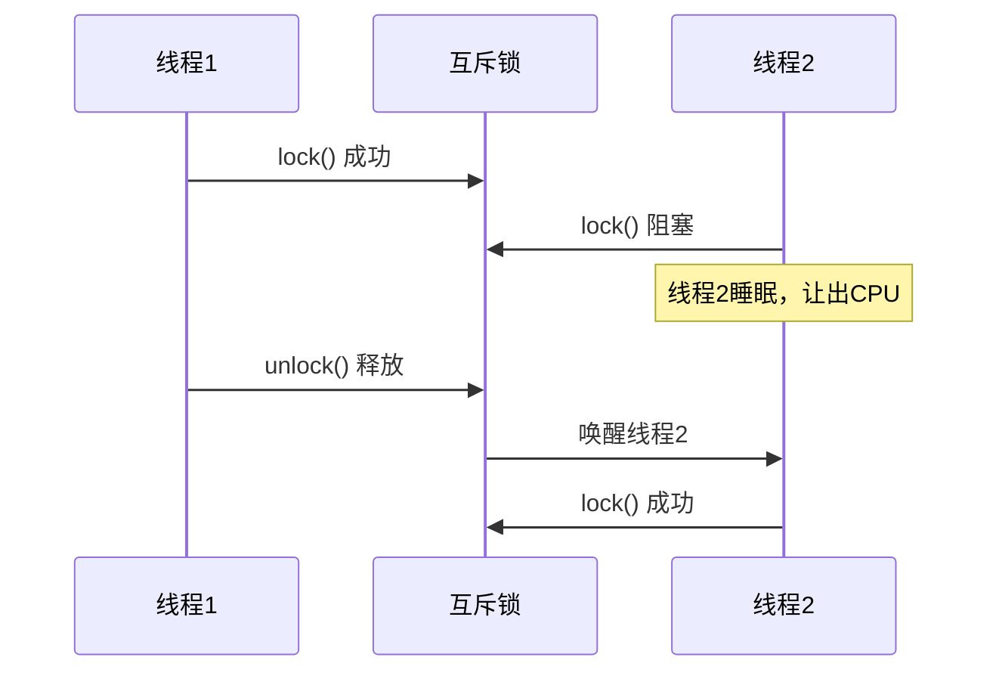
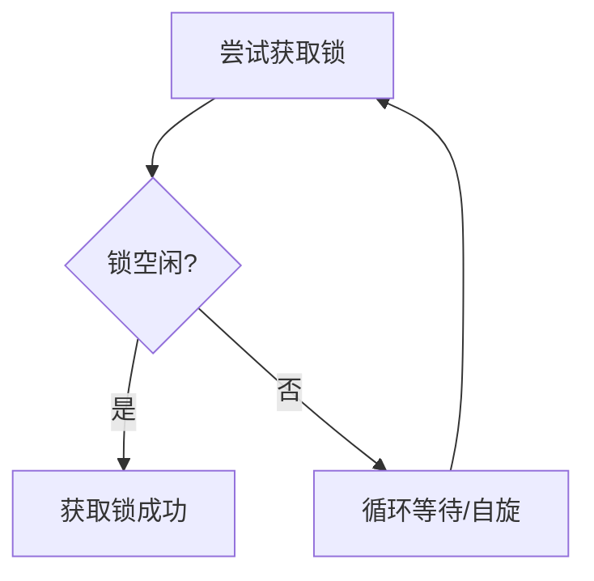
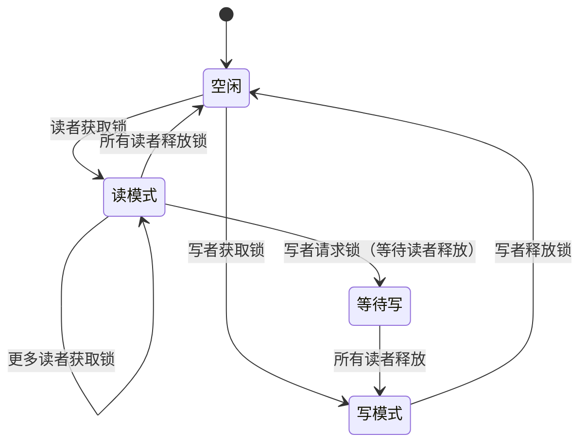
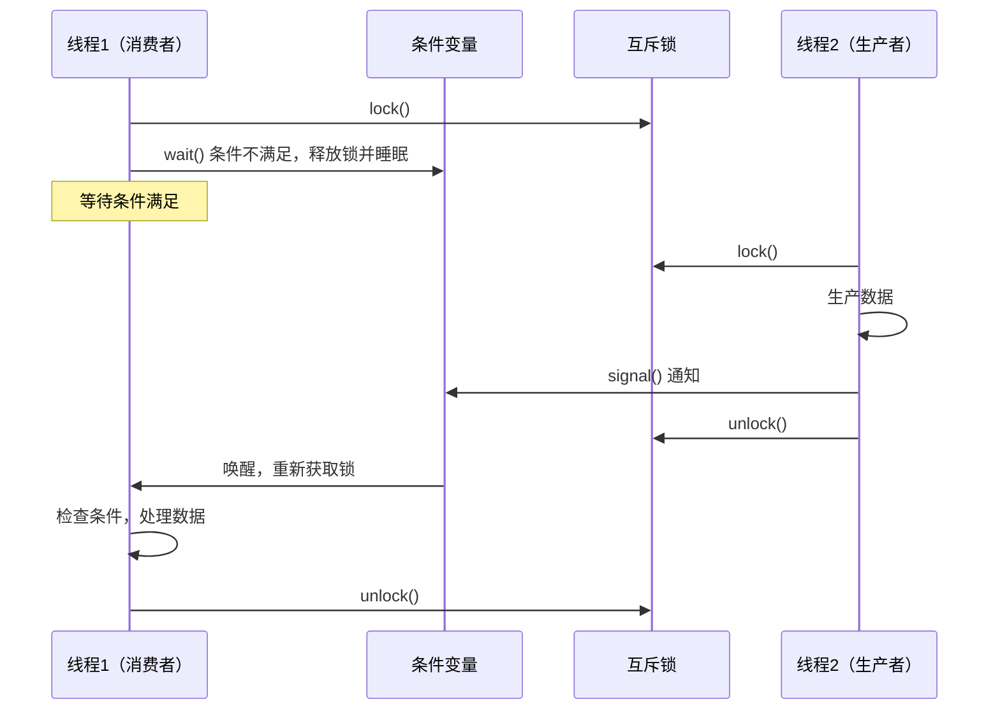
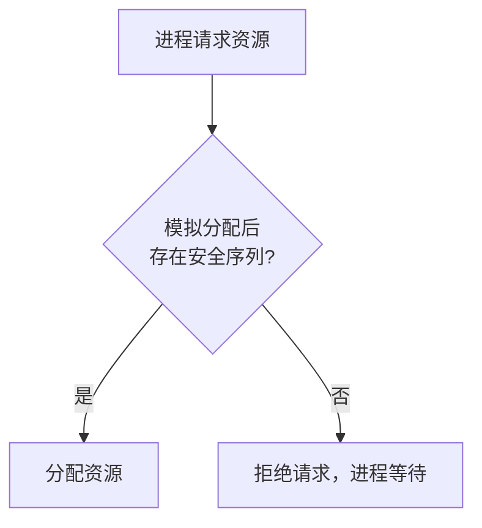

# 同步与互斥

## ⭐ 面试重点速览

| 考点 | 频率 | 难度 | 考察方式 |
|------|------|------|----------|
| 互斥锁 vs 自旋锁 | ⭐⭐⭐⭐⭐ | ⭐⭐⭐ | 区别、适用场景、各自优缺点 |
| 读写锁原理 | ⭐⭐⭐⭐ | ⭐⭐⭐ | 读写锁升级降级问题 |
| 死锁四个必要条件 | ⭐⭐⭐⭐⭐ | ⭐⭐⭐⭐ | 默写四个条件，结合场景分析 |
| 死锁预防 vs 避免 | ⭐⭐⭐⭐ | ⭐⭐⭐⭐⭐ | 银行家算法、资源分配图 |
| 条件变量使用 | ⭐⭐⭐ | ⭐⭐⭐ | 为什么需要while而非if |

---

## 一、同步与互斥的基本概念

### 互斥（Mutual Exclusion）

**同一时刻**只允许一个进程/线程访问共享资源（临界区），其他进程/线程必须等待。

### 同步（Synchronization）

多个进程/线程之间按照**特定的顺序**执行，协调彼此的执行节奏。



**互斥解决的是"不能同时访问"的问题，同步解决的是"按照什么顺序执行"的问题。**

---

## 二、锁的类型与对比

### 2.1 互斥锁（Mutex）

互斥锁是最基本的锁，同一时刻只有一个线程能持有。



**互斥锁的特点：**
- 获取不到锁时，线程会**阻塞睡眠**，让出CPU
- 需要内核参与：线程睡眠和唤醒需要系统调用，有上下文切换开销
- 适合**临界区执行时间长**的场景

---

### 2.2 自旋锁（Spinlock）

自旋锁获取不到锁时，线程不会睡眠，而是**忙等待**（busy-wait），不断循环检查锁是否可用。



**自旋锁 vs 互斥锁对比：**

| 对比维度 | 互斥锁（Mutex） | 自旋锁（Spinlock） |
|----------|----------------|-------------------|
| 等待方式 | 阻塞睡眠，让出CPU | 忙等待，占用CPU |
| 上下文切换 | 有（睡眠 + 唤醒） | 无 |
| 适用场景 | 临界区**长**（毫秒级） | 临界区**短**（微秒级） |
| 内核实现 | 需要调度器参与 | 不需要调度器 |
| 使用场景 | 用户态锁 | 内核态锁（中断上下文） |

::: warning 自旋锁的注意事项
1. 持有自旋锁期间**不能睡眠**（睡眠会导致死锁，因为调度器可能选不到其他线程）
2. 持有自旋锁期间**不能调用可能阻塞的函数**
3. 自旋锁适合临界区非常短的情况（比如改变一个变量的值），否则会浪费CPU
4. 在单核CPU上，自旋锁没有意义（别的线程不可能释放锁，因为它在自旋）
:::

---

### 2.3 读写锁（RWLock）

读写锁区分了读操作和写操作：
- **读锁（共享锁）**：多个读者可以同时持有
- **写锁（排他锁）**：只有一个写者能持有，且不能有读者



**读写锁的三种策略：**

| 策略 | 行为 | 优点 | 缺点 |
|------|------|------|------|
| 读优先 | 读者优先，写者可能饿死 | 读并发高 | 写者可能长时间等待 |
| 写优先 | 写者优先，新读者等待 | 写者不会饿死 | 读者并发度降低 |
| 公平策略 | 按请求顺序 | 公平 | 实现复杂 |

---

### 2.4 条件变量（Condition Variable）

条件变量不是锁，而是**一种同步机制**，允许线程等待某个条件成立。



::: danger 条件变量必须用 while 而非 if
```c
// 错误写法：用 if
if (queue_empty) {
    pthread_cond_wait(&cond, &mutex);
}

// 正确写法：用 while
while (queue_empty) {
    pthread_cond_wait(&cond, &mutex);
}
```

原因：
1. **虚假唤醒（Spurious Wakeup）**：条件变量可能在没有 signal 的情况下被唤醒
2. **多个消费者**：被唤醒后，可能另一个线程已经取走了数据
3. 用 while 可以在被唤醒后**重新检查条件**，确保条件真的满足
:::

---

## 三、死锁（Deadlock）

### 3.1 死锁的四个必要条件

这四个条件**必须同时满足**才会发生死锁，缺一不可：

| 条件 | 含义 | 举例 |
|------|------|------|
| 互斥条件 | 资源同一时刻只能被一个进程持有 | 锁只能被一个线程持有 |
| 请求与保持 | 进程已持有资源，又请求新资源 | 持有锁A，等待锁B |
| 不可剥夺 | 进程持有的资源不能被强制释放 | 锁不能被其他线程释放 |
| 循环等待 | 进程之间形成环形等待链 | 线程1等线程2，线程2等线程1 |


### 3.2 死锁处理策略

#### 预防（Prevention）

**破坏四个必要条件之一**，从根本上杜绝死锁。

| 破坏条件 | 方法 | 代价 |
|----------|------|------|
| 互斥 | 不可破坏（共享资源必须互斥访问） | - |
| 请求与保持 | 一次性申请所有资源 | 资源利用率低，可能饥饿 |
| 不可剥夺 | 允许抢占资源 | 实现复杂，状态恢复困难 |
| 循环等待 | 资源按序分配（所有锁按固定顺序获取） | 编程约束，但最实用 |

#### 避免（Avoidance）

**银行家算法**：在分配资源前，判断是否会导致系统进入不安全状态。

核心思想：系统在分配资源前，先模拟分配后是否仍存在安全序列（即所有进程都能完成）。如果存在安全序列，则分配；否则拒绝。



::: tip 银行家算法的局限
实际系统中很少使用银行家算法，因为：
1. 需要预知每个进程所需的最大资源数（不现实）
2. 进程数量动态变化
3. 算法复杂度 O(n^2 * m)，n为进程数，m为资源类型数
:::

#### 检测与恢复（Detection & Recovery）

不预防，发生死锁后检测并解除。

**检测方法：**
- 资源分配图：检测是否存在环
- 超时检测：获取锁超过一定时间，认为死锁
- 死锁检测算法：定期扫描等待图

**恢复方法：**
1. 终止进程：终止所有死锁进程，或逐个终止直到死锁解除
2. 资源抢占：从某些进程中抢占资源，分配给其他进程

---

## 四、死锁的工程实践

### 避免死锁的编码原则

1. **固定锁顺序**：所有线程按相同顺序获取锁
```java
// 总是先锁A再锁B
synchronized(lockA) {
    synchronized(lockB) {
        // 临界区
    }
}
```

2. **使用 tryLock 超时**：避免无限等待
```java
if (lockA.tryLock(1, TimeUnit.SECONDS)) {
    try {
        if (lockB.tryLock(1, TimeUnit.SECONDS)) {
            try { /* 临界区 */ }
            finally { lockB.unlock(); }
        }
    } finally { lockA.unlock(); }
}
```

3. **减少锁的持有时间**：临界区尽量短
4. **减小锁粒度**：用细粒度锁替代粗粒度锁
5. **使用无锁数据结构**：原子变量、CAS

::: tip 相关阅读
- [Java 锁机制](../../java-advanced/concurrency/locks.md)
- [JUC 并发工具类](../../java-advanced/concurrency/juc.md)
- [并发编程实践](../../java-advanced/concurrency/practice.md)
:::

---

## 五、面试高频题

### Q1: 互斥锁和自旋锁的区别？什么时候用自旋锁？

**标准答案：**

**核心区别：** 互斥锁获取不到时线程**阻塞睡眠**，自旋锁获取不到时线程**忙等待**。

**互斥锁：**
- 获取不到锁时，线程阻塞，让出CPU
- 涉及线程调度，有上下文切换开销（~1000 时钟周期）
- 适合**临界区执行时间长**（毫秒级）的场景

**自旋锁：**
- 获取不到锁时，循环等待，不释放CPU
- 无上下文切换，但浪费CPU
- 适合**临界区执行时间极短**（微秒级）的场景

**什么时候用自旋锁？**
1. 临界区非常短（比如只修改一个标志位）
2. 锁争用不激烈
3. 不能睡眠的上下文（比如中断处理函数中）
4. 多核CPU环境（单核自旋锁无意义，因为持有锁的线程不可能执行）

---

### Q2: 死锁的四个必要条件是什么？如何预防？

**标准答案：**

**四个必要条件（缺一不可）：**
1. **互斥**：资源同一时刻只能被一个进程持有
2. **请求与保持**：进程已持有资源，又请求新资源
3. **不可剥夺**：进程持有的资源不能被强制释放
4. **循环等待**：进程之间形成环形等待链

**预防方法（破坏其中一个条件）：**
- 破坏"请求与保持"：一次性申请所有需要的资源，或者申请新资源前释放已持有的资源
- 破坏"不可剥夺"：允许抢占资源（Linux中几乎不用，实现太复杂）
- 破坏"循环等待"：**最实用的方法**，所有资源的获取按固定顺序进行

---

### Q3: 什么是银行家算法？为什么实际系统中很少用？

**标准答案：**

银行家算法是死锁**避免**（不是预防）算法，核心思想是：在分配资源前，模拟分配后是否仍存在安全序列。如果存在，则分配；否则拒绝。

**工作流程：**
1. 维护 Available（可用资源）、Max（最大需求）、Allocation（已分配）、Need（还需要的）四个矩阵
2. 每次资源请求时，先试探性分配
3. 检查是否存在一个安全序列（所有进程按某种顺序都能完成）
4. 有安全序列才真正分配

**为什么实际很少用：**
1. 需要预知每个进程的最大资源需求，实际系统中很难提前知道
2. 进程数量动态变化，算法复杂度高
3. 用户进程可能申请超出实际需要的资源上限
4. 大多数系统选择更简单的策略：死锁检测+恢复，或者直接让应用层处理

---

### Q4: 读写锁的升级和降级问题？为什么读锁不能升级到写锁？

**标准答案：**

**锁升级（读锁 → 写锁）**：持有读锁的线程想升级为写锁。

这会导致死锁：如果两个线程都持有读锁，又都想升级为写锁，它们会互相等待对方释放读锁，形成死锁。

```
线程1: 持有读锁 → 等待写锁
线程2: 持有读锁 → 等待写锁
// 双方都在等对方释放读锁，死锁
```

**锁降级（写锁 → 读锁）**：持有写锁的线程降级为读锁。这是**安全**的，Java 的 `ReentrantReadWriteLock` 支持降级。

**工程实践：**
- 大多数读写锁实现禁止升级（或者直接死锁）
- 允许降级（写锁 → 读锁）
- 如果需要读锁转写锁，应该先释放读锁，再获取写锁

---

### Q5: 条件变量使用中为什么用 while 而不是 if？

**标准答案：**

三个原因：

1. **虚假唤醒（Spurious Wakeup）**：POSIX 标准允许条件变量在没有 signal/broadcast 的情况下唤醒。如果使用 `if`，线程被虚假唤醒后会跳过条件检查，直接执行后续逻辑，可能出错。

2. **多消费者竞争**：当一个生产者 broadcast 唤醒多个消费者时，只有一个消费者能拿到数据，其他消费者被唤醒后会发现数据已被取走。用 `if` 的话，这些消费者会错误地认为有数据可用。

3. **信号丢失**：如果唤醒发生在 wait 之前，用 `if` 会错过这个信号。

**正确写法：**
```c
while (condition_not_met) {
    pthread_cond_wait(&cond, &mutex);
}
// 出来后条件一定满足
```

---

### Q6: 什么是活锁（Livelock）？和死锁有什么区别？

**标准答案：**

**活锁**是指两个线程互相"礼让"对方的资源，导致都在不断改变状态，但都无法继续执行。

**死锁 vs 活锁：**
- 死锁：两个线程都阻塞，**不动了**
- 活锁：两个线程都在运行，但**没有进展**

**例子：**
两个人在狭窄的走廊相遇，都侧身让路，但恰好都让到同一边，然后又同时让到另一边，反复如此。

**代码例子（两个线程互相释放锁）：**
```java
// 线程1和线程2都在尝试获取lockA和lockB
// 取不到就释放所有锁，重新尝试
// 如果它们恰好同时释放，就会形成活锁
```

**解决方法：** 引入随机退避（random backoff），让一方等待随机时间后再重试。