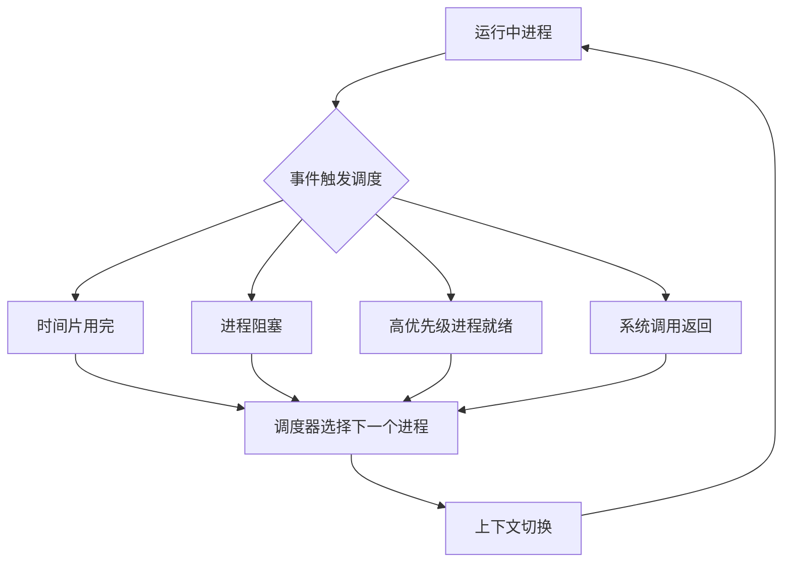
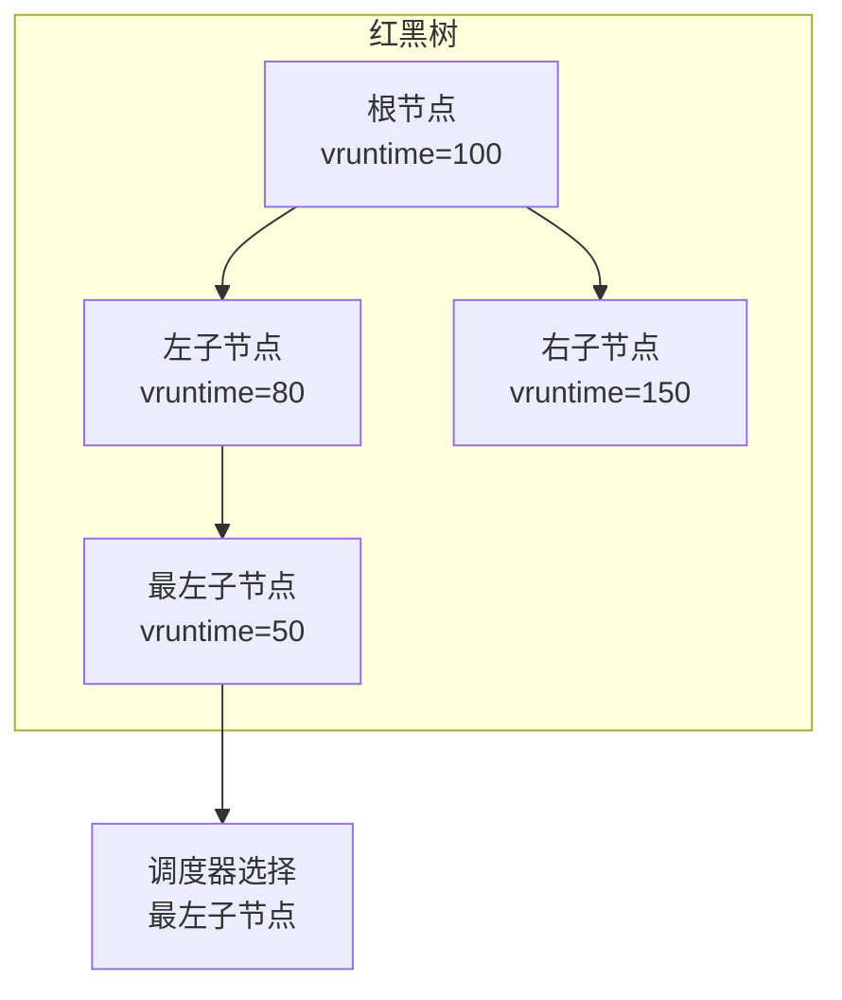
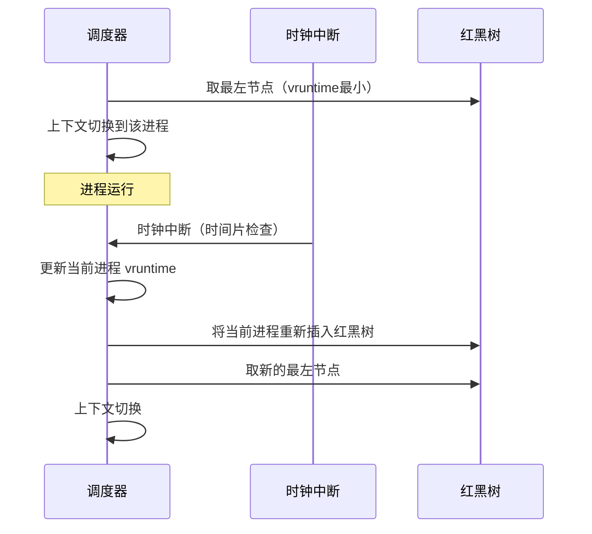
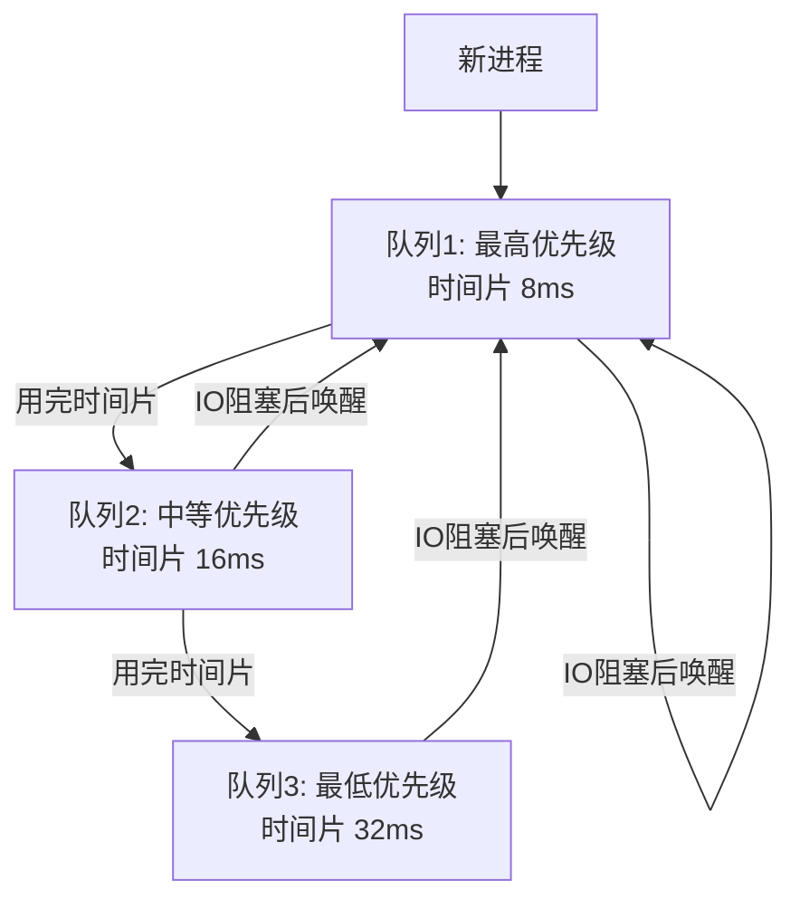

# 进程调度

## ⭐ 面试重点速览

| 考点 | 频率 | 难度 | 考察方式 |
|------|------|------|----------|
| CFS 完全公平调度 | ⭐⭐⭐⭐⭐ | ⭐⭐⭐⭐⭐ | 问vruntime、红黑树、如何选择下一个进程 |
| CPU 亲和性 | ⭐⭐⭐ | ⭐⭐ | 为什么绑定CPU、什么场景需要 |
| 调度算法对比 | ⭐⭐⭐⭐ | ⭐⭐⭐ | FIFO、SJF、RR、多级反馈队列 |
| 进程优先级 | ⭐⭐⭐⭐ | ⭐⭐⭐ | nice值、实时优先级、nice=0的含义 |
| 抢占式 vs 非抢占式 | ⭐⭐⭐ | ⭐⭐ | 区别、Linux的抢占时机 |

---

## 一、调度器概述

### 调度器在系统中的位置



### 什么时候触发调度？

1. **进程主动让出 CPU**：进程阻塞（等待 IO、等待锁）、主动调用 yield/sleep
2. **时间片用完**：CFS 调度类中，vruntime 超出阈值
3. **高优先级进程就绪**：新的实时进程唤醒，抢占当前进程
4. **系统调用返回**：从内核态返回用户态时检查是否需要调度

---

## 二、CFS 完全公平调度器

### 核心思想

CFS（Completely Fair Scheduler）是 Linux 2.6.23 之后默认的调度器。它的核心思想是：**让每个进程在理想情况下获得相同的 CPU 时间**。

### vruntime（虚拟运行时间）

CFS 不是用真实时间，而是用 **vruntime（虚拟运行时间）** 来衡量进程占用的 CPU。

```
vruntime = 实际运行时间 × (1024 / 进程权重)
```

- 权重高的进程（低 nice 值），vruntime 增长慢
- 权重低的进程（高 nice 值），vruntime 增长快
- CFS 总是选择 **vruntime 最小** 的进程运行

**本质：** 哪个进程获得的 CPU 时间"最少"，就优先运行它。

### 红黑树组织

CFS 使用**红黑树**来管理所有可运行进程，按 vruntime 排序：



**为什么用红黑树？**
- 最左子节点就是 vruntime 最小的进程（O(1) 查找）
- 插入和删除都是 O(log N)
- 自平衡，保证查找效率

### CFS 调度流程



### nice 值与权重

| nice 值 | 权重 | 相对 CPU 占比 |
|---------|------|-------------|
| -20（最高） | 88761 | 约 20% |
| 0（默认） | 1024 | 约 2.3% |
| 19（最低） | 15 | 约 0.03% |

nice 值相差 1，CPU 分配大约相差 10%。

---

## 三、调度算法对比

### 经典调度算法

| 算法 | 策略 | 优点 | 缺点 | 适用场景 |
|------|------|------|------|----------|
| FCFS（先来先服务） | 按到达顺序 | 简单公平 | 长作业堵在后面 | 批处理 |
| SJF（最短作业优先） | 选执行时间最短的 | 平均等待时间最短 | 需要预知执行时间，长作业可能饿死 | 批处理 |
| RR（时间片轮转） | 每个进程轮流执行 | 公平，响应快 | 时间片太小导致频繁切换 | 交互式系统 |
| 优先级调度 | 按优先级 | 灵活 | 低优先级可能饿死 | 实时系统 |
| 多级反馈队列 | 多个队列，动态调整优先级 | 综合最优 | 实现复杂 | 通用系统 |

### 多级反馈队列（MLFQ）

这是现代操作系统最常用的调度算法，也是 CFS 的思想来源之一：



**核心规则：**
1. 高优先级队列优先调度
2. 同优先级使用 RR（时间片轮转）
3. 用完了时间片，降级到更低优先级
4. IO 密集型任务（频繁阻塞）优先级提升

**好处：** IO 密集型（交互式）任务获得高响应，CPU 密集型（批处理）任务获得高吞吐。

---

## 四、CPU 亲和性（CPU Affinity）

### 什么是 CPU 亲和性？

CPU 亲和性（Affinity）是指将进程**绑定**到特定的 CPU 核心上运行。

```bash
# 查看进程的 CPU 亲和性
taskset -p <PID>

# 绑定进程到 CPU 0 和 CPU 1
taskset -cp 0,1 <PID>
```

### 为什么需要 CPU 亲和性？

1. **缓存热度**：进程上次运行的 CPU 核心上还有它的缓存（L1/L2 Cache），下次还在这个核心上运行，缓存命中率更高
2. **避免缓存迁移开销**：如果进程在不同核心之间迁移，缓存数据需要重新加载
3. **NUMA 架构**：在 NUMA 系统中，访问本地内存比访问远端内存快，绑定到同一 NUMA 节点的 CPU 上性能更好

### 软亲和性 vs 硬亲和性

| 类型 | 机制 | 特点 |
|------|------|------|
| 软亲和性 | 调度器尽量让进程在同一个 CPU 上运行 | 不强制，可能迁移 |
| 硬亲和性 | 用户显式绑定到特定 CPU | 强制，不会迁移 |

### 什么时候该用 CPU 亲和性？

- 高性能计算：绑定 CPU 减少缓存失效
- 网络密集型应用：中断绑定 + 进程绑定到同一 CPU，减少 cache miss
- 实时系统：绑定特定 CPU 给实时任务，避免被其他任务干扰

::: warning 不要过度绑定
过度使用 CPU 亲和性可能导致某个 CPU 核心过载而其他核心空闲。调度器通常能做出更优的全局决策，手动绑定需谨慎。
:::

---

## 五、Linux 调度类

| 调度类 | 优先级 | 说明 |
|--------|--------|------|
| Stop（stop_sched_class） | 最高 | 用于停止 CPU，一般不用 |
| Deadline（dl_sched_class） | 很高 | 最严格的实时（EDF算法） |
| RT（rt_sched_class） | 高 | 实时进程（SCHED_FIFO/SCHED_RR） |
| CFS（fair_sched_class） | 中等 | 普通进程（默认） |
| Idle（idle_sched_class） | 最低 | 空闲进程 |

**调度顺序：** 从高优先级调度类到低优先级，高优先级类有进程可运行时，低优先级类不运行。

---

## 六、面试高频题

### Q1: CFS 完全公平调度器的核心原理是什么？

**标准答案：**

CFS（Completely Fair Scheduler）的核心思想是：**让每个进程获得"公平"的 CPU 时间**。

**核心机制：**

1. **vruntime（虚拟运行时间）**：不是真实时间，而是加权后的运行时间。`vruntime = 实际运行时间 × (1024 / 权重)`。权重高的进程（低 nice），vruntime 增长慢，获得更多 CPU。

2. **红黑树**：所有可运行进程按 vruntime 排序放在红黑树中。最左子节点就是 vruntime 最小的进程（即 CPU 时间最"少"的进程），调度器选择它运行。

3. **选择策略**：总是选择 vruntime 最小的进程，保证最"亏"的进程先运行。

4. **时间片**：CFS 没有固定的时间片，而是根据进程数量和权重动态计算。单个进程的"理想运行时间" = 调度周期 × (进程权重 / 总权重)。

**总结：** CFS 通过 vruntime 量化"公平"，用红黑树高效找到最需要 CPU 的进程。

---

### Q2: 什么是 CPU 亲和性？为什么需要它？

**标准答案：**

CPU 亲和性是将进程绑定到特定 CPU 核心上运行。

**为什么需要：**

1. **缓存热度（Cache Hotness）**：进程在 CPU A 上运行了一段时间，CPU A 的 L1/L2 缓存里存了进程的热数据。如果进程迁移到 CPU B，缓存全部失效，需要重新加载，性能下降。

2. **NUMA 优化**：在 NUMA 架构中，访问本地内存快，访问远端内存慢。把进程绑定到数据所在的 NUMA 节点的 CPU 上，减少跨 NUMA 访问。

3. **中断亲和性**：把网卡中断绑定到特定 CPU，把处理该网络的进程也绑定到同一个 CPU，减少缓存失效。

**代价：** 过度绑定可能导致负载不均（某些 CPU 过载，某些空闲）。软亲和性（调度器倾向但不强制）通常更合适。

---

### Q3: 多级反馈队列调度算法（MLFQ）的核心思想？

**标准答案：**

MLFQ 规则：

1. **优先级分层**：多个优先级队列，优先级从高到低
2. **时间片递增**：优先级越低，时间片越大（高优先级 8ms，中 16ms，低 32ms）
3. **用完降级**：进程用完了时间片还没完成，降级到更低优先级
4. **IO 提升**：进程在 IO 上阻塞后，提升到最高优先级（交互式任务快速响应）
5. **抢占**：高优先级进程就绪时，抢占低优先级进程

**效果：**
- IO 密集型任务（交互式）：频繁阻塞，始终在高优先级，响应快
- CPU 密集型任务（批处理）：逐渐降到低优先级，获得大时间片，减少切换

**CFS 与 MLFQ 的关系：** CFS 没有显式的多级队列，但通过 vruntime 和权重实现了类似效果——IO 密集型进程 vruntime 小，自然优先调度。

---

### Q4: 什么是抢占式调度和非抢占式调度？Linux 属于哪种？

**标准答案：**

**非抢占式调度：** 进程一旦获得 CPU，就一直运行到主动放弃（阻塞或结束）。调度器不能强制剥夺 CPU。早期 Windows 3.1、Mac OS 9 属于这种。

**抢占式调度：** 调度器可以在进程运行期间强制剥夺 CPU，分配给其他进程。Linux、Windows NT、macOS 都是抢占式。

**Linux 的抢占时机：**
1. 从系统调用返回用户空间时（检查 `need_resched` 标志）
2. 从中断返回时
3. 内核抢占（Linux 2.6+）：内核代码也可以被抢占，提高实时性

**为什么需要抢占式？**
- 提高响应性：高优先级任务可以立即执行
- 防止一个进程独占 CPU

---

### Q5: nice 值是什么？nice=0 的进程占用多少 CPU？

**标准答案：**

nice 值是 Linux 中表示进程优先级的参数，范围 -20 到 19，默认 0。nice 值**越小优先级越高**（越"不nice"）。

**nice=0 的进程占用多少 CPU？**

没有固定比例，取决于系统中所有进程的权重分布。

**关键认知：** nice 值影响的是**相对权重**，不是绝对 CPU 占比。nice 值差 1，CPU 分配大约差 10%。

举例：
- 两个 nice=0 的进程：各 50%
- 一个 nice=0 和 一个 nice=5：nice=0 占约 60%，nice=5 占约 40%
- 很多进程时，nice 值只是一个相对权重，具体占比需要计算

---

### Q6: 实时进程和普通进程的调度有什么区别？

**标准答案：**

Linux 有两类实时调度策略：
- SCHED_FIFO：先入先出，运行到主动放弃
- SCHED_RR：时间片轮转，优先级相同轮转

**区别：**
1. 实时进程的优先级**绝对高于**普通进程（CFS）。只要有实时进程可运行，就调度实时进程
2. 实时进程运行到主动放弃或时间片结束（RR），不会被更高级别的调度类抢占（除了 Stop 和 Deadline）
3. 普通进程使用 CFS，公平分配 CPU

**风险：** 实时进程如果出现死循环，会导致整个系统卡死（因为普通进程永远不会被调度）。

**实际使用：** 只有对延迟有严格要求的场景（如音频处理、工业控制）才使用实时调度。