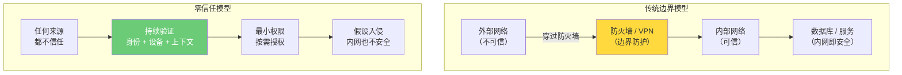
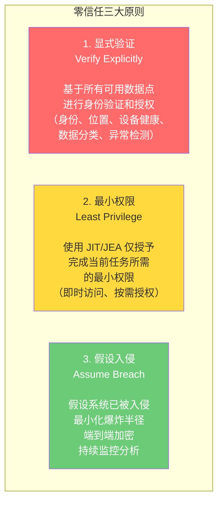
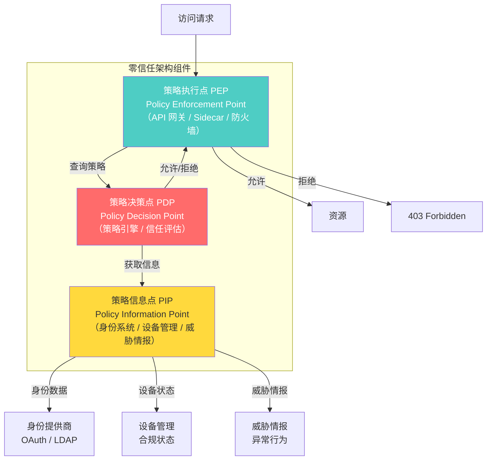
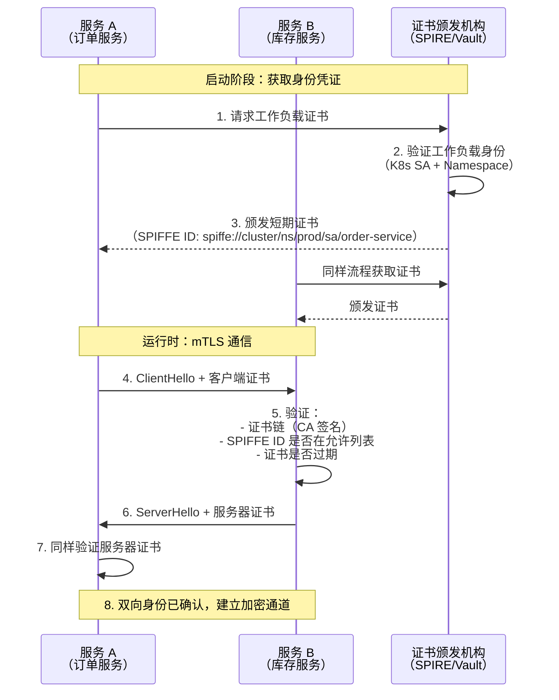
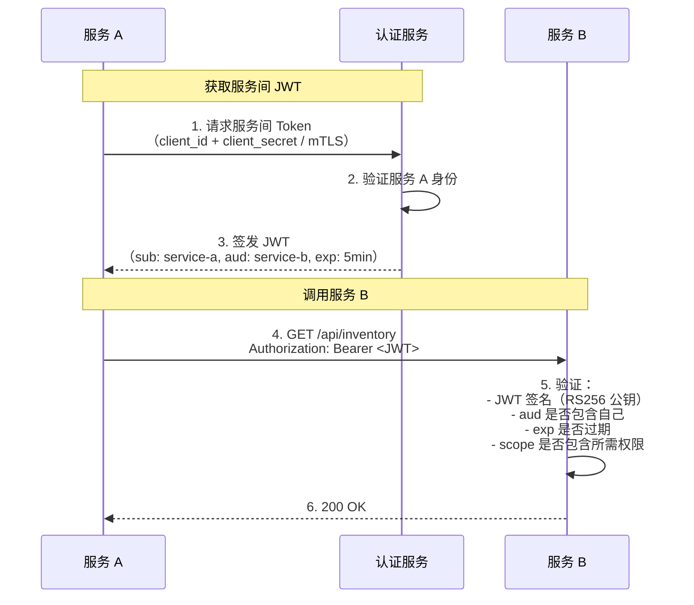
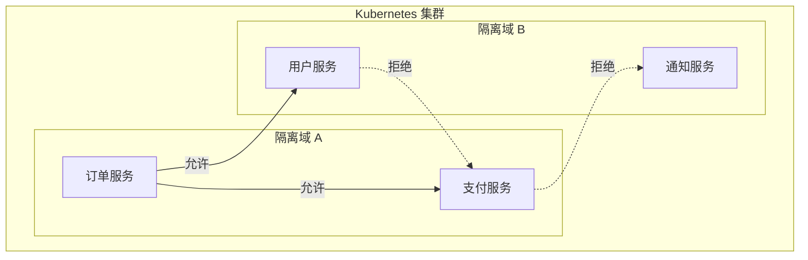
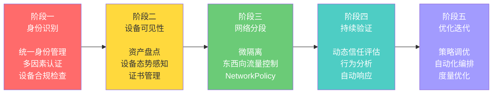

# 零信任架构

## ⭐ 面试重点速览

| 面试高频考点 | 重要程度 | 考察方向 |
| --- | --- | --- |
| 零信任核心理念 | :star::star::star::star::star: | "永不信任，始终验证" 的含义，与传统边界模型的对比 |
| 零信任三大原则 | :star::star::star::star::star: | 显式验证、最小权限、假设入侵 |
| 服务间认证方案 | :star::star::star::star::star: | mTLS 双向证书认证、JWT Token 认证的方案对比 |
| 微隔离 | :star::star::star::star: | 东西向流量隔离、NetworkPolicy、Service Mesh |
| 零信任落地路径 | :star::star::star::star: | 从传统架构到零信任的渐进式迁移策略 |
| 身份作为新边界 | :star::star::star::star: | 身份认证替代网络边界，作为安全决策的核心 |
| 零信任与 SASE | :star::star::star: | 安全访问服务边缘，零信任 + SD-WAN 的融合 |

---

## 一、零信任核心理念

### 1.1 传统边界模型 vs 零信任



::: tip 核心转变
零信任不是一款产品，而是一种**安全理念和架构思想**。传统模型认为"内网是安全的，外网是危险的"，零信任则认为"**内网和外网一样危险，永远不要信任任何请求**"。
:::

### 1.2 零信任三大原则



---

## 二、零信任架构的核心组件

### 2.1 架构全景



### 2.2 关键组件说明

| 组件 | 职责 | 对应实现 |
| --- | --- | --- |
| **PEP（策略执行点）** | 拦截所有请求，强制执行策略决策 | API Gateway、Envoy Sidecar、Kubernetes Admission Controller |
| **PDP（策略决策点）** | 评估信任度，做出允许/拒绝决策 | Open Policy Agent（OPA）、Istio AuthorizationPolicy |
| **PIP（策略信息点）** | 提供决策所需的上下文信息 | LDAP、MDM、SIEM、威胁情报平台 |
| **身份提供商** | 统一管理用户和服务身份 | Okta、Azure AD、Keycloak |
| **PKI/CA** | 颁发和管理证书，实现 mTLS | cert-manager、SPIFFE/SPIRE、Vault PKI |

---

## 三、服务间认证：零信任的核心实践

### 3.1 mTLS 方案



### 3.2 JWT 方案



### 3.3 mTLS vs JWT 方案对比

| 维度 | mTLS 方案 | JWT 方案 |
| --- | --- | --- |
| **认证层次** | 传输层（L4） | 应用层（L7） |
| **身份标识** | SPIFFE ID / 证书 CN | JWT Claims（sub, aud, scope） |
| **细粒度授权** | 不支持（仅服务身份） | 支持（scope、permissions） |
| **用户上下文传递** | 需要额外方案 | JWT 可携带用户信息 |
| **证书管理** | 需要 PKI 基础设施 | 只需密钥对 |
| **性能** | 握手后加密开销极小 | 每次请求需验证签名 |
| **云原生支持** | Istio/SPIRE 自动管理 | 应用层实现，灵活 |
| **推荐场景** | 基础设施层、东西向流量 | 业务层、需要细粒度授权 |

::: tip 最佳实践
**mTLS + JWT 组合使用**：
- mTLS 保证传输层安全和服务身份（"服务 A 是真正的订单服务"）
- JWT 保证应用层授权和用户上下文传递（"用户 Alice 正在请求订单服务"）
- 在 Istio 中，mTLS 由 Sidecar 透明处理，JWT 由应用代码处理
- 如果只能选一个：对安全要求极高的场景优先 mTLS，需要细粒度授权优先 JWT
:::

---

## 四、微隔离（Micro-Segmentation）

### 4.1 东西向流量隔离

传统防火墙主要保护南北向流量（外部到内部），零信任要求对**东西向流量**（服务间通信）也进行隔离。



```yaml
# Kubernetes NetworkPolicy 实现微隔离
apiVersion: networking.k8s.io/v1
kind: NetworkPolicy
metadata:
  name: order-service-policy
  namespace: production
spec:
  podSelector:
    matchLabels:
      app: order-service
  policyTypes:
    - Ingress
    - Egress
  ingress:
    # 只允许来自 API Gateway 和支付服务的入站流量
    - from:
        - podSelector:
            matchLabels:
              app: api-gateway
        - podSelector:
            matchLabels:
              app: payment-service
  egress:
    # 出站只允许访问支付服务、库存服务和数据库
    - to:
        - podSelector:
            matchLabels:
              app: payment-service
        - podSelector:
            matchLabels:
              app: inventory-service
        - podSelector:
            matchLabels:
              app: postgres
```

---

## 五、零信任落地路径

### 5.1 渐进式迁移策略



::: warning 常见误区
零信任不是"一键切换"，而是**渐进式迁移过程**。千万不要试图一次性完全替换现有安全体系。建议从最敏感的系统开始，逐步扩展覆盖范围。Google 的 BeyondCorp 项目花了 6 年才完成全公司范围的零信任迁移。
:::

### 5.2 关键指标

| 指标 | 描述 | 目标 |
| --- | --- | --- |
| 服务 mTLS 覆盖率 | 使用 mTLS 通信的服务比例 | 100% |
| 策略自动化率 | 安全策略的自动化执行比例 | >90% |
| 信任评估延迟 | PDP 策略评估的平均耗时 | <50ms |
| 异常响应时间 | 从检测到隔离的 MTTR | <5 分钟 |
| 爆炸半径 | 单点入侵影响的服务数量 | 持续降低 |

---

## 六、与现有模块的交叉引用

| 相关模块 | 路径 | 内容侧重 |
| --- | --- | --- |
| 安全基础总览 | [安全基础总览](../fundamentals/index.md) | CIA 三元组、纵深防御、最小权限 |
| 密码学基础 | [密码学基础](../fundamentals/cryptography.md) | 证书体系、数字签名、加密算法 |
| 认证与授权 | [认证与授权](../fundamentals/auth.md) | JWT 认证、OAuth 2.0、SSO |
| 双向认证 | [双向认证](../fundamentals/mtls.md) | mTLS 原理、证书管理、Service Mesh |
| OWASP Top 10 | [OWASP Top 10](../web/owasp-top10.md) | 访问控制、注入攻击等 Web 安全 |
| API 安全 | [API 安全](../web/api-security.md) | HMAC 签名、防重放、限流 |
| TLS 协议 | [computer-network/application/https-tls.md](../../computer-network/application/https-tls.md) | TLS 握手原理、TLS 1.3 |
| 网络安全 | [high-concurrency/security/network-security.md](../../high-concurrency/security/network-security.md) | DDoS 防护、网络层安全 |

---

## 七、面试经典高频题

### Q1：什么是零信任？"永不信任，始终验证"如何理解？

**参考答案：**

零信任（Zero Trust）是一种安全架构模型，其核心理念是**不信任任何网络、设备或用户，无论它们位于内网还是外网**。每次访问请求都需要经过身份验证、授权和加密，且信任是动态的、持续评估的。

"永不信任，始终验证"的具体含义：
1. **网络位置不再等同于信任**：即使请求来自内网 IP，也不能假设它是安全的
2. **每次访问都需验证**：不是登录一次就永久信任，而是每次 API 调用都验证身份和权限
3. **动态信任评估**：不仅验证身份，还要结合设备状态、地理位置、行为模式等多维度信息
4. **最小权限**：即使验证通过，也只授予完成任务所需的最小权限
5. **假设已被入侵**：即使所有验证通过，也要持续监控，随时准备隔离和响应

### Q2：零信任和传统 VPN 方案的根本区别是什么？

**参考答案：**

| 维度 | 传统 VPN | 零信任 |
| --- | --- | --- |
| 信任模型 | 接入 VPN 后信任整个内网 | 从不信任任何请求 |
| 访问粒度 | 通常可访问整个内网 | 精确到单个应用/API |
| 攻击面 | 暴露整个内网 | 应用级暴露，内网不可见 |
| 横向移动 | 入侵后可在内网自由移动 | 微隔离限制横向移动 |
| 用户体验 | 需要连接 VPN 客户端 | 透明，无感知 |
| 扩展性 | VPN 网关是瓶颈 | 分布式架构，水平扩展 |

Google 的 BeyondCorp 实践表明，零信任架构在安全性、用户体验、运维成本三个方面都优于传统 VPN 方案。

### Q3：在微服务架构中，零信任如何落地？

**参考答案：**

微服务架构中零信任落地的关键技术栈：

1. **服务身份**：使用 SPIFFE/SPIRE 为每个服务分配唯一身份标识（SPIFFE ID）
2. **传输加密**：服务间通信使用 mTLS，由 Service Mesh（Istio/Linkerd）自动管理
3. **认证与授权**：
   - 传输层：mTLS 验证服务身份
   - 应用层：JWT 携带用户身份和权限
4. **微隔离**：Kubernetes NetworkPolicy 限制 Pod 间通信，只允许白名单流量
5. **策略引擎**：OPA（Open Policy Agent）实现细粒度访问控制策略
6. **持续监控**：Service Mesh 的遥测数据 + SIEM 分析异常行为

具体落地步骤：
1. 部署 Service Mesh（如 Istio），启用自动 mTLS
2. 部署 SPIFFE/SPIRE 或使用 Istio 自带的 CA 管理证书
3. 配置 NetworkPolicy 实现微隔离
4. 部署 OPA 实现策略即代码（Policy as Code）
5. 集成监控告警，持续优化策略

### Q4：零信任中的"微隔离"是什么？和传统防火墙有什么区别？

**参考答案：**

微隔离（Micro-Segmentation）是将网络细粒度地划分为多个隔离域，限制每个工作负载只能与白名单中的其他工作负载通信。

与传统防火墙的区别：
| 维度 | 传统防火墙 | 微隔离 |
| --- | --- | --- |
| 保护方向 | 南北向（外到内） | 东西向（服务间） |
| 粒度 | IP/端口级别 | 工作负载/Pod 级别 |
| 策略跟随 | 静态规则，IP 变化后失效 | 动态跟随（基于标签/Label） |
| 管理方式 | 集中式防火墙设备 | 分布式，每个节点执行 |
| 云原生支持 | 较弱 | 原生支持 Kubernetes |

微隔离的核心价值：**限制爆炸半径**。即使攻击者入侵了订单服务，由于微隔离策略，攻击者无法访问数据库服务，也无法横向移动到其他服务。

### Q5：零信任架构中，策略决策点（PDP）的性能如何保证？

**参考答案：**

PDP 是零信任架构中的关键路径，每次请求都需要经过 PDP 的决策，因此性能至关重要。

性能优化策略：
1. **本地缓存决策结果**：PEP（如 Envoy Sidecar）缓存最近的策略决策结果，避免每次请求都远程调用 PDP
2. **策略分层**：简单策略（如 IP 白名单）在 PEP 本地执行，复杂策略（如基于上下文的）才查询 PDP
3. **异步更新**：策略变更采用异步推送，PEP 预加载策略，避免实时查询
4. **水平扩展**：PDP 集群水平扩展，PEP 通过负载均衡分发请求
5. **OPA 优化**：OPA 将 Rego 策略编译为 WebAssembly（WASM），在 Envoy 中直接执行，消除网络调用
6. **批量决策**：对于批量请求，合并策略决策，减少 PDP 调用次数

典型性能目标：PDP 评估延迟 < 10ms（本地缓存命中）、< 50ms（远程调用）。

### Q6：从传统架构迁移到零信任，最大的挑战是什么？如何应对？

**参考答案：**

最大挑战：
1. **文化阻力**：开发团队习惯"内网安全"思维，认为加安全措施会影响开发效率
2. **遗留系统**：老系统不支持现代认证协议（mTLS、JWT），无法直接融入零信任
3. **证书管理**：大规模微服务环境下，数百个服务的证书管理极为复杂
4. **性能影响**：mTLS 握手和策略评估会增加延迟
5. **策略爆炸**：随着服务增加，安全策略数量爆炸式增长，难以管理

应对策略：
1. **渐进式迁移**：从最敏感的系统开始，逐步扩展，不要一次性全覆盖
2. **遗留系统包装**：在遗留系统前放置 Sidecar Proxy，实现透明 mTLS 和策略执行
3. **自动化证书管理**：使用 cert-manager、SPIRE 自动管理证书生命周期
4. **性能优化**：使用 TLS 会话复用、连接池、策略本地缓存
5. **策略即代码**：使用 OPA 将策略版本化管理，GitOps 方式管理策略变更
6. **高层支持**：获得管理层的安全投入承诺，将零信任纳入公司安全战略