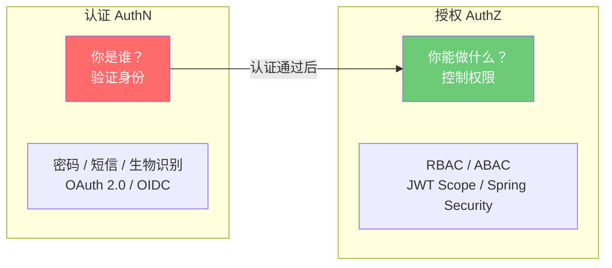
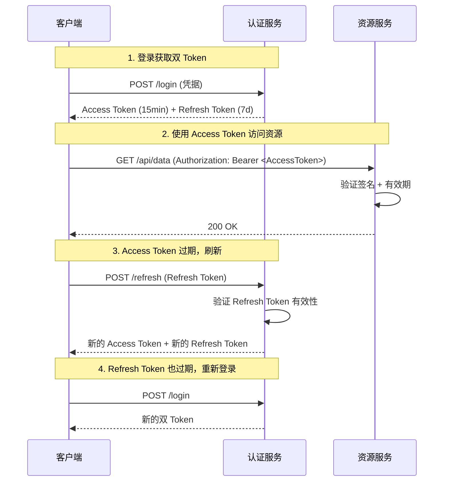
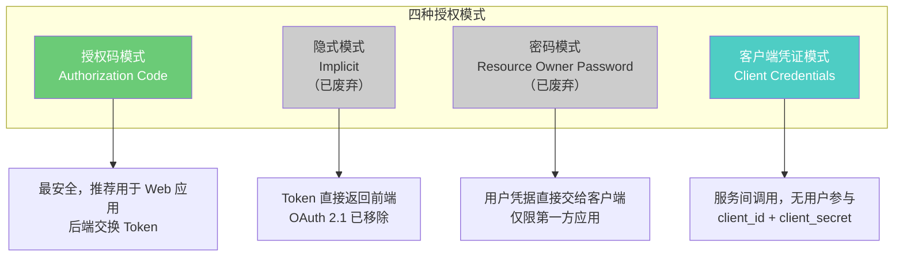
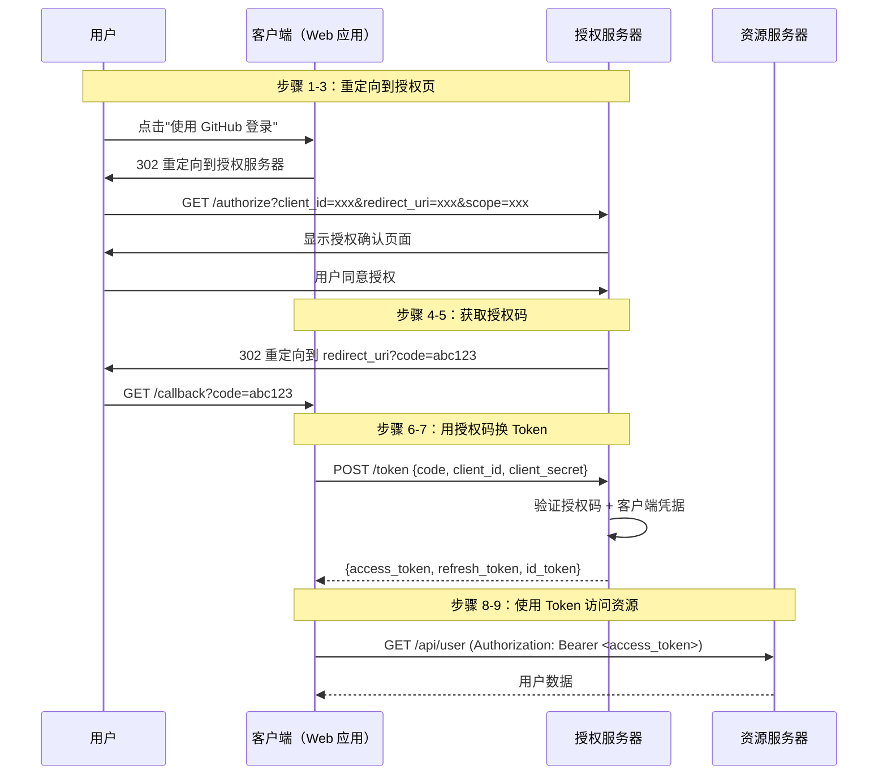
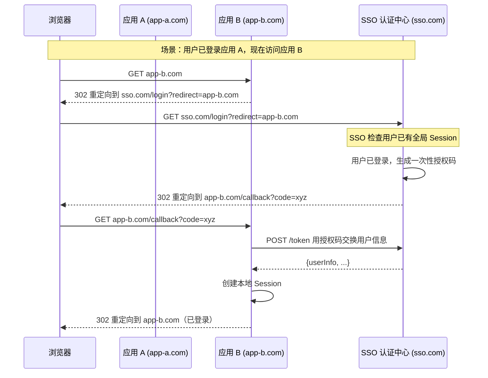

# 认证与授权

## ⭐ 面试重点速览

| 面试高频考点 | 重要程度 | 考察方向 |
| --- | --- | --- |
| Session-Cookie 机制 | :star::star::star::star::star: | Cookie 属性、Session 存储、分布式 Session 方案 |
| JWT 结构与签名 | :star::star::star::star::star: | Header/Payload/Signature 三部分、HS256 vs RS256 |
| JWT 刷新 Token 机制 | :star::star::star::star::star: | Access Token + Refresh Token 双 Token 设计 |
| OAuth 2.0 四种模式 | :star::star::star::star::star: | 授权码、隐式、密码、客户端凭证模式的适用场景 |
| SSO 单点登录原理 | :star::star::star::star: | 中心认证服务 CAS、JWT 跨域、OIDC 协议 |
| Session vs JWT 选型 | :star::star::star::star: | 有状态 vs 无状态、扩展性、吊销能力对比 |
| 认证与授权的区别 | :star::star::star::star: | Authentication vs Authorization 的本质区别 |

---

## 一、认证（Authentication）与授权（Authorization）



::: tip 面试要点
面试官常问："认证和授权的区别？" 经典回答：认证回答"你是谁"，授权回答"你能做什么"。认证是授权的前提，但两者在架构上应解耦——例如使用 OAuth 2.0（授权框架）配合 OIDC（认证层）实现认证与授权的分离。
:::

---

## 二、Session-Cookie 认证机制

### 2.1 工作原理

```mermaid
sequenceDiagram
    participant C as 客户端浏览器
    participant S as 服务端
    participant ST as Session 存储(Redis)

    Note over C,S: 登录阶段
    C->>S: POST /login (用户名 + 密码)
    S->>S: 验证凭据
    S->>ST: 创建 Session {userId, expire, ...}
    ST-->>S: Session ID: abc123
    S-->>C: Set-Cookie: SESSIONID=abc123; HttpOnly; Secure; SameSite=Lax

    Note over C,S: 后续请求
    C->>S: GET /api/user (Cookie: SESSIONID=abc123)
    S->>ST: 查询 Session abc123
    ST-->>S: {userId: 42, role: admin}
    S->>S: 验证权限，处理业务
    S-->>C: 200 OK + 用户数据

    Note over C,S: 登出阶段
    C->>S: POST /logout
    S->>ST: 删除 Session abc123
    S-->>C: Set-Cookie: SESSIONID=; Max-Age=0
```

### 2.2 Cookie 安全属性

| 属性 | 作用 | 安全影响 |
| --- | --- | --- |
| **HttpOnly** | 禁止 JavaScript 访问 Cookie | 防御 XSS 窃取 Session ID |
| **Secure** | 仅通过 HTTPS 传输 Cookie | 防御中间人攻击窃取 Cookie |
| **SameSite** | 控制跨站请求是否携带 Cookie | Strict/Lax/None，防御 CSRF |
| **Domain** | 指定 Cookie 生效的域名范围 | 限制过宽可能导致子域名 Cookie 泄露 |
| **Path** | 指定 Cookie 生效的路径 | 辅助约束，非主要安全措施 |
| **Max-Age / Expires** | Cookie 有效期 | 平衡安全性和用户体验 |

### 2.3 分布式 Session 方案

::: warning 架构挑战
单体应用中的内存 Session 在微服务架构下无法共享，需要引入分布式 Session 方案。
:::

| 方案 | 实现方式 | 优点 | 缺点 |
| --- | --- | --- | --- |
| **粘性会话** | 负载均衡器根据 Cookie 将请求路由到固定服务器 | 简单，无需改造 | 服务器故障时 Session 丢失 |
| **集中存储** | Session 存储在 Redis/DB 中，所有服务共享 | 高可用，支持水平扩展 | 增加网络延迟，Redis 成为瓶颈 |
| **客户端存储** | 使用 JWT 将状态存储在客户端 | 无状态，天然支持分布式 | 无法主动吊销，Token 体积大 |
| **Session 复制** | 容器间广播 Session 变更 | 无额外依赖 | 网络开销大，不适合大规模集群 |

---

## 三、JWT（JSON Web Token）

### 3.1 JWT 结构

```
JWT 由三部分组成，用点号分隔：
eyJhbGciOiJSUzI1NiIsInR5cCI6IkpXVCJ9          ← Header（Base64URL）
.eyJzdWIiOiIxMjM0NTY3ODkwIiwibmFtZSI6IkpvaG4ifQ  ← Payload（Base64URL）
.SflKxwRJSMeKKF2QT4fwpMeJf36POk6yJV_adQssw5c      ← Signature
```

| 部分 | 内容 | 是否加密 |
| --- | --- | --- |
| **Header** | 声明签名算法（alg）和 Token 类型（typ） | :x: 仅 Base64 编码 |
| **Payload** | 包含 Claims（声明），如 sub、exp、iat、自定义字段 | :x: 仅 Base64 编码 |
| **Signature** | 对 Header.Payload 的签名，防止篡改 | :white_check_mark: 数字签名 |

::: danger 安全警告
JWT 的 Header 和 Payload 只是 Base64URL 编码，**不是加密**！任何人拿到 JWT 都可以解码查看其中的内容。**绝不要在 JWT Payload 中存放敏感信息**（如密码、身份证号等）。
:::

### 3.2 Access Token + Refresh Token 双 Token 机制



::: tip 设计要点
Access Token 短有效期（15-30 分钟），Refresh Token 长有效期（7-30 天）。Access Token 泄露影响有限，Refresh Token 需要安全存储（HttpOnly Cookie 或移动端安全存储）。刷新时建议同时轮换 Refresh Token（Refresh Token Rotation），防止被盗用的 Refresh Token 被持续使用。
:::

### 3.3 签名算法选择

| 算法 | 类型 | 密钥 | 适用场景 |
| --- | --- | --- | --- |
| **HS256** | HMAC + SHA-256 | 对称密钥（共享密钥） | 单体应用，无需密钥分发 |
| **RS256** | RSA + SHA-256 | 非对称（私钥签名，公钥验签） | 微服务架构，多个服务只需持有公钥 |
| **ES256** | ECDSA + SHA-256 | 非对称（更短的密钥） | 移动端/IoT，性能敏感场景 |

::: warning 选型建议
微服务架构中**强烈推荐 RS256 或 ES256**。如果使用 HS256，所有服务共享同一个密钥，任何一个服务泄露密钥都会导致整个系统的 JWT 认证体系崩溃。而 RS256 只需要将公钥分发给各服务，私钥只存放在认证服务中。
:::

---

## 四、OAuth 2.0

### 4.1 四种授权模式



### 4.2 授权码模式流程（最常用）



::: danger 关键安全点
授权码模式的核心安全保证是**授权码只通过后端信道交换**，且只能使用一次。前端永远拿不到 client_secret，也拿不到 access_token（在纯后端交换的场景下）。如果授权码泄露，攻击者没有 client_secret 也无法兑换 Token。
:::

---

## 五、SSO 单点登录

### 5.1 核心原理

SSO 的核心思想是**一个认证中心，多个应用信任同一个认证中心**。



### 5.2 SSO 实现方案对比

| 方案 | 协议 | 适用场景 | 复杂度 |
| --- | --- | --- | --- |
| **CAS** | CAS 协议 | 传统 Web 应用，同域名 | 低 |
| **OIDC** | OAuth 2.0 + JWT | 现代 Web/移动应用，跨域 | 中 |
| **SAML 2.0** | SAML | 企业级应用，如 Office 365 | 高 |
| **JWT 跨域** | 自定义 | 同主域名下的子域名 | 低 |

---

## 六、与现有模块的交叉引用

| 相关模块 | 路径 | 内容侧重 |
| --- | --- | --- |
| 安全基础总览 | [安全基础总览](./index.md) | CIA 三元组、纵深防御 |
| 密码学基础 | [密码学基础](./cryptography.md) | JWT 签名算法 HS256/RS256/ES256 |
| 双向认证 | [双向认证](./mtls.md) | 服务间认证的 mTLS 方案 |
| Spring Security 认证 | [spring-ecosystem/spring-security/auth.md](../../spring-ecosystem/spring-security/auth.md) | Spring Security 认证授权实现 |
| Spring Security OAuth2 | [spring-ecosystem/spring-security/oauth2.md](../../spring-ecosystem/spring-security/oauth2.md) | Spring Security OAuth2 落地 |
| 前端 JWT 实践 | [frontend/security/jwt.md](../../frontend/security/jwt.md) | 前端 JWT 存储与使用 |
| 前端 OAuth/SSO | [frontend/security/oauth-sso.md](../../frontend/security/oauth-sso.md) | 前端 OAuth 2.0 与 SSO 集成 |

---

## 七、面试经典高频题

### Q1：Session 和 JWT 的区别？各自适用什么场景？

**参考答案：**

| 维度 | Session | JWT |
| --- | --- | --- |
| 状态存储 | 服务端存储（有状态） | 客户端存储（无状态） |
| 扩展性 | 需要分布式 Session 方案 | 天然支持水平扩展 |
| 吊销能力 | 直接删除 Session，立即生效 | 无法主动吊销，需要黑名单 |
| 每次请求开销 | Redis 查询 Session | 本地验证签名（更快） |
| 数据体积 | 仅传输 Session ID | Token 本身包含数据（较大） |
| 跨域支持 | Cookie 受同源策略限制 | 可跨域使用 |

选型建议：
- **Session**：传统 Web 应用，需要主动吊销能力，服务实例少
- **JWT**：微服务架构、移动端 API、跨域场景、需要无状态扩展

### Q2：为什么 JWT 需要双 Token 机制？

**参考答案：**

双 Token 机制解决的核心矛盾是**安全性与用户体验的平衡**：
- 如果 Access Token 有效期太长，泄露后攻击者可以长时间冒充用户
- 如果 Access Token 有效期太短，用户频繁登录，体验极差

双 Token 方案：
- Access Token 短有效期（15 分钟），即使泄露影响也有限
- Refresh Token 长有效期（7 天），但只用于换取新的 Access Token，不直接用于资源访问
- 刷新时进行 Refresh Token Rotation（旧 Token 失效，发放新 Token），可以检测 Token 盗用

### Q3：OAuth 2.0 授权码模式为什么比隐式模式更安全？

**参考答案：**

隐式模式（Implicit）已被 OAuth 2.1 废弃，因为：
1. Access Token 直接通过 URL Fragment 返回给前端，暴露在浏览器历史记录和日志中
2. 无法验证客户端身份——任何拿到 redirect_uri 的人都可以冒充客户端
3. 无法使用 Refresh Token，用户体验差

授权码模式的安全保障：
1. 授权码通过前端传递，但**兑换 Token 在后端进行**，前端拿不到 Token
2. 兑换 Token 需要 client_secret，即使授权码泄露，攻击者也无法兑换
3. 授权码只能使用一次，且有效期短（通常 10 分钟）
4. 使用 PKCE 扩展可以进一步防止授权码拦截攻击

### Q4：什么是 PKCE？为什么需要它？

**参考答案：**

PKCE（Proof Key for Code Exchange，发音"pixy"）是 OAuth 2.0 的安全扩展，最初为移动端设计，现在 OAuth 2.1 要求所有授权码模式都必须使用 PKCE。

PKCE 流程：
1. 客户端生成随机字符串 code_verifier（43-128 字符）
2. 客户端计算 code_challenge = SHA-256(code_verifier) 的 Base64URL 编码
3. 授权请求时发送 code_challenge
4. 兑换 Token 时发送 code_verifier
5. 授权服务器验证 SHA-256(code_verifier) == code_challenge

PKCE 防止的攻击：即使攻击者拦截了授权码，因为没有 code_verifier，也无法兑换 Token。这在移动端重定向 URI 可能被恶意应用注册的场景下尤其重要。

### Q5：SSO 单点登录如何实现跨域？

**参考答案：**

SSO 跨域实现的核心方案：

1. **OIDC（OpenID Connect）方案**（推荐）：
   - 基于 OAuth 2.0 的认证层协议
   - 所有应用将用户重定向到统一的认证中心
   - 认证中心登录后，生成 ID Token（JWT），包含用户身份信息
   - 各应用通过 redirect_uri 回调接收授权码，后端兑换用户信息

2. **同主域名 Cookie 方案**：
   - 将 Cookie 的 Domain 设置为主域名（如 `.example.com`）
   - 所有子域名（app1.example.com, app2.example.com）共享 Cookie
   - 局限性：必须是同一主域名

3. **CAS 协议方案**：
   - 传统的 SSO 协议，适合同一域名下的 Web 应用
   - 通过 Ticket 机制实现跨应用认证

### Q6：如何安全地存储 JWT？

**参考答案：**

| 存储位置 | 安全性 | XSS 风险 | CSRF 风险 | 推荐场景 |
| --- | --- | --- | --- | --- |
| HttpOnly Cookie | :star::star::star::star::star: | 免疫 | 需配合 SameSite | Web 应用（推荐） |
| localStorage | :star: | 直接暴露 | 免疫 | 不推荐 |
| sessionStorage | :star::star: | 直接暴露 | 免疫 | 临时使用 |
| 内存变量 | :star::star::star::star: | 关闭标签页丢失 | 免疫 | SPA 短期存储 |
| 移动端安全存储 | :star::star::star::star::star: | N/A | N/A | iOS Keychain / Android Keystore |

推荐方案：Web 应用使用 HttpOnly + Secure + SameSite=Strict 的 Cookie 存储 JWT，同时配合 CSRF Token 双重防护。