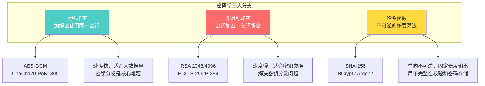
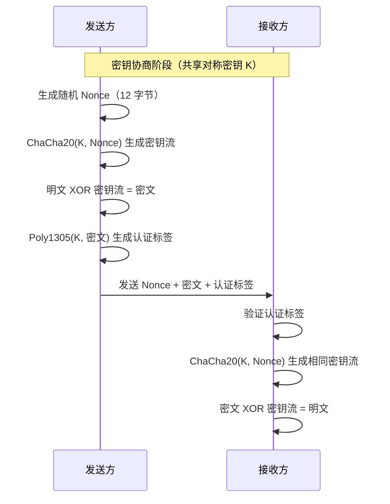
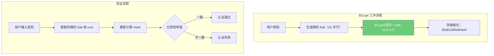
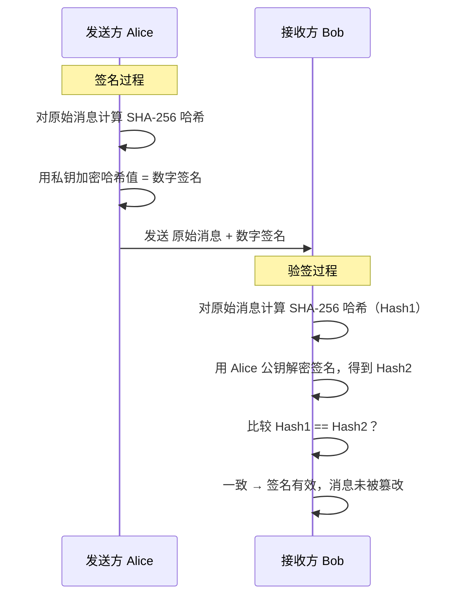
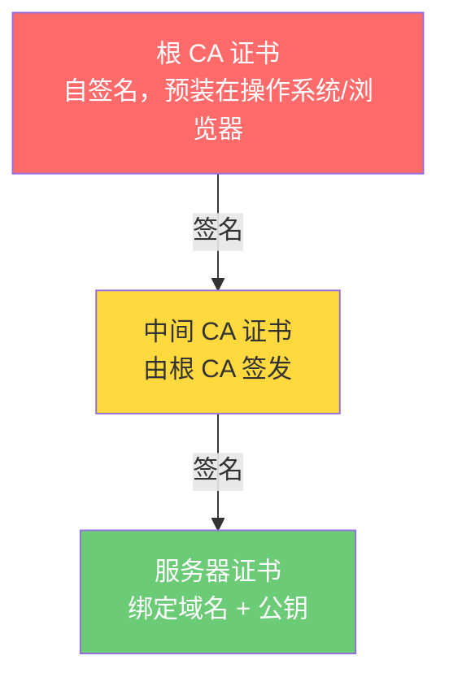

# 密码学基础

## ⭐ 面试重点速览

| 面试高频考点 | 重要程度 | 考察方向 |
| --- | --- | --- |
| 对称加密 vs 非对称加密 | :star::star::star::star::star: | 两种加密方式的区别、适用场景、性能对比 |
| AES 加密原理 | :star::star::star::star::star: | AES-256-GCM 工作模式、密钥管理、IV 向量 |
| RSA 与 ECC 对比 | :star::star::star::star: | 密钥长度、安全性、性能、量子计算抗性 |
| 哈希算法特性 | :star::star::star::star::star: | 抗碰撞性、单向性、雪崩效应、加盐 |
| BCrypt / Argon2 | :star::star::star::star: | 密码哈希的慢哈希理念、salt 与 cost factor |
| 数字签名流程 | :star::star::star::star: | 私钥签名、公钥验签、证书链验证 |
| TLS 中的密码学 | :star::star::star::star: | 混合加密、密钥交换、证书体系 |
| JWT 签名算法 | :star::star::star: | HS256 vs RS256 vs ES256 的选择 |

---

## 一、密码学分类全景



---

## 二、对称加密

### 2.1 AES（Advanced Encryption Standard）

AES 是目前最广泛使用的对称加密算法，由 NIST 于 2001 年标准化。

| 特性 | AES-128 | AES-256 |
| --- | --- | --- |
| 密钥长度 | 128 bit（16 字节） | 256 bit（32 字节） |
| 安全强度 | 2^128 次暴力破解 | 2^256 次暴力破解 |
| 性能 | 较快 | 约慢 40% |
| 量子计算抗性 | Grover 算法降为 2^64 | Grover 算法降为 2^128 |

**工作模式对比：**

| 模式 | 特点 | 是否推荐 |
| --- | --- | --- |
| ECB | 相同明文产生相同密文，不安全 | :x: 绝对不要用 |
| CBC | 需要 IV，不支持并行加密 | :warning: 可用但非最优 |
| CTR | 支持并行，将分组密码转为流密码 | :white_check_mark: 推荐 |
| **GCM** | 认证加密（AEAD），同时提供加密和完整性校验 | :star: 强烈推荐 |

::: danger 安全警告
**永远不要使用 ECB 模式！** ECB 模式下相同的明文块会产生相同的密文块，导致密文保留明文的模式特征。著名的"Linux 企鹅"加密图就是 ECB 模式的经典反面教材。
:::

::: tip 最佳实践
推荐使用 **AES-256-GCM**，它属于 AEAD（Authenticated Encryption with Associated Data），同时提供：
- 数据机密性（加密）
- 数据完整性（认证标签）
- 可选的附加认证数据（AAD）
:::

### 2.2 ChaCha20-Poly1305

ChaCha20 是 Daniel Bernstein 设计的流密码算法，Poly1305 是其配套的消息认证码。



**与 AES 的对比：**

| 维度 | AES-GCM | ChaCha20-Poly1305 |
| --- | --- | --- |
| 硬件加速 | AES-NI 指令集，硬件加速极快 | 无硬件加速，纯软件实现 |
| 移动端性能 | 依赖 AES-NI，老设备较慢 | 软件实现快，移动端有优势 |
| 安全性 | 成熟，广泛审查 | 较新，但数学结构简单 |
| 推荐场景 | 服务器端（有 AES-NI） | 移动端、IoT 设备 |

---

## 三、非对称加密

### 3.1 RSA

RSA 基于大整数分解的数学难题，是最早的公钥密码系统之一。

```
RSA 密钥生成流程：
1. 选择两个大素数 p 和 q
2. 计算 n = p × q（模数）
3. 计算 φ(n) = (p-1)(q-1)
4. 选择公钥指数 e（通常为 65537）
5. 计算私钥指数 d = e^(-1) mod φ(n)
6. 公钥 = (n, e)，私钥 = (n, d)
```

### 3.2 ECC（椭圆曲线密码学）

ECC 基于椭圆曲线离散对数问题，在同等安全强度下密钥长度远小于 RSA。

| 安全强度 | RSA 密钥长度 | ECC 密钥长度 | 密钥长度比 |
| --- | --- | --- | --- |
| 128 bit | 3072 bit | 256 bit | 12:1 |
| 192 bit | 7680 bit | 384 bit | 20:1 |
| 256 bit | 15360 bit | 512 bit | 30:1 |

::: tip 面试要点
ECC 的主要优势是**密钥短、计算快、带宽省**，特别适合移动端和 IoT 设备。但 RSA 的优势在于**历史更久、生态更成熟、兼容性更好**。TLS 1.3 中已移除 RSA 密钥交换，只保留 ECDHE。
:::

---

## 四、哈希函数

### 4.1 密码学哈希的五大特性

1. **确定性**：相同输入始终产生相同输出
2. **快速计算**：对任意长度输入快速生成摘要
3. **抗原像性（单向性）**：给定哈希值 H(m)，无法反推 m
4. **抗第二原像性**：给定 m1，无法找到 m2 使得 H(m1) = H(m2)
5. **抗碰撞性**：无法找到任意两个不同的 m1 和 m2 使得 H(m1) = H(m2)

### 4.2 常用哈希算法

| 算法 | 输出长度 | 安全性 | 使用场景 |
| --- | --- | --- | --- |
| MD5 | 128 bit | :x: 已破解 | 不应再使用 |
| SHA-1 | 160 bit | :x: 已破解 | 不应再使用 |
| SHA-256 | 256 bit | :white_check_mark: 安全 | 数字签名、区块链、HMAC |
| SHA-3 | 可变 | :white_check_mark: 安全 | 下一代标准 |

### 4.3 密码哈希：BCrypt 与 Argon2

密码存储与普通哈希有本质区别——密码哈希需要**故意变慢**以对抗暴力破解。



| 算法 | 特点 | 推荐度 |
| --- | --- | --- |
| BCrypt | 基于 Blowfish，内置 Salt，可调 cost factor | :star::star::star::star: |
| Argon2id | 2015 年密码哈希竞赛冠军，抗 GPU/ASIC | :star::star::star::star::star: |
| PBKDF2 | NIST 推荐，但可用 GPU 加速暴力破解 | :star::star::star: |
| SHA-256 + Salt | 不够慢，可被 GPU 高速暴力破解 | :x: 不推荐 |

::: danger 绝对禁止
绝不要使用 MD5 或 SHA-1 存储密码，也绝不要使用无盐哈希。即使加了 Salt，使用 SHA-256 哈希密码也不够安全——现代 GPU 可以每秒计算数十亿次 SHA-256。
:::

---

## 五、数字签名与证书

### 5.1 数字签名流程



数字签名同时实现了**完整性**（消息未被篡改）和**不可抵赖性**（只有持有私钥的人才能生成签名）。

### 5.2 X.509 证书链



证书包含的关键信息：域名（CN/SAN）、公钥、有效期、签发者、签名算法、指纹。

---

## 六、与现有模块的交叉引用

| 相关模块 | 路径 | 内容侧重 |
| --- | --- | --- |
| 安全基础总览 | [安全基础总览](./index.md) | CIA 三元组、纵深防御、最小权限 |
| 认证与授权 | [认证与授权](./auth.md) | JWT 签名算法选择（HS256 vs RS256） |
| 双向认证 | [双向认证](./mtls.md) | mTLS 中的证书体系与双向证书验证 |
| TLS 协议 | [computer-network/application/https-tls.md](../../computer-network/application/https-tls.md) | TLS 握手中的密码学应用 |
| Spring Security | [spring-ecosystem/spring-security/](../../spring-ecosystem/spring-security/) | Spring Security 中的密码编码器 |
| 前端安全 | [frontend/security/](../../frontend/security/) | Web Crypto API 在前端的应用 |

---

## 七、面试经典高频题

### Q1：对称加密和非对称加密的核心区别是什么？在 TLS 中如何配合使用？

**参考答案：**

核心区别：
- **对称加密**：加解密使用同一密钥，速度快（AES-GCM 可达 GB/s 级别），适合大数据量加密。核心难题是密钥如何安全分发。
- **非对称加密**：使用公钥加密、私钥解密，速度慢（RSA 比 AES 慢 1000 倍以上），但解决了密钥分发问题。

在 TLS 1.3 中的配合使用：
1. 握手阶段使用 ECDHE 进行密钥协商，双方在不安全的信道上安全地协商出共享密钥
2. 服务器使用 RSA/ECDSA 证书签名，客户端验证服务器身份
3. 传输阶段使用协商出的对称密钥（AES-GCM 或 ChaCha20-Poly1305）加密应用数据

这种"非对称加密解决密钥分发，对称加密解决数据传输"的模式被称为**混合加密**。

### Q2：为什么密码存储要用 BCrypt 而不是 SHA-256？

**参考答案：**

三个核心原因：
1. **速度差异**：SHA-256 设计目标就是快（现代 GPU 每秒可计算数十亿次），而 BCrypt 设计目标就是慢（通过 cost factor 控制，cost=12 时约 250ms/次）。密码验证只需一次，慢一些无影响；但暴力破解需要数亿次尝试，慢就意味着不可行。
2. **内置 Salt**：BCrypt 自动生成随机 Salt 并嵌入哈希结果中，无需开发者手动管理。即使两个用户使用相同密码，存储的哈希值也完全不同，有效防御彩虹表攻击。
3. **抗 GPU 加速**：BCrypt 的内存访问模式对 GPU 不友好，无法像 SHA-256 那样被 GPU 大规模并行加速。

### Q3：什么是 AEAD？为什么推荐使用 AES-GCM 而不是 AES-CBC？

**参考答案：**

AEAD（Authenticated Encryption with Associated Data）是同时提供加密和认证的加密模式。

AES-GCM 相比 AES-CBC 的优势：
1. **认证加密**：GCM 自动生成认证标签（GMAC），可以检测密文是否被篡改。CBC 只提供加密，攻击者可以在不知道密钥的情况下篡改密文（Padding Oracle 攻击）。
2. **支持并行**：GCM 的 CTR 模式支持并行加密/解密，CBC 模式加密串行、解密可并行。
3. **无需额外 HMAC**：使用 CBC 时需要额外配合 HMAC 实现 Encrypt-then-MAC，而 GCM 一条龙完成。
4. **TLS 1.3 推荐**：TLS 1.3 只保留了 AEAD 密码套件，CBC 模式已被移除。

### Q4：RSA 和 ECC 如何选择？各自的适用场景是什么？

**参考答案：**

| 维度 | RSA | ECC |
| --- | --- | --- |
| 计算速度 | 加密快、解密慢 | 加解密都快 |
| 密钥生成 | 慢，需要生成大素数 | 快 |
| 签名速度 | 验签快、签名慢 | 签名和验签都快 |
| 密钥大小 | 大（2048-4096 bit） | 小（256 bit） |
| 兼容性 | 极好，几乎所有系统支持 | 较新，部分老系统不支持 |
| 量子抗性 | 无 | 无 |

选择建议：
- 需要广泛兼容的 Web 证书：RSA 2048 仍然是最稳妥的选择
- 移动端/IoT 设备：ECC 密钥短、省带宽、计算快
- 新系统设计：优先 ECC（特别是 Ed25519）
- 内部微服务 mTLS：ECC 优势明显

### Q5：数字签名如何同时保证完整性和不可抵赖性？

**参考答案：**

数字签名的工作流程：
1. 发送方对消息计算哈希值 H(M)
2. 发送方使用自己的**私钥**对哈希值加密，生成签名 Sign(H(M))
3. 接收方使用发送方的**公钥**解密签名，得到 H1
4. 接收方对收到的消息计算哈希值 H2
5. 比较 H1 == H2

**完整性保证**：如果消息在传输过程中被篡改，H2 必然与 H1 不同，验证失败。因为哈希算法的抗碰撞性，攻击者无法找到另一个消息产生相同的哈希值。

**不可抵赖性保证**：只有持有私钥的人才能生成有效的签名。公钥只能验证签名，不能生成签名。因此只要签名验证通过，就可以确定消息确实来自私钥持有者，私钥持有者无法否认（"抵赖"）自己发送过该消息。

### Q6：解释证书链的验证过程

**参考答案：**

浏览器验证服务器证书的完整流程：
1. **获取证书链**：服务器返回自己的证书和中间 CA 证书链
2. **验证签名链**：逐级验证——用中间 CA 的公钥验证服务器证书签名，用根 CA 公钥验证中间 CA 证书签名
3. **验证域名**：检查证书的 CN/SAN 字段是否匹配当前访问的域名
4. **验证有效期**：检查当前时间是否在证书的 NotBefore 和 NotAfter 之间
5. **验证撤销状态**：通过 CRL（证书吊销列表）或 OCSP（在线证书状态协议）检查证书是否被吊销
6. **信任锚点**：根 CA 证书必须预装在系统的信任存储中

任何一步验证失败，整个证书链验证失败，浏览器显示安全警告。