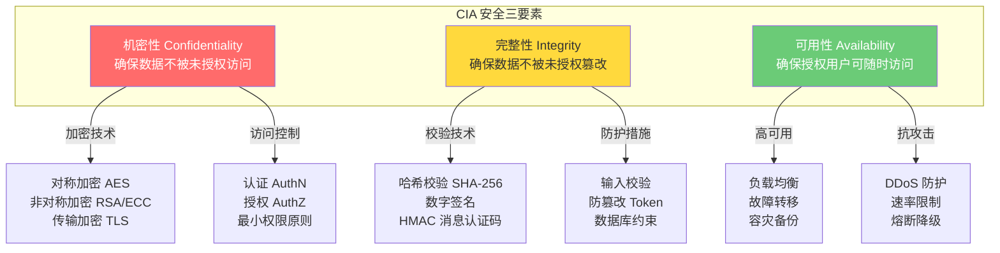
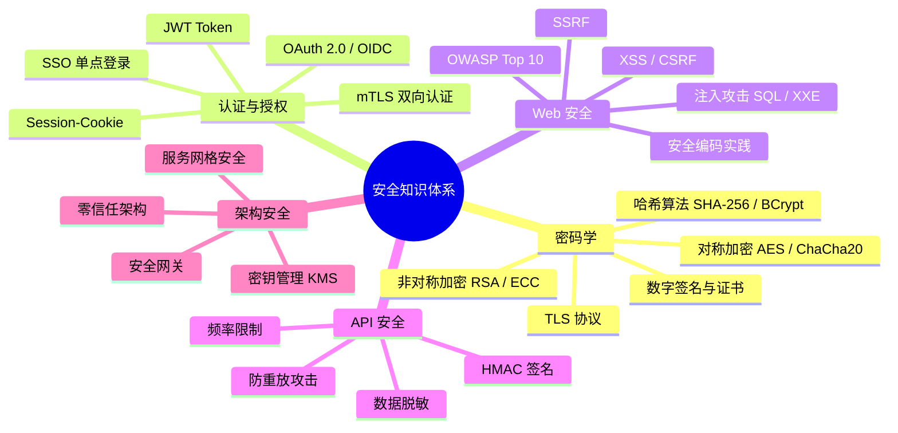

# 安全基础总览

## ⭐ 面试重点速览

| 面试高频考点 | 重要程度 | 考察方向 |
| --- | --- | --- |
| 安全三要素 CIA | :star::star::star::star::star: | 机密性、完整性、可用性的含义与相互关系 |
| 纵深防御策略 | :star::star::star::star::star: | 多层防御体系设计，每一层独立防护 |
| 最小权限原则 | :star::star::star::star::star: | PoLP 概念、RBAC 实现、权限最小化实践 |
| 零信任架构 | :star::star::star::star: | "永不信任，始终验证" 核心理念 |
| 安全知识体系 | :star::star::star::star: | 密码学、认证、Web安全、架构安全的整体框架 |
| 威胁建模 | :star::star::star: | STRIDE 模型、攻击面分析 |
| 安全开发生命周期 | :star::star::star: | SDL 流程、安全左移 |

---

## 一、安全三要素：CIA 三元组

CIA 三元组是信息安全领域最基础的理论框架，所有安全措施最终都围绕这三个目标展开。



::: tip 面试要点
面试官常问："CIA 三者之间是否存在矛盾？" 答案是肯定的。例如，过度加密（增强机密性）可能降低系统性能（影响可用性）；严格的访问控制（增强机密性）可能阻碍正常业务流程。安全设计的本质是在三者之间找到平衡点。
:::

---

## 二、纵深防御（Defense in Depth）

纵深防御是安全架构设计的核心思想：**不要依赖任何单一的安全措施，每一层都应该有独立的防护能力**。

```
┌─────────────────────────────────────────────────────┐
│                  纵深防御层次模型                      │
├─────────────────────────────────────────────────────┤
│  第 1 层：物理安全  │  机房门禁、监控、硬件加密模块    │
├─────────────────────────────────────────────────────┤
│  第 2 层：网络安全  │  防火墙、WAF、IDS/IPS、DDoS 防护 │
├─────────────────────────────────────────────────────┤
│  第 3 层：主机安全  │  系统补丁、HIDS、最小化安装       │
├─────────────────────────────────────────────────────┤
│  第 4 层：应用安全  │  输入校验、参数化查询、CSP        │
├─────────────────────────────────────────────────────┤
│  第 5 层：数据安全  │  加密存储、脱敏、审计日志          │
└─────────────────────────────────────────────────────┘
```

::: warning 常见误区
很多团队认为"加了 HTTPS 就安全了"，这完全违背了纵深防御原则。HTTPS 只保护传输层，无法防御 SQL 注入、XSS、业务逻辑漏洞等应用层攻击。
:::

---

## 三、最小权限原则（PoLP）

最小权限原则（Principle of Least Privilege）要求：**每个主体（用户、进程、服务）只能访问完成其任务所必需的最小资源集合**。

### 3.1 实践要点

| 维度 | 实践方法 | 反面案例 |
| --- | --- | --- |
| 数据库 | 应用账号只授予 CRUD 所需表的权限，禁止 DDL | 应用使用 root 账号连接数据库 |
| 微服务 | 每个服务使用独立的 ServiceAccount，通过 RBAC 控制 | 所有服务共享一个超级管理员账号 |
| 文件系统 | 遵循最小读/写/执行权限，使用 chmod 700 | 目录权限设为 777 |
| 云资源 | 使用 IAM 角色，按需授予临时凭证 | 使用主账号 AccessKey 硬编码 |
| 代码层面 | 函数只接收必要参数，不暴露内部实现 | 过度宽泛的接口设计 |

::: danger 血的教训
2023 年某知名 SaaS 公司因数据库账号拥有 DROP TABLE 权限，实习生误操作导致核心业务表被删除，恢复耗时 72 小时，直接损失超千万。这就是违反最小权限原则的典型事故。
:::

---

## 四、安全知识体系全景



---

## 五、与现有模块的交叉引用

本模块是安全知识的顶层入口，具体实现细节分布在以下模块：

| 相关模块 | 路径 | 内容侧重 |
| --- | --- | --- |
| Spring Security 实现 | [spring-ecosystem/spring-security/](../../spring-ecosystem/spring-security/) | Java 生态中的认证授权框架实现 |
| 网络安全 | [high-concurrency/security/network-security.md](../../high-concurrency/security/network-security.md) | DDoS 防护、TLS 握手、网络层安全 |
| 前端安全 | [frontend/security/](../../frontend/security/) | XSS、CSRF、CSP 等前端视角的安全防护 |
| TLS 协议 | [computer-network/application/https-tls.md](../../computer-network/application/https-tls.md) | TLS 握手原理、证书链验证 |
| 密码学基础 | [密码学基础](./cryptography.md) | 对称/非对称加密、哈希、数字签名 |
| 认证与授权 | [认证与授权](./auth.md) | JWT、OAuth 2.0、SSO 详细原理 |
| 双向认证 | [双向认证](./mtls.md) | mTLS 原理与实践 |
| OWASP Top 10 | [OWASP Top 10](../web/owasp-top10.md) | 十大 Web 安全风险详解 |
| API 安全 | [API 安全](../web/api-security.md) | HMAC 签名、防重放、限流 |
| 零信任架构 | [零信任架构](../architecture/zero-trust.md) | 零信任核心理念与服务间认证 |

---

## 六、面试经典高频题

### Q1：请解释 CIA 三元组，并举例说明三者之间的冲突

**参考答案：**

CIA 三元组是信息安全的三个核心目标：
- **机密性（Confidentiality）**：确保信息只被授权者访问。例如数据库中的用户密码应该加密存储，即使数据库泄露，攻击者也无法获取明文。
- **完整性（Integrity）**：确保信息在存储和传输过程中不被未授权篡改。例如 API 响应使用 HMAC 签名，确保数据在传输过程中未被中间人修改。
- **可用性（Availability）**：确保授权用户在需要时能够访问信息。例如系统通过负载均衡和故障转移，保证 99.99% 的可用性。

三者冲突的典型场景：
- 对数据库所有字段进行加密（机密性），但每次查询都需要解密，导致查询性能急剧下降（可用性受损）。
- 设置严格的账户锁定策略，3 次失败即锁定（机密性/完整性），但攻击者可利用此机制对合法用户发起 DoS 攻击（可用性受损）。
- 采用多副本策略保证数据不丢失（可用性），但增加了数据泄露的攻击面（机密性受损）。

### Q2：什么是纵深防御？请举例说明如何在 Web 应用中实施

**参考答案：**

纵深防御是安全架构的核心原则，指不依赖单一安全措施，而是在多个层面部署独立的安全控制，使得即使某一层被突破，其他层仍能提供保护。

Web 应用纵深防御实践：
1. **网络层**：WAF 过滤恶意请求，DDoS 清洗，IP 黑白名单
2. **传输层**：全站 HTTPS，HSTS 强制加密，证书固定
3. **应用层**：输入校验 + 参数化查询（防注入），输出编码（防 XSS），CSRF Token
4. **会话层**：HttpOnly + Secure + SameSite Cookie，短有效期 Session
5. **数据层**：数据库加密存储，字段级脱敏，审计日志
6. **基础设施层**：最小权限 IAM，容器安全策略，镜像扫描

### Q3：最小权限原则在微服务架构中如何落地？

**参考答案：**

在微服务架构中落地最小权限原则的关键措施：
1. **服务级认证**：每个微服务使用独立的 ServiceAccount，通过 mTLS 或 JWT 进行服务间认证。例如 Istio 为每个 Pod 注入 Sidecar，自动管理证书和身份。
2. **RBAC 授权**：明确定义每个服务允许调用的 API 列表。例如订单服务只允许调用库存服务的 `/inventory/deduct` 接口，禁止调用 `/inventory/delete`。
3. **数据库权限**：每个服务使用独立的数据库账号，只授予对自己 Schema 的 CRUD 权限，禁止跨 Schema 访问。
4. **最小化依赖**：服务间调用使用最小化接口设计，只暴露对方需要的字段，避免"一把梭"返回整个实体。
5. **零信任网络**：即使在同一 Kubernetes 集群内部，也通过 NetworkPolicy 限制服务间通信，只允许白名单中的流量。

### Q4：请简述 STRIDE 威胁建模方法

**参考答案：**

STRIDE 是微软提出的威胁建模框架，从六个维度系统分析系统可能面临的安全威胁：

| 威胁类型 | 含义 | 对应安全属性 | 典型攻击 | 防御措施 |
| --- | --- | --- | --- | --- |
| **S**poofing 假冒 | 冒充合法用户或服务 | 认证 | 暴力破解、凭证窃取 | 多因素认证、mTLS |
| **T**ampering 篡改 | 未经授权修改数据 | 完整性 | 中间人攻击、SQL 注入 | 数字签名、参数化查询 |
| **R**epudiation 抵赖 | 否认执行过某操作 | 不可抵赖性 | 删除日志、否认交易 | 审计日志、数字签名 |
| **I**nfo Disclosure 信息泄露 | 数据暴露给未授权者 | 机密性 | 敏感数据未加密、错误信息泄露 | 加密、脱敏、最小化错误信息 |
| **D**oS 拒绝服务 | 使服务不可用 | 可用性 | DDoS、资源耗尽 | 限流、CDN、弹性伸缩 |
| **E**levation 权限提升 | 获取超出授权的权限 | 授权 | 垂直越权、水平越权 | RBAC、最小权限 |

### Q5：安全左移（Shift Left）是什么意思？如何实践？

**参考答案：**

安全左移是指将安全实践从传统的上线前审计阶段，提前到软件开发生命周期的早期阶段（需求分析、设计、编码），从而在成本最低的时候发现和修复安全问题。

实践方法：
1. **需求阶段**：进行威胁建模，识别安全需求
2. **设计阶段**：安全架构评审，确定加密方案和认证机制
3. **编码阶段**：IDE 集成 SAST 静态扫描（SonarQube、Checkmarx），安全编码规范
4. **构建阶段**：CI 流水线中集成依赖扫描（Snyk、OWASP Dependency-Check），自动化安全测试
5. **测试阶段**：DAST 动态扫描，渗透测试
6. **上线后**：RASP 运行时防护，持续安全监控

核心理念：在 SDLC 中越早发现安全问题，修复成本越低。IBM 研究表明，生产环境修复一个安全缺陷的成本是设计阶段的 30 倍。