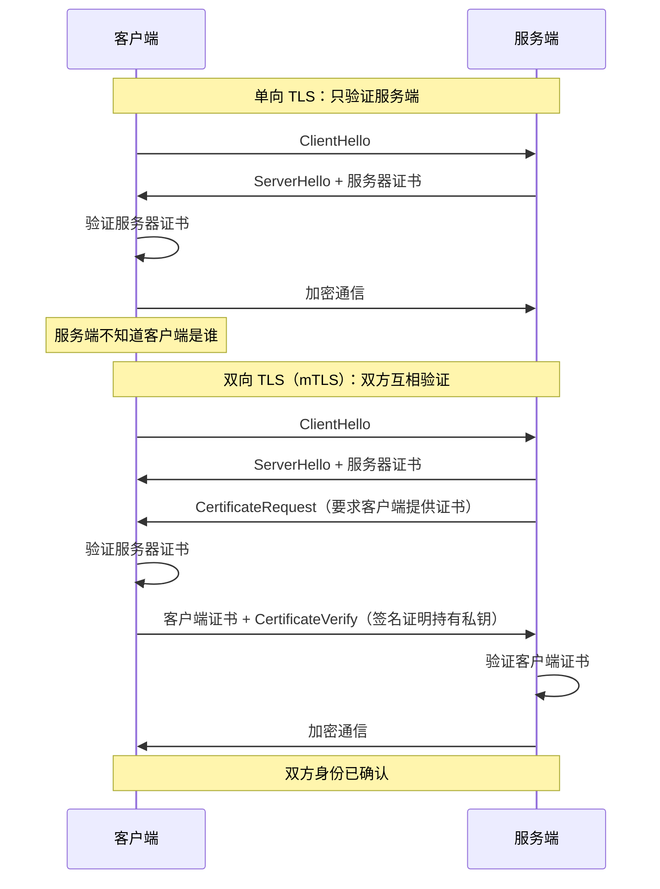
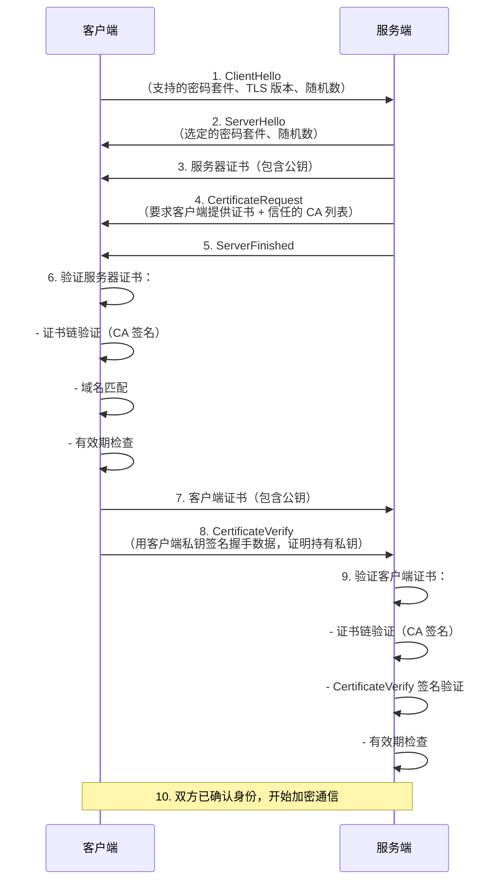
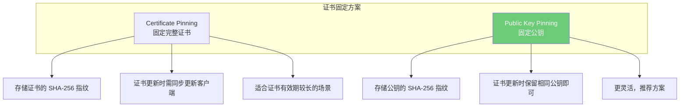
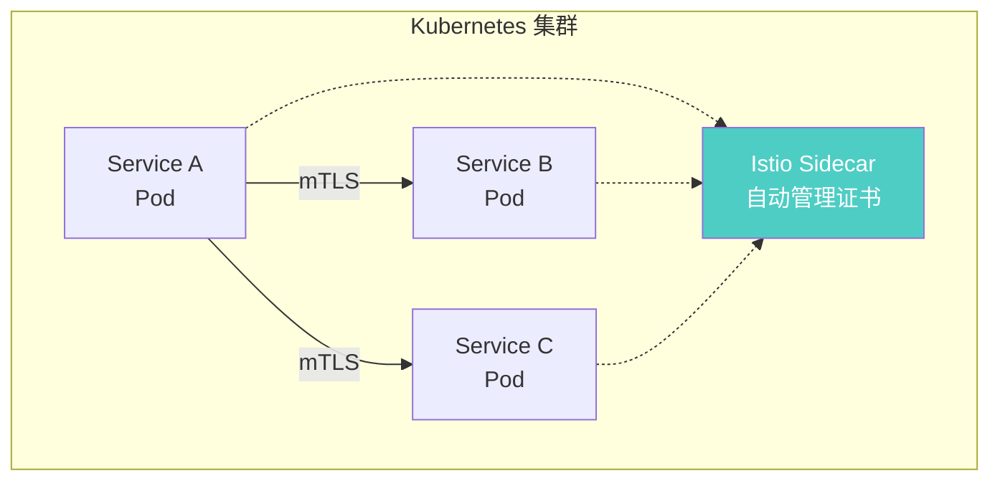

# 双向认证（mTLS）

## ⭐ 面试重点速览

| 面试高频考点 | 重要程度 | 考察方向 |
| --- | --- | --- |
| mTLS 原理 | :star::star::star::star::star: | 双向证书验证的握手流程，与单向 TLS 的区别 |
| 证书固定（Certificate Pinning） | :star::star::star::star: | 公钥固定 vs 证书固定，防止中间人攻击 |
| mTLS 与 JWT 对比 | :star::star::star::star: | 服务间认证方案选型，各自的优劣 |
| 零信任中的 mTLS | :star::star::star::star: | 零信任架构下 mTLS 作为身份凭证 |
| 证书管理 | :star::star::star: | 证书生命周期管理、自动轮换、CA 选型 |
| Service Mesh 中的 mTLS | :star::star::star: | Istio/Linkerd 的自动 mTLS 实现 |

---

## 一、mTLS 工作原理

### 1.1 单向 TLS vs 双向 TLS



### 1.2 mTLS 握手完整流程

mTLS 握手在标准 TLS 1.3 握手基础上增加了客户端证书验证步骤：



::: tip 关键点
mTLS 的核心价值在于**双向身份验证**。服务端不仅要向客户端证明"我是真的"，客户端也要向服务端证明"我是合法的"。在微服务架构中，这意味着每个服务都需要拥有自己的 TLS 证书。
:::

---

## 二、证书固定（Certificate Pinning）

### 2.1 为什么需要证书固定

标准 TLS 验证依赖 CA 体系，但存在以下风险：
- CA 被攻击签发假证书（如 DigiNotar 事件）
- 企业中间人代理解密流量
- 政府强制 CA 签发拦截证书

证书固定通过在客户端预置服务端的公钥或证书指纹，彻底绕过 CA 信任链被攻破的风险。

### 2.2 两种固定方式



::: warning 实践建议
推荐使用**公钥固定（Public Key Pinning）**而非证书固定。因为证书有有效期，到期后需要更新，但你可以使用相同的密钥对签发新证书，公钥不变则固定依然有效。同时建议固定至少两个公钥（一个在线使用，一个备份），防止密钥丢失导致服务不可用。
:::

::: danger 注意
HTTP 公钥固定（HPKP）已被 Chrome 移除，因为它太容易被错误配置导致站点永久不可用。现在推荐使用 `Expect-CT` 头部配合 Certificate Transparency 日志来防范恶意证书。
:::

---

## 三、mTLS 在微服务中的应用

### 3.1 服务间通信安全



### 3.2 mTLS vs JWT 服务间认证对比

| 维度 | mTLS | JWT |
| --- | --- | --- |
| 认证方式 | 证书（传输层） | Token（应用层） |
| 性能 | 握手后无额外开销 | 每次请求需验证签名 |
| 细粒度授权 | 不支持（只有身份） | 支持 Claims 和 Scope |
| 用户身份传递 | 需要额外机制 | JWT 可以包含用户信息 |
| 证书管理成本 | 高（需要 CA 和轮换） | 低（只需密钥对） |
| 防重放 | 协议层保证 | 需额外机制 |
| 推荐场景 | 服务间通信、基础设施层 | 用户认证、跨系统授权 |

::: tip 最佳实践
在实际架构中，mTLS 和 JWT 通常**组合使用**：
- **mTLS** 负责传输层安全和服务身份认证（"Pod A 正在与 Pod B 通信"）
- **JWT** 负责应用层用户认证和授权（"用户 Alice 正在请求订单服务"）
- 在 Istio 中，mTLS 由 Sidecar 自动处理，JWT 由应用代码处理
:::

---

## 四、证书生命周期管理

### 4.1 关键挑战

| 挑战 | 描述 | 解决方案 |
| --- | --- | --- |
| 证书签发 | 大量微服务需要证书 | 自动化 CA（如 cert-manager） |
| 证书轮换 | 证书到期前需更新 | 自动轮换，提前 30 天触发 |
| 私钥安全 | 私钥不能泄露 | 密钥不落地，内存中生成 |
| 证书吊销 | 泄露的证书需立即失效 | OCSP Stapling、短有效期证书 |
| 多集群 | 跨集群证书信任 | 统一 CA 或联邦 CA |

### 4.2 推荐工具链

```
cert-manager（Kubernetes）→ 自动签发/续期 Let's Encrypt 或内部 CA 证书
SPIFFE/SPIRE          → 工作负载身份标识，为每个服务分配 SPIFFE ID
Istio / Linkerd       → 透明代理，自动注入 Sidecar 管理 mTLS
HashiCorp Vault       → 密钥管理，PKI 引擎签发短期证书
```

---

## 五、与现有模块的交叉引用

| 相关模块 | 路径 | 内容侧重 |
| --- | --- | --- |
| 安全基础总览 | [安全基础总览](./index.md) | CIA 三元组、纵深防御 |
| 密码学基础 | [密码学基础](./cryptography.md) | 证书体系、数字签名、RSA vs ECC |
| 认证与授权 | [认证与授权](./auth.md) | mTLS 与 JWT 的对比与组合使用 |
| 零信任架构 | [零信任架构](../architecture/zero-trust.md) | 零信任中 mTLS 作为服务身份凭证 |
| TLS 协议 | [computer-network/application/https-tls.md](../../computer-network/application/https-tls.md) | TLS 握手原理、TLS 1.3 特性 |
| 网络安全 | [high-concurrency/security/network-security.md](../../high-concurrency/security/network-security.md) | DDoS 防护、网络层安全 |

---

## 六、面试经典高频题

### Q1：mTLS 和普通 TLS 的核心区别是什么？什么场景下必须使用 mTLS？

**参考答案：**

核心区别在于**身份验证的方向**：
- **普通 TLS（单向）**：只验证服务端身份。客户端验证服务端证书，确保自己在和"真正的服务器"通信。客户端可以不提供证书。
- **mTLS（双向）**：双方互相验证身份。服务端也要验证客户端证书，确保客户端的合法性。

必须使用 mTLS 的场景：
1. **零信任微服务架构**：服务间通信不能仅依赖网络层安全（如内网 IP），必须通过 mTLS 进行服务身份认证
2. **金融级安全通信**：银行间清算、证券交易等需要双向身份确认的场景
3. **IoT 设备认证**：设备接入平台时，平台需要确认设备身份，设备也需要确认平台身份
4. **API 网关到后端服务**：网关验证完客户端 Token 后，到后端服务的通信也需要 mTLS 保护

### Q2：证书固定（Certificate Pinning）有什么风险？如何安全实践？

**参考答案：**

主要风险：
1. **服务不可用风险**：如果固定的证书过期且忘记更新客户端，所有客户端将无法连接
2. **密钥泄露风险**：如果固定的是证书，密钥泄露后攻击者可以签发"合法"证书
3. **灵活性丧失**：无法方便地切换到新的 CA 或证书

安全实践：
1. 使用**公钥固定**而非证书固定，证书可更新但公钥不变
2. 固定至少两个公钥（一个在线 + 一个备份），防止密钥丢失
3. 设置合理的固定有效期（如 30-60 天），过期后回退到标准证书验证
4. 移动端 App 更新时同步更新固定指纹
5. 配合 Certificate Transparency 日志监控异常证书

### Q3：在微服务架构中，mTLS 和 JWT 如何分工？

**参考答案：**

mTLS 和 JWT 解决不同层次的问题，应该组合使用：

**mTLS 负责传输层**：
- 服务身份认证（"Pod A 是合法的订单服务"）
- 传输加密（防止网络嗅探和中间人攻击）
- 由基础设施层处理（Service Mesh Sidecar），对应用透明

**JWT 负责应用层**：
- 用户身份认证（"请求来自用户 Alice"）
- 细粒度授权（"Alice 有权限查询订单 #123"）
- 用户信息传递（跨服务传递用户上下文）
- 由应用代码处理

典型请求流程：
```
客户端 → [JWT: Alice] → API Gateway → [mTLS + JWT: Alice] → 订单服务
                                                    → [mTLS + JWT: Alice] → 库存服务
```

### Q4：如何实现证书的自动轮换而不中断服务？

**参考答案：**

实现零停机证书轮换的关键策略：

1. **重叠有效期**：新证书在旧证书过期前 30 天签发，两个证书同时有效
2. **热加载**：服务支持动态加载证书，无需重启（如 Nginx `nginx -s reload`）
3. **优雅切换**：Service Mesh（如 Istio）自动检测证书过期，提前签发新证书并热加载
4. **短有效期证书**：使用短期证书（如 24 小时），配合自动轮换，即使泄露影响也有限
5. **cert-manager 方案**（Kubernetes）：
   - 创建 Certificate 资源，自动签发
   - 证书存储在 Secret 中，Pod 挂载后自动更新
   - cert-manager 在证书过期前自动续期

### Q5：Service Mesh 中的 mTLS 是如何实现的？

**参考答案：**

以 Istio 为例，mTLS 实现原理：

1. **Sidecar 注入**：每个 Pod 被注入一个 Envoy Sidecar 代理容器
2. **流量拦截**：通过 iptables 规则，所有进出 Pod 的流量先经过 Sidecar
3. **证书自动管理**：Istiod 作为 CA，为每个 Sidecar 签发短期证书（默认 24 小时）
4. **自动 mTLS**：Sidecar 之间自动进行 mTLS 握手，应用代码无需任何修改
5. **身份标识**：每个服务使用 SPIFFE ID（如 `spiffe://cluster.local/ns/default/sa/my-service`）作为身份

关键特性：
- 对应用透明：应用代码无需处理证书和加密
- 自动轮换：证书到期前自动续期
- 策略控制：可以通过 PeerAuthentication 策略细粒度控制 mTLS 行为（STRICT/PERMISSIVE/DISABLE）

### Q6：mTLS 的性能开销有多大？如何优化？

**参考答案：**

mTLS 的性能开销主要体现在：
1. **握手开销**：首次连接需要完整的 TLS 握手（1-2 次 RTT），相比普通 TCP 增加约 50-100ms
2. **加密开销**：对称加密（AES-GCM）对吞吐量影响约 5-15%（有 AES-NI 硬件加速时更低）

优化策略：
1. **TLS 会话复用**：使用 Session ID 或 Session Ticket，后续连接只需 1 次 RTT（甚至 0-RTT）
2. **连接池**：服务间使用长连接，避免频繁握手
3. **硬件加速**：确保服务器支持 AES-NI 指令集
4. **选择高效密码套件**：TLS 1.3 + ECDHE + AES-256-GCM
5. **Service Mesh 优化**：Istio 的 Sidecar 之间 mTLS 使用长连接，握手开销可忽略