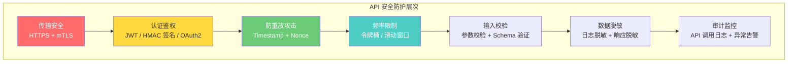
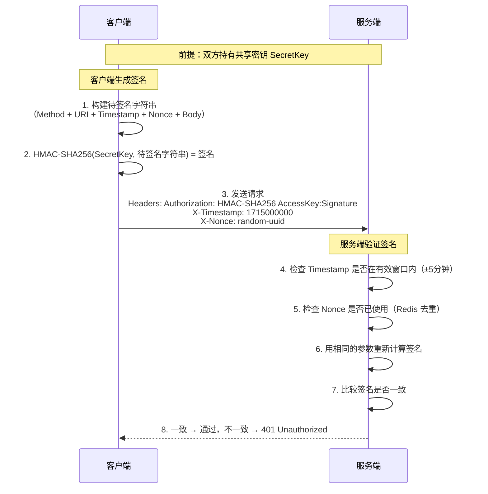
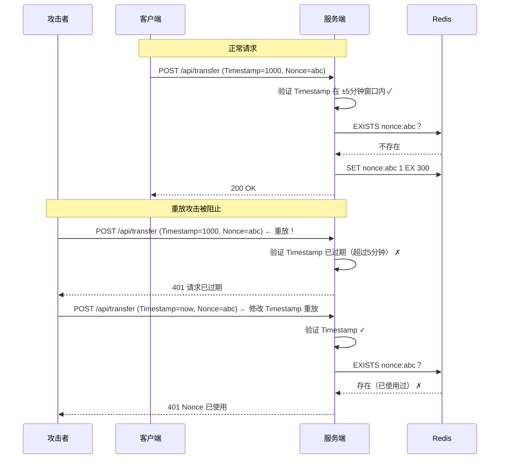
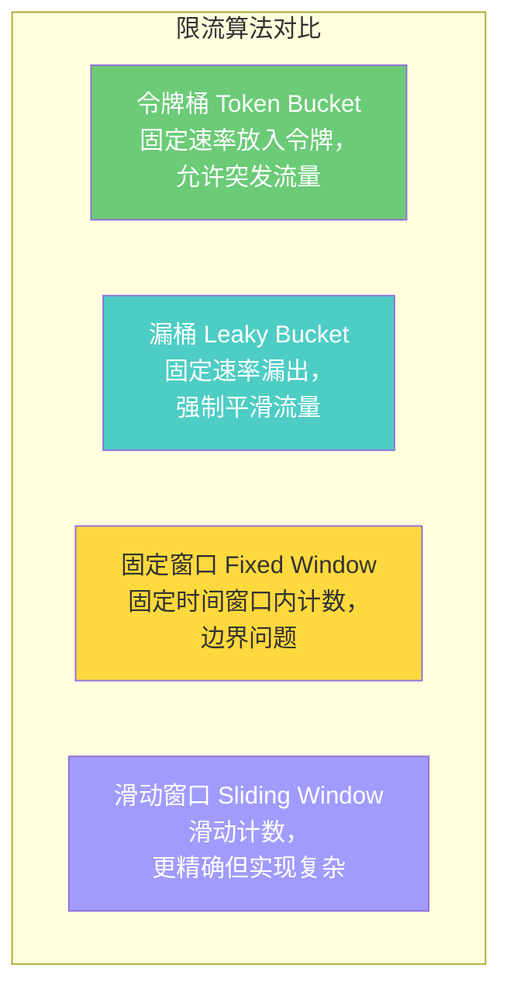

# API 安全

## ⭐ 面试重点速览

| 面试高频考点 | 重要程度 | 考察方向 |
| --- | --- | --- |
| HMAC 签名认证 | :star::star::star::star::star: | 签名生成流程、密钥管理、防篡改原理 |
| 防重放攻击 | :star::star::star::star::star: | Timestamp + Nonce 机制、时间窗口设计 |
| 频率限制 | :star::star::star::star::star: | 令牌桶/漏桶/滑动窗口算法、多维度限流 |
| 敏感数据脱敏 | :star::star::star::star: | 日志脱敏、响应脱敏、存储加密 |
| API 网关安全 | :star::star::star::star: | 认证、限流、路由、日志的统一管控 |
| 请求签名 vs JWT | :star::star::star: | 两种 API 认证方案的选型对比 |
| 幂等性设计 | :star::star::star: | 防止重复提交、支付场景的幂等保证 |

---

## 一、API 安全全景



---

## 二、HMAC 签名认证

### 2.1 签名流程

HMAC（Hash-based Message Authentication Code）使用共享密钥对请求内容生成签名，确保请求的完整性和来源真实性。



### 2.2 签名字符串构建

```java
/**
 * 构建待签名字符串（Canonical String）
 * 签名字符串的格式必须由客户端和服务端严格约定一致
 */
public String buildStringToSign(String method, String uri, String timestamp,
                                  String nonce, String body) {
    // 将参与签名的参数按固定格式拼接
    return String.join("\n",
        method.toUpperCase(),           // HTTP 方法，如 POST
        uri,                            // 请求路径，如 /api/v1/orders
        timestamp,                      // 时间戳，如 1715000000
        nonce,                          // 随机数，防重放
        sha256(body)                    // 请求体的 SHA-256 哈希
    );
}

/**
 * 生成 HMAC 签名
 */
public String generateSignature(String secretKey, String stringToSign) {
    Mac mac = Mac.getInstance("HmacSHA256");
    SecretKeySpec keySpec = new SecretKeySpec(secretKey.getBytes(StandardCharsets.UTF_8), "HmacSHA256");
    mac.init(keySpec);
    byte[] signatureBytes = mac.doFinal(stringToSign.getBytes(StandardCharsets.UTF_8));
    return Base64.getEncoder().encodeToString(signatureBytes);
}
```

::: tip 设计要点
签名字符串中的六个关键要素：
1. **HTTP Method**：防止请求方法被篡改
2. **URI Path**：防止请求路径被篡改
3. **Timestamp**：防重放攻击
4. **Nonce**：防重放攻击（同一时间戳内的重复请求）
5. **Body Hash**：防止请求体被篡改
6. **Query String**（可选）：防止查询参数被篡改
:::

---

## 三、防重放攻击

### 3.1 Timestamp + Nonce 机制



### 3.2 防重放实现要点

| 策略 | 实现方式 | 说明 |
| --- | --- | --- |
| **Timestamp 校验** | 服务端拒绝与当前时间偏差超过 5 分钟的请求 | 防止攻击者无限期重放旧请求 |
| **Nonce 去重** | 将 Nonce 存入 Redis，TTL 设为时间窗口 + 缓冲时间 | 同一时间窗口内 Nonce 不能重复使用 |
| **签名绑定** | Nonce 参与签名计算 | 攻击者无法修改 Nonce（改了签名就失效） |
| **时钟同步** | 客户端和服务端使用 NTP 同步时间 | 避免时间偏差导致合法请求被拒绝 |

```java
/**
 * 防重放验证
 */
public boolean verifyReplayAttack(String timestamp, String nonce) {
    long now = System.currentTimeMillis() / 1000;
    long requestTime = Long.parseLong(timestamp);

    // 1. Timestamp 校验：允许 ±5 分钟偏差
    if (Math.abs(now - requestTime) > 300) {
        log.warn("请求时间戳过期: requestTime={}, now={}", requestTime, now);
        return false;
    }

    // 2. Nonce 校验：使用 Redis SET NX 原子操作
    String nonceKey = "nonce:" + nonce;
    boolean isNew = redisTemplate.opsForValue()
        .setIfAbsent(nonceKey, "1", Duration.ofMinutes(10));
    if (!isNew) {
        log.warn("Nonce 重复使用: nonce={}", nonce);
        return false;
    }

    return true;
}
```

::: warning 注意
Nonce 去重方案需要权衡：如果使用不存储 Nonce 的方案（如纯时间窗口），会存在窗口内的重放风险；如果使用存储 Nonce 的方案，需要 Redis 等存储，增加了系统复杂度。生产环境推荐使用 Redis 存储方案。
:::

---

## 四、频率限制（Rate Limiting）

### 4.1 常见限流算法



| 算法 | 优点 | 缺点 | 适用场景 |
| --- | --- | --- | --- |
| **令牌桶** | 允许突发流量，灵活 | 实现稍复杂 | API 网关（推荐） |
| **漏桶** | 流量平滑，强制匀速 | 突发流量被丢弃 | 需要严格流量整形 |
| **固定窗口** | 实现简单 | 边界突刺问题 | 简单场景 |
| **滑动窗口** | 精确，无边界问题 | 内存占用较高 | 需要精确控制 |

### 4.2 多维度限流

```java
/**
 * 多维度频率限制示例
 */
@RestController
public class OrderController {

    // 维度一：全局限流 — 整个 API 每秒最多 10000 请求
    @RateLimiter(key = "global:createOrder", permitsPerSecond = 10000)

    // 维度二：IP 限流 — 单个 IP 每秒最多 100 请求
    @RateLimiter(key = "ip:${request.remoteAddr}:createOrder", permitsPerSecond = 100)

    // 维度三：用户限流 — 单个用户每秒最多 10 请求
    @RateLimiter(key = "user:${userId}:createOrder", permitsPerSecond = 10)

    // 维度四：接口限流 — 特定接口的特定限制
    @RateLimiter(key = "api:/order/create:${userId}", permitsPerSecond = 5)

    @PostMapping("/api/orders")
    public ResponseEntity<?> createOrder(@RequestBody OrderRequest request) {
        // 业务逻辑
    }
}
```

::: tip 限流策略建议
1. **全局限流**：防止整个系统被压垮
2. **IP 限流**：防止单个 IP 恶意刷接口
3. **用户限流**：防止单个用户过度使用（正常用户不会超过阈值）
4. **接口限流**：对不同接口设置不同阈值（登录接口限流更严格）
5. **限流响应**：返回 `429 Too Many Requests` + `Retry-After` 头部
:::

---

## 五、敏感数据脱敏

### 5.1 数据分类与脱敏策略

| 数据类型 | 敏感级别 | 脱敏方式 | 示例 |
| --- | --- | --- | --- |
| 密码 | :red_circle: 极高 | 不返回、不记录 | 永远不脱敏（直接不返回） |
| 身份证号 | :red_circle: 极高 | 部分掩码 | `320***********1234` |
| 手机号 | :orange_circle: 高 | 中间掩码 | `138****5678` |
| 银行卡号 | :orange_circle: 高 | 仅保留后 4 位 | `**** **** **** 5678` |
| 邮箱 | :yellow_circle: 中 | 用户名部分掩码 | `ab***@example.com` |
| 真实姓名 | :yellow_circle: 中 | 保留姓氏 | `张**` |

### 5.2 响应脱敏实现

```java
/**
 * 使用 Jackson 注解实现响应脱敏
 */
public class UserVO {
    private Long id;
    private String username;

    @JsonSerialize(using = PhoneMaskSerializer.class)
    private String phone;  // 自动脱敏为 138****5678

    @JsonSerialize(using = IdCardMaskSerializer.class)
    private String idCard;  // 自动脱敏为 320***********1234

    @JsonIgnore  // 密码永远不返回
    private String password;
}

/**
 * 手机号脱敏序列化器
 */
public class PhoneMaskSerializer extends JsonSerializer<String> {
    @Override
    public void serialize(String value, JsonGenerator gen, SerializerProvider provider) throws IOException {
        if (value == null || value.length() != 11) {
            gen.writeString(value);
            return;
        }
        gen.writeString(value.substring(0, 3) + "****" + value.substring(7));
    }
}
```

::: danger 安全提醒
- **永远不要返回密码字段**，即使是哈希值
- **日志中不要记录敏感数据**，包括 Token、密码、身份证号等
- **脱敏要在服务端进行**，不能依赖前端脱敏
- 生产环境排查问题时，**敏感数据需要走审批流程**才能查看明文
:::

---

## 六、与现有模块的交叉引用

| 相关模块 | 路径 | 内容侧重 |
| --- | --- | --- |
| 安全基础总览 | [安全基础总览](../fundamentals/index.md) | CIA 三元组、纵深防御 |
| 认证与授权 | [认证与授权](../fundamentals/auth.md) | JWT、OAuth 2.0 API 认证 |
| 双向认证 | [双向认证](../fundamentals/mtls.md) | mTLS 服务间 API 通信 |
| OWASP Top 10 | [OWASP Top 10](./owasp-top10.md) | 注入、SSRF 等 API 层面的攻击 |
| 安全编码实践 | [安全编码实践](./secure-coding.md) | 输入校验、输出编码 |
| 网络安全 | [high-concurrency/security/network-security.md](../../high-concurrency/security/network-security.md) | DDoS 防护、网络层限流 |
| 高并发限流 | [high-concurrency/design-patterns/rate-limiter.md](../../high-concurrency/design-patterns/rate-limiter.md) | 限流算法详细实现 |

---

## 七、面试经典高频题

### Q1：HMAC 签名认证和 JWT 认证的区别？各自适用什么场景？

**参考答案：**

| 维度 | HMAC 签名 | JWT |
| --- | --- | --- |
| 认证方式 | 每次请求实时计算签名 | 签发一次 Token，后续携带 Token |
| 状态 | 无状态（签名可验证） | 无状态（Token 自包含） |
| 用户信息 | 不包含用户信息，需额外查询 | 自包含用户信息（Claims） |
| 防篡改 | 签名覆盖整个请求 | 签名覆盖 Token 内容 |
| 防重放 | Timestamp + Nonce 机制 | 需要额外机制 |
| 密钥管理 | 共享密钥，需安全分发 | 非对称密钥（RS256），只需分发公钥 |
| 性能 | 每次请求计算 HMAC | 每次请求验证签名 |
| 适用场景 | 服务间 API 调用、支付回调 | 用户认证、跨系统授权 |

选型建议：
- **服务间 API 调用**：HMAC 签名（请求内容绑定，防重放更强）
- **用户认证**：JWT（自包含用户信息，无需额外查询）
- **开放平台 API**：HMAC 签名（如 AWS Signature V4、阿里云 API 签名）

### Q2：防重放攻击的 Timestamp + Nonce 机制中，为什么两者缺一不可？

**参考答案：**

**只用 Timestamp**：
- 在同一时间窗口内（如 5 分钟），攻击者可以无限重放请求
- 无法区分同一时间窗口内的正常请求和重放请求

**只用 Nonce**：
- 需要永久存储所有使用过的 Nonce，存储成本无限增长
- 没有时间维度的约束，Nonce 集合会无限膨胀

**Timestamp + Nonce 组合**：
- Timestamp 限制了请求的有效时间窗口（如 5 分钟）
- Nonce 在时间窗口内防重放
- Redis 中 Nonce 的 TTL = 时间窗口 + 缓冲时间（如 10 分钟），存储成本可控
- 两者都参与签名，攻击者无法单独修改任何一个

### Q3：令牌桶算法和漏桶算法的区别？为什么 API 网关通常用令牌桶？

**参考答案：**

| 维度 | 令牌桶 | 漏桶 |
| --- | --- | --- |
| 工作方式 | 固定速率生成令牌，请求消耗令牌 | 请求进入桶，固定速率漏出 |
| 突发流量 | 允许（桶内积累的令牌可一次性消耗） | 不允许（强制匀速流出） |
| 流量特征 | 允许短时突发，长期平均速率受限 | 严格平滑，流量被整形为恒定速率 |
| 实现复杂度 | 中等 | 简单 |

API 网关通常选择令牌桶的原因：
1. **允许合理突发**：用户正常操作（如页面加载同时请求多个 API）会产生突发流量，令牌桶可以容纳这种合理突发
2. **平均速率控制**：长期来看，令牌桶控制平均速率，防止系统被持续高压压垮
3. **灵活性**：可以通过调整桶容量（burst）和令牌生成速率（rate）灵活控制流量形状

### Q4：API 网关在安全防护中扮演什么角色？

**参考答案：**

API 网关是 API 安全的第一道防线，承担以下安全职责：

1. **认证统一入口**：所有 API 请求在网关层统一认证（JWT 验证、HMAC 签名校验），后端服务无需重复实现
2. **限流熔断**：全局统一的频率限制，防止恶意刷接口和 DDoS 攻击
3. **IP 黑白名单**：基于 IP 的访问控制
4. **请求校验**：JSON Schema 校验，拦截格式异常的请求
5. **响应脱敏**：统一对响应中的敏感字段进行脱敏处理
6. **日志审计**：记录所有 API 调用日志，便于安全审计和问题排查
7. **CORS 管理**：统一管理跨域策略
8. **协议转换**：对外 HTTPS，对内 mTLS，确保全链路加密

### Q5：如何实现支付接口的幂等性？

**参考答案：**

支付接口幂等性的核心是防止用户的同一次支付请求被重复处理。

实现方案：
1. **幂等键（Idempotency Key）**：
   - 客户端在每次支付请求中生成唯一的幂等键（UUID）
   - 通过 `Idempotency-Key` 请求头传递
   - 服务端在处理前先检查该幂等键是否已被处理过

2. **服务端处理流程**：
   ```
   1. 获取幂等键，检查 Redis 中是否存在
   2. 如果存在 → 返回之前的结果（幂等响应）
   3. 如果不存在 → 执行支付逻辑
   4. 支付成功后，将幂等键 + 结果存入 Redis（TTL 24小时）
   5. 如果在处理中 → 返回 409 Conflict
   ```

3. **数据库层面**：
   - 使用唯一索引约束订单号，防止重复创建订单
   - 使用数据库事务保证操作原子性

4. **关键点**：
   - 幂等键由客户端生成，服务端验证
   - 幂等键的 TTL 至少 24 小时
   - 并发请求时需要对同一个幂等键加分布式锁

### Q6：敏感数据脱敏应该在哪个环节进行？为什么？

**参考答案：**

敏感数据脱敏应该在**多个环节分层进行**：

1. **日志层脱敏**（最优先）：
   - 在记录日志前进行脱敏（AOP 拦截或日志框架配置）
   - 原因：日志是最容易被泄露的环节（开发/运维都能看到）

2. **响应层脱敏**：
   - 在序列化返回给客户端前进行脱敏
   - 原因：客户端可能不需要完整数据，遵循最小数据暴露原则

3. **存储层加密**：
   - 数据库中使用加密存储（非脱敏，是加密）
   - 原因：防止数据库泄露导致敏感数据暴露

4. **展示层脱敏**（前端）：
   - 仅作为辅助，不应依赖前端脱敏
   - 原因：前端脱敏只是视觉遮挡，接口返回的数据仍然完整

核心原则：**脱敏越早越好，数据最少化**。在数据离开服务端之前就完成脱敏，而不是依赖前端"遮住"。