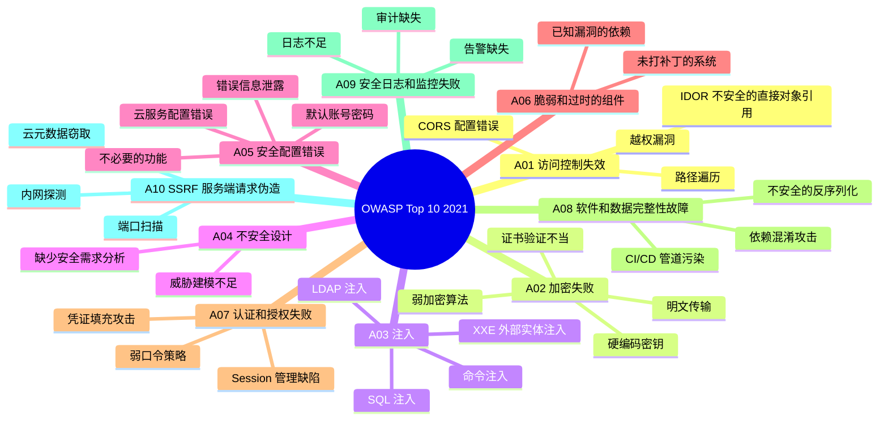
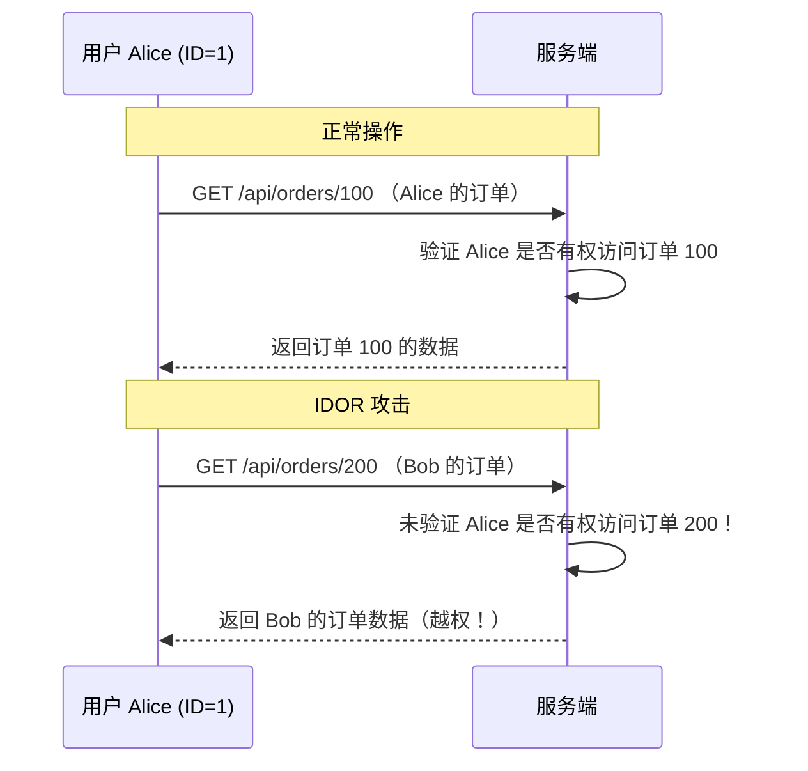
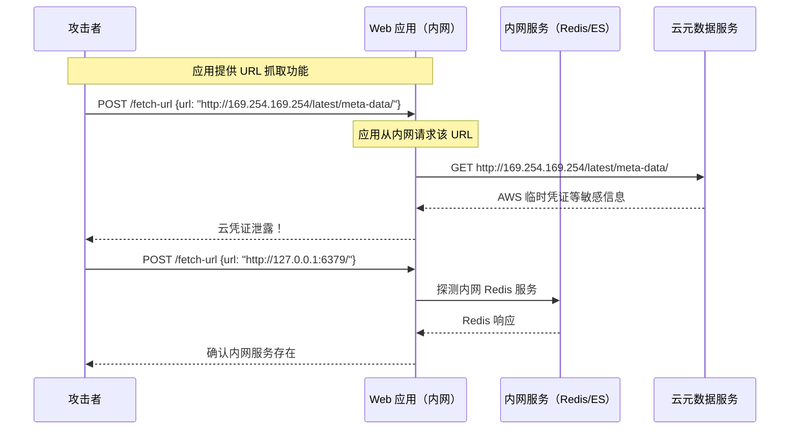
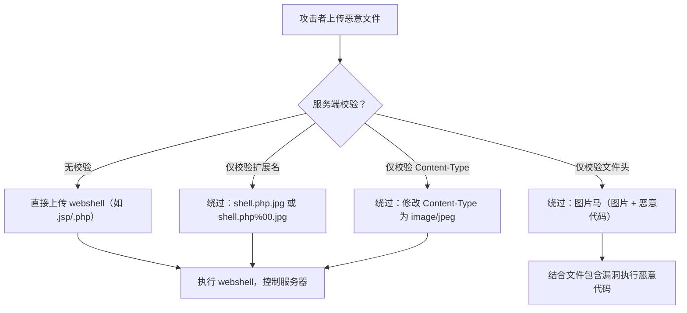

# OWASP Top 10

## ⭐ 面试重点速览

| 面试高频考点 | 重要程度 | 考察方向 |
| --- | --- | --- |
| SQL 注入原理与防御 | :star::star::star::star::star: | 参数化查询、ORM 安全使用、预编译语句 |
| XSS 三种类型与防御 | :star::star::star::star::star: | 存储型/反射型/DOM 型、CSP、输出编码 |
| CSRF 攻击与防御 | :star::star::star::star::star: | CSRF Token、SameSite Cookie、Referer 校验 |
| SSRF 原理与防御 | :star::star::star::star: | URL 白名单、内网地址过滤、DNS 解析限制 |
| 文件上传漏洞 | :star::star::star::star: | 文件类型校验、内容检测、存储隔离 |
| 不安全的反序列化 | :star::star::star::star: | Java 反序列化漏洞、Fastjson 漏洞、防御措施 |
| 认证与授权缺陷 | :star::star::star::star: | 弱口令、Session 固定、越权、IDOR |
| 安全配置错误 | :star::star::star::star: | 默认配置、错误信息泄露、不必要的功能 |

---

## 一、OWASP Top 10 全景

OWASP（Open Web Application Security Project）每 3-4 年发布一次 Top 10 安全风险报告，是 Web 应用安全最重要的参考标准。



---

## 二、A03：注入攻击（Injection）

### 2.1 SQL 注入

```mermaid
sequenceDiagram
    participant A as 攻击者
    participant W as Web 应用
    participant D as 数据库

    Note over A,D: 正常请求
    A->>W: GET /user?id=1
    W->>D: SELECT * FROM users WHERE id = 1
    D-->>W: 返回用户 1 的数据
    W-->>A: 用户数据

    Note over A,D: SQL 注入攻击
    A->>W: GET /user?id=1 OR 1=1
    W->>D: SELECT * FROM users WHERE id = 1 OR 1=1
    Note over D: WHERE 条件永远为真，返回所有用户
    D-->>W: 所有用户数据
    W-->>A: 全部用户数据泄露！

    Note over A,D: 更危险的注入
    A->>W: GET /user?id=1; DROP TABLE users; --
    W->>D: SELECT * FROM users WHERE id = 1; DROP TABLE users; --
    Note over D: users 表被删除！
```

**SQL 注入分类：**

| 类型 | 描述 | 示例 |
| --- | --- | --- |
| **联合查询注入** | 使用 UNION 合并查询结果 | `' UNION SELECT username, password FROM users --` |
| **报错注入** | 利用数据库报错信息提取数据 | `' AND extractvalue(1, concat(0x7e, database())) --` |
| **布尔盲注** | 根据页面响应差异推断数据 | `' AND SUBSTRING(password,1,1)='a' --` |
| **时间盲注** | 利用延时函数判断条件 | `' AND IF(SUBSTRING(password,1,1)='a', SLEEP(5), 0) --` |
| **堆叠注入** | 执行多条 SQL 语句 | `'; UPDATE users SET is_admin=1 WHERE username='attacker' --` |

**防御措施：**

```java
// ❌ 错误示范：字符串拼接（SQL 注入风险）
String query = "SELECT * FROM users WHERE username = '" + username + "'";

// ✅ 正确示范：参数化查询（PreparedStatement）
String query = "SELECT * FROM users WHERE username = ?";
PreparedStatement stmt = conn.prepareStatement(query);
stmt.setString(1, username);  // 参数绑定，自动转义

// ✅ 使用 ORM 框架（但需注意原生 SQL 部分）
User user = userRepository.findByUsername(username);  // Spring Data JPA 安全

// ❌ ORM 中的原生查询仍然危险
String jpql = "SELECT u FROM User u WHERE u.username = '" + username + "'";  // 危险！
```

::: danger 血的教训
2012 年 LinkedIn 因 SQL 注入泄露 650 万用户密码哈希。2019 年 Capital One 因 SSRF 结合 AWS 元数据服务导致 1 亿用户数据泄露。注入攻击连续多年位居 OWASP Top 10 榜首或前三。
:::

### 2.2 XXE（XML 外部实体注入）

```xml
<!-- 攻击者提交的恶意 XML -->
<?xml version="1.0" encoding="UTF-8"?>
<!DOCTYPE foo [
  <!ENTITY xxe SYSTEM "file:///etc/passwd">
  <!ENTITY xxe2 SYSTEM "http://attacker.com/ssrf">
]>
<user>
  <name>&xxe;</name>  <!-- 读取服务器文件内容 -->
  <email>&xxe2;</email>  <!-- 触发 SSRF 请求 -->
</user>
```

防御：禁用 XML 外部实体解析（`XMLInputFactory.setProperty(XMLInputFactory.IS_SUPPORTING_EXTERNAL_ENTITIES, false)`），或直接使用 JSON 替代 XML。

---

## 三、A01：访问控制失效

### 3.1 IDOR（不安全的直接对象引用）



**防御：**
- 使用 UUID 而非自增 ID 作为资源标识
- 每次请求验证当前用户是否有权访问该资源
- 使用 Spring Security 的 `@PreAuthorize` + 方法级权限控制

### 3.2 垂直越权 vs 水平越权

| 类型 | 描述 | 示例 |
| --- | --- | --- |
| **垂直越权** | 低权限用户执行高权限操作 | 普通用户访问 `/admin/deleteUser` |
| **水平越权** | 同级别用户访问他人数据 | 用户 A 查看用户 B 的订单详情 |

---

## 四、SSRF（服务端请求伪造）

### 4.1 攻击原理



### 4.2 防御措施

| 策略 | 实现方式 |
| --- | --- |
| **URL 白名单** | 只允许访问预定义的外部域名 |
| **内网地址过滤** | 禁止访问 127.0.0.1、10.0.0.0/8、172.16.0.0/12、192.168.0.0/16、169.254.169.254 |
| **DNS 解析校验** | 解析 URL 域名后，检查 IP 是否属于内网段 |
| **协议限制** | 只允许 http/https，禁止 file://、gopher://、dict:// |
| **响应过滤** | 不直接返回原始响应给用户 |
| **网络隔离** | 出口流量经过代理，限制内网访问 |

::: danger 云环境特别提醒
AWS 元数据端点 `169.254.169.254` 和 GCP 的 `metadata.google.internal` 是 SSRF 攻击的常见目标，攻击者可获取临时凭证后接管整个云环境。务必在应用层过滤这些地址，同时使用 IMDSv2（AWS 要求 Token 验证）。
:::

---

## 五、文件上传漏洞

### 5.1 攻击方式



### 5.2 防御措施

1. **文件类型白名单**：只允许必要的文件类型（如 jpg、png、pdf）
2. **文件内容检测**：使用 Magic Number 检测真实文件类型，而非依赖扩展名
3. **文件重命名**：存储时使用 UUID 命名，不保留原始文件名
4. **存储隔离**：上传文件存储在独立域名/服务器，与主应用隔离
5. **权限控制**：上传目录禁止脚本执行权限
6. **病毒扫描**：集成 ClamAV 等病毒扫描引擎
7. **大小限制**：设置合理的文件大小上限

---

## 六、不安全的反序列化

### 6.1 Java 反序列化漏洞

```java
// 攻击者构造恶意序列化对象
// 利用 CommonsCollections 链执行任意命令
byte[] maliciousPayload = generateGadgetChain("rm -rf /");

// 服务端反序列化时触发漏洞
ObjectInputStream ois = new ObjectInputStream(new ByteArrayInputStream(maliciousPayload));
ois.readObject();  // 远程代码执行！
```

::: danger 严重性
Java 反序列化漏洞（如 Fastjson、Jackson、WebLogic）是历史上最严重的安全漏洞之一。2017 年 Equifax 因 Apache Struts2 反序列化漏洞导致 1.43 亿用户数据泄露，最终和解金额达 7 亿美元。
:::

**防御措施：**
- 避免使用 Java 原生序列化，改用 JSON/Protobuf
- 如果必须使用，实现类型白名单（`ObjectInputFilter`）
- 及时升级 Fastjson/Jackson 等库到安全版本
- 使用 `Runtime.exec()` 时禁止用户输入进入命令字符串

---

## 七、与现有模块的交叉引用

| 相关模块 | 路径 | 内容侧重 |
| --- | --- | --- |
| 安全基础总览 | [安全基础总览](../fundamentals/index.md) | CIA 三元组、纵深防御 |
| 安全编码实践 | [安全编码实践](./secure-coding.md) | 输入校验、输出编码、参数化查询具体实现 |
| API 安全 | [API 安全](./api-security.md) | HMAC 签名、防重放、限流 |
| Spring Security 漏洞防护 | [spring-ecosystem/spring-security/vulnerability.md](../../spring-ecosystem/spring-security/vulnerability.md) | Spring Security 中的安全漏洞防护实现 |
| 前端 XSS 防护 | [frontend/security/xss.md](../../frontend/security/xss.md) | 前端视角的 XSS 攻击与防御 |
| 前端 CSRF 防护 | [frontend/security/csrf.md](../../frontend/security/csrf.md) | 前端视角的 CSRF 攻击与防御 |
| 前端常见攻击 | [frontend/security/common-attacks.md](../../frontend/security/common-attacks.md) | 前端常见攻击综合防护 |

---

## 八、面试经典高频题

### Q1：SQL 注入的根本原因是什么？为什么参数化查询可以防止？

**参考答案：**

SQL 注入的根本原因是**将用户输入当作 SQL 代码执行**，即数据与代码的混淆。

参数化查询（PreparedStatement）的防御原理：
1. SQL 语句在数据库中被**预编译**，生成执行计划，此时 SQL 语句结构已经确定
2. 用户输入通过参数绑定传入，数据库将其**仅当作数据**，不会重新解析 SQL 语法
3. 即使输入包含 SQL 关键字（如 `' OR 1=1 --`），也只会被当作普通字符串值处理

```
// 预编译后，SQL 结构为：
SELECT * FROM users WHERE username = ?
// 参数 'admin' OR '1'='1' 被当作 username 的值
// 查询条件变为：username = "admin' OR '1'='1"
// 而不是：username = 'admin' OR '1'='1'
```

### Q2：XSS 三种类型的区别和各自防御重点？

**参考答案：**

| 类型 | 攻击方式 | 数据流向 | 防御重点 |
| --- | --- | --- | --- |
| **存储型 XSS** | 恶意脚本存储在服务器（数据库、评论、日志） | 攻击者 → 服务器 → 受害者 | 服务端输出编码 + CSP |
| **反射型 XSS** | 恶意脚本在 URL 参数中，请求时反射回页面 | 攻击者 → 受害者 → 服务器 → 受害者 | 前端输出编码 + 不信任 URL 参数 |
| **DOM 型 XSS** | 恶意脚本通过 JavaScript 操作 DOM 执行 | 攻击者 → 受害者浏览器 | 安全 DOM API（textContent/encodeURIComponent）|

存储型 XSS 危害最大，一次注入影响所有访问该页面的用户。

### Q3：SSRF 攻击为什么在云环境特别危险？如何防御？

**参考答案：**

云环境（AWS/GCP/Azure）中 SSRF 特别危险的原因：
1. **元数据服务**：云实例可通过 `169.254.169.254`（AWS）或 `metadata.google.internal`（GCP）访问实例元数据，包括临时 IAM 凭证
2. **凭证泄露连锁反应**：获取到 IAM 凭证后，攻击者可访问该角色允许的所有云资源（S3 存储桶、RDS 数据库、DynamoDB 等）
3. **内网横向移动**：从应用服务器攻击内网其他服务（数据库、Redis、消息队列）

防御措施：
1. 使用 URL 白名单，禁止用户自由指定 URL
2. 在代码层过滤内网 IP 地址（10.x, 172.16-31.x, 192.168.x, 127.x, 169.254.169.254）
3. DNS 解析后再次检查 IP 是否在内网段
4. 使用 IMDSv2（AWS 强制要求 Token 验证）
5. 网络层使用代理/防火墙限制出站流量

### Q4：文件上传漏洞的防御措施有哪些？请从多个层面说明

**参考答案：**

纵深防御的文件上传安全策略：

1. **前端校验**（体验层，不依赖）：文件扩展名白名单、文件大小限制
2. **服务端校验**（核心层）：
   - 文件类型白名单（只允许 jpg/png/pdf/gif）
   - Magic Number 检测（读取文件头字节，非扩展名判断）
   - 文件内容扫描（病毒扫描）
   - 大小限制（如 10MB）
3. **存储层**：
   - 文件重命名（UUID + 原始扩展名，不保留用户输入的文件名）
   - 存储到独立服务器或对象存储（OSS/S3），与 Web 应用隔离
   - 上传目录禁止脚本执行权限
4. **访问控制**：
   - 上传文件使用独立域名，Cookie 不共享
   - 文件访问加权限校验，非公开文件需鉴权
5. **监控**：异常上传行为告警，如短时间内大量上传

### Q5：Java 反序列化漏洞的根因是什么？如何防御？

**参考答案：**

根因：Java 反序列化时，`ObjectInputStream.readObject()` 会调用反序列化对象的 `readObject()` 方法。攻击者构造恶意序列化对象，利用"Gadget Chain"（如 CommonsCollections、Spring 等库中的类）在反序列化过程中触发任意代码执行。

防御措施：
1. **根本方案**：不使用 Java 原生序列化，改用 JSON（Jackson/Gson）或 Protobuf
2. **类型过滤**：Java 9+ 使用 `ObjectInputFilter` 设置反序列化白名单
3. **依赖升级**：及时更新 Fastjson、Jackson、CommonsCollections 等库
4. **运行时检测**：RASP（Runtime Application Self-Protection）检测反序列化攻击
5. **网络隔离**：限制应用服务器出站网络，防止反弹 Shell

### Q6：什么是 IDOR？如何发现和修复？

**参考答案：**

IDOR（Insecure Direct Object Reference）是指应用直接使用用户提供的参数来访问对象，而没有验证该用户是否有权访问该对象。

示例：`GET /api/invoices/1001` 中直接使用 1001 作为发票 ID，如果攻击者改为 1002 就能看到他人的发票。

修复方法：
1. **服务端权限校验**：每次请求验证当前用户是否拥有该资源的访问权限
2. **使用不可预测的标识符**：用 UUID 替代自增 ID
3. **间接引用**：使用用户维度的映射（如 `GET /api/invoices` 只返回当前用户的发票列表）
4. **框架级防护**：Spring Security 的 `@PostAuthorize` 或 `@PreAuthorize` + ACL

### Q7：OWASP Top 10 2021 版本相比 2017 版本有哪些主要变化？

**参考答案：**

2021 版重大变化：
1. **A01 访问控制失效**（从 A05 升至第一）：越权漏洞在实际攻击中占比最高
2. **A02 加密失败**（原 A03 敏感数据泄露，更名）：强调密码学使用的正确性
3. **A03 注入**（从 A01 降至第三）：参数化查询的普及降低了注入风险
4. **A04 不安全设计**（新增）：强调安全左移，在需求设计阶段就考虑安全
5. **A08 软件和数据完整性故障**（新增）：包含反序列化、CI/CD 安全、依赖混淆
6. **XXE 移除**：XML 使用率下降，不再进入 Top 10（但仍需关注）