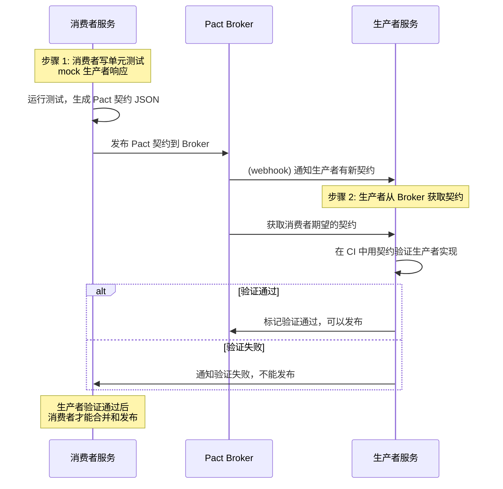
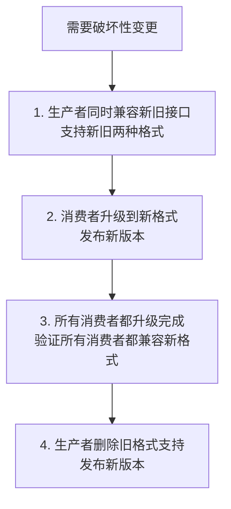

# 契约测试

## ⭐ 面试重点速览

| 知识模块 | 重点内容 | 面试频率 |
|----------|----------|----------|
| 消费者驱动契约 | Pact 核心理念、生产者-消费者模型、契约驱动开发 | 极高 |
| 微服务测试挑战 | 集成测试痛点、分布式依赖、发布同步问题 | 极高 |
| Pact 工作流程 | 消费者驱动 -> 生成契约 -> 发布到 Pact Broker -> 生产者验证 | 极高 |
| API 兼容性 | 向后兼容原则、破坏性变更、非破坏性变更判断 | 高 |
| Spring Cloud Contract | Pact vs SCC 选型、生产者主导模型 | 中高 |

---

## 一、微服务测试的痛点

传统集成测试在微服务架构下遇到极大挑战：

| 问题 | 描述 |
|------|------|
| **依赖爆炸** | 一个服务依赖 5-10 个其他服务，启动需要整个链路所有服务都正常运行 |
| **发布同步问题** | 消费者和生产者分别发布，生产者改了 API，消费者不知道，上线崩掉 |
| **反馈延迟** | CI 中需要所有依赖服务都起来才能测试，构建时间分钟级甚至小时级 |
| **环境漂移** | 共享测试环境的状态变化会导致你的测试失败（比如别人删了数据） |
| **测试不稳定** | 某个依赖服务挂了，所有消费它的测试都失败，"今天 CI 又红了但跟我没关系" |

```mermaid
graph LR
    A[服务 A<br/>订单服务] --> B[服务 B<br/>用户服务]
    A --> C[服务 C<br/>支付服务]
    C --> D[服务 D<br/>风控服务]
    B --> D
    style A fill:#fff3e0
    style D fill:#c8e6c9
    note right of A: 服务A上线需要<br/>B/C/D都正常<br/>环境可用才能测试
```

**契约测试**就是为解决这些问题而生的测试方法。

---

## 二、消费者驱动契约测试（Pact）

### 2.1 核心概念

**消费者驱动契约（Consumer-Driven Contracts, CDC）** 核心思想：
- API 的消费者先定义它**期望**得到什么样的响应
- 生产者必须满足这个契约，否则契约验证失败
- 契约本身是可共享的文档，同时可被自动化验证

| 角色 | 职责 |
|------|------|
| **消费者** | 调用生产者 API 的服务，在自己的单元测试中生成契约 |
| **生产者** | 提供 API 的服务，根据契约验证自己的实现是否符合要求 |
| **Pact Broker** | 存储和分享契约，提供变更通知和兼容性验证 |

### 2.2 Pact 完整工作流程



### 2.3 消费者端：定义契约

```java
@ExtendWith(PactConsumerTestExt.class)
@PactTestFor(providerName = "user-service")
class UserServiceConsumerTest {

    @Pact(consumer = "order-service")
    V4Pact 用户存在契约(BodyBuilder bodyBuilder) {
        return bodyBuilder
            .uponReceiving("查询用户信息")
            .path("/users/{userId}")
            .method(HttpMethod.GET.name())
            .matchPath("/users/\\d+")               // 路径正则匹配
            .willRespondWith()
            .status(200)
            .body(
                PactDslJsonBody
                    .integerType("id", 1)
                    .stringType("name", "张三")
                    .stringType("email", "zhang@example.com")
                    .booleanType("active", true)
            );
    }

    @Pact(consumer = "order-service")
    V4Pact 用户不存在契约(BodyBuilder bodyBuilder) {
        return bodyBuilder
            .uponReceiving("查询不存在的用户")
            .path("/users/999")
            .method("GET")
            .willRespondWith()
            .status(404);
    }

    @Autowired
    private UserClient userClient;  // OpenFeign/RestTemplate 客户端

    @Test
    void 测试查询存在的用户(PactVerificationContext context) {
        UserDTO user = userClient.getUser(1L);
        assertEquals("张三", user.getName());
    }

    @Test
    void 测试不存在的用户返回404(PactVerificationContext context) {
        assertThrows(UserNotFoundException.class, () -> userClient.getUser(999L));
    }
}
```

测试运行后，Pact 会自动生成 `pacts/order-service-user-service.json` 契约文件，包含消费者对 API 的所有期望。

### 2.4 生产者端：验证契约

```java
@ExtendWith(SpringExtension.class)
@SpringBootTest(webEnvironment = SpringBootTest.WebEnvironment.RANDOM_PORT)
@EnablePactBroker
@PactBroker(url = "https://pact-broker.example.com")
class UserServiceProviderVerificationTest {

    @TestTemplate
    void pactVerificationTestTemplate(PactVerificationContext context) {
        context.verifyInteraction();
    }

    @State("用户 1 存在")  // 契约中的 providerState，生产者准备数据
    void 用户1存在() {
        userRepository.save(new User(1L, "张三", "zhang@example.com"));
    }

    @State("用户 999 不存在")
    void 用户999不存在() {
        userRepository.deleteById(999L);
    }
}
```

Pact 会从 Pact Broker 拉取所有消费者针对该生产者的契约，逐个验证。验证通过才允许发布生产者版本。

### 2.5 Provider States

Provider States（提供者状态）解决了契约验证中数据状态的问题：

```java
// 消费者定义契约时指定状态
@Pact(consumer = "order-service")
V4Pact pact(BodyBuilder bodyBuilder) {
    return bodyBuilder
        .given("用户 123 存在")          // 定义状态
        .uponReceiving("查询用户详情")
        .path("/users/123")
        .method("GET");
    // ...
}

// 生产者实现状态准备
@State("用户 123 存在")
void 用户123存在(Map<String, Object> params) {
    Long userId = Long.valueOf(params.get("userId").toString());
    User user = new User(userId, "张三");
    userRepository.save(user);
}
```

---

## 三、契约变更与兼容性

### 3.1 变更分类与兼容性判断

| 变更类型 | 是否向后兼容 | 例子 | 是否允许发布 |
|----------|-------------|------|--------------|
| 新增可选字段 | ✅ 兼容 | 给响应新增一个非必填字段 | 允许 |
| 新增可选查询参数 | ✅ 兼容 | 接口新增一个可选的排序参数 | 允许 |
| 删除字段（保留兼容逻辑） | ✅ 兼容 | 字段不再推荐，但仍返回默认值 | 允许 |
| 修改字段类型 | ❌ 破坏性 | 把 id 从 Number 改为 String | 不允许直接发布 |
| 必填字段改为可选 | ✅ 兼容 | 原来必须的变成可选 | 允许 |
| 可选字段改为必填 | ❌ 破坏性 | 消费者不一定传，会导致请求失败 | 分阶段迁移 |
| 修改 HTTP 状态码 | ❌ 破坏性 | 200 改成 400 | 不允许 |

::: tip 兼容性演进原则
- **向后兼容（Backward Compatible）**：新版本生产者能被旧版本消费者正常调用
- **向前兼容（Forward Compatible）**：旧版本生产者能被新版本消费者正常调用
- **尽可能保持向后兼容**，这是微服务独立发布的基础
:::

### 3.2 破坏性变更的正确处理流程



Pact Broker 会自动检测破坏性变更，在 CI 中阻止生产者直接发布。

---

## 四、Spring Cloud Contract 与 Pact 的对比

| 对比维度 | Pact（消费者驱动） | Spring Cloud Contract（生产者驱动） |
|----------|-------------------|-------------------------------------|
| 谁主导契约 | 消费者定义契约，生产者遵守 | 生产者定义契约，消费者用桩测试 |
| 语言支持 | 跨语言，任何语言都可以 | 主要面向 JVM 生态 |
| 集成难度 | 消费者端配置简单，Broker 管理契约 | 需要在生产者写契约，消费者用 stub-runner |
| 生产者验证 | 生产者拉取所有消费者契约验证 | 生产者定义契约，生成验证代码 |
| 适用场景 | 多语言团队、消费者迭代快 | 单一团队、单一语言、生产者统一控制 |

---

## 五、契约测试 vs 集成测试

| 测试类型 | 依赖 | 运行速度 | 验证点 | 适用场景 |
|----------|------|----------|--------|----------|
| 契约测试 | 无外部依赖，mock 真实交互 | 毫秒级，快速反馈 | API 交互格式是否符合约定 | 微服务之间的接口验证 |
| 集成测试 | 需要真实生产者运行 | 秒级，依赖环境就绪 | 完整业务功能是否正确 | 单服务内的模块集成 |
| E2E 测试 | 全链路所有服务都启动 | 分钟级，慢 | 端到端业务流程是否正确 | 上线前验证，不做回归 |

::: tip 契约测试的最佳实践
- **每个微服务独立 CI**：不需要依赖其他服务运行就能验证兼容性
- **只测试交互格式**：不测试业务逻辑，业务逻辑交给生产者自己的单元/集成测试
- **只在 Pact Broker 发布成功版本**：不合格的契约不会被生产者看到
- **Can I Deploy** 检查：生产者发布前确认所有消费者都兼容，消费者发布前确认生产者兼容
:::

---

## 面试高频题

**Q1：什么是消费者驱动契约测试？解决什么问题？**

**标准答案**：消费者驱动契约测试（CDC）是微服务架构下的接口测试方法，核心思想是由消费者根据自己的实际期望定义 API 契约，生产者必须满足这个契约才能通过验证。它主要解决：(1) 微服务依赖爆炸问题——消费者测试不需要真实生产者，用 mock 即可；(2) 发布同步问题——生产者发布前自动验证所有消费者契约，确保变更不破坏现有消费者；(3) 环境不稳定问题——不需要共享测试环境，每个团队本地就能验证。Pact 是消费者驱动契约测试最流行的实现。

**Q2：Pact 的工作流程是什么？**

**标准答案**：分为两个阶段：消费者阶段和生产者阶段。消费者阶段：消费者编写单元测试，mock 生产者，Pact 根据测试自动生成契约 JSON，发布到 Pact Broker。生产者阶段：生产者从 Pact Broker 获取所有消费者的契约，在 CI 流水线中用契约验证自身实现，验证通过才能发布。如果生产者变更导致契约不兼容，会在 CI 阶段被检测出来，阻止发布。Pact Broker 负责存储契约、通知变更、Can I Deploy 检查。

**Q3：什么是破坏性变更？什么是非破坏性变更？举几个例子。**

**标准答案**：破坏性改更是指变更导致现有消费者无法正常调用生产者，比如修改字段类型、把可选字段改为必填、删除已有的字段、修改 HTTP 方法、修改路径。非破坏性变更不影响现有消费者，比如新增可选字段、新增可选参数、新增接口、删除不再使用但仍保持兼容的逻辑。Pact Broker 可以自动判断变更是否破坏性，并阻止破坏性变更发布。正确处理破坏性变更的方式是分阶段迁移：生产者先兼容新旧两种格式，所有消费者升级后再删除旧格式。

**Q4：微服务架构下契约测试相比传统集成测试有什么优势？**

**标准答案**：(1) 解耦：消费者开发不需要等待生产者开发完成，生产者开发不需要等待所有消费者，各自独立开发；(2) 速度快：不需要启动所有依赖服务，CI 运行速度快一个数量级；(3) 反馈早：消费者本地就能发现 API 不匹配问题，不需要到集成阶段才发现；(4) 独立发布：每个服务可以独立发布，不需要同步发布窗口；(5) 文档可执行：契约本身就是活文档，永远不会过时。

**Q5：Provider States 的作用是什么？举个例子说明。**

**标准答案**：Provider States（提供者状态）解决了契约验证时生产者需要特定数据状态的问题。例如消费者需要测试"查询用户信息"接口，用户存在时返回 200，不存在时返回 404。消费者在契约中分别指定"用户 id 1 存在"和"用户 id 1 不存在"两种状态。生产者在验证前，根据这些状态钩子准备对应的数据——用户存在就插入用户，不存在就删除用户，然后再验证契约。这样同一个契约不同场景都能正确验证。

**Q6：Pact 和 Spring Cloud Contract 的区别？你会怎么选？**

**标准答案**：核心区别在于谁主导契约：Pact 是消费者驱动，消费者定义契约，生产者遵守；Spring Cloud Contract 是生产者驱动，生产者定义契约，消费者生成桩。适用场景：(1) 多语言团队、消费者独立迭代、公网 API 平台适合 Pact；(2) 单一语言（Java/Kotlin）、同一个团队内多个服务、生产者统一控制 API 规范适合 Spring Cloud Contract。Pact 的优势是跨语言和成熟的 Broker，Spring Cloud Contract 优势是和 Spring Boot 生态集成更紧密。