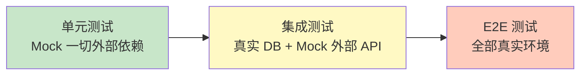

# 集成测试实战

## ⭐ 面试重点速览

| 知识模块 | 重点内容 | 面试频率 |
|----------|----------|----------|
| Spring Boot Test | @SpringBootTest 与切片测试（@WebMvcTest/@DataJpaTest/@JsonTest）的选择权衡 | 极高 |
| TestContainers | 容器化真实中间件、单例容器优化、与 @DynamicPropertySource 集成 | 极高 |
| 数据库测试策略 | Repository 层测试、事务回滚策略、@Sql 注解、Flyway 迁移 | 高 |
| API 测试 | MockMvc 实战、RestAssured、@AutoConfigureMockMvc | 高 |
| 集成测试反模式 | 测试间数据污染、过度使用 @SpringBootTest、构建规模过大 | 中高 |

---

## 一、单元测试 vs 集成测试：边界在哪？

::: tip 核心区分
- **单元测试**：测试单个类/方法，依赖全部 mock，不启动 Spring 容器，毫秒级
- **集成测试**：测试多个组件的协作行为，使用真实或接近真实的依赖，需要容器或中间件，秒级
- **关键判断标准**：测试是否需要跨越进程边界（网络、数据库、文件系统、消息队列）
:::



---

## 二、Spring Boot Test 实战

### 2.1 @SpringBootTest：完整上下文 vs 切片测试

```java
// === 完整上下文：启动整个 Spring 容器 ===
@SpringBootTest(
    webEnvironment = SpringBootTest.WebEnvironment.RANDOM_PORT
)
class UserIntegrationTest {

    @Autowired
    private TestRestTemplate restTemplate;

    @Test
    void 创建用户并查询() {
        // 通过真实 HTTP 调用测试完整链路
        UserDTO request = new UserDTO("张三", "zhangsan@example.com");
        ResponseEntity<UserDTO> createResp = restTemplate
            .postForEntity("/api/users", request, UserDTO.class);

        assertEquals(HttpStatus.CREATED, createResp.getStatusCode());
        assertNotNull(createResp.getBody().getId());

        // 验证持久化结果
        ResponseEntity<UserDTO> getResp = restTemplate
            .getForEntity("/api/users/" + createResp.getBody().getId(), UserDTO.class);
        assertEquals("张三", getResp.getBody().getName());
    }
}
```

### 2.2 切片测试：按需加载

```java
// === 只加载 Controller 层 ===
@WebMvcTest(UserController.class)
class UserControllerTest {

    @Autowired
    private MockMvc mockMvc;

    @MockBean                                               // Mock Service
    private UserService userService;

    @Test
    void 查询用户_返回200() throws Exception {
        when(userService.findById(1L))
            .thenReturn(new UserDTO(1L, "张三"));

        mockMvc.perform(get("/api/users/1"))
            .andExpect(status().isOk())
            .andExpect(jsonPath("$.name").value("张三"));
    }
}

// === 只加载 Repository 层 ===
@DataJpaTest
class UserRepositoryTest {

    @Autowired
    private TestEntityManager entityManager;

    @Autowired
    private UserRepository userRepository;

    @Test
    void 按邮箱查询用户() {
        User user = new User("张三", "zhang@example.com");
        entityManager.persistAndFlush(user);

        Optional<User> found = userRepository.findByEmail("zhang@example.com");
        assertTrue(found.isPresent());
        assertEquals("张三", found.get().getName());
    }
}
```

::: danger @SpringBootTest 滥用警告
每个 @SpringBootTest 都会启动完整的 Spring 容器，一个中型项目可能有数十秒的启动时间。如果你的测试目标是验证单个 Controller 的逻辑，应该用 @WebMvcTest 而非 @SpringBootTest。100 个 @SpringBootTest 的测试类意味着 CI 流水线中需要数分钟甚至更久的启动时间。

正确策略：**能用切片测试就用切片测试，只为真正需要完整上下文的场景使用 @SpringBootTest。**
:::

### 2.3 @SpringBootTest 的 WebEnvironment 选择

| 枚举值 | 启动内嵌服务器 | 适用场景 |
|--------|---------------|----------|
| `MOCK`（默认） | 否 | 用 MockMvc 测试，最快 |
| `RANDOM_PORT` | 是（随机端口） | TestRestTemplate 真实 HTTP 调用 |
| `DEFINED_PORT` | 是（固定端口） | 需要固定端口场景（如 CI 中并行执行需注意冲突） |
| `NONE` | 否 | 纯 Service 层测试，不需要 Web 环境 |

---

## 三、TestContainers：真实中间件集成测试

### 3.1 为什么需要 TestContainers？

::: warning H2 内存数据库的局限性
很多团队用 H2 代替 MySQL 做集成测试，但这存在严重隐患：

- H2 和 MySQL 的 SQL 方言不同（如 `LIMIT` vs `OFFSET FETCH`、函数差异）
- H2 不支持 MySQL 特有功能（如某些存储引擎特性、字符集处理）
- **"H2 测试通过，上线 MySQL 报错"的场景在生产中时有发生**
:::

**TestContainers** 通过 Docker 启动真实的中间件容器，让集成测试在真实环境中运行：

```java
@Testcontainers
@SpringBootTest
class UserRepositoryIntegrationTest {

    @Container
    static MySQLContainer<?> mysql = new MySQLContainer<>("mysql:8.0")
            .withDatabaseName("testdb")
            .withUsername("test")
            .withPassword("test");

    @DynamicPropertySource
    static void configureProperties(DynamicPropertyRegistry registry) {
        registry.add("spring.datasource.url", mysql::getJdbcUrl);
        registry.add("spring.datasource.username", mysql::getUsername);
        registry.add("spring.datasource.password", mysql::getPassword);
    }

    @Autowired
    private UserRepository userRepository;

    @Test
    void 使用真实MySQL测试() {
        User user = new User("张三", "zhang@example.com");
        User saved = userRepository.save(user);

        Optional<User> found = userRepository.findById(saved.getId());
        assertTrue(found.isPresent());
    }
}
```

### 3.2 单例容器优化启动速度

多个测试类共享同一个容器，避免重复启动：

```java
// 抽象基类：所有子类共享同一个 MySQL 容器
public abstract class BaseMySQLTest {

    static final MySQLContainer<?> MYSQL = new MySQLContainer<>("mysql:8.0")
            .withDatabaseName("testdb")
            .withReuse(true);  // 开启容器重用

    static {
        MYSQL.start();
    }

    @DynamicPropertySource
    static void configureProperties(DynamicPropertyRegistry registry) {
        registry.add("spring.datasource.url", MYSQL::getJdbcUrl);
        registry.add("spring.datasource.username", MYSQL::getUsername);
        registry.add("spring.datasource.password", MYSQL::getPassword);
    }
}

// 具体测试类继承基类，无需重复声明容器
class UserRepositoryTest extends BaseMySQLTest {
    @Autowired
    private UserRepository userRepository;
    // ... 测试方法
}
```

### 3.3 多中间件组合

```java
@Testcontainers
@SpringBootTest
class OrderIntegrationTest {

    // MySQL
    @Container
    static MySQLContainer<?> mysql = new MySQLContainer<>("mysql:8.0");

    // Redis
    @Container
    static GenericContainer<?> redis = new GenericContainer<>("redis:7-alpine")
            .withExposedPorts(6379);

    // Kafka
    @Container
    static KafkaContainer kafka = new KafkaContainer(
            DockerImageName.parse("confluentinc/cp-kafka:7.4.0"));

    @DynamicPropertySource
    static void configureProperties(DynamicPropertyRegistry registry) {
        registry.add("spring.datasource.url", mysql::getJdbcUrl);
        registry.add("spring.redis.host", redis::getHost);
        registry.add("spring.redis.port", () -> redis.getMappedPort(6379));
        registry.add("spring.kafka.bootstrap-servers", kafka::getBootstrapServers);
    }
}
```

---

## 四、数据库测试策略

### 4.1 事务回滚机制

Spring Test 框架默认在每个 @Test 方法后回滚事务，确保测试数据不污染数据库：

```java
@SpringBootTest
@Transactional  // 类级别声明事务
class UserServiceIntegrationTest {

    @Autowired
    private UserService userService;

    @Test
    void 创建用户() {
        userService.createUser("张三");  // 数据写入
        // 测试方法结束后，事务自动回滚，数据库中不留痕迹
    }

    @Test
    @Commit  // 如果需要提交（比如验证触发器行为）
    void 创建用户_需要提交() {
        userService.createUser("李四");
        // 不会回滚，数据持久化
    }
}
```

### 4.2 @Sql 注解初始化数据

```java
@SpringBootTest
@Sql(scripts = "/sql/init-test-data.sql",      // 测试前执行
     executionPhase = Sql.ExecutionPhase.BEFORE_TEST_METHOD)
@Sql(scripts = "/sql/cleanup.sql",              // 测试后执行
     executionPhase = Sql.ExecutionPhase.AFTER_TEST_METHOD)
class ProductServiceTest {

    @Autowired
    private ProductService productService;

    @Test
    void 查询已有商品() {
        // init-test-data.sql 已插入 3 条商品数据
        List<Product> products = productService.listAll();
        assertEquals(3, products.size());
    }
}
```

### 4.3 数据库状态验证

```java
@SpringBootTest
class OrderPersistenceTest {

    @Autowired
    private JdbcTemplate jdbcTemplate;

    @Test
    void 创建订单后数据库记录正确() {
        orderService.createOrder(1L, "SKU001", 5);

        // 直接用 JDBC 验证数据库状态
        Map<String, Object> row = jdbcTemplate.queryForMap(
            "SELECT user_id, sku_code, quantity FROM orders WHERE user_id = ?", 1L);

        assertEquals("SKU001", row.get("sku_code"));
        assertEquals(5, row.get("quantity"));
    }
}
```

---

## 五、API 测试

### 5.1 MockMvc 深度实战

```java
@WebMvcTest(OrderController.class)
class OrderControllerTest {

    @Autowired
    private MockMvc mockMvc;

    @MockBean
    private OrderService orderService;

    @Test
    void 创建订单_参数校验失败返回400() throws Exception {
        // JSON body 缺少必填字段 quantity
        String invalidJson = """
            {
                "skuCode": "SKU001"
            }
            """;

        mockMvc.perform(post("/api/orders")
                .contentType(MediaType.APPLICATION_JSON)
                .content(invalidJson))
            .andExpect(status().isBadRequest())
            .andExpect(jsonPath("$.errors[0].field").value("quantity"))
            .andExpect(jsonPath("$.errors[0].message").value("数量不能为空"));
    }

    @Test
    void 分页查询_带分页参数() throws Exception {
        mockMvc.perform(get("/api/orders")
                .param("page", "0")
                .param("size", "10")
                .param("status", "PAID"))
            .andExpect(status().isOk())
            .andExpect(jsonPath("$.content").isArray())
            .andExpect(jsonPath("$.totalElements").isNumber());
    }
}
```

### 5.2 RestAssured：BDD 风格 API 测试

```java
@SpringBootTest(webEnvironment = SpringBootTest.WebEnvironment.RANDOM_PORT)
class OrderApiTest {

    @LocalServerPort
    private int port;

    @BeforeEach
    void setUp() {
        RestAssured.port = port;
    }

    @Test
    void 创建订单并查询() {
        // Given
        String requestBody = """
            {"skuCode": "SKU001", "quantity": 5}
            """;

        // When + Then
        given()
            .contentType(ContentType.JSON)
            .body(requestBody)
        .when()
            .post("/api/orders")
        .then()
            .statusCode(201)
            .body("skuCode", equalTo("SKU001"))
            .body("quantity", equalTo(5))
            .body("status", equalTo("CREATED"));
    }
}
```

::: tip 相关模块
- Spring Boot 测试配置详见 [Spring Boot 专题](/spring-ecosystem/spring-boot/)
- 性能测试详情见 [高并发专题 - 性能测试](/high-concurrency/performance-testing/)
:::

---

## 面试高频题

**Q1：@SpringBootTest 和 @WebMvcTest / @DataJpaTest 的区别和使用场景？**

**标准答案**：@SpringBootTest 加载完整的 Spring 应用上下文，包括所有 Bean，启动慢但覆盖完整链路，适合端到端集成测试。@WebMvcTest 只加载 Controller 层和相关 MVC 配置，配合 MockMvc 进行 HTTP 层的轻量测试，启动快，适合验证请求映射、参数校验、异常处理。@DataJpaTest 只加载 JPA 相关组件，默认使用嵌入式数据库和事务回滚，适合 Repository 层测试。选择策略：能用切片测试就用切片测试，@SpringBootTest 只在需要验证完整上下文协作时使用。

**Q2：为什么推荐 TestContainers 而非 H2 内存数据库做集成测试？**

**标准答案**：H2 和真实数据库（如 MySQL、PostgreSQL）存在 SQL 方言差异、功能差异和字符集处理差异，H2 上通过的测试不能保证在真实数据库上通过。TestContainers 通过 Docker 启动真实的数据库容器，保证测试环境与生产环境一致，消除了"测试通过上线失败"的风险。代价是测试启动时间稍长，但通过容器重用（withReuse）和单例模式可以显著优化。

**Q3：集成测试中如何处理数据隔离问题？**

**标准答案**：(1) Spring Test 默认事务回滚：每个 @Test 方法执行后自动回滚，不提交数据；(2) @Sql 注解：测试前插入数据，测试后清理；(3) 每个测试使用独立的测试数据（如用户 ID 使用随机 UUID）；(4) 数据库级别的方案：使用 TestContainers 时每个测试类独占一个数据库/ schema；(5) 极端情况：使用 DBUnit 或自定义工具类在 @AfterEach 中清理所有表。最佳实践是组合使用：事务回滚作为默认策略 + 必要时显式 @Sql 清理。

**Q4：MockMvc 和 TestRestTemplate 的区别？**

**标准答案**：MockMvc 不启动内嵌服务器，通过 Spring MVC Test 框架直接调用 Controller，不走真实 HTTP 协议栈，速度最快，适合 @WebMvcTest 和 webEnvironment=MOCK 的 @SpringBootTest。TestRestTemplate 通过真实 HTTP 协议访问应用，需要启动内嵌服务器，会经过 Filter、Interceptor 等完整链路，适合验证路径映射、序列化/反序列化、HTTP 状态码等完整行为。一句话总结：MockMvc 测 Controller 逻辑，TestRestTemplate 测 HTTP 链路。

**Q5：如何处理集成测试中需要 mock 外部 API 的场景（如第三方支付）？**

**标准答案**：在集成测试中 mock 外部依赖的推荐方案：(1) 使用 WireMock 启动本地 HTTP mock 服务器，模拟第三方 API 的响应；(2) 使用 Spring 的 @MockBean 替换调用外部 API 的 Service；(3) 使用 Spring Cloud Contract Stub Runner 运行消费者端桩；(4) 使用应用配置切换为测试模式的实现（如 payment.mode=test 时调用 FakePaymentGateway）。原则是：测试环境的边界应该在系统的最外层，不要让测试依赖不可控的外部服务。

**Q6：@DynamicPropertySource 的作用是什么？**

**标准答案**：@DynamicPropertySource 用于在 Spring 容器初始化之前动态设置环境属性。典型场景是与 TestContainers 配合：容器的端口是随机分配的，在容器启动后才能获取实际端口号，此时需要通过 @DynamicPropertySource 将动态端口注入到 Spring 的配置属性中（如 spring.datasource.url）。它的执行时机早于 ApplicationContext 的初始化，确保数据源等组件使用正确的连接信息。