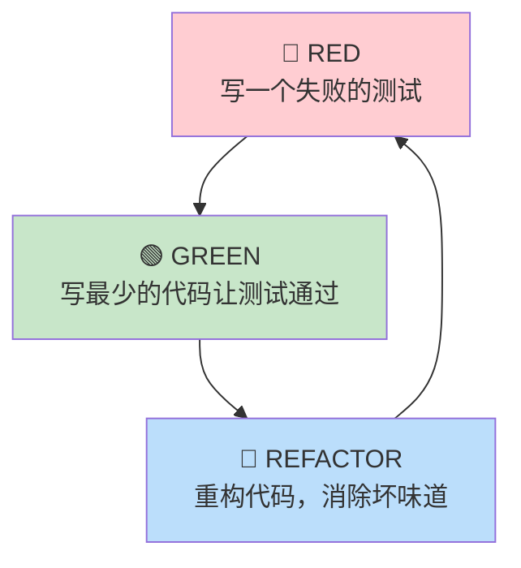
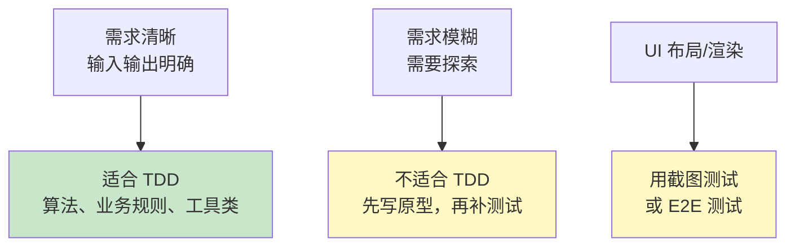

# TDD 与 BDD

## ⭐ 面试重点速览

| 知识模块 | 重点内容 | 面试频率 |
|----------|----------|----------|
| TDD 红-绿-重构 | 三步循环的核心理念、每一步的产出和目的、与传统开发的区别 | 极高 |
| TDD 三大定律 | Uncle Bob 的三条定律、先写测试后写代码的纪律要求 | 高 |
| BDD 核心理念 | 行为驱动开发、通用语言（Ubiquitous Language）、三层结构 | 高 |
| Gherkin 语法 | Given-When-Then 结构、Scenario Outline、Feature 组织 | 中高 |
| TDD 争议 | 适用场景、TDD 是否降低效率、覆盖率与设计质量的关系 | 中高 |

---

## 一、TDD 核心理念：红-绿-重构

**TDD（Test-Driven Development）** 不是"测试驱动开发"，更准确的翻译是"**测试引导开发**"——先写测试来定义行为，再用代码满足测试。

### 1.1 红-绿-重构三步循环



**每一步的具体要求：**

| 阶段 | 做什么 | 产出 | 关键约束 |
|------|--------|------|----------|
| RED（红） | 编写一个刚好能表达需求的失败测试 | 一个编译通过但运行失败的测试 | 测试必须先于产品代码存在 |
| GREEN（绿） | 编写刚好让测试通过的生产代码 | 测试变绿 | **"刚好"**——不要多写一行未来可能需要的代码 |
| REFACTOR（重构） | 在测试绿的保护下优化代码结构 | 更干净的代码，测试仍然绿色 | 不改变外部行为，只改善内部结构 |

### 1.2 实战示例：FizzBuzz TDD 全过程

```java
// === 第一步：RED —— 写失败测试 ===
@Test
void 输入1返回1() {
    assertEquals("1", fizzBuzz(1));
}
// 编译失败，因为 fizzBuzz 方法还不存在

// === 第二步：GREEN —— 最少的代码让测试通过 ===
String fizzBuzz(int n) {
    return "1";
}
// 测试通过！虽然看起来"傻"，但满足了当前测试的需求

// === 第三步：RED —— 下一个失败的测试 ===
@Test
void 输入3返回Fizz() {
    assertEquals("Fizz", fizzBuzz(3));
}
// 测试失败，因为当前返回 "1"

// === 第四步：GREEN —— 最小修改通过测试 ===
String fizzBuzz(int n) {
    if (n == 3) return "Fizz";
    return String.valueOf(n);
}

// === 第五步：REFACTOR —— 消除 magic number ===
private static final int FIZZ_NUM = 3;

String fizzBuzz(int n) {
    if (n % FIZZ_NUM == 0) return "Fizz";  // 用 % 代替 ==，支持任意 3 的倍数
    return String.valueOf(n);
}

// === 继续循环：Buzz、FizzBuzz...
@Test
void 输入5返回Buzz() {
    assertEquals("Buzz", fizzBuzz(5));
}
// ... 不断 RED -> GREEN -> REFACTOR
```

::: tip 面试金句
TDD 的核心不是"测试"，而是**设计**。通过先写测试，你被迫从调用者的角度思考 API 的设计——方法名是否直观、参数是否合理、返回值是否表达清晰意图。**测试是你代码的第一个消费者。**
:::

### 1.3 Uncle Bob 的 TDD 三大定律

| 定律 | 内容 | 解读 |
|------|------|------|
| 第一定律 | 在编写一个失败的单元测试之前，不要编写任何生产代码 | 测试先行 |
| 第二定律 | 只编写刚好导致测试失败的单元测试代码 | 不写多余的测试 |
| 第三定律 | 只编写刚好让失败测试通过的生产代码 | 不过度设计 |

---

## 二、TDD 的优缺点争论

::: warning TDD 的现实争议
TDD 是软件工程领域辩论最激烈的话题之一。理解正反双方的论点，比简单站队更重要。
:::

### 2.1 TDD 的优势

| 优势 | 具体表现 |
|------|----------|
| **驱动设计** | 从调用方视角设计 API，天然追求松耦合和可测试性 |
| **安全网** | 每次修改后立即获得反馈，敢于重构 |
| **文档作用** | 测试本身就是可执行的需求文档，永不"过时" |
| **心理安全感** | 测试绿 = 功能正确，减少焦虑 |
| **减少调试** | 每 2-5 分钟一个循环，问题范围极小 |

### 2.2 TDD 的质疑

| 质疑 | 回应与思考 |
|------|-----------|
| **降低开发速度** | 短期有学习成本，但长期减少调试和返工时间。Martin Fowler：TDD 团队缺陷率降低 40-80% |
| **不适合探索性开发** | 正确。探索性阶段应先写 Spike 代码，待理解问题后再用 TDD 重写 |
| **不适合 UI/前端** | 部分正确。UI 渲染的 TDD 成本高于收益，但业务逻辑仍然适用 |
| **测试维护成本** | 低质量的测试（过度 mock、测试实现细节）维护成本确实高，是对 TDD 实践不当的惩罚 |
| **100% TDD 不现实** | 业界共识：关键路径用 TDD，简单 CRUD 写测试覆盖，探索性代码可后补测试 |

### 2.3 务实策略：TDD 在哪最有效？



**最佳实践**：TDD 用在核心业务逻辑（领域模型、算法、校验规则），非 TDD 用在基础设施代码（配置、DTO、Controller 转发）。

---

## 三、BDD：行为驱动开发

### 3.1 BDD 与 TDD 的关系

BDD 是在 TDD 基础上发展而来的方法论，核心变化在于：

| 维度 | TDD | BDD |
|------|-----|-----|
| 关注点 | 代码正确性 | **业务行为正确性** |
| 语言 | 开发者语言（assertEquals） | **通用语言**（Given-When-Then） |
| 参与者 | 开发者 | 开发者 + QA + PO + 业务专家 |
| 测试粒度 | 方法/类级别 | **业务场景级别** |
| 产出物 | 单元测试代码 | 可执行的需求文档 |

### 3.2 Gherkin 语法核心

Gherkin 是 BDD 的标准描述语言，核心结构为：

```gherkin
# language: zh-CN
功能: 用户登录
  作为一个注册用户
  我想要使用邮箱和密码登录系统
  以便访问我的个人数据

  场景: 使用正确的邮箱和密码登录成功
    假设 已注册用户 "张三"，邮箱 "zhang@example.com"，密码 "Pass1234"
    当 输入邮箱 "zhang@example.com" 和密码 "Pass1234" 并点击登录
    那么 跳转到首页
    并且 页面顶部显示 "欢迎，张三"

  场景大纲: 使用无效凭证登录失败
    假设 已注册用户 "张三"，邮箱 "zhang@example.com"，密码 "Pass1234"
    当 输入邮箱 "<email>" 和密码 "<password>" 并点击登录
    那么 停留在登录页
    并且 显示错误消息 "<error>"

    例子:
      | email              | password   | error             |
      | zhang@example.com  | WrongPass  | 密码错误           |
      | unknown@test.com   | Pass1234   | 用户不存在          |
      |                    | Pass1234   | 邮箱不能为空        |
```

### 3.3 Cucumber + JUnit 5 集成

```java
// Step Definition：将 Gherkin 步骤映射为 Java 代码
@Steps
public class LoginSteps {

    @Autowired
    private LoginPage loginPage;

    @Autowired
    private UserRepository userRepository;

    @假设("已注册用户 {string}，邮箱 {string}，密码 {string}")
    public void 已注册用户(String name, String email, String password) {
        User user = new User(name, email, passwordEncoder.encode(password));
        userRepository.save(user);
    }

    @当("输入邮箱 {string} 和密码 {string} 并点击登录")
    public void 输入邮箱和密码并点击登录(String email, String password) {
        loginPage.enterEmail(email);
        loginPage.enterPassword(password);
        loginPage.clickLogin();
    }

    @那么("跳转到首页")
    public void 跳转到首页() {
        assertEquals("/home", loginPage.getCurrentUrl());
    }

    @并且("页面顶部显示 {string}")
    public void 页面顶部显示(String message) {
        assertEquals(message, loginPage.getWelcomeMessage());
    }

    @那么("显示错误消息 {string}")
    public void 显示错误消息(String error) {
        assertTrue(loginPage.getErrorMessage().contains(error));
    }
}
```

```java
// Cucumber Runner
@Suite
@IncludeEngines("cucumber")
@SelectClasspathResource("features")
@ConfigurationParameter(key = GLUE_PROPERTY_NAME, value = "com.example.steps")
@ConfigurationParameter(key = PLUGIN_PROPERTY_NAME, value = "pretty")
public class CucumberTestRunner {
}
```

::: tip BDD 的核心价值
- **通用语言**消除开发团队与业务团队之间的沟通歧义
- **Feature 文件是可执行的**，不会像文档一样过时
- **PO/QA 可以直接读懂和审查**测试场景
- **验收标准自动化**，减少手工验收成本
:::

---

## 四、TDD 与 BDD 的技术选型

| 场景 | 推荐方法 | 工具 |
|------|----------|------|
| 纯后端业务逻辑 | TDD（JUnit + Mockito） | JUnit 5、AssertJ |
| 需要与 PO/QA 协作验证 | BDD（Cucumber） | Cucumber-JVM、Gherkin |
| REST API 行为验证 | TDD + BDD 混合 | Spring MockMvc + RestAssured |
| 前后端分离 API 契约 | 契约测试 | Pact、Spring Cloud Contract |
| 算法/工具类 | 纯 TDD | JUnit 5 @ParameterizedTest |

::: tip 相关模块
- 契约测试详细内容参见 [契约测试](/software-testing/contract-testing/)
- 单元测试工具链详见 [单元测试实战](/software-testing/unit-testing/)
:::

---

## 面试高频题

**Q1：TDD 的"红-绿-重构"三步循环的含义是什么？**

**标准答案**：RED（红）：先写一个表达需求的失败测试。这一步迫使开发者从调用方角度思考 API 设计。GREEN（绿）：编写刚好让测试通过的最小量代码，不写任何多余的生产代码。REFACTOR（重构）：在测试绿色的保护下优化代码结构和可读性，消除重复和坏味道。三步循环的关键在于每个循环只消耗 2-5 分钟，保持短反馈回路。TDD 的核心价值不在测试本身，而在于它引导的设计过程和快速反馈机制。

**Q2：BDD 和 TDD 的核心区别是什么？**

**标准答案**：(1) 关注点不同：TDD 关注代码正确性，BDD 关注业务行为正确性。(2) 参与角色不同：TDD 主要由开发者驱动，BDD 需要开发者、QA、PO 三方协作。(3) 描述语言不同：TDD 用技术语言（assertEquals），BDD 用通用语言（Given-When-Then）。(4) 粒度不同：TDD 在方法/类级别，BDD 在业务场景级别。(5) 产出不同：TDD 产出单元测试代码，BDD 产出的 Feature 文件是可执行的需求文档，可以直接被非技术人员理解和审查。BDD 可以理解为 TDD 在业务层面的延伸。

**Q3：TDD 是否真的能提升代码质量？有哪些数据支撑？**

**标准答案**：多项研究表明确实能提升质量。IBM 和 Microsoft 的联合研究表明 TDD 团队缺陷密度降低 40-90%，虽然初始开发时间增加 15-35%。另外，TDD 产生的代码天然具有可测试性，这意味着低耦合、高内聚。TDD 的测试作为回归安全网，让团队敢于重构。但需要注意的是，TDD 的效果与团队实践水平高度相关——低质量的 TDD（过度 mock、测试实现细节）不一定带来质量提升。

**Q4：Gherkin 语法中 Scenario 和 Scenario Outline 的区别？**

**标准答案**：Scenario 描述一个具体的测试场景，所有输入值都是固定的。Scenario Outline 是参数化的场景模板，通过 Examples 表格提供多组数据，每组数据产生一个独立测试用例。Scenario Outline 适合同一业务规则下多种输入/输出组合的验证场景。技术实现上，Cucumber 会为 Examples 表格中的每一行生成一个独立的测试实例，每个实例独立计数和报告。

**Q5：TDD 最大的挑战是什么？如何克服？**

**标准答案**：(1) 思维转变：从"写代码然后测试"转为"写测试然后写代码"，这是最大的习惯转变。(2) 写什么测试：新手往往不知道第一个测试该写什么，建议从 Happy Path 开始，逐步增加边界和异常场景。(3) 测试粒度的把握：太细导致过度 mock，太粗失去单元测试的快速反馈优势。(4) 探索性开发场景：对需求不清晰的场景先写 Spike 代码，理解问题后再用 TDD 重写。(5) 遗留代码：为遗留代码写测试需要先重构，但没测试又不敢重构——这是一个鸡生蛋问题，推荐的破局策略是先写大粒度的集成测试作为安全网，再逐步细化。

**Q6：你在项目中是如何实践 TDD 的？请举例说明。**

**标准答案**：在实际项目中，我会对以下场景严格执行 TDD：(1) 核心业务规则，如订单金额计算、折扣策略、状态流转逻辑；(2) 算法实现，如推荐排序、匹配算法；(3) 参数校验与转换逻辑。对于简单的 CRUD Controller、DTO 转换器、配置类等，我采用测试覆盖（先写代码后写测试）的方式。具体案例：在一个支付路由改造项目中，通过 TDD 驱动设计了支付策略接口，先写测试定义"按优先级选择可用支付渠道"的行为，再实现具体逻辑，最终 3 天内完成核心逻辑并达到 92% 的变异测试通过率。