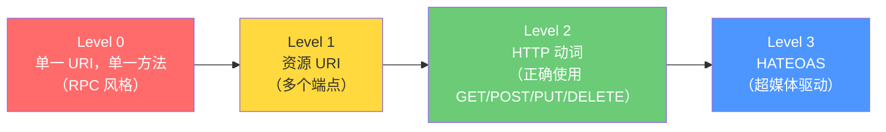
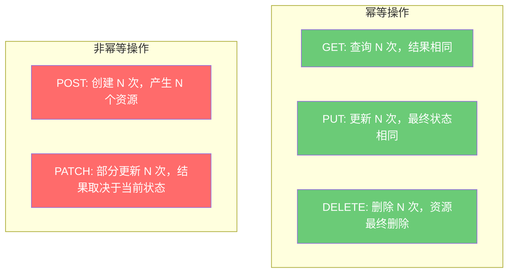

# API 设计规范

## ⭐ 面试重点速览

| 知识模块 | 重点内容 | 面试频率 |
|----------|----------|----------|
| RESTful 设计原则 | 资源导向、无状态、统一接口、表现层状态转移 | 极高 |
| URL 命名规范 | 名词复数、层级关系、避免动词、查询参数设计 | 极高 |
| HTTP 动词使用 | GET/POST/PUT/PATCH/DELETE 的语义与幂等性 | 极高 |
| 状态码选择 | 2xx/3xx/4xx/5xx 分类使用，常见错误码场景 | 高 |
| API 版本管理 | URL 路径（v1/v2）、请求头、查询参数三种策略对比 | 高 |
| 向后兼容原则 | 只加不减、字段宽容、默认值设计、废弃策略 | 高 |
| 错误码设计 | 业务错误码 vs HTTP 状态码、错误码结构设计 | 中高 |

---

## 一、RESTful 设计原则

### 1.1 Richardson 成熟度模型



::: tip 实际建议
绝大多数企业的 RESTful API 达到 **Level 2** 就足够了。Level 3（HATEOAS）虽然理论完美，但在实践中复杂度高、收益有限，很少有团队真正落地。
:::

### 1.2 RESTful 六大核心约束

| 约束 | 说明 | 实践意义 |
|------|------|----------|
| **客户端-服务端** | 关注点分离 | 前后端分离、移动端和 Web 端共享 API |
| **无状态** | 每个请求包含所有必要信息 | 服务端不保存客户端会话，方便水平扩展 |
| **可缓存** | 响应标记是否可缓存 | 合理使用 Cache-Control / ETag 减少请求 |
| **统一接口** | 资源标识、表述操作、自描述消息 | URL 定位资源、HTTP 动词操作资源 |
| **分层系统** | 客户端不知道是否直连服务端 | 可以引入网关、代理、CDN 而不影响客户端 |
| **按需代码**（可选） | 服务端可下发可执行代码 | 前端 JS 下载，较少被强调 |

---

## 二、URL 命名规范

### 2.1 基本原则

```
✅ 好的 URL 设计                        ❌ 不好的 URL 设计
─────────────────────────────────      ─────────────────────────────
GET    /api/v1/users                   GET    /api/getUserList
GET    /api/v1/users/123               GET    /api/getUser?id=123
POST   /api/v1/users                   POST   /api/createUser
PUT    /api/v1/users/123               POST   /api/updateUser
DELETE /api/v1/users/123               GET    /api/deleteUser?id=123
GET    /api/v1/users/123/orders        GET    /api/getUserOrders?userId=123
GET    /api/v1/orders?status=paid      GET    /api/getPaidOrders
```

### 2.2 命名规则清单

| 规则 | 说明 | 示例 |
|------|------|------|
| **名词复数** | 资源名使用名词复数形式 | `/users` 而非 `/user` 或 `/getUsers` |
| **层级关系** | 用 `/` 表达资源的层级归属 | `/users/123/orders` |
| **避免动词** | 动作通过 HTTP 方法表达 | `POST /orders` 而非 `/createOrder` |
| **小写+连字符** | URL 全部小写，单词间用 `-` 连接 | `/order-items` 而非 `/orderItems` |
| **避免文件后缀** | 不要暴露技术细节 | `/users` 而非 `/users.json` |
| **查询参数过滤** | `?` 后跟过滤、排序、分页参数 | `/orders?status=paid&page=1&size=20` |
| **避免深层嵌套** | 一般不超过 3 层 | `/a/b/c` 可以，`/a/b/c/d/e/f` 需要重构 |

::: danger 避免 RPC 风格的 URL
URL 描述的是**资源（名词）**，不是**动作（动词）**。以下反例是典型的 RPC 风格：
- `POST /api/activateUser` → 应改为 `PATCH /api/v1/users/123/status`，请求体 `{"status":"active"}`
- `POST /api/cancelOrder` → 应改为 `POST /api/v1/orders/123/cancellation`
- `GET /api/searchProducts` → 应改为 `GET /api/v1/products?q=keyword`
:::

---

## 三、HTTP 动词使用

### 3.1 标准动词映射

| 动词 | 语义 | 幂等性 | 安全性 | 示例 |
|------|------|--------|--------|------|
| **GET** | 查询资源 | 是 | 是 | `GET /users/123` |
| **POST** | 创建资源 | 否 | 否 | `POST /users` |
| **PUT** | 全量替换资源 | 是 | 否 | `PUT /users/123` |
| **PATCH** | 部分更新资源 | 否 | 否 | `PATCH /users/123` |
| **DELETE** | 删除资源 | 是 | 否 | `DELETE /users/123` |
| **HEAD** | 获取响应头 | 是 | 是 | `HEAD /users/123` |
| **OPTIONS** | 获取支持的 HTTP 方法 | 是 | 是 | `OPTIONS /users` |

::: warning PUT vs PATCH 的区别
- **PUT**：全量替换。客户端必须提供完整的资源表示，缺失的字段会被置为 null/默认值
- **PATCH**：部分更新。客户端只发送需要修改的字段，其余字段保持不变

实际项目中，超过 90% 的更新场景应该使用 **PATCH** 而非 PUT，因为前端很少能传回完整的资源对象。
:::

### 3.2 幂等性设计



::: danger 非幂等操作的风险
POST 创建操作如果不做幂等控制，网络重试会导致重复创建。推荐使用**客户端生成唯一 ID**（幂等键）来保证：同一笔业务操作传入相同的 `Idempotency-Key`，服务端识别并返回已有结果。
:::

---

## 四、HTTP 状态码

### 4.1 常用状态码速查

| 状态码 | 含义 | 使用场景 |
|--------|------|----------|
| **200 OK** | 请求成功 | GET 成功、PUT 成功更新 |
| **201 Created** | 资源创建成功 | POST 创建成功，响应头带 `Location` |
| **204 No Content** | 成功但无响应体 | DELETE 成功、PATCH 成功（不需要返回数据） |
| **301 Moved Permanently** | 永久重定向 | API 域名迁移 |
| **304 Not Modified** | 资源未修改 | 配合 ETag/Last-Modified 做缓存 |
| **400 Bad Request** | 请求参数错误 | 参数校验失败 |
| **401 Unauthorized** | 未认证 | Token 缺失或失效 |
| **403 Forbidden** | 无权限 | 已认证但权限不足 |
| **404 Not Found** | 资源不存在 | 查询的资源 ID 不存在 |
| **409 Conflict** | 资源冲突 | 并发修改冲突、重复创建 |
| **422 Unprocessable Entity** | 语义错误 | 参数格式正确但业务语义错误 |
| **429 Too Many Requests** | 请求限流 | 触发限流策略 |
| **500 Internal Server Error** | 服务端异常 | 未预期的系统错误 |
| **502 Bad Gateway** | 网关错误 | 上游服务不可达 |
| **503 Service Unavailable** | 服务不可用 | 服务熔断或正在维护 |
| **504 Gateway Timeout** | 网关超时 | 上游服务响应超时 |

### 4.2 常见错误选择

```java
// ❌ 统统返回 200，在响应体里区分成功失败
// { "code": 500, "message": "用户不存在" }
// 问题：网关、监控系统无法从 HTTP 层判断请求是否成功

// ✅ 正确：使用正确的 HTTP 状态码
// GET /users/99999 → 404 Not Found
// POST /users → 参数错误 → 400 Bad Request
// GET /users → 无 Token → 401 Unauthorized
```

::: warning 不要在响应体中重复 HTTP 状态码
错误响应体中不需要再写一个 `"httpStatus": 404`，因为 HTTP 响应本身已经包含了状态码。让 HTTP 层做它该做的事。
:::

---

## 五、API 版本管理

### 5.1 三种策略对比

| 策略 | 方式 | 优点 | 缺点 |
|------|------|------|------|
| **URL 路径版本** | `/api/v1/users`、`/api/v2/users` | 简单直观，方便调试和测试 | URL 不纯净，升级需要改路由 |
| **请求头版本** | `Accept: application/vnd.api.v1+json` | URL 干净，内容协商标准化 | 调试不便，缓存策略复杂 |
| **查询参数版本** | `/api/users?version=1` | 实现简单 | 污染查询参数，不 RESTful |

::: tip 推荐方案
**URL 路径版本**是业界最广泛采用的方案。虽然它在理论上不够"纯净"，但在实践中最容易理解、调试和运维。绝大多数互联网公司的公开 API 都使用这种方案（如 GitHub API v3/v4、Stripe API 等）。
:::

### 5.2 向后兼容原则

| 兼容类型 | 说明 | 是否安全 |
|----------|------|----------|
| **新增接口** | 添加新的 API 端点 | 安全，无需升级版本号 |
| **新增可选字段** | 请求/响应中添加非必填字段 | 安全 |
| **新增必填字段** | 请求中添加必填字段 | **破坏性变更，需升级版本号** |
| **删除字段** | 删除响应中的字段 | **破坏性变更，需升级版本号** |
| **修改字段类型** | String → Integer | **破坏性变更，需升级版本号** |
| **修改字段语义** | 字段含义/取值范围改变 | **破坏性变更，需升级版本号** |
| **修改 URL 结构** | 改变资源路径 | **破坏性变更，需升级版本号** |

::: danger 向后兼容铁律
**只加不减，只宽不严**：
- 只能添加新字段，不删除已有字段
- 只能放宽校验规则（如从 10 字符放宽到 50 字符），不能收紧
- 新增字段必须设置合理的默认值，避免老客户端收到 null
:::

---

## 六、错误码设计

### 6.1 错误响应结构

```json
{
  "error": {
    "code": "ORDER_INSUFFICIENT_INVENTORY",
    "message": "库存不足",
    "details": [
      {
        "field": "items[0].quantity",
        "reason": "请求数量 100 超过可用库存 30"
      }
    ],
    "traceId": "a1b2c3d4-e5f6-7890-abcd-ef1234567890"
  }
}
```

### 6.2 错误码设计原则

| 原则 | 说明 |
|------|------|
| **语义化** | 错误码表达业务含义，如 `INSUFFICIENT_BALANCE` 而非 `ERR_001` |
| **分层设计** | `模块_错误类型`，如 `ORDER_INSUFFICIENT_INVENTORY`、`PAYMENT_TIMEOUT` |
| **唯一性** | 每个错误码全局唯一，方便监控告警精确定位 |
| **可追溯** | 返回 traceId，关联日志系统做全链路排查 |
| **用户友好** | message 字段面向终端用户（可国际化），details 面向开发者 |

### 6.3 错误码分层示例

```
AUTH_*         认证相关：    AUTH_TOKEN_EXPIRED, AUTH_PERMISSION_DENIED
USER_*         用户相关：    USER_NOT_FOUND, USER_EMAIL_DUPLICATE
ORDER_*        订单相关：    ORDER_INSUFFICIENT_INVENTORY, ORDER_STATUS_INVALID
PAYMENT_*      支付相关：    PAYMENT_INSUFFICIENT_BALANCE, PAYMENT_CHANNEL_UNAVAILABLE
SYSTEM_*       系统级：      SYSTEM_RATE_LIMITED, SYSTEM_SERVICE_UNAVAILABLE
```

---

## ⭐ 面试高频问题汇总

### Q1：什么是 RESTful API？它的核心原则是什么？

REST（Representational State Transfer，表现层状态转移）是一种架构风格，核心原则：

1. **资源导向**：URL 代表资源（名词），HTTP 方法代表操作（动词）
2. **无状态**：每个请求包含理解该请求所需的所有信息，服务端不保存客户端上下文
3. **统一接口**：通过标准的 HTTP 方法（GET/POST/PUT/PATCH/DELETE）操作资源
4. **表现层**：资源可以有多种表示形式（JSON、XML），客户端通过 Accept 头协商
5. **分层系统**：客户端不知道是直连服务端还是经过了中间层（网关、代理、CDN）

实际开发中，大多数团队遵循的是"RESTful 风格"而非严格的 REST。

### Q2：PUT 和 PATCH 的区别是什么？什么时候用哪个？

- **PUT**：全量替换。客户端必须提供资源的**完整表示**。例如 `PUT /users/123` 需要提供用户的所有字段，缺失字段会被置为 null。PUT 是幂等的。
- **PATCH**：部分更新。客户端只提供需要修改的字段，其余保持不变。例如只修改邮箱就只传 `{"email":"new@email.com"}`。PATCH 不一定是幂等的。

实际项目中推荐优先使用 **PATCH**，因为前端很少能持有完整的资源对象。PUT 更适合配置文件替换等少数场景。

### Q3：如何处理 API 的向后兼容性？什么时候必须升级大版本？

**保持兼容的做法**（不需要升级版本号）：
- 新增接口
- 响应 JSON 中添加新字段（老客户端忽略即可）
- 请求中添加可选参数（带默认值）
- 放宽校验规则

**必须升级大版本的情况**：
- 删除或重命名字段
- 修改字段的数据类型
- 修改字段的业务语义
- 将可选参数改为必填
- 修改 URL 结构

核心原则：**只加不减，只宽不严，宽进严出**。

### Q4：API 版本管理的主流方案有哪些？你的推荐是什么？

三种主流方案：

1. **URL 路径版本**（`/api/v1/users`）：最常用，简单直观，便于调试和网关路由。推荐。
2. **请求头版本**（`Accept: application/vnd.api.v1+json`）：标准做法，但调试不便，缓存策略复杂。
3. **查询参数版本**（`/api/users?version=1`）：不推荐，污染查询参数，破坏 RESTful 风格。

推荐 URL 路径版本，它是业界主流（GitHub、Stripe、Twilio 等都用这种方式）。

### Q5：如何设计错误码体系？

1. **分层命名**：使用 `模块_错误类型` 的语义化命名（如 `ORDER_INSUFFICIENT_INVENTORY`），而非无意义的数字编码
2. **HTTP 状态码 + 业务错误码双轨制**：HTTP 状态码表达请求层面的结果（4xx/5xx），业务错误码表达领域层面的错误
3. **返回 traceId**：关联分布式链路追踪，方便问题定位
4. **userMessage vs devMessage**：面向用户的消息（可国际化）和面向开发者的调试信息分开
5. **错误码全局唯一**：便于在监控和告警系统中精确定位错误来源

### Q6：POST 创建操作如何实现幂等性？

POST 本身不是幂等的，但可以通过以下方式实现：

1. **客户端生成幂等键**：请求头携带 `Idempotency-Key: <uuid>`
2. **服务端存储幂等键**：以幂等键为 key 缓存首次请求的响应结果（通常缓存 24 小时）
3. **重复请求识别**：收到带相同幂等键的请求时，直接返回缓存的响应，不重复执行业务逻辑
4. **幂等键唯一性**：通常使用 `用户ID + 业务场景 + 时间窗口` 作为幂等键的组成

这在支付、下单等场景中极其重要，防止网络重试导致重复扣款。

---

::: info 相关模块
- [微服务架构全景](./index.md) — 架构演进与适用场景
- [Spring Cloud Gateway 网关](../spring-cloud/gateway.md) — API 网关统一入口
- [OpenFeign 远程调用](../spring-cloud/openfeign.md) — 声明式 HTTP 客户端
- [Spring Security 认证鉴权](../spring-security/index.md) — API 安全设计
:::