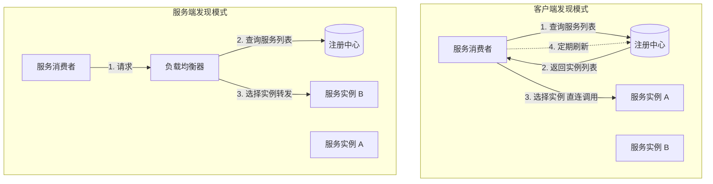
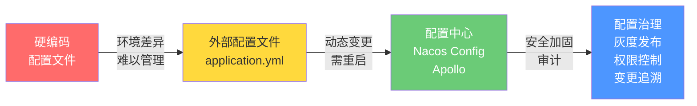
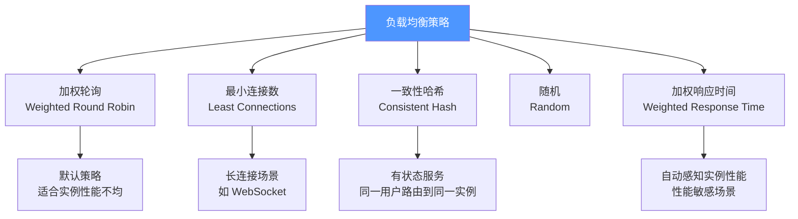
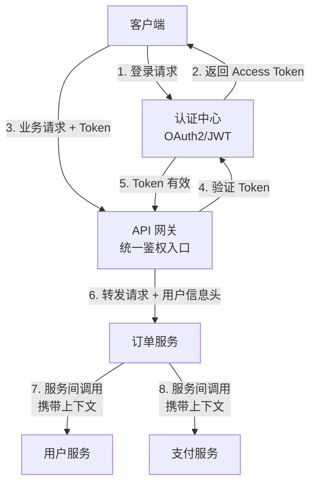
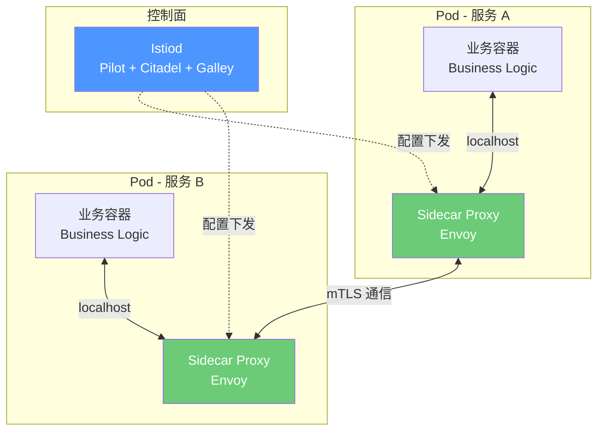

# 服务治理

## ⭐ 面试重点速览

| 知识模块 | 重点内容 | 面试频率 |
|----------|----------|----------|
| 注册发现 | 服务注册、心跳保活、健康检查、服务发现模式（客户端 vs 服务端） | 极高 |
| 配置管理 | 配置中心核心能力、动态刷新原理、配置灰度、环境隔离 | 极高 |
| 流量管理 | 负载均衡策略、限流算法、熔断降级、灰度发布/蓝绿部署 | 极高 |
| 认证鉴权 | 微服务认证方案对比（Session/Token/JWT/OAuth2）、SSO 单点登录 | 高 |
| Service Mesh | Sidecar 模式、Istio 架构、控制面 vs 数据面、流量治理下沉 | 极高 |
| 治理演进 | 从 SDK 内嵌到 Sidecar 外挂的演进路径 | 中高 |

---

## 一、服务注册与发现

### 1.1 服务发现的两种模式

| 模式 | 代表技术 | 优点 | 缺点 |
|------|----------|------|------|
| 客户端发现 | Nacos / Eureka + Ribbon/LoadBalancer | 无单点，性能好 | 客户端需嵌入发现逻辑 |
| 服务端发现 | K8s Service + kube-proxy / AWS ALB | 客户端无感知 | 负载均衡器可能成为瓶颈 |

::: tip Spring Cloud 的选择
Spring Cloud 使用的是**客户端发现**模式。Nacos Server 负责注册中心，Spring Cloud LoadBalancer（替代 Ribbon）集成在客户端，由客户端自己实现负载均衡逻辑。技术实现详见 [服务注册与发现](../spring-cloud/registry.md)。
:::

### 1.2 注册中心核心能力

| 能力 | 说明 |
|------|------|
| **服务注册** | 服务启动时向注册中心登记自己的 IP、端口、元数据 |
| **服务发现** | 服务消费者从注册中心获取可用实例列表 |
| **健康检查** | 定期检测实例是否存活（心跳 / 主动探测） |
| **服务下线** | 实例停止时主动注销，或超时后被动剔除 |
| **元数据管理** | 支持自定义元数据（版本、机房、灰度标签等） |
| **保护机制** | 网络抖动时避免大量实例被误剔除（自我保护阈值） |

---

## 二、配置管理

### 2.1 配置中心的演进

### 2.2 配置中心核心能力

| 能力 | 说明 | 实现方式 |
|------|------|----------|
| **动态刷新** | 配置变更后无需重启即可生效 | `@RefreshScope` + 长轮询 / 事件推送 |
| **环境隔离** | 开发/测试/生产环境配置隔离 | Namespace / Profile |
| **版本管理** | 配置变更历史可追溯、可回滚 | 配置快照 + 回滚能力 |
| **灰度发布** | 部分实例先使用新配置，验证后再全量 | 配置标签 + 实例分组 |
| **权限控制** | 敏感配置（密码、密钥）的读写权限 | RBAC + 配置加密 |

::: warning 配置中心必须解决的三个问题
1. **可靠送达**：配置变更必须可靠推送到所有实例，不能丢失
2. **一致性**：同一集群内的实例配置必须一致，避免"部分实例更新"带来的诡异问题
3. **高可用**：配置中心本身不能成为单点。Nacos 集群模式 + 内置 Derby/MySQL 存储是高可用基础
:::

---

## 三、流量管理

### 3.1 负载均衡策略

### 3.2 限流策略

| 算法 | 原理 | 特点 | 适用场景 |
|------|------|------|----------|
| **固定窗口** | 统计固定时间窗口内的请求数 | 实现简单，但存在临界突刺 | 简单场景 |
| **滑动窗口** | 统计滑动时间窗口内的请求数 | 平滑度优于固定窗口 | 需要平滑限流 |
| **漏桶** | 请求入桶，固定速率流出 | 强制平滑，不允许突发 | 需要严格平滑速率 |
| **令牌桶** | 固定速率放令牌，请求消耗令牌 | 允许突发（桶满时） | 通用场景（推荐） |

::: tip 令牌桶是工程首选
令牌桶兼顾了平滑限流和突发处理能力，是绝大多数场景的最佳选择。Sentinel 的限流实现（详见 [Sentinel 服务保障](../spring-cloud/sentinel.md)）和 Gateway 的 RequestRateLimiter 底层都是令牌桶算法。
:::

### 3.3 发布策略

| 策略 | 原理 | 回滚速度 | 适用场景 |
|------|------|----------|----------|
| **滚动发布** | 逐个替换旧实例 | 中等 | 常规发布 |
| **蓝绿部署** | 同时运行两套环境，切换流量 | 极快（秒级） | 核心服务 |
| **金丝雀发布** | 一小部分流量先走新版本 | 极快 | 验证新版本稳定性 |
| **A/B 测试** | 按用户维度分流 | 极快 | 产品实验 |

---

## 四、认证鉴权

### 4.1 微服务认证方案对比

| 方案 | 原理 | 优点 | 缺点 |
|------|------|------|------|
| **Session-Cookie** | 服务端保存会话 | 简单、服务端可控 | 不支持水平扩展、跨域困难 |
| **Token（无状态）** | 客户端携带 Token，服务端校验 | 无状态、易扩展 | Token 泄露风险 |
| **JWT** | Token 内嵌用户信息和过期时间 | 自包含、无需查库 | 无法主动失效、Payload 可能过大 |
| **OAuth2 + JWT** | 第三方授权 + JWT 承载凭证 | 标准化、支持多种授权模式 | 理解和实现成本高 |

### 4.2 微服务认证架构

::: danger 不要在微服务间传递原始密码
服务间认证应该使用**服务间 Token** 或 **mTLS**，而非用户凭证。每个服务都去认证中心验证 Token 会形成认证中心热点，推荐在网关层统一鉴权，下游服务信任网关传递的用户信息头（前提是内网安全）。
:::

---

## 五、Service Mesh 简介

### 5.1 Sidecar 模式核心思想

### 5.2 Service Mesh vs SDK 内嵌

| 维度 | SDK 内嵌（Spring Cloud） | Service Mesh（Istio） |
|------|--------------------------|----------------------|
| **治理位置** | 应用进程内（代码级） | Sidecar 进程（基础设施层） |
| **语言绑定** | Java 专属 | 多语言支持 |
| **升级方式** | 升级依赖 → 重新部署 | 升级 Sidecar（业务无感知） |
| **性能开销** | 无额外网络跳转 | 多一跳（业务 → Sidecar → 目标 Sidecar → 目标业务） |
| **调试复杂度** | 低（都在代码里） | 高（出问题要排查 Sidecar） |
| **学习曲线** | 中等 | 高 |
| **适用场景** | Java 为主的中小规模集群 | 多语言、大规模、平台化治理 |

::: tip 什么时候该上 Service Mesh？
1. 公司技术栈多元化（Java + Go + Python + Node.js）
2. 需要统一的流量治理能力（不需要每个语言写一套限流熔断）
3. 平台工程团队希望治理能力下沉到基础设施，业务团队零关注
4. 已有成熟的 K8s 基础设施和运维能力

如果团队只有 Java 技术栈且规模在 50 个服务以内，Spring Cloud 是更务实的选择。
:::

---

## ⭐ 面试高频问题汇总

### Q1：客户端发现模式和服务端发现模式有什么区别？Spring Cloud 用的是哪种？

**客户端发现**：服务消费者直接从注册中心查询服务列表，自己选择实例并直连调用。没有中间代理，性能好，但客户端需要集成服务发现逻辑。Spring Cloud 使用此模式（Nacos + Spring Cloud LoadBalancer）。

**服务端发现**：服务消费者通过一个负载均衡器（如 K8s Service、AWS ALB）调用服务，负载均衡器从注册中心查询实例列表并转发请求。客户端完全无感知，但负载均衡器可能成为瓶颈。

### Q2：配置中心如何实现动态刷新？Nacos Config 的刷新原理是什么？

Nacos Config 的动态刷新基于以下机制：

1. **长轮询（Long Polling）**：客户端向 Nacos 服务端发起配置查询请求，服务端持有连接 30 秒。如果期间配置有变更，立即返回新配置；如果无变更，30 秒后返回空并让客户端重新发起
2. **Spring Cloud 集成**：`@RefreshScope` 注解的 Bean 在收到 RefreshEvent 事件后，会销毁并重新创建
3. **完整链路**：Nacos Server 配置变更 → 推送通知客户端 → 客户端发布 RefreshEvent → @RefreshScope Bean 重建 → 新配置生效

### Q3：JWT 和传统 Session 认证在微服务架构中哪个更好？

JWT 更适合微服务架构，原因：

1. **无状态**：JWT 自包含用户信息，每个服务可以独立验证，不需要去认证中心查询 Session。避免了认证中心成为性能热点
2. **跨服务传递**：服务间调用时可以直接传递 JWT，目标服务验证 JWT 即可获取用户身份
3. **跨语言**：JWT 是标准化的 JSON，任何语言都有解析库

JWT 的主要缺点是**无法主动失效**（服务端无法主动踢出用户），需要通过短过期时间 + Refresh Token 或黑名单机制来缓解。

### Q4：什么是 Service Mesh？Istio 的架构是什么？

Service Mesh 是将微服务通信治理能力从**应用层下沉到基础设施层**的架构模式。

Istio 的核心架构：
- **数据面（Data Plane）**：Sidecar 代理（Envoy），以 Sidecar 模式部署在每个 Pod 中，拦截所有进出流量
- **控制面（Control Plane）**：Istiod，负责服务发现、配置管理、证书分发。包含：
  - Pilot：服务发现和流量管理配置
  - Citadel：证书管理和 mTLS
  - Galley：配置验证和分发

业务代码只需访问 `localhost`，Envoy 负责负载均衡、重试、熔断、限流、mTLS 等所有通信治理。

### Q5：灰度发布（金丝雀发布）如何实现？

核心技术方案：

1. **服务实例打标签**：为新版本实例打上 `version: v2` 的元数据标签，注册到注册中心
2. **流量染色**：网关根据请求特征（Header、Cookie、用户 ID 哈希）决定路由到 v1 还是 v2
3. **按比例分流**：配置路由规则为 `v1: 90%, v2: 10%`，观察 v2 的错误率和延迟
4. **逐步切换**：验证通过后逐步调大 v2 的流量比例：10% → 30% → 50% → 100%
5. **快速回滚**：一旦 v2 异常，立即将流量切回 v1

在 Spring Cloud 方案中，可以通过 Nacos 元数据 + Gateway 路由谓词实现；在 Service Mesh 方案中，通过 Istio VirtualService + DestinationRule 实现。

### Q6：微服务架构中，服务间调用的认证如何设计？

三层认证体系：

1. **边缘认证**：API 网关统一验证用户 Token（JWT），拒绝非法请求
2. **用户身份传递**：网关将解析出的用户信息注入请求头（如 `X-User-Id`、`X-User-Role`），下游服务信任这些头信息（前提是内网隔离，外部无法直接访问服务）
3. **服务间认证**：服务间调用使用 mTLS（双向 TLS）或服务间 Token，确保只有授权的服务才能调用

这样设计的好处：认证逻辑集中在网关，下游服务只关心授权（权限校验），不重复做认证。

---

::: info 相关模块
- [服务注册与发现](../spring-cloud/registry.md) — Nacos 注册中心技术实现
- [配置中心](../spring-cloud/config.md) — Nacos Config 动态刷新
- [API 网关](../spring-cloud/gateway.md) — Gateway 统一入口和鉴权
- [Sentinel 服务保障](../spring-cloud/sentinel.md) — 限流、熔断、降级
- [负载均衡](../spring-cloud/loadbalance.md) — Spring Cloud LoadBalancer 策略
- [Spring Security 认证鉴权](../spring-security/index.md) — OAuth2 / JWT 实现
- 高并发架构（high-concurrency/） — 流量管控与弹性伸缩
:::