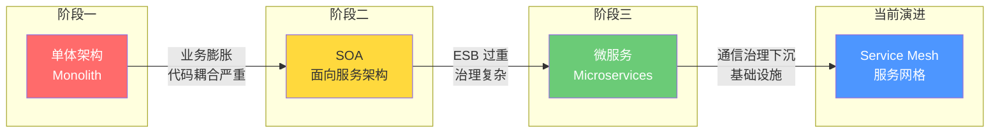
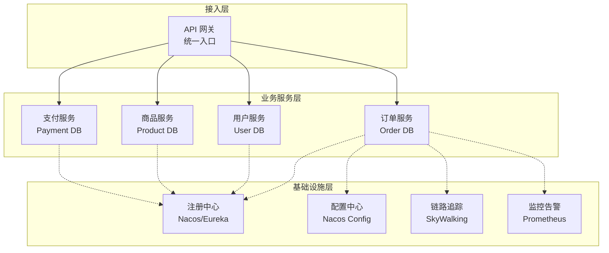

# 微服务架构全景

## ⭐ 面试重点速览

| 知识模块 | 重点内容 | 面试频率 |
|----------|----------|----------|
| 架构演进路径 | 单体 → SOA → 微服务，每个阶段的痛点和驱动力 | 极高 |
| 微服务核心特征 | 独立部署、去中心化治理、围绕业务组织、数据隔离 | 极高 |
| 优点与代价 | 敏捷性、可扩展性、技术异构 vs 分布式复杂度、运维成本 | 极高 |
| 适用场景判断 | 业务复杂度、团队规模、交付速度要求、技术储备四维评估 | 高 |
| 何时不用微服务 | 初创项目、简单 CRUD、团队能力不足、基础设施不健全 | 高 |
| 常见反模式 | 分布式单体、数据大杂烩、粒度不当、技术栈碎片化 | 中高 |
| 微服务成熟度模型 | 从入门到深水区的演进路线图 | 中 |

---

## 一、架构演进：从单体到微服务

### 1.1 演进历程全景



### 1.2 单体架构阶段

**特征**：所有功能模块打包在一个应用进程中，共享同一个数据库。

```
┌────────────────────────────────────────┐
│          单体应用 (WAR/JAR)              │
│  ┌──────┐ ┌──────┐ ┌──────┐ ┌──────┐  │
│  │ 订单  │ │ 用户  │ │ 商品  │ │ 支付  │  │
│  │Module│ │Module│ │Module│ │Module│  │
│  └──────┘ └──────┘ └──────┘ └──────┘  │
│           ┌────────────────┐           │
│           │   共享数据库     │           │
│           └────────────────┘           │
└────────────────────────────────────────┘
```

::: tip 单体架构并非一无是处
单体架构在项目初期具有开发效率高、部署简单、调试方便的优势。许多成功的项目都是从单体起步的。问题在于**业务膨胀到一定程度后**，单体架构的弊端开始显现。
:::

**单体的痛点**：

| 痛点 | 表现 |
|------|------|
| 代码耦合 | 修改订单模块可能影响用户模块，牵一发而动全身 |
| 部署瓶颈 | 改一行代码需要全量构建和部署，CI/CD 时间越来越长 |
| 扩展困难 | 不能按模块独立扩缩容，商品模块的流量高峰需要整体扩容 |
| 技术锁定 | 全项目绑定同一技术栈，难以针对不同场景选择最优工具 |
| 团队协作 | 多人修改同一代码库，合并冲突频繁，迭代速度下降 |

### 1.3 SOA 阶段

SOA（Service-Oriented Architecture）尝试通过 ESB（企业服务总线）将系统拆分为独立服务。

```
┌──────────────────────────────────────────────────────────┐
│                    ESB（企业服务总线）                       │
│          ┌─────────────────────────────────┐             │
│          │  消息路由 / 协议转换 / 数据格式转换  │             │
│          └─────────────────────────────────┘             │
│        ↙       ↓        ↓        ↓        ↘              │
│  ┌────────┐┌────────┐┌────────┐┌────────┐┌────────┐    │
│  │订单服务││用户服务││商品服务││支付服务││库存服务│    │
│  └────────┘└────────┘└────────┘└────────┘└────────┘    │
└──────────────────────────────────────────────────────────┘
```

::: warning SOA 的致命缺陷
ESB 成为整个系统的**单点瓶颈**和**治理黑洞**。所有服务间通信都经过 ESB，ESB 挂了全系统瘫痪。此外，SOA 强调组织级的服务复用，往往导致服务粒度太粗。SOA 的重型协议（SOAP/WS-*）也是开发者的一大痛点。
:::

### 1.4 微服务架构

微服务继承了 SOA 的服务化思想，但摒弃了重型 ESB，采用**轻量级通信**（HTTP/REST、gRPC）和**去中心化治理**。



---

## 二、微服务的核心特征

| 特征 | 说明 |
|------|------|
| **组件化，而非库化** | 服务是独立可部署的组件，而非代码层面的库 |
| **围绕业务能力组织** | 康威定律：系统架构反映组织沟通结构 |
| **产品而非项目** | 团队对服务的全生命周期负责（你构建，你运维） |
| **智能端点，哑管道** | 服务本身有完整的业务逻辑，通信管道只负责传输 |
| **去中心化治理** | 每个服务可以选择最适合的技术栈 |
| **去中心化数据管理** | 每个服务拥有自己的数据库，数据隔离 |
| **基础设施自动化** | CI/CD、自动化测试、容器化部署是微服务的先决条件 |
| **容错设计** | 拥抱失败，假设服务随时可能出问题 |
| **演进式设计** | 服务可以被独立替换或废弃 |

::: danger 微服务不是银弹
微服务解决的**是组织架构和团队协作的问题**，而非技术问题。如果你的团队只有 5 个人，引入微服务会**增加**而非减少你的工作量。微服务本质上是用**运维复杂度换取开发敏捷性**的权衡。
:::

---

## 三、何时使用微服务？

### 3.1 适用场景（四维评估模型）

| 评估维度 | 适合微服务 | 不适合微服务 |
|----------|-----------|-------------|
| **业务复杂度** | 多业务领域，逻辑差异大 | 简单 CRUD，业务变化少 |
| **团队规模** | 多团队（>20 人）并行开发 | 小团队（<10 人） |
| **交付速度** | 需要独立迭代、快速试错 | 发布周期长，无快速迭代诉求 |
| **技术储备** | 具备 DevOps、容器化、监控能力 | 缺乏基础设施和运维能力 |

### 3.2 明确不建议用微服务的场景

1. **项目处于 0→1 阶段**：需求不确定，架构在快速演化，此时微服务的高成本会拖慢验证速度
2. **简单的内部管理系统**：数十张表的 CRUD 系统，单体 + 水平扩展足够
3. **强事务一致性场景**：跨服务分布式事务是微服务最大的痛点之一，如果业务强依赖 ACID，三思
4. **团队缺乏 DevOps 能力**：没有自动化 CI/CD、容器化、监控体系的团队做微服务等于灾难
5. **性能极度敏感场景**：服务间网络调用带来的延迟在部分金融交易场景中不可接受

### 3.3 演进策略：绞杀者模式

逐步从单体中剥离功能，而非一次性大爆炸式重写：


---

## 四、微服务的代价与挑战

| 挑战 | 详情 |
|------|------|
| **分布式复杂度** | 网络不可靠、延迟、分布式事务、数据一致性 |
| **运维成本** | 需要容器编排（K8s）、CI/CD 流水线、统一监控 |
| **调试难度** | 一个请求跨越多个服务，需链路追踪定位问题 |
| **数据一致性** | 放弃 ACID，拥抱最终一致性，需要补偿机制 |
| **服务间通信** | 网络开销、序列化/反序列化、超时重试策略 |
| **测试复杂度** | 需要契约测试、端到端测试、Mock 多服务依赖 |
| **版本兼容** | 多服务独立演进带来的 API 版本管理问题 |

---

## 五、微服务成熟度模型

| 等级 | 特征 | 关键能力 |
|------|------|----------|
| **L1：起步** | 简单拆分，手工部署 | 服务拆分原则、API 定义 |
| **L2：标准化** | 统一框架，自动化构建 | CI/CD、容器化、注册发现 |
| **L3：可观测** | 全链路监控、日志聚合 | 链路追踪、指标监控、告警 |
| **L4：自愈** | 熔断降级、自动扩缩容 | 限流、熔断、弹性伸缩 |
| **L5：服务网格** | 通信下沉 Sidecar，业务零侵入 | Service Mesh、可观测性标准化 |

---

## ⭐ 面试高频问题汇总

### Q1：单体架构 vs 微服务架构的核心区别是什么？

核心区别在于**部署单元**和**数据管理**：

- **单体**：所有功能打包在同一进程，共享数据库；部署一次更新全部；扩展只能整体扩展
- **微服务**：每个服务独立进程、独立数据库、独立部署、独立扩缩容

这不是技术优劣之分，而是**业务复杂度达到一定阈值后的自然选择**。单体架构适合不确定性高、变化快的早期项目；微服务适合业务稳定、多团队并行的大型系统。

### Q2：什么是"分布式单体"？如何避免？

**分布式单体**是指：虽然系统在物理上拆分成了多个微服务，但逻辑上仍然高度耦合——服务之间必须同步调用、必须同时部署、必须共享数据库。

**避免策略**：
1. 服务拥有自己的数据库，禁止跨服务直接访问数据库
2. 使用异步消息解耦服务间依赖（事件驱动架构）
3. 定义清晰的 API 契约，允许向后兼容的独立演进
4. 每个服务可以独立部署，不要求"全量同步上线"

### Q3：微服务架构中最难解决的三个问题是什么？

1. **分布式数据一致性**：跨服务事务无法使用单体数据库的 ACID 事务，必须依赖 Saga、TCC 等最终一致性方案。这是微服务最根本的挑战。

2. **服务间通信的可靠性**：网络是不可靠的，需要有超时、重试、熔断、降级等完整的容错机制。一个服务挂了不能导致雪崩。

3. **可观测性**：一个请求可能跨越 10+ 个服务，没有统一的链路追踪、日志聚合和指标监控，问题定位如同大海捞针。

### Q4：SOA 和微服务有什么区别？

| 维度 | SOA | 微服务 |
|------|-----|--------|
| 通信方式 | 重型 SOAP/WS-*，通过 ESB | 轻量级 HTTP/REST、gRPC |
| 数据管理 | 通常共享数据库 | 每个服务独立数据库 |
| 服务粒度 | 较粗，面向企业级复用 | 较细，面向单一职责 |
| 治理方式 | 集中式 ESB 治理 | 去中心化治理 |
| 技术栈 | 通常统一技术栈 | 允许多语言、多框架 |
| 部署 | 经常一起部署 | 独立部署 |

SOA 的 ESB 是最大的问题——它变成了瓶颈和单点。微服务则选择"智能端点、哑管道"。

### Q5：公司有一个运行 5 年的单体应用，业务增长快、部署频率越来越高、合并冲突严重。你会如何推动微服务化改造？

采用**绞杀者模式（Strangler Fig Pattern）**逐步迁移：

1. **评估阶段**：识别单体中的模块边界，确定迁移优先级（边缘模块先行，核心模块最后）
2. **基础设施准备**：搭建 CI/CD、容器化平台、注册中心、配置中心、监控体系 —— 这一步必须在代码迁移前完成
3. **剥离边缘模块**：选择对核心流程依赖最少的模块（如消息通知、报表），用 API 网关将流量切换到新服务
4. **逐步剥离核心模块**：按业务领域逐个迁移，新功能直接在新服务开发
5. **下线旧代码**：当流量全部切换后，删除单体中的旧代码

关键原则：**渐进式迁移，每一步都可回退**。不要一次性重写，那是灾难。

### Q6：什么信号意味着你的系统需要从单体演进到微服务？

1. **团队协作瓶颈**：多个团队修改同一代码库，合并冲突已成为日常
2. **部署耦合**：改一行文案需要全量回归测试 + 全量部署
3. **扩展不均**：不同模块的流量差异巨大，但只能整体扩缩容
4. **技术债累积**：不同模块对技术栈的需求已经分化，但受限于统一技术栈
5. **故障爆炸半径大**：一个非核心模块的内存泄漏导致整个系统瘫痪

---

::: info 相关模块
- [Spring Cloud 技术实现](../spring-cloud/index.md) — Nacos、Gateway、Sentinel、Seata 等
- 分布式理论（middleware/distributed-system/） — CAP、BASE、一致性协议
- 高并发架构（high-concurrency/） — 限流、降级、熔断策略
- 监控告警（high-concurrency/monitoring-alerting/） — Prometheus + Grafana 体系
:::