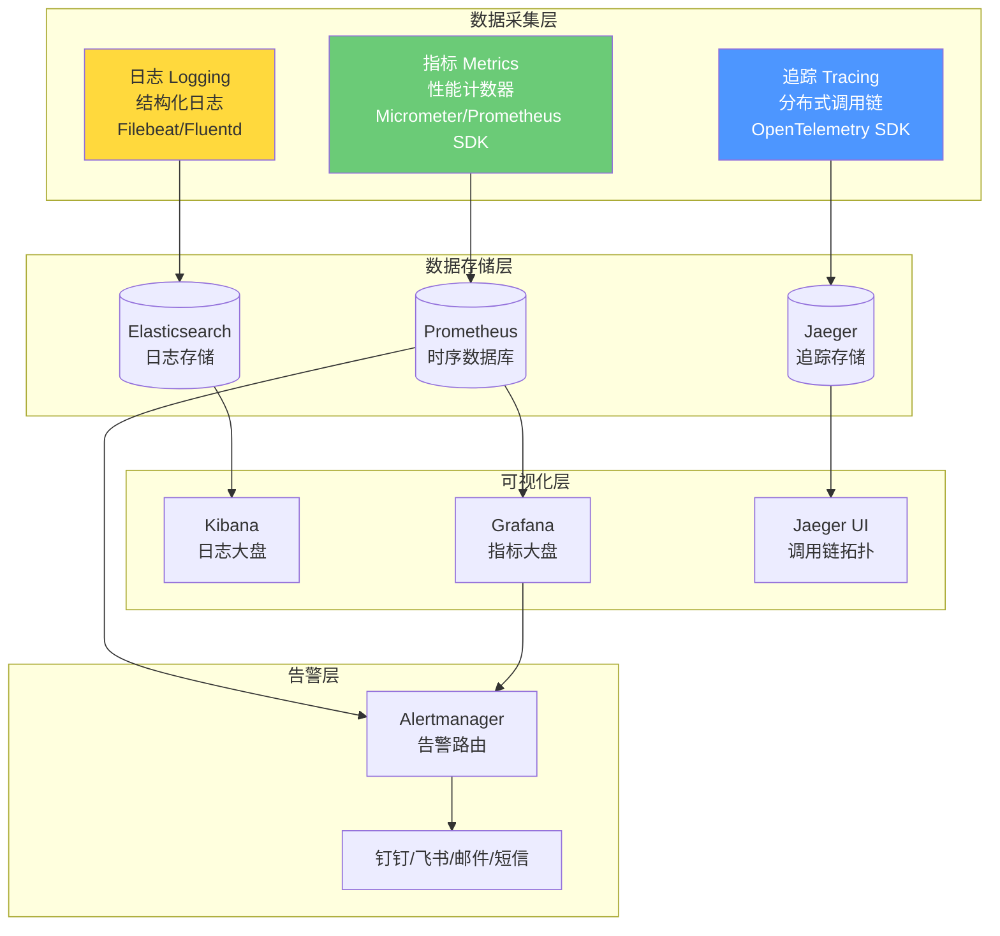
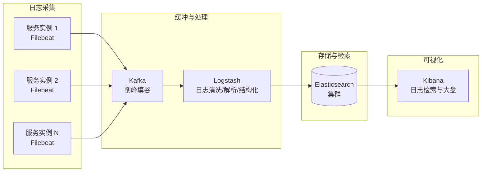
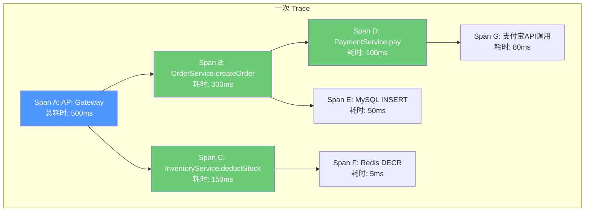
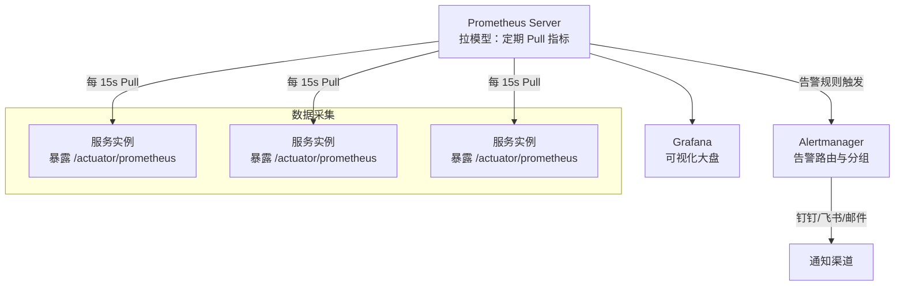

# 可观测性

## ⭐ 面试重点速览

| 知识模块 | 重点内容 | 面试频率 |
|----------|----------|----------|
| 三大支柱 | 日志（Logging）、指标（Metrics）、追踪（Tracing）的定义与协作 | 极高 |
| 日志聚合 ELK | Elasticsearch + Logstash + Kibana 架构，日志采集、存储、检索 | 极高 |
| 分布式追踪 | Jaeger / SkyWalking 架构，Trace / Span 概念，OpenTelemetry 标准 | 极高 |
| 指标监控 | Prometheus 拉模型、Metric 类型（Counter/Gauge/Histogram/Summary） | 极高 |
| 告警策略 | RED 方法 vs USE 方法、告警分级、告警抑制、告警升级 | 高 |
| 可观测性 vs 监控 | 概念差异：已知未知 vs 未知未知 | 中 |
| OpenTelemetry | 统一可观测性标准，告别厂商锁定 | 中高 |

---

## 一、三大支柱：日志、指标、追踪

### 1.1 可观测性全景



### 1.2 三大支柱对比

| 维度 | 日志（Logging） | 指标（Metrics） | 追踪（Tracing） |
|------|---------------|----------------|----------------|
| **核心问题** | 发生了什么？ | 量有多大？趋势如何？ | 调用经过了哪些服务？哪里慢了？ |
| **数据粒度** | 细（事件级） | 粗（聚合级） | 中（请求链路级） |
| **存储成本** | 高（全量存储） | 低（聚合数据） | 中（采样存储） |
| **典型工具** | ELK（ES + Logstash + Kibana） | Prometheus + Grafana | Jaeger / SkyWalking / Zipkin |
| **查询效率** | 慢（全文检索） | 快（时序数据） | 中（按 TraceID 检索） |
| **Java 集成** | logback → Filebeat → ES | Micrometer → Prometheus | OpenTelemetry / SkyWalking Agent |

::: tip 可观测性 vs 传统监控
**传统监控**关注"已知的未知"——你知道哪些指标可能出问题（CPU、内存、QPS），提前设置阈值。**可观测性**关注"未知的未知"——你不需要提前预判所有问题，而是通过丰富的遥测数据，在问题发生时能快速探索和定位根因。可观测性是监控的超集。
:::

---

## 二、日志聚合：ELK 技术栈

### 2.1 ELK 架构



::: warning 为什么需要 Kafka？
当服务数量达到数十甚至上百时，日志量会非常大。Kafka 作为中间的缓冲层有三个作用：

1. **削峰填谷**：日志写入量波动大时，Kafka 吸收瞬时高峰，保护 ES
2. **解耦**：采集端和消费端独立扩缩容，互不影响
3. **多消费者**：同一份日志可以被多个消费者使用（ELK + 实时告警 + 离线分析）
:::

### 2.2 日志规范

| 规范 | 说明 | 示例 |
|------|------|------|
| **结构化日志** | 使用 JSON 格式，而非纯文本 | `{"level":"ERROR","message":"订单创建失败","traceId":"xxx","orderId":"123"}` |
| **TraceId 贯穿** | 每条日志必须带 traceId | 关联分布式追踪，串联整个调用链 |
| **关键字段统一** | timestamp、level、service、instance、traceId、spanId | 便于跨系统检索 |
| **敏感信息脱敏** | 手机号、身份证、密码等 | `mobile: "138****1234"` |
| **避免大字段** | 单条日志控制在合理大小 | 不打印完整的请求/响应体，只记录关键摘要 |

```java
// 结构化日志示例
log.error("订单创建失败",
    kv("orderId", orderId),
    kv("userId", userId),
    kv("amount", amount),
    kv("errorCode", "INSUFFICIENT_INVENTORY"),
    kv("traceId", MDC.get("traceId"))  // 从 MDC 中获取
);
```

---

## 三、分布式追踪

### 3.1 核心概念



| 概念 | 说明 |
|------|------|
| **Trace** | 一次完整的请求调用链，由一个全局唯一的 TraceID 标识 |
| **Span** | 一次原子操作（RPC 调用、DB 查询、本地方法），是 Trace 的基本单元 |
| **SpanContext** | 在服务间传递的上下文，包含 TraceID、SpanID、Baggage |
| **Parent Span** | 发起调用的父操作 |
| **Child Span** | 被调用的子操作 |

### 3.2 SkyWalking vs Jaeger 对比

| 维度 | SkyWalking | Jaeger |
|------|-----------|--------|
| **开发方** | Apache 基金会（中国团队主导） | CNCF（Uber 开源） |
| **Agent 方式** | Java Agent（字节码增强，零代码侵入） | SDK 集成或 OpenTelemetry |
| **存储后端** | ES / H2 / MySQL / TiDB | ES / Cassandra / Badger |
| **UI 丰富度** | 丰富（拓扑图、调用链、仪表盘、告警） | 基础（调用链查询、依赖图） |
| **APM 能力** | 强（JVM 指标、慢 SQL、性能剖析） | 弱（专注分布式追踪） |
| **社区活跃度** | 中国社区活跃 | 国际社区活跃 |
| **推荐场景** | Java 技术栈为主的中大型项目 | 多语言、K8s 原生（Istio 集成） |

::: tip 选型建议
如果你的技术栈以 Java/Spring 为主，选 **SkyWalking**——它的 Java Agent 零代码侵入、开箱即用的 APM 能力（JVM 监控、慢 SQL 分析）是巨大优势。如果你是 K8s + 多语言 + Service Mesh 的路线，选 **Jaeger + OpenTelemetry** 更合适。
:::

---

## 四、指标监控：Prometheus

### 4.1 Prometheus 架构



### 4.2 四种 Metric 类型

| 类型 | 含义 | 示例 | 用法 |
|------|------|------|------|
| **Counter** | 只增不减的计数器 | HTTP 请求总数、错误次数 | `rate(http_requests_total[5m])` 计算 QPS |
| **Gauge** | 可增可减的瞬时值 | 内存使用量、线程池活跃线程数 | 直接观测当前值 |
| **Histogram** | 观测值的分布（分桶统计） | 请求延迟分布 | `histogram_quantile(0.99, ...)` 计算 P99 |
| **Summary** | 客户端计算的分位数 | 请求延迟 P50/P90/P99 | 直接获取分位数值（不可聚合） |

::: warning Histogram vs Summary
- **Histogram**：在服务端计算分位数（PromQL `histogram_quantile`），可跨实例聚合。推荐。
- **Summary**：在客户端计算分位数，不可跨实例聚合。适用场景较少。

在微服务架构中，你需要跨多实例聚合延迟分位数，所以 **Histogram 是首选**。
:::

### 4.3 关键监控指标

| 层级 | 指标 | 类型 | 重要性 |
|------|------|------|--------|
| **应用层** | QPS、错误率、P99 延迟 | Counter / Histogram | 核心 |
| **应用层** | 各接口的 QPS/错误率/延迟 | Counter / Histogram | 核心 |
| **应用层** | 业务指标（下单量、支付成功率） | Counter / Gauge | 核心 |
| **JVM** | 堆内存使用率、GC 频率/耗时、线程数 | Gauge / Counter | 高 |
| **中间件** | DB 连接池活跃数、Redis 命中率、MQ 积压 | Gauge | 高 |
| **系统** | CPU、内存、磁盘 IO、网络流量 | Gauge | 中 |

---

## 五、告警策略

### 5.1 RED 方法与 USE 方法

| 方法 | 适用对象 | 关注指标 | 说明 |
|------|----------|----------|------|
| **RED** | 服务（请求驱动） | Rate（请求速率）、Errors（错误率）、Duration（延迟） | 面向用户体验，每个服务必须有 RED 告警 |
| **USE** | 资源（容量驱动） | Utilization（使用率）、Saturation（饱和度）、Errors（错误） | 面向系统资源，CPU、内存、磁盘、网络等 |

::: tip RED + USE = 完整告警覆盖
- **RED 方法**回答：用户感受到服务有多快？有多少请求出错了？
- **USE 方法**回答：系统资源是否够用？是否即将耗尽？

两者结合形成完整的告警体系：RED 发现用户体验问题，USE 发现资源瓶颈。
:::

### 5.2 告警分级

| 级别 | 响应要求 | 典型场景 | 通知方式 |
|------|----------|----------|----------|
| **P0 - 紧急** | 立即响应（5 分钟内） | 核心服务不可用、支付失败率 > 10% | 电话 + 短信 + IM 群 |
| **P1 - 严重** | 30 分钟内响应 | 部分功能异常、响应延迟 > 3s | 短信 + IM 群 |
| **P2 - 一般** | 2 小时内响应 | 非核心服务异常、JVM 内存 > 85% | IM 群 |
| **P3 - 提醒** | 次日处理 | 磁盘使用率 > 70%、证书即将过期 | 邮件 / IM 单点 |

### 5.3 告警设计原则

::: danger 告警设计红线
1. **禁止无行动告警**：每条告警必须有明确的处理动作（SOP）。没有 SOP 的告警等同于噪音
2. **禁止告警风暴**：一个根因触发 50 条告警 = 告警失效。必须配置告警抑制规则
3. **禁止阈值拍脑袋**：阈值应根据历史数据设定（如 P99 延迟的 3 倍），而非"感觉应该这样"
4. **避免告警疲劳**：如果某个告警连续触发 100 次都没人真正处理，该告警应该被降级或删除
:::

---

## ⭐ 面试高频问题汇总

### Q1：可观测性三大支柱（日志、指标、追踪）分别解决什么问题？如何协同工作？

- **日志**：记录离散事件，回答"发生了什么"。适合事后排查具体错误。
- **指标**：聚合统计数据，回答"量有多大、趋势如何"。适合实时监控和告警。
- **追踪**：记录请求的完整调用链，回答"请求经过了哪些服务、哪里慢了"。适合定位分布式系统的性能瓶颈。

**协同方式**：TraceID 串联三者。请求进入系统时生成 TraceID，注入日志（MDC）、指标的 Exemplar、追踪的 Span。当 Grafana 指标告警触发时，通过 Exemplar 跳转到 Jaeger/SkyWalking 的调用链；在调用链中看到某个 Span 异常，再跳转到 Kibana 查看该请求的详细日志。三者在 TraceID 的串联下形成"监控告警 → 调用链分析 → 日志定位"的完整排查链路。

### Q2：Prometheus 的拉模型（Pull）和推模型（Push）有什么区别？为什么 Prometheus 选择拉模型？

- **拉模型（Pull）**：Prometheus Server 定期向目标实例的 `/metrics` 端点发起 HTTP 请求获取指标。优点：健康检查天然关联（拉不到 = 服务挂了）、不需要中间组件、配置集中管理。
- **推模型（Push）**：应用主动向 Pushgateway 或接收端推送指标。优点：适合短生命周期任务（Job/Batch）。

Prometheus 选择拉模型的核心原因：**更简单、更可靠**。在拉模型中，你可以直接从 Prometheus 的 Target 页面看到哪些采集目标失败了，不需要额外的心跳机制。但对于短生命周期的批处理任务，可以通过 Pushgateway 临时中转。

### Q3：SkyWalking 的 Java Agent 是如何做到零代码侵入的？

SkyWalking 使用 **Java Agent + 字节码增强** 技术：

1. 启动时通过 `-javaagent:skywalking-agent.jar` 加载 Agent
2. Agent 中的 `ClassFileTransformer` 在类加载时拦截目标类（如 Spring MVC 的 Controller、HttpClient、JDBC 驱动等）
3. 通过 ByteBuddy/ASM 修改字节码，在方法前后插入追踪代码（创建 Span、记录耗时、传递 TraceContext）
4. 应用代码完全不需要任何修改，Agent 在 JVM 层面完成了所有埋点工作

这就是"零侵入"的含义：开发者在业务代码中不需要写任何追踪相关的代码。

### Q4：ELK 日志系统中 Kafka 的作用是什么？可以去掉吗？

Kafka 在 ELK 链路中的核心作用：

1. **削峰填谷**：服务日志写入量波动大，高峰期可能达到平时的 10 倍。ES 的写入吞吐有限，直接写入可能导致 ES 拒绝写入或 OOM。Kafka 缓冲吸收瞬时高峰。
2. **解耦**：Filebeat 只需关心写入 Kafka，不需要关注下游 Logstash/ES 的状态。反过来，ES 维护升级时，日志不会丢失。
3. **多消费者**：同一份日志可以被 Logstash（结构化清洗）、Flink/Spark（实时分析）、归档系统（冷存储）等多方消费。

**中小规模（< 30 个服务、日志量 < 10GB/天）可以不使用 Kafka**，Filebeat 直接写入 ES。当服务数量和日志量增长后，Kafka 就变得必要了。

### Q5：微服务架构中的告警策略如何设计？RED 和 USE 方法是什么？

**RED 方法**（面向服务/用户体验）：
- **Rate**：每秒请求数 —— 突然归零可能是服务挂掉
- **Errors**：错误率 —— 超过阈值（如 1%）触发告警
- **Duration**：请求延迟 —— P99 延迟超过基线 3 倍触发告警

**USE 方法**（面向资源/容量）：
- **Utilization**：资源使用率 —— CPU > 80%、内存 > 85%
- **Saturation**：资源饱和度 —— 线程池队列积压、MQ 消息积压
- **Errors**：资源错误 —— 磁盘 IO 错误、网络丢包

一个完整的告警体系应该同时覆盖 RED 和 USE，确保从业务体验到系统资源的全面监控。

### Q6：如何实现日志、追踪和指标的关联？

核心是 **TraceID 串联**：

1. **日志关联追踪**：将 TraceID 注入日志的 MDC（Mapped Diagnostic Context），每条日志自动携带 TraceID。在 Kibana 中可以通过 TraceID 搜索到一次请求的所有日志。
2. **指标关联追踪**：Prometheus 的 Exemplar 功能允许在指标数据点中附加 TraceID。当延迟指标异常时，可以直接从 Grafana 跳转到追踪系统查看具体慢请求的调用链。
3. **追踪关联日志**：SkyWalking 的 Span 详情中可以携带日志查询链接，点击直接跳转到 Kibana 搜索该 TraceID 的日志。

三步形成闭环：指标告警 → 追踪定位 → 日志分析。

### Q7：什么是 OpenTelemetry？为什么它很重要？

OpenTelemetry（OTel）是 CNCF 孵化的**统一可观测性标准**，提供了：

- **统一的 API 和 SDK**：一次埋点，可导出到任意后端（Jaeger、Zipkin、Prometheus、Datadog 等）
- **统一的协议（OTLP）**：标准化的数据传输协议，避免厂商锁定
- **自动埋点**：提供各语言的自动埋点 Agent，类似 SkyWalking Java Agent

**为什么重要**：在 OTel 之前，如果你从 Jaeger 切换到 SkyWalking，需要改代码、改配置、改上报格式。有了 OTel，你只需要改 Exporter 配置，代码完全不改。OTel 正在成为可观测性领域的"JVM"——一个开放、中立的基础标准。

---

::: info 相关模块
- [微服务架构全景](./index.md) — 架构演进与适用场景
- [Spring Boot Actuator](../spring-boot/actuator.md) — 健康检查和指标暴露
- [Sentinel 服务保障](../spring-cloud/sentinel.md) — 熔断降级与监控
- 高并发架构（high-concurrency/） — 流量管控与弹性伸缩
- 监控告警（high-concurrency/monitoring-alerting/） — Prometheus + Grafana 深度实践
:::